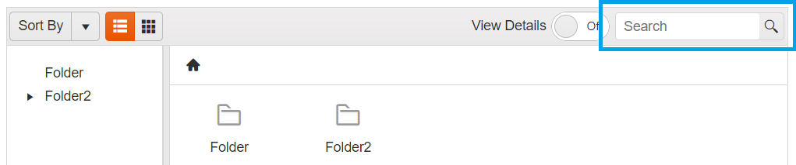

# Search in FileManager

The {{ site.product }} FileManager provides an inbuilt Search functionality, allowing you to find the specific file in the currently selected folder.

**Inbuilt Search textbox in FileManager:**

## See Also

* [Overview of {{ site.product }} FileManager]()
* [Sort in {{ site.product }} FileManager]()
* [Toolbar Commands in {{ site.product }} FileManager]()
