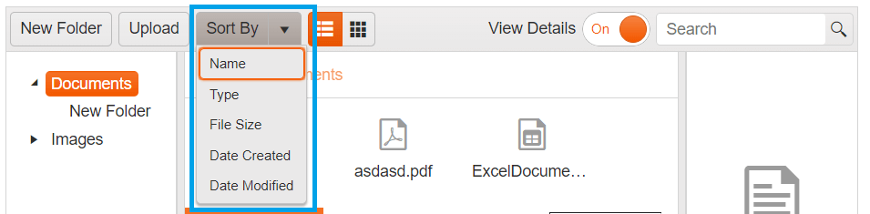

# Sort

The {{ site.product }} FileManager provides an inbuilt Sort functionality, allowing you to sort the files and folders in the currently selected folder.

The tool from the toolbar exposes several options to sort by:

* Name
* Type (extension)
* File Size
* Date Created
* Date Modified

**Inbuilt Sort  functionality in FileManager:**

## See Also

* [Overview of {{ site.product }} FileManager]()
* [Views in {{ site.product }} FileManager]()
* [Navigation in {{ site.product }} FileManager]()