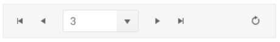

# Pager Overview

The Telerik UI Pager TagHelper for {{ site.framework }} is a server-side wrapper for the Kendo UI Pager widget which enables splitting a set of data into pages with flexible and intuitive UI.

The user interface of the Pager is useful for paging data-bound components that have a [data source]() and do not have a built-in UI for paging such as the ListView or scenarios that require  paging options&mdash;for example, Kendo Templates with a data source.

You can customize the page number templates or use an input for navigation to a specific page, toggle the visibility of previous and next buttons, include a pagesize dropdown and alter the information messages. The pager API also offers the ability to localize its messages.


* [Demo page for the Pager](https://demos.telerik.com/{{ site.platform }}/pager/tag-helper) 

## Initializing the Pager

To use the Pager, you have to define a standalone data source and pass it by name to the Pager and to the data-bound control that will use it.

The following example demonstrates how to tie a pager to a data source and enable the `page-sizes` functionality.


```html

    <kendo-datasource name="dataSource1" type="DataSourceTagHelperType.Ajax" server-operation="false">
        <transport>
            <read url="@Url.Action("TagHelper_Products_Read", "DataSource")" />
        </transport>
    </kendo-datasource>

    <kendo-pager name="pager1" refresh="true" datasource-id="dataSource1" page-sizes="true">
    </kendo-pager>
```

## Pager Settings and Types

The Pager has two types:

- `numeric`
- `input`

The Pager is `numeric` by default. To configure the number of buttons that will be shown in a numeric pager, use the `button-count` attribute. To configure the pager to accept only use input, set the `numeric` attribute to `false` and the `input` attribute to `true`.

## Responsive

The Kendo UI Pager is responsive by default. To disable the responsive behavior and have all of its elements visible at all times set the `responsive` attribute to `false`. 

The Pager widget determines which internal elements to render based on its width. When the Pager width is greater than or equal to 600 pixels, all elements are visible:

When the Pager width is greater than or equal to 600 pixels, all elements are visible:


When the Pager width is greater than 480 and less than 600 pixels, the label showing the current paging information is hidden:


When the Pager width is greater than 360 and less than 480 pixels, the current page is represented by a native `<select/>` element. The `pageSizes` dropdown and the label showing the current paging information are hidden.


When the Pager width is less than 360 pixels, the current page is represented by a native `<select/>` element. The `pageSizes` dropdown and the label showing the current paging information are hidden.



## Templates

The Kendo UI Pager features templates for its page number links.

To change the look of the currently selected page number, use the `selectTemplate` attribute.

To change the look of the non-selected page number links, use the `linkTemplate` attribute.

## Messages

The Pager provides options for defining the tooltips for its page and navigation links, information text and labels.

To localize the messages, set the desired strings in the `messages` tags.

## Event Handling

### Subscribe to Events

You can subscribe to the [events exposed by Kendo UI Pager](/api/javascript/ui/pager#events) by the handler name.


    <kendo-pager name="pager" on-change="onChange">
    <script>
        function onChange(e) {
            console.log("pager change event");
        }
    </script>

## Reference

### Existing Instances

You are able to reference an existing Pager instance via the [`jQuery.data()`](https://api.jquery.com/jQuery.data/). Once a reference is established, you are able to use the [Pager API](https://docs.telerik.com/kendo-ui/api/javascript/ui/pager#methods) to control its behavior.

    //Put this after your Kendo Pager tag declaration
    <script>
    $(function() {
        // Notice that the name of the Pager is used to get its client-side instance
        var pager = $("#pager").data("kendoPager");
    });
    </script>


## See Also

* [Basic Usage of the Pager (Demo)](https://demos.telerik.com/{{ site.platform }}/pager/index)
* [HtmlHelper Overview](htmlhelpers_pager_aspnet_overview)
* [Basic Usage of the Pager HtmlHelper for {{ site.framework }} (Demo)](https://demos.telerik.com/{{ site.platform }}/pager/index)
* [Pager HtmlHelper Integration for {{ site.framework }}(Demo)](https://demos.telerik.com/{{ site.platform }}/pager/integration)
* [Pager Client-Side API](https://docs.telerik.com/kendo-ui/api/javascript/ui/pager)
* [Pager Server-Side API](/api/pager)
