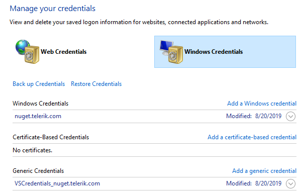

# Troubleshooting Telerik NuGet

This article provides solutions to common issues that you may observe when working with the Telerik NuGet server and the NuGet packages that it provides.

## Issue: The NuGet Package Takes Time to Install or Update on Visual Studio

The NuGet package takes a long time to install or update on Visual Studio. How to improve the installation and update times?

### Solution

* Disable the auto-sync in the `_references.js` file by modifying the following `/// <autosync enabled="false" />` line.
* You can also disconnect the project from the source control before running the Update Wizard.

## Issue: Telerik NuGet Returns 401 Logon Failed after Password Change

After changing your Telerik password, you get `[Telerik Nuget] The V2 feed at '...' returned an unexpected status code '401 Logon failed.'` error in the NuGet Package Manager.

### Solution

After changing your Telerik password, you must reset your credentials in the `NuGet.config` file. To do this, run the `NuGet Sources Update -Name "telerik.com" -Source "https://nuget.telerik.com/v3/index.json" -UserName "your login email" -Password "your new password"` command.

The password must contain only ASCII characters.

As an alternative, you can [reset your Telerik NuGet Feed credentials from the Windows Credentials Manager](#solution-2-windows-credentials-manager)

## Failed to Retrieve Information from Remote Source

Trying to install Telerik.UI.for.AspNet.{{ site.framework_short }} results in an error:

`Failed to retrieve information about 'Telerik.UI.for.AspNet.{{ site.framework_short }}' from remote source 'https://nuget.telerik.com/nuget/FindPackagesById()?id='Telerik.UI.for.AspNet.{{ site.framework_short }}'`

### Solution 

* The Telerik NuGet v2 feed is obsolete and will be deprecated after November 2024. You can use the [use the Telerik NuGet v3 feed]() instead.
* Make sure that the NuGet feed URL is configured correctly.

## Issue: Unable to load the service index for source https://nuget.telerik.com/v3/index.json

Make sure that the Telerik NuGet Feed is live at [https://status.telerik.com/](https://status.telerik.com/).

## Issue: Resetting Telerik NuGet Credentials

On Windows, if you enter and save wrong credentials for the Telerik NuGet or if you change your Telerik credentials, you will not have access to the desired NuGet packages. Before entering the correct user name and password, you must clear the saved credentials.

### Solution 1: Resetting The Credentials in NuGet.config

Try resetting your credentials by using the approach suggested in the [Telerik NuGet returns 401 Logon failed after password change](#issue-telerik-nuget-returns-401-logon-failed-after-password-change). If the credentials are not updated, continue with [Solution 2 below](#solution-2-windows-credentials-manager).

### Solution 2: Windows Credentials Manager

Use the Windows Credentials Manager to remove the saved credentials:

1. In Visual Studio navigate to **Tools** > **NuGet Package Manager** > **Package Manager Settings**. Select **NuGet Package Manager**, click **Package Sources**, and remove the listed Telerik NuGet package source.
1. Close Visual Studio.
1. Open the Windows Credentials Manager. To access it, navigate to **Control Panel** > **User Accounts** > **Credential Manager**.
1. Click **Windows Credentials**.
1. Remove the following saved credentials:
    * `nuget.telerik.com`
    * `VSCredentials_nuget.telerik.com`

1. Add the Telerik NuGet Feed again, and then enter the correct credentials. For more details, refer to the [Installing with NuGet]() article.
1. Verify the NuGet credentials by inspecting the `NuGet.config` file located in `%AppData%\NuGet\NuGet.config`
