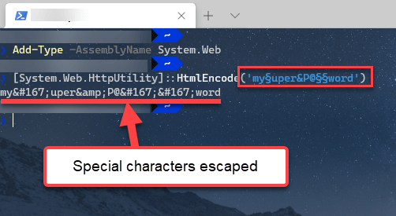

# Telerik NuGet Feed Troubleshooting

This article summarizes the issues that may occur when you work with the {{ site.product }} library and the online [Telerik NuGet feed](), and their solutions.

Regardless of the cause for the issue, it is recommended that you start from the section on the commonly occurring issues.

* [Tips for handling common NuGet issues](#tips-for-handling-common-nuget-issues)
* [Removing stored credentials](#removing-saved-credentials)
* [Error `401 Unauthorized`](#error-401-unauthorized)
* [Error `Unable to find package`](#unable-to-find-package)
* [Error `503 Service Unavailable`](#error-503-service-unavailable)
* [Message about package `version not found`](#package-version-not-found)
* [Error `Unable to resolve ... . PackageSourceMapping is enabled`](#unable-to-resolve-package-due-to-packagesourcemapping)
* [Error `Failed to retrieve information about ... from remote source`](#failed-to-retrieve-information-from-remote-source)

## Telerik NuGet Feed Status

Visit <a href="https://status.telerik.com" target="_blank">status.telerik.com</a> to check the status of the Telerik NuGet server. The top section shows manually logged incidents with possible updates or workaround suggestions. The <a href="https://status.telerik.com/#system-metrics" target="_blank">**System Metrics** section</a> provides real-time automated diagnostics.

## Tips for Handling Common NuGet Issues

The most common reasons for issues with the private Telerik NuGet feed are related to:

* Authentication and credentials.
* Licensing. For example, requesting commercial packages with a trial license or vice-versa.
* Missing or wrong local configuration (`NuGet.Config`).
* Network connectivity issues, including **proxies** and **firewalls**.

Errors like `Unable to load the service index for source https://nuget.telerik.com/v3/index.json` don't indicate the exact cause of the problem. In such cases, check the additional error information which usually provides an error code.

### Verify NuGet Credentials and Package Access

To verify if you can access the Telerik NuGet server and the expected packages, open `https://nuget.telerik.com/v3/search?q=blazor&prerelease=true&skip=0&take=100&semVerLevel=2.0.0` directly in the web browser and enter your Telerik credentials in the prompt.

As a result, you will see a JSON output with the NuGet packages and versions that are available for you. Depending on your license, search for `Telerik.UI.for.AspNet.Core` or `Telerik.UI.for.AspNet.Core.Trial``Telerik.UI.for.AspNet.Mvc5` or `Telerik.UI.for.AspNet.Mvc5.Trial`.

If the above URL does not open, you have either come across a local networking issue or [the NuGet server is down](#error-503-service-unavailable).

If you can access the feed in the browser, but you do not see the packages in Visual Studio, most likely the problem is caused by entering wrong credentials or using a different Telerik account. Ensure your saved credentials are correct. Also, you must not have a `NuGet.Config` file in your project as it may bring in invalid credentials and project-level configuration files override the global ones.

## Removing Saved Credentials

If you suspect that your saved credentials are wrong, use the following steps to remove them from Windows and, then, add the correct ones:

1. Remove the saved credentials in the <a href="https://support.microsoft.com/en-us/windows/accessing-credential-manager-1b5c916a-6a16-889f-8581-fc16e8165ac0" target="_blank">Windows Credential Manager</a>. These credentials will appear as `nuget.telerik.com` or `VSCredentials_nuget.telerik.com` entries.
2. Remove the Telerik NuGet package source from Visual Studio.
3. If you have added the Telerik  package source by NuGet CLI, try to remove it from the CLI by running the following commands:
    * <a href="https://docs.microsoft.com/en-us/dotnet/core/tools/dotnet-nuget-list-source" target="_blank">`dotnet nuget list source`</a>
    * <a href="https://docs.microsoft.com/en-us/dotnet/core/tools/dotnet-nuget-remove-source" target="_blank">`dotnet nuget remove source`</a>
4. Check if you have any credentials stored in `%AppData%\NuGet\Nuget.Config`. If so, remove them.
5. Try to reset the Visual Studio user data by <a href="https://stackoverflow.com/questions/43550797/how-to-force-nuget-to-ask-for-authentication-when-connecting-to-a-private-feed" target="_blank">forcing NuGet to ask for authentication</a>.
6. Restart Visual Studio.
7. Enter the Telerik NuGet package source again through Visual Studio or CLI. If you are using the feed in a .NET Core application, store your credentials as plain text.

## Error 401 Unauthorized

`Error 401 Unauthorized` means that the Telerik NuGet server received invalid credentials. There may be different reasons for that:

* No provided credentials
* Incorrect password
* [Correct password with unescaped special characters](#special-characters-in-the-password)
* Using an invalidated (removed) <a href="https://www.telerik.com/account/downloads/nuget-keys" target="_blank">Telerik NuGet API key</a>, which no longer exists in your Telerik account.
* Using a valid <a href="https://www.telerik.com/account/downloads/nuget-keys" target="_blank">Telerik NuGet API key</a> with the wrong username. It must be `api-key`.

An easy way to verify your credentials is to [access the Telerik NuGet server directly in the web browser](#tips-for-handling-common-nuget-issues). Then, depending on your setup, check or update your credentials in:

* The applicable `NuGet.Config` file. There may be <a href="https://learn.microsoft.com/en-us/nuget/consume-packages/configuring-nuget-behavior" target="_blank">multiple such files on the device</a>.
* [Windows Credential Manager](#removing-saved-credentials)
* In a [CI/CD workflow](#using-only-cli-commands), which [obtains the credentials from a secret](#storing-a-nuget-key).

### Special Characters in the Password

[If your credentials are correct and your license includes the requested product and version](#verify-nuget-credentials-and-package-access), then the password probably contains special characters. You need to escape these characters or the authentication can fail on the NuGet server. For example, a common character you must escape is the ampersand (`&`); however, the character causing the issue may be as unique as the section character (`§`).

To solve the issue:

1. Change the password so that it does not include characters you need to escape.
2. Escape the special characters before storing the credentials. For example, `my§uper&P@§§word` encodes to `my&sect;uper&amp;P@&sect;&sect;word`.

Avoid using an online encoder utility for a password. Instead, use a Powershell command:

````PowerShell.skip-repl
Add-Type -AssemblyName System.Web
[System.Web.HttpUtility]::HtmlEncode('my§uper&P@§§word')
````



## Unable to Find Package

If the error occurs for the `Telerik.UI.for.AspNet.Core``Telerik.UI.for.AspNet.Mvc5` package, it may look like this:


`error NU1101: Unable to find package Telerik.UI.for.AspNet.Core. No packages exist with this id in source(s): nuget.org`

`error NU1101: Unable to find package Telerik.UI.for.AspNet.Mvc5. No packages exist with this id in source(s): nuget.org`


Such an error implies that the [Telerik NuGet source]() is not added or enabled. The possible causes are:

* Missing Telerik NuGet source configuration in the `NuGet.Config` file.
* The correct `NuGet.Config` file is not used, because it is missing or misplaced.

If the error occurs in a Docker scenario, the solution is to copy the `NuGet.Config` file (or configure the NuGet source) explicitly during the Docker image build. You can also <a href="https://learn.microsoft.com/en-us/dotnet/core/tools/dotnet-restore#options" target="_blank">reference the `NuGet.Config` file path explicitly in the `dotnet restore` command</a>.

## Error 503 Service Unavailable

If you get a message like `Unable to load the service index for source` and error `503 (Service unavailable)`, check the Telerik NuGet server health at the <a href="https://status.telerik.com" target="_blank">Telerik live services status page</a>.

In urgent cases, download the NuGet packages from your <a href="https://www.telerik.com/account/downloads/" target="_blank">Telerik Account **Downloads** page</a>. Then, <a href="https://learn.microsoft.com/en-us/nuget/hosting-packages/local-feeds" target="_blank">set up a local NuGet feed</a>.

## Package Version Not Found

You may encounter an error similar to:


`ProjectName depends on Telerik.UI.for.AspNet.Core (>= {{ site.cdnVersion }}) but Telerik.UI.for.AspNet.Core {{ site.cdnVersion }} was not found. An approximate best match of Telerik.UI.for.AspNet.Core 2024.3.1015 was resolved.`

`ProjectName depends on Telerik.UI.for.AspNet.Mvc5 (>= {{ site.cdnVersion }}) but Telerik.UI.for.AspNet.Mvc5 {{ site.cdnVersion }} was not found. An approximate best match of Telerik.UI.for.AspNet.Mvc5 2024.3.1015 was resolved.`


or


`error NU1102: Unable to find package Telerik.UI.for.AspNet.Core with version (>= {{ site.cdnVersion }})`

`error NU1102: Unable to find package Telerik.UI.for.AspNet.Mvc5 with version (>= {{ site.cdnVersion }})`


This error means that version `{{ site.cdnVersion }}` is outside the subscription period of your license.

To solve the issue, use a different version or ask the license holder at your company to assign you another license that includes the desired product version.

## Unable to Resolve Package due to PackageSourceMapping

Incorrect package source mapping can result in errors similar to:

`NU1100 Unable to resolve 'Telerik... (>= ...)' for 'net...'. PackageSourceMapping is enabled, the following source(s) were not considered: ...`

The solution is to check the **Package Source Mapping** settings in Visual Studio, or <a href="https://learn.microsoft.com/en-us/nuget/consume-packages/configuring-nuget-behavior#config-file-locations-and-uses" target="_blank">review all applicable `NuGet.Config` files</a> on the machine. Then, adjust the package source mapping configuration.

## Failed to Retrieve Information from Remote Source

An attempt to use the [obsolete Telerik NuGet v2 feed](#setting-up-the-telerik-nuget-feed) after November 2024 will result in an error:


`Failed to retrieve information about 'Telerik.UI.for.AspNet.Core' from remote source 'https://nuget.telerik.com/nuget/FindPackagesById()?id='Telerik.UI.for.AspNet.Core'.`

`Failed to retrieve information about 'Telerik.UI.for.AspNet.Mvc5' from remote source 'https://nuget.telerik.com/nuget/FindPackagesById()?id='Telerik.UI.for.AspNet.Mvc5'.`


The solution is to [use the Telerik NuGet v3 feed]().

Another possible reason for the same error is an incorrect NuGet feed URL.

## See Also

* [Setting Up the Online Private Telerik NuGet Feed]()
* [CI, CD, Build Server]()