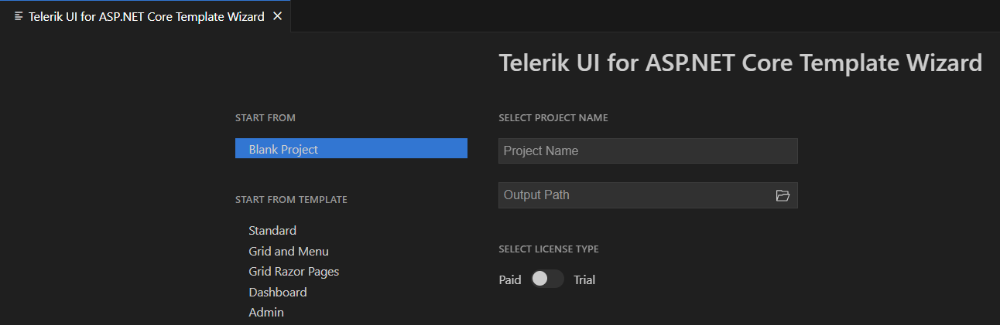
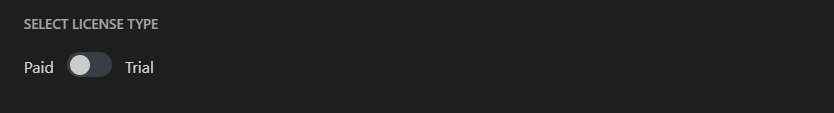
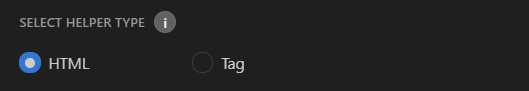
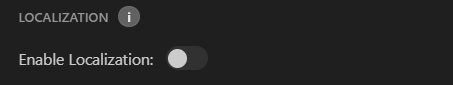
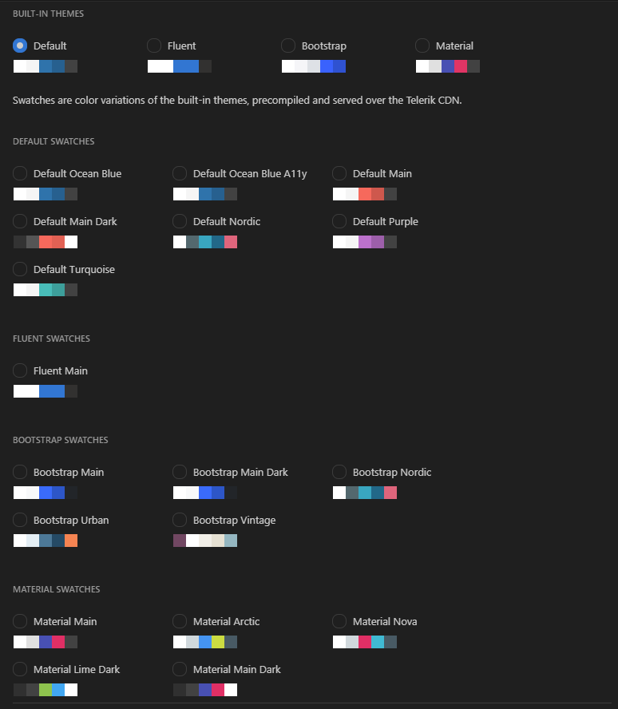

# Telerik UI for {{ site.framework }} Visual Studio Code Integration Overview

The **Telerik UI for ASP.NET Core Productivity Tools** is an extension for [Visual Studio Code](https://code.visualstudio.com/) that enhances the application development experience with Telerik UI for ASP.NET Core.

As its primary advantage, the VS Code extension facilitates the creation of projects through a wizard directly in Visual Studio Code.

## Get Telerik UI for ASP.NET Core Productivity Tools

You can get the extension:

* from the [Visual Studio Marketplace](https://marketplace.visualstudio.com/items?itemName=TelerikInc.aspnetcoretemplatewizard)

* by opening the **Extensions** tab in Visual Studio Code, then searching for **Telerik UI for ASP.NET Core Productivity Tools** and clicking **Install**

## Create a Telerik Project

To create a Telerik-enabled ASP.NET Core project:

1. Press `Ctrl`+`Shift`+`P` in Windows/Linux or `Cmd`+`Shift`+`P` on Mac to open the VSCode extension launcher.

1. Type/Select `Telerik UI for ASP.NET Core Template Wizard: Launch` and press `Enter` to launch the extension.

1. Enter a project name and select the location.

1. Choose whether to start from a [**Blank Project** or use one of the available Telerik project templates](#project-templates) as a base:

    

## Configure the Project

With the template wizard, you can configure the following project options:

* Project template
* License type
* Target framework
* Tag or HTML Helpers
* Localization
* Visual theme

### Project Templates

The following project templates are available:

<table>
    <colgroup>
        <col width="25%"></col>
        <col></col>
    </colgroup>
    <tbody>
        <tr>
            <th>Project</th>
            <th>Description</th>
        </tr>
        <tr>
            <td><strong>Blank Project</strong></td>
            <td>
The Blank template has the package references and the client-side resources loaded in the <code>_Layout.cshtml</code> file. It also features the expected <a href="https://docs.telerik.com/aspnet-core/installation/json-serialization">JSON serialization configuration</a> in the <code>Program.cs</code> file. The default editor templates are included in the <code>~Views\Shared\EditorTemplates</code> folder.
</td>
        </tr>
        <tr>
            <td><strong>Standard</strong></td>
            <td>
The Standard template features:

                <ul>
                    <li> Everything from the <strong>Blank Project<strong>.</li>
                    <li> A Responsive Panel and Menu in <code>_Layout.cshtml</code>.</li>
                    <li> A PanelBar in <code>Index.cshtml</code>.</li>
                    <li> A TabStrip in <code>Contact.cshtml</code>.</li>
                    <li> An HTML styled with <a href="https://docs.telerik.com/{{ site.platform }}/knowledge-base/cards">Cards</a> in <code>About.cshtml</code>.</li>
                </ul>
            </td>
        </tr>
        <tr>
            <td><strong>Grid and Menu</strong></td>
            <td>
The Grid and Menu template features:

                <ul>
                    <li> Everything from the <strong>Blank Project</strong>.</li>
                    <li> Buttons and Grid in <code>Index.cshtml</code>.</li>
                    <li> A Responsive Panel and Menu in <code>_Layout.cshtml</code>.</li>
                </ul>
            </td>
        </tr>
        <tr>
            <td><strong>Grid Razor Pages</strong></td>
            <td>
The Grid Razor Pages template includes everything from the <strong>Blank Project</strong>. It features an editable Grid in the <code>Index.cshtml</code> that uses handlers for the CRUD data operations. The <code>AntiForgeryToken</code> is set up, as well.
</td>
        </tr>
        <tr>
            <td><strong>Dashboard</strong></td>
            <td>
The Dashboard template features:

                <ul>
                    <li> Everything from the <strong>Blank Project</strong> except the editor templates folder.</li>
                    <li> A TileLayout with Charts and Grids in the <code>Index.cshtml</code>, as well as shared DataSource and dynamically populated templates.</li>
                </ul>
            </td>
        </tr>
        <tr>
            <td><strong>Admin</strong></td>
            <td>
The Admin is a Razor Pages template configured with <a href="https://docs.telerik.com/aspnet-core/tag-helpers/overview">TagHelpers</a>. It features:

                <ul>
                    <li>Everything from the <strong>Blank Project</strong>.</li>
                    <li>Authentication functionallity (Registration, Login, and Logout) in <code>Areas/Login/Pages</code>.</li>
                    <li>A navigation that is created by using the <a href="https://docs.telerik.com/aspnet-core/tag-helpers/navigation/drawer/overview">Drawer</a> and <a href="https://docs.telerik.com/aspnet-core/tag-helpers/navigation/appbar/overview">AppBar</a> components.</li>
                    <li>A <a href="https://docs.telerik.com/aspnet-core/tag-helpers/layout/tilelayout/overview">TileLayout</a> with <a href="https://docs.telerik.com/aspnet-core/styles-and-layout/cards">Cards</a>, <a href="https://docs.telerik.com/aspnet-core/tag-helpers/gauges/arcgauge/overview">Arc Gauge</a>, <a href="https://docs.telerik.com/aspnet-core/tag-helpers/charts/overview">Chart</a> and <a href="https://docs.telerik.com/aspnet-core/tag-helpers/data-management/grid/overview">Grid</a> in <code>Index.cshtml</code>.</li>
                    <li>A <a href="https://docs.telerik.com/aspnet-core/tag-helpers/layout/tilelayout/overview">TileLayout</a> with a variety of <a href="https://docs.telerik.com/aspnet-core/tag-helpers/charts/overview">Charts</a> and <a href="https://docs.telerik.com/aspnet-core/tag-helpers/gauges/radialgauge/overview">Gauges</a> in <code>Performance.cshtml</code>.</li>
                    <li>A <a href="https://docs.telerik.com/aspnet-core/tag-helpers/layout/tilelayout/overview">TileLayout</a> with <a href="https://docs.telerik.com/aspnet-core/tag-helpers/charts/overview">Bubble Chart</a> and <a href="https://docs.telerik.com/aspnet-core/html-helpers/data-management/listview/overview">ListView</a> with editable <a href="https://docs.telerik.com/aspnet-core/styles-and-layout/cards">Cards</a> in <code>Products.cshtml</code> as well as <a href="https://docs.telerik.com/aspnet-core/tag-helpers/data-management/pager/overview">Pager</a> and search panel.</li>
                    <li>A <a href="https://docs.telerik.com/aspnet-core/tag-helpers/layout/tilelayout/overview">TileLayout</a> with <a href="https://docs.telerik.com/aspnet-core/tag-helpers/layout/form/overview">Form</a> and <a href="https://docs.telerik.com/aspnet-core/tag-helpers/scheduling/calendar/overview">Calendar</a> in <code>Settings.cshtml</code>.</li>
                </ul>
            </td>
        </tr>
    </tbody>
</table>

### License Type

Select the type of your Telerik license (trial or commercial).

### Target Framework

Choose the desired target framework version.

### Helper Selection

You can choose if you want the template project to use [HtmlHelpers or TagHelpers]() version of the components.

### Localization

If you enable the localization option, the language specific files will be copied to `~/wwwroot/lib/kendo-ui/js/messages/` folder. For more information, refer to the [localization documentation]().

### Themes

You can add styling to your application by selecting one of the [Kendo UI Sass-Based themes]() (Default, Fluent, Bootstrap, or Material) and pick from a variety of swatches that come with each theme. When you make your choice, the wizard will add to the `_Layout.cshtml` only these files that are required by the selected theme.

## Run the Project

After configuring the settings of the project, click **Create Project** to start creating the new {{site.product_short}} application.

To run the project:

1. Open the terminal and navigate to the project folder.
1. Execute `dotnet run` and open the link in the console output in your browser. 

Alternatively, open the solution file with Visual Studio and build the application. Once the NuGet packages get restored and the build passes, you will have your {{ site.product }} project up and running.

## See Also

* [Troubleshooting the Telerik UI for ASP.NET Core Productivity Tools Extension]()