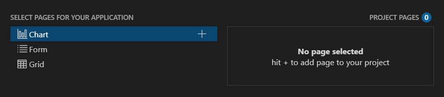

# Visual Studio Code Integration Overview

The **Telerik UI for ASP.NET Core Productivity Tools** is an extension for [Visual Studio Code](https://code.visualstudio.com/) that enhances the application development experience with Telerik UI for ASP.NET Core.

As its primary advantage, the VS Code extension facilitates the creation of projects through a wizard directly in Visual Studio Code.

## Get Telerik UI for ASP.NET Core Productivity Tools

You can get the extension:

* from the [Visual Studio Marketplace](https://marketplace.visualstudio.com/items?itemName=TelerikInc.aspnetcoretemplatewizard)

* by opening the **Extensions** tab in Visual Studio Code, then searching for **Telerik UI for ASP.NET Core Productivity Tools** and clicking **Install**

## Create a Telerik Project

To create a Telerik-enabled ASP.NET Core project:

1. Press `Ctrl`+`Shift`+`P` in Windows/Linux or `Cmd`+`Shift`+`P` on Mac to open the VSCode extension launcher.

1. Type/Select `Telerik UI for ASP.NET Core Productivity Tools: Launch` and press `Enter` to launch the extension.

1. Enter a project name and select the location.

1. Choose whether to start from a [Blank project](#blank-project) or use the [Admin Dashboard](#admin-dashboard) template as a base.

    

## Blank Project

The **Blank Project** has the package references and the client-side resources loaded in the `_Layout.cshtml`. It also features the expected JSON serialization configuration in the `Startup.cs` file. 

Additionally, you can include multiple {{ site.product }} components into your project (for example, the <a href="https://docs.telerik.com/aspnet-core/html-helpers/data-management/grid/overview">Grid</a>, <a href="https://docs.telerik.com/aspnet-core/html-helpers/charts/overview">Chart</a>, and <a href="https://docs.telerik.com/aspnet-core/html-helpers/layout/form/overview">Form</a>).

## Admin Dashboard

The **Admin Dashboard** is a is a Razor Pages template configured with [TagHelpers](). It features:

* Everything from the <strong>Blank Project</strong>.
* Authentication functionallity (Registration, Login, and Logout) in <code>Areas/Login/Pages</code>.
* A navigation that is created by using the <a href="https://docs.telerik.com/aspnet-core/tag-helpers/navigation/drawer/overview">Drawer</a> and <a href="https://docs.telerik.com/aspnet-core/tag-helpers/navigation/appbar/overview">AppBar</a> components.
* A <a href="https://docs.telerik.com/aspnet-core/tag-helpers/layout/tilelayout/overview">TileLayout</a> with <a href="https://docs.telerik.com/aspnet-core/styles-and-layout/cards">Cards</a>, <a href="https://docs.telerik.com/aspnet-core/tag-helpers/gauges/arcgauge/overview">Arc Gauge</a>, <a href="https://docs.telerik.com/aspnet-core/tag-helpers/charts/overview">Chart</a> and <a href="https://docs.telerik.com/aspnet-core/tag-helpers/data-management/grid/overview">Grid</a> in <code>Index.cshtml</code>.
* A <a href="https://docs.telerik.com/aspnet-core/tag-helpers/layout/tilelayout/overview">TileLayout</a> with a variety of <a href="https://docs.telerik.com/aspnet-core/tag-helpers/charts/overview">Charts</a> and <a href="https://docs.telerik.com/aspnet-core/tag-helpers/gauges/radialgauge/overview">Gauges</a> in <code>Performance.cshtml</code>.
* A <a href="https://docs.telerik.com/aspnet-core/tag-helpers/layout/tilelayout/overview">TileLayout</a> with <a href="https://docs.telerik.com/aspnet-core/tag-helpers/charts/overview">Bubble Chart</a> and <a href="https://docs.telerik.com/aspnet-core/html-helpers/data-management/listview/overview">ListView</a> with editable <a href="https://docs.telerik.com/aspnet-core/styles-and-layout/cards">Cards</a> in <code>Products.cshtml</code> as well as <a href="https://docs.telerik.com/aspnet-core/tag-helpers/data-management/pager/overview">Pager</a> and search panel.
* A <a href="https://docs.telerik.com/aspnet-core/tag-helpers/layout/tilelayout/overview">TileLayout</a> with <a href="https://docs.telerik.com/aspnet-core/tag-helpers/layout/form/overview">Form</a> and <a href="https://docs.telerik.com/aspnet-core/tag-helpers/scheduling/calendar/overview">Calendar</a> in <code>Settings.cshtml</code>.

## Configuration

### License Type

Select the type of your Telerik license (trial or commercial, depending on what you have).

### Target Framework

The wizard allows you to select the desired **{{ site.framework }}** version.

### Themes

The **Built-in themes** option enables you to add styling to your application by selecting one of the <a href="https://docs.telerik.com/kendo-ui/styles-and-layout/sass-themes">Sass-Based themes</a> (Default, Bootstrap or Material) and pick from a variety of swatches that come with each theme. When you make your choice, the wizard will add to the `_Layout.cshtml` only these files that are required by the selected theme.

## Run the Project

After configuring the settings of the project, click **Create Project** to start creating the new {{site.product_short}} application.

To run the project:

1. Open the terminal and navigate to the project folder.
1. Execute `dotnet run` and navigate your browser to the link you see in the console output.

Alternatively, you can open the solution file with Visual Studio and build the application. Once the NuGet packages get restored and the build passes, you will have your {{ site.product }} project up and running.

## Troubleshooting

If the extension does not work right (missing pages, does not start, etc.), you can try the following to clean up cache files and get it working again:

1. Uninstall the extension from VS Code.
2. Go to the extensions templates cache folder and delete the `CoreT` folder - this is where cache for the Telerik extensions are kept:
    * on Windows, open `%localappdata%` 
    * on Mac, open `/Users/[user_name]/.local/share/`
3. [Install](https://marketplace.visualstudio.com/items?itemName=TelerikInc.aspnetcoretemplatewizard) the extension again.

If you see `Response status code does not indicate success: 401 (Logon failed.).`, then the Nuget.Config file in `%APPDATA%\NuGet` may contain invalid credentials or keys. For more information check the [Nuget Install article](#setup-with-nuget-cli) or [Nuget Setup with CLI article](#integrating-ui-for-aspnet-core)