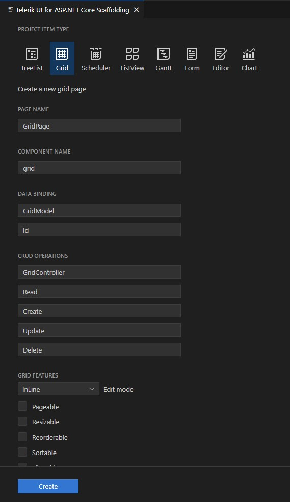

# Visual Studio Code Scaffolder

The {{site.product}} Visual Studio Code Scaffolder allows you to quickly generate Views with some of the most popular components.

The Visual Studio Code Scaffolder is part of the  {{site.product}} Productivity Tools. It aims to simplify the process of adding {{site.product_short}} components to an application. Adding a new View, you can choose from a set of components, like the Grid, Chart, Form, and more, and customize their options.

## Available Components

Using the {{site.product}} Visual Studio Code Scaffolder, you can quickly generate Views with the following components:

* [TreeList]()
* [Grid]()
* [Scheduler]()
* [ListView]()
* [Gantt]()
* [Form]()
* [Editor]()
* [Chart]()

## Adding a Scaffolded View

1. To start the Scaffolder, right click on the `.csproj` file and select **New Telerik UI for ASP.NET Core Project Item...**.

    

1. The **Telerik UI for ASP.NET Core Project Item Generator** will prompt you to select the component you wish to add from the scaffolding wizard. It will allow you to configure multiple component-specific properties and provide customizable options for the scaffolded page.

    

1. Confirming the options will generate a View containing the selected component with the provided configuration options.

For example, if you scaffold a new page with the {{site.product}} Grid component, you can set the CRUD endpoints for the DataSource and enable editing, sorting, filtering, grouping, column resizing, and more Grid settings.

## Using the CLI

The {{site.product}} Visual Studio Code Scaffolder also supports scaffolding items via the CLI. To scaffold a View run `tks <command-name> [options]`. Run `tks <command-name> --help` for a list of available options for each command. The following commands are available:

| Command | Description |
|---|---|
|`core-grid-page`       | Scaffold a Grid View      |
|`core-chart-page`      | Scaffold a Chart View     |
|`core-form-page`       | Scaffold a Form View      |
|`core-listview-page`   | Scaffold a ListView View  |
|`core-gantt-page`      | Scaffold a Gantt View     |
|`core-scheduler-page`  | Scaffold a Scheduler View |

For example, the `tks core-grid-page --help` command will list all available options for scaffolging a Grid View. Running the `tks core-grid-page --name OrdersGrid --component-name grid --model OrderViewModel --columns OrderID Freight ShipAddress OrderDate IsShipped --controller Orders --action-read GetOrders --filterable --pageable --sortable` command will generate an **OrdersGrid.cshtml** file in `~/Views/Orders/` folder with the following configuration:

```HtmlHelper
    @(Html.Kendo().Grid<OrderViewModel>()
        .Name("grid")
        .Columns(columns =>
        {
            columns.Bound(c => c.OrderID);
            columns.Bound(c => c.Freight);
            columns.Bound(c => c.ShipAddress);
            columns.Bound(c => c.OrderDate);
            columns.Bound(c => c.IsShipped);
        
        })
        .Pageable()
        .Sortable()
        .Filterable()
        .HtmlAttributes(new { style = "height:430px;" })
        .DataSource(dataSource => dataSource
            .Ajax()
            .PageSize(20)
            .Read(read => read.Action("GetOrders", "Orders"))
        )
    )
```
