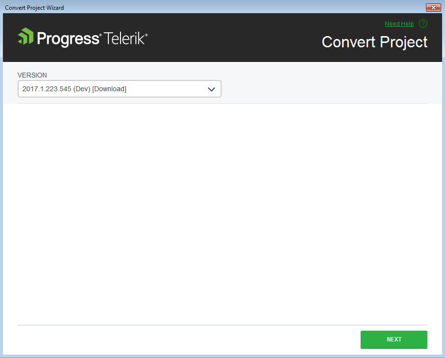
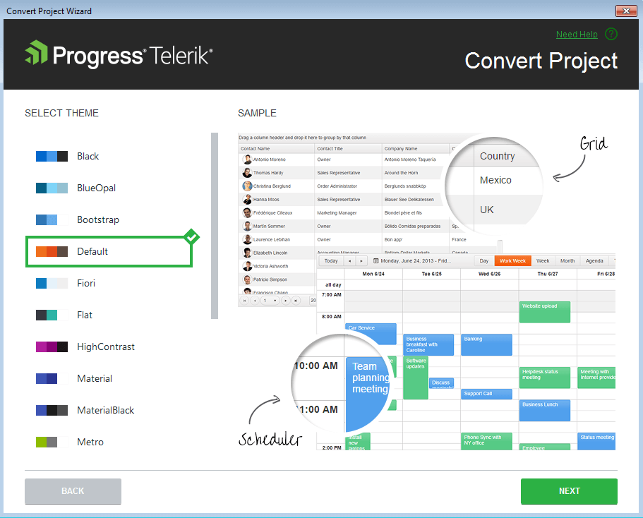

# Converting Projects

This article demonstrates how to convert an existing ASP.NET MVC application to a Progress&reg; Telerik&reg; UI for ASP.NET MVC application&mdash;this allows you to start using the Telerik UI components without additional manual configuration.

## The Basics

The **Convert Project Wizard** converts an existing ASP.NET MVC 4 or 5 to a Telerik UI for ASP.NET MVC application&mdash;an application that is ready to use the Telerik UI components.

To start the **Convert Project Wizard**, select **Extensions** > **Telerik** > **Telerik UI for ASP.NET MVC** > **Convert to Telerik Application**.

The conversion wizard provides the following steps:  
- [Distribution selection](#distribution-selection)
- [Theme selection](#theme-selection)
- [Project settings](#project-settings)

## Distribution Selection

The distribution selection allows you to choose the version of the Telerik UI for ASP.NET MVC you want to use.

## Theme Selection

The theme selection allows you to choose the visual theme for your Telerik UI for ASP.NET MVC application.

## Project Settings

The **Project Settings** page enables you to modify the project settings by configuring the following options:

- **Render Right-To-Left**&mdash;updates the master page with the Right-to-left support class and adds CSS reference for RTL styles.
- **Copy Editor Templates**&mdash;copies the predefined editor templates to `~/Views/Shared/EditorTemplates`. Existing editor templates will be overwritten.
- **Copy Global Resources**&mdash;copies the localization files to `~/Scripts/kendo/{version}/cultures`.
- **Use CDN Support**&mdash;enables or disables the [Kendo UI CDN support](https://docs.telerik.com/kendo-ui/intro/installation/cdn-service).

## Conversion of Existing Telerik MVC Extensions Projects

You can convert an existing Telerik MVC Extensions project by using the **Convert Project Wizard**. This adds the Kendo UI components to the project without removing the existing Telerik MVC Extensions content. For compatibility reasons, the Kendo UI Convert Wizard will attempt to disable the Telerik MVC Extensions embedded jQuery usage because it might interfere with the Kendo UI jQuery inclusion.

## See Also

* [Integrating Visual Studio in Your .Net Project]()
* [Downloading the Latest Telerik UI for ASP.NET Core Versions]()
