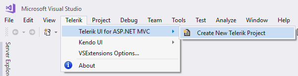
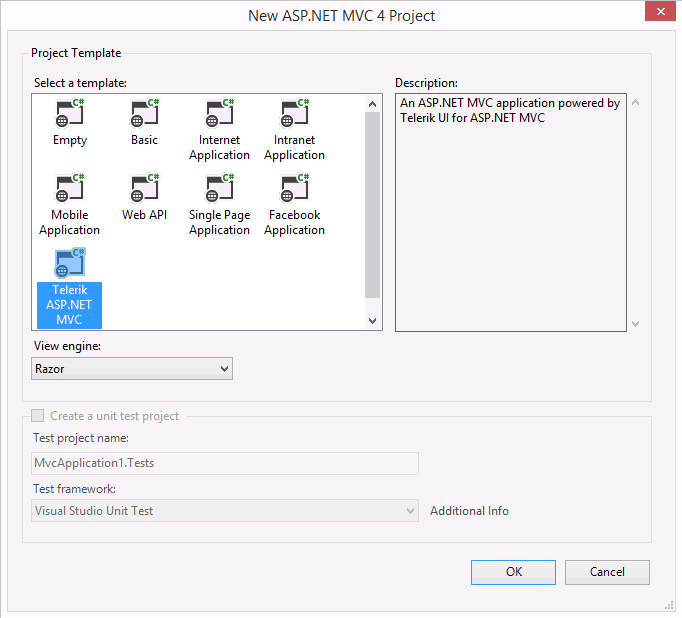

# Visual Studio Integration Overview

To integrate with Visual Studio, Telerik provides the Progress&reg; Telerik&reg; UI for ASP.NET MVC Visual Studio (VS) Extensions. They enhance the experience in developing MVC web applications with Telerik UI for ASP.NET MVC.





The extensions provide wizards that allow you to automate the following procedures:

* [Project Creation]()&mdash;allows you to use pre-configured project templates and quickly deploy popular components like Grid and Menu or even entire Dashboard applications.
* [Project Conversion]()&mdash;automatically configures an already existing ASP.NET MVC application to use the Telerik UI components.
* [Project Configuration]()&mdash;allows you to change the visual theme and to configure the right-to-left support, localization, and CDN use in existing projects that are already configured to use the Telerik UI components.
* [Project Upgrade]()&mdash;upgrades an existing project to a new Telerik UI for ASP.NET MVC version.

## Installing and Using the Extensions

To install the Telerik UI for ASP.NET MVC Visual Studio Extensions, run the [Telerik UI for ASP.NET MVC installer]() and verify that the Visual Studio Extensions are selected for installation. They support Visual Studio 2022, 2019, 2017, 2015, 2013 and 2012.

> VS Express editions are not supported.

To access the VS Extensions go to **Telerik** > **Telerik UI for ASP.NET MVC**. The menu items vary depending on the selected project in VS. Additionally, you can access the extensions through the Solution Explorer context menu of any supported ASP.NET MVC Web Application project.

When installed, the extensions add Telerik UI project templates to the New Project dialog in VS:

* C# Telerik UI for ASP.NET MVC web application
* VB Telerik UI for ASP.NET MVC web application

These templates are available in the language-specific nodes of the dialog as well. The **Add New Project** dialog contains the Telerik UI for ASP.NET MVC web application under both the `CSharp\Web` and `Visual Basic\Web` nodes.

The following additional project templates are also available:

* [C# Telerik ASP.NET Core MVC application](https://docs.telerik.com/aspnet-core/introduction)
* [Kendo UI ASP.NET MVC 5 application]()

The ASP.NET MVC 4 project wizard also contains the Telerik UI for ASP.NET MVC web application.

## See Also

* [Creating New Projects with Visual Studio]()
* [Downloading the Latest Telerik UI for ASP.NET Core Versions]()
