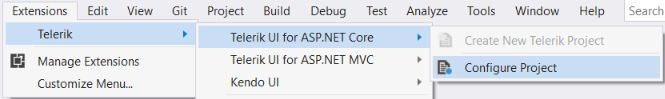
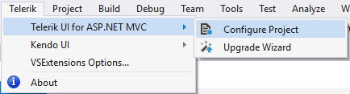
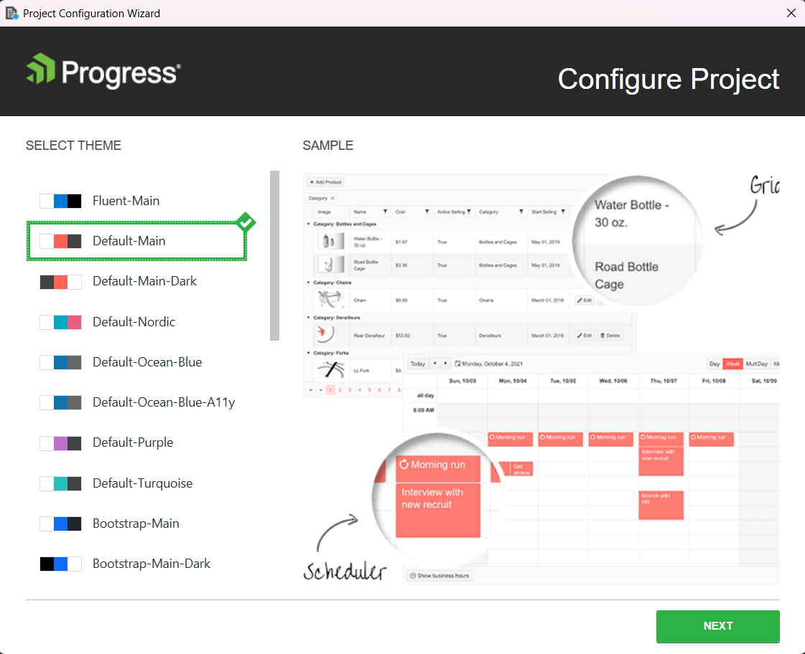
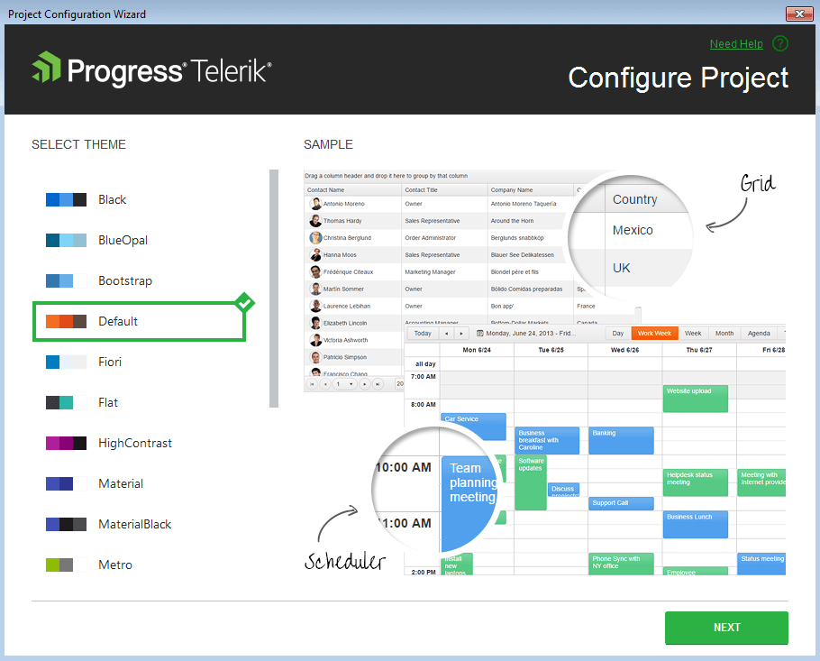
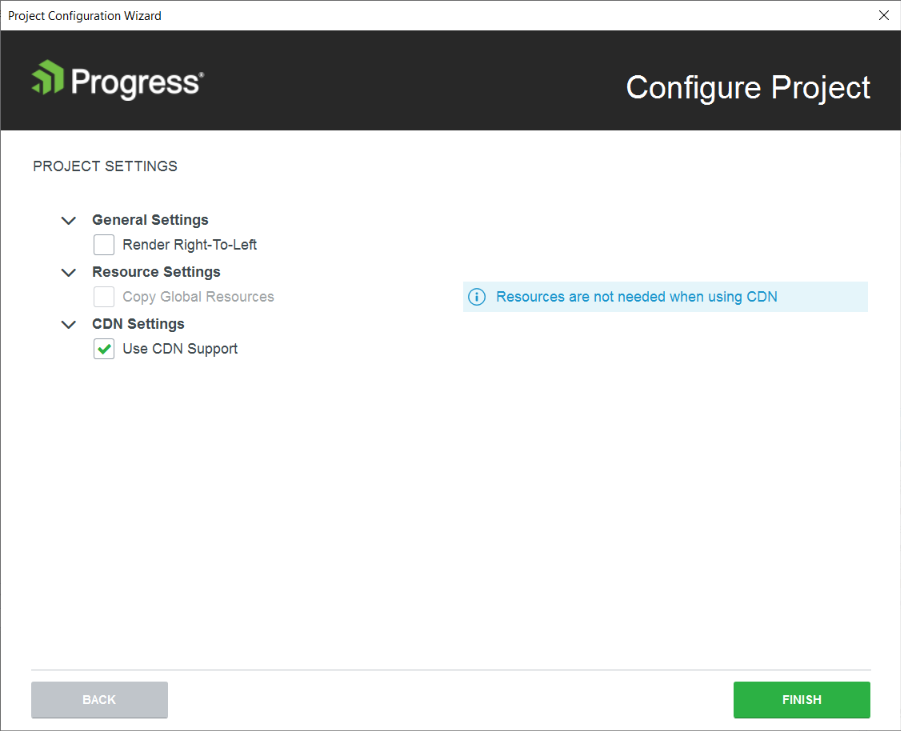
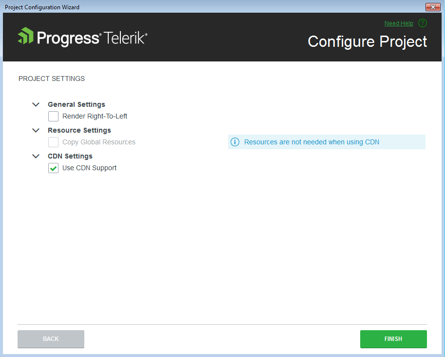

# Configuring Existing {{ site.product }} Projects

This article demonstrates how to configure an existing {{ site.product }} application by using the **Project Configuration Wizard**. The wizard comes with the {{ site.product }} VS extension and helps you to modify settings like visual theme, use of CDN, localization, and right-to-left configuration in an existing project.

To use the wizard, your project must be already [configured as a {{ site.product }} application]() and to use the Telerik UI components.

To open the **Project Configuration Wizard**, click **Extensions** > **Telerik** > **{{ site.product }}** > **Configure Project**.







The configuration wizard handles the following tasks:  
- [Theme selection](#theme-selection)
- [Project settings configuration](#project-settings)

## Theme Selection

The **Theme Selection** page enables you to change the [visual theme](https://docs.telerik.com/kendo-ui/styles-and-layout/appearance-styling#getting-started) of your {{ site.product }} application.







After selecting the desired theme, click **Next** to navigate to the [Project settings](#project-settings) page.

## Project Settings

The **Project Settings** page allows you to modify the project settings by configuring the following options:

- **Render Right-To-Left**&mdash;Updates the master page with the right-to-left (RTL) support class and adds a CSS reference for RTL styles.
- **Copy Global Resources**&mdash;Copies the localization files to `~/wwwroot/lib/kendo-ui/js/messages``~/Scripts/kendo/{version}/cultures`.
- **Use CDN Support**&mdash;Enables or disables the [Kendo UI CDN support](https://docs.telerik.com/kendo-ui/intro/installation/cdn-service).







## See Also

* [Integrating {{ site.product }} in Visual Studio]()
* [Downloading the Latest {{ site.product }} Versions]()
