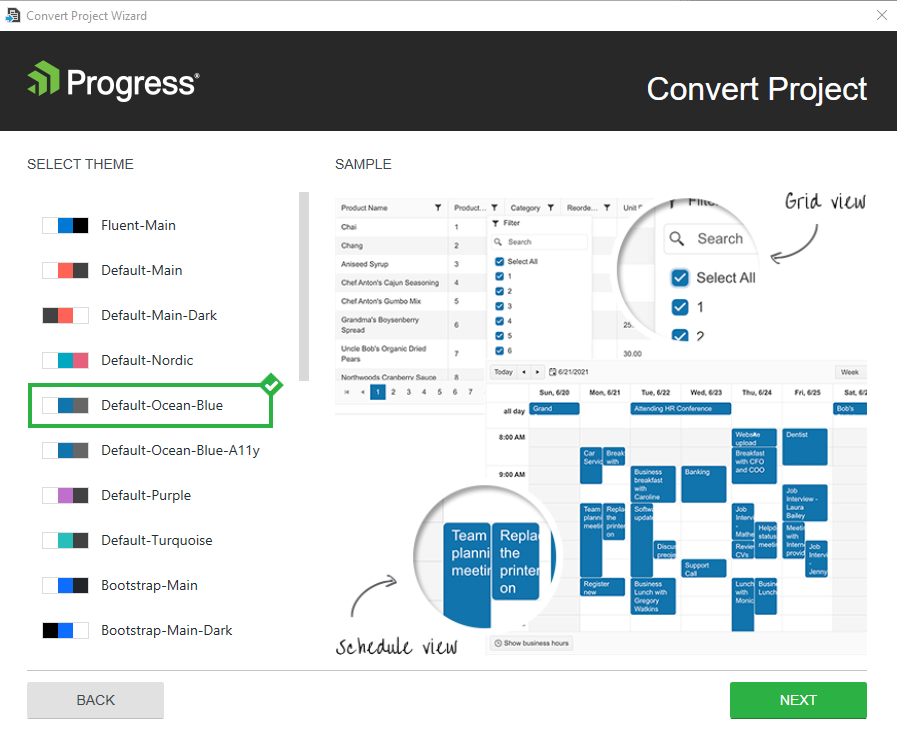

# Adding {{ site.product }} to Existing Projects

Enhance existing {{ site.framework }} applications with Telerik UI Components such as [Grid](), [Chart](), [DropDownList](), and more with a few mouse clicks.

The **Convert Project Wizard** turns an existing ASP.NET CoreASP.NET MVC 5 app into a {{ site.product }} app&mdash;an application that is ready to use the Telerik UI components. The wizard handles the setup of NuGet packages and client-side resources for you. Once complete, you can directly reference a specific release version of the {{ site.product }} in your app. This allows you to start using the Telerik UI components without additional manual configuration.


> The Convert Project Wizard does not support converting Razor Pages projects and projects with .Net version 5.
> The Convert Project Wizard is independent from the Visual Studio version and requires:
 - A .NET Core project version 3.1, 6, 7 or 8
 - The `Microsoft.NET.Sdk.Web` to be included as property of the project file
    ```
        <Project Sdk="Microsoft.NET.Sdk.Web">
            <!-- omitted for brevity -->
        </Project>
    ```
Alternatively, the `Microsoft.NET.Sdk.Web` can be included with the following dependencies as well `Microsoft.AspNetCore`, `Microsoft.AspNetCore.App`, `Microsoft.AspNetCore.All`.


## Using the Convert Project Wizard

To use the **Convert Project Wizard**, install the {{ site.product }} [Visual Studio Extensions](#installing-the-extensions).

To start the wizard, use either the **Extensions** menu in VS or the context menu in the **Solution Explorer**:

- You can start the **Convert Project Wizard** from the Extensions menu at the top. In Visual Studio's Solution Explorer select the project, not the solution, click **Extensions** > **Telerik** > **{{ site.product }}** > **Convert to Telerik Application**.





- Alternatively, use the context menu in the **Solution Explorer**:

    1. In the **Solution Explorer**, select the ASP.NET Core app you want to convert to Telerik Application.
    1. Right-click the project file and select **{{ site.product }}** > **Convert to Telerik Application**.
    1. Follow the wizard.





The conversion wizard provides the following steps:  
- [Version selection](#version-selection)
- [Theme selection](#theme-selection)
- [Project settings](#project-settings)

## Version Selection

The version selection allows you to choose which version of {{ site.product }} to use in your application.







## Theme Selection

The theme selection allows you to choose from a large list of professionally styled built-in themes for your {{ site.product }} application.







## Project Settings

The **Project Settings** page enables you to modify the project settings by configuring the following options:

- **Render Right-To-Left**&mdash;Updates the master page with the Right-to-left support class and adds CSS reference for RTL styles.
- **Copy Editor Templates**&mdash;Copies the predefined editor templates to `~/Views/Shared/EditorTemplates`. Existing editor templates will be overwritten.
- **Copy Global Resources**&mdash;Copies the localization files to `~/wwwroot/lib/kendo-ui/js/messages``~/Scripts/kendo/{version}/cultures`.
- **Use CDN Support**&mdash;Enables or disables the [Kendo UI CDN support](https://docs.telerik.com/kendo-ui/intro/installation/cdn-service).







The wizard automates several steps that are crucial for the project configuration. If you decide to perform these steps manually, follow the links below:

- [Adding the NuGet Package](#adding-the-nuget-package)(#installing-the-nuget-package)

- [Setting for JSON Serialization]() 

- [Adding a reference to Kendo.MVC.UI](#adding-a-reference-to-kendomvcui)(#downloading-and-referencing-the-kendomvcdll-assembly)
- [Including the client-side resources]()


## Conversion of Existing Telerik MVC Extensions Projects

You can convert an existing Telerik MVC Extensions project by using the **Convert Project Wizard**. This adds the Kendo UI components to the project without removing the existing Telerik MVC Extensions content. For compatibility reasons, the Kendo UI Convert Wizard will attempt to disable the Telerik MVC Extensions embedded jQuery usage because it might interfere with the Kendo UI jQuery inclusion.


## See Also

* [Using the CDN Services]()
* [Installing {{ site.product }} with NuGet]()
