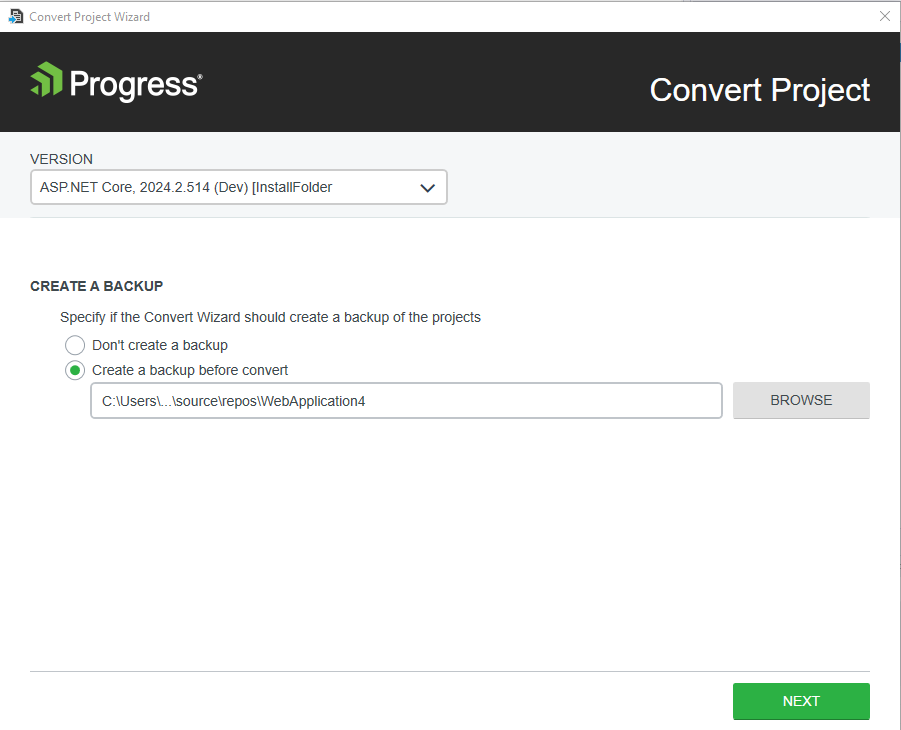

# Adding Telerik UI to Existing Projects

Enhance existing ASP.NET Core applications with Telerik UI Components such as [Grid, Chart, DropDownList, etc.](https://demos.telerik.com/aspnet-core) with just a few mouse clicks.

The Convert Wizard handles the setup of NuGet packages and client-side resources for you. Once complete, you can directly reference a specific release version of the Telerik UI for ASP.NET Core components in your app.

> The Convert Project Wizard does not support converting Razor Pages projects and projects with .Net version 5.

## Using the Convert Project Wizard

To use the **Convert Project Wizard**, install the Telerik UI for ASP.NET Core [Visual Studio Extensions](#installing-the-extensions).

To start the wizard, use either the **Extensions** menu in VS or the context menu in the **Solution Explorer**:

- You can start the **Convert Project Wizard** from the Extensions menu at the top. In Visual Studio 2019, click **Extensions** > **Telerik** > **Telerik UI for ASP.NET Core** > **Convert to Telerik Application**.

- Alternatively, use the context menu in the **Solution Explorer**:

    1. In the **Solution Explorer**, select the ASP.NET Core app you want to convert to Telerik Application.
    1. Right-click the project file and select **Telerik UI for ASP.NET Core** > **Convert to Telerik Application**.
    1. Follow the wizard.

The conversion wizard provides the following steps:  
- [Version selection](#distribution-selection)
- [Theme selection](#theme-selection)
- [Project settings](#project-settings)

## Version Selection

The distribution selection allows you to choose which version of Telerik UI for ASP.NET Core to use in your application.
	

## Theme Selection

The theme selection allows you to choose from a large list of professionally styled built-in themes for your Telerik UI for ASP.NET Core application.

## Project Settings

The **Project Settings** page enables you to modify the project settings by configuring the following options:

- **Render Right-To-Left**&mdash;Updates the master page with the Right-to-left support class and adds CSS reference for RTL styles.
- **Copy Editor Templates**&mdash;Copies the predefined editor templates to `~/Views/Shared/EditorTemplates`. Existing editor templates will be overwritten.
- **Copy Global Resources**&mdash;Copies the localization files to `~/Scripts/kendo/{version}/cultures`.
- **Use CDN Support**&mdash;Enables or disables the [Kendo UI CDN support](https://docs.telerik.com/kendo-ui/intro/installation/cdn-service).

The wizard automates several steps that are crucial for the project configuration. If you decide to perform these steps manually, follow the links below:

- [Adding the NuGet Package](#adding-the-nuget-package)
- [Setting JSON Serialization for ASP.NET Core 2 or 3]() 
- [Adding a reference to Kendo.MVC.UI](#adding-reference-to-kendomvcui)
- [Including the client-side resources](#including-the-telerik-ui-for-aspnet-core-client-side-resources)

## See Also

* [Installing UI for ASP.NET Core by Using the CDN Services]()
* [Installing UI for ASP.NET Core with NuGet]()
