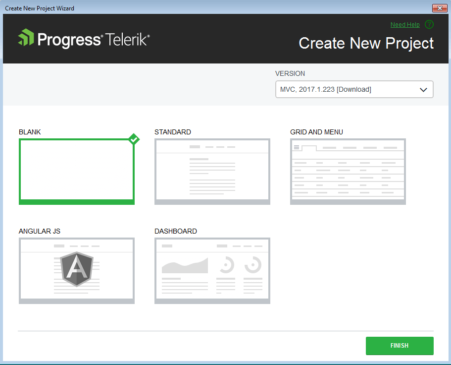

# Creating Kendo UI Projects

This article demonstrates how to create a new ASP.NET MVC 5 application, configured to use Progress&reg; Kendo UI&reg; for jQuery widgets. 

If you want to create an ASP.NET MVC application with Telerik UI for ASP.NET MVC Html helpers, refer to [Creating New Projects]().

## The Basics

>The steps to start the **Create New Project Wizard** may vary between the different Visual Studio versions. The following instructions describe the steps for Visual Studio 2019.

To create a new Kendo UI for jQuery application, start the **Create New Project Wizard** by using either of the following approaches:

* Using the **Extensions** menu in Visual Studio 2019:

    1. Go to the **Extensions** menu.   
    2. Click **Telerik** > **Kendo UI** > **Create New Kendo UI Project**.   

* Using the **File** menu in Visual Studio 2019:

    1. Click **File** > **New** > **Project**.     
    2. In the search field, type `Kendo UI ASP.NET MVC 5`.
    3. Select the **Kendo UI ASP.NET MVC 5 Application** project type and click **Next**.

The wizard detects all the installed versions of Kendo UI and lists them in the **Version** combobox. This enables you to select a version you want to apply to your project.

## Project Settings

The **Create New Project** page enables you to modify the project settings by configuring the following options:

* **Project type**&mdash;choose the desired project type: **Blank**, **Standard**, **Grid and Menu**, **Angular JS**, or **Dashboard**.
* **Version**&mdash;choose the version of Kendo UI you want to use.

## New Web Application Creation

After configuring the project settings, click **Finish** to start the creation of the new Kendo UI Professional application.

As a result, the wizard:

* Creates a new ASP.NET MVC application.
* Copies all Kendo UI scripts.
* Copies all Kendo UI content files.
* Adds references to required scripts in the master page.

## See Also

* [Integrating Visual Studio in Your .Net Project]()
* [Downloading the Latest Telerik UI for ASP.NET Core Versions]()
