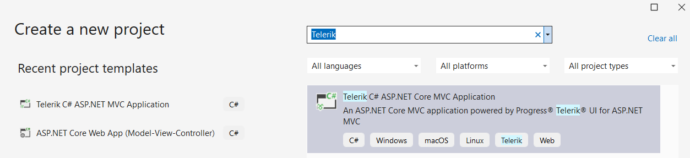
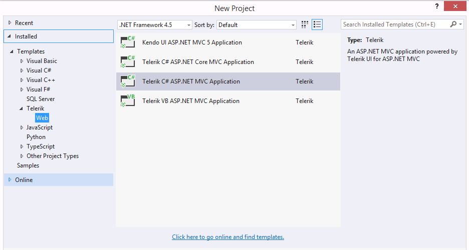

# Telerik UI for {{ site.framework }} Visual Studio Integration Overview

To integrate with Visual Studio, Telerik provides the Progress&reg; Telerik&reg; UI for {{ site.framework }} Visual Studio (VS) Extensions. They enhance the experience in developing web applications with {{ site.product }}.

The VS Extensions come with handy templates that ease the creation of new projects. They also help you add {{ site.product }} to an existing project or upgrade the {{ site.product_short }} version.
The {{ site.product }} VS extensions support VS 2022, 2019 and 2017, and are distributed through the {{ site.product }} installer and the Visual Studio Marketplace.





The VS extensions provide wizards that allow you to automate the following procedures:

* [Project Creation wizard]()&mdash;allows you to use pre-configured project templates that include the required package references and client-side resources. These templates enable the quick deployment of popular components like Grid and Menu or even entire Dashboard applications. With the Project Creation wizard you can:

   * Select between project templates for both helper flavors&mdash;HTML Helpers and Tag Helpers.

   * Select the {{ site.framework }} version and target framework.
   * Select the {{ site.product }} version that you want to use.
* [Project Conversion]()&mdash;automatically configures any already existing {{ site.framework }} application to use the Telerik UI components, and turns it into a complete Telerik application. The wizard lets you select between using CDN or local files for the client-side resources.
* [Project Configuration]()&mdash;allows you to change the visual theme and to configure the right-to-left support, localization, and CDN use in existing projects that are already configured to use the Telerik UI components.
* [Update notifications]()&mdash;the VS Extensions notify you when a new  version of {{ site.product }} is available and allow you to upgrade your applications.
* The Project Creation and Conversion wizards let you select a visual theme so that only the necessary CSS files are included.

## Installing the Extensions

There are three ways to install the VS Extensions: 

* By using the [automated MSI installer](#installing-with-the-msi)
* By installing from the [Visual Studio Marketplace](#installing-from-visual-studio-marketplace)
* By installing [directly from Visual Studio](#installing-in-visual-studio)

### Installing with the MSI

To install the {{ site.product }} Visual Studio Extensions, run the [{{ site.product }} installer]() and verify that the Visual Studio Extensions are selected for installation.

### Installing from Visual Studio Marketplace

Go to the Visual Studio Marketplace and select the desired version:

* For [Visual Studio 2017 and 2019](https://marketplace.visualstudio.com/items?itemName=TelerikInc.TelerikASPNETCoreVSExtensions)(https://marketplace.visualstudio.com/items?itemName=TelerikInc.TelerikASPNETMVCVSExtensions)
* For [Visual Studio 2022](https://marketplace.visualstudio.com/items?itemName=TelerikInc.ProgressTelerikASPNETCoreVSExtensions)(https://marketplace.visualstudio.com/items?itemName=TelerikInc.ProgressTelerikASPNETMVCVSExtensions)

When the download is complete, navigate to the download folder and click on the downloaded `TelerikUI.ASP.NET.Core.VSPackage.vsix``TelerikUI.Mvc.VSPackage.X64.vsix` or `TelerikUI.Mvc.VSPackage.vsix` file to install the extensions.

### Installing in Visual Studio

1. Launch Visual Studio.
1. Select **Extensions** from the top menu. (In Visual Studio 2017, this menu is called **Tools**.)
1. Click **Manage Extensions** from the drop-down menu. (In Visual Studio 2017, this menu is called **Extensions and Updates**.)
1. Click **Online** to the left and select **Visual Studio Marketplace**.
1. In the **Search** text box, enter `Telerik {{ site.framework }} VSExtensions` 
1. Select the extension and click **Download**.
1. Visual Studio will apply the changes automatically once you close all Microsoft Visual Studio windows.

## Using the Telerik VS Extensions in VS 2019

- To access the VS extensions from the VS Toolbar, go to **Extensions > Telerik > {{ site.product }}**. Choose one of the two options -  **Create New Project** or **Convert to Telerik Application**.


    


- To access the template projects, go to **File** > **New** > **Project** and search for `Telerik`.


    


## Using the Telerik VS Extensions in VS 2017

- To access the VS extensions from the VS, go to **Telerik > {{ site.product }}**. Choose from one of the two options -  **Create New Project** or **Convert to Telerik Application**.


    

    
    


- To access the template projects, go to **File** > **New** > **Project** and click on **Installed** > **Telerik** or search for `Telerik` in the search textbox on the right.


    

    

These templates are available in the C# and VB language-specific nodes of the dialog as well. The **Add New Project** dialog contains the Telerik UI for ASP.NET MVC web application under both the `CSharp\Web` and `Visual Basic\Web` nodes.

The following additional project templates are also available:

* [C# Telerik ASP.NET Core MVC application](https://docs.telerik.com/aspnet-core/introduction)
* [Kendo UI ASP.NET MVC 5 application]()

The ASP.NET project wizard also contains the Telerik UI for ASP.NET MVC web application.



## {{ site.product }} Settings

You can find the {{ site.product }} VS Extensions settings in the standard Visual Studio options dialog under the Telerik node.





## See Also

* [Creating New Projects with Visual Studio]()
* [Converting Existing Projects with Visual Studio]()
* [Downloading the Latest {{ site.product }} Version]()
