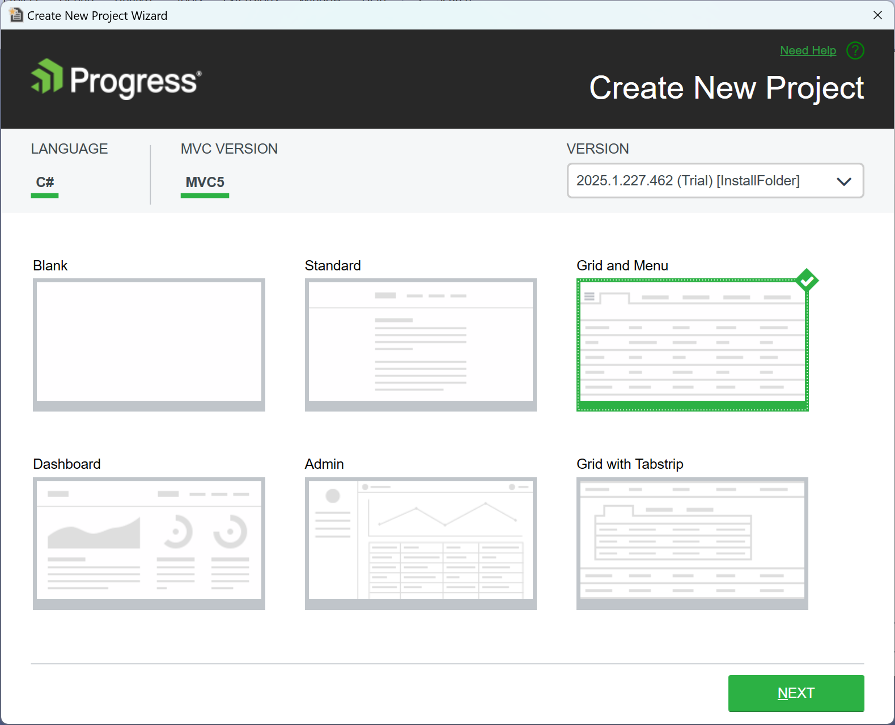

# Creating New {{ site.product }} Projects

This article demonstrates how to create a new {{ site.product }} application by using the templates that come with the Telerik Extensions for Visual Studio. The newly created project will have the required setup that enables you to immediately start using the {{ site.product }} components.

To use the project templates, you start the **Create New Project Wizard** provided by the {{ site.product }} Visual Studio Extensions. With the project templates, you can quickly deploy popular components like Grid and Menu or even entire applications. You don't need to manually [add the client-side resources]()&mdash;the **Create New Project Wizard** handles this task for you.

## Getting the Wizard

To use the **Create New Project Wizard**, [install the {{ site.product }} Extension](#installing-the-extensions).

>If you have an older version of the Telerik Extensions for Visual Studio and you want to create a new {{ site.product }} project with version 2023.1.314 (R1 2023 SP1), or a newer version of the components, you must first update the Telerik Extension. To download and install the latest version of the Telerik Extensions, follow the [Installing from Visual Studio Marketplace](#installing-from-visual-studio-marketplace) instructions.

## Using the Wizard

>The exact steps to start the wizard may vary between the different Visual Studio versions. The following instructions describe the steps for Visual Studio 2022.

To create a new {{ site.product }} application, use the **Create New Project Wizard**. The wizard detects all installed versions of {{ site.product }} and lists them in the **Version** dropdown&mdash;this enables you to apply the desired version to your project.

To start the wizard, use either of the following approaches:

* Using the Visual Studio 2022 **Extensions** menu:

    1. Go to **Extensions** > **Telerik** >  **{{ site.product }}**.
    1. Click **Create New Telerik Project**.


    


* Using the **Project** menu:

    1. Click **File** > **New** > **Project**.
    1. Type **Telerik** in the **Search for templates** textbox. Click on the **Telerik C# ASP.NET Core MVC Application****Telerik ASP.NET MVC Application**.


    

## Configuring the Project

With the **Create New Project Wizard** you can select the desired:

* Target framework
* Tag or HTML Helpers
* Telerik UI Version
* Project Template
* Visual Theme

### Essentials

#### Target Framework

The **Create New Project Wizard** allows you to select a target **Framework**.

>Note
>
>If the target **Framework** dropdown is disabled check the troubleshooting [section](#the-target-framework-dropdown-is-disabled).

#### ASP.NET Core helper

You can choose if you want the template project to use [HtmlHelpers or TagHelpers]() in its Views.
In this article, we use the **HTML** option.

#### Select Version

The Project wizard allows you to select the desired version of {{ site.product_short }}. If a newer version is available but it is not downloaded on the machine, you can get it without exiting the wizard.

### Available Templates

The following project templates are available:

<table>
    <colgroup>
        <col width="25%"></col>
        <col></col>
    </colgroup>
    <tbody>
        <tr>
            <th >Project</th>
            <th>Description</th>
        </tr>
        <tr>
            <td><strong>Blank</strong></td>
            <td>
The Blank template allows you to quickly scaffold Telerik UI for ASP.NET Core applications.

The template has the package references and the client-side resources loaded in the <code>_Layout.cshtml</code> file. It also features the expected <a href="https://docs.telerik.com/{{ site.platform }}/installation/json-serialization">JSON serialization configuration</a> in the <code>Program.cs</code> file. The default editor templates are included in the <code>~Views\Shared\EditorTemplates</code> folder.
</td>
        </tr>
        <tr>
            <td><strong>Standard</strong></td>
            <td>
The Standart template lets you jump quickly into three example pages with integrated PanelBar, Cards, and TabStrip components.

The Standard template features:

                <ul>
                    <li> Everything from the <strong>Blank Project<strong>.</li>
                    <li> A Responsive Panel and Menu in <code>_Layout.cshtml</code>.</li>
                    <li> A PanelBar in <code>Index.cshtml</code>.</li>
                    <li> A TabStrip in <code>Contact.cshtml</code>.</li>
                    <li> An HTML styled with <a href="https://docs.telerik.com/{{ site.platform }}/knowledge-base/cards">Cards</a> in <code>About.cshtml</code>.</li>
                </ul>
            </td>
        </tr>
        <tr>
            <td><strong>Grid with TabStrip</strong></td>
            <td>
This template illustrates the usage of Grid and TabStrip components in an application running in strict CSP mode.

Grid with TabStrip template features:

                <ul>
                    <li> A Menu in <code>_Layout.cshtml</code>.</li>
                    <li> A Detail Grid with a TabStrip in <code>Index.cshtml</code>.</li>
                    <li> A Child Grid in <code>_Child_Grid.cshtml</code>.</li>
                    <li> A <a href='https://docs.telerik.com/{{ site.platform }}/html-helpers/helper-basics/deferred-initialization#deferring-components-globally' target="_blank">DeferredToScriptFiles</a> setting in <code>Program.cs</code>.
                    </li>
                    <li>
                       A <code>KendoDeferredScripts</code> Middleware in <code>Program.cs</code>.
                    </li>
                </ul>
            </td>
        </tr>
        <tr>
            <td><strong>Grid and Menu</strong></td>
            <td>
The Grid and Menu template contains a Grid, Menu, and Buttons as a starting point for your Telerik UI for ASP.NET Core application.

The Grid and Menu template features:

                <ul>
                    <li> Everything from the <strong>Blank Project</strong>.</li>
                    <li> Buttons and Grid in <code>Index.cshtml</code>.</li>
                    <li> A Responsive Panel and Menu in <code>_Layout.cshtml</code>.</li>
                </ul>
            </td>
        </tr>
        <tr>
            <td><strong>Grid Razor Pages</strong></td>
            <td>
The Grid Razor Pages template includes everything from the <strong>Blank Project</strong>. It features an editable grid in <code>Index.cshtml</code> that uses handlers for the CRUD data operations. The <code>AntiForgeryToken</code> is set up, as well.
</td>
        </tr>
        <tr>
            <td><strong>Dashboard</strong></td>
            <td>
The Dashboard template lets you quickly develop dashboards and dashboard-like applications using the built-in TileLayout, Charts, and Grid components.

The Dashboard template features:

                <ul>
                    <li> Everything from the <strong>Blank Project</strong> except the editor templates folder.</li>
                    <li> A TileLayout with Charts and Grids in the <code>Index.cshtml</code> as well as shared DataSource and dynamically populated templates.</li>
                </ul>
            </td>
        </tr>
        <tr>
            <td><strong>Admin</strong></td>
            <td>
The Admin template lets you jump quickly into the action of a complete app developed using Telerik UI for ASP.NET Core.

The Admin is a Razor Pages template configured with <a href="https://docs.telerik.com/aspnet-core/tag-helpers/overview">TagHelpers</a>. It features:

                <ul>
                    <li>Everything from the <strong>Blank Project</strong>.</li>
                    <li>Authentication functionallity (Registration, Login, and Logout) in <code>Areas/Login/Pages</code>.</li>
                    <li>A navigation that is created by using the <a href="https://docs.telerik.com/aspnet-core/tag-helpers/navigation/drawer/overview">Drawer</a> and <a href="https://docs.telerik.com/aspnet-core/tag-helpers/navigation/appbar/overview">AppBar</a> components.</li>
                    <li>A <a href="https://docs.telerik.com/aspnet-core/tag-helpers/layout/tilelayout/overview">TileLayout</a> with <a href="https://docs.telerik.com/aspnet-core/styles-and-layout/cards">Cards</a>, <a href="https://docs.telerik.com/aspnet-core/tag-helpers/gauges/arcgauge/overview">Arc Gauge</a>, <a href="https://docs.telerik.com/aspnet-core/tag-helpers/charts/overview">Chart</a> and <a href="https://docs.telerik.com/aspnet-core/tag-helpers/data-management/grid/overview">Grid</a> in <code>Index.cshtml</code>.</li>
                    <li>A <a href="https://docs.telerik.com/aspnet-core/tag-helpers/layout/tilelayout/overview">TileLayout</a> with a variety of <a href="https://docs.telerik.com/aspnet-core/tag-helpers/charts/overview">Charts</a> and <a href="https://docs.telerik.com/aspnet-core/tag-helpers/gauges/radialgauge/overview">Gauges</a> in <code>Performance.cshtml</code>.</li>
                    <li>A <a href="https://docs.telerik.com/aspnet-core/tag-helpers/layout/tilelayout/overview">TileLayout</a> with <a href="https://docs.telerik.com/aspnet-core/tag-helpers/charts/overview">Bubble Chart</a> and <a href="https://docs.telerik.com/aspnet-core/html-helpers/data-management/listview/overview">ListView</a> with editable <a href="https://docs.telerik.com/aspnet-core/styles-and-layout/cards">Cards</a> in <code>Products.cshtml</code> as well as <a href="https://docs.telerik.com/aspnet-core/tag-helpers/data-management/pager/overview">Pager</a> and search panel.</li>
                    <li>A <a href="https://docs.telerik.com/aspnet-core/tag-helpers/layout/tilelayout/overview">TileLayout</a> with <a href="https://docs.telerik.com/aspnet-core/tag-helpers/layout/form/overview">Form</a> and <a href="https://docs.telerik.com/aspnet-core/tag-helpers/scheduling/calendar/overview">Calendar</a> in <code>Settings.cshtml</code>.</li>
                </ul>
            </td>
        </tr>
    </tbody>
</table>



### Available Templates

The following project templates are available:

<table>
    <colgroup>
        <col width="25%"></col>
        <col></col>
    </colgroup>
    <tbody>
        <tr>
            <th >Project</th>
            <th>Description</th>
        </tr>
        <tr>
            <td><strong>Blank</strong></td>
            <td>
The Blank template allows you to quickly scaffold Telerik UI for ASP.NET MVC applications.

The Blank template has the package references and the client-side resources loaded in the <code>_Layout.cshtml</code> file. The default editor templates are included in the <code>~Views\Shared\EditorTemplates</code> folder.
</td>
        </tr>
        <tr>
            <td><strong>Standard</strong></td>
            <td>
The Standart template lets you jump quickly into three example pages with integrated PanelBar, Cards, and TabStrip components.

The Standard template features:

                <ul>
                    <li> Everything from the <strong>Blank Project<strong>.</li>
                    <li> A Responsive Panel and Menu in <code>_Layout.cshtml</code>.</li>
                    <li> A PanelBar in <code>Index.cshtml</code>.</li>
                    <li> A TabStrip in <code>Contact.cshtml</code>.</li>
                    <li> An HTML styled with <a href="https://docs.telerik.com/{{ site.platform }}/knowledge-base/cards">Cards</a> in <code>About.cshtml</code>.</li>
                </ul>
            </td>
        </tr>
        <tr>
            <td><strong>Grid with TabStrip</strong></td>
            <td>
This template illustrates the usage of Grid and TabStrip components in an application running in strict CSP mode.

Grid with TabStrip template features:

                <ul>
                    <li> A Menu in <code>_Layout.cshtml</code>.</li>
                    <li> A Detail Grid with a TabStrip in <code>Index.cshtml</code>.</li>
                    <li> A Child Grid in <code>_Child_Grid.cshtml</code>.</li>
                    </li>
                </ul>
            </td>
        </tr>
        <tr>
            <td><strong>Grid and Menu</strong></td>
            <td>
The Grid and Menu template contains a Grid, Menu, and Buttons as a starting point for your Telerik UI for ASP.NET MVC application.

The Grid and Menu template features:

                <ul>
                    <li> Everything from the <strong>Blank Project</strong>.</li>
                    <li> Buttons and Grid in <code>Index.cshtml</code>.</li>
                    <li> A Responsive Panel and Menu in <code>_Layout.cshtml</code>.</li>
                </ul>
            </td>
        </tr>
        <tr>
            <td><strong>Dashboard</strong></td>
            <td>
The Dashboard template lets you quickly develop dashboards and dashboard-like applications using the built-in TileLayout, Charts, and Grid components.

The Dashboard template features:

                <ul>
                    <li> Everything from the <strong>Blank Project</strong> except the editor templates folder.</li>
                    <li> A TileLayout with Charts and Grids in the <code>Index.cshtml</code> as well as shared DataSource and dynamically populated templates.</li>
                </ul>
            </td>
        </tr>
        <tr>
            <td><strong>Admin</strong></td>
            <td>
The Admin Dashboard template lets you jump quickly into the action of a complete app developed using Telerik UI for ASP.NET MVC. It features:

                <ul>
                    <li>Everything from the <strong>Blank Project</strong>.</li>
                    <li>Authentication functionallity (Registration, Login, and Logout) in <code>Views/Account</code>.</li>
                    <li>A navigation that is created by using the <a href="https://docs.telerik.com/aspnet-mvc/html-helpers/navigation/drawer/overview">Drawer</a> and <a href="https://docs.telerik.com/aspnet-mvc/html-helpers/navigation/appbar/overview">AppBar</a> components.</li>
                    <li>A <a href="https://docs.telerik.com/aspnet-mvc/html-helpers/layout/tilelayout/overview">TileLayout</a> with <a href="https://www.telerik.com/aspnet-mvc/documentation/styles-and-layout/cards">Cards</a>, <a href="https://docs.telerik.com/aspnet-mvc/html-helpers/gauges/arcgauge/overview">Arc Gauge</a>, <a href="https://docs.telerik.com/aspnet-mvc/html-helpers/charts/overview">Chart</a> and <a href="https://docs.telerik.com/aspnet-mvc/html-helpers/data-management/grid/overview">Grid</a> in <code>Index.cshtml</code>.</li>
                    <li>A <a href="https://docs.telerik.com/aspnet-mvc/html-helpers/layout/tilelayout/overview">TileLayout</a> with a variety of <a href="https://docs.telerik.com/aspnet-mvc/html-helpers/charts/overview">Charts</a> and <a href="https://docs.telerik.com/aspnet-mvc/html-helpers/gauges/radialgauge/overview">Gauges</a> in <code>Performance.cshtml</code>.</li>
                    <li>A <a href="https://docs.telerik.com/aspnet-mvc/html-helpers/layout/tilelayout/overview">TileLayout</a> with <a href="https://docs.telerik.com/aspnet-mvc/html-helpers/charts/overview">Bubble Chart</a> and <a href="https://docs.telerik.com/aspnet-mvc/html-helpers/data-management/listview/overview">ListView</a> with editable <a href="https://www.telerik.com/aspnet-mvc/documentation/styles-and-layout/cards">Cards</a> in <code>Products.cshtml</code> as well as <a href="https://docs.telerik.com/aspnet-mvc/html-helpers/data-management/pager/overview">Pager</a> and search panel.</li>
                    <li>A <a href="https://docs.telerik.com/aspnet-mvc/html-helpers/layout/tilelayout/overview">TileLayout</a> with <a href="https://docs.telerik.com/aspnet-mvc/html-helpers/layout/form/overview">Form</a> and <a href="https://docs.telerik.com/aspnet-mvc/html-helpers/scheduling/calendar/overview">Calendar</a> in <code>Settings.cshtml</code>.</li>
                </ul>
            </td>
        </tr>
    </tbody>
</table>



> Starting with version 2025 Q1, all templates enforce strict CSP mode.

### Themes

The **Select Theme** option allows you to preview the available Kendo UI themes and select the desired one. After selecting a theme, the project will include only the files that are required by the selected theme in the `_Layout.cshtml`.

## Creating the Application

After configuring the settings of the project, click **Finish** to start creating the new {{ site.product }} application.

As a result, the wizard:

* Creates a new {{ site.framework }} application.
* Adds CDN references for the Kendo UI styles and scripts to the `_Layout.cshtml` file of the project.
* Copies all Kendo UI editor templates.

* Adds a package reference to the `Telerik.UI.for.AspNet.Core` NuGet package.

* (Optional) Copies the `Kendo.Mvc` assembly to your solution folder&mdash;it is possible to change this setting in the [Visual Studio Extensions Options]().
* Adds a reference to the `Kendo.Mvc` assembly.


The wizard creates a `Templates` folder in the root of the application. By default, the `Templates` folder is not visible and is not included in the project. To display it, select the **Show All Files** button in the **Solution Explorer** of Visual Studio.


## Custom Modernizr

The Telerik UI ASP.NET MVC application includes a custom stripped-down Modernizr in a file called `kendo.modernizr.custom.js`. It provides HTML5 element support for old browsers, specifically Internet Explorer.

If you need the Modernizr in your application, remove the existing Modernizr and register another version which includes more components and features. In such cases, if HTML5 element support is required, include the `html5shiv` component to make sure that the newly registered Modernizr [provides such support](http://modernizr.com/docs/#html5inie).

## Swatches

When you select a theme, you can select between three main themes: Default, Bootstrap, and Material. In addition to the styles of the main theme, you can select a specific swatch. A swatch is a set of variables which customize the appearance of the selected main visual theme.

* [Using the Build Process of the Themes]()
* [How Do I Know Which SASS Theme Corresponds to My Current LESS Theme?](https://docs.telerik.com/aspnet-mvc/styles-and-layout/less-themes-migration#how-do-i-know-which-sass-theme-corresponds-to-my-current-less-theme)


## Install or Update License Key

If necessary, the Telerik Visual Studio extension will notify you about a missing or outdated [license key](), and will install or update it.

## See Also

* [Converting Existing Projects with Visual Studio]()
* [Integrating Visual Studio in Your .Net Project (Overview)]()
* [Downloading the Latest {{ site.product }} Versions]()
