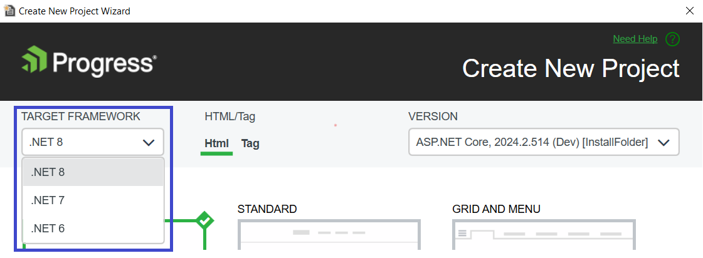
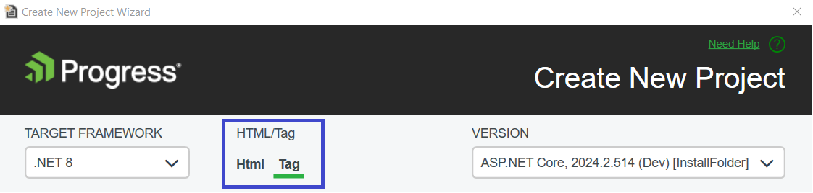
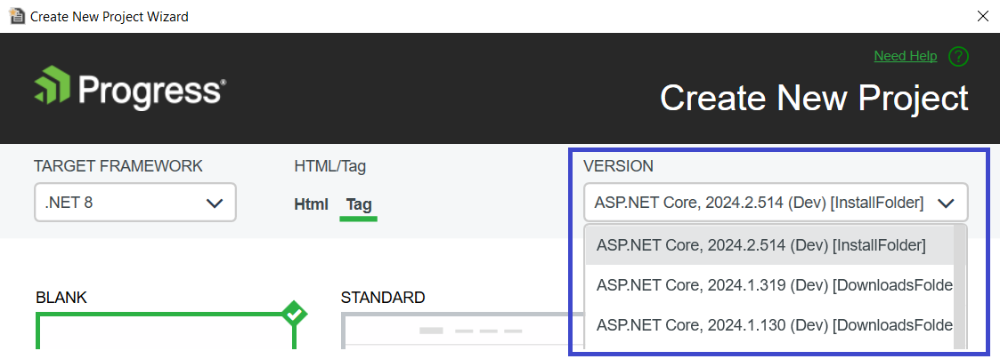
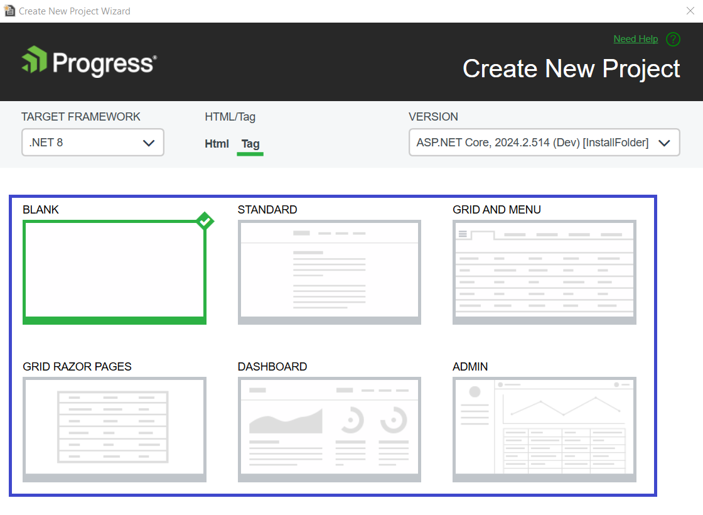
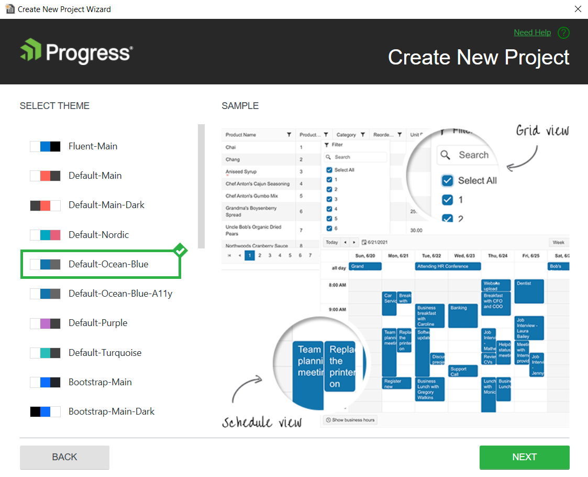

# Creating New Projects

This article demonstrates how to create a new {{ site.product_long }} application by using the templates that come with the Telerik Extensions for Visual Studio. The newly created project will have the required setup that enables you to immediately start using the Telerik&reg; UI for ASP.NET Core components.

To use the project templates, you start the **Create New Project Wizard** provided by the Telerik UI for ASP.NET Core Visual Studio Extensions. With the project templates, you can quickly deploy popular components like Grid and Menu or even entire applications. You don't need to manually [add the client-side resources]()&mdash;the **Create New Project Wizard** handles this task for you.

## Getting the Wizard

To use the **Create New Project Wizard**, install the {{ site.product_long }} Extension. You can get it from:

* The Visual Studio Marketplace
    * [Download link for Visual Studio 2017 and 2019](https://marketplace.visualstudio.com/items?itemName=TelerikInc.TelerikASPNETCoreVSExtensions)
    * [Download link for Visual Studio 2022](https://marketplace.visualstudio.com/items?itemName=TelerikInc.ProgressTelerikASPNETCoreVSExtensions)
* The {{ site.product }} [automated installer]()
* Your [Telerik.com account](https://www.telerik.com/account/product-download?product=UIASPCORE)

## Using the Wizard

To create a new {{ site.product }} application, use the **Create New Project Wizard**. The wizard detects all installed versions of {{ site.product }} and lists them in the **Version** dropdown&mdash;this enables you to apply the desired version to your project.

To start the wizard, use either of the following approaches:

* Using the Visual Studio 2019 **Extensions** menu:

    1. Go to **Extentions** > **Telerik** >  **Telerik UI for ASP.NET Core**
    1. Go to the Telerik menu.
    1. Click **Create New Telerik Project**.

    

* Using the **Project** menu:

    1. Click **File** > **New** > **Project**.
    1. Type **Telerik** in the **Search for templates** textbox. Click on the **Telerik ASP.NET Core MVC Telerik Application**.

    

## Configuring the Project

With the **Create New Project Wizard** you can select the desired:

* Target framework
* .NET Core version
* Tag or HTML Helpers
* Telerik UI Version
* Project Template
* Visual Theme

### Target Framework

The **Create New Project Wizard** allows you to select a target **Framework**. 

>Note
> 
>If the target **Framework** dropdown is disabled check the troubleshooting [section](#the-target-framework-dropdown-is-disabled).

### .NET Core version

Click on the desired **{{ site.framework }}** version.

### Helper Selection

You can choose if you want the template project to use [HtmlHelpers or TagHelpers]() in its Views.
In this article, we use the **Tag** option.

### {{ site.product_short}} version

The Project wizard allows you to select the desired version of {{ site.product_short }}. If there is a newer version available that is not downloaded on the machine, you can obtain it without exiting the wizard.

### Available Templates

The following project templates are available:

<table>
    <colgroup>
        <col width="25%"></col>
        <col></col>
    </colgroup>
    <tbody>
        <tr>
            <th >Project</th>
            <th>Description</th>
        </tr>
        <tr>
            <td><strong>Blank</strong></td>
            <td>The Blank template has the package references and the client-side resources loaded in the view. It also features the expected JSON serialization configuration in the <code>Startup.cs</code> file. 
The Kendo Editor templates are included in the <code>~Views\Shared\EditorTemplates folder</code>.</td>
        </tr>
        <tr>
            <td><strong>Standard</strong></td>
            <td>
The Standard template features:

                <ul>
                    <li> Everything from the <strong>Blank Project<strong>.</li>
                    <li> Responsive Panel and Menu in <code>_Layout.cshtml</code>.</li>
                    <li> PanelBar in <code>Index.cshtml</code>.</li>
                    <li> TabStrip in <code>Contact.cshtml</code>.</li>
                    <li> HTML styled with [Cards](https://docs.telerik.com/{{ site.platform }}/styles-and-layout/cards) CSS in <code>About.cshtml</code>.</li>
                </ul>
            </td>
        </tr>
        <tr>
            <td><strong>Grid and Menu</strong></td>
            <td>
The Grid and Menu template features:

                <ul>
                    <li> Everything from the <strong>Blank Project</strong>.</li>
                    <li> Buttons and Grid in <code>Index.cshtml</code>.</li>
                    <li> Responsive Panel and Menu in <code>_Layout.cshtml</code>.</li>
                </ul>
            </td>
        </tr>
        <tr>
            <td><strong>Grid Razor Pages</strong></td>
            <td>The Grid Razor Pages template includes everything from the <strong>Blank Project</strong>.
It features an editable grid in <code>Index.cshtml</code> that uses handlers to obtain and manipulate its data. It shows how to send the Anti-forgery Tokens as well.</td>
        </tr>
        <tr>
            <td><strong>Dashboard</strong></td>
            <td>
The Dashboard template features:

                <ul>
                    <li> Everything from the <strong>Blank Project</strong> except the editor templates.</li>
                    <li> A TileLayout with Charts and Grids in <code>Index.cshtml</code> as well as a Shared DataSource and dynamicaly populated templates.</li>
                </ul>
            </td>
        </tr>
        <tr>
            <td><strong>Admin</strong></td>
            <td>
The Admin is a Razor Pages template configured with <a href="https://docs.telerik.com/aspnet-core/tag-helpers/overview">TagHelpers</a>. It features:

                <ul>
                    <li>Everything from the <strong>Blank Project</strong>.</li>
                    <li>Authentication functionallity (Registration, Login, and Logout) in <code>Areas/Login/Pages</code>.</li>
                    <li>A navigation that is created by using the <a href="https://docs.telerik.com/aspnet-core/tag-helpers/navigation/drawer/overview">Drawer</a> and <a href="https://docs.telerik.com/aspnet-core/tag-helpers/navigation/appbar/overview">AppBar</a> components.</li>
                    <li>A <a href="https://docs.telerik.com/aspnet-core/tag-helpers/layout/tilelayout/overview">TileLayout</a> with <a href="https://docs.telerik.com/aspnet-core/styles-and-layout/cards">Cards</a>, <a href="https://docs.telerik.com/aspnet-core/tag-helpers/gauges/arcgauge/overview">Arc Gauge</a>, <a href="https://docs.telerik.com/aspnet-core/tag-helpers/charts/overview">Chart</a> and <a href="https://docs.telerik.com/aspnet-core/tag-helpers/data-management/grid/overview">Grid</a> in <code>Index.cshtml</code>.</li>
                    <li>A <a href="https://docs.telerik.com/aspnet-core/tag-helpers/layout/tilelayout/overview">TileLayout</a> with a variety of <a href="https://docs.telerik.com/aspnet-core/tag-helpers/charts/overview">Charts</a> and <a href="https://docs.telerik.com/aspnet-core/tag-helpers/gauges/radialgauge/overview">Gauges</a> in <code>Performance.cshtml</code>.</li>
                    <li>A <a href="https://docs.telerik.com/aspnet-core/tag-helpers/layout/tilelayout/overview">TileLayout</a> with <a href="https://docs.telerik.com/aspnet-core/tag-helpers/charts/overview">Bubble Chart</a> and <a href="https://docs.telerik.com/aspnet-core/html-helpers/data-management/listview/overview">ListView</a> with editable <a href="https://docs.telerik.com/aspnet-core/styles-and-layout/cards">Cards</a> in <code>Products.cshtml</code> as well as <a href="https://docs.telerik.com/aspnet-core/tag-helpers/data-management/pager/overview">Pager</a> and search panel.</li>
                    <li>A <a href="https://docs.telerik.com/aspnet-core/tag-helpers/layout/tilelayout/overview">TileLayout</a> with <a href="https://docs.telerik.com/aspnet-core/tag-helpers/layout/form/overview">Form</a> and <a href="https://docs.telerik.com/aspnet-core/tag-helpers/scheduling/calendar/overview">Calendar</a> in <code>Settings.cshtml</code>.</li>
                </ul>
            </td>
        </tr>
    </tbody>
</table>

### Themes

The **Select Theme** option allows you to preview all of the available LESS and SASS themes and select the desired one. After the selection is made, the project will include only the files that are required by the selected theme in the `_Layout.cshtml`.

## Creating the Application

After configuring the settings of the project, click **Finish** to start creating the new ASP.NET Core application.

As a result, the wizard:

* Creates a new {{ site.framework }} application.
* Adds CDN references for the Kendo UI styles and scripts to the `Layout` file of the project.
* Copies all Kendo UI editor templates.
* Adds a package reference to the `Telerik.UI.for.AspNet.Core` NuGet package.

The wizard creates a `Templates` folder in the root of the application. By default, the `Templates` folder is not visible and is not included in the project. To display it, select the **Show All Files** button in the **Solution Explorer** of Visual Studio.  

## See Also

* [Converting Existing Projects with Visual Studio]()
* [Integrating Visual Studio in Your .Net Project (Overview)]()
* [Downloading the Latest {{ site.product }} Versions]()
