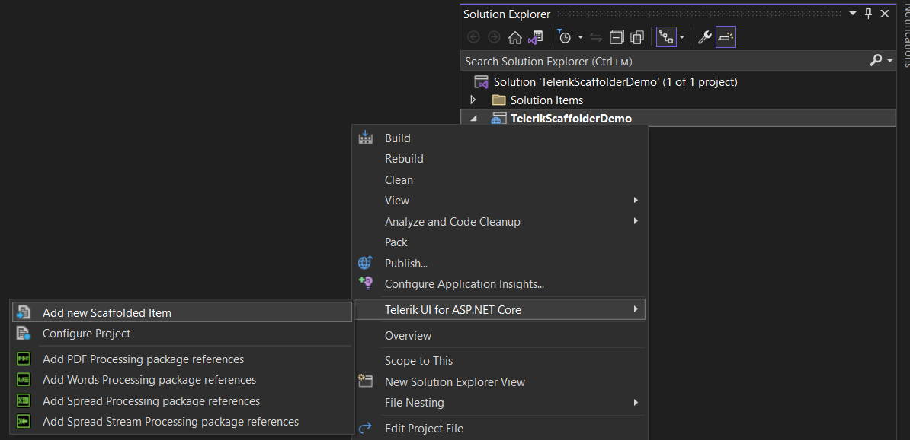
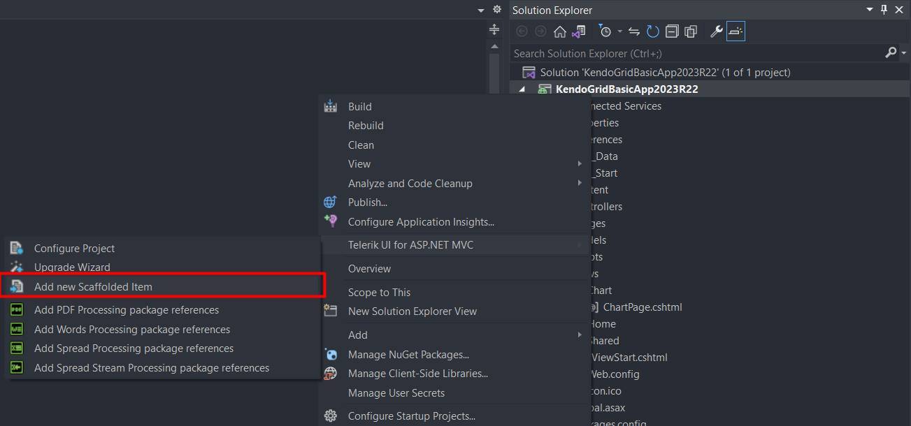
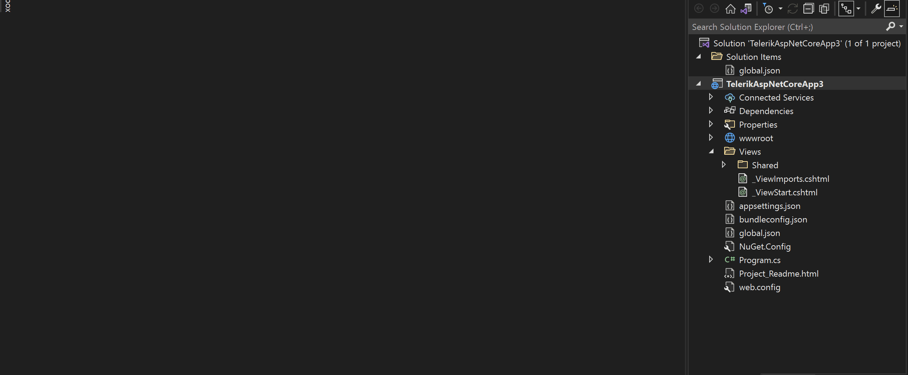

# Scaffolding for {{ site.product }}

Since the 2022 R2 SP2 release, {{ site.product }} provides new way of generating Scaffolding templates as a convenient productivity feature. 







The new Scaffolder items in Visual Studio allow quick code generation and mocking of data for some of the most used data-bound components, such as the {{ site.framework }} Data Grid, TreeList, Scheduler, ListView, Gantt, Chart, Form and Editor.

## Installation

The Telerik UI Scaffolder supports both Visual Studio 2019 and 2022. The nice thing is that this feature comes built-in with the 2022 R2 SP2+ versions and no additional files or installments are required. This is possible due to the upgraded and modernized implementation by our VSX Team.

All you need to do is to install a recent version of the {{ site.product }} .msi installer and the Telerik Extensions for Visual Studio will be installed automatically together with the Scaffolding items.


Alternatively, you can install the Extensions individually from the [VS MarketPlace](https://marketplace.visualstudio.com/items?itemName=TelerikInc.ProgressTelerikASPNETCoreVSExtensions).

Alternatively, you can install the Extensions individually from the [VS MarketPlace](https://marketplace.visualstudio.com/items?itemName=TelerikInc.ProgressTelerikASPNETMVCVSExtensions).


## Scaffolding Templates

The {{ site.framework }} and VS already provide their own default Scaffolding items, but they shouldn't be confused with the new Telerik UI Scaffolding items.

The Telerik templates are opened in a separate custom Window which can be accessed by right-clicking the project in Solution Explorer and choosing the Telerik UI for ASP.NET submenu containing the Add New Scaffolded Item option.

Then, you are presented with several popular components you can choose from. You can also set the name of the new View and Controller files, as well as, a selection of other properties for different tools like the Grid and TreeList.

The final result conveniently generates everything required to run the page from the first go - a View page, a Controller file and a Model definition. This way, you can quickly begin with a working app and modify it to match your own business and development needs.

## See Also

* [Official .Net Documentation on Scaffolding](https://github.com/aspnet/Scaffolding)
* [Default ASP.NET Scaffolding Templates](https://github.com/aspnet/Scaffolding/tree/main/src/Scaffolding/VS.Web.CG.Mvc/Templates)

* [Telerik UI for ASP.NET Core Scaffolding Templates](https://github.com/telerik/scaffold-templates-core)
* [How to add a model to an ASP.NET Core MVC app (Microsoft Tutorial)](https://docs.microsoft.com/en-us/aspnet/core/tutorials/first-mvc-app/adding-model?view=aspnetcore-2.1)
* [How to add a model to a Razor Pages app in ASP.NET Core (Microsoft Tutorial)](https://docs.microsoft.com/en-us/aspnet/core/tutorials/razor-pages/model?view=aspnetcore-2.1)

* [Telerik UI for ASP.NET MVC Fundamentals]()
* [Using Telerik UI for ASP.NET MVC in MVC 5 Applications]()

