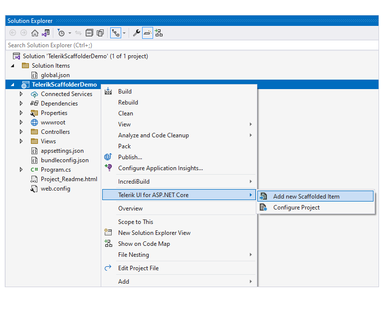
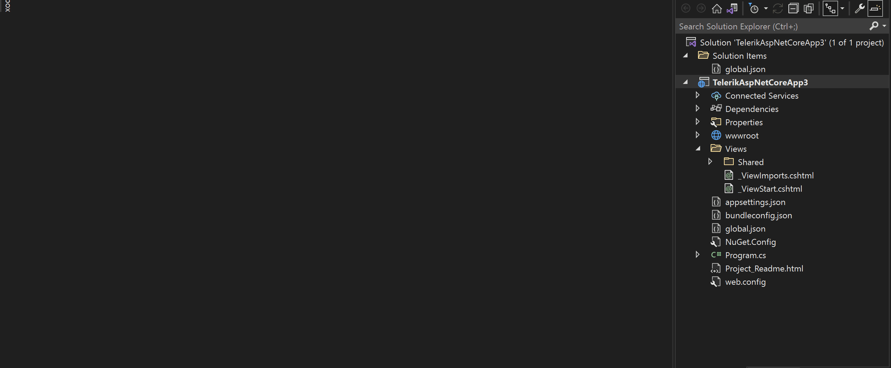
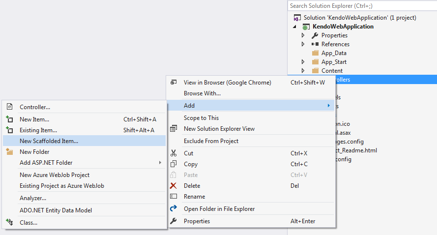
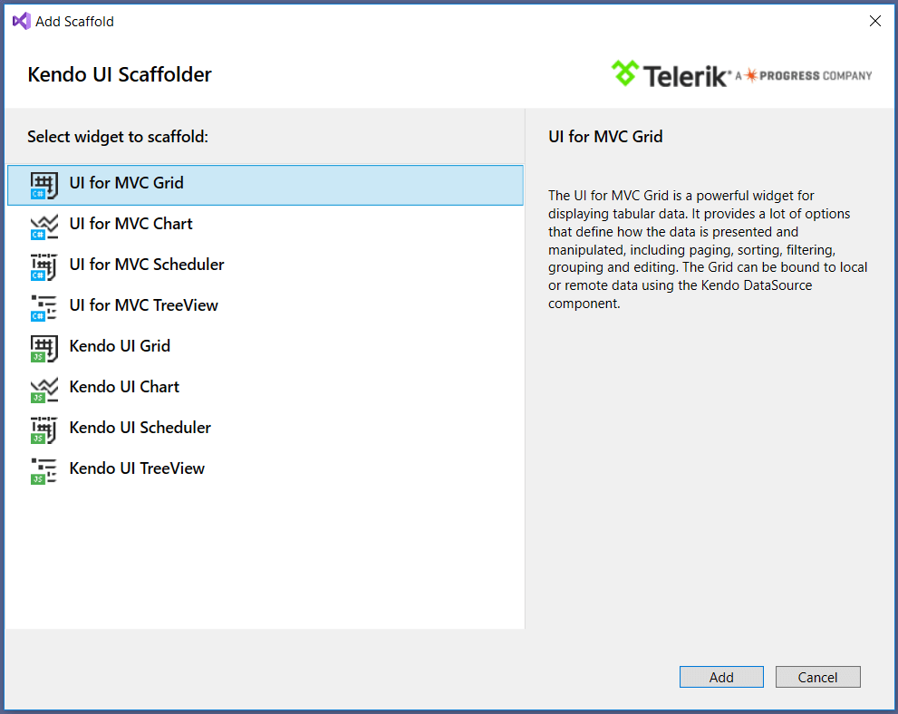
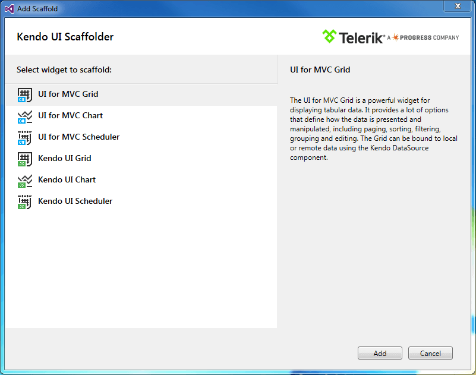


# Scaffolding

Since the 2022 R2 SP2 release, Telerik UI for ASP.NET Core provides new way of generating Scaffolding templates as a convenient productivity feature. 

The new Scaffolder items in Visual Studio allow quick code generation and mocking of data for some of the most used data-bound components, such as the ASP.NET Core Data Grid, TreeList, Scheduler, ListView, Gantt, Chart, Form and Editor.

## Installation

The Telerik UI Scaffolder supports both Visual Studio 2019 and 2022. The nice thing is that this feature comes built-in with the 2022 R2 SP2+ versions and no additional files or installments are required. This is possible due to the upgraded and modernized implementation by our VSX Team.

All you need to do is to istall a recent version of the Telerik UI for Core .msi istaller and the Telerik Extentions for Visual Studio will be installed automatically together with the Scaffolding items. Alternatively, you can install the Extentions individually from the [VS MarketPlace](https://marketplace.visualstudio.com/items?itemName=TelerikInc.ProgressTelerikASPNETCoreVSExtensions).

## Scaffolding Templates

The .NET for Core and VS already provide their own default Scaffolding items, but they shouldn't be confused with the new Telerik UI Scaffolding items.

The Telerik templates are opened in a separate custom Window which can be accessed by right-clicking the project in Solution Explorer and choosing the Telerik UI for ASP.NET submenu containing the Add New Scaffolded Item option.

Then, you are presented with several popular components you can choose from. You can also set the name of the new View and Controller files, as well as, a selection of other properties for different tools like the Grid and TreeList.

The final result conveniently generates everything required to run the page from the first go - a View page, a Controller file and a Model definition. This way, you can quickly begin with a working app and modify it to match your own business and development needs.


# Scaffolding

As of the Q1 2015 release, Telerik UI for ASP.NET MVC provides Scaffolding templates.

ASP.NET Scaffolding is a code generation framework for ASP.NET applications. {{ site.product }} makes use of this framework and offers Scaffolding templates that aim to accelerate and ease the process of building an application for both Razor Pages and MVC. These templates allow you to generate helper declarations together with the related Controller action methods. 

Some of the components that provide Scaffolding templates are the Grid, Scheduler, Chart, and TreeView:

* [Scaffolding of the Grid HtmlHelper]()
* [Scaffolding of the Chart HtmlHelper]()
* [Scaffolding of the Scheduler HtmlHelper]()
* [Scaffolding of the TreeView HtmlHelper]()

## Prerequisites

Install {{ site.product }} and set up your project by using either of the following approaches:

* [Starting a project from a Template in Visual Studio]()
* [Adding Telerik UI through local files in Visual Studio]()

To use the scaffolding template, your development environment must meet the following requirements:

* Visual Studio 2013 with Update 2 or later
* ASP.NET MVC 4 or ASP.NET MVC 5
* C#
* Entity Framework Data Model

> The Scaffolder templates do not work in Visual Studio 2019 version 16.9.0+. A breaking change has been introduced in these Visual Studio 2019 versions, which affects the third party scaffolders. The issue has been reported to Microsoft, see [Developer Community topic](https://developercommunity.visualstudio.com/t/visual-studio-2019-version-1691-resulted-in-custom/1371519).

## Installation

The Telerik UI for ASP.NET MVC installer automatically install the required Visual Studio extension.

You can also manually install it by navigating to the `wrappers\aspnetmvc\Scaffolding` folder of the distribution package and open the included `vsix` file. It will automatically detect compatible Visual Studio versions.

## Setting Up the Project

To initially set up Scaffolder Visual Studio extension:

1. From the **New Scaffolded Item...** menu which contains different items depending on the currently installed Scaffolders, access the Scaffolder extension.

    

1. From the next menu, select **Kendo UI Scaffolder**. As a result, the Scaffolding configuration panel opens.

    

1. Select the Grid, Chart, or Scheduler control. The Controller and the corresponding view will be generated in the currently selected location.

    


## See Also

* [Official .Net Documentation on Scaffolding](https://github.com/aspnet/Scaffolding)
* [Default ASP.NET Scaffolding Templates](https://github.com/aspnet/Scaffolding/tree/main/src/Scaffolding/VS.Web.CG.Mvc/Templates)

* [Telerik UI for ASP.NET Core Scaffolding Templates](https://github.com/telerik/scaffold-templates-core)
* [How to add a model to an ASP.NET Core MVC app (Microsoft Tutorial)](https://docs.microsoft.com/en-us/aspnet/core/tutorials/first-mvc-app/adding-model?view=aspnetcore-2.1)
* [How to add a model to a Razor Pages app in ASP.NET Core (Microsoft Tutorial)](https://docs.microsoft.com/en-us/aspnet/core/tutorials/razor-pages/model?view=aspnetcore-2.1)

* [Telerik UI for ASP.NET MVC Fundamentals]()
* [Using Telerik UI for ASP.NET MVC in MVC 5 Applications]()
* [Using Telerik UI for ASP.NET MVC in MVC 4 Applications]()
* [Using Telerik UI for ASP.NET MVC in MVC 3 Applications]()

