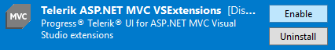

# Troubleshooting

This article provides solutions for common issues you may encounter while working with the {{ site.product }} Visual Studio (VS) extensions.

## The Telerik menu is missing in Visual Studio

**Cause** The Visual Studio extensions are disabled or not correctly installed.

**Solution** Depending on whether the extension is disabled or not correctly installed, use either of the following approaches.

* If the extension is disabled:

    1. Open Visual Studio.
    1. From the **Menu**, select **Tools** > **Extensions and Updates...**. For Visual Studio 2019, select **Extensions** > **Manage Extensions**.
    1. Open the **Installed** tab.
    1. Search for **Telerik {{ site.framework }} VSExtensions** and make sure they are **Enabled**.


        

        


* If the extension is not correctly installed:

    1. Open Visual Studio.
    1. From the **Menu**, select **Tools** > **Extensions and Updates...**. For Visual Studio 2019, select **Extensions** > **Manage Extensions**.
    1. Open the **Online** tab.
    1. Search for **Telerik {{ site.framework }} VSExtensions**>
    1. Download and install the extensions.

If after you apply the described approaches the issue persists, contact the Support Team at Progress after you generate Visual Studio [ActivityLog](https://docs.microsoft.com/en-us/visualstudio/ide/reference/log-devenv-exe?view=vs-2019) file:

1. Under **Administrative rights**, open the [**Developer Command** prompt](https://docs.microsoft.com/en-us/dotnet/framework/tools/developer-command-prompt-for-vs) for Visual Studio 20xx.
1. Execute the `devenv /log %userprofile%\desktop\ActivityLog.xml` command to start Visual Studio and create logs on your Desktop.
1. Reproduce the issue.
1. Attach the `Activitylog` files when you contact our support.

## The target framework dropdown is disabled

If the target **Framework** dropdown doesn't allow you to select the desired framework, make sure that [.Net Framework version 4.6.2](https://dotnet.microsoft.com/download/dotnet-framework/net462) is installed.

1. Check the .Net version in the list of Individual components. 
1. Go to **Tools** > **Get Tools and Features**. 
1. In Visual Studio Installer, select the **Individual components** tab and check the .NET Framework 4.6.2 targeting pack and .NET Framework 4.6.2 SDK



## Created project could not load file or assembly 'Telerik.SvgIcons'

When creating a new project using an older version of the components, there might be mismatch between the version of the installed VS Extentions and the older Telerik Icon assemblies required to build the specific old version of the toolset.

The error will show a message similar to this:

*Could not load file or assembly 'Telerik.SvgIcons, Version=4.0.0.0, Culture=neutral, PublicKeyToken=20b4b0547069c4f8' or one of its dependencies. The located assembly's manifest definition does not match the assembly reference. (Exception from HRESULT: 0x80131040)*

You can fix the issue by opening the `.csproj` file of the project and updating the version of the Icon packages:
```XML
    <PackageReference Include="Telerik.FontIcons" Version="4.0.0" />
    <PackageReference Include="Telerik.SvgIcons" Version="4.0.0" />
```



## See Also

* [Integrating Visual Studio in Your .Net Project (Overview)]()
* [Creating New Projects with Visual Studio]()
* [Downloading the Latest {{ site.product }} Versions]()
