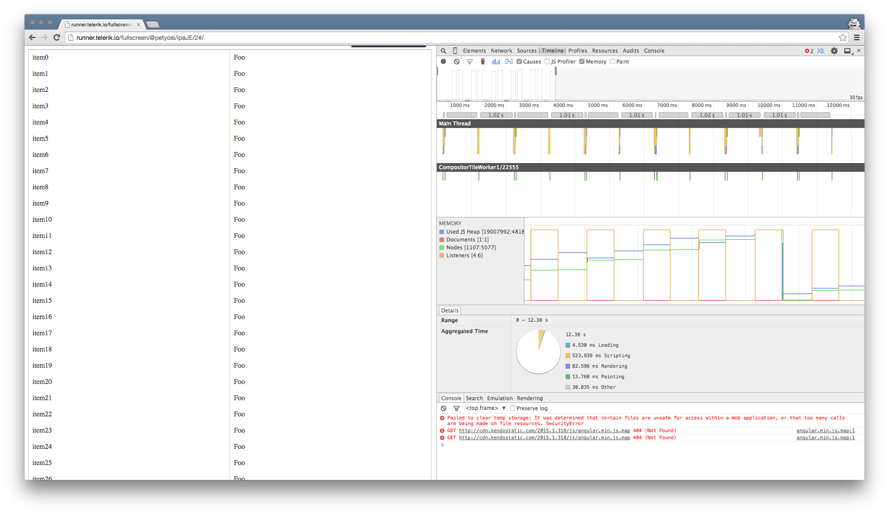

# Memory Leaks

Under certain conditions, the browser memory usage continuously increases when data-bound widgets, such as the Grid, are created and destroyed in the AngularJS context. Many of these reports are related to the AngularJS routing.

## Handle Memory Leaks

### Detect the Leak

Memory leak reports are not unique to Kendo UI directives. The [Angular JS repository](https://github.com/angular/angular.js) features several threads which dig into various aspects of the problem. [Issue #4864](https://github.com/angular/angular.js/issues/4864) is among the most prominent ones. The [post from Igor Minar](https://github.com/angular/angular.js/issues/4864#issuecomment-29394307) offers several insights, which highlight most of the problems the Kendo UI team stumbled upon too.

**Takeaways**

- Use а new, clean Chrome profile for testing, because extensions might cause false leaks. Incognito mode works as well. Note that ad blockers represent quite a common cause.
- Triggering the garbage collect causes the collection of many leaked, detached DOM nodes. If this is not the case, then a real problem is present.
- According to Igor, you must start the Chrome browser with `--js-flags="--nocrankshaft --noopt"`. However, the Kendo UI test cases did not show any effect of these flags.

### Create a Test Case

To verify that your implementation does not differ from the default AngularJS behavior, create a simplified test case which uses the `ng-repeat` directive and the router. The code is available in [the Dojo](http://dojo.telerik.com/@petyosi/ipaJE), too.

###### Example

```html
<!DOCTYPE html>
<html>
<head>
    <script src="https://code.jquery.com/jquery-2.1.3.min.js"></script>
    <script src="https://ajax.googleapis.com/ajax/libs/angularjs/1.3.14/angular.min.js"></script>
    <script src="https://ajax.googleapis.com/ajax/libs/angularjs/1.3.14/angular-route.min.js"></script>
</head>
<body>
    <script src="https://ajax.googleapis.com/ajax/libs/angularjs/1.3.14/angular-route.min.js"></script>

    <div ng-app="KendoDemos">
    <div ng-view>
    </div>

    <script type="text/javascript" charset="utf-8">
        angular.module("KendoDemos", [ 'ngRoute' ])
        .config(['$routeProvider', function($routeProvider) {
            $routeProvider.
            when('/blank', {
                template: 'Blank template',
                controller: 'blank'
            }).
            when('/', {
                template: '<div ng-repeat="item in items">{{ item }}</div>',
                controller: 'main'
            });
        }]).controller("main", function($scope, $timeout, $location){
            $scope.items = [];
            for (var i = 0; i < 100; i++) {
                $scope.items.push("item" + i);
            }

            $timeout(function() {
                $location.url("/blank");
            }, 1000);
        })
        .controller("blank", function($scope, $timeout, $location){
            $timeout(function() {
                $location.url("/");
            }, 1000);
        });
    </script>
    </div>
</body>
</html>
```

Observe the page performance in the Chrome timeline by recording the sample from above.

**Figure 1** Page performance in the Chrome timeline


The DOM count increases as the routes toggle with each other, which seems to be a leak. Perform the same, but force the garbage collect during the recording.

**Figure 1** Forcing garbage collection during recording


The seemingly retained detached nodes are getting collected by the garbage collector.

### Extend the Test Case

Replace the `repeat` directive above with a Kendo UI Grid.

###### Example

```html
<!DOCTYPE html>
<html>
  <head>
    <link rel="stylesheet" href="http://kendo.cdn.telerik.com/2015.1.318/styles/kendo.common.min.css">
    <link rel="stylesheet" href="http://kendo.cdn.telerik.com/2015.1.318/styles/kendo.rtl.min.css">
    <link rel="stylesheet" href="http://kendo.cdn.telerik.com/2015.1.318/styles/kendo.default.min.css">
    <link rel="stylesheet" href="http://kendo.cdn.telerik.com/2015.1.318/styles/kendo.dataviz.min.css">
    <link rel="stylesheet" href="http://kendo.cdn.telerik.com/2015.1.318/styles/kendo.dataviz.default.min.css">
    <link rel="stylesheet" href="http://kendo.cdn.telerik.com/2015.1.318/styles/kendo.mobile.all.min.css">

    <script src="http://code.jquery.com/jquery-1.9.1.min.js"></script>
    <script src="http://kendo.cdn.telerik.com/2015.1.318/js/angular.min.js"></script>
    <script src="https://ajax.googleapis.com/ajax/libs/angularjs/1.3.14/angular-route.min.js"></script>
    <script src="http://kendo.cdn.telerik.com/2015.1.318/js/jszip.min.js"></script>
    <script src="http://kendo.cdn.telerik.com/2015.1.318/js/kendo.all.min.js"></script>
  </head>
  <body>


    <div ng-app="KendoDemos">
      <div ng-view>
      </div>

      <script type="text/javascript" charset="utf-8">
        angular.module("KendoDemos", [ 'kendo.directives', 'ngRoute' ])
        .config(['$routeProvider', function($routeProvider) {
          $routeProvider.
          when('/blank', {
            template: 'Blank template',
            controller: 'blank'
          }).
          when('/', {
            template: '<table kendo-grid k-data-source="items"><tr k-row-template><td>{{ dataItem }}</td><td>Foo</td></tr></table>',
            controller: 'main'
          });
        }]).controller("main", function($scope, $timeout, $location){
          $scope.items = [];
          for (var i = 0; i < 100; i++) {
            $scope.items.push("item" + i);
          }

          $timeout(function() {
            $location.url("/blank");
          }, 1000);
        })
        .controller("blank", function($scope, $timeout, $location){
          $timeout(function() {
            $location.url("/");
          }, 1000);
        });
      </script>
    </div>
  </body>
</html>
```

The example from above performs in the same way. Nodes are retained, but collecting the garbage drops the node count back to its original state.

**Figure 3** Node count dropping back to original state



Based on this research, you can consider that the memory usage of the Kendo UI directives, although not perfect, is unavoidable given the AngularJS context.

> **Important**
>  
> The majority of Kendo UI widgets do not exhibit such leaks outside the AngularJS context.

### Solution

Clean up before a route change. So, wherever you change to a new route through `$location.path('/my/new/route')`, you execute some extra code to clear out the HTML in the prior view using.

###### Example

    kendo.destroy(document.body);
    $('.view-root-node').html('');

## See Also

Other articles on AngularJS integration with Kendo UI:

* [AngularJS Integration Overview]()
* [Global Events]()
* [Grid Settings]()
* [Directives with DataSource]()
* [ng-* Directives in Widget Markup]()
* [How to Load View in Window]()
* [How to Nest Widgets]()
* [Troubleshooting: Common Issues]()
