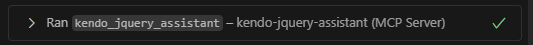

# Getting Started with the Kendo UI for jQuery AI Coding Assistant

The Kendo UI for jQuery [MCP Server](https://modelcontextprotocol.io/docs/getting-started/intro) lets you interact with AI and reach new levels of developer productivity. The MCP server provides proprietary context to AI-powered IDEs, apps and tools. You can use the Kendo UI for jQuery MCP server for AI code generation and ask about Kendo UI for jQuery components, features, or general usage. You can successfully prompt more complex questions and tasks, and generate tailored code that includes Kendo UI for jQuery components and API.

## Prerequisites

To use the Kendo UI for jQuery MCP server, you need:

* [Node.js 18](https://nodejs.org/en) or later.
* A [compatible MCP client (IDE, code editor or app)](https://modelcontextprotocol.io/clients) that supports *MCP tools*.
* A [Telerik user account](https://www.telerik.com/account/).
* An active [DevCraft or Kendo UI for jQuery license](https://www.telerik.com/purchase/kendo-ui) or a [Kendo UI for jQuery trial](https://www.telerik.com/kendo-jquery-ui).
* [Optional] An application that has [Kendo UI for jQuery components](https://www.telerik.com/kendo-jquery-ui/documentation/intro/first-steps) installed. Alternatively, you can ask the LLM to generate the application setup for you.

## Installation

Use the documentation of your AI-powered MCP client to add the Kendo UI for jQuery MCP server to a specific workspace or globally. You can see installation tips and examples for some popular MCP clients below.

The generic settings of the Kendo UI for jQuery MCP server are:

* Server name: `kendo-jquery-assistant`
* Type: `stdio` (standard input/output transport)
* Command: `npx` (the MCP server works through an npm package)
* Supported arguments: `-y`
* npm package name: `@progress/kendo-jquery-mcp`

You also need to add your [Telerik licence key]() as an `env` parameter in the `mcp.json` file. There are two options:

* (recommended) Use a `TELERIK_LICENSE_PATH` argument and point to the location of your Telerik license file.
* Use a `TELERIK_LICENSE` argument and paste your Telerik license key. Make sure to [update the license key](#installing-or-updating-the-license-key) when necessary.

### VSCode

For detailed instructions, refer to [Use MCP servers in VS Code](https://code.visualstudio.com/docs/copilot/chat/mcp-servers).

> This section applies to VS Code 1.102.1 and newer versions.

> Make sure that [`chat.mcp.enabled`](vscode://settings/chat.mcp.enabled) is enabled in the VS Code settings.

#### Workspace Configuration

To enable the Kendo UI for jQuery MCP server [in a specific workspace](https://code.visualstudio.com/docs/copilot/chat/mcp-servers#_add-an-mcp-server-to-your-workspace) or jQuery app, add a `.vscode` folder with an `mcp.json` file at the root of the workspace with the following content:

```json
{
  "servers": {
    "kendo-jquery-assistant": {
      "type": "stdio",
      "command": "npx",
      "args": ["-y", "@progress/kendo-jquery-mcp@latest"],
      "env": {
        "TELERIK_LICENSE_PATH": "THE_PATH_TO_YOUR_LICENSE_FILE",
        // or
        "TELERIK_LICENSE": "YOUR_LICENSE_KEY"
      }
    }
  }
}
```

This enables you to call the MCP Server with the `#kendo-jquery-assistant` handle. To use a custom handle, change the server name in the `mcp.json`.

### Cursor

For detailed instructions, refer to [Model Context Protocol](https://docs.cursor.com/context/mcp).

#### Workspace Configuration

To enable the Kendo UI for jQuery MCP server in [a specific workspace](https://docs.cursor.com/context/mcp#using-mcp-json) or jQuery app, add a `.cursor` folder with an `mcp.json` file at the root of the workspace with the following content:

```json
{
  "mcpServers": {
    "kendo-jquery-assistant": {
      "type": "stdio",
      "command": "npx",
      "args": ["-y", "@progress/kendo-jquery-mcp@latest"],
      "env": {
        "TELERIK_LICENSE_PATH": "THE_PATH_TO_YOUR_LICENSE_FILE",
        // or
        "TELERIK_LICENSE": "YOUR_LICENSE_KEY"
      },
    }
  }
}
```

This enables you to call the MCP Server with the `#kendo-jquery-assistant` handle. To use a custom handle, change the server name in the `mcp.json`.

## Usage

> When switching between tasks and files, start a new session in a new chat window to avoid polluting the context with irrelevant or outdated information.

To use the Kendo UI for jQuery MCP server:

1. Start your prompt with `/kendojquery` or `#kendo-jquery-assistant` (or with `#` followed by your custom server name installation, if set). Based on internal testing, the `/kendojquery` approach usually performs slightly better.
2. Inspect the output and verify that the MCP Server is used. Look for a similar statement in the output (the exact text may vary across tools):

  

3. If the Kendo UI for jQuery MCP server is not used even though it's installed and enabled, double-check the server name in your configuration and try rephrasing your prompt.
4. If requested, grant the Kendo UI for jQuery MCP server a permission to run for this session, workspace, or always.

To increase the probability of the Kendo UI for jQuery MCP Server being used, or to call it without the need to mention "kendo" explicitly, add custom idea instructions to your AI-powered tool. Here are examples for [GitHub Copilot](https://docs.github.com/en/copilot/customizing-copilot/adding-repository-custom-instructions-for-github-copilot#about-repository-custom-instructions-for-github-copilot-chat) and [Cursor](https://docs.cursor.com/context/rules).

## Sample Instructions

The following instructions can be added to `.github/copilot-instructions.md` in order to enhance the usage of the server:

```markdown
# Tools

- Always use the kendo_jquery_assistant tool to help you with Kendo UI for jQuery related tasks and components.
- Optimize your search query for vector embeddings for the kendo_jquery_assistant tool to get the most relevant results. Keep it short 1-3 sentences, 10-30 words.
```

## Sample Prompts

The following list describes how your prompts may look like:

* &quot;`#kendo-jquery-assistant` Generate a Kendo UI for jQuery Grid with sorting and paging enabled. Bind the Grid to dummy data.&quot;
* &quot;`#kendo-jquery-assistant` Generate a Kendo UI for jQuery ComboBox that shows a list of products.&quot;
* &quot;`#kendo-jquery-assistant` Show me sample code for a Kendo UI for jQuery Grid with virtual scrolling for the rows and columns.&quot;

## Usage Limits

A Telerik [Subscription license](https://www.telerik.com/purchase/faq/licensing-purchasing) is recommended in order to use the Kendo UI for jQuery AI Coding Assistant without restrictions. Perpetual license holders and trial users can make a [limited number of requests per year](#usage-limits).

## Connect to Local AI Model

You can use the Kendo UI for jQuery MCP server with local large language models (LLM). For example, run your local model through [Ollama](https://ollama.com) and use a third-party package such as [MCP-LLM Bridge](https://github.com/patruff/ollama-mcp-bridge) to connect the model to the Kendo UI for jQuery MCP server. This will allow you to use the Kendo UI for jQuery AI Coding Assistant without a cloud-based AI model.

## See Also

* [Kendo UI for jQuery AI Coding Assistant Intended Use](#intended-use)
* [Kendo UI for jQuery AI Coding Assistant Recommendations](#recommendations)
