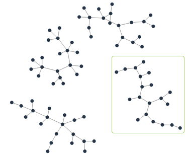
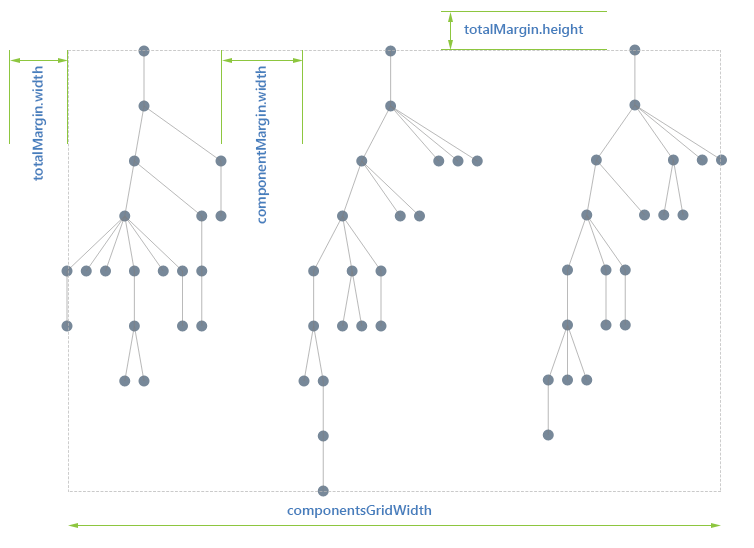
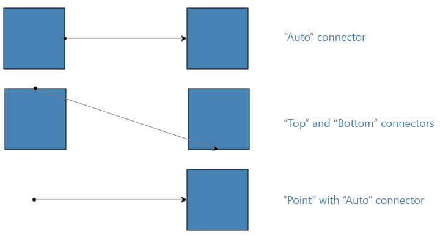

# kendo.dataviz.ui.Diagram

## Configuration

### autoBind `Boolean` *(default: true)*

If set to `false` the widget will not bind to the data source during initialization. In this case data binding will occur when the [change](/api/javascript/data/datasource/events/change) event of the
data source is fired. By default the widget will bind to the data source specified in the configuration.

> Setting `autoBind` to `false` is useful when multiple widgets are bound to the same data source. Disabling automatic binding ensures that the shared data source doesn't make more than one request to the remote service.


<div class="meta-api-description">
Control and configure when the diagram loads or binds data by enabling or disabling automatic data binding during component initialization, allowing delayed or manual binding triggered by data source changes to prevent multiple requests when sharing data sources among components; adjust how and when the diagram connects, synchronizes, or fetches data by setting auto-bind behavior, managing data source events, avoiding redundant network calls, and optimizing performance for scenarios involving multiple components using the same remote or local data inputs.
</div>

#### Example - disabling automatic binding

    <button id="btn">Bind Diagram</button>
    <div id="diagram"></div>
    <script>
      $("#diagram").kendoDiagram({
        dataSource: [{
          "name": "Telerik",
          "items": [
            {"name": "Kendo"},
            {"name": "NativeScript"}
          ]
        }],
        template: "#= item.name #",
        layout: "layered",
        autoBind: false
      });

      $("#btn").on("click", function(){
        $("#diagram").getKendoDiagram().dataSource.fetch();
      });
    </script>

### connectionDefaults `Object`

Defines the defaults of the connections. Whenever a connection is created, the specified connectionDefaults will be used and merged with the (optional) configuration passed through the connection creation method.


<div class="meta-api-description">
control and customize default settings for all connections such as visual style, connector shapes, line types, colors, metadata, interactivity features, and behavior in diagram drawing tools or graphical editors; set global connection parameters that apply automatically to newly created links or edges within charts, flow diagrams, or network maps; define baseline appearance and functional options for connectors that can be overridden individually during link creation; configure default line properties, arrowheads, routing preferences, labels, and interaction rules to streamline consistent styling and behavior of diagram connections across the entire graph or diagram workspace.
</div>

#### Example - typical connectionDefaults

    <div id="diagram"></div>
    <script>
      var Point = kendo.dataviz.diagram.Point;
      $("#diagram").kendoDiagram({
        shapes:[
          {
            id:"1",
            content:{
              text: "State 1"
            },
            x: 20,
            y: 20
          },
          {
            id:"2",
            content: {
              text: "State 2"
            },
            x: 160,
            y: 20
          },
          {
            id:"3",
            content: {
              text: "State 3"
            },
            x: 60,
            y: 160
          }
        ],
        connections:[
          {
            from: new Point(100,100),
            to: new Point(100,200)
          },
          {
            from: "1",
            to: "2"
          }
        ],
        connectionDefaults: {
          stroke: {
            color: "#979797",
            width: 1
          },
          type:"polyline",
          startCap: "FilledCircle",
          endCap: "ArrowEnd"
        }
      });
    </script>

### connectionDefaults.content `Object`

Defines the label displayed on the connection path.


<div class="meta-api-description">
Control and customize the text labels displayed on connectors, edges, or links within diagrams by setting the connection label content, enabling configuration of captions, annotations, and descriptive text along connection paths; useful for defining initial label appearance, displaying informative or contextual text on relationships, setting connection captions, and managing how text appears on links or connector lines in diagramming tools.
</div>

#### Example - customizing connection content

    <div id="diagram"></div>
    <script>
      $("#diagram").kendoDiagram({
        dataSource: [
          {id:"one", name:"One"},
          {id:"two", name:"Two"},
          {id:"five", name:"Five"},
        ],
        connectionsDataSource:[
          {from:"one", to:"two", label: "plus one"},
          {from:"one", to:"five", label: "plus three"}
        ],
        layout: "layered",
        connectionDefaults: {
          content: {
            color: "green",
            fontFamily: "Segoe UI",
            fontSize: 16,
            fontStyle: "italic",
            fontWeight: 200,
            template: "#: dataItem.label #"
          }
        }
      });
    </script>

### connectionDefaults.content.color `String`

The color of the connection content text.


<div class="meta-api-description">
Set or configure the text color, font color, or label color for connection labels, link captions, edge text, or the content displayed on diagram connections in a diagramming or flowchart component, enabling customization, styling, theming, or visual differentiation of connection content text, including changing default colors, adjusting readability, and ensuring consistent design across connectors or links in diagrams, flowcharts, or graphs.
</div>

#### Example

    <div id="diagram"></div>
    <script>
    $("#diagram").kendoDiagram({
        connectionDefaults: {
            content: {
                color: "#FF0000",
                text: "Connection Text"
            }
        },
        shapes: [
            { id: "1", x: 100, y: 100, content: { text: "Shape 1" } },
            { id: "2", x: 300, y: 100, content: { text: "Shape 2" } }
        ],
        connections: [
            { from: "1", to: "2" }
        ]
    });
    </script>

### connectionDefaults.content.fontFamily `String`

The font family of the connection content text.


<div class="meta-api-description">
Set or customize the font family, font stack, or typeface used for connection label text in diagrams, including how to specify CSS font-family strings to control the appearance of connection content fonts, enabling customization of label typography, changing or overriding default fonts like Arial, Helvetica, or sans-serif, and adjusting text styling for connections in diagramming tools or components.
</div>

#### Example

    <div id="diagram"></div>
    <script>
    $("#diagram").kendoDiagram({
        connectionDefaults: {
            content: {
                fontFamily: "Arial, sans-serif",
                text: "Connection Text"
            }
        },
        shapes: [
            { id: "1", x: 100, y: 100, content: { text: "Shape 1" } },
            { id: "2", x: 300, y: 100, content: { text: "Shape 2" } }
        ],
        connections: [
            { from: "1", to: "2" }
        ]
    });
    </script>

### connectionDefaults.content.fontSize `Number`

The font size of the connection content text.


<div class="meta-api-description">
Adjust, configure, or control the text size for labels, annotations, or connector text within diagram connections, enabling customization of font dimensions for edge or link content in visual graph or flow representations. This includes setting the size of connection-related text elements such as node link labels, connector annotations, or any descriptive content displayed along diagram edges, improving readability and stylistic consistency across diagram connections in graphical interfaces.
</div>

#### Example

    <div id="diagram"></div>
    <script>
    $("#diagram").kendoDiagram({
        connectionDefaults: {
            content: {
                fontSize: 16,
                text: "Connection Text"
            }
        },
        shapes: [
            { id: "1", x: 100, y: 100, content: { text: "Shape 1" } },
            { id: "2", x: 300, y: 100, content: { text: "Shape 2" } }
        ],
        connections: [
            { from: "1", to: "2" }
        ]
    });
    </script>

### connectionDefaults.content.fontStyle `String`

The font style of the connection content text.


<div class="meta-api-description">
Control and customize the text appearance of connection labels by setting font styles like normal, italic, or other typographic variations for connection content within diagrams. Enable configuration of label text formatting, adjust font emphasis, and specify style preferences for connected elements to ensure clear, visually distinct connectors. Configure how connection text looks in diagrams by applying different font weights, styles, and emphasis options to dynamically style or programmatically set label fonts for better readability and presentation.
</div>

#### Example

    <div id="diagram"></div>
    <script>
    $("#diagram").kendoDiagram({
        connectionDefaults: {
            content: {
                fontStyle: "italic",
                text: "Connection Text"
            }
        },
        shapes: [
            { id: "1", x: 100, y: 100, content: { text: "Shape 1" } },
            { id: "2", x: 300, y: 100, content: { text: "Shape 2" } }
        ],
        connections: [
            { from: "1", to: "2" }
        ]
    });
    </script>

### connectionDefaults.content.fontWeight `String`

The font weight of the connection content text.


<div class="meta-api-description">
Control and customize the text thickness, boldness, or weight of labels and content on diagram connections by configuring the font weight using standard CSS values including keywords like normal and bold or numeric ranges from 100 to 900, enabling precise styling of connection text appearance during initialization or dynamically adjusting label emphasis, font styling, text weight settings for connectors, and managing the visual emphasis or readability of connection label fonts in diagrams.
</div>

#### Example

    <div id="diagram"></div>
    <script>
    $("#diagram").kendoDiagram({
        connectionDefaults: {
            content: {
                fontWeight: "bold",
                text: "Connection Text"
            }
        },
        shapes: [
            { id: "1", x: 100, y: 100, content: { text: "Shape 1" } },
            { id: "2", x: 300, y: 100, content: { text: "Shape 2" } }
        ],
        connections: [
            { from: "1", to: "2" }
        ]
    });
    </script>

### connectionDefaults.content.template `String|Function`

The [template](/api/javascript/kendo/methods/template) which renders the labels.

The fields which can be used in the template are:

* dataItem - the data item, in case a field has been specified


<div class="meta-api-description">
Configure and customize how connection labels appear in diagrams by defining a template that controls the rendering of each connection’s label text, HTML, or data-bound content. Enable dynamic label generation using templating syntax to bind data fields, format connection captions, or display context-specific information based on the underlying connection data or associated data items. Control label presentation with flexible templates that support text formatting, embedded HTML, and data-driven rendering, allowing developers to set, customize, or style connection labels dynamically within visual diagram relationships.
</div>

#### Example - showing values from the connectionDataSource in the connection labels

    <div id="diagram"></div>
    <script>
      var serviceRoot = "https://demos.telerik.com/service/v2/core";

      var shapesDataSource = {
        transport: {
          read: {
            url: serviceRoot + "/DiagramShapes"
          }
        },
        schema: {
          model: {
            fields: {
              id: { from: "Id", type: "number" },
              JobTitle: { type: "string" },
              Color: { type: "string" }
            }
          }
        }
      };

      var connectionsDataSource = {
        transport: {
          read: {
            url: serviceRoot + "/DiagramConnections"
          }
        },
        schema: {
          model: {
            id: "id",
            fields: {
              id: { from: "Id", type: "number" },
              from: { from: "FromShapeId", type: "number" },
              to: { from: "ToShapeId", type: "number" },
              fromX: { from: "FromPointX", type: "number" },
              fromY: { from: "FromPointY", type: "number" },
              toX: { from: "ToPointX", type: "number" },
              toY: { from: "ToPointY", type: "number" }
            }
          }
        }
      };

      $("#diagram").kendoDiagram({
        dataSource: shapesDataSource,
        connectionsDataSource: connectionsDataSource,
        layout: {
          type: "layered"
        },
        shapeDefaults: {
          content: {
            template: "#= dataItem.JobTitle #"
          },
          width: 200
        },
        connectionDefaults: {
          content: {
            template: "#: dataItem.from # - #: dataItem.to #"
          }
        },
        dataBound: onDataBound
      });

      function onDataBound(e) {
        var that = this;
        setTimeout(function () {
          that.bringIntoView(that.shapes);
        }, 0);
      }
    </script>

### connectionDefaults.content.text `String`

The static text displayed on the connection.


<div class="meta-api-description">
Configure or set fixed static text labels directly on diagram connections or links, enabling constant captions, annotations, or identifiers displayed between nodes without dynamic data binding; control the exact wording shown on connectors, relationship lines, or edges for clear, unchanging text content such as fixed captions, connection descriptions, or manual label overrides on diagram links.
</div>

#### Example

    <div id="diagram"></div>
    <script>
    $("#diagram").kendoDiagram({
        connectionDefaults: {
            content: {
                text: "Connection Text"
            }
        },
        shapes: [
            { id: "1", x: 100, y: 100, content: { text: "Shape 1" } },
            { id: "2", x: 300, y: 100, content: { text: "Shape 2" } }
        ],
        connections: [
            { from: "1", to: "2" }
        ]
    });
    </script>

### connectionDefaults.content.visual `Function`

A function returning a visual element to render for the content of a connection.


<div class="meta-api-description">
Control and customize connection visuals by specifying a function or callback that defines how the content inside each connection is rendered, enabling dynamic labels, templates, custom DOM elements, or drawings on connections; configure per-connection styling, conditional display, and interactive visuals by setting or overriding the default connection content rendering logic during setup to tailor the appearance and behavior of connection elements in diagrams, flowcharts, or linked nodes.
</div>

#### Example - using a content visual for connections

    <div id="diagram"></div>
    <script>
      $("#diagram").kendoDiagram({
        dataSource: [{
          "name" : "Telerik",
          "items": [
            {"name": "Kendo UI"},
            {"name": "NativeScript"}
          ]
        }],
        connectionDefaults: {
          content: {
            visual: function(e) {
              var g = new kendo.dataviz.diagram.Group({
                autoSize: true
              });
              var circle = new kendo.dataviz.diagram.Circle({
                width: 15,
                height: 15,
                fill: {
                  color: "LimeGreen"
                }
              });
              var text = new kendo.dataviz.diagram.TextBlock({
                text: "Foo",
                fontSize: 16,
                x: 30
              });

              g.append(circle);
              g.append(text);
              return g;
            }
          }
        },
        layout: {
          type: "tree"
        }
      });
    </script>


### connectionDefaults.editable `Boolean|Object` *(default: true)*

Defines the editing behavior of the connections.


<div class="meta-api-description">
Configure the ability to enable or disable user edits on diagram connections, controlling whether connections can be dragged, reshaped, reconnected, or removed; manage connection editing behaviors such as interactive handles, constraints, snapping to guides, and permissible modification actions; set or control how connections respond to user interactions like reconnecting endpoints, adjusting paths, or deleting links, ensuring flexible or restricted editing modes within diagram components based on initialization settings or dynamic configuration.
</div>

#### Example - disabling interaction with the Diagram connections

    <div id="diagram"></div>
    <script>
      $("#diagram").kendoDiagram({
        dataSource: [
          {id:"one", name:"One"},
          {id:"two", name:"Two"},
          {id:"five", name:"Five"},
        ],
        connectionsDataSource:[
          {from:"one", to:"two", label: "plus one"},
          {from:"one", to:"five", label: "plus three"}
        ],
        layout: "layered",
        connectionDefaults: {
          content: {
            template: "#: dataItem.label #"
          },
          editable: false
        }
      });
    </script>

### connectionDefaults.editable.drag `Boolean` *(default: true)*

Specifies if the connections can be dragged.


<div class="meta-api-description">
Control whether connections or links within a diagram, flowchart, or graph can be moved, repositioned, dragged, or interactively adjusted by users through drag-and-drop actions during editing or layout changes. Enable or disable the ability to click and drag connections, edges, or links to customize visual relationships dynamically, supporting use cases like interactive diagrams, editable graphs, or interface workflows where moving connections is needed. Configure drag behavior for connections to allow or restrict repositioning, ensure interactive manipulation of link paths, or lock links in place to prevent accidental edits. This setting applies to default connection properties related to user-driven adjustment and flexible layout management in diagramming tools.
</div>

#### Example

    <div id="diagram"></div>
    <script>
    $("#diagram").kendoDiagram({
        connectionDefaults: {
            editable: {
                drag: false
            }
        },
        shapes: [
            { id: "1", x: 100, y: 100, content: { text: "Shape 1" } },
            { id: "2", x: 300, y: 100, content: { text: "Shape 2" } }
        ],
        connections: [
            { from: "1", to: "2" }
        ]
    });
    </script>

### connectionDefaults.editable.remove `Boolean` *(default: true)*

Specifies if the connections can be removed.


<div class="meta-api-description">
Control whether users can delete or remove connections or links between shapes in a diagram by enabling or disabling the ability to remove edges, connectors, or relationships. Configure, set, or toggle the permission for connection deletion, link removal, or cutting connections to manage user interaction with diagram links. Enable or disable editing features that allow users to delete, disconnect, or break the connections between nodes or entities, controlling access to connection removal during diagram setup or runtime.
</div>

#### Example

    <div id="diagram"></div>
    <script>
    $("#diagram").kendoDiagram({
        connectionDefaults: {
            editable: {
                remove: false
            }
        },
        shapes: [
            { id: "1", x: 100, y: 100, content: { text: "Shape 1" } },
            { id: "2", x: 300, y: 100, content: { text: "Shape 2" } }
        ],
        connections: [
            { from: "1", to: "2" }
        ]
    });
    </script>

### connectionDefaults.editable.tools `Array`|`Boolean`

Specifies the toolbar tools. Supports all options supported for the [toolbar.items](/api/javascript/ui/toolbar/configuration/items). If set to `false`, no edit tools will be displayed.

Predefined tools are:

* "edit" - The selected item can be edited
* "delete" - The selected items can be deleted


<div class="meta-api-description">
Customize and control the edit toolbar tools available for connections within a diagram, enabling enabling or disabling specific editing features like editing or deleting connection items, setting which toolbar items appear, tailoring user interface controls for connection manipulation, configuring edit controls visibility, adjusting toolbar features for modification tasks, managing connection editing capabilities, specifying available tools for connection interaction, enabling or disabling connection-specific edit options, and applying granular toolbar item settings for connection editing workflows, including options to hide all edit tools completely.
</div>

#### Example - using predefined tools

    <div id="diagram"></div>
    <script>
      $("#diagram").kendoDiagram({
        dataSource: [
          {id:"one", name:"One"},
          {id:"two", name:"Two"},
          {id:"five", name:"Five"},
        ],
        connectionsDataSource:[
          {from:"one", to:"two", label: "plus one"},
          {from:"one", to:"five", label: "plus three"}
        ],
        layout: "layered",
        connectionDefaults: {
          content: {
            template: "#: dataItem.label #"
          },
          editable: {
          	tools: ["delete"]
          }
        }
      });
    </script>

#### Example - using custom tools

    <div id="diagram"></div>
    <script>
      $("#diagram").kendoDiagram({
        dataSource: [
          {id:"one", name:"One"},
          {id:"two", name:"Two"},
          {id:"five", name:"Five"},
        ],
        connectionsDataSource:[
          {from:"one", to:"two", label: "plus one"},
          {from:"one", to:"five", label: "plus three"}
        ],
        layout: "layered",
        connectionDefaults: {
          editable: {
            tools: [{
              type: "button",
              text: "Set Content",
              click: function() {
                var selected = $("#diagram").getKendoDiagram().select();
                var content = $("#content").val();
                for (var idx = 0; idx < selected.length; idx++) {
                  selected[idx].content(content);
                }
              }
            }, {
              template: "<input id='content' class='k-textbox' value='Foo' />"
            }]
          }
        }
      });
    </script>

### connectionDefaults.editable.tools.name `String`

The name of the tool. The built-in tools are "edit" and "delete".


<div class="meta-api-description">
Configure which editing actions can be applied to connections by specifying the tool identifier controlling connection editing behavior, enabling options like modifying or removing links, setting editable tools such as edit or delete modes, controlling connection interaction capabilities, selecting the appropriate action for connection manipulation, defining which tool activates connection editing or deletion, customizing connection editor tools, and managing the available operations on diagram connections through tool names for editing workflows.
</div>

#### Example

    <div id="diagram"></div>
    <script>
    $("#diagram").kendoDiagram({
        connectionDefaults: {
            editable: {
                tools: [
                    { name: "edit" },
                    { name: "delete" }
                ]
            }
        },
        shapes: [
            { id: "1", x: 100, y: 100, content: { text: "Shape 1" } },
            { id: "2", x: 300, y: 100, content: { text: "Shape 2" } }
        ],
        connections: [
            { from: "1", to: "2" }
        ]
    });
    </script>

### connectionDefaults.endCap `String|Object`

The connections end cap configuration. Can be set to a configuration object or a string that represents the [endCap.type](/api/javascript/dataviz/ui/diagram/configuration/connectiondefaults.endcap#connectionDefaults.endCap.type) value.


<div class="meta-api-description">
Control and customize the appearance and style of connection endpoints or arrowheads in diagrams and flowcharts, including setting the shape, type, and visual style of line caps at connection ends. Enable or adjust endpoint decorations such as arrows, circles, squares, or custom cap shapes to define how connections terminate visually. Configure or specify end cap types and behaviors through string identifiers or detailed configuration objects, allowing flexible styling, directional indicators, and endpoint rendering options on connectors or links within graphical diagrams, workflows, and network visualizations.
</div>

#### Example - configuring the connection end cap

    <div id="diagram"></div>
    <script>
      $("#diagram").kendoDiagram({
        shapes:[
          {
            id:"1",
            content:{
              text: "State 1"
            },
            x: 20,
            y: 20
          },
          {
            id:"2",
            content: {
              text: "State 2"
            },
            x: 200,
            y: 20
          }
        ],
        connections:[
          {
            from: "1",
            to: "2"
          }
        ],
        connectionDefaults: {
          endCap: {
            type: "FilledCircle",
            fill: {
              color: "red"
            },
            stroke: {
              color: "blue",
              width: 2
            }
          }
        }
      });
    </script>

### connectionDefaults.endCap.fill `String|Object`

The connections end cap fill options or color.


<div class="meta-api-description">
Set or customize the interior fill color and style of connection end caps, arrowheads, or line terminals in diagram visuals, enabling control over end cap appearance using solid colors, gradients, patterns, or complex fill configurations. Adjust or specify how arrow ends, line terminations, or connection tips are colored and styled to enhance clarity or match design themes in diagramming, flowcharts, or network visualizations. Enable, configure, or modify the fill properties of the endpoints of connectors, allowing developers to define simple or advanced fill options for arrowheads and other connection finishes to achieve desired visual effects or thematic consistency.
</div>

#### Example

    <div id="diagram"></div>
    <script>
    $("#diagram").kendoDiagram({
        connectionDefaults: {
            endCap: {
                fill: "red",
                type: "ArrowEnd"
            }
        },
        shapes: [
            { id: "1", x: 100, y: 100, content: { text: "Shape 1" } },
            { id: "2", x: 300, y: 100, content: { text: "Shape 2" } }
        ],
        connections: [
            { from: "1", to: "2" }
        ]
    });
    </script>

### connectionDefaults.endCap.fill.color `String` *(default: "black")*

The connections end cap fill color.


<div class="meta-api-description">
Configure the interior fill color of connection end caps such as arrowheads, circles, or other endpoint shapes on diagram connectors by specifying any CSS-compatible color value including hex codes, RGB, RGBA, or named color strings. Control the look and style of connection endpoints by setting the fill shade to customize the visual appearance for diagrams, flowcharts, network graphs, or any link representation where the color of connection tips needs to be defined or adjusted. Adjust, set, or customize the inside color of arrowheads and other end cap styles on diagram connections to match themes, highlight certain paths, or conform to UX/UI design requirements.
</div>

#### Example

    <div id="diagram"></div>
    <script>
    $("#diagram").kendoDiagram({
        connectionDefaults: {
            endCap: {
                fill: {
                    color: "blue"
                },
                type: "ArrowEnd"
            }
        },
        shapes: [
            { id: "1", x: 100, y: 100, content: { text: "Shape 1" } },
            { id: "2", x: 300, y: 100, content: { text: "Shape 2" } }
        ],
        connections: [
            { from: "1", to: "2" }
        ]
    });
    </script>

### connectionDefaults.endCap.fill.opacity

The connections end cap fill opacity.


<div class="meta-api-description">
Control the transparency or alpha level of the fill color at the end of a connection line to adjust the visibility, opacity, or translucency of connectors in diagrams or visual graphs, enabling customization of how solid, faded, or subtle the endpoint fill looks, including options to configure connection cap fill transparency for highlighting, blending, or de-emphasizing connection endpoints in flowcharts, network maps, or visualization edges.
</div>

#### Example

    <div id="diagram"></div>
    <script>
    $("#diagram").kendoDiagram({
        connectionDefaults: {
            endCap: {
                fill: {
                    color: "blue",
                    opacity: 0.5
                },
                type: "ArrowEnd"
            }
        },
        shapes: [
            { id: "1", x: 100, y: 100, content: { text: "Shape 1" } },
            { id: "2", x: 300, y: 100, content: { text: "Shape 2" } }
        ],
        connections: [
            { from: "1", to: "2" }
        ]
    });
    </script>

### connectionDefaults.endCap.stroke `String|Object`

The connections end cap stroke options or color.


<div class="meta-api-description">
Configure the outline color or stroke style of connection end caps in diagrams, control the appearance of connector endpoints by setting stroke colors or detailed stroke options, customize the edge or line terminators with specific color codes or stroke properties, adjust or set the border styling of connection endpoints, apply color customization and stroke thickness to the ends of connectors, style the outlines of connection tips with color strings or stroke configuration objects, enable setting the border color and line characteristics for diagram connection caps, modify the visual stroke aspects at the end points of connections, control or customize the end boundary line color and stroke details for connector ends in flowcharts or diagrams, set or adjust the rendering of connection terminals through stroke colors and style properties.
</div>

#### Example

    <div id="diagram"></div>
    <script>
    $("#diagram").kendoDiagram({
        connectionDefaults: {
            endCap: {
                stroke: "green",
                type: "ArrowEnd"
            }
        },
        shapes: [
            { id: "1", x: 100, y: 100, content: { text: "Shape 1" } },
            { id: "2", x: 300, y: 100, content: { text: "Shape 2" } }
        ],
        connections: [
            { from: "1", to: "2" }
        ]
    });
    </script>

### connectionDefaults.endCap.stroke.color `String`

The connections end cap stroke color.


<div class="meta-api-description">
Control and customize the outline color of connector end caps, arrowheads, or line terminals in diagrams by setting or configuring the stroke color on diagram connection endpoints, enabling developers to adjust connector tip visuals, highlight or differentiate connection endings, and define default colors for connection outlines during initialization or runtime, supporting styling, theming, color changes, and visual clarity for diagram connectors and arrows.
</div>

#### Example

    <div id="diagram"></div>
    <script>
    $("#diagram").kendoDiagram({
        connectionDefaults: {
            endCap: {
                stroke: {
                    color: "purple",
                    width: 2
                },
                type: "ArrowEnd"
            }
        },
        shapes: [
            { id: "1", x: 100, y: 100, content: { text: "Shape 1" } },
            { id: "2", x: 300, y: 100, content: { text: "Shape 2" } }
        ],
        connections: [
            { from: "1", to: "2" }
        ]
    });
    </script>

### connectionDefaults.endCap.stroke.dashType `String`

The connections end cap stroke dash type.

The following dash types are supported:

* "dash" - A line that consists of dashes
* "dashDot" - A line that consists of a repeating pattern of dash-dot
* "dot" - A line that consists of dots
* "longDash" - A line that consists of a repeating pattern of long-dash
* "longDashDot" - A line that consists of a repeating pattern of long-dash-dot
* "longDashDotDot" - A line that consists of a repeating pattern of long-dash-dot-dot
* "solid" - A solid line


<div class="meta-api-description">
Set or customize the dash pattern style of connection endpoint strokes with options like dashed, dotted, dash-dot, long dash, long dash-dot, long dash-dot-dot, or solid lines to control the visual appearance and line styling for connector ends, enabling configuration of line stroke types and endpoint border patterns for diagram connections, adjusting stroke textures and connector edge decorations for richer graphical representation and precise control over connector line endings.
</div>

#### Example

    <div id="diagram"></div>
    <script>
    $("#diagram").kendoDiagram({
        connectionDefaults: {
            endCap: {
                stroke: {
                    dashType: "dash",
                    color: "red",
                    width: 2
                },
                type: "ArrowEnd"
            }
        },
        shapes: [
            { id: "1", x: 100, y: 100, content: { text: "Shape 1" } },
            { id: "2", x: 300, y: 100, content: { text: "Shape 2" } }
        ],
        connections: [
            { from: "1", to: "2" }
        ]
    });
    </script>

### connectionDefaults.endCap.stroke.width `Number`

The connections end cap stroke width.


<div class="meta-api-description">
Adjust the thickness, weight, or stroke width of the outline for connection end caps in diagrams or graphical connectors, enabling control over how bold or fine the line decorations appear at connector endpoints, useful for styling, customizing visual prominence, or matching design requirements by setting numeric values to configure or modify the border width of arrowheads, lines, or terminators at the ends of connections within diagramming or flowchart components.
</div>

#### Example

    <div id="diagram"></div>
    <script>
    $("#diagram").kendoDiagram({
        connectionDefaults: {
            endCap: {
                stroke: {
                    width: 3,
                    color: "red"
                },
                type: "ArrowEnd"
            }
        },
        shapes: [
            { id: "1", x: 100, y: 100, content: { text: "Shape 1" } },
            { id: "2", x: 300, y: 100, content: { text: "Shape 2" } }
        ],
        connections: [
            { from: "1", to: "2" }
        ]
    });
    </script>

### connectionDefaults.endCap.type `String` *(default: "none")*

The end cap type used in connections.


<div class="meta-api-description">
Configure and customize the style or shape of connection endpoints, controlling how the ends of lines, arrows, connectors, or links appear visually in diagrams or flowcharts. Adjust or set the endpoint decoration, termination style, arrowhead type, cap shape, or marker for connection ends, enabling clear representation of directional flows, relationships, or semantics in graphical interfaces. Enable styling of connection tail ends, defining visual cues like arrows, dots, squares, or custom terminations to enhance diagram clarity and user understanding in graphical editors or visualization tools.
</div>

#### Example

    <div id="diagram"></div>
    <script>
    $("#diagram").kendoDiagram({
        connectionDefaults: {
            endCap: {
                type: "ArrowEnd"
            }
        },
        shapes: [
            { id: "1", x: 100, y: 100, content: { text: "Shape 1" } },
            { id: "2", x: 300, y: 100, content: { text: "Shape 2" } }
        ],
        connections: [
            { from: "1", to: "2" }
        ]
    });
    </script>

The supported values are:

* "none": no cap
* "ArrowEnd": a filled arrow
* "FilledCircle": a filled circle

### connectionDefaults.endCap.path `String`

The SVG path data for the arrow marker. Applies when the type is "ArrowEnd" or "ArrowStart".


<div class="meta-api-description">
Define custom arrow shapes by specifying SVG path data for connection end caps, enabling the creation of specialized arrowheads or markers beyond the built-in types. Configure custom vector graphics for connection terminators using standard SVG path notation to create unique visual indicators, directional markers, or stylized connection endpoints that match specific design requirements or visual themes in diagrams.
</div>

#### Example - using custom SVG path for end cap

    <div id="diagram"></div>
    <script>
      $("#diagram").kendoDiagram({
        shapes:[
          { id:"1", content: { text: "Start" }, x: 20, y: 20 },
          { id:"2", content: { text: "End" }, x: 200, y: 20 }
        ],
        connections:[
          { from: "1", to: "2" }
        ],
        connectionDefaults: {
          endCap: {
            type: "ArrowEnd",
            path: "M 0,0 L 10,5 L 0,10 z"
          }
        }
      });
    </script>

### connectionDefaults.endCap.anchor `Object`

The anchor point of the arrow marker. This is the point where the marker will be positioned relative to the line. Applies when the type is "ArrowEnd" or "ArrowStart".


<div class="meta-api-description">
Control the positioning and alignment of custom arrow markers by defining the anchor point coordinates that determine how the marker aligns with the connection line endpoint. Set precise registration points for custom SVG path markers to ensure proper visual alignment and positioning of arrowheads or custom terminators relative to the connection line, enabling accurate marker placement and visual consistency.
</div>

#### Example - setting custom anchor point for end cap

    <div id="diagram"></div>
    <script>
      $("#diagram").kendoDiagram({
        shapes:[
          { id:"1", content: { text: "Start" }, x: 20, y: 20 },
          { id:"2", content: { text: "End" }, x: 200, y: 20 }
        ],
        connections:[
          { from: "1", to: "2" }
        ],
        connectionDefaults: {
          endCap: {
            type: "ArrowEnd",
            anchor: { x: 5, y: 5 }
          }
        }
      });
    </script>

### connectionDefaults.endCap.anchor.x `Number`

The x-coordinate of the anchor point.


<div class="meta-api-description">
Set the horizontal position of the arrow marker anchor point to control how custom end cap markers align with connection lines. Define the x-coordinate value that determines the horizontal offset for marker positioning, enabling precise control over marker alignment and visual registration with connection endpoints in custom arrow configurations.
</div>

#### Example

    <div id="diagram"></div>
    <script>
      $("#diagram").kendoDiagram({
        shapes:[
          { id:"1", content: { text: "Start" }, x: 20, y: 20 },
          { id:"2", content: { text: "End" }, x: 200, y: 20 }
        ],
        connections:[
          { from: "1", to: "2" }
        ],
        connectionDefaults: {
          endCap: {
            type: "ArrowEnd",
            anchor: { x: 8, y: 5 }
          }
        }
      });
    </script>

### connectionDefaults.endCap.anchor.y `Number`

The y-coordinate of the anchor point.


<div class="meta-api-description">
Set the vertical position of the arrow marker anchor point to control how custom end cap markers align with connection lines. Define the y-coordinate value that determines the vertical offset for marker positioning, enabling precise control over marker alignment and visual registration with connection endpoints in custom arrow configurations.
</div>

#### Example

    <div id="diagram"></div>
    <script>
      $("#diagram").kendoDiagram({
        shapes:[
          { id:"1", content: { text: "Start" }, x: 20, y: 20 },
          { id:"2", content: { text: "End" }, x: 200, y: 20 }
        ],
        connections:[
          { from: "1", to: "2" }
        ],
        connectionDefaults: {
          endCap: {
            type: "ArrowEnd",
            anchor: { x: 5, y: 8 }
          }
        }
      });
    </script>

### connectionDefaults.endCap.radius `Number` *(default: 4)*

The radius of the filled circle marker. Applies when the type is "FilledCircle".


<div class="meta-api-description">
Configure the size of circular end cap markers by setting the radius value for filled circle terminators on diagram connections. Control the diameter and visual prominence of circular connection endpoints, enabling customization of circle marker size to match design requirements, improve visibility, or ensure consistent styling across diagram connections when using circular end caps.
</div>

#### Example

    <div id="diagram"></div>
    <script>
      $("#diagram").kendoDiagram({
        shapes:[
          { id:"1", content: { text: "Start" }, x: 20, y: 20 },
          { id:"2", content: { text: "End" }, x: 200, y: 20 }
        ],
        connections:[
          { from: "1", to: "2" }
        ],
        connectionDefaults: {
          endCap: {
            type: "FilledCircle",
            radius: 8
          }
        }
      });
    </script>

### connectionDefaults.fromConnector `String` *(default: "Auto")*

Specifies the name of the source shape connector that should be used by default. Valid values are `"top"`, `"right"`, `"bottom"`, `"left"` and `"auto"`.


<div class="meta-api-description">
Control and configure the default starting connection point on the source shape when creating links in a diagram, specifying which side or connector—top, right, bottom, left, or automatic selection—is used to initiate connections. Enable setting or customizing the initial connection handle on the source element to direct link attachment, control connector placement, define default source anchors, choose connection origins, and manage how connections originate from shapes by setting connector preferences for diagram connections.
</div>

#### Example - making all connections originate from the bottom shape connector

    <div id="diagram"></div>
    <script>
      $("#diagram").kendoDiagram({
        shapes:[
          {
            id:"1",
            content:{
              text: "State 1"
            },
            x: 20,
            y: 20
          },
          {
            id:"2",
            content: {
              text: "State 2"
            },
            x: 200,
            y: 20
          },
          {
            id:"3",
            content: {
              text: "State 3"
            },
            x: 380,
            y: 20
          }
        ],
        connections:[
          {
            from: "1",
            to: "2"
          },
          {
            from: "2",
            to: "3"
          }
        ],
        connectionDefaults: {
          fromConnector: "bottom"
        }
      });
    </script>

### connectionDefaults.hover `Object`

Defines the default styling that is applied when the user hovers over a connection.


<div class="meta-api-description">
Control and customize the visual appearance of links or connections when a pointer or cursor hovers over them by setting default styling such as highlight colors, stroke thickness, opacity changes, glow effects, or emphasis cues that activate on mouseover or pointer focus within diagram or graph interfaces. Enable dynamic hover effects on edges or connectors to improve user interaction feedback, set pointer-over effects for lines or relations, configure default visual highlights for connections when hovered, and adjust how connections respond visually to cursor movements by managing their hover state styles during initialization or runtime.
</div>

#### Example - turning the connection red on hover

    <div id="diagram"></div>
    <script>
      $("#diagram").kendoDiagram({
        shapes:[
          {
            id:"1",
            content:{
              text: "State 1"
            },
            x: 20,
            y: 20
          },
          {
            id:"2",
            content: {
              text: "State 2"
            },
            x: 200,
            y: 20
          }
        ],
        connections:[
          {
            from: "1",
            to: "2"
          }
        ],
        connectionDefaults: {
          hover: {
            stroke: {color: "red", width: 2}
          },
          stroke: {
            color: "#979797",
            width: 4
          },
          type: "polyline",
          startCap: "FilledCircle",
          endCap: "ArrowEnd"
        }
      });
    </script>

### connectionDefaults.hover.stroke `Object`

Defines the default hover configuration of the connection lines.


<div class="meta-api-description">
Control the visual styling of connection lines during mouse hover by setting default stroke properties like color, thickness, dash patterns, and transparency to customize how links or connectors appear when highlighted or focused in a diagram or flowchart environment. Adjust the hover state line appearance for connectors by configuring attributes such as line color, stroke width, dash style, and opacity to enhance user interaction feedback, visualize link emphasis, or improve interactive diagram readability. Enable or set the stroke style for hovered connections in graphical interfaces, specifying parameters that affect line look and feel during mouseover or pointer hover events. Optimize connector hover effects by defining default visual attributes including stroke color variations, line thickness, dash sequences, and transparency levels to create distinct visual cues in network or workflow diagrams.
</div>

#### Example

    <div id="diagram"></div>
    <script>
    $("#diagram").kendoDiagram({
        connectionDefaults: {
            hover: {
                stroke: {
                    color: "#FF6600",
                    width: 3
                }
            }
        },
        shapes: [
            { id: "1", x: 100, y: 100, content: { text: "Shape 1" } },
            { id: "2", x: 300, y: 100, content: { text: "Shape 2" } }
        ],
        connections: [
            { from: "1", to: "2" }
        ]
    });
    </script>

### connectionDefaults.hover.stroke.color `String` *(default: "#70CAFF")*

Defines the highlight color when the mouse pointer hovers over connections.


<div class="meta-api-description">
Customize or control the color applied to connection lines or edges when hovering or mousing over diagram links to create visual emphasis, highlight relationships, or set interactive stroke color effects on connections and links during pointer hover states. Adjust, configure, or enable the highlight color used for connection strokes on mouseover to improve edge visibility, link highlighting, or dynamic feedback on diagram interactions.
</div>

#### Example

    <div id="diagram"></div>
    <script>
    $("#diagram").kendoDiagram({
        connectionDefaults: {
            hover: {
                stroke: {
                    color: "#FF0000",
                    width: 2
                }
            }
        },
        shapes: [
            { id: "1", x: 100, y: 100, content: { text: "Shape 1" } },
            { id: "2", x: 300, y: 100, content: { text: "Shape 2" } }
        ],
        connections: [
            { from: "1", to: "2" }
        ]
    });
    </script>

### connectionDefaults.selectable `Boolean` *(default: true)*

Specifies if connections can be selected.


<div class="meta-api-description">
Control whether links, edges, or connectors in a diagram or graph can be selected, enabled, or disabled for user interactions such as clicking, tapping, or touch events, and determine if these connection elements respond to selection commands, highlighting, or logic that depends on selecting connections during setup or runtime. This setting governs the ability to toggle, configure, or set interaction capabilities for connections, impacting how users can focus, manipulate, or reference relationships within diagram components or visual graph editors.
</div>

#### Example

    <div id="diagram"></div>
    <script>
    $("#diagram").kendoDiagram({
        connectionDefaults: {
            selectable: false
        },
        shapes: [
            { id: "1", x: 100, y: 100, content: { text: "Shape 1" } },
            { id: "2", x: 300, y: 100, content: { text: "Shape 2" } }
        ],
        connections: [
            { from: "1", to: "2" }
        ]
    });
    </script>

### connectionDefaults.selection `Object`

Defines the connections selection configuration.


<div class="meta-api-description">
Configure and customize how connection elements are selected within a diagram interface, including enabling or disabling the ability to select connections, choosing between single or multiple selection modes, controlling visual feedback such as selection highlights and handles, managing user interaction via keyboard and mouse inputs for selection actions, and adjusting styling and behavior related to selection to suit diverse UX requirements and workflows.
</div>

#### Example

##### Example - styling the connections selection

    <div id="diagram"></div>
    <script>
      $("#diagram").kendoDiagram({
        shapes:[
          {
            id:"1",
            content:{
              text: "State 1"
            },
            x: 20,
            y: 20
          },
          {
            id:"2",
            content: {
              text: "State 2"
            },
            x: 200,
            y: 20
          }
        ],
        connections:[
          {
            from: "1",
            to: "2"
          }
        ],
        connectionDefaults: {
          type: "polyline",
          startCap: "FilledCircle",
          endCap: "ArrowEnd",
          selection: {
            handles: {
              fill: {color: "Yellow"},
              stroke: {color: "White"},
              height: 20,
              width: 20
            }
          }
        }
      });
    </script>

### connectionDefaults.selection.handles `Object`

Defines default handles configuration for selected connections.


<div class="meta-api-description">
Customize interactive selection handles for connections to control visual styling, enable or disable drag and resize grips, define default handle shapes and behaviors, configure how connection points respond to user selection, set handle visibility and interaction modes, specify handle appearance and responsiveness during connection editing, adjust control points and manipulation handles for links or edges, manage connection selection indicators, and set up consistent handle configurations applied automatically when connections are selected in diagramming or graph visualization tools.
</div>

#### Example

    <div id="diagram"></div>
    <script>
    $("#diagram").kendoDiagram({
        shapes:[
          {
            id:"1",
            content:{
              text: "State 1"
            },
            x: 20,
            y: 20
          },
          {
            id:"2",
            content: {
              text: "State 2"
            },
            x: 200,
            y: 20
          }
        ],
        connections:[
          {
            from: "1",
            to: "2"
          }
        ],
        connectionDefaults: {
          selection: {
            handles: {
              fill: {color: "#ff6358"},
              stroke: {color: "#333"},
              height: 8,
              width: 8
            }
          }
        }
    });
    </script>

### connectionDefaults.selection.handles.fill `String|Object`

Defines the handles fill options when connections are selected.


<div class="meta-api-description">
Control and customize the visual fill style, color, pattern, or gradient of selection handles on connections when they are active or highlighted, enabling adjustments to handle appearance during user interaction, editing, selection, or manipulation of diagram connections by configuring fill properties such as solid colors, gradients, transparency, or patterns to improve visibility, styling, or theming of connection selection indicators.
</div>

#### Example

    <div id="diagram"></div>
    <script>
    $("#diagram").kendoDiagram({
        shapes:[
          {
            id:"1",
            content:{
              text: "State 1"
            },
            x: 20,
            y: 20
          },
          {
            id:"2",
            content: {
              text: "State 2"
            },
            x: 200,
            y: 20
          }
        ],
        connections:[
          {
            from: "1",
            to: "2"
          }
        ],
        connectionDefaults: {
          selection: {
            handles: {
              fill: "#ff6358"
            }
          }
        }
    });
    </script>

### connectionDefaults.selection.handles.fill.color `String`

Defines the handles fill color when connections are selected.


<div class="meta-api-description">
Customize and control the fill color of selection handles that appear around connections to highlight selected links or connectors in diagrams, enabling configuration of handle appearance, handle fill styling, visual feedback, and selection indicator colors for connections; adjust or set color properties to enhance clarity, distinguish selected lines, and improve user interaction by defining the look of connection highlight elements or selection markers in graph, network, or flowchart interfaces.
</div>

#### Example

    <div id="diagram"></div>
    <script>
    $("#diagram").kendoDiagram({
        shapes:[
          {
            id:"1",
            content:{
              text: "State 1"
            },
            x: 20,
            y: 20
          },
          {
            id:"2",
            content: {
              text: "State 2"
            },
            x: 200,
            y: 20
          }
        ],
        connections:[
          {
            from: "1",
            to: "2"
          }
        ],
        connectionDefaults: {
          selection: {
            handles: {
              fill: {
                color: "#ff6358"
              }
            }
          }
        }
    });
    </script>

### connectionDefaults.selection.handles.stroke `Object`

Defines the handles stroke options when connections are selected.


<div class="meta-api-description">
Configure and customize the outline styling of selection handles for diagram connections by setting stroke color, width, dash style, and transparency to highlight or differentiate connection points during user interaction, enabling control over handle appearance, visual emphasis, border effects, and hit target visibility within diagram connections for selection and editing tasks.
</div>

#### Example

    <div id="diagram"></div>
    <script>
    $("#diagram").kendoDiagram({
        shapes:[
          {
            id:"1",
            content:{
              text: "State 1"
            },
            x: 20,
            y: 20
          },
          {
            id:"2",
            content: {
              text: "State 2"
            },
            x: 200,
            y: 20
          }
        ],
        connections:[
          {
            from: "1",
            to: "2"
          }
        ],
        connectionDefaults: {
          selection: {
            handles: {
              stroke: {
                color: "#333",
                width: 2
              }
            }
          }
        }
    });
    </script>

### connectionDefaults.selection.handles.stroke.color `String`

Defines the handles stroke color when connections are selected.


<div class="meta-api-description">
Customize the outline color, stroke color, or border color of selection handles for connections in diagrams to control the visual highlight, focus, or emphasis displayed when a connection link is selected or active. Adjust handle stroke color to improve contrast, accessibility, visibility, or user interface clarity for connection selection states, enabling developers to configure, set, or override the default selection handle border color used when selecting or editing diagram connections.
</div>

#### Example

    <div id="diagram"></div>
    <script>
    $("#diagram").kendoDiagram({
        shapes:[
          {
            id:"1",
            content:{
              text: "State 1"
            },
            x: 20,
            y: 20
          },
          {
            id:"2",
            content: {
              text: "State 2"
            },
            x: 200,
            y: 20
          }
        ],
        connections:[
          {
            from: "1",
            to: "2"
          }
        ],
        connectionDefaults: {
          selection: {
            handles: {
              stroke: {
                color: "#333",
                width: 2
              }
            }
          }
        }
    });
    </script>

### connectionDefaults.selection.handles.width `Number`

The width of the handle elements when connections are selected.


<div class="meta-api-description">
Adjust the width, size, or dimensions of interactive connection selection handles to improve visibility, pointer precision, hit areas, and user control when selecting or clicking diagram connections. Configure the thickness or breadth of handle elements that appear around connections to enhance user interaction, enable easier selection, and customize the visual appearance of connection grips in diagrams or graphical interfaces. Set or control handle sizing for connection selection to optimize UX, accessibility, and responsiveness in diagram editing or visualization contexts.
</div>

#### Example

    <div id="diagram"></div>
    <script>
    $("#diagram").kendoDiagram({
        shapes:[
          {
            id:"1",
            content:{
              text: "State 1"
            },
            x: 20,
            y: 20
          },
          {
            id:"2",
            content: {
              text: "State 2"
            },
            x: 200,
            y: 20
          }
        ],
        connections:[
          {
            from: "1",
            to: "2"
          }
        ],
        connectionDefaults: {
          selection: {
            handles: {
              width: 10
            }
          }
        }
    });
    </script>

### connectionDefaults.selection.handles.height `Number`

The height of the handle elements when connections are selected.


<div class="meta-api-description">
Control the size, height, and dimension of selection handles or grips that appear around connection lines or links when they are selected or active in a diagram or graphical interface, enabling customization of touch targets or mouse interaction areas for easier clicking, dragging, or resizing of connections. Adjust, configure, set, or customize the vertical extent or height of connection selection handles to improve user experience in UI diagrams, flowcharts, or graphical editors, optimizing for different input devices such as touchscreens or cursor-based interaction. This setting affects how large or small the interactive handle areas are for connection elements during selection or editing phases.
</div>

#### Example

    <div id="diagram"></div>
    <script>
    $("#diagram").kendoDiagram({
        shapes:[
          {
            id:"1",
            content:{
              text: "State 1"
            },
            x: 20,
            y: 20
          },
          {
            id:"2",
            content: {
              text: "State 2"
            },
            x: 200,
            y: 20
          }
        ],
        connections:[
          {
            from: "1",
            to: "2"
          }
        ],
        connectionDefaults: {
          selection: {
            handles: {
              height: 10
            }
          }
        }
    });
    </script>

### connectionDefaults.startCap `String|Object`

The connection start cap configuration or type name.


<div class="meta-api-description">
Configure the initial marker or arrowhead displayed at the start of a connection line, defining the visual style or shape such as arrows, markers, or custom caps using type names or detailed configuration objects; set, customize, control, or enable the start endpoint decoration on connections for diagrams, flowcharts, or graph visualizations to adjust their appearance and styling.
</div>

#### Example - configuring the connection start cap

    <div id="diagram"></div>
    <script>
      $("#diagram").kendoDiagram({
        shapes:[
          {
            id:"1",
            content:{
              text: "State 1"
            },
            x: 20,
            y: 20
          },
          {
            id:"2",
            content: {
              text: "State 2"
            },
            x: 200,
            y: 20
          }
        ],
        connections:[
          {
            from: "1",
            to: "2"
          }
        ],
        connectionDefaults: {
          startCap: {
            type: "FilledCircle",
            fill: {
              color: "yellow"
            },
            stroke: {
              color: "blue",
              width: 3
            }
          }
        }
      });
    </script>

### connectionDefaults.startCap.fill `String|Object`

The connection start cap fill options or color.


<div class="meta-api-description">
Configure or customize the starting end of connectors with fill colors, gradients, patterns, or solid fills to control how the start cap of a connection appears in diagrams, including setting the color or visual style that defines the connector's starting point. Enable styling, shading, or coloring of connector start endpoints, apply custom fill properties or color values to the beginning caps of lines, links, or connections in diagram visuals, and adjust appearance to match themes or branding during diagram setup or runtime. Control the look of the connector's origin by setting fill options for the first node attachment, allowing developers to specify start cap colors, fill styles, or patterns for enhanced diagram presentation and clarity in connections.
</div>

#### Example

    <div id="diagram"></div>
    <script>
    $("#diagram").kendoDiagram({
        connectionDefaults: {
            startCap: {
                fill: "red",
                type: "ArrowStart"
            }
        },
        shapes: [
            { id: "1", x: 100, y: 100, content: { text: "Shape 1" } },
            { id: "2", x: 300, y: 100, content: { text: "Shape 2" } }
        ],
        connections: [
            { from: "1", to: "2" }
        ]
    });
    </script>

### connectionDefaults.startCap.fill.color `String` *(default: "black")*

The connection start cap fill color.


<div class="meta-api-description">
Adjust or configure the interior fill color of the starting arrowhead, cap, or endpoint of a connection or link in a diagram, flowchart, or graph visualization using any CSS-compatible color format such as hex codes, RGB, RGBA, or named colors. Control the color styling, appearance, and visual customization of the connection’s starting cap fill to match themes, highlight paths, or differentiate connection origins. Enable setting or changing the start cap’s interior shade during initialization or dynamically for diagrams, node-link interfaces, or drawing tools where connection aesthetics and clarity are important.
</div>

#### Example

    <div id="diagram"></div>
    <script>
    $("#diagram").kendoDiagram({
        connectionDefaults: {
            startCap: {
                fill: {
                    color: "blue"
                },
                type: "ArrowStart"
            }
        },
        shapes: [
            { id: "1", x: 100, y: 100, content: { text: "Shape 1" } },
            { id: "2", x: 300, y: 100, content: { text: "Shape 2" } }
        ],
        connections: [
            { from: "1", to: "2" }
        ]
    });
    </script>

### connectionDefaults.startCap.fill.opacity

The connection start cap fill opacity.


<div class="meta-api-description">
Adjust, configure, or set the transparency, opacity level, fill transparency, or alpha of a connection's starting cap to control how solid, faint, see-through, or visually prominent the beginning cap appears in flowcharts, diagrams, node-link visualizations, or graphical connections, allowing fine-tuned customization of start cap visibility, styling, fill opacity, and appearance for diagram connectors and link endpoints.
</div>

#### Example

    <div id="diagram"></div>
    <script>
    $("#diagram").kendoDiagram({
        connectionDefaults: {
            startCap: {
                fill: {
                    color: "blue",
                    opacity: 0.7
                },
                type: "ArrowStart"
            }
        },
        shapes: [
            { id: "1", x: 100, y: 100, content: { text: "Shape 1" } },
            { id: "2", x: 300, y: 100, content: { text: "Shape 2" } }
        ],
        connections: [
            { from: "1", to: "2" }
        ]
    });
    </script>

### connectionDefaults.startCap.stroke `String|Object`

The connection start cap stroke options or color.


<div class="meta-api-description">
Set or customize the outline color, stroke style, or appearance of the starting cap on connections within diagrams, including options to define stroke color, width, dash patterns, opacity, and other stroke attributes, enabling precise visual control of connection line beginnings, arrows, or endpoint decorations for enhanced diagram styling and clear graphical representation.
</div>

#### Example

    <div id="diagram"></div>
    <script>
    $("#diagram").kendoDiagram({
        connectionDefaults: {
            startCap: {
                stroke: "green",
                type: "ArrowStart"
            }
        },
        shapes: [
            { id: "1", x: 100, y: 100, content: { text: "Shape 1" } },
            { id: "2", x: 300, y: 100, content: { text: "Shape 2" } }
        ],
        connections: [
            { from: "1", to: "2" }
        ]
    });
    </script>

### connectionDefaults.startCap.stroke.color `String`

The connection start cap stroke color.


<div class="meta-api-description">
Control or customize the outline color of the starting point of connectors, configure the line cap stroke color at the beginning of connections, set or change the color of the connector’s start cap stroke using CSS-compatible color formats including hex codes, RGB values, or color names, enable styling or theming of the initial cap stroke on diagram connectors, adjust the connector start cap border color to match design requirements or visual themes, specify or modify the stroke hue for connection start caps to enhance visibility or aesthetics in diagrams, manage connector head stroke coloration for precise visual differentiation in workflows or flowcharts, define the color used for the starting line cap of connections to ensure consistent styling across diagrams, apply custom colors to connector start stroke outlines for better clarity or branding integration, and set up or update the initial stroke color around the start cap of diagram links or connectors.
</div>

#### Example

    <div id="diagram"></div>
    <script>
    $("#diagram").kendoDiagram({
        connectionDefaults: {
            startCap: {
                stroke: {
                    color: "purple",
                    width: 2,
                },
                type: "ArrowStart"
            }
        },
        shapes: [
            { id: "1", x: 100, y: 100, content: { text: "Shape 1" } },
            { id: "2", x: 300, y: 100, content: { text: "Shape 2" } }
        ],
        connections: [
            { from: "1", to: "2" }
        ]
    });
    </script>

### connectionDefaults.startCap.stroke.dashType `String`

The connection start cap stroke dash type.

The following dash types are supported:

* "dash" - A line that consists of dashes
* "dashDot" - A line that consists of a repeating pattern of dash-dot
* "dot" - A line that consists of dots
* "longDash" - A line that consists of a repeating pattern of long-dash
* "longDashDot" - A line that consists of a repeating pattern of long-dash-dot
* "longDashDotDot" - A line that consists of a repeating pattern of long-dash-dot-dot
* "solid" - A solid line


<div class="meta-api-description">
Configure, set, or control the stroke dash pattern for the starting cap of connections in diagram visuals, including options to render the start line as solid, dotted, dashed, dash-dot sequences, long dashes, long dash with dots, or complex repeating dot and dash patterns, enabling customization of line styles for clarity, design, or emphasis in graphical connections, connectors, or edges in diagrams and flowcharts.
</div>

#### Example

    <div id="diagram"></div>
    <script>
    $("#diagram").kendoDiagram({
        connectionDefaults: {
            startCap: {
                stroke: {
                    dashType: "dash",
                    color: "red",
                    width: 2
                },
                type: "ArrowStart"
            }
        },
        shapes: [
            { id: "1", x: 100, y: 100, content: { text: "Shape 1" } },
            { id: "2", x: 300, y: 100, content: { text: "Shape 2" } }
        ],
        connections: [
            { from: "1", to: "2" }
        ]
    });
    </script>

### connectionDefaults.startCap.stroke.width `Number`

The connection start cap stroke width.


<div class="meta-api-description">
Adjust the thickness, weight, or width of the line stroke at the starting point of a connection or edge in a diagram, enabling customization of how bold, thin, or prominent the initial connection cap appears. Configure, set, or control the starting stroke thickness for connection lines to influence the visual style where links or connectors originate, affecting line width for start caps on connectors, arrows, or edges in flowcharts, graphs, or diagrams. Customize, modify, or define the starting stroke line size to emphasize or de-emphasize connection origins in graphic representations or network diagrams.
</div>

#### Example

    <div id="diagram"></div>
    <script>
    $("#diagram").kendoDiagram({
        connectionDefaults: {
            startCap: {
                stroke: {
                    width: 3,
                    color: "red"
                },
                type: "ArrowStart"
            }
        },
        shapes: [
            { id: "1", x: 100, y: 100, content: { text: "Shape 1" } },
            { id: "2", x: 300, y: 100, content: { text: "Shape 2" } }
        ],
        connections: [
            { from: "1", to: "2" }
        ]
    });
    </script>

### connectionDefaults.startCap.type `String` *(default: "none")*

The connection start cap type.

The supported values are:

* "none": no cap
* "ArrowStart": a filled arrow
* "FilledCircle": a filled circle


<div class="meta-api-description">
Customize the initial shape or marker at the start of a diagram connection line, enabling control over how connection heads appear by specifying styles like no cap, filled arrows, or filled circles; configure or set default start endpoint decorations for connectors, edges, or links, adjust connection heads for flowcharts or diagrams, enable arrowheads or dot markers at the beginning of lines, define visual cues for connection origins, or specify start cap types to influence connector styling and presentation in visual diagrams or graph renderings.
</div>

#### Example

    <div id="diagram"></div>
    <script>
    $("#diagram").kendoDiagram({
        connectionDefaults: {
            startCap: {
                type: "ArrowStart"
            }
        },
        shapes: [
            { id: "1", x: 100, y: 100, content: { text: "Shape 1" } },
            { id: "2", x: 300, y: 100, content: { text: "Shape 2" } }
        ],
        connections: [
            { from: "1", to: "2" }
        ]
    });
    </script>

### connectionDefaults.startCap.path `String`

The SVG path data for the arrow marker. Applies when the type is "ArrowEnd" or "ArrowStart".


<div class="meta-api-description">
Define custom arrow shapes by specifying SVG path data for connection start caps, enabling the creation of specialized arrowheads or markers beyond the built-in types. Configure custom vector graphics for connection terminators using standard SVG path notation to create unique visual indicators, directional markers, or stylized connection endpoints that match specific design requirements or visual themes in diagrams.
</div>

#### Example - using custom SVG path for start cap

    <div id="diagram"></div>
    <script>
      $("#diagram").kendoDiagram({
        shapes:[
          { id:"1", content: { text: "Start" }, x: 20, y: 20 },
          { id:"2", content: { text: "End" }, x: 200, y: 20 }
        ],
        connections:[
          { from: "1", to: "2" }
        ],
        connectionDefaults: {
          startCap: {
            type: "ArrowStart",
            path: "M 0,0 L 10,5 L 0,10 z"
          }
        }
      });
    </script>

### connectionDefaults.startCap.anchor `Object`

The anchor point of the arrow marker. This is the point where the marker will be positioned relative to the line. Applies when the type is "ArrowEnd" or "ArrowStart".


<div class="meta-api-description">
Control the positioning and alignment of custom arrow markers by defining the anchor point coordinates that determine how the marker aligns with the connection line start point. Set precise registration points for custom SVG path markers to ensure proper visual alignment and positioning of arrowheads or custom terminators relative to the connection line, enabling accurate marker placement and visual consistency.
</div>

#### Example - setting custom anchor point for start cap

    <div id="diagram"></div>
    <script>
      $("#diagram").kendoDiagram({
        shapes:[
          { id:"1", content: { text: "Start" }, x: 20, y: 20 },
          { id:"2", content: { text: "End" }, x: 200, y: 20 }
        ],
        connections:[
          { from: "1", to: "2" }
        ],
        connectionDefaults: {
          startCap: {
            type: "ArrowStart",
            anchor: { x: 5, y: 5 }
          }
        }
      });
    </script>

### connectionDefaults.startCap.anchor.x `Number`

The x-coordinate of the anchor point.


<div class="meta-api-description">
Set the horizontal position of the arrow marker anchor point to control how custom start cap markers align with connection lines. Define the x-coordinate value that determines the horizontal offset for marker positioning, enabling precise control over marker alignment and visual registration with connection start points in custom arrow configurations.
</div>

#### Example

    <div id="diagram"></div>
    <script>
      $("#diagram").kendoDiagram({
        shapes:[
          { id:"1", content: { text: "Start" }, x: 20, y: 20 },
          { id:"2", content: { text: "End" }, x: 200, y: 20 }
        ],
        connections:[
          { from: "1", to: "2" }
        ],
        connectionDefaults: {
          startCap: {
            type: "ArrowStart",
            anchor: { x: 8, y: 5 }
          }
        }
      });
    </script>

### connectionDefaults.startCap.anchor.y `Number`

The y-coordinate of the anchor point.


<div class="meta-api-description">
Set the vertical position of the arrow marker anchor point to control how custom start cap markers align with connection lines. Define the y-coordinate value that determines the vertical offset for marker positioning, enabling precise control over marker alignment and visual registration with connection start points in custom arrow configurations.
</div>

#### Example

    <div id="diagram"></div>
    <script>
      $("#diagram").kendoDiagram({
        shapes:[
          { id:"1", content: { text: "Start" }, x: 20, y: 20 },
          { id:"2", content: { text: "End" }, x: 200, y: 20 }
        ],
        connections:[
          { from: "1", to: "2" }
        ],
        connectionDefaults: {
          startCap: {
            type: "ArrowStart",
            anchor: { x: 5, y: 8 }
          }
        }
      });
    </script>

### connectionDefaults.startCap.radius `Number` *(default: 4)*

The radius of the filled circle marker. Applies when the type is "FilledCircle".


<div class="meta-api-description">
Configure the size of circular start cap markers by setting the radius value for filled circle terminators on diagram connections. Control the diameter and visual prominence of circular connection start points, enabling customization of circle marker size to match design requirements, improve visibility, or ensure consistent styling across diagram connections when using circular start caps.
</div>

#### Example

    <div id="diagram"></div>
    <script>
      $("#diagram").kendoDiagram({
        shapes:[
          { id:"1", content: { text: "Start" }, x: 20, y: 20 },
          { id:"2", content: { text: "End" }, x: 200, y: 20 }
        ],
        connections:[
          { from: "1", to: "2" }
        ],
        connectionDefaults: {
          startCap: {
            type: "FilledCircle",
            radius: 8
          }
        }
      });
    </script>

### connectionDefaults.stroke `Object`

Defines the connection line configuration.


<div class="meta-api-description">
Control and customize the appearance of connection lines between diagram shapes by configuring stroke attributes including line color, thickness or width, dash style such as solid, dashed, or dotted patterns, transparency levels, gradient fills, and line join and cap styles to define how connections are rendered visually, enabling developers to set line aesthetics, weight, visual style, and behavior for connectors in diagrams, flowcharts, or graph components.
</div>

#### Example - customizing the connections stroke (line)

    <div id="diagram"></div>
    <script>
      $("#diagram").kendoDiagram({
        shapes:[
          {
            id:"1",
            content:{
              text: "State 1"
            },
            x: 20,
            y: 20
          },
          {
            id:"2",
            content: {
              text: "State 2"
            },
            x: 200,
            y: 20
          }
        ],
        connections:[
          {
            from: "1",
            to: "2"
          }
        ],
        connectionDefaults: {
          stroke: {
            color: "blue",
            width: 3
          }
        }
      });
    </script>

### connectionDefaults.stroke.color `String`

Defines the stroke or line color of the connection.


<div class="meta-api-description">
Control and customize the default line or stroke color for connectors, links, edges, or connections between shapes in a diagram or flowchart component to ensure consistent visual styling, enable setting or changing the color of connection lines, configure default colors for connector paths, adjust link or edge stroke hues, and manage the appearance of lines that join nodes or shapes for improved diagram clarity and uniformity.
</div>

#### Example

    <div id="diagram"></div>
    <script>
    $("#diagram").kendoDiagram({
        connectionDefaults: {
            stroke: {
                color: "#FF6600",
                width: 2
            }
        },
        shapes: [
            { id: "1", x: 100, y: 100, content: { text: "Shape 1" } },
            { id: "2", x: 300, y: 100, content: { text: "Shape 2" } }
        ],
        connections: [
            { from: "1", to: "2" }
        ]
    });
    </script>

### connectionDefaults.stroke.width `Number`

Defines the stroke width of the connection.


<div class="meta-api-description">
Adjust or configure the thickness, weight, or width of lines connecting nodes in diagram visualizations, enabling customization of connection stroke dimensions to enhance clarity, visibility, or to align with specific design aesthetics. Set or control connection line thickness, stroke width, or line weight for diagram links, allowing developers to modify connection appearance, improve readability, emphasize links, or ensure consistent styling across diagrams.
</div>

#### Example

    <div id="diagram"></div>
    <script>
    $("#diagram").kendoDiagram({
        connectionDefaults: {
            stroke: {
                width: 3,
                color: "red"
            }
        },
        shapes: [
            { id: "1", x: 100, y: 100, content: { text: "Shape 1" } },
            { id: "2", x: 300, y: 100, content: { text: "Shape 2" } }
        ],
        connections: [
            { from: "1", to: "2" }
        ]
    });
    </script>

### connectionDefaults.stroke.lineCap `String`

Defines the line cap style of the stroke. Supported values are "butt", "round", and "square".


<div class="meta-api-description">
Control the appearance of connection line endpoints by setting the line cap style, which determines how the ends of strokes are rendered. Configure stroke termination styles to achieve different visual effects—butt caps create flat endings, round caps add circular endings, and square caps extend beyond the line with rectangular endings, enabling precise control over connection line presentation and visual consistency.
</div>

#### Example

    <div id="diagram"></div>
    <script>
      $("#diagram").kendoDiagram({
        shapes:[
          { id:"1", content: { text: "Start" }, x: 20, y: 20 },
          { id:"2", content: { text: "End" }, x: 200, y: 20 }
        ],
        connections:[
          { from: "1", to: "2" }
        ],
        connectionDefaults: {
          stroke: {
            color: "blue",
            width: 5,
            lineCap: "round"
          }
        }
      });
    </script>

### connectionDefaults.stroke.lineJoin `String`

Defines the line join style of the stroke. Supported values are "bevel", "miter", and "round".


<div class="meta-api-description">
Control the appearance of connection line corners and joints by setting the line join style, which determines how stroke segments connect at corners. Configure stroke junction styles to achieve different visual effects—bevel joins create flat-cut corners, miter joins create sharp pointed corners, and round joins create smooth curved corners, enabling precise control over connection line corner appearance and visual consistency.
</div>

#### Example

    <div id="diagram"></div>
    <script>
      $("#diagram").kendoDiagram({
        shapes:[
          { id:"1", content: { text: "Start" }, x: 20, y: 20 },
          { id:"2", content: { text: "End" }, x: 200, y: 20 }
        ],
        connections:[
          { from: "1", to: "2", points: [{ x: 110, y: 50 }] }
        ],
        connectionDefaults: {
          stroke: {
            color: "blue",
            width: 8,
            lineJoin: "round"
          },
          type: "polyline"
        }
      });
    </script>

### connectionDefaults.toConnector `String` *(default: "Auto")*

Specifies the name of the target shape connector that should be used by default. Valid values are `"top"`, `"right"`, `"bottom"`, `"left"` and `"auto"`.


<div class="meta-api-description">
Configure or set the default anchor point on the target shape for new connections in a diagram or visual graph, specifying which edge or connector point—such as top, right, bottom, left, or automatic positioning—should be used to attach incoming links or connectors. Enable control over target anchor placement to influence how connections attach to nodes, shapes, or objects within flowcharts, diagrams, or network visuals, allowing precise adjustment of connection endpoints, link target connectors, or connection routing anchors in diagramming or graph-based interfaces.
</div>

#### Example - making all connections end in the bottom shape connector

    <div id="diagram"></div>
    <script>
      $("#diagram").kendoDiagram({
        shapes:[
          {
            id:"1",
            content:{
              text: "State 1"
            },
            x: 20,
            y: 20
          },
          {
            id:"2",
            content: {
              text: "State 2"
            },
            x: 200,
            y: 20
          },
          {
            id:"3",
            content: {
              text: "State 3"
            },
            x: 380,
            y: 20
          }
        ],
        connections:[
          {
            from: "1",
            to: "2"
          },
          {
            from: "2",
            to: "3"
          }
        ],
        connectionDefaults: {
          toConnector: "top"
        }
      });
    </script>

### connectionDefaults.type `String` *(default: "cascading")*

Specifies the connections type. The supported values are:

* "Polyline" - connects the defined intermediate points.
* "Cascading" - discards given points and defines a cascading path between the endpoints.


<div class="meta-api-description">
Configure and customize the way diagram connections are rendered and routed by setting the connection style or path behavior, including options to create straight-line polylines that follow specific intermediate points or to generate smooth cascading routes that ignore intermediate waypoints and create flowing connections between endpoints, enabling control over connection appearance, routing strategy, path shaping, line flow, and visual linkage in diagrams or flowcharts.
</div>

#### Example - using polyline connections with intermediate points

    <div id="diagram"></div>
    <script>
      $("#diagram").kendoDiagram({
        shapes:[
          {
            id:"1",
            content:{
              text: "State 1"
            },
            x: 20,
            y: 20
          },
          {
            id:"2",
            content: {
              text: "State 2"
            },
            x: 300,
            y: 100
          }
        ],
        connections:[
          {
            from: "1",
            to: "2",
            points: [
              {x: 150, y: 20},
              {x: 150, y: 150}
            ],
            type: "polyline"
          }
        ]
      });
    </script>

### connectionDefaults.cornerRadius `Number` *(default: 0)*

Defines the corner radius of the connection.


<div class="meta-api-description">
Configure and customize the rounding of connection line corners by setting the corner radius value to create smooth, rounded corners instead of sharp angles at connection path joints, enabling visual polish and improved diagram aesthetics while controlling the degree of curvature applied to connection bends and turns in flowcharts, network diagrams, or organizational charts.
</div>

#### Example - setting connection corner radius

    <div id="diagram"></div>
    <script>
      $("#diagram").kendoDiagram({
        shapes:[
          {
            id:"1",
            content:{
              text: "State 1"
            },
            x: 20,
            y: 20
          },
          {
            id:"2",
            content: {
              text: "State 2"
            },
            x: 300,
            y: 100
          }
        ],
        connections:[
          {
            from: "1",
            to: "2",
            points: [
              {x: 150, y: 20},
              {x: 150, y: 150}
            ],
            type: "polyline"
          }
        ],
        connectionDefaults: {
          cornerRadius: 5
        }
      });
    </script>

### connections `Array`

Defines the connections configuration.


<div class="meta-api-description">
Configure connection creation, styling, routing, editing, and serialization within a diagram or flowchart environment by setting defaults, behaviors, and interaction controls for links and connectors. Enable precise control over how connections are formed, styled, routed through the canvas, respond to selection and hover events, and bind data for customized appearance and user interaction. Set up initial parameters to manage link behaviors such as creation triggers, visual styles, editable points, serialization formats, and dynamic responses during user interaction to tailor diagram connections effectively. Connect and link two or more shapes together.
</div>

#### Example - configuring the Diagram connections

    <div id="diagram"></div>
    <script>
      $("#diagram").kendoDiagram({
        shapes:[
          {
            id:"1",
            content:{
              text: "State 1"
            },
            x: 20,
            y: 20
          },
          {
            id:"2",
            content: {
              text: "State 2"
            },
            x: 300,
            y: 20
          }
        ],
        connections:[
          {
            from: "1",
            to: "2",
            content: {
            	text: "Step 1"
            },
            stroke: {
            	color: "#33ccff",
              width: 2
            }
          }
        ]
      });
    </script>

### connections.content `Object`

Defines the connection content settings.


<div class="meta-api-description">
Control and customize the display of labels, text, or templates on connections linking diagram shapes by configuring connection content, including setting text, data-bound fields, alignment, position, and styling. Enable detailed formatting and visual adjustments for connection annotations, captions, titles, or information displayed along links between nodes, and define how connection text or templated content appears, integrates, and behaves within diagrams, supporting flexible labeling, dynamic data display, alignment options, and style customization on connectors or edges connecting diagram elements.
</div>

#### Example - configuring the connections content (text)

    <div id="diagram"></div>
    <script>
      $("#diagram").kendoDiagram({
        shapes:[
          {
            id:"1",
            content:{
              text: "State 1"
            },
            x: 20,
            y: 20
          },
          {
            id:"2",
            content: {
              text: "State 2"
            },
            x: 300,
            y: 20
          }
        ],
        connections:[
          {
            from: "1",
            to: "2",
            content: {
            	text: "Step 1",
              color: "purple",
              fontFamily: "Tahoma",
              fontSize: 16,
              fontStyle: "italic",
              fontWeight: 600
            }
          }
        ]
      });
    </script>

### connections.content.color `String`

The color of the connection content text.


<div class="meta-api-description">
Set or customize the color of text within connection labels in diagrams to enhance visual clarity, readability, and styling of links or edges between nodes. Control the label text hue, adjust colors for better contrast or thematic design, configure font coloring inside connection annotations or tags, and apply CSS-like color values to connection content text during diagram setup or runtime to improve user interface appearance and comprehension of linked elements.
</div>

#### Example

    <div id="diagram"></div>
    <script>
    $("#diagram").kendoDiagram({
        shapes: [
          { id: "1", x: 100, y: 100, content: { text: "Shape 1" } },
          { id: "2", x: 300, y: 100, content: { text: "Shape 2" } }
        ],
        connections: [{
          from: "1",
          to: "2",
          content: {
            text: "Connection",
            color: "#ff6358"
          }
        }]
    });
    </script>

### connections.content.fontFamily `String`

The font family of the connection content text.


<div class="meta-api-description">
Control and customize the typography of text and labels attached to connections or links within diagrams by specifying the font style, including common CSS font family values such as serif, sans-serif, monospace, or custom fonts. Adjust the appearance of connection annotations, edge labels, and link text by setting or configuring the font typeface to match design requirements, improve readability, or ensure consistent visual styling across diagram connections and their descriptive content. This enables fine-tuning of font choices for connection labels, captions, and textual elements that appear along diagram connectors or relation lines during setup or runtime styling.
</div>

#### Example

    <div id="diagram"></div>
    <script>
    $("#diagram").kendoDiagram({
        shapes: [
          { id: "1", x: 100, y: 100, content: { text: "Shape 1" } },
          { id: "2", x: 300, y: 100, content: { text: "Shape 2" } }
        ],
        connections: [{
          from: "1",
          to: "2",
          content: {
            text: "Connection",
            fontFamily: "Arial, sans-serif"
          }
        }]
    });
    </script>

### connections.content.fontSize `Number`

The font size of the connection content text.


<div class="meta-api-description">
Adjust or configure the size of text displayed on connection labels, connector annotations, inline text, or link captions within diagrams to enhance readability, scale, and visual clarity. This setting lets developers control font scaling, text appearance, and label dimensions for lines, arrows, or connectors, enabling customization of label text size for better visibility or stylistic preferences on diagram connections and links.
</div>

#### Example

    <div id="diagram"></div>
    <script>
    $("#diagram").kendoDiagram({
        shapes: [
          { id: "1", x: 100, y: 100, content: { text: "Shape 1" } },
          { id: "2", x: 300, y: 100, content: { text: "Shape 2" } }
        ],
        connections: [{
          from: "1",
          to: "2",
          content: {
            text: "Connection",
            fontSize: 14
          }
        }]
    });
    </script>

### connections.content.fontStyle `String`

The font style of the connection content text.


<div class="meta-api-description">
Adjust, configure, or set the font style of connection labels, such as normal, italic, or oblique, to customize the appearance of text on diagram connectors, enabling emphasis, differentiation, or stylistic changes to connection content, connection text styling, or label rendering on diagram lines and links.
</div>

#### Example

    <div id="diagram"></div>
    <script>
    $("#diagram").kendoDiagram({
        shapes: [
          { id: "1", x: 100, y: 100, content: { text: "Shape 1" } },
          { id: "2", x: 300, y: 100, content: { text: "Shape 2" } }
        ],
        connections: [{
          from: "1",
          to: "2",
          content: {
            text: "Connection",
            fontStyle: "italic"
          }
        }]
    });
    </script>

### connections.content.fontWeight `String`

The font weight of the connection content text.


<div class="meta-api-description">
Control and customize the thickness, boldness, or weight of text labels on diagram connections by setting font weight options like normal, bold, light, or numeric CSS values to emphasize or reduce label prominence, adjust label emphasis for better visibility, tweak text styling and font rendering on connectors, configure label weight for clarity or subtlety, set text boldness to highlight important connection information, and manage typography weight of link annotations in diagrams.
</div>

#### Example

    <div id="diagram"></div>
    <script>
    $("#diagram").kendoDiagram({
        shapes: [
          { id: "1", x: 100, y: 100, content: { text: "Shape 1" } },
          { id: "2", x: 300, y: 100, content: { text: "Shape 2" } }
        ],
        connections: [{
          from: "1",
          to: "2",
          content: {
            text: "Connection",
            fontWeight: "bold"
          }
        }]
    });
    </script>

### connections.content.template `String|Function`

The [template](/api/javascript/kendo/methods/template) which renders the labels.


<div class="meta-api-description">
Control and customize connection label rendering by setting templates that define the label content, markup, or HTML in diagrams, enabling dynamic formatting and binding of data fields from each connection item through string templates, functions, or template helpers, to adjust label appearance, text output, and data-driven content for connections in visual layouts.
</div>

#### Example - using a template for the connection label
```pseudo
    <div id="diagram"></div>
    <script>
      $("#diagram").kendoDiagram({
        shapes:[
          {
            id:"1",
            content:{
              text: "State 1"
            },
            x: 20,
            y: 20
          },
          {
            id:"2",
            content: {
              text: "State 2"
            },
            x: 300,
            y: 20
          }
        ],
        connections:[
          {
            from: "1",
            to: "2",
            content: {
              template: () => {
                return (
                  "Iteration on " + kendo.toString(new Date(), "MM/dd/yyyy")
                );
              },
            },
          }
        ]
      });
    </script>
```
### connections.content.text `String`

The text displayed for the connection.


<div class="meta-api-description">
Control and customize the text label displayed on connectors between shapes in diagrams, enabling you to set, update, or bind captions, annotations, or descriptive titles for edges, lines, or links in flowcharts, network diagrams, and graph visualizations, allowing clear identification and explanation of relationships and connections within the diagram structure.
</div>

#### Example

    <div id="diagram"></div>
    <script>
    $("#diagram").kendoDiagram({
        shapes: [
          { id: "1", x: 100, y: 100, content: { text: "Shape 1" } },
          { id: "2", x: 300, y: 100, content: { text: "Shape 2" } }
        ],
        connections: [{
          from: "1",
          to: "2",
          content: {
            text: "Connection Label"
          }
        }]
    });
    </script>

### connections.content.visual `Function`

A function returning a visual element to render for the content of the connection.


<div class="meta-api-description">
Customize and control the appearance and rendering of connection content within diagram edges or links by defining a function that returns custom visuals such as SVG elements, DOM nodes, or drawings to represent connection labels, decorations, or overlays. Enable setting, configuring, or overriding the default rendering of connection content to tailor visual styles, add interactive or dynamic elements, and enhance diagram connection presentations with personalized graphical or UI components. This approach supports flexible rendering of connection-associated content, allowing developers to inject custom visuals programmatically for connections between nodes in a diagram or graph.
</div>

#### Example - using a custom visual to render additional content in the connection label

    <div id="diagram"></div>
    <script>
      $("#diagram").kendoDiagram({
        shapes:[
          {
            id:"1",
            content:{
              text: "State 1"
            },
            x: 20,
            y: 20
          },
          {
            id:"2",
            content: {
              text: "State 2"
            },
            x: 300,
            y: 20
          }
        ],
        connections:[
          {
            from: "1",
            to: "2",
            content: {
              visual: function(e) {
                var g = new kendo.dataviz.diagram.Group({
                  autoSize: true
                });
                var circle = new kendo.dataviz.diagram.Circle({
                  width: 15,
                  height: 15,
                  fill: {
                    color: "LimeGreen"
                  }
                });
                var text = new kendo.dataviz.diagram.TextBlock({
                  text: "Valid",
                  fontSize: 16,
                  x: 20
                });

                g.append(circle);
                g.append(text);
                return g;
              }
            }
          }
        ]
      });
    </script>

### connections.editable `Boolean|Object` *(default: true)*

Defines the shape editable options.


<div class="meta-api-description">
Control interactive editing of diagram connection shapes including modifying geometry by dragging vertices, reconnecting endpoints, adjusting connection segments, and updating labels or metadata. Enable or disable connection shape editing, configure permissions for actions like moving points, reconnecting links, reshaping segments, and editing connection details. Set fine-grained options to customize which types of edits—such as vertex manipulation, endpoint reconnection, label changes, or segment adjustments—are allowed, supporting dynamic modifications of graph or flowchart connections. Manage user interaction with connection paths, shape control points, and associated connection data within diagrams for flexible and precise visual editing workflows.
</div>

#### Example - enabling only deletion for a connection

    <div id="diagram"></div>
    <script>
      $("#diagram").kendoDiagram({
        shapes:[
          {
            id:"1",
            content:{
              text: "State 1"
            },
            x: 20,
            y: 20
          },
          {
            id:"2",
            content: {
              text: "State 2"
            },
            x: 300,
            y: 20
          }
        ],
        connections:[
          {
            from: "1",
            to: "2",
            content: {
              text: "Step 1"
            },
            editable: {
              tools: ["delete"]
            }
          }
        ]
      });
    </script>

### connections.editable.tools `Array`

Specifies the the toolbar tools. Supports all options supported for the [toolbar.items](/api/javascript/ui/toolbar/configuration/items). Predefined tools are:

* "edit" - The selected item can be edited
* "delete" - The selected items can be deleted


<div class="meta-api-description">
Control and customize the toolbar that appears when editing diagram connections, allowing you to enable, configure, or set which editing and deletion tools are available for modifying connections. Adjust, define, or manage the interactive connection edit toolbar by selecting predefined actions like editing or deleting connections, or provide detailed toolbar item configurations to tailor the user interface. This supports scenarios for enabling connection modification controls, setting up tool visibility for connection editing, toggling delete or edit options, and configuring the editing toolbar for diagram links with flexible, customizable toolsets.
</div>

#### Example - showing custom tool for connection

    <div id="diagram"></div>
    <script>
      $("#diagram").kendoDiagram({
        shapes:[
          {
            id:"1",
            content:{
              text: "State 1"
            },
            x: 20,
            y: 20
          },
          {
            id:"2",
            content: {
              text: "State 2"
            },
            x: 300,
            y: 20
          }
        ],
        connections:[
          {
            from: "1",
            to: "2",
            content: {
              text: "Step 1"
            },
            editable: {
              tools: [
                { type: "button", id: "1", text: "Info", icon: "info-circle", click: showMoreInfo },
              ]
            }
          }
        ]
      });

      function showMoreInfo(e){
	/* The result can be observed in the DevTools(F12) console of the browser. */
        console.log("Clicked custom tool with id: " + e.id);
      }
    </script>

### connections.editable.tools.name `String`

The name of the tool. The built-in tools are "edit" and "delete".


<div class="meta-api-description">
Set or customize which connection handling tool is active within a diagram environment by specifying its identifier, including options to edit or delete connections. Control and configure connection interaction modes, replace default connection tools, add custom link manipulation utilities, and define the connection tool behavior through the unique name property. Enable fine-tuned management of connection editing, deletion, or custom tool integration to tailor connection workflows and user interaction in diagram interfaces. Adjust or switch connection handlers, specify tool identifiers for connection modification, removal, or enhancement, supporting various developer scenarios for dynamic connection tool configuration.
</div>

#### Example

    <div id="diagram"></div>
    <script>
    $("#diagram").kendoDiagram({
        shapes: [
          { id: "1", x: 100, y: 100, content: { text: "Shape 1" } },
          { id: "2", x: 300, y: 100, content: { text: "Shape 2" } }
        ],
        connections: [{
          from: "1",
          to: "2",
          editable: {
            tools: [
              {name: "edit"},
              {name: "delete"}
            ]
          }
        }]
    });
    </script>

### connections.endCap `String|Object`

The connection end cap configuration or type name.


<div class="meta-api-description">
Control and configure the termination style of connector lines in diagrams by setting the shape, size, alignment, or type of line endings such as arrowheads, dots, or custom caps, enabling customization of how connection lines visually conclude. Adjust or customize endpoint decorations to match design requirements, choose from predefined end shapes or provide detailed configuration objects to define line terminators, allowing developers to style connectors with precise control over their visual endpoints, including arrows, circles, or custom shapes for clarity, emphasis, or aesthetic purposes.
</div>

#### Example - configuring the connection end cap

    <div id="diagram"></div>
    <script>
      $("#diagram").kendoDiagram({
        shapes: [{
          id: "1",
          content: {
            text: "Monday"
          }
        }, {
          id: "2",
          x: 200,
          content: {
            text: "Tuesday"
          }
        }],
        connections: [{
          from: "1",
          to: "2",
          endCap: {
            type: "FilledCircle",
            fill: {
              color: "red"
            },
            stroke: {
              color: "blue",
              width: 2
            }
          }
        }]
      });
    </script>

### connections.endCap.fill `String|Object`

The connection end cap fill options or color.


<div class="meta-api-description">
Configure the appearance of the arrowhead or end cap fill on diagram connections by setting the color, solid fills, gradients, or advanced fill styles to customize how connection endpoints look. Control and customize the endpoint decoration fill of connection lines with various color options, gradient fills, or complex patterns to enhance visual clarity or stylistic preferences in diagrams or flowcharts. Adjust or enable specific fills on connection end caps to define the look of arrows, pointers, or markers at the end of links, including solid colors and multiple fill techniques for detailed customization.
</div>

#### Example

    <div id="diagram"></div>
    <script>
    $("#diagram").kendoDiagram({
        shapes: [
          { id: "1", x: 100, y: 100, content: { text: "Shape 1" } },
          { id: "2", x: 300, y: 100, content: { text: "Shape 2" } }
        ],
        connections: [{
          from: "1",
          to: "2",
          endCap: {
            type: "ArrowEnd",
            fill: "#ff6358"
          }
        }]
    });
    </script>

### connections.endCap.fill.color `String` *(default: "black")*

The connection end cap fill color.


<div class="meta-api-description">
Set or configure the interior fill color of connection end caps, arrowheads, or line terminators to customize how connection endpoints appear in diagrams or flowcharts, enabling control over the color shading or solid fill of arrow tips, line caps, or connector ends for enhanced visual styling, theme matching, or emphasis in graphical connections, flow representations, or network diagrams.
</div>

#### Example

    <div id="diagram"></div>
    <script>
    $("#diagram").kendoDiagram({
        shapes: [
          { id: "1", x: 100, y: 100, content: { text: "Shape 1" } },
          { id: "2", x: 300, y: 100, content: { text: "Shape 2" } }
        ],
        connections: [{
          from: "1",
          to: "2",
          endCap: {
            type: "ArrowEnd",
            fill: {
              color: "#ff6358"
            }
          }
        }]
    });
    </script>

### connections.endCap.fill.opacity

The connection end cap fill opacity.


<div class="meta-api-description">
Control and set the transparency level, opacity value, or alpha of the fill color used at the end of connection lines in diagrams, enabling adjustment of how solid or see-through the connection end caps appear to enhance visual clarity, highlight specific link endpoints, layer connections effectively, or customize styling and readability in diagrammatic representations.
</div>

#### Example

    <div id="diagram"></div>
    <script>
    $("#diagram").kendoDiagram({
        shapes: [
          { id: "1", x: 100, y: 100, content: { text: "Shape 1" } },
          { id: "2", x: 300, y: 100, content: { text: "Shape 2" } }
        ],
        connections: [{
          from: "1",
          to: "2",
          endCap: {
            type: "ArrowEnd",
            fill: {
              color: "#ff6358",
              opacity: 0.7
            }
          }
        }]
    });
    </script>

### connections.endCap.stroke `String|Object`

The connection end cap stroke options or color.


<div class="meta-api-description">
Control and customize the outline styling of connection endpoints in diagrams, including setting stroke color, width, opacity, or detailed stroke configurations to define the appearance of line endings or caps on connectors, arrows, or links. Enable adjustments to the border, edge, or outline of connection terminators with options for simple color assignment or advanced stroke properties to achieve precise visual emphasis and differentiation in flowcharts, network diagrams, or linked node illustrations. Configure end cap outlines on connectors for clarity, visual hierarchy, or stylistic consistency by specifying stroke attributes, such as color codes, thickness, transparency levels, and stroke styling parameters for connection endpoints or arrowheads.
</div>

#### Example

    <div id="diagram"></div>
    <script>
    $("#diagram").kendoDiagram({
        shapes: [
          { id: "1", x: 100, y: 100, content: { text: "Shape 1" } },
          { id: "2", x: 300, y: 100, content: { text: "Shape 2" } }
        ],
        connections: [{
          from: "1",
          to: "2",
          endCap: {
            type: "ArrowEnd",
            stroke: {
              color: "#333",
              width: 2
            }
          }
        }]
    });
    </script>

### connections.endCap.stroke.color `String`

The connection end cap stroke color.


<div class="meta-api-description">
Adjust or configure the color of the stroke or outline for connection end caps, arrowheads, or terminators in diagram lines to customize visual styling, emphasize link endpoints, control contrast between connections and backgrounds, set line colors for arrows or terminators, and enhance diagram readability by changing the color that outlines connection ends in graphical or flowchart components.
</div>

#### Example

    <div id="diagram"></div>
    <script>
    $("#diagram").kendoDiagram({
        shapes: [
          { id: "1", x: 100, y: 100, content: { text: "Shape 1" } },
          { id: "2", x: 300, y: 100, content: { text: "Shape 2" } }
        ],
        connections: [{
          from: "1",
          to: "2",
          endCap: {
            type: "ArrowEnd",
            stroke: {
              color: "#333",
              width: 2
            }
          }
        }]
    });
    </script>

### connections.endCap.stroke.dashType `String`

The connection end cap stroke dash type.

The following dash types are supported:

* "dash" - A line that consists of dashes
* "dashDot" - A line that consists of a repeating pattern of dash-dot
* "dot" - A line that consists of dots
* "longDash" - A line that consists of a repeating pattern of long-dash
* "longDashDot" - A line that consists of a repeating pattern of long-dash-dot
* "longDashDotDot" - A line that consists of a repeating pattern of long-dash-dot-dot
* "solid" - A solid line


<div class="meta-api-description">
Control and customize the stroke pattern, style, and appearance of connection end caps in diagrams by configuring dash types such as dashed lines, dotted lines, dash-dot combinations, long dashes with or without dots, or solid continuous lines; adjust and set line patterns to enhance visual clarity, distinguish connections, or apply specific stylistic effects to the endpoints of connectors and lines in flowcharts, graph visualizations, or network diagrams using various dash and dot sequences for fine-tuned line styling and design preferences.
</div>

#### Example

    <div id="diagram"></div>
    <script>
    $("#diagram").kendoDiagram({
        shapes: [
          { id: "1", x: 100, y: 100, content: { text: "Shape 1" } },
          { id: "2", x: 300, y: 100, content: { text: "Shape 2" } }
        ],
        connections: [{
          from: "1",
          to: "2",
          endCap: {
            type: "ArrowEnd",
            stroke: {
              color: "#333",
              dashType: "dash",
              width: 2
            }
          }
        }]
    });
    </script>

### connections.endCap.stroke.width `Number`

The connection end cap stroke width.


<div class="meta-api-description">
Adjusting or configuring the thickness, width, or stroke size of the line or border at the end of connection arrows, lines, or connectors in diagrams, flowcharts, or visual graphs, including setting numeric values to control the boldness, line weight, border thickness, or stroke width of connection end caps for customizing appearance, styling, or visualization of connection endpoints in diagrams, enabling designers or developers to define how thick or prominent the endpoint lines or caps appear on connectors or arrows within diagram components or graphical interfaces.
</div>

#### Example

    <div id="diagram"></div>
    <script>
    $("#diagram").kendoDiagram({
        shapes: [
          { id: "1", x: 100, y: 100, content: { text: "Shape 1" } },
          { id: "2", x: 300, y: 100, content: { text: "Shape 2" } }
        ],
        connections: [{
          from: "1",
          to: "2",
          endCap: {
            type: "ArrowEnd",
            stroke: {
              color: "#333",
              width: 3
            }
          }
        }]
    });
    </script>

### connections.endCap.type `String` *(default: "none")*

The connection end cap type.

The supported values are:

* "none": no cap
* "ArrowEnd": a filled arrow
* "FilledCircle": a filled circle

You can also use "ArrowStart" for the endCap but its direction will be inversed.


<div class="meta-api-description">
Configure and customize the visual style of connection endpoints by setting the shape displayed at the end of a link or connector, including options for no endpoint shape, filled arrows, filled circles, or reversed arrow tips, enabling precise control over how connections terminate in a diagram or flowchart. Adjust, enable, or set the appearance of line caps to show directional arrows, circular markers, or invisible ends, suitable for enhancing flow direction, relationship clarity, or stylistic details in graphical network representations or data visualization connectors. Control end-of-connection markers, define endpoint decorations, and choose arrowheads or filled shapes to indicate connection flow or termination points, supporting flexible and intuitive connection styling and visualization in diagrammatic interfaces.
</div>

#### Example

    <div id="diagram"></div>
    <script>
    $("#diagram").kendoDiagram({
        shapes: [
          { id: "1", x: 100, y: 100, content: { text: "Shape 1" } },
          { id: "2", x: 300, y: 100, content: { text: "Shape 2" } }
        ],
        connections: [{
          from: "1",
          to: "2",
          endCap: {
            type: "FilledCircle"
          }
        }]
    });
    </script>

### connections.endCap.path `String`

The SVG path data for the arrow marker. Applies when the type is "ArrowEnd" or "ArrowStart".


<div class="meta-api-description">
Define custom arrow shapes by specifying SVG path data for connection end caps, enabling the creation of specialized arrowheads or markers beyond the built-in types. Configure custom vector graphics for connection terminators using standard SVG path notation to create unique visual indicators, directional markers, or stylized connection endpoints that match specific design requirements or visual themes in diagrams.
</div>

#### Example - using custom SVG path for end cap

    <div id="diagram"></div>
    <script>
    $("#diagram").kendoDiagram({
        shapes: [
          { id: "1", x: 100, y: 100, content: { text: "Shape 1" } },
          { id: "2", x: 300, y: 100, content: { text: "Shape 2" } }
        ],
        connections: [{
          from: "1",
          to: "2",
          endCap: {
            type: "ArrowEnd",
            path: "M 0 0 L 10 5 L 0 10 Z"
          }
        }]
    });
    </script>

### connections.endCap.anchor `Object`

The anchor point of the arrow marker. This is the point where the marker will be positioned relative to the line. Applies when the type is "ArrowEnd" or "ArrowStart".


<div class="meta-api-description">
Control the positioning and alignment of custom arrow markers by defining the anchor point coordinates that determine how the marker aligns with the connection line endpoint. Set precise registration points for custom SVG path markers to ensure proper visual alignment and positioning of arrowheads or custom terminators relative to the connection line, enabling accurate marker placement and visual consistency.
</div>

#### Example - setting custom anchor point for end cap

    <div id="diagram"></div>
    <script>
    $("#diagram").kendoDiagram({
        shapes: [
          { id: "1", x: 100, y: 100, content: { text: "Shape 1" } },
          { id: "2", x: 300, y: 100, content: { text: "Shape 2" } }
        ],
        connections: [{
          from: "1",
          to: "2",
          endCap: {
            type: "ArrowEnd",
            path: "M 0 0 L 10 5 L 0 10 Z",
            anchor: { x: 5, y: 5 }
          }
        }]
    });
    </script>

### connections.endCap.anchor.x `Number`

The x-coordinate of the anchor point.


<div class="meta-api-description">
Set the horizontal position of the arrow marker anchor point to control how custom end cap markers align with connection lines. Define the x-coordinate value that determines the horizontal offset for marker positioning, enabling precise control over marker alignment and visual registration with connection endpoints in custom arrow configurations.
</div>

#### Example

    <div id="diagram"></div>
    <script>
    $("#diagram").kendoDiagram({
        shapes: [
          { id: "1", x: 100, y: 100, content: { text: "Shape 1" } },
          { id: "2", x: 300, y: 100, content: { text: "Shape 2" } }
        ],
        connections: [{
          from: "1",
          to: "2",
          endCap: {
            type: "ArrowEnd",
            path: "M 0 0 L 10 5 L 0 10 Z",
            anchor: { x: 8 }
          }
        }]
    });
    </script>

### connections.endCap.anchor.y `Number`

The y-coordinate of the anchor point.


<div class="meta-api-description">
Set the vertical position of the arrow marker anchor point to control how custom end cap markers align with connection lines. Define the y-coordinate value that determines the vertical offset for marker positioning, enabling precise control over marker alignment and visual registration with connection endpoints in custom arrow configurations.
</div>

#### Example

    <div id="diagram"></div>
    <script>
    $("#diagram").kendoDiagram({
        shapes: [
          { id: "1", x: 100, y: 100, content: { text: "Shape 1" } },
          { id: "2", x: 300, y: 100, content: { text: "Shape 2" } }
        ],
        connections: [{
          from: "1",
          to: "2",
          endCap: {
            type: "ArrowEnd",
            path: "M 0 0 L 10 5 L 0 10 Z",
            anchor: { y: 5 }
          }
        }]
    });
    </script>

### connections.endCap.radius `Number` *(default: 4)*

The radius of the filled circle marker. Applies when the type is "FilledCircle".


<div class="meta-api-description">
Configure the size of circular end cap markers by setting the radius value for filled circle terminators on diagram connections. Control the diameter and visual prominence of circular connection endpoints, enabling customization of circle marker size to match design requirements, improve visibility, or ensure consistent styling across diagram connections when using circular end caps.
</div>

#### Example

    <div id="diagram"></div>
    <script>
    $("#diagram").kendoDiagram({
        shapes: [
          { id: "1", x: 100, y: 100, content: { text: "Shape 1" } },
          { id: "2", x: 300, y: 100, content: { text: "Shape 2" } }
        ],
        connections: [{
          from: "1",
          to: "2",
          endCap: {
            type: "FilledCircle",
            radius: 8
          }
        }]
    });
    </script>

### connections.from `Object|String|Number`

Defines the source of the connection. You can set this property to a value matching a shape id or to an object with XY-coordinates.


<div class="meta-api-description">
Set or configure the starting point of a connection in a diagram by specifying the origin either through a shape identifier or explicit X/Y coordinates, enabling control over connection anchors, defining where links or edges begin, customizing connection sources, determining connection origins, and precisely positioning connection start points for graphical or flowchart elements.
</div>

#### Example - configuring connection "from" and "to" settings

    <div id="diagram"></div>
    <script>
      $("#diagram").kendoDiagram({
        shapes: [{
          id: "1",
          content: {
            text: "Monday"
          },
          x: 100,
          y: 20
        }, {
          id: "2",
          content: {
            text: "Tuesday"
          },
          x: 300,
          y: 20
        }],
        connections: [
          {
            from: {
              x: 20,
              y: 70
            },
            to: "1",
            startCap: "FilledCircle"
          },
          {
            from: "1",
            to: "2",
            endCap: "ArrowEnd"
          }]
      });
    </script>

### connections.from.x `Number`

Defines the x-coordinate of the connection source.


<div class="meta-api-description">
Adjust, set, or control the horizontal starting position or x-coordinate of a connection’s origin point within a diagram or canvas layout, enabling precise placement, alignment, or programmatic positioning of where links, connectors, or edges begin from the source element; configure the initial connection point horizontally to customize layout flow or connection anchoring in visual diagramming, flowcharts, or graphical interfaces.
</div>

#### Example

    <div id="diagram"></div>
    <script>
    $("#diagram").kendoDiagram({
        shapes: [
          { id: "1", x: 100, y: 100, content: { text: "Shape 1" } },
          { id: "2", x: 300, y: 100, content: { text: "Shape 2" } }
        ],
        connections: [{
          from: { x: 100, y: 100 },
          to: { x: 300, y: 100 }
        }]
    });
    </script>

### connections.from.y `Number`

Defines the y-coordinate of the connection source.


<div class="meta-api-description">
Set or adjust the vertical position of the starting point for connections between nodes, shapes, or elements by specifying the numeric y-coordinate for the connection source. Configure, control, or fine-tune where a connection line begins vertically to customize alignment, spacing, or layout flow in diagrams, graphs, or visual node maps. Enable precise vertical endpoint placement for source connections during interactive editing, automatic layout adjustments, or manual coordinate input to influence the connection’s origin height and improve clarity in visual structures or relationship mapping.
</div>

#### Example

    <div id="diagram"></div>
    <script>
    $("#diagram").kendoDiagram({
        shapes: [
          { id: "1", x: 100, y: 100, content: { text: "Shape 1" } },
          { id: "2", x: 300, y: 100, content: { text: "Shape 2" } }
        ],
        connections: [{
          from: { x: 100, y: 100 },
          to: { x: 300, y: 150 }
        }]
    });
    </script>

### connections.fromConnector `String` *(default: "Auto")*

Specifies the name of the source shape connector that should be used by the connection.


<div class="meta-api-description">
Set or select the starting point, anchor, or attachment position on the source shape for connections in a diagram, specifying which named connector or handle the connection line originates from to control where links begin, attach, or connect on the shape, enabling precise placement, customization, and routing of edge connections from a specific source anchor or connector point.
</div>

#### Example - originating the connection from the shape "bottom" connector

    <div id="diagram"></div>
    <script>
      $("#diagram").kendoDiagram({
        shapes: [{
          id: "1",
          content: {
            text: "Monday"
          },
          x: 100,
          y: 20
        }, {
          id: "2",
          content: {
            text: "Tuesday"
          },
          x: 300,
          y: 20
        }],
        connections: [
          {
            fromConnector: "bottom",
            from: "1",
            to: "2",
            endCap: "ArrowEnd"
          }]
      });
    </script>

### connections.hover `Object`

Defines the hover configuration.


<div class="meta-api-description">
Control and customize how connections in a diagram react and appear when hovered over, including settings for styling such as color changes, stroke adjustments, opacity shifts, cursor changes, and other visual highlights that indicate pointer interaction; configure hover effects to manage connection responsiveness and visual feedback on mouseover, pointer over, or user interaction with connecting lines or links in graphical components, enabling fine-tuned appearance and behavior on connection hover states for diagrams, flowcharts, or network visualizations.
</div>

#### Example - configuring the connection hovered look

    <div id="diagram"></div>
    <script>
      $("#diagram").kendoDiagram({
        shapes:[
          {
            id:"1",
            content:{
              text: "State 1"
            },
            x: 20,
            y: 20
          },
          {
            id:"2",
            content: {
              text: "State 2"
            },
            x: 300,
            y: 20
          }
        ],
        connections:[
          {
            from: "1",
            to: "2",
            content: {
              text: "Step 1"
            },
            hover: {
              stroke: {color: "red"}
            }
          }
        ]
      });
    </script>

### connections.hover.stroke `Object`

Defines the hover stroke configuration.


<div class="meta-api-description">
Control and customize the visual appearance of link or connection lines when the mouse pointer hovers over them, including adjusting stroke color, width, dash patterns, opacity, and outlines to highlight or emphasize connections dynamically. Enable configuration of hover line styling, such as setting custom colors, thickness, dash styles, or transparency for interactive diagrams, graphs, and network visualizations to improve user experience by visually distinguishing hovered edges or links. Adjust hover effects for connecting lines to make interactions clearer, using varied stroke attributes for stroke highlight, focus state, or pointer-over effects on diagram edges.
</div>

#### Example

    <div id="diagram"></div>
    <script>
    $("#diagram").kendoDiagram({
        shapes: [
          { id: "1", x: 100, y: 100, content: { text: "Shape 1" } },
          { id: "2", x: 300, y: 100, content: { text: "Shape 2" } }
        ],
        connections: [{
          from: "1",
          to: "2",
          hover: {
            stroke: {
              color: "#ff6358",
              width: 3
            }
          }
        }]
    });
    </script>

### connections.hover.stroke.color `String` *(default: "#70CAFF")*

Defines the highlight color when the pointer is hovering over the connection.


<div class="meta-api-description">
Control and customize the outline color that appears around links or connectors in a diagram when hovering with a mouse or pointer, enabling setting or changing the highlight stroke color for hovered connections using any valid CSS color format such as hex, rgb, or named colors. Adjust, configure, or enable the hover border color to visually emphasize connections on pointer hover, useful for improving focus, visibility, or interactive feedback in diagram or flowchart interfaces. Set stroke highlight colors dynamically during initialization to enhance user interaction with network lines, diagram edges, or relationship connectors.
</div>

#### Example

    <div id="diagram"></div>
    <script>
    $("#diagram").kendoDiagram({
        shapes: [
          { id: "1", x: 100, y: 100, content: { text: "Shape 1" } },
          { id: "2", x: 300, y: 100, content: { text: "Shape 2" } }
        ],
        connections: [{
          from: "1",
          to: "2",
          hover: {
            stroke: {
              color: "#ff6358"
            }
          }
        }]
    });
    </script>

### connections.points `Array`

Sets the intermediate points (in global coordinates) of the connection. These points cannot be manipulated by user action.


<div class="meta-api-description">
Set fixed intermediate points for diagram connections by specifying exact routing coordinates to control link paths programmatically without user interaction; configure connection paths using arrays of global x and y points to define static connection waypoints for precise, non-editable link layouts, enabling customization of connection routes and fixed control points that prevent manual adjustment during rendering.
</div>

#### Example - setting intermediate connection points

    <div id="diagram"></div>
    <script>
      $("#diagram").kendoDiagram({
        shapes:[
          {
            id:"1",
            content:{
              text: "State 1"
            },
            x: 20,
            y: 20
          },
          {
            id:"2",
            content: {
              text: "State 2"
            },
            x: 300,
            y: 20
          }
        ],
        connections:[
          {
            from: "1",
            to: "2",
            points: [
              {x: 150, y: 20},
              {x: 270, y: 20}
            ]
          }
        ],
        connectionDefaults: {
          type: "polyline"
        }
      });
    </script>

### connections.points.x `Number`

Sets the X coordinate of the intermediate point.


<div class="meta-api-description">
Set or adjust the horizontal coordinate, X position, or numeric value of an intermediate control point in connection routing, connection points array, or diagram connectors to control bend placement, path shaping, link alignment, or exact horizontal positioning of connection segments within diagrams, flowcharts, or node-link structures for fine-tuning connection line routes, customizing link bends, managing intermediate points’ X values, or controlling the horizontal layout and spacing of connector curves.
</div>

#### Example

    <div id="diagram"></div>
    <script>
    $("#diagram").kendoDiagram({
        shapes: [
          { id: "1", x: 100, y: 100, content: { text: "Shape 1" } },
          { id: "2", x: 300, y: 100, content: { text: "Shape 2" } }
        ],
        connections: [{
          from: "1",
          to: "2",
          type: "polyline",
          points: [{ x: 200, y: 50 }]
        }]
    });
    </script>

### connections.points.y `Number`

Sets the Y coordinate of the intermediate point.


<div class="meta-api-description">
Adjusting the vertical coordinate of connection bends or segments for precise route control, alignment, or custom path shaping involves setting intermediate points' Y positions to manage vertical placement, control routing paths, define bend locations, and fine-tune connector visuals within diagrams or graphical layouts.
</div>

#### Example

    <div id="diagram"></div>
    <script>
    $("#diagram").kendoDiagram({
        shapes: [
          { id: "1", x: 100, y: 100, content: { text: "Shape 1" } },
          { id: "2", x: 300, y: 100, content: { text: "Shape 2" } }
        ],
        connections: [{
          from: "1",
          to: "2",
          type: "polyline",
          points: [{ x: 200, y: 150 }]
        }]
    });
    </script>

### connections.selection `Object`

Defines the connection selection configuration.


<div class="meta-api-description">
Control and customize how edges or links in a diagram are selected, including options to enable or disable selection, choose between single or multiple selection modes, configure visual highlights and handles for selected connections, and define input behaviors such as mouse clicks, drag, keyboard shortcuts, or programmatic selection. This setup supports managing user interaction patterns for selecting connections or links in graph, network, or flowchart diagrams, enabling developers to tailor selection behavior, appearance, and interaction methods for connections rendered within graphical diagramming components.
</div>

#### Example - customizing the connection selection handles

    <div id="diagram"></div>
    <script>
      $("#diagram").kendoDiagram({
        shapes:[
          {
            id:"1",
            content:{
              text: "State 1"
            },
            x: 20,
            y: 20
          },
          {
            id:"2",
            content: {
              text: "State 2"
            },
            x: 200,
            y: 20
          }
        ],
        connections:[
          {
            from: "1",
            to: "2",
            startCap: "FilledCircle",
            endCap: "ArrowEnd",
            selection: {
              handles: {
                fill: {color: "Yellow"},
                stroke: {color: "White"},
                height: 20,
                width: 20
              }
            }
          }
        ]
      });
    </script>

### connections.selection.handles `Object`

Defines the connection selection handles configuration.


<div class="meta-api-description">
Control and customize the appearance, styling, size, visibility, and interactive behavior of selection handles for connections within a diagramming interface, enabling users to drag, manipulate, or adjust connections upon selection; configure how connection anchors or handles display when selected, adjust handle responsiveness for user interaction, define visual cues for selected links or edges, and set parameters affecting connection editing tools during diagram setup or initialization.
</div>

#### Example

    <div id="diagram"></div>
    <script>
    $("#diagram").kendoDiagram({
        shapes: [
          { id: "1", x: 100, y: 100, content: { text: "Shape 1" } },
          { id: "2", x: 300, y: 100, content: { text: "Shape 2" } }
        ],
        connections: [{
          from: "1",
          to: "2",
          selection: {
            handles: {
              fill: "#ff6358",
              stroke: { color: "#333" },
              width: 8,
              height: 8
            }
          }
        }]
    });
    </script>

### connections.selection.handles.fill `String|Object`

Defines the handles fill options.


<div class="meta-api-description">
Customize the appearance of selection handles on connections by configuring the fill color, gradients, opacity levels, transparency, and background styling for interactive handles when edges or links are selected in diagrams or graph visualizations, enabling enhanced visual feedback, control over selected connection highlights, and tailored UI theming for connection endpoints or anchor points.
</div>

#### Example

    <div id="diagram"></div>
    <script>
    $("#diagram").kendoDiagram({
        shapes: [
          { id: "1", x: 100, y: 100, content: { text: "Shape 1" } },
          { id: "2", x: 300, y: 100, content: { text: "Shape 2" } }
        ],
        connections: [{
          from: "1",
          to: "2",
          selection: {
            handles: {
              fill: "#ff6358"
            }
          }
        }]
    });
    </script>

### connections.selection.handles.fill.color `String`

Defines the handles fill color.


<div class="meta-api-description">
Control, set, or configure the fill color for selection handles on link or connection elements within diagram interfaces, enabling customization of the handle appearance when selecting connectors, edges, or linking lines in flowcharts or diagrams. Adjust the visual fill tone of connection selection grips, handles, or anchors to improve visibility, user interface clarity, or match color themes during selection or editing of diagram connections. Customize handle fill color for connection items during user interaction, selection highlighting, and graphical link manipulation in diagramming tools or visual editors.
</div>

#### Example

    <div id="diagram"></div>
    <script>
    $("#diagram").kendoDiagram({
        shapes: [
            {
                id: "1",
                content: {
                    text: "State 1"
                },
                x: 20,
                y: 20
            },
            {
                id: "2",
                content: {
                    text: "State 2"
                },
                x: 200,
                y: 20
            }
        ],
        connections: [
            {
                from: "1",
                to: "2",
                selection: {
                    handles: {
                        fill: {
                            color: "red"
                        }
                    }
                }
            }
        ]
    });
    </script>

### connections.selection.handles.stroke `Object`

Defines the handles stroke options.


<div class="meta-api-description">
Set and customize the border style of connection selection handles in diagrams by controlling stroke color, thickness, transparency, and dash patterns such as solid or dashed lines. Adjust handle outlines for clarity or emphasis by configuring stroke appearance options like line width, opacity levels, and colors. Enable or modify border styles around connection selection anchors to improve visibility, highlight selected links, or create distinct handle visuals during diagram editing or component setup. Control the outline characteristics of connection handles to match UI themes, enhance user interaction, or emphasize selected connections within graphical interfaces and flowcharts.
</div>

#### Example

    <div id="diagram"></div>
    <script>
    $("#diagram").kendoDiagram({
        shapes: [
            {
                id: "1",
                content: {
                    text: "State 1"
                },
                x: 20,
                y: 20
            },
            {
                id: "2",
                content: {
                    text: "State 2"
                },
                x: 200,
                y: 20
            }
        ],
        connections: [
            {
                from: "1",
                to: "2",
                selection: {
                    handles: {
                        stroke: {
                            color: "blue",
                            width: 2,
                            dashType: "dash"
                        }
                    }
                }
            }
        ]
    });
    </script>

### connections.selection.handles.stroke.color `String`

Defines the handles stroke color.


<div class="meta-api-description">
Customize or configure the outline color, border color, or stroke tint of selection handles on connections in diagrams, enabling control over how connection handles appear when highlighted, selected, or active. Adjust or set the stroke color for connection selection markers, connection endpoint highlights, or draggable connection nodes to improve visibility, user interface clarity, or visual styling of connection handles within diagramming or graph visualization tools. Control the connection handles’ border shading, outline hue, or stroke appearance during user interaction with diagram connections for enhanced customization and UI theming.
</div>

#### Example

    <div id="diagram"></div>
    <script>
    $("#diagram").kendoDiagram({
        shapes: [
          { id: "1", x: 100, y: 100, content: { text: "Shape 1" } },
          { id: "2", x: 300, y: 100, content: { text: "Shape 2" } }
        ],
        connections: [{
          from: "1",
          to: "2",
          selection: {
            handles: {
              stroke: {
                color: "#333"
              }
            }
          }
        }]
    });
    </script>

### connections.selection.handles.width `Number`

The width of the handle elements.


<div class="meta-api-description">
Adjust and configure the thickness, size, or width of the selection handles on connections within a diagram or graph visualization, enabling precise control over how connection handles appear when selected or highlighted. Developers often look to modify the handle width to enhance usability, improve click or drag target areas, customize UI responsiveness, or ensure better visual clarity for interaction points on connector lines in flowcharts, node-link diagrams, or network graphs. This setting helps define the dimension of interactive grab points on connection lines to optimize user experience across different screen sizes, input devices, or accessibility needs.
</div>

#### Example

    <div id="diagram"></div>
    <script>
    $("#diagram").kendoDiagram({
        shapes: [
          { id: "1", x: 100, y: 100, content: { text: "Shape 1" } },
          { id: "2", x: 300, y: 100, content: { text: "Shape 2" } }
        ],
        connections: [{
          from: "1",
          to: "2",
          selection: {
            handles: {
              width: 10
            }
          }
        }]
    });
    </script>

### connections.selection.handles.height `Number`

The height of the handle elements.


<div class="meta-api-description">
Adjust or configure the vertical dimension, size, or height of selection handles on diagram connection lines to modify visual hit areas, improve alignment precision, enhance usability, or tailor handle appearance during connection selection, enabling developers to set handle height values for better interaction feedback, control handle sizing for touch targets, customize the grab or drag area on connectors, and optimize selection handle visuals in diagrams or flowcharts.
</div>

#### Example

    <div id="diagram"></div>
    <script>
    $("#diagram").kendoDiagram({
        shapes: [
          { id: "1", x: 100, y: 100, content: { text: "Shape 1" } },
          { id: "2", x: 300, y: 100, content: { text: "Shape 2" } }
        ],
        connections: [{
          from: "1",
          to: "2",
          selection: {
            handles: {
              height: 10
            }
          }
        }]
    });
    </script>

### connections.startCap `String|Object`

The start cap (arrow, head or decoration) of the connection.


<div class="meta-api-description">
Control and customize the starting endpoint decoration of connectors in diagrams by configuring arrowheads, caps, heads, or visual markers at the beginning of connection lines. Enable setting or changing the initial cap style for connections to define how connector start points appear, enhance diagram clarity, adjust arrow or line terminators, and visually distinguish connection origins with various head shapes or symbols. This covers scenarios involving configuring, enabling, setting, or controlling start point decorations, arrow styles, line caps, or connector endpoints in diagramming contexts.
</div>

#### Example

    <div id="diagram"></div>
    <script>
    $("#diagram").kendoDiagram({
        shapes: [
          { id: "1", x: 100, y: 100, content: { text: "Shape 1" } },
          { id: "2", x: 300, y: 100, content: { text: "Shape 2" } }
        ],
        connections: [{
          from: "1",
          to: "2",
          startCap: {
            type: "ArrowStart",
            fill: {
              color: "red"
            },
            stroke: {
              color: "blue",
              width: 2
            }
          }
        }]
    });
    </script>

### connections.selection.handles.stroke.color `String`

The stroke color of the handles.


<div class="meta-api-description">
Customize or configure the outline color, border color, or stroke tint of selection handles on connections in diagrams, enabling control over how connection handles appear when highlighted, selected, or active. Adjust or set the stroke color for connection selection markers, connection endpoint highlights, or draggable connection nodes to improve visibility, user interface clarity, or visual styling of connection handles within diagramming or graph visualization tools. Control the connection handles’ border shading, outline hue, or stroke appearance during user interaction with diagram connections for enhanced customization and UI theming.
</div>

#### Example

    <div id="diagram"></div>
    <script>
    $("#diagram").kendoDiagram({
        shapes: [
          { id: "1", x: 100, y: 100, content: { text: "Shape 1" } },
          { id: "2", x: 300, y: 100, content: { text: "Shape 2" } }
        ],
        connections: [{
          from: "1",
          to: "2",
          selection: {
            handles: {
              stroke: {
                color: "#ff6358"
              }
            }
          }
        }]
    });
    </script>

### connections.selection.handles.stroke `Object`

Defines the handles stroke options.


<div class="meta-api-description">
Set and customize the border style of connection selection handles in diagrams by controlling stroke color, thickness, transparency, and dash patterns such as solid or dashed lines. Adjust handle outlines for clarity or emphasis by configuring stroke appearance options like line width, opacity levels, and colors. Enable or modify border styles around connection selection anchors to improve visibility, highlight selected links, or create distinct handle visuals during diagram editing or component setup. Control the outline characteristics of connection handles to match UI themes, enhance user interaction, or emphasize selected connections within graphical interfaces and flowcharts.
</div>

#### Example

    <div id="diagram"></div>
    <script>
    $("#diagram").kendoDiagram({
        shapes: [
          { id: "1", x: 100, y: 100, content: { text: "Shape 1" } },
          { id: "2", x: 300, y: 100, content: { text: "Shape 2" } }
        ],
        connections: [{
          from: "1",
          to: "2",
          selection: {
            handles: {
              stroke: {
                color: "red",
                width: 2,
                dashType: "dash"
              }
            }
          }
        }]
    });
    </script>

### connections.selection.handles.stroke.color `String`

Defines the handles stroke color.


<div class="meta-api-description">
Customize or configure the outline color, border color, or stroke tint of selection handles on connections in diagrams, enabling control over how connection handles appear when highlighted, selected, or active. Adjust or set the stroke color for connection selection markers, connection endpoint highlights, or draggable connection nodes to improve visibility, user interface clarity, or visual styling of connection handles within diagramming or graph visualization tools. Control the connection handles’ border shading, outline hue, or stroke appearance during user interaction with diagram connections for enhanced customization and UI theming.
</div>

#### Example

    <div id="diagram"></div>
    <script>
    $("#diagram").kendoDiagram({
        shapes: [
          { id: "1", x: 100, y: 100, content: { text: "Shape 1" } },
          { id: "2", x: 300, y: 100, content: { text: "Shape 2" } }
        ],
        connections: [{
          from: "1",
          to: "2",
          selection: {
            handles: {
              stroke: {
                color: "red"
              }
            }
          }
        }]
    });
    </script>

### connections.selection.handles.width `Number`

The width of the handle elements.


<div class="meta-api-description">
Adjust and configure the thickness, size, or width of the selection handles on connections within a diagram or graph visualization, enabling precise control over how connection handles appear when selected or highlighted. Developers often look to modify the handle width to enhance usability, improve click or drag target areas, customize UI responsiveness, or ensure better visual clarity for interaction points on connector lines in flowcharts, node-link diagrams, or network graphs. This setting helps define the dimension of interactive grab points on connection lines to optimize user experience across different screen sizes, input devices, or accessibility needs.
</div>

#### Example

    <div id="diagram"></div>
    <script>
    $("#diagram").kendoDiagram({
        shapes: [
          { id: "1", x: 100, y: 100, content: { text: "Shape 1" } },
          { id: "2", x: 300, y: 100, content: { text: "Shape 2" } }
        ],
        connections: [{
          from: "1",
          to: "2",
          selection: {
            handles: {
              width: 12
            }
          }
        }]
    });
    </script>

### connections.selection.handles.height `Number`

The height of the handle elements.


<div class="meta-api-description">
Adjust or configure the vertical dimension, size, or height of selection handles on diagram connection lines to modify visual hit areas, improve alignment precision, enhance usability, or tailor handle appearance during connection selection, enabling developers to set handle height values for better interaction feedback, control handle sizing for touch targets, customize the grab or drag area on connectors, and optimize selection handle visuals in diagrams or flowcharts.
</div>

#### Example

    <div id="diagram"></div>
    <script>
    $("#diagram").kendoDiagram({
        shapes: [
          { id: "1", x: 100, y: 100, content: { text: "Shape 1" } },
          { id: "2", x: 300, y: 100, content: { text: "Shape 2" } }
        ],
        connections: [{
          from: "1",
          to: "2",
          selection: {
            handles: {
              height: 12
            }
          }
        }]
    });
    </script>

### connections.startCap `String|Object`

The connection start cap configuration or type name.


<div class="meta-api-description">
Control and customize the starting endpoint decoration of connectors in diagrams by configuring arrowheads, caps, heads, or visual markers at the beginning of connection lines. Enable setting or changing the initial cap style for connections to define how connector start points appear, enhance diagram clarity, adjust arrow or line terminators, and visually distinguish connection origins with various head shapes or symbols. This covers scenarios involving configuring, enabling, setting, or controlling start point decorations, arrow styles, line caps, or connector endpoints in diagramming contexts.
</div>

#### Example - configuring the connection start cap

    <div id="diagram"></div>
    <script>
      $("#diagram").kendoDiagram({
        shapes: [{
          id: "1",
          content: {
            text: "Monday"
          }
        }, {
          id: "2",
          x: 200,
          content: {
            text: "Tuesday"
          }
        }],
        connections: [{
          from: "1",
          to: "2",
          startCap: {
            type: "FilledCircle",
            fill: {
              color: "red"
            },
            stroke: {
              color: "blue",
              width: 2
            }
          }
        }]
      });
    </script>

### connections.startCap.fill `String|Object`

The connection start cap fill options or color.


<div class="meta-api-description">
Configure or customize the interior fill color or pattern of the starting endpoint of a connection in a diagram, enabling you to set solid colors, gradients, or complex fill styles using color strings or fill option objects. Adjust how the beginning cap of connecting lines or arrows appears visually by selecting or defining the fill style, including CSS color formats or detailed filling configurations, to control the visual emphasis or styling of connection start points in diagrammatic representations or flowcharts. This setting supports developers looking to style, colorize, or enhance the graphical appearance of connection origins with flexible fill options for better visual clarity or design consistency.
</div>

#### Example

    <div id="diagram"></div>
    <script>
    $("#diagram").kendoDiagram({
        shapes: [
          { id: "1", x: 100, y: 100, content: { text: "Shape 1" } },
          { id: "2", x: 300, y: 100, content: { text: "Shape 2" } }
        ],
        connections: [{
          from: "1",
          to: "2",
          startCap: {
            type: "ArrowStart",
            fill: "#ff6358"
          }
        }]
    });
    </script>

### connections.startCap.fill.color `String` *(default: "black")*

The connection start cap fill color.


<div class="meta-api-description">
Adjust or configure the fill color, shading, or interior color of the initial endpoint marker or start arrowhead of connectors, links, or relationships in diagrams, flowcharts, or graphical components, controlling the visual styling, appearance, or color theme for the beginning of connector lines, edges, or start caps to customize or standardize the look and feel of connection start points, including setting, changing, or overriding default colors for the connection’s origin marker.
</div>

#### Example

    <div id="diagram"></div>
    <script>
    $("#diagram").kendoDiagram({
        shapes: [
          { id: "1", x: 100, y: 100, content: { text: "Shape 1" } },
          { id: "2", x: 300, y: 100, content: { text: "Shape 2" } }
        ],
        connections: [{
          from: "1",
          to: "2",
          startCap: {
            type: "ArrowStart",
            fill: {
              color: "#ff6358"
            }
          }
        }]
    });
    </script>

### connections.startCap.fill.opacity

The connection start cap fill opacity.


<div class="meta-api-description">
control or adjust the transparency level, fill opacity, or alpha channel of the starting arrowhead or cap on a connection line within a diagram or flowchart; customize how visible or translucent the fill color of the connection's start marker is, whether to make the start arrow solid, semi-transparent, or fully transparent; set or modify the opacity for the connection's starting point indicator in diagram rendering; configure the visual styling, fill transparency, or shading intensity of the start cap on connectors or edges in graphical diagrams, flowcharts, or network maps to achieve desired emphasis or subtlety effects.
</div>

#### Example

    <div id="diagram"></div>
    <script>
    $("#diagram").kendoDiagram({
        shapes: [
          { id: "1", x: 100, y: 100, content: { text: "Shape 1" } },
          { id: "2", x: 300, y: 100, content: { text: "Shape 2" } }
        ],
        connections: [{
          from: "1",
          to: "2",
          startCap: {
            type: "ArrowStart",
            fill: {
              color: "#ff6358",
              opacity: 0.7
            }
          }
        }]
    });
    </script>

### connections.startCap.stroke `String|Object`

The connection start cap stroke options or color.


<div class="meta-api-description">
Adjust, customize, or define the outline style, border, or stroke of the beginning end of a link, connector, or edge in diagramming or flowchart components by setting color, thickness, dash patterns, opacity, and other stroke attributes. Control how the start marker or cap on connections appears, including solid or dashed lines, transparency level, or stroke color variations for visually distinguishing connection origins or endpoints in graphical interfaces, node linking, or relationship mapping within diagrams, charts, or network visualizations.
</div>

#### Example

    <div id="diagram"></div>
    <script>
    $("#diagram").kendoDiagram({
        shapes: [
            {
                id: "1",
                content: {
                    text: "State 1"
                },
                x: 20,
                y: 20
            },
            {
                id: "2",
                content: {
                    text: "State 2"
                },
                x: 200,
                y: 20
            }
        ],
        connections: [
            {
                from: "1",
                to: "2",
                startCap: {
                    stroke: {
                        color: "green",
                        width: 3,
                        dashType: "dash"
                    }
                }
            }
        ]
    });
    </script>

### connections.startCap.stroke.color `String`

The connection start cap stroke color.


<div class="meta-api-description">
Customize or set the outline color, stroke color, or border color of the beginning endpoint, start cap, or connection handle in a diagram or flowchart component; control the color used to define the stroke or edge of connection arrows, lines, or links at their starting point; configure the start marker's border hue, line color, or appearance for connection start caps during initialization or runtime; enable styling or theming of the connection entry point's outline color to visually distinguish the start of connectors, edges, or pathways in graphical diagram interfaces.
</div>

#### Example

    <div id="diagram"></div>
    <script>
    $("#diagram").kendoDiagram({
        shapes: [
            {
                id: "1",
                content: {
                    text: "State 1"
                },
                x: 20,
                y: 20
            },
            {
                id: "2",
                content: {
                    text: "State 2"
                },
                x: 200,
                y: 20
            }
        ],
        connections: [
            {
                from: "1",
                to: "2",
                startCap: {
                    stroke: {
                        color: "red"
                    }
                }
            }
        ]
    });
    </script>

### connections.startCap.stroke.dashType `String`

The connection start cap stroke dash type.

The following dash types are supported:

* "dash" - A line that consists of dashes
* "dashDot" - A line that consists of a repeating pattern of dash-dot
* "dot" - A line that consists of dots
* "longDash" - A line that consists of a repeating pattern of long-dash
* "longDashDot" - A line that consists of a repeating pattern of long-dash-dot
* "longDashDotDot" - A line that consists of a repeating pattern of long-dash-dot-dot
* "solid" - A solid line


<div class="meta-api-description">
Customize and configure the line style pattern at the start endpoint of diagram connections by setting the stroke dash type to control whether the connection’s starting cap appears as a solid, dotted, dashed, dash-dot, long dash, or complex repeating dash pattern, enabling precise visual differentiation of connection lines with options like solid, dot, dash, dash-dot, long dash, long dash-dot, and long dash-dot-dot styles for enhanced diagram clarity and style consistency.
</div>

#### Example

    <div id="diagram"></div>
    <script>
    $("#diagram").kendoDiagram({
        shapes: [
            {
                id: "1",
                content: {
                    text: "State 1"
                },
                x: 20,
                y: 20
            },
            {
                id: "2",
                content: {
                    text: "State 2"
                },
                x: 200,
                y: 20
            }
        ],
        connections: [
            {
                from: "1",
                to: "2",
                startCap: {
                    stroke: {
                        dashType: "dash"
                    }
                }
            }
        ]
    });
    </script>

### connections.startCap.stroke.width `Number`

The connection start cap stroke width.


<div class="meta-api-description">
Adjust or configure the thickness, weight, or stroke width of the starting arrowhead, marker, or cap on connections, edges, or lines in a diagram, flowchart, or graph visualization. Enable customization of the line start decoration’s boldness, thickness, or border size to control how prominent or visible the connection’s initial marker appears. Set the numeric value for line start caps, allowing control over the visual weight or thickness of connection endpoints like arrowheads or pointers in diagramming tools, network graphs, or flowchart connections.
</div>

#### Example

    <div id="diagram"></div>
    <script>
    $("#diagram").kendoDiagram({
        shapes: [
            {
                id: "1",
                content: {
                    text: "State 1"
                },
                x: 20,
                y: 20
            },
            {
                id: "2",
                content: {
                    text: "State 2"
                },
                x: 200,
                y: 20
            }
        ],
        connections: [
            {
                from: "1",
                to: "2",
                startCap: {
                    stroke: {
                        width: 4
                    }
                }
            }
        ]
    });
    </script>

### connections.startCap.type `String` *(default: "none")*

The connection start cap type.

The supported values are:

* "none": no cap
* "ArrowStart": a filled arrow
* "FilledCircle": a filled circle


<div class="meta-api-description">
Control and customize the shape or style of the starting endpoint for a connection line, including options to configure arrowheads, filled circles, or no visible cap at all; adjust or set the initial visual cap of connectors, paths, or links to define how connections begin visually in diagrams, flowcharts, or graph representations, enabling changes to start arrow shapes, pointer styles, or endpoint markers to enhance clarity and design of linked elements.
</div>

#### Example

    <div id="diagram"></div>
    <script>
    $("#diagram").kendoDiagram({
        shapes: [
            {
                id: "1",
                content: {
                    text: "State 1"
                },
                x: 20,
                y: 20
            },
            {
                id: "2",
                content: {
                    text: "State 2"
                },
                x: 200,
                y: 20
            }
        ],
        connections: [
            {
                from: "1",
                to: "2",
                startCap: {
                    type: "FilledCircle"
                }
            }
        ]
    });
    </script>

### connections.startCap.path `String`

The SVG path data for the arrow marker. Applies when the type is "ArrowEnd" or "ArrowStart".


<div class="meta-api-description">
Define custom arrow shapes by specifying SVG path data for connection start caps, enabling the creation of specialized arrowheads or markers beyond the built-in types. Configure custom vector graphics for connection terminators using standard SVG path notation to create unique visual indicators, directional markers, or stylized connection endpoints that match specific design requirements or visual themes in diagrams.
</div>

#### Example - using custom SVG path for start cap

    <div id="diagram"></div>
    <script>
    $("#diagram").kendoDiagram({
        shapes: [
          { id: "1", x: 100, y: 100, content: { text: "Shape 1" } },
          { id: "2", x: 300, y: 100, content: { text: "Shape 2" } }
        ],
        connections: [{
            from: "1",
            to: "2",
            startCap: {
              type: "ArrowStart",
              path: "M 0 0 L 10 5 L 0 10 Z"
            }
        }]
    });
    </script>

### connections.startCap.anchor `Object`

The anchor point of the arrow marker. This is the point where the marker will be positioned relative to the line. Applies when the type is "ArrowEnd" or "ArrowStart".


<div class="meta-api-description">
Control the positioning and alignment of custom arrow markers by defining the anchor point coordinates that determine how the marker aligns with the connection line start point. Set precise registration points for custom SVG path markers to ensure proper visual alignment and positioning of arrowheads or custom terminators relative to the connection line, enabling accurate marker placement and visual consistency.
</div>

#### Example - setting custom anchor point for start cap

    <div id="diagram"></div>
    <script>
    $("#diagram").kendoDiagram({
        connections: [{
          startCap: {
            type: "ArrowStart",
            path: "M 0 0 L 10 5 L 0 10 Z",
            anchor: { x: 5, y: 5 }
          }
        }]
    });
    </script>

### connections.startCap.anchor.x `Number`

The x-coordinate of the anchor point.


<div class="meta-api-description">
Set the horizontal position of the arrow marker anchor point to control how custom start cap markers align with connection lines. Define the x-coordinate value that determines the horizontal offset for marker positioning, enabling precise control over marker alignment and visual registration with connection start points in custom arrow configurations.
</div>

#### Example

    <div id="diagram"></div>
    <script>
    $("#diagram").kendoDiagram({
        connections: [{
          startCap: {
            type: "ArrowStart",
            path: "M 0 0 L 10 5 L 0 10 Z",
            anchor: { x: 8 }
          }
        }]
    });
    </script>

### connections.startCap.anchor.y `Number`

The y-coordinate of the anchor point.


<div class="meta-api-description">
Set the vertical position of the arrow marker anchor point to control how custom start cap markers align with connection lines. Define the y-coordinate value that determines the vertical offset for marker positioning, enabling precise control over marker alignment and visual registration with connection start points in custom arrow configurations.
</div>

#### Example

    <div id="diagram"></div>
    <script>
    $("#diagram").kendoDiagram({
        connections: [{
          startCap: {
            type: "ArrowStart",
            path: "M 0 0 L 10 5 L 0 10 Z",
            anchor: { y: 5 }
          }
        }]
    });
    </script>

### connections.startCap.radius `Number` *(default: 4)*

The radius of the filled circle marker. Applies when the type is "FilledCircle".


<div class="meta-api-description">
Configure the size of circular start cap markers by setting the radius value for filled circle terminators on diagram connections. Control the diameter and visual prominence of circular connection start points, enabling customization of circle marker size to match design requirements, improve visibility, or ensure consistent styling across diagram connections when using circular start caps.
</div>

#### Example

    <div id="diagram"></div>
    <script>
    $("#diagram").kendoDiagram({
        connections: [{
          startCap: {
            type: "FilledCircle",
            radius: 8
          }
        }]
    });
    </script>

### connections.stroke `Object`

Defines the stroke configuration.


<div class="meta-api-description">
Control and customize the appearance of linking lines between nodes by setting stroke color, thickness, dash styles, opacity levels, and various line decorations. Adjust line visuals such as solid or dashed patterns, transparency, and width to style connections in diagrams or flowcharts. Configure and fine-tune the aesthetic features of edges or connectors with flexible stroke styling options that affect how links are rendered, allowing you to set line color, weight, dash arrays, and opacity for enhanced visual clarity and design consistency in graph or network representations.
</div>

#### Example - configuring the connection stroke

    <div id="diagram"></div>
    <script>
      $("#diagram").kendoDiagram({
        shapes: [{
          id: "1",
          content: {
            text: "Step 1"
          }
        }, {
          id: "2",
          x: 200,
          content: {
            text: "Step 2"
          }
        }],
        connections: [{
          from: "1",
          to: "2",
          stroke: {
            color: "#33ccff",
            width: 3
          }
        }]
      });
    </script>

### connections.stroke.color `String`

Defines the stroke or line color of the connection.


<div class="meta-api-description">
Customize or set the color of connector lines or edges in diagrams and graphs, controlling the stroke or line color for connections using any CSS-compatible color format such as hex codes, RGB, RGBA, HSL, or named colors. Enable adjusting or configuring the link, arrow, or connection line appearance to visually distinguish or style relationships between nodes, shapes, or diagram components, supporting dynamic or static color assignment for connector strokes in flowcharts, network graphs, or data visualization diagrams.
</div>

#### Example

    <div id="diagram"></div>
    <script>
    $("#diagram").kendoDiagram({
        shapes: [
          { id: "1", x: 100, y: 100, content: { text: "Shape 1" } },
          { id: "2", x: 300, y: 100, content: { text: "Shape 2" } }
        ],
        connections: [{
          from: "1",
          to: "2",
          stroke: {
            color: "#ff6358"
          }
        }]
    });
    </script>

### connections.stroke.width `Number`

Defines the stroke width of the connection.


<div class="meta-api-description">
Adjust or configure the thickness, weight, or width of lines connecting shapes or nodes within a diagram or flowchart, setting how bold, thin, or prominent connection strokes appear; control, modify, or specify the line thickness for edges, links, or connectors to customize visual clarity, emphasis, or style of relationships and pathways between diagram elements in initialization, rendering, or design phases.
</div>

#### Example

    <div id="diagram"></div>
    <script>
    $("#diagram").kendoDiagram({
        shapes: [
          { id: "1", x: 100, y: 100, content: { text: "Shape 1" } },
          { id: "2", x: 300, y: 100, content: { text: "Shape 2" } }
        ],
        connections: [{
          from: "1",
          to: "2",
          stroke: {
            color: "#333",
            width: 3
          }
        }]
    });
    </script>

### connections.stroke.lineCap `String`

Defines the line cap style of the stroke. Supported values are "butt", "round", and "square".


<div class="meta-api-description">
Control the appearance of connection line endpoints by setting the line cap style, which determines how the ends of strokes are rendered. Configure stroke termination styles to achieve different visual effects—butt caps create flat endings, round caps add circular endings, and square caps extend beyond the line with rectangular endings, enabling precise control over connection line presentation and visual consistency.
</div>

#### Example

    <div id="diagram"></div>
    <script>
    $("#diagram").kendoDiagram({
        shapes: [
          { id: "1", x: 100, y: 100, content: { text: "Shape 1" } },
          { id: "2", x: 300, y: 100, content: { text: "Shape 2" } }
        ],
        connections: [{
            from: "1",
            to: "2",
            stroke: {
              lineCap: "round",
              width: 4
            }
        }]
    });
    </script>

### connections.stroke.lineJoin `String`

Defines the line join style of the stroke. Supported values are "bevel", "miter", and "round".


<div class="meta-api-description">
Control the appearance of connection line corners and joints by setting the line join style, which determines how stroke segments connect at corners. Configure stroke junction styles to achieve different visual effects—bevel joins create flat-cut corners, miter joins create sharp pointed corners, and round joins create smooth curved corners, enabling precise control over connection line corner appearance and visual consistency.
</div>

#### Example

    <div id="diagram"></div>
    <script>
    $("#diagram").kendoDiagram({
        shapes: [
          { id: "1", x: 100, y: 100, content: { text: "Shape 1" } },
          { id: "2", x: 300, y: 100, content: { text: "Shape 2" } }
        ],
        connections: [{
            from: "1",
            to: "2",
            stroke: {
              lineJoin: "round",
              width: 4
            }
        }]
    });
    </script>

### connections.to `Object|String|Number`

Defines the target of the connection. You can set this property to a value matching a shape id or to an object with XY-coordinates.


<div class="meta-api-description">
Control and configure the destination point of a diagram connection by setting its target endpoint either by linking directly to a specific shape’s unique identifier or by defining exact coordinates using XY values to precisely position where the connection terminates. This enables specifying connection targets flexibly as either references to existing shapes or absolute positions on the canvas, allowing developers to set, adjust, or override connection endpoints via shape IDs or explicit coordinate objects for dynamic diagram linking, positioning, endpoint targeting, or fine-tuned layout control during diagram setup and customization.
</div>

#### Example - configuring connection "from" and "to" settings

    <div id="diagram"></div>
    <script>
      $("#diagram").kendoDiagram({
        shapes: [{
          id: "1",
          content: {
            text: "Step 1"
          },
          x: 100,
          y: 20
        }, {
          id: "2",
          content: {
            text: "Step 2"
          },
          x: 300,
          y: 20
        }],
        connections: [
          {
            from: "1",
            to: "2",
            startCap: "FilledCircle",
            endCap: "ArrowEnd"
          },
          {
            from: "2",
            to: {x: 450, y: 70},
            endCap: "FilledCircle"
          }]
      });
    </script>

### connections.to.x `Number`

Defines the point x value.


<div class="meta-api-description">
Control the horizontal position or x-coordinate of a connection endpoint or target point within a diagram or graphical interface, enabling precise placement, alignment, or binding of connection targets along the x-axis. Adjust, set, or update the horizontal location of links, connections, or connectors programmatically to customize layout, connect nodes horizontally, or fine-tune connection endpoints in diagram visualizations, flowcharts, or node-link structures.
</div>

#### Example

    <div id="diagram"></div>
    <script>
    $("#diagram").kendoDiagram({
        connections: [{
          from: { x: 100, y: 100 },
          to: { x: 300, y: 100 }
        }]
    });
    </script>

### connections.to.y `Number`

Defines the point y value.


<div class="meta-api-description">
Set or adjust the vertical position of a connection’s end point by specifying its Y coordinate, control the endpoint’s vertical placement for precise alignment, configure the Y value for connections’ destination points in diagrams or graphical layouts, define or modify the vertical coordinate of the connection’s target location to influence rendering or interaction behavior, manipulate the Y-axis position to position connection endpoints accurately within coordinate systems or pixel units during drawing and hit-testing operations.
</div>

#### Example

    <div id="diagram"></div>
    <script>
    $("#diagram").kendoDiagram({
        connections: [{
          from: { x: 100, y: 100 },
          to: { x: 300, y: 150 }
        }]
    });
    </script>

### connections.toConnector `String` *(default: "Auto")*

Specifies the name of the target shape connector that should be used by the connection.


<div class="meta-api-description">
Control and specify the exact connector point or anchor on the target shape where a connection line or link attaches, enabling precise binding to a named connector, anchor point, endpoint, or port on the destination shape in diagrams or flowcharts. This setting lets you define or configure the attachment target for a connection's end, ensuring connections link accurately to designated connector points, anchors, target ports, or endpoint handles, suitable for scenarios requiring fixed or dynamic connection placement on diagram shapes or nodes.
</div>

#### Example - ending the connection in the shape "bottom" connector

    <div id="diagram"></div>
    <script>
      $("#diagram").kendoDiagram({
        shapes: [{
          id: "1",
          content: {
            text: "Step 1"
          },
          x: 100,
          y: 20
        }, {
          id: "2",
          content: {
            text: "Step 2"
          },
          x: 300,
          y: 20
        }],
        connections: [
          {
            toConnector: "bottom",
            from: "1",
            to: "2",
            endCap: "ArrowEnd"
          }]
      });
    </script>

### connections.type `String` *(default: "cascading")*

Speifies the connection type, which defines the way it routes.

The routing of a connection is the way intermediate points of a connection define a route. A route is usually defined on the basis of constraints or behaviors. Currently there are two routing mechanisms for Diagram connections:

* polyline route - connects the defined intermediate points, see [connections.points](/api/javascript/dataviz/ui/diagram/configuration/connections.points).
* cascading route - a simple rectangular route that creates a cascading path between the two ends of a connection, ignoring given connection points. The cascading type is useful when using tree layout and hierarchies. The routed connection will in this case enhance the representation of the hierarchy, reproducing a classic organization diagram.

The available values for the `type` property are:

* "polyline" - connects the defined intermediate points. See [connections.points](/api/javascript/dataviz/ui/diagram/configuration/connections.points).
* "cascading" - discards given points and defines a cascading path between the endpoints.


<div class="meta-api-description">
Control and customize connection routing styles between endpoints by selecting routing mechanisms such as polyline or cascading to define how intermediate points shape the connection path; configure connector routes that follow straight lines connecting specified vertices or enable hierarchical, rectangular, cascading paths for tree structures and organizational diagrams, adjusting the visual flow and behavior of links in diagrams; set connection path types to manage intermediate routing strategies, control connector bend points, switch between free-form polyline routes or automated cascading layouts for clarity in complex network or chart visualizations, and optimize diagram readability by choosing routing styles that influence line segments, bends, and overall connection geometry.
</div>

#### Example - using a polyline connection with intermediate points

    <div id="diagram"></div>
    <script>
      $("#diagram").kendoDiagram({
        shapes:[
          {
            id:"1",
            content:{
              text: "State 1"
            },
            x: 20,
            y: 20
          },
          {
            id:"2",
            content: {
              text: "State 2"
            },
            x: 300,
            y: 100
          }
        ],
        connections:[
          {
            from: "1",
            to: "2",
            points: [
              {x: 150, y: 20},
              {x: 150, y: 150}
            ],
            type: "polyline"
          }
        ]
      });
    </script>

### connections.cornerRadius `Number` *(default: 0)*

Defines the corner radius of the connection.


<div class="meta-api-description">
Configure and customize the rounding of individual connection line corners by setting the corner radius value to create smooth, rounded corners instead of sharp angles at connection path joints, enabling visual polish and improved diagram aesthetics while controlling the degree of curvature applied to specific connection bends and turns in flowcharts, network diagrams, or organizational charts.
</div>

#### Example - setting connection corner radius

    <div id="diagram"></div>
    <script>
      $("#diagram").kendoDiagram({
        shapes:[
          { id:"1", content: { text: "State 1" }, x: 20, y: 20 },
          { id:"2", content: { text: "State 2" }, x: 300, y: 100 }
        ],
        connections:[
          {
            from: "1",
            to: "2",
            points: [
              {x: 150, y: 20},
              {x: 150, y: 150}
            ],
            type: "polyline",
            cornerRadius: 10
          }
        ]
      });
    </script>

### connections.dataItem `Object`

Defines the connection dataItem.


<div class="meta-api-description">
Bind or associate custom data objects with individual diagram connections to enable data-driven functionality, templating, and dynamic behavior. Store additional metadata, properties, or business logic with connections for use in templates, event handlers, or data binding scenarios, allowing connections to carry contextual information beyond their visual representation.
</div>

#### Example - using dataItem with connections

    <div id="diagram"></div>
    <script>
      $("#diagram").kendoDiagram({
        shapes:[
          { id:"1", content: { text: "Start" }, x: 20, y: 20 },
          { id:"2", content: { text: "End" }, x: 200, y: 20 }
        ],
        connections:[
          {
            from: "1",
            to: "2",
            dataItem: {
              name: "Primary Connection",
              priority: "high",
              type: "workflow"
            },
            content: {
              template: "#= dataItem.name #"
            }
          }
        ]
      });
    </script>

### connectionsDataSource `Object|Array|kendo.data.DataSource`

Defines the data source of the connections.


<div class="meta-api-description">
Configure, bind, or set the data source for diagram connections to load, update, synchronize, or manage connection items displayed within diagrams using arrays, data source configurations, or existing data source instances; control connection records for dynamic linking, real-time updates, and data-driven relationship management in visual diagrams or node-link structures.
</div>

#### Example - setting the connectionsDataSource and dynamic labelling

Note that the 'from' and 'to' fields in the connectionsDataSource refer to the 'id' of the dataSource. The label on the connection is set via the [connectionsDefaults.content.template](/api/javascript/dataviz/ui/diagram#configuration-connectionDefaults.content.template).

    <div id="diagram"></div>
    <script>
     $("#diagram").kendoDiagram({
            dataSource: [
                {id:"one", name:"One"},
                {id:"two", name:"Two"},
                {id:"four", name:"Four"},
            ],
            connectionsDataSource:[
                {from:"one", to:"two", label: "plus one"},
                {from:"one", to:"four", label: "plus three"}
            ],
            layout: {
                type: "tree",
                subtype: "right"
            },
            shapeDefaults: {
                type: "circle",
                content: {
                    template: "#= name #"
                },
                width: 70,
                height: 70,
                hover: {
                    fill: "Orange"
                }
            },
            connectionDefaults: {
                stroke: {
                    color: "#979797",
                    width: 1
                },
                type: "polyline",
                startCap: "FilledCircle",
                endCap: "ArrowEnd",
                content:{
                    template:"#= label#"
                }
            }
        });
    </script>

### dataSource `Object|Array|kendo.data.DataSource`

Defines the data source of the diagram.


<div class="meta-api-description">
Configure and connect the diagram's content by linking it to data sources, enabling loading and synchronization of nodes, shapes, and connections from local arrays, remote APIs, or predefined data collections; set, bind, or update datasets to control diagram rendering, dynamic data flow, real-time updates, and integration with external or in-memory data models for visualization and interaction.
</div>

#### Example - defining a tree-diagram via the dataSource

Note that the HierarchicalDataSource needs to be used to define a hierarchy.
See also the connectionsDataSource example for other ways to define a diagram through a data source.

    <div id="diagram"></div>
    <script>
      var dataSource = new kendo.data.HierarchicalDataSource({
        data: [{
          "name": "Progress",
          "items": [
            {"name": "Kendo UI",
             "items":[
               {"name": "TreeList"},
               {"name": "Chart"}
             ]
            },
            {"name": "NativeScript"}
          ]
        }],
        schema: {
          model: {
            children: "items"
          }
        }
      });
      $("#diagram").kendoDiagram({
        dataSource: dataSource,
        layout: {
          type: "tree",
          subtype: "down"
        },
        shapeDefaults: {
          type: "circle",
          content: {
            template: "#= name #"
          },
          width: 80,
          height: 80,
          hover: {
            fill: "Orange"
          }
        },
        connectionDefaults: {
          stroke: {
            color: "#979797",
            width: 1
          },
          type: "polyline",
          startCap: "FilledCircle",
          endCap: "ArrowEnd"
        }
      });
    </script>

### editable `Boolean|Object` *(default: true)*

A set of settings to configure the Diagram behavior when the user attempts to:

* edit, delete or create shapes and connections.
* drag shapes.
* resize shapes.
* rotate shapes.


<div class="meta-api-description">
Control interactive editing features such as enabling or disabling user ability to create, modify, delete, drag, resize, or rotate shapes and connections within a diagramming interface, configure customization of drag-and-drop behavior, set constraints and permissions on shape manipulation, tailor user interaction flows for adding or removing elements, and adjust how modifications like editing or reshaping graphical components are processed or restricted during user actions in diagram or flowchart editing environments.
</div>

#### Example

    <div id="diagram"></div>
    <script>
    $("#diagram").kendoDiagram({
        editable: false,
        shapes: [
            { id: "1", x: 100, y: 100, content: { text: "Shape 1" } },
            { id: "2", x: 300, y: 100, content: { text: "Shape 2" } }
        ],
        connections: [
            { from: "1", to: "2" }
        ]
    });
    </script>

### editable.connectionTemplate `String|Function`

Specifies the connection editor template which shows up when editing the connection. A template can be used to change the default editors for the connection fields or to prevent some fields from being edited by not rendering an editor input for them.


<div class="meta-api-description">
Customize and control the editing interface for diagram connections by defining custom templates that modify or replace default input fields, enabling tailored connection property editors, restricting or allowing edits on specific connection attributes, configuring form layout, input elements, and visual controls presented during connection editing, or dynamically setting which connection data fields are editable or read-only within diagram tools.
</div>

#### Example - setting the connectionTemplate

    <script id="popup-editor" type="text/x-kendo-template">
			<h3>Edit Connection Data</h3>
			<p>
            <label>From Shape: <input name="from" data-role="dropdownlist" data-bind="value: from" data-source="shapesDataSource" data-text-field="id" data-value-field="id" /></label>
      </p>
			<p>
            <label>To Shape: <input name="to" data-role="dropdownlist" data-bind="value: to" data-source="shapesDataSource" data-text-field="id" data-value-field="id" /></label>
      </p>
    </script>

    <div id="diagram"></div>
    <script>
      var serviceRoot = "https://demos.telerik.com/service/v2/core";

      var shapesDataSource = {
        batch: false,
        transport: {
          read: {
            url: serviceRoot + "/DiagramShapes"
          },
          update: {
            url: serviceRoot + "/DiagramShapes/Update",
            type: "POST",
            contentType: "application/json"
          },
          destroy: {
            url: serviceRoot + "/DiagramShapes/Destroy",
            type: "POST",
            contentType: "application/json"
          },
          create: {
            url: serviceRoot + "/DiagramShapes/Create",
            type: "POST",
            contentType: "application/json"
          },
          parameterMap: function (options, operation) {
            if (operation !== "read") {
              return kendo.stringify(options.models || [options]);
            }
          }
        },
        schema: {
          model: {
            id: "id",
            fields: {
              id: { from: "Id", type: "number", editable: false },
              JobTitle: { type: "string" },
              Color: { type: "string" }
            }
          }
        }
      };

      var connectionsDataSource = {
        batch: false,
        transport: {
          read: {
            url: serviceRoot + "/DiagramConnections",
            type: "POST",
            contentType: "application/json"
          },
          update: {
            url: serviceRoot + "/DiagramConnections/Update",
            type: "POST",
            contentType: "application/json"
          },
          destroy: {
            url: serviceRoot + "/DiagramConnections/Destroy",
            type: "POST",
            contentType: "application/json"
          },
          create: {
            url: serviceRoot + "/DiagramConnections/Create",
            type: "POST",
            contentType: "application/json"
          },
          parameterMap: function (options, operation) {
            if (operation !== "read") {
              return kendo.stringify(options.models || [options]);
            }
          }
        },
        schema: {
          model: {
            id: "id",
            fields: {
              id: { from: "Id", type: "number", editable: false },
              from: { from: "FromShapeId", type: "number" },
              to: { from: "ToShapeId", type: "number" },
              fromX: { from: "FromPointX", type: "number" },
              fromY: { from: "FromPointY", type: "number" },
              toX: { from: "ToPointX", type: "number" },
              toY: { from: "ToPointY", type: "number" }
            }
          }
        }
      };

      function onDataBound(e) {
        var that = this;
        setTimeout(function () {
          that.bringIntoView(that.shapes);
        }, 0);
      }

      $("#diagram").kendoDiagram({
        layout: {
          type: "layered"
        },
        dataSource: shapesDataSource,
        connectionsDataSource: connectionsDataSource,
        editable: {
          tools: ["edit"],
          connectionTemplate: kendo.template($("#popup-editor").html())
        },
        connectionDefaults: {
          editable: {
            tools: ["edit"]
          }
        },
        dataBound: onDataBound
      });
    </script>

### editable.drag `Boolean|Object` *(default: true)*

Specifies if the shapes and connections can be dragged.


<div class="meta-api-description">
Control whether users can move, drag, reposition, or rearrange shapes, nodes, and connectors interactively within the diagram or flowchart interface. Enable or disable drag-and-drop functionality for visual elements, shapes, links, or connection points to allow or restrict manual adjustment and layout changes. Manage user interactivity around clicking and dragging diagram items, toggling the ability to shift nodes and connectors freely, or locking their positions to prevent accidental movement during editing or viewing. This setting governs the interactive behavior of draggable components, ensuring flexibility or fixed placement based on application needs.
</div>

#### Example - disabling dragging of shapes and connections

    <div id="diagram"></div>
    <script>
      var dataSource = new kendo.data.HierarchicalDataSource({
        data: [{
          "name": "Progress",
          "items": [
            {"name": "Kendo UI",
             "items":[
               {"name": "TreeList"},
               {"name": "Chart"}
             ]
            },
            {"name": "NativeScript"}
          ]
        }],
        schema: {
          model: {
            children: "items"
          }
        }
      });
      $("#diagram").kendoDiagram({
        dataSource: dataSource,
        editable: {
          drag: false
        },
        layout: {
          type: "tree",
          subtype: "down"
        },
        shapeDefaults: {
          content: {
            template: "#= name #"
          },
          width: 80,
          height: 80
        },
        connectionDefaults: {
          type: "polyline",
          startCap: "FilledCircle",
          endCap: "ArrowEnd"
        }
      });
    </script>

### editable.drag.snap `Boolean|Object` *(default: true)*

Specifies the shapes drag snap options. By default, during dragging, the shapes move by a given number of pixels at once. You can disable this behavior to make shapes movement smooth or you can specify a different number for the drag snap size to simulate a snap-to-grid functionality.


<div class="meta-api-description">
Control and customize the snapping behavior of shapes when dragging within the diagram interface, allowing for precise alignment or freeform movement. Adjust drag snapping to fixed pixel increments, disable snapping for smooth continuous drag without steps, or specify exact pixel intervals to enable grid-like snap alignment. Configure how dragged elements adhere to snap points, enabling fine-tuned control over shape placement, movement increments, and grid snapping effects during interactive drag operations. Enable, disable, or set the pixel distance for snap-to-grid functionality while dragging shapes for flexible layout adjustments and alignment preferences.
</div>

#### Example - disabling drag snap behavior in Diagram

    <div id="diagram"></div>
    <script>
      var dataSource = new kendo.data.HierarchicalDataSource({
        data: [{
          "name": "Progress",
          "items": [
            {"name": "Kendo UI",
             "items":[
               {"name": "TreeList"},
               {"name": "Chart"}
             ]
            },
            {"name": "NativeScript"}
          ]
        }],
        schema: {
          model: {
            children: "items"
          }
        }
      });
      $("#diagram").kendoDiagram({
        dataSource: dataSource,
        editable: {
          drag: {
            snap: false
          }
        },
        layout: {
          type: "tree",
          subtype: "down"
        },
        shapeDefaults: {
          content: {
            template: "#= name #"
          },
          width: 80,
          height: 80
        },
        connectionDefaults: {
          type: "polyline",
          startCap: "FilledCircle",
          endCap: "ArrowEnd"
        }
      });
    </script>

### editable.drag.snap.size `Number` *(default: 10)*

Specifies the shapes drag snap size.


<div class="meta-api-description">
Adjusting the distance threshold for snapping shapes during drag operations enables precise control over how closely objects align or snap together when moved, allowing customization of the snapping sensitivity or hit area for shape placement and alignment while dragging or repositioning elements in a diagram, improving layout accuracy by setting or configuring the snap radius, snapping tolerance, or snap proximity to guide element placement with configurable distance parameters for better control of interactive dragging and alignment behavior.
</div>

#### Example - increasing the Diagram drag snap size

    <div id="diagram"></div>
    <script>
      var dataSource = new kendo.data.HierarchicalDataSource({
        data: [{
          "name": "Progress",
          "items": [
            {"name": "Kendo UI",
             "items":[
               {"name": "TreeList"},
               {"name": "Chart"}
             ]
            },
            {"name": "NativeScript"}
          ]
        }],
        schema: {
          model: {
            children: "items"
          }
        }
      });
      $("#diagram").kendoDiagram({
        dataSource: dataSource,
        editable: {
          drag: {
            snap: {
                size: 80
            }
          }
        },
        layout: {
          type: "tree",
          subtype: "down"
        },
        shapeDefaults: {
          content: {
            template: "#= name #"
          },
          width: 80,
          height: 80
        },
        connectionDefaults: {
          type: "polyline",
          startCap: "FilledCircle",
          endCap: "ArrowEnd"
        }
      });
    </script>

### editable.remove `Boolean` *(default: true)*

Specifies if the shapes and connections can be removed.


<div class="meta-api-description">
Control whether users can delete or remove shapes, connectors, nodes, and links within an interactive diagram or flowchart. Configure the ability to enable, disable, allow, or restrict removal of graphical elements, shapes, edges, connections, and objects to protect the diagram from accidental or intentional deletion. Adjust settings to permit or prevent users from erasing, deleting, or removing visual components, ensuring control over edit permissions, modification rights, and diagram integrity while managing user interaction with diagram elements.
</div>

#### Example - preventing shapes and connections deletion

    <div id="diagram"></div>
    <script>
      var dataSource = new kendo.data.HierarchicalDataSource({
        data: [{
          "name": "Progress",
          "items": [
            {"name": "Kendo UI",
             "items":[
               {"name": "TreeList"},
               {"name": "Chart"}
             ]
            },
            {"name": "NativeScript"}
          ]
        }],
        schema: {
          model: {
            children: "items"
          }
        }
      });
      $("#diagram").kendoDiagram({
        dataSource: dataSource,
        editable: {
          remove: false
        },
        layout: {
          type: "tree",
          subtype: "down"
        },
        shapeDefaults: {
          content: {
            template: "#= name #"
          },
          width: 80,
          height: 80
        },
        connectionDefaults: {
          type: "polyline",
          startCap: "FilledCircle",
          endCap: "ArrowEnd"
        }
      });
    </script>

### editable.resize `Boolean|Object` *(default: true)*

Defines the look-and-feel of the shape resizing handles.


<div class="meta-api-description">
Control and configure the appearance, style, size, visibility, and custom templates of shape resize handles in diagram or graphical editors, enabling the customization of interactive resize grips, handles, or controls used for adjusting shape dimensions. Set, enable, or modify resize handle visuals to improve user interface feedback, tailor handle design for better usability or branding, and manage how resizing points are displayed and interacted with in diagrams, flowcharts, or graphical components.
</div>

#### Example - styling the resizing handles

    <div id="diagram"></div>
    <script>
      $("#diagram").kendoDiagram({
        layout: {
          type: "tree"
        },
        shapes: [{
          id: "1",
          content: {
            text: "Monday"
          }
        }, {
          id: "2",
          content: {
            text: "Tuesday"
          }
        }],
        connections: [{
          from: "1",
          to: "2"
        }],
        editable: {
          resize: {
            handles: {
              fill: {
                color: "red",
                opacity: 0.5
              },
              height: 10,
              width: 10,
              stroke: {
                color:"blue",
                width:1,
                dashType:"dot"
              },
              hover: {
                fill: {
                  color:"green",
                  opcaity:.8
                },
                stroke: {
                  color:"purple",
                  width:5
                }
              }
            }
          }
        }
      });
    </script>

### editable.resize.handles `Object`

Specifies the settings of the resizing handles. See the [editable.resize](/api/javascript/dataviz/ui/diagram#configuration-editable.resize) configuration for an example.


<div class="meta-api-description">
Control and customize resizing grips on diagram elements by configuring the visibility, size, shape, style, and interactive behavior of resize handles for both mouse and touch input, enabling developers to enable or disable specific handles, adjust appearance such as color or thickness, fine-tune user manipulation controls, and tailor resizing feedback in diagrams and graphical components through flexible handle settings and interactive options.
</div>

#### Example

    <div id="diagram"></div>
    <script>
    $("#diagram").kendoDiagram({
        shapes: [
          { id: "1", x: 100, y: 100, content: { text: "Shape 1" } }
        ],
        editable: {
          resize: {
            handles: {
              fill: { color: "#ff6358" },
              stroke: { color: "#333" },
              width: 8,
              height: 8
            }
          }
        }
    });
    </script>

### editable.resize.handles.fill `String|Object`

Specifies the fill settings of the resizing handles. See the [editable.resize](/api/javascript/dataviz/ui/diagram#configuration-editable.resize) configuration for an example.


<div class="meta-api-description">
Control and customize the color, opacity, and fill style of interactive resizing handles on shapes within diagrams, enabling setting solid colors, gradients, or transparency levels for handle backgrounds during shape resize operations, allowing precise visual adjustment of resize grips and their appearance to match design or UI requirements in diagram editing environments.
</div>

#### Example

    <div id="diagram"></div>
    <script>
    $("#diagram").kendoDiagram({
        shapes: [
            {
                id: "1",
                content: {
                    text: "Draggable Shape"
                },
                x: 100,
                y: 100
            }
        ],
        editable: {
            resize: {
                handles: {
                    fill: {
                        color: "yellow",
                        opacity: 0.8
                    }
                }
            }
        }
    });
    </script>

### editable.resize.handles.fill.color `String`

Specifies the fill color of the resizing handles. See the [editable.resize](/api/javascript/dataviz/ui/diagram#configuration-editable.resize) configuration for an example.


<div class="meta-api-description">
Customize and control the fill color of resize handles on diagram elements by setting CSS color values including hex codes, RGB, RGBA, or named colors to adjust appearance during editing, enabling personalized styling for resize grips, modifying handle backgrounds, changing selection visuals, or configuring interactive handle colors for diagram resizing functionality in design interfaces.
</div>

#### Example

    <div id="diagram"></div>
    <script>
    $("#diagram").kendoDiagram({
        shapes: [
            {
                id: "1",
                content: {
                    text: "Draggable Shape"
                },
                x: 100,
                y: 100
            }
        ],
        editable: {
            resize: {
                handles: {
                    fill: {
                        color: "orange"
                    }
                }
            }
        }
    });
    </script>

### editable.resize.handles.fill.opacity `Number` *(default: 1)*

Specifies the fill opacity of the resizing handles. See the [editable.resize](/api/javascript/dataviz/ui/diagram#configuration-editable.resize) configuration for an example.


<div class="meta-api-description">
Adjust the transparency level, opacity, or fill alpha of resize handles on diagram elements to customize how visible or translucent the draggable corners or edges appear when resizing shapes, enabling control over handle appearance during interactive editing, drag-and-drop resizing, or UI feedback for selection and manipulation.
</div>

#### Example

    <div id="diagram"></div>
    <script>
    $("#diagram").kendoDiagram({
        shapes: [
            {
                id: "1",
                content: {
                    text: "Draggable Shape"
                },
                x: 100,
                y: 100
            }
        ],
        editable: {
            resize: {
                handles: {
                    fill: {
                        color: "blue",
                        opacity: 0.5
                    }
                }
            }
        }
    });
    </script>

### editable.resize.handles.height `Number`

Specifies the height of the resizing handles. See the [editable.resize](/api/javascript/dataviz/ui/diagram#configuration-editable.resize) configuration for an example.


<div class="meta-api-description">
Adjust or configure the vertical size, height, or dimension of resize handles on shapes and connectors in diagrams to control the draggable area for resizing operations, enhancing precision and usability for both touch and mouse interactions, enabling customization of handle size to improve user experience during shape scaling or connector adjustment tasks in diagram editing environments.
</div>

#### Example

    <div id="diagram"></div>
    <script>
    $("#diagram").kendoDiagram({
        shapes: [
            {
                id: "1",
                content: {
                    text: "Draggable Shape"
                },
                x: 100,
                y: 100
            }
        ],
        editable: {
            resize: {
                handles: {
                    height: 12
                }
            }
        }
    });
    </script>

### editable.resize.handles.hover `Object`

Specifies the settings of the resizing handles on hovering over them. See the [editable.resize](/api/javascript/dataviz/ui/diagram#configuration-editable.resize) configuration for an example.


<div class="meta-api-description">
Control and customize the behavior, appearance, and interaction of resize handles during mouse hover, including visibility, size, cursor style, and visual feedback to manage hover effects for resizing actions. Configure how resize grips respond to mouseover events, enable or disable hover highlights, adjust handle dimensions, change cursor icons for resizing affordances, and set visual styles that enhance user interaction with resizable elements. This setting helps manage user feedback and interaction cues like hover responsiveness, resize handle display on mouse enter, and styling adjustments for dynamic resizing interfaces.
</div>

#### Example

    <div id="diagram"></div>
    <script>
    $("#diagram").kendoDiagram({
        shapes: [
            {
                id: "1",
                content: {
                    text: "Draggable Shape"
                },
                x: 100,
                y: 100
            }
        ],
        editable: {
            resize: {
                handles: {
                    hover: {
                        fill: {
                            color: "red",
                            opacity: 0.8
                        },
                        stroke: {
                            color: "blue",
                            width: 2
                        }
                    }
                }
            }
        }
    });
    </script>

### editable.resize.handles.hover.fill `String|Object`

Specifies the fill settings on hovering over the resizing handles. See the [editable.resize](/api/javascript/dataviz/ui/diagram#configuration-editable.resize) configuration for an example.


<div class="meta-api-description">
Control and customize the visual appearance, color, opacity, gradient, and fill style of resize handles during mouse hover interactions on resizable elements within diagrams or graphical interfaces, enabling developers to configure the hover state highlight, active handle feedback, drag affordance visuals, and dynamic fill effects for improved user experience and UI responsiveness when adjusting or resizing nodes, shapes, or components interactively.
</div>

#### Example

    <div id="diagram"></div>
    <script>
    $("#diagram").kendoDiagram({
        shapes: [
            {
                id: "1",
                content: {
                    text: "Draggable Shape"
                },
                x: 100,
                y: 100
            }
        ],
        editable: {
            resize: {
                handles: {
                    hover: {
                        fill: {
                            color: "green",
                            opacity: 0.7
                        }
                    }
                }
            }
        }
    });
    </script>


### editable.resize.handles.hover.fill.color `String`

Specifies the fill color on hovering over the resizing handles. See the [editable.resize](/api/javascript/dataviz/ui/diagram#configuration-editable.resize) configuration for an example.


<div class="meta-api-description">
Customize the fill color that appears when hovering over resize handles in interactive diagrams, enabling control over the visual feedback during resizing operations, adjusting hover states, setting handle highlight colors for better user experience, styling the appearance of drag handles on selection, configuring pointer hover effects on resize controls, enabling dynamic color changes on mouseover of resizable edges or corners, and tailoring the diagram editing interface's responsiveness to user interactions with resize grips.
</div>

#### Example

    <div id="diagram"></div>
    <script>
    $("#diagram").kendoDiagram({
        shapes: [
            {
                id: "1",
                content: {
                    text: "Draggable Shape"
                },
                x: 100,
                y: 100
            }
        ],
        editable: {
            resize: {
                handles: {
                    hover: {
                        fill: {
                            color: "orange"
                        }
                    }
                }
            }
        }
    });
    </script>

### editable.resize.handles.hover.fill.opacity `Number` *(default: 1)*

Specifies the fill opacity on hovering over the resizing handles. See the [editable.resize](/api/javascript/dataviz/ui/diagram#configuration-editable.resize) configuration for an example.


<div class="meta-api-description">
Adjust the transparency or opacity level of the fill color that appears when hovering over resizing handles in a diagram or graphical interface, enabling customization of hover effects, visual feedback, highlight intensity, handle visibility, and interface responsiveness during resize operations. Configure the hover fill transparency on resize controls to enhance user interaction cues, control focus emphasis on draggable resizing points, and tailor the visual styling of handles while hovering, ensuring clear but subtle feedback in editable diagram components or UI elements with resizable boundaries.
</div>

#### Example

    <div id="diagram"></div>
    <script>
    $("#diagram").kendoDiagram({
        shapes: [
            {
                id: "1",
                content: {
                    text: "Draggable Shape"
                },
                x: 100,
                y: 100
            }
        ],
        editable: {
            resize: {
                handles: {
                    hover: {
                        fill: {
                            color: "red",
                            opacity: 0.6
                        }
                    }
                }
            }
        }
    });
    </script>

### editable.resize.handles.hover.stroke `Object`

Specifies the stroke on hovering over the resizing handles. See the [editable.resize](/api/javascript/dataviz/ui/diagram#configuration-editable.resize) configuration for an example.


<div class="meta-api-description">
Configure and customize the outline stroke that appears when hovering over diagram resize handles, including controlling the hover border color, thickness, dash style, and visual effects around interactive resizing controls, enabling dynamic styling of resize indicators, highlight outlines on handle hover, and visual feedback for resizing actions in diagrams or graphical interfaces.
</div>

#### Example

    <div id="diagram"></div>
    <script>
    $("#diagram").kendoDiagram({
        shapes: [
            {
                id: "1",
                content: {
                    text: "Draggable Shape"
                },
                x: 100,
                y: 100
            }
        ],
        editable: {
            resize: {
                handles: {
                    hover: {
                        stroke: {
                            color: "purple",
                            width: 3,
                            dashType: "dot"
                        }
                    }
                }
            }
        }
    });
    </script>


### editable.resize.handles.hover.stroke.color `String`

Specifies the stroke color on hovering over the resizing handles. See the [editable.resize](/api/javascript/dataviz/ui/diagram#configuration-editable.resize) configuration for an example.


<div class="meta-api-description">
Customize the color of the outline or border that appears around resizing handles when hovering over them to visually indicate interactivity during diagram editing, enabling setting the hover stroke or outline color using any CSS-compatible format such as hex codes, RGB, RGBA, or named colors; this helps control the visual feedback and highlight appearance for resize handles in diagram or graphical editors, allowing fine-tuning of hover states, pointer-over effects, and focus visuals for better user experience and clarity when resizing elements interactively.
</div>

#### Example

    <div id="diagram"></div>
    <script>
    $("#diagram").kendoDiagram({
        shapes: [
            {
                id: "1",
                content: {
                    text: "Draggable Shape"
                },
                x: 100,
                y: 100
            }
        ],
        editable: {
            resize: {
                handles: {
                    hover: {
                        stroke: {
                            color: "green"
                        }
                    }
                }
            }
        }
    });
    </script>

### editable.resize.handles.hover.stroke.dashType `String`

Specifies the stroke dash type on hovering over the resizing handles. See the [editable.resize](/api/javascript/dataviz/ui/diagram#configuration-editable.resize) configuration for an example.

The following dash types are supported:

* "dash" - A line that consists of dashes
* "dashDot" - A line that consists of a repeating pattern of dash-dot
* "dot" - A line that consists of dots
* "longDash" - A line that consists of a repeating pattern of long-dash
* "longDashDot" - A line that consists of a repeating pattern of long-dash-dot
* "longDashDotDot" - A line that consists of a repeating pattern of long-dash-dot-dot
* "solid" - A solid line


<div class="meta-api-description">
Adjust and customize the pattern of the outline stroke displayed when hovering over resize handles in a diagram or graphical editor by configuring various stroke dash styles such as solid, dashed, dotted, dash-dot, long dash, long dash-dot, and long dash-dot-dot lines; this enables control over the visual feedback during resizing interactions, allowing developers to set, enable, or modify hover outline appearances for better user interface clarity, styling, and usability in diagram editing scenarios.
</div>

#### Example

    <div id="diagram"></div>
    <script>
    $("#diagram").kendoDiagram({
        shapes: [
            {
                id: "1",
                content: {
                    text: "Draggable Shape"
                },
                x: 100,
                y: 100
            }
        ],
        editable: {
            resize: {
                handles: {
                    hover: {
                        stroke: {
                            color: "red",
                            dashType: "longDash"
                        }
                    }
                }
            }
        }
    });
    </script>

### editable.resize.handles.hover.stroke.width `Number`

Specifies the stroke color on hovering over the resizing handles. See the [editable.resize](/api/javascript/dataviz/ui/diagram#configuration-editable.resize) configuration for an example.


<div class="meta-api-description">
Adjust or configure the thickness, width, or stroke size of the outline or border around resizing handles, grips, or control points when hovering or mouse-over actions occur during drag-and-resize interactions in a diagram, flowchart, or graphical editor; control visual feedback by setting the hover stroke thickness for resize grips to improve visibility, usability, or styling of resizable elements within interactive graphical components, ensuring developers can fine-tune the hover border appearance for resize controls to match UI design, accessibility, or user experience requirements.
</div>

#### Example

    <div id="diagram"></div>
    <script>
    $("#diagram").kendoDiagram({
        shapes: [
            {
                id: "1",
                content: {
                    text: "Draggable Shape"
                },
                x: 100,
                y: 100
            }
        ],
        editable: {
            resize: {
                handles: {
                    hover: {
                        stroke: {
                            color: "blue",
                            width: 4
                        }
                    }
                }
            }
        }
    });
    </script>

### editable.resize.handles.stroke `Object`

Specifies the stroke of the resizing handles. See the [editable.resize](/api/javascript/dataviz/ui/diagram#configuration-editable.resize) configuration for an example.


<div class="meta-api-description">
Configure the appearance of resizing handle outlines by setting stroke color, thickness, dash style, and transparency to customize the border or outline displayed when adjusting shape sizes in diagrams. Control and style the resize grips’ stroke attributes for a tailored visual effect during shape resizing, including options to modify the outline’s color hue, line weight, dash patterns, and opacity levels for enhanced user interface feedback while scaling or transforming diagram elements. Adjust or style the interactive resize handle borders to match theme or accessibility requirements by defining their stroke color, width, dash array, and visibility intensity during shape manipulation.
</div>

#### Example

    <div id="diagram"></div>
    <script>
    $("#diagram").kendoDiagram({
        shapes: [
            {
                id: "1",
                content: {
                    text: "Draggable Shape"
                },
                x: 100,
                y: 100
            }
        ],
        editable: {
            resize: {
                handles: {
                    stroke: {
                        color: "orange",
                        width: 2,
                        dashType: "dash"
                    }
                }
            }
        }
    });
    </script>


### editable.resize.handles.stroke.color `String`

Specifies the stroke color of the resizing handles. See the [editable.resize](/api/javascript/dataviz/ui/diagram#configuration-editable.resize) configuration for an example.


<div class="meta-api-description">
Control and customize the border color of resizing handles on interactive diagrams or graphical components to improve visibility, enhance theming consistency, adjust for accessibility needs, and differentiate handle outlines for user interactions. Enable configuring the outline stroke color of resize grips, modify handle edge hues for better visual contrast, set the color of resize tool borders, and tailor handle appearance to match UI themes or user preferences in diagram editing interfaces. This applies to resizing control points or handles that users drag to scale or adjust elements within graphical editors, flowcharts, or diagramming tools.
</div>

#### Example

    <div id="diagram"></div>
    <script>
    $("#diagram").kendoDiagram({
        shapes: [
            {
                id: "1",
                content: {
                    text: "Draggable Shape"
                },
                x: 100,
                y: 100
            }
        ],
        editable: {
            resize: {
                handles: {
                    stroke: {
                        color: "purple"
                    }
                }
            }
        }
    });
    </script>

### editable.resize.handles.stroke.dashType `String`

Specifies the stroke dash type of the resizing handles. See the [editable.resize](/api/javascript/dataviz/ui/diagram#configuration-editable.resize) configuration for an example.

The following dash types are supported:

* "dash" - A line that consists of dashes
* "dashDot" - A line that consists of a repeating pattern of dash-dot
* "dot" - A line that consists of dots
* "longDash" - A line that consists of a repeating pattern of long-dash
* "longDashDot" - A line that consists of a repeating pattern of long-dash-dot
* "longDashDotDot" - A line that consists of a repeating pattern of long-dash-dot-dot
* "solid" - A solid line


<div class="meta-api-description">
Customize and control the appearance of resize handles by configuring stroke dash patterns such as dashed, dotted, dash-dot, long dash, long dash-dot, long dash-dot-dot, or solid lines when resizing shapes or elements in diagrams or graphical interfaces. Enable setting different border styles for resize grips or drag handles to visually indicate sizing controls, adjust handle outlines with various stroke styles for better UI feedback during shape scaling or transformation, and tailor the look and feel of resize indicators by applying different dash types to stroke lines around interactive resizing points. This flexibility helps in visually distinguishing resizing handles using patterns like dash, dot, dash-dot, or solid stroke borders in user interface design, graphical editors, visual diagramming tools, or drawing applications that support shape resizing interactions.
</div>

#### Example

    <div id="diagram"></div>
    <script>
    $("#diagram").kendoDiagram({
        shapes: [
            {
                id: "1",
                content: {
                    text: "Draggable Shape"
                },
                x: 100,
                y: 100
            }
        ],
        editable: {
            resize: {
                handles: {
                    stroke: {
                        color: "green",
                        dashType: "dashDot"
                    }
                }
            }
        }
    });
    </script>

### editable.resize.handles.stroke.width `Number`

Specifies the stroke thickness of the resizing handles. See the [editable.resize](/api/javascript/dataviz/ui/diagram#configuration-editable.resize) configuration for an example.


<div class="meta-api-description">
Adjust the thickness, line weight, or outline width of resize handles used for reshaping or scaling diagram elements, enabling customization of handle stroke appearance to make resizing grips more visible, prominent, thinner, thicker, or visually distinct when manipulating shapes or objects within a diagram editing interface. This configuration controls how bold or subtle the border lines around the resize controls appear, affecting handle visibility and user interaction feedback during shape resizing, scaling, or manipulation tasks.
</div>

#### Example

    <div id="diagram"></div>
    <script>
    $("#diagram").kendoDiagram({
        shapes: [
            {
                id: "1",
                content: {
                    text: "Draggable Shape"
                },
                x: 100,
                y: 100
            }
        ],
        editable: {
            resize: {
                handles: {
                    stroke: {
                        color: "red",
                        width: 3
                    }
                }
            }
        }
    });
    </script>

### editable.resize.handles.width `Number`

Specifies the width of the resizing handles. See the [editable.resize](/api/javascript/dataviz/ui/diagram#configuration-editable.resize) configuration for an example.


<div class="meta-api-description">
Control and customize the thickness, width, and size of resize handles or drag grips on selected shapes within a diagram or graphical interface, adjusting their visual appearance and interactive drag target area so that resizing is easier or more precise; configure handle dimensions to improve usability, accessibility, and editing experience; set or modify the handle width to fine-tune the sensitivity and look of resizing grips on diagram elements or shape selectors for better user interaction and control.
</div>

#### Example

    <div id="diagram"></div>
    <script>
    $("#diagram").kendoDiagram({
        shapes: [
            {
                id: "1",
                content: {
                    text: "Draggable Shape"
                },
                x: 100,
                y: 100
            }
        ],
        editable: {
            resize: {
                handles: {
                    width: 10
                }
            }
        }
    });
    </script>


### editable.rotate `Boolean|Object` *(default: true)*

Specifies whether the shapes can be rotated. Note that changing this setting after creating the diagram will have no effect.


<div class="meta-api-description">
Control the ability to rotate shapes or nodes within the diagram by enabling or disabling rotation handles, allowing or restricting user interaction for turning or spinning elements, configuring whether diagram components can be rotated during setup, managing shape rotation permissions, setting up or locking the orientation of nodes to prevent rotation, determining if users can adjust angles or apply rotations, and controlling rotational transformations on diagram elements at initialization to ensure consistent editing behavior.
</div>

#### Example

    <div id="diagram"></div>
    <script>
    $("#diagram").kendoDiagram({
        editable: {
            rotate: true
        },
        shapes: [
            {
                id: "1",
                content: {
                    text: "Rotatable Shape"
                },
                x: 100,
                y: 100
            }
        ]
    });
    </script>

### editable.rotate.fill `Object`

Specifies the fill settings of the rotation thumb.


<div class="meta-api-description">
Customize or control the appearance and interior style of the rotation handle in a diagram or visual editor by setting fill colors, patterns, or textures for the rotate thumb, enabling developers to configure how the rotation control looks when manipulating objects, shapes, or elements within a diagramming interface. Adjust, enable, or specify fill styles to change the visual design of the rotation handle, ensuring the rotation control’s fill matches themes, UI preferences, or accessibility needs, including configuring the rotate knob’s interior color or pattern for better user interaction feedback and clarity when rotating diagram components or graphical elements.
</div>

#### Example

    <div id="diagram"></div>
    <script>
    $("#diagram").kendoDiagram({
        shapes: [
            {
                id: "1",
                content: {
                    text: "Rotatable Shape"
                },
                x: 100,
                y: 100
            }
        ],
        editable: {
            rotate: {
                fill: {
                    color: "yellow",
                    opacity: 0.8
                }
            }
        }
    });
    </script>

### editable.rotate.fill.color `String`

Specifies the fill color of the rotation thumb.


<div class="meta-api-description">
Adjust or configure the fill color of rotation handles or rotation thumbs in a diagram or graphical editor to enhance visibility, match custom styles, or integrate with user interface themes by setting color values using CSS color formats such as hex codes, RGBA, named colors, or other CSS-compatible color strings. Control the appearance of rotation controls by specifying fill colors for interactive rotation elements, enabling customization, theming, or color coding of rotation grips for better user experience in diagram editing, shape manipulation, or visual controls. Set, change, or style the color of rotation handle fills dynamically for improved contrast, accessibility, or consistent design language across diagrams, vector graphics, or UI components where rotation handles are displayed.
</div>

#### Example

    <div id="diagram"></div>
    <script>
    $("#diagram").kendoDiagram({
        shapes: [
            {
                id: "1",
                content: {
                    text: "Rotatable Shape"
                },
                x: 100,
                y: 100
            }
        ],
        editable: {
            rotate: {
                fill: {
                    color: "red"
                }
            }
        }
    });
    </script>

### editable.rotate.fill.opacity `Number` *(default: 1)*

Specifies the fill opacity of the rotation thumb.


<div class="meta-api-description">
Control the transparency level of the rotation handle’s fill color when rotating elements interactively in a diagram or graphical editor, adjusting how solid or translucent the rotation thumb appears during user-driven rotate actions. Configure, set, or modify the opacity of the rotation control’s fill to customize visual feedback for rotation, enabling developers to fine-tune the visibility and prominence of rotation handles while editing, turning, or spinning objects within graphical interfaces or diagram components.
</div>

#### Example

    <div id="diagram"></div>
    <script>
    $("#diagram").kendoDiagram({
        shapes: [
            {
                id: "1",
                content: {
                    text: "Rotatable Shape"
                },
                x: 100,
                y: 100
            }
        ],
        editable: {
            rotate: {
                fill: {
                    color: "blue",
                    opacity: 0.5
                }
            }
        }
    });
    </script>

### editable.rotate.stroke `Object`

Specifies the stroke settings of the rotation thumb.


<div class="meta-api-description">
Adjust and customize the rotation handle's outline by setting stroke attributes such as color, line thickness, dash patterns, and transparency to align with your diagram's visual style and interactive feedback; control the appearance of the rotation control's border for clarity, emphasis, or consistency within your editing interface by configuring stroke settings that define the rotation thumb's edge visibility, design, and styling effects to enhance user interaction cues and feedback during rotation actions.
</div>

#### Example

    <div id="diagram"></div>
    <script>
    $("#diagram").kendoDiagram({
        shapes: [
            {
                id: "1",
                content: {
                    text: "Rotatable Shape"
                },
                x: 100,
                y: 100
            }
        ],
        editable: {
            rotate: {
                stroke: {
                    color: "green",
                    width: 3
                }
            }
        }
    });
    </script>

### editable.rotate.stroke.color `String`

Specifies the stroke color of the rotation thumb.


<div class="meta-api-description">
Adjust or configure the rotation handle's outline color, stroke color, or border hue to change how rotation controls appear when editing or manipulating diagram nodes, shapes, or objects. Enable setting the rotation thumb's stroke using any CSS color format such as hex codes, RGB, RGBA, or named colors to customize visual styling during rotation interactions, making it easier to identify, highlight, or distinguish rotation grips in diagrams or graphical editors. Control, personalize, or style the rotation indicator's edge color for improved visibility or user interface clarity while rotating elements.
</div>

#### Example

    <div id="diagram"></div>
    <script>
    $("#diagram").kendoDiagram({
        shapes: [
            {
                id: "1",
                content: {
                    text: "Rotatable Shape"
                },
                x: 100,
                y: 100
            }
        ],
        editable: {
            rotate: {
                stroke: {
                    color: "orange"
                }
            }
        }
    });
    </script>

### editable.rotate.stroke.width `Number` *(default: 1)*

Specifies the stroke thickness of the rotation thumb.


<div class="meta-api-description">
Adjust or configure the thickness, width, or boldness of the rotation handle’s outline in shape editing interfaces to improve visibility, control the stroke size of rotate controls, customize the line weight around rotation thumbs for better touch targets, set or enable thicker or thinner rotation handle borders, and modify the outline stroke width to enhance user interaction with shape rotation tools in diagrams or graphical editors.
</div>

#### Example

    <div id="diagram"></div>
    <script>
    $("#diagram").kendoDiagram({
        shapes: [
            {
                id: "1",
                content: {
                    text: "Rotatable Shape"
                },
                x: 100,
                y: 100
            }
        ],
        editable: {
            rotate: {
                stroke: {
                    color: "purple",
                    width: 4
                }
            }
        }
    });
    </script>

### editable.shapeTemplate `String|Function`

Specifies the shape editor template. You can use it to customize the editing UI of the shape or to display editor controls only for certain fields of the shape data item.


<div class="meta-api-description">
Configure and customize the editing interface for diagram shapes by defining templates that control how shapes are modified, enabling tailored user interactions with shape properties, fields, or data bindings; set up custom editors for entire shapes or target specific shape data fields to provide conditional editing controls, create dynamic editing experiences, adjust shape property inputs, and enhance shape manipulation workflows with flexible, field-level or global shape edit templates.
</div>

#### Example - customizing the shape editing UI

    <div id="diagram"></div>

    <script id="popup-editor" type="text/x-kendo-template">
          <h3>Edit Shape Data</h3>
          <p>
            <label>Job title: <input name="JobTitle" data-role="dropdownlist" data-bind="value: JobTitle" data-source="titles" data-text-field="JobTitle" data-value-field="JobTitle" /></label>
      </p>
    </script>
    <script>
      function onDataBound(e) {
        var that = this;
        setTimeout(function () {
          that.bringIntoView(that.shapes);
        }, 0);
      }

      function createDiagram() {
        var serviceRoot = "https://demos.telerik.com/service/v2/core";

        var shapesDataSource = {
          batch: false,
          transport: {
            read: {
              url: serviceRoot + "/DiagramShapes"
            },
            update: {
              url: serviceRoot + "/DiagramShapes/Update",
              type: "POST",
              contentType: "application/json"
            },
            destroy: {
              url: serviceRoot + "/DiagramShapes/Destroy",
              type: "POST",
              contentType: "application/json"
            },
            create: {
              url: serviceRoot + "/DiagramShapes/Create",
              type: "POST",
              contentType: "application/json"
            },
            parameterMap: function (options, operation) {
              if (operation !== "read") {
                return kendo.stringify(options.models || [options]);
              }
            }
          },
          schema: {
            model: {
              id: "id",
              fields: {
                id: { from: "Id", type: "number", editable: false },
                JobTitle: { type: "string" }
              }
            }
          }
        };

        var connectionsDataSource = {
          batch: false,
          transport: {
            read: {
              url: serviceRoot + "/DiagramConnections"
            },
            update: {
              url: serviceRoot + "/DiagramConnections/Update",
              type: "POST",
              contentType: "application/json"
            },
            destroy: {
              url: serviceRoot + "/DiagramConnections/Destroy",
              type: "POST",
              contentType: "application/json"
            },
            create: {
              url: serviceRoot + "/DiagramConnections/Create",
              type: "POST",
              contentType: "application/json"
            },
            parameterMap: function (options, operation) {
              if (operation !== "read") {
                return kendo.stringify(options.models || [options]);
              }
            }
          },
          schema: {
            model: {
              id: "id",
              fields: {
                id: { from: "Id", type: "number", editable: false },
                from: { from: "FromShapeId", type: "number" },
                to: { from: "ToShapeId", type: "number" },
                fromX: { from: "FromPointX", type: "number" },
                fromY: { from: "FromPointY", type: "number" },
                toX: { from: "ToPointX", type: "number" },
                toY: { from: "ToPointY", type: "number" }
              }
            }
          }
        };

        $("#diagram").kendoDiagram({
          dataSource: shapesDataSource,
          connectionsDataSource: connectionsDataSource,
          editable: {
            shapeTemplate: kendo.template($("#popup-editor").html())
          },
          layout: {
            type: "layered"
          },
          shapeDefaults: {
            content: {
              template: "#= dataItem.JobTitle #",
              fontSize: 17
            },
            width: 220
          },
          connectionDefaults: {
            stroke: {
              color: "#586477",
              width: 2
            }
          },
          dataBound: onDataBound
        });
      }
      var titles = [{JobTitle: "Relations Manager"},
                    {JobTitle: "Accountant"},
                    {JobTitle: "Budget Analyst"},
                    {JobTitle: "Technical Support Manager"},
                    {JobTitle: "Compensation Manager"},
                    {JobTitle: "Payrol Specialist"},
                    {JobTitle: "VP Finance"},
                    {JobTitle: "VP Human Resources"},
                    {JobTitle: "VP Customer Relations"},
                    {JobTitle: "President"},];
      $(document).ready(createDiagram);
    </script>

### editable.tools `Array`

Specifies the the toolbar tools. Supports all options supported by the [toolbar.items](/api/javascript/ui/toolbar/configuration/items) property. Predefined tools are:

* "edit" - The selected item can be edited.
* "createShape" - Adds an empty shape data item and a popup window is displayed.
* "createConnection" - Adds an empty connection data item and a popup window is displayed.
* "undo" - Undoes the previous action.
* "redo" - Executes again the previously undone action.
* "rotateClockwise" - The selected items can be rotated clockwise. The default rotation value is 90 degree.
* "rotateAnticlockwise" - The selected items can be rotated anticlockwise. The default rotation value is 90 degree.

> If the toolbar or toolbar items are not visible, verify that the Kendo UI stylesheets are included in the header.


<div class="meta-api-description">
Configure and customize the diagram toolbar tools to control editing capabilities like selecting and modifying items, creating new shapes or connections with popup detail forms, performing undo and redo actions for action history management, and rotating selected diagram elements clockwise or counterclockwise with standard degree increments. Enable, disable, or define which tools appear on the toolbar to streamline workflow, including setting up creation modes, edit toggles, and rotation commands, supporting granular control over diagram interaction and toolbar item definitions. This includes customizing tool visibility, enabling action history controls, shape and connection creation interfaces, and rotation transformations for diagram elements within the editor environment.
</div>

#### Example - using predefined tools

    <div id="diagram"></div>
    <script>
      $("#diagram").kendoDiagram({
        layout: {
          type: "tree"
        },
        shapes: [{
          id: "1",
          content: {
            text: "Monday"
          }
        }, {
          id: "2",
          content: {
            text: "Tuesday"
          }
        }],
        connections: [{
          from: "1",
          to: "2"
        }],
        editable: {
          tools: [{
            name: "delete"
          }, {
            name: "rotateClockwise",
            step: 45
          }, {
            name: "rotateAnticlockwise",
            step: 45
          }]
        }
      });
    </script>

#### Example - using custom tools

    <div id="diagram"></div>
    <script>
      $("#diagram").kendoDiagram({
        layout: {
          type: "tree"
        },
        shapes: [{
          id: "1",
          content: {
            text: "Monday"
          }
        }, {
          id: "2",
          content: {
            text: "Tuesday"
          }
        }],
        connections: [{
          from: "1",
          to: "2"
        }],
        editable: {
          tools: [{
            type: "button",
            text: "Set Selected Content",
            click: function() {
              var selected = $("#diagram").getKendoDiagram().select();
              var content = $("#content").val();
              for (var idx = 0; idx < selected.length; idx++) {
                selected[idx].content(content);
              }
            }
          }, {
            template: "<input id='content' class='k-textbox' value='Foo' />"
          }]
        }
      });
    </script>

### editable.tools.name `String`

The name of the tool. The built-in tools are "edit", "createShape", "createConnection", "undo", "redo", "rotateClockwise" and "rotateAnticlockwise".


<div class="meta-api-description">
Configure and select specific editable tools within a diagram interface by setting or defining the tool identifier, enabling control over built-in actions such as editing shapes, creating new shapes or connections, undoing and redoing changes, rotating elements clockwise or anticlockwise, or invoking custom tools and actions. This setup allows developers to specify which interactive editing mode to activate, customize tool behavior, switch between default tools and user-defined functionalities, and tailor diagram manipulation options through tool naming conventions during initialization or runtime configuration.
</div>

#### Example

    <div id="diagram"></div>
    <script>
    $("#diagram").kendoDiagram({
        shapes: [
            {
                id: "1",
                content: {
                    text: "Shape 1"
                },
                x: 100,
                y: 100
            }
        ],
        editable: {
            tools: [{
                name: "createShape"
            }, {
                name: "rotateClockwise"
            }, {
                name: "undo"
            }]
        }
    });
    </script>

### editable.tools.step `Number` *(default: 90)*

The step of the rotateClockwise and rotateAnticlockwise tools.


<div class="meta-api-description">
Control the angular increment for rotating elements clockwise or counterclockwise, specifying fixed degree steps for rotation adjustments, enabling snapping to set angles, configuring rotation granularity, setting rotation precision for elements, adjusting rotation sensitivity in degrees, defining rotation intervals for tools, enabling stepwise or incremental rotation snapping, managing rotation angle increments for UI components, and customizing the amount of rotation per user action or command within diagram editing or graphical interfaces.
</div>

#### Example

    <div id="diagram"></div>
    <script>
    $("#diagram").kendoDiagram({
        shapes: [
            {
                id: "1",
                content: {
                    text: "Shape 1"
                },
                x: 100,
                y: 100
            }
        ],
        editable: {
            tools: [{
                name: "rotateClockwise",
                step: 45
            }, {
                name: "rotateAnticlockwise", 
                step: 45
            }]
        }
    });
    </script>

### layout `Object`

The layout of a diagram consists in arranging the shapes (sometimes also the connections) in some fashion in order to achieve an aesthetically pleasing experience to the user. It aims at giving a more direct insight in the information contained within the diagram and its relational structure.

On a technical level, layout consists of a multitude of algorithms and optimizations:

* analysis of the relational structure (loops, multi-edge occurrence...)
* connectedness of the diagram and the splitting into disconnected components
* crossings of connections
* bends and length of links

and various ad-hoc calculations which depend on the type of layout. The criteria on which an algorithm is based vary but the common denominator is:

* a clean separation of connected components (subgraphs)
* an orderly organization of the shapes in such a way that siblings are close to another, i.e. a tight packing of shapes which belong together (parent of child relationship)
* a minimum of connection crossings

Kendo diagram includes three of the most used layout algorithms which should cover most of your layout needs - **tree layout**, **force-directed layout** and **layered layout**. Please, check the type property for more details regarding each type.


<div class="meta-api-description">
Arrange and organize diagram nodes and connectors using automatic layout algorithms such as tree, force-directed, or layered layouts to improve clarity, readability, and navigation by minimizing link crossings, tightly grouping related or hierarchical shapes, optimizing spacing and alignment, and analyzing graph structures including disconnected components, loops, and multi-edges; configure layout behavior to control node placement, connection routing, spacing, direction, iterations, and overall visual hierarchy to create clean, well-structured, and aesthetically pleasing diagrams that enhance insight into relational data and complex networks.
</div>

#### Example

    <div id="diagram"></div>
    <script>
    $("#diagram").kendoDiagram({
        layout: {
            type: "tree",
            subtype: "down",
            horizontalSeparation: 50,
            verticalSeparation: 50
        },
        shapes: [
            { id: "1", x: 100, y: 100, content: { text: "Shape 1" } },
            { id: "2", x: 300, y: 100, content: { text: "Shape 2" } },
            { id: "3", x: 200, y: 200, content: { text: "Shape 3" } }
        ],
        connections: [
            { from: "1", to: "3" },
            { from: "2", to: "3" }
        ]
    });
    </script>

The generic way to apply a layout is by calling the **layout()** method on the diagram. The method has a single parameter **options**. It is an object, which can contain parameters which are specific to the layout as well as parameters customizing the global grid layout. Parameters which apply to other layout algorithms can be included but are overlooked if not applicable to the chose layout type. This means that you can define a set of parameters which cover all possible layout types and simply pass it in the method whatever the layout define in the first parameter.

### layout.endRadialAngle `Number` *(default: 360)*

Defines where the circle/arc ends. The positive direction is **clockwise** and the angle is in **degrees**. *This setting is specific to the radial tree layout.*


<div class="meta-api-description">
Set or configure the ending angle of a radial or circular layout arc by specifying a degree value that determines where the radial tree diagram stops, controlling the radial span or arc endpoint with clockwise progression for customizing the shape and extent of the layout, adjusting how far around the circle the nodes spread in radial visualizations and tree diagrams, fine-tuning the arc’s final position within a 360-degree circle for precise layout adjustments or partial circular arrangements in diagrams.
</div>

#### Example

    <div id="diagram"></div>
    <script>
    $("#diagram").kendoDiagram({
        shapes: [
            { id: "1", x: 300, y: 100, content: { text: "Root" } },
            { id: "2", x: 100, y: 200, content: { text: "Child 1" } },
            { id: "3", x: 500, y: 200, content: { text: "Child 2" } },
            { id: "4", x: 50, y: 300, content: { text: "Child 3" } },
            { id: "5", x: 150, y: 300, content: { text: "Child 4" } }
        ],
        connections: [
            { from: "1", to: "2" },
            { from: "1", to: "3" },
            { from: "2", to: "4" },
            { from: "2", to: "5" }
        ],
        layout: {
            type: "tree",
            subtype: "radial",
            endRadialAngle: 180
        }
    });
    </script>

### layout.grid `Object`

Each layout algorithm has a different set of parameters customizing the layout but they also all have a common collection of parameters which relate to the way 'pieces' of a diagram are organized.


A diagram can have in general disconnected pieces, known as components, which can be organized in a way independent of the way a component on its own is arranged. In the picture above, this is one diagram consisting of four components.

When you apply a certain layout an analysis will first split the diagram in components, arrange each component individually and thereafter organize the components in a grid. The common parameters referred above deal with this grid layout, they define the width, margin and padding of the (invisible) grid used to organize the components.




<div class="meta-api-description">
Set and adjust the arrangement, spacing, and organization of disconnected diagram components by configuring grid cell size, margins, and padding within an invisible grid layout. Control how separate pieces of a diagram are grouped, positioned relative to each other, and aligned in rows and columns using parameters that define grid structure, component separation, and internal spacing. Enable arranging multiple independent diagram parts into a structured grid pattern, influencing both individual component layout and the overall diagram composition through customizable layout grid dimensions and spacing controls. Manage layout algorithms’ common grid-based parameters to structure disconnected diagram segments, optimize component placement, and control layout flow, spacing, and grouping for visual clarity and precise arrangement.
</div>

#### Example

    <div id="diagram"></div>
    <script>
    $("#diagram").kendoDiagram({
        shapes: [
          { id: "1", x: 100, y: 100, content: { text: "Shape 1" } },
          { id: "2", x: 300, y: 100, content: { text: "Shape 2" } }
        ],
        layout: {
          type: "tree",
          grid: {
            componentSpacingX: 60,
            componentSpacingY: 60,
            offsetX: 30,
            offsetY: 30,
            width: 1200
          }
        }
    });
    </script>

### layout.grid.componentSpacingX `Number` *(default: 50)*

Defines the horizontal spacing between each component. The default is 50.


<div class="meta-api-description">
Adjust horizontal spacing or gap between components, nodes, or elements in a grid layout by setting the X-axis distance or margin to control layout density, spacing, or padding between items arranged side by side; configure, control, or customize the horizontal interval, separation, or offset for better alignment, visual clarity, or organization within diagrams, charts, or node-based structures using a numeric value for fine-tuning component spacing on the horizontal axis.
</div>

#### Example

    <div id="diagram"></div>
    <script>
    $("#diagram").kendoDiagram({
        shapes: [
          { id: "1", x: 100, y: 100, content: { text: "Shape 1" } },
          { id: "2", x: 300, y: 100, content: { text: "Shape 2" } }
        ],
        layout: {
          type: "tree",
          grid: {
            componentSpacingX: 80
          }
        }
    });
    </script>

### layout.grid.componentSpacingY `Number` *(default: 50)*

Defines the vertical spacing between each component. The default is 50.


<div class="meta-api-description">
Adjust or configure vertical gaps, spacing, or distance between rows of components in a grid-based diagram layout, setting the numeric value to increase or decrease the vertical space between each grid element or component, controlling how tightly or loosely stacked the components appear along the Y-axis in the layout, modifying layout spacing parameters to customize vertical alignment and separation within diagram grids, enabling precise control over vertical layout density or padding between row elements in a structured diagram arrangement.
</div>

#### Example

    <div id="diagram"></div>
    <script>
    $("#diagram").kendoDiagram({
        shapes: [
          { id: "1", x: 100, y: 100, content: { text: "Shape 1" } },
          { id: "2", x: 300, y: 100, content: { text: "Shape 2" } }
        ],
        layout: {
          type: "tree",
          grid: {
            componentSpacingY: 80
          }
        }
    });
    </script>

### layout.grid.offsetX `Number` *(default: 50)*

Defines the left offset of the grid layout. The default is 50.


<div class="meta-api-description">
Adjust horizontal horizontal positioning, fine-tune left offset, set grid origin shift, configure horizontal alignment for grid layout, control X-axis grid displacement, move grid left or right within diagram, customize baseline horizontal margin, shift grid horizontally by numeric value, manage grid starting point on X coordinate, modify horizontal offset for grid alignment.
</div>

#### Example

    <div id="diagram"></div>
    <script>
    $("#diagram").kendoDiagram({
        shapes: [
          { id: "1", x: 100, y: 100, content: { text: "Shape 1" } },
          { id: "2", x: 300, y: 100, content: { text: "Shape 2" } }
        ],
        layout: {
          type: "tree",
          grid: {
            offsetX: 100
          }
        }
    });
    </script>

### layout.grid.offsetY `Number` *(default: 50)*

Defines the top offset of the grid layout. The default is 50.


<div class="meta-api-description">
Adjust vertical grid alignment or shift the grid layout downwards in a diagram or node-based interface by setting a top offset value that influences how nodes, shapes, or elements align vertically within the grid. Control, configure, or set vertical positioning, spacing, or padding above elements to move all grid rows downward by a specific numeric amount, enabling fine-tuning of layout appearance, spacing adjustments, or offsetting from the top edge. This is useful for customizing diagram layouts, coordinate grids, node placements, or canvas arrangements to achieve desired vertical placement and alignment in graphical or flowchart representations.
</div>

#### Example

    <div id="diagram"></div>
    <script>
    $("#diagram").kendoDiagram({
        shapes: [
          { id: "1", x: 100, y: 100, content: { text: "Shape 1" } },
          { id: "2", x: 300, y: 100, content: { text: "Shape 2" } }
        ],
        layout: {
          type: "tree",
          grid: {
            offsetY: 100
          }
        }
    });
    </script>

### layout.grid.width `Number` *(default: 1500)*

Defines the width of the grid. The bigger this parameter the more components will be organized in an horizontal row. How many components really depends on your diagram and they type of layout applied to each component. The default is set to 800.


<div class="meta-api-description">
Adjust or configure the horizontal spacing and cell width for grid layouts to control how many diagram components appear side by side in each row, enabling you to increase or decrease the number of items arranged horizontally by setting the grid column width or layout spacing, influencing the overall density and distribution of elements across the diagram canvas to optimize visual organization and alignment in various layout types.
</div>

#### Example

    <div id="diagram"></div>
    <script>
    $("#diagram").kendoDiagram({
        shapes: [
          { id: "1", x: 100, y: 100, content: { text: "Shape 1" } },
          { id: "2", x: 300, y: 100, content: { text: "Shape 2" } }
        ],
        layout: {
          type: "tree",
          grid: {
            width: 800
          }
        }
    });
    </script>

### layout.horizontalSeparation `Number` *(default: 90)*

Either the distance between the siblings if the tree is up/down or between levels if the tree is left/right. In *tipOver tree layout* this setting is used only for the direct children of the root


<div class="meta-api-description">
Adjust the horizontal spacing between sibling nodes or levels in tree diagram layouts, controlling the distance between adjacent elements when the tree is oriented vertically or horizontally. Configure the horizontal separation to set gaps between child nodes, siblings, or branches, including customizing spacing specifically for root children in tip-over tree layouts. Enable precise control over node spacing to improve diagram readability by setting horizontal gaps in hierarchical structures, tree views, or node-link diagrams, applicable to various tree orientation styles.
</div>

#### Example

    <div id="diagram"></div>
    <script>
    $("#diagram").kendoDiagram({
        layout: {
            type: "tree",
            subtype: "down",
            horizontalSeparation: 120
        },
        shapes: [
            { id: "1", x: 100, y: 50, content: { text: "Root" } },
            { id: "2", x: 50, y: 150, content: { text: "Child 1" } },
            { id: "3", x: 150, y: 150, content: { text: "Child 2" } }
        ],
        connections: [
            { from: "1", to: "2" },
            { from: "1", to: "3" }
        ]
    });
    </script>

### layout.iterations `Number` *(default: 300)*

The number of times that all the forces in the diagram are being calculated and balanced. The default is set at 300, which should be enough for diagrams up to a hundred nodes. By increasing this parameter you increase the correctness of the simulation but it does not always lead to a more stable topology. In some situations a diagram simply does not have a stable minimum energy state and oscillates (globally or locally) between the minima. In such a situation increasing the iterations will not result in a better topology.

In situations where there is enough symmetry in the diagram the increased number of iterations does lead to a better layout. In the example below the 100 iterations was not enough to bring the grid to a stable state while 300 iterations did bring all the nodes in such a position that the (virtual) energy of the diagram is a minimum.

*This setting is specific to the force-directed layout*


<div class="meta-api-description">
Configure the number of simulation cycles or passes for force-directed layout algorithms to control how thoroughly node and link forces are computed and balanced, impacting the quality, convergence, and stability of graph or network visualizations. Adjust the iteration count to fine-tune layout precision, smoothness, and energy minimization when arranging nodes in diagrams, graphs, or network maps, while understanding that higher iteration values can improve layout correctness or symmetry but may not always stabilize oscillating or unstable configurations. Use iterations to manage the trade-off between computation time and layout refinement in force-based graph drawing, ensuring optimal node distribution, collision avoidance, and aesthetic arrangement for interactive or static visualizations, especially when working with medium to large sets of connected elements.
</div>

#### Example

    <div id="diagram"></div>
    <script>
    $("#diagram").kendoDiagram({
        layout: {
            type: "force",
            iterations: 500
        },
        shapes: [
            { id: "1", x: 100, y: 100, content: { text: "Node 1" } },
            { id: "2", x: 200, y: 100, content: { text: "Node 2" } },
            { id: "3", x: 150, y: 200, content: { text: "Node 3" } }
        ],
        connections: [
            { from: "1", to: "2" },
            { from: "2", to: "3" },
            { from: "3", to: "1" }
        ]
    });
    </script>

### layout.layerSeparation `Number` *(default: 50)*

The height (in a vertical layout) or width (in a horizontal layout) between the layers.


<div class="meta-api-description">
Adjust the distance or gap between hierarchical layers in diagrams or graphs by configuring the spacing that controls how far apart levels or tiers of nodes and connectors are arranged vertically or horizontally. This setting enables fine-tuning of the separation between layers or ranks to improve readability, avoid overlap, set vertical or horizontal spacing between node groups, and customize layout flow when organizing hierarchical or layered structures. Developers often search for controlling layer distance, modifying gaps between hierarchical nodes, setting space between diagram rows or columns, adjusting vertical or horizontal layer intervals, or managing the separation that affects how layered elements are displayed in visual data or flowchart layouts.
</div>

#### Example

    <div id="diagram"></div>
    <script>
    $("#diagram").kendoDiagram({
        shapes: [
            { id: "1", x: 100, y: 100, content: { text: "Root" } },
            { id: "2", x: 200, y: 200, content: { text: "Child 1" } },
            { id: "3", x: 300, y: 200, content: { text: "Child 2" } }
        ],
        connections: [
            { from: "1", to: "2" },
            { from: "1", to: "3" }
        ],
        layout: {
            type: "layered",
            layerSeparation: 100
        }
    });
    </script>

### layout.nodeDistance `Number` *(default: 50)*

In the **force-directed layout** this setting defines the optimal length between 2 nodes, which directly correlates to the state of the link between them. If a link is longer than there will be a force pulling the nodes together, if the link is shorter the force will push the nodes apart. The optimal length is more and indication in the algorithm than a guarantee that all nodes will be at this distance. The result of the layout is really a combination of the incidence structure of the diagram, the initial topology (positions of the nodes) and the number of iterations.

In the **layered layout** it defines the minimum distance between nodes on the same level. Due to the nature of the algorithm this distance will only be respected if the the whole crossing of links and optimization does not induce a shift of the siblings.

*This setting is specific to the force-directed layout and layered layout*


<div class="meta-api-description">
Adjust node spacing, set ideal link lengths, tune distance between connected nodes, control separation and compactness in graph layouts, optimize layout for force-directed and layered designs, configure minimal gaps on the same layer, manage dynamic node positioning forces pulling connected nodes closer or pushing them apart, influence graph topology and iteration-based layout convergence, balance link crossing avoidance with node distance constraints, and customize node arrangement density and spacing for diagrams and network visualizations.
</div>

#### Example

    <div id="diagram"></div>
    <script>
    $("#diagram").kendoDiagram({
        shapes: [
            { id: "1", x: 100, y: 100, content: { text: "Node 1" } },
            { id: "2", x: 200, y: 100, content: { text: "Node 2" } },
            { id: "3", x: 300, y: 100, content: { text: "Node 3" } }
        ],
        connections: [
            { from: "1", to: "2" },
            { from: "2", to: "3" }
        ],
        layout: {
            type: "layered",
            nodeDistance: 80
        }
    });
    </script>

### layout.radialFirstLevelSeparation `Number` *(default: 200)*

Controls the distance between the root and the immediate children of the root. *This setting is specific to the radial tree layout.*


<div class="meta-api-description">
Adjust the spacing or distance between the central root node and its immediate child nodes in a radial tree layout, configuring how tightly or widely the first-level nodes are arranged around the center to optimize clarity, enhance readability, prevent node overlap, and control the initial ring radius in circular or radial diagrams, enabling customization of node separation to suit different visualization density, layout scale, or aesthetic preferences in hierarchical or radial graph structures.
</div>

#### Example

    <div id="diagram"></div>
    <script>
    $("#diagram").kendoDiagram({
        shapes: [
            { id: "1", x: 250, y: 250, content: { text: "Root" } },
            { id: "2", x: 100, y: 100, content: { text: "Child 1" } },
            { id: "3", x: 400, y: 100, content: { text: "Child 2" } }
        ],
        connections: [
            { from: "1", to: "2" },
            { from: "1", to: "3" }
        ],
        layout: {
            type: "tree",
            subtype: "radial",
            radialFirstLevelSeparation: 150
        }
    });
    </script>

### layout.radialSeparation `Number` *(default: 150)*

Defines the radial separation between the levels (except the first one which is defined by the aforementioned radialFirstLevelSeparation). *This setting is specific to the radial tree layout.*


<div class="meta-api-description">
Adjust or set the spacing and distance between concentric rings or levels in a radial tree diagram layout, controlling how far apart nodes are arranged radially from the center except for the first level; configure radial separation to manage node distribution, layout density, ring spacing, and hierarchical distance in circular tree graphs or radial network visualizations, enabling customization of node placement in concentric circles, radial distance intervals, and layered tree structures within radial layouts.
</div>

#### Example

    <div id="diagram"></div>
    <script>
    $("#diagram").kendoDiagram({
        shapes: [
            { id: "1", x: 250, y: 250, content: { text: "Root" } },
            { id: "2", x: 150, y: 150, content: { text: "Level 1" } },
            { id: "3", x: 100, y: 100, content: { text: "Level 2" } }
        ],
        connections: [
            { from: "1", to: "2" },
            { from: "2", to: "3" }
        ],
        layout: {
            type: "tree",
            subtype: "radial",
            radialSeparation: 120
        }
    });
    </script>

### layout.startRadialAngle `Number` *(default: 0)*

Defines where the circle/arc starts. The positive direction is **clockwise** and the angle is in **degrees**. *This setting is specific to the radial tree layout.*


<div class="meta-api-description">
Control or configure the initial angle or starting point of a radial tree or circular diagram layout by specifying the degree offset where the first branch or node appears, enabling adjustment of the radial graph’s orientation, rotation, or starting direction with positive values typically measured clockwise to customize the visual arrangement or layout flow in circular, radial, or tree-style diagrams.
</div>

#### Example

    <div id="diagram"></div>
    <script>
    $("#diagram").kendoDiagram({
        shapes: [
            { id: "1", x: 250, y: 250, content: { text: "Root" } },
            { id: "2", x: 150, y: 150, content: { text: "Child 1" } },
            { id: "3", x: 350, y: 150, content: { text: "Child 2" } }
        ],
        connections: [
            { from: "1", to: "2" },
            { from: "1", to: "3" }
        ],
        layout: {
            type: "tree",
            subtype: "radial",
            startRadialAngle: 45
        }
    });
    </script>

### layout.subtype `String` *(default: "down")*

The subtype further defines the layout type by specifying in greater detail the behaviour expected by the layout algorithm. Possible predefined values are:

* "down" - *tree layout* and *layered layout* specific subtype. In the tree layout the root is arranged at the top and its children downwards. For the layered layout the links are directed downwards. This is the default subtype.


* "up" - *tree layout* and *layered layout* specific subtype. In the tree layout the root is arranged at the bottom and its children upwards. For the layered layout the links are directed upwards.
* "left" - *tree layout* *layered layout* specific subtype. In the tree layout the root is arranged at the left and its children sideways to the right. For the layered layout the links are directed to the left.
* "right" - *tree layout* *layered layout* specific subtype. In the tree layout the root is arranged at the right and its children sideways to the left. For the layered layout the links are directed downwards.


* "mindmapHorizontal" - *tree layout* specific subtype. The root sits at the center and its children are spread equally to the left and right.
* "mindmapVertical" - *tree layout* specific subtype. The root sits at the center and its children are spread equally above and below.


* "radial" - *tree layout* specific subtype. The root sits at the center and its children are spread radially around.


<div class="meta-api-description">
Adjust and configure the directional flow and arrangement of nodes and links within tree and layered diagram layouts by specifying orientation subtypes such as top-down, bottom-up, left-right, right-left, radial, or mindmap styles with horizontal or vertical branching. Enable control over node placement directionality, root positioning, child spreading, and link routing to customize hierarchical visualizations, mindmap expansions, radial node distributions, or layered connection flows in diagram components. Set layout subtypes to define node alignment, branching direction, link orientation, and subtree spread for flexible, detailed diagram arrangements supporting use cases like organizational charts, flow diagrams, network maps, and concept maps with upward, downward, lateral, radial, or balanced layout behaviors.
</div>

#### Example

    <div id="diagram"></div>
    <script>
    $("#diagram").kendoDiagram({
        shapes: [
            { id: "1", x: 100, y: 250, content: { text: "Root" } },
            { id: "2", x: 200, y: 150, content: { text: "Child 1" } },
            { id: "3", x: 200, y: 350, content: { text: "Child 2" } }
        ],
        connections: [
            { from: "1", to: "2" },
            { from: "1", to: "3" }
        ],
        layout: {
            type: "tree",
            subtype: "right"
        }
    });
    </script>


* "tipOver" - *tree layout* specific subtype. A special version of the tree-down layout where the grand-children (and iteratively) are arranged vertically while the direct children are arranged horizontally. This arrangement has the advantage that it doesn't spread as much as the classic tree-down layout. See below for a concrete example.


* "horizontal" - *layered layout* specific subtype. The preferred direction of the links is horizontal.
* "vertical" - *layered layout* specific subtype. The preferred direction of the links is vertical.

### layout.tipOverTreeStartLevel `Number` *(default: 0)*

Specifies the start level when the [subtype](/api/javascript/dataviz/ui/diagram#configuration-layout.subtype) is `tipOver`.


<div class="meta-api-description">
Control the hierarchical depth at which nodes in a diagram switch orientation or layout style using settings that govern the starting level for tipping or flipping node positions in tree structures, enabling customization of the point where tree branches reorient or shift layout direction based on hierarchical depth, ideal for managing node arrangement, orientation changes, and layout transitions in complex tree diagrams that support tip-over or flipped subtree layouts.
</div>

#### Example - set the tipOver layout start level

    <div id="diagram"></div>
    <script>
      $("#diagram").kendoDiagram({
        dataSource: {
          data: [{
            items: [{
              items: [{
                items: [{}, {}, {}]
              }, {
                items: [{}, {}, {}]
              }, {
                items: [{}, {}, {}]
              }]
            }]
          }]
        },
        layout: {
          type: "tree",
          subtype: "tipover",
          tipOverTreeStartLevel: 1
        },
        shapeDefaults: {
          width: 40,
          height: 40
        }
      });
    </script>


### layout.type `String` *(default: "tree")*

The type of the layout algorithm to use. Predefined values are:

* "tree" - Organizes a diagram in a hierarchical way and is typically used in organizational representations. This type includes the radial tree layout, mindmapping and the classic tree diagrams.
* "force" - Force-directed layout algorithm (also known as the spring-embedder algorithm) is based on a physical simulation of forces acting on the nodes whereby the links define whether two nodes act upon each other. Each link effectively is like a spring embedded in the diagram. The simulation attempts to find a minimum energy state in such a way that the springs are in their base-state and thus do not pull or push any (linked) node. This force-directed layout is **non-deterministic**; each layout pass will result in an unpredictable (and hence not reproducible) layout. The optimal length is more and indication in the algorithm than a guarantee that all nodes will be at this distance. The result of the layout is really a combination of the incidence structure of the diagram, the initial topology (positions of the nodes) and the number of iterations.


* "layered" - Organizes the diagram with an emphasis on *flow* and minimizing the crossing between layers of shapes. This layout works well when few components are present and some sort of top-down flow is present. The concept of *flow* in this context being a more or less clear direction of the connections with a minimum of cycles (connections flowing back upstream). Layered graph layout is a type of graph layout in which the nodes of a (directed) graph are drawn in horizontal or vertical layers with the links directed in the complementary direction. It is also known as Sugiyama or hierarchical graph layout. When the graph is a tree the layout reduces to a standard tree layout and thus can be considered as an extension to the classic tree layout.

There are several criteria on which this algorithm is based and which are respected in as far as the incidence structure allows it:
* links have a preferred direction (the complementary direction of the subtype) and attempt to flow as much as possible in this way
* linked nodes try to stay closed to one another (clustering of nodes)
* links crossings should be minimized
* links should be as short as possible (cross a few layers as possible)

The construction of a layered graph drawing proceeds in a series of steps (assuming an horizontal layer from here on):
 + If the input graph is not already a directed acyclic graph, a set of edges is identified the reversal of which will make it acyclic.
 + The nodes of the directed acyclic graph resulting from the first step are assigned to layers, such that each link goes from a higher layer to a lower layer.
 + Edges that span multiple layers are replaced by paths of dummy vertices so that, after this step, each edge in the expanded graph connects two vertices on adjacent layers of the drawing.
 + The nodes within each layer are permuted in an attempt to reduce the number of crossings among the edges connecting it to the previous layer.
 + Each node is assigned a coordinate within its layer, consistent with the permutation calculated in the previous step.
 + The edges reversed in the first step of the algorithm are returned to their original orientations, the dummy vertices are removed from the graph and the vertices and edges are drawn.


<div class="meta-api-description">
Configure automatic arrangement and positioning of diagram shapes and connections by selecting from layout algorithms that optimize node placement and link routing, including hierarchical tree layouts for organizational charts and radial mindmaps, force-directed algorithms simulating physical spring-like forces for dynamic, non-reproducible node distribution, and layered or Sugiyama-style layouts emphasizing directional flow, minimized edge crossings, clustering of connected nodes, and short links across horizontal or vertical layers. Enable control over layout flow direction, adjacency of linked nodes, crossing reduction, and layering in directed graphs, supporting use cases like tree structures, acyclic graph organization, flow-based diagrams, and spatial optimization. Adjust how diagrams self-arrange visually to improve readability, clustering, minimal overlaps, and directional clarity by choosing and configuring these fundamental layout strategies.
</div>

#### Example

    <div id="diagram"></div>
    <script>
    $("#diagram").kendoDiagram({
        shapes: [
          { id: "1", x: 100, y: 100, content: { text: "Root" } },
          { id: "2", x: 200, y: 100, content: { text: "Child 1" } },
          { id: "3", x: 300, y: 100, content: { text: "Child 2" } }
        ],
        connections: [
          { from: "1", to: "2" },
          { from: "1", to: "3" }
        ],
        layout: {
          type: "tree"
        }
    });
    </script>

### layout.underneathHorizontalOffset `Number` *(default: 15)*

Defines the horizontal offset from a child with respect to its parent. *This setting is specific to the tipOver tree layout.*


<div class="meta-api-description">
Adjust horizontal spacing between parent and child nodes in tree diagrams by configuring lateral offset or side-to-side positioning, control how far child nodes shift sideways relative to their parents in hierarchical or tip-over layouts, set or tweak node horizontal distance to manage diagram clarity, customize the left-right gap between connected nodes, and fine-tune layout alignment for child nodes positioned underneath parents to improve readability and structure in visual tree or graph representations.
</div>

#### Example

    <div id="diagram"></div>
    <script>
    $("#diagram").kendoDiagram({
        shapes: [
            { id: "1", x: 100, y: 100, content: { text: "Parent" } },
            { id: "2", x: 200, y: 150, content: { text: "Child 1" } },
            { id: "3", x: 200, y: 200, content: { text: "Child 2" } }
        ],
        connections: [
            { from: "1", to: "2" },
            { from: "1", to: "3" }
        ],
        layout: {
            type: "tree",
            subtype: "tipOver",
            underneathHorizontalOffset: 30
        }
    });
    </script>

### layout.underneathVerticalSeparation `Number` *(default: 15)*

Defines the vertical separation between siblings and sub-branches. *This setting is specific to the tipOver tree layout.*


<div class="meta-api-description">
Control vertical spacing between sibling nodes and their sub-branches in hierarchical or tip-over tree diagrams by adjusting gap size, node separation, or vertical padding to prevent overlap, manage node density, and customize layout appearance. Configure vertical distance, spacing intervals, or separation between connected nodes in tree structures to optimize readability and layout clarity in diagram visualizations. Enable fine-tuning of vertical gaps to balance compactness and clarity in branching diagrams or hierarchical layouts, allowing developers to set and modify the vertical arrangement of nodes and subtrees for clearer data representation.
</div>

#### Example

    <div id="diagram"></div>
    <script>
    $("#diagram").kendoDiagram({
        shapes: [
            { id: "1", x: 100, y: 100, content: { text: "Parent" } },
            { id: "2", x: 200, y: 150, content: { text: "Sibling 1" } },
            { id: "3", x: 200, y: 200, content: { text: "Sibling 2" } }
        ],
        connections: [
            { from: "1", to: "2" },
            { from: "1", to: "3" }
        ],
        layout: {
            type: "tree",
            subtype: "tipOver",
            underneathVerticalSeparation: 25
        }
    });
    </script>

### layout.underneathVerticalTopOffset `Number` *(default: 15)*

Defines the vertical separation between a parent and its first child. This offsets the whole set of children with respect to its parent. *This setting is specific to the tipOver tree layout.*


<div class="meta-api-description">
Adjust vertical spacing or offset between a parent node and its first child in a tree or tip-over hierarchical layout, controlling child group positioning beneath the parent for clearer diagram structure, spacing tweaks, alignment settings, layout customization, vertical gap control, configuring top offsets in node trees, setting indentation or distance between parent and children, managing layout appearance in diagrams with hierarchical or tree-style arrangements, and modifying node group positions during initialization.
</div>

#### Example

    <div id="diagram"></div>
    <script>
    $("#diagram").kendoDiagram({
        shapes: [
            { id: "1", x: 100, y: 100, content: { text: "Parent" } },
            { id: "2", x: 200, y: 150, content: { text: "First Child" } },
            { id: "3", x: 200, y: 200, content: { text: "Second Child" } }
        ],
        connections: [
            { from: "1", to: "2" },
            { from: "1", to: "3" }
        ],
        layout: {
            type: "tree",
            subtype: "tipOver",
            underneathVerticalTopOffset: 40
        }
    });
    </script>

### layout.verticalSeparation `Number` *(default: 50)*

Either the distance between levels if the tree is up/down or between siblings if the tree is left/right. This property is **not used** in *tipOver tree layout* but rather replaced with three additional ones - **underneathVerticalTopOffset**, **underneathVerticalSeparation** and **underneathHorizontalOffset**


<div class="meta-api-description">
Adjust the spacing between nodes in hierarchical or tree structures to control vertical or level-to-level distance for better clarity and readability, including setting gaps between parent and child nodes when oriented top-down or bottom-up, or between side-by-side sibling nodes in left-right layouts; customize node separation, vertical gaps, or sibling spacing to enhance diagram layout visibility and organization, while noting that some specialized tree layouts use alternative spacing parameters to define vertical and horizontal offsets or distances between nodes.
</div>

#### Example

    <div id="diagram"></div>
    <script>
    $("#diagram").kendoDiagram({
        shapes: [
            { id: "1", x: 100, y: 100, content: { text: "Root" } },
            { id: "2", x: 100, y: 200, content: { text: "Level 1" } },
            { id: "3", x: 100, y: 300, content: { text: "Level 2" } }
        ],
        connections: [
            { from: "1", to: "2" },
            { from: "2", to: "3" }
        ],
        layout: {
            type: "tree",
            subtype: "down",
            verticalSeparation: 80
        }
    });
    </script>

### pannable `Boolean|Object` *(default: true)*

Defines the pannable options. Use this setting to disable Diagram pan or change the key that activates the pan behavior.


<div class="meta-api-description">
Enable or disable drag-to-pan interaction within the diagram area, configure panning behavior by setting activation keys or modifier keys like Ctrl or Alt to control when panning is active, adjust or toggle the ability to move the viewport by dragging, customize how users can pan across the diagram canvas, manage whether users can click and drag to shift the view, set options that affect the pan gesture responsiveness and activation conditions, and control interactive viewport navigation through mouse or touch drag actions with optional modifiers to prevent accidental panning.
</div>

#### Example - disabling Diagram panning

    <div id="diagram" style="width:800px"></div>
    <script>
      $("#diagram").kendoDiagram({
        layout: {
          type: "tree",
          subtype: "right"
        },
        pannable: false,
        shapes: [{
          id: "1",
          content: {
            text: "Monday"
          }
        }, {
          id: "2",
          content: {
            text: "Tuesday"
          }
        }, {
          id: "3",
          content: {
            text: "Wednesday"
          }
        }],
        connections: [{
          from: "1",
          to: "2"
        },{
          from: "2",
          to: "3"
        }],
        connectionDefaults: {
          endCap: "ArrowEnd"
        }
      });
    </script>

### pannable.key `String` *(default: "ctrl")*

Defines the meta key that will be used while panning the Diagram. To avoid clashes, verify that the `pannable.key` and [`selectable.key`](/api/javascript/dataviz/ui/diagram#configuration-selectable.key) options are different. The available values are:

* "none" - No activation key
* "ctrl" - The activation key will be `Ctrl`
* "shift" - The activation key will be `Shift`
* "alt" - The activation key will be `Alt`

> This option is not applicable for mobile devices.


<div class="meta-api-description">
Control and customize the activation key for keyboard-modified panning to navigate diagrams efficiently by setting which meta key—such as Ctrl, Shift, or Alt—enables panning mode during interaction, allowing users to configure, enable, or disable panning shortcuts, define modifier keys for smooth viewport movement, distinguish between selection and panning controls with non-conflicting keys, and optimize keyboard navigation without affecting mobile behavior or touch devices.
</div>

#### Example - enabling panning using the Shift key

    <div id="diagram" style="width:800px"></div>
    <script>
      $("#diagram").kendoDiagram({
        layout: {
          type: "tree",
          subtype: "right"
        },
        pannable: {
          key: "shift"
        },
        shapes: [{
          id: "1",
          content: {
            text: "Monday"
          }
        }, {
          id: "2",
          content: {
            text: "Tuesday"
          }
        }, {
          id: "3",
          content: {
            text: "Wednesday"
          }
        }, {
          id: "4",
          content: {
            text: "Thursday"
          }
        }, {
          id: "5",
          content: {
            text: "Friday"
          }
        }, {
          id: "6",
          content: {
            text: "Saturday"
          }
        }, {
          id: "7",
          content: {
            text: "Sunday"
          }
        }],
        connections: [{
          from: "1",
          to: "2"
        },{
          from: "2",
          to: "3"
        },{
          from: "3",
          to: "4"
        },{
          from: "4",
          to: "5"
        },{
          from: "5",
          to: "6"
        },{
          from: "6",
          to: "7"
        }],
        connectionDefaults: {
          endCap: "ArrowEnd"
        }
      });
    </script>

### pdf `Object`

Configures the export settings for the [`saveAsPDF`](/api/javascript/dataviz/ui/diagram/methods/saveaspdf) method.


<div class="meta-api-description">
Control and customize exporting diagrams to PDF by setting paper size, page orientation, margins, scaling, file naming, and other layout and print options to tailor PDF output for printing, sharing, or archiving; configure export parameters during diagram setup to manage page rendering, content scaling, layout adjustments, print-friendly formatting, and file export settings for generating tailored, high-quality PDF documents from diagram data.
</div>

#### Example

    <div id="diagram"></div>
    <script>
    $("#diagram").kendoDiagram({
        shapes: [
            {
                id: "1",
                content: {
                    text: "My Shape"
                },
                x: 100,
                y: 100
            }
        ],
        pdf: {
            author: "John Doe",
            creator: "MyApp",
            title: "Diagram Export",
            margin: {
                left: "2cm",
                top: "2cm",
                right: "2cm",
                bottom: "2cm"
            }
        }
    });
    
    // Export the diagram as PDF
    $("#diagram").data("kendoDiagram").saveAsPDF();
    </script>

### pdf.author `String` *(default: null)*

The author of the PDF document that will be visible in the PDF file metadata.


<div class="meta-api-description">
Configure or specify the creator or author name embedded in the metadata of exported PDF files from diagrams, control the document’s author information shown in PDF viewers, customize or set the PDF file’s metadata author attribute to reflect the desired creator or owner, enable embedding of author identity in PDF properties when generating PDFs from diagrams, define or assign the author tag used by PDF readers to display document ownership or authorship details.
</div>

#### Example - setting the PDF document author
    <div id="diagram"></div>
    <script>
      $("#diagram").kendoDiagram({
          pdf: {
              author: "John Doe"
          },
          dataSource: {
              data: [{ "items": [{ items: [{}] }] }],
              schema: { model: { children: "items" } }
          },
          layout: {
              type: "tree"
          }
      });

      var diagram = $("#diagram").getKendoDiagram();
      diagram.saveAsPDF();
    </script>

### pdf.creator `String` *(default: "Kendo UI PDF Generator")*

The creator of the PDF document.


<div class="meta-api-description">
Configure or specify the author, creator, or document origin metadata embedded within the exported PDF file from the diagram or drawing tool, enabling control over the PDF's creator information for identification, indexing, or display purposes in PDF readers, document management systems, and search tools by setting custom creator strings or author metadata in the generated PDF outputs.
</div>

#### Example - setting the PDF document creator

    <div id="diagram"></div>
    <script>
      $("#diagram").kendoDiagram({
          pdf: {
              creator: "John Doe"
          },
          dataSource: {
              data: [{ "items": [{ items: [{}] }] }],
              schema: { model: { children: "items" } }
          },
          layout: {
              type: "tree"
          }
      });

      var diagram = $("#diagram").getKendoDiagram();
      diagram.saveAsPDF();
    </script>

### pdf.date `Date`

The date when the PDF document is created. Defaults to `new Date()`.


<div class="meta-api-description">
Control or configure the creation timestamp embedded in the PDF metadata when exporting diagrams, enabling precise setting of the document date for signing, auditing, versioning, sorting, or compliance purposes; adjust or override the default export date to a specific point in time for consistent record-keeping, timestamp accuracy, and document lifecycle management within PDF files generated from visual models.
</div>

#### Example - setting the PDF document create date

    <div id="diagram"></div>
    <script>
      $("#diagram").kendoDiagram({
          pdf: {
              date: new Date("2014/10/10")
          },
          dataSource: {
              data: [{ "items": [{ items: [{}] }] }],
              schema: { model: { children: "items" } }
          },
          layout: {
              type: "tree"
          }
      });

      var diagram = $("#diagram").getKendoDiagram();
      diagram.saveAsPDF();
    </script>

### pdf.fileName `String` *(default: "Export.pdf")*

Specifies the file name of the exported PDF file.


<div class="meta-api-description">
Specify or customize the exported PDF file name for diagrams, control the saved PDF output filename when generating or downloading diagram exports, set or configure the desired file name for PDF exports of diagrams, define or assign a specific name to the PDF file created from the diagram, enable precise naming of PDF files during diagram export processes to ensure consistent or meaningful file naming during download or generation stages.
</div>

#### Example - setting the default PDF file name
    <div id="diagram"></div>
    <script>
      $("#diagram").kendoDiagram({
          pdf: {
              fileName: "Products.pdf"
          },
          dataSource: {
              data: [{ "items": [{ items: [{}] }] }],
              schema: { model: { children: "items" } }
          },
          layout: {
              type: "tree"
          }
      });

      var diagram = $("#diagram").getKendoDiagram();
      diagram.saveAsPDF();
    </script>

### pdf.forceProxy `Boolean` *(default: false)*

If set to `true`, the exported content is forwarded to the endpoint specified using the [`proxyURL`](/api/javascript/dataviz/ui/diagram#configuration-pdf.proxyURL) setting, even if the browser supports saving of files in the user's local file system.


<div class="meta-api-description">
Control whether exported PDF data is routed through a server proxy endpoint rather than initiating a direct browser download, enabling options to configure, enable, or force server-side processing, central storage, remote handling, or proxy-based delivery of exported PDF content to bypass client-side download prompts and browser save limitations.
</div>

#### Example

```pseudo
    <div id="diagram"></div>
    <script>
    $("#diagram").kendoDiagram({
        shapes: [
            { id: "1", x: 100, y: 100, content: { text: "Shape 1" } }
        ],
        pdf: {
            forceProxy: true,
            proxyURL: "/Home/ExportDiagram"
        }
    });

    var diagram = $("#diagram").getKendoDiagram();
    diagram.saveAsPDF();
    </script>
```

### pdf.keywords `String` *(default: null)*

Specifies the keywords that will appear in the metadata of the exported PDF file.


<div class="meta-api-description">
Set or configure metadata keywords embedded in exported PDF files generated from diagrams to enable enhanced document indexing, search optimization, content tagging, metadata customization, and property embedding for improved PDF management and retrieval across different viewers and search tools.
</div>

#### Example - setting the PDF document keywords
    <div id="diagram"></div>
    <script>
      $("#diagram").kendoDiagram({
          pdf: {
              keywords: "monthly report"
          },
          dataSource: {
              data: [{ "items": [{ items: [{}] }] }],
              schema: { model: { children: "items" } }
          },
          layout: {
              type: "tree"
          }
      });

      var diagram = $("#diagram").getKendoDiagram();
      diagram.saveAsPDF();
    </script>

### pdf.landscape `Boolean` *(default: false)*

If set to `true`, changes the document orientation to landscape. This property takes effect when [pdf.paperSize](/api/javascript/dataviz/ui/diagram/configuration/pdf.papersize) is set.


<div class="meta-api-description">
Control the orientation of exported PDF documents to produce wide, horizontal pages by setting the export layout to landscape mode, enabling horizontal or panoramic views ideal for diagrams, charts, and wide-format content. Configure PDF exports to switch from portrait to landscape orientation, allowing users to generate broader visual layouts, adjust page direction for better fitting complex diagrams, and customize output format for presentations, reports, and print-ready files. Enable or disable horizontal page orientation during PDF export to optimize document layout, accommodate wide graphics, and manage page size and aspect ratio effectively when exporting diagrams or visual content.
</div>

#### Example - enabling landscape mode
    <div id="diagram"></div>
    <script>
      $("#diagram").kendoDiagram({
          pdf: {
              paperSize: "A4",
              landscape: true
          },
          dataSource: {
              data: [{ "items": [{ items: [{}] }] }],
              schema: { model: { children: "items" } }
          },
          layout: {
              type: "tree"
          }
      });

      var diagram = $("#diagram").getKendoDiagram();
      diagram.saveAsPDF();
    </script>

### pdf.margin `Object`

Sets the paper margins. The value has to be an object containing `top`, `left`, `right`, and `bottom` numbers which specify the paper margins. If numbers are passed, they are assumed to be in points (pt). By using strings, you can specify the units. The supported units are `mm`, `cm`, `in`, and `pt` (default).


<div class="meta-api-description">
Adjust or set page margins for PDF outputs of diagrams including top, bottom, left, and right spacing by defining numeric values measured in points or using unit-suffixed strings like millimeters, centimeters, inches, or points. Configure, customize, control, or specify layout padding and whitespace around diagram content within PDF exports by setting margin dimensions to achieve precise page formatting, spacing, or boundary control. This covers scenarios for modifying edge gaps, fine-tuning page layouts, and applying consistent margin sizes in various measurement units for diagram PDF generation.
</div>

#### Example - setting the PDF document margins
    <div id="diagram"></div>
    <script>
      $("#diagram").kendoDiagram({
          pdf: {
              margin: {
                  left: 10,
                  right: "10pt",
                  top: "10mm",
                  bottom: "1in"
              }
          },
          dataSource: {
              data: [{ "items": [{ items: [{}] }] }],
              schema: { model: { children: "items" } }
          },
          layout: {
              type: "tree"
          }
      });

      var diagram = $("#diagram").getKendoDiagram();
      diagram.saveAsPDF();
    </script>

### pdf.margin.bottom `Number|String` *(default: 0)*

The bottom margin. Numbers are assumed to be in `pt` units.


<div class="meta-api-description">
Adjust or configure the space at the bottom edge of PDF pages when exporting diagrams, controlling the lower page margin or padding to influence layout, spacing, page breaks, and content placement in exported PDF files; set numeric values to customize bottom margins, ensuring proper whitespace, preventing clipping or cutoffs, and managing page formatting for diagrams converted to PDF format.
</div>

#### Example

    <div id="diagram"></div>
    <script>
    $("#diagram").kendoDiagram({
        shapes: [
            { id: "1", x: 100, y: 100, content: { text: "Shape 1" } }
        ],
        pdf: {
            margin: {
                bottom: 20
            }
        }
    });

    var diagram = $("#diagram").getKendoDiagram();
    diagram.saveAsPDF();
    </script>

### pdf.margin.left `Number|String` *(default: 0)*

The left margin. Numbers are assumed to be in `pt` units.


<div class="meta-api-description">
Adjust the left margin size or spacing for PDF exports of diagrams to control page layout, set whitespace on the left side, configure or customize the left page padding, define how much empty space appears on the left when exporting to PDF, control left alignment and margin width, specify the left boundary gap or offset in points, modify left page edges for PDF output, fine-tune left side whitespace or indentation for exported diagram pages, set numeric values for left margin in PDF diagrams, and manage left page margin dimensions to improve layout and positioning on the PDF document.
</div>

#### Example

    <div id="diagram"></div>
    <script>
    $("#diagram").kendoDiagram({
        shapes: [
            { id: "1", x: 100, y: 100, content: { text: "Shape 1" } }
        ],
        pdf: {
            margin: {
                left: 30
            }
        }
    });

    var diagram = $("#diagram").getKendoDiagram();
    diagram.saveAsPDF();
    </script>

### pdf.margin.right `Number|String` *(default: 0)*

The right margin. Numbers are assumed to be in `pt` units.


<div class="meta-api-description">
Adjust or configure the right-side page margin for PDF exports of diagrams to control the spacing between the diagram content and the right edge of the PDF page, set the page margins during initialization or dynamically alter the whitespace to ensure proper layout and avoid clipping, specify or modify the margin in points to fine-tune the document’s printable area or padding on the right side for better visual alignment and formatting when generating PDFs from diagrams.
</div>

#### Example

    <div id="diagram"></div>
    <script>
    $("#diagram").kendoDiagram({
        shapes: [
            { id: "1", x: 100, y: 100, content: { text: "Shape 1" } }
        ],
        pdf: {
            margin: {
                right: 25
            }
        }
    });

    var diagram = $("#diagram").getKendoDiagram();
    diagram.saveAsPDF();
    </script>

### pdf.margin.top `Number|String` *(default: 0)*

The top margin. Numbers are assumed to be in `pt` units.


<div class="meta-api-description">
Set or adjust the top margin space for PDF exports of diagrams, specifying the distance from the top edge in points or numeric units; customize the vertical padding or whitespace above the content on exported PDF pages, control page layout top spacing, define the upper boundary margin, manage document edge offset, and configure top page inset measurements when generating or printing diagrams as PDF files.
</div>

#### Example

    <div id="diagram"></div>
    <script>
    $("#diagram").kendoDiagram({
        shapes: [
            { id: "1", x: 100, y: 100, content: { text: "Shape 1" } }
        ],
        pdf: {
            margin: {
                top: 15
            }
        }
    });

    var diagram = $("#diagram").getKendoDiagram();
    diagram.saveAsPDF();
    </script>

### pdf.paperSize `String|Array` *(default: "auto")*

Specifies the paper size of the PDF document. The default setting is `auto` and determines the paper size by content.

> The size of the content in pixels matches the size of the output in points (1 pixel = 1/72 inch).

The supported values are:

* A predefined size:  `A0`-`A10`, `B0`-`B10`, `C0`-`C10`, `Executive`, `Folio`, `Legal`, `Letter`, `Tabloid`.
* An array of two numbers specifying the width and height in points (1pt = 1/72in)
* An array of two strings specifying the width and height in units.
  The supported units are `mm`, `cm`, `in`, and `pt`.


<div class="meta-api-description">
Set or customize the page dimensions, paper format, or output size when exporting diagrams to PDF, including standard paper sizes like A-series (A0 to A10), B-series, C-series, Letter, Legal, Executive, Folio, Tabloid, or defining custom width and height using units such as points, inches, millimeters, or centimeters. Control the layout by specifying precise dimensions to match or override default automatic sizing based on content dimensions, ensuring the PDF export matches desired physical page measurements or digital scaling requirements. Adjust paper size settings for precise print layouts, export configurations, or responsive document generation.
</div>

#### Example - setting custom paper size
    <div id="diagram"></div>
    <script>
      $("#diagram").kendoDiagram({
          pdf: {
              paperSize: ["20cm", "20cm"]
          },
          dataSource: {
              data: [{ "items": [{ items: [{}] }] }],
              schema: { model: { children: "items" } }
          },
          layout: {
              type: "tree"
          }
      });

      var diagram = $("#diagram").getKendoDiagram();
      diagram.saveAsPDF();
    </script>

### pdf.proxyURL `String` *(default: null)*

The URL of the server side proxy which will stream the file to the end user.

When the browser is not capable of saving files locally, a proxy will be used. Such browsers are Internet Explorer version 9 (and older) and Safari. You are responsible for implementing the server-side proxy. The proxy receives a `POST` request with the following parameters in the request body:

* `contentType` - The MIME type of the file
* `base64` - The base-64 encoded file content
* `fileName` - The file name, as requested by the caller.

The proxy is expected to return the decoded file with a set `Content-Disposition` header.

You can see sample server proxy implementations here: [Server Proxy Implementations](/framework/save-files/introduction#server-proxy-implementations).


<div class="meta-api-description">
Configure streaming of exported PDF files through a server-side proxy URL to handle browsers that lack local file saving capabilities, such as older versions of Internet Explorer and Safari, by setting up a proxy endpoint that accepts POST requests containing content type, base64-encoded PDF data, and file name parameters, enabling seamless remote file delivery and download control via Content-Disposition headers for cross-browser compatibility and secure PDF export streaming.
</div>

#### Example - setting the server proxy URL
    <div id="diagram"></div>
    <script>
      $("#diagram").kendoDiagram({
          pdf: {
              proxyURL: "/save"
          },
          dataSource: {
              data: [{ "items": [{ items: [{}] }] }],
              schema: { model: { children: "items" } }
          },
          layout: {
              type: "tree"
          }
      });

      var diagram = $("#diagram").getKendoDiagram();
      diagram.saveAsPDF();
    </script>

### pdf.proxyTarget `String` *(default: "_self")*

A name or keyword indicating where to display the document returned from the proxy.

If you want to display the document in a new window or an iframe, the proxy method has to set the `Content-Disposition` header of the response to `inline; filename="<fileName.pdf>"`.


<div class="meta-api-description">
Set or configure where exported PDF files generated through a proxy are displayed, enabling control over whether the PDF opens in the current window, a new browser tab, a specific named iframe, or a designated target window by specifying keywords or target names like _blank or frame names. This setting influences how exported diagrams in PDF format are presented, managing the document display context by directing the browser target, controlling popup behavior, iframe embedding, or tab launching for PDF exports, and integrating with proxy responses that include proper content-disposition headers to ensure inline display and targeted loading in web applications.
</div>

#### Example - opening the generated document in a new window
    <div id="diagram"></div>
    <script>
      $("#diagram").kendoDiagram({
          pdf: {
              forceProxy: true,
              proxyURL: "/save",
              proxyTarget: "_blank"
          },
          dataSource: {
              data: [{ "items": [{ items: [{}] }] }],
              schema: { model: { children: "items" } }
          },
          layout: {
              type: "tree"
          }
      });

      var diagram = $("#diagram").getKendoDiagram();
      diagram.saveAsPDF();
    </script>

### pdf.subject `String` *(default: null)*

Sets the subject of document, which will be shown in the PDF file metadata.


<div class="meta-api-description">
Configure or specify the subject metadata field of a PDF when exporting diagrams to embed descriptive text that aids document identification, searchability, indexing, and classification; this includes setting, controlling, or enabling a subject string within the exported PDF properties for improved file metadata, document management, and content retrieval in diagram-to-PDF conversions.
</div>

#### Example - setting the PDF document subject
    <div id="diagram"></div>
    <script>
      $("#diagram").kendoDiagram({
          pdf: {
              subject: "Placement of Products"
          },
          dataSource: {
              data: [{ "items": [{ items: [{}] }] }],
              schema: { model: { children: "items" } }
          },
          layout: {
              type: "tree"
          }
      });

      var diagram = $("#diagram").getKendoDiagram();
      diagram.saveAsPDF();
    </script>

### pdf.title `String` *(default: null)*

Sets the title of the document, which will be shown in the PDF file metadata.


<div class="meta-api-description">
Control the PDF export document title by setting the metadata title field embedded in the PDF file, enabling customization of the displayed title in PDF viewers, file managers, and document properties; configure, specify, or update the PDF's document name or title attribute during export to influence how the file is labeled, identified, and presented across different PDF reading software and operating system interfaces.
</div>

#### Example - setting the PDF document title
    <div id="diagram"></div>
    <script>
      $("#diagram").kendoDiagram({
          pdf: {
              title: "Products"
          },
          dataSource: {
              data: [{ "items": [{ items: [{}] }] }],
              schema: { model: { children: "items" } }
          },
          layout: {
              type: "tree"
          }
      });

      var diagram = $("#diagram").getKendoDiagram();
      diagram.saveAsPDF();
    </script>

### selectable `Boolean|Object` *(default: true)*

Defines the Diagram selection options.

By default, you can select shapes in the Diagram in one of two ways:

* Clicking a single shape to select it and deselect any previously selected shapes.
* Holding the `Ctrl` key while clicking multiple shapes to select them and any other shapes between them.

Using the `selectable` configuration, you can enable single selection only, enable selection by drawing a rectangular area with the mouse around shapes in the canvas, or disable selection altogether.


<div class="meta-api-description">
Control and customize shape selection behavior including enabling single-click selection of individual elements, toggling multi-selection with keyboard modifiers like Ctrl or Cmd keys for adding or removing multiple items, configuring rectangular marquee selection by dragging the mouse to select multiple shapes at once, or disabling selection features entirely. Adjust how users interact with diagram elements through click, drag, or keyboard shortcuts to select, multi-select, or clear selections in flexible ways. Manage selection modes to support single item picking, range selection, and combination of click and drag methods for efficient user input in graphical interfaces.
</div>

#### Example

    <div id="diagram"></div>
    <script>
    $("#diagram").kendoDiagram({
        selectable: false,
        shapes: [
            { id: "1", x: 100, y: 100, content: { text: "Shape 1" } },
            { id: "2", x: 300, y: 100, content: { text: "Shape 2" } }
        ],
        connections: [
            { from: "1", to: "2" }
        ]
    });
    </script>

### selectable.key `String` *(default: "none")*

Defines the meta key when doing a visual selection through drawing a rectangular area around shapes in the canvas. This option does not change the way a single shape is selected when using click or tap. To avoid clashes, verify that the `selectable.key` and [`pannable.key`](/api/javascript/dataviz/ui/diagram#configuration-pannable.key) are different. The available values are:

* "none" - No activation key, visual selection is disabled.
* "ctrl" - The activation key will be `Ctrl`.
* "shift" - The activation key will be `Shift`.
* "alt" - The activation key will be `Alt`.

> This option is not applicable for mobile devices.


<div class="meta-api-description">
Configure which keyboard modifier key activates the rectangular selection tool on the canvas to draw and select multiple shapes simultaneously, such as setting Ctrl, Shift, or Alt as the trigger key to enable visual multi-shape selection without affecting single-click or tap selection behavior; ensure this activation key differs from any panning key and note that disabling or setting no key turns off this feature, primarily for desktop environments since it is not supported on mobile devices.
</div>

#### Example - enabling selection through holding the Shift key and drawing a rectangle around shapes

    <div id="diagram"></div>
    <script>
      $("#diagram").kendoDiagram({
        layout: {
          type: "tree",
          subtype: "right"
        },
        selectable: {
          key: "shift"
        },
        shapes: [{
          id: "1",
          content: {
            text: "Monday"
          }
        }, {
          id: "2",
          content: {
            text: "Tuesday"
          }
        }, {
          id: "3",
          content: {
            text: "Wednesday"
          }
        }],
        connections: [{
          from: "1",
          to: "2"
        },{
          from: "2",
          to: "3"
        }],
        connectionDefaults: {
          endCap: "ArrowEnd"
        }
      });
    </script>

### selectable.multiple `Boolean` *(default: true)*

Specifies if the multiple selection should be enabled.


<div class="meta-api-description">
Control whether users can select multiple shapes, nodes, or connections simultaneously within a diagram or canvas, enabling or disabling multi-item selection to allow adding or removing items from the current selection set. Configure the ability to toggle between single and multiple selection modes, adjust selection behavior for shapes, links, or elements, and manage batch selection actions in interactive diagrams, flowcharts, or graphical editors. Enable multi-select functionality to support grouped operations, shift-click or drag selection of multiple objects, or controlling selection sets in diagramming interfaces.
</div>

#### Example - disabling multiple selection

    <div id="diagram"></div>
    <script>
      $("#diagram").kendoDiagram({
        layout: {
          type: "tree",
          subtype: "right"
        },
        selectable: {
          multiple: false
        },
        shapes: [{
          id: "1",
          content: {
            text: "Monday"
          }
        }, {
          id: "2",
          content: {
            text: "Tuesday"
          }
        }, {
          id: "3",
          content: {
            text: "Wednesday"
          }
        }],
        connections: [{
          from: "1",
          to: "2"
        },{
          from: "2",
          to: "3"
        }],
        connectionDefaults: {
          endCap: "ArrowEnd"
        }
      });
    </script>

### selectable.stroke `Object`

Defines the selection line configuration.


<div class="meta-api-description">
Configure and customize the outline appearance of selected diagram elements by setting the selection border color, thickness, dash style, and transparency to control how selected items are visually highlighted, enabling fine-tuned control over the stroke style, line weight, dash patterns, and opacity of selection outlines for shapes, nodes, or diagram parts when they are chosen or activated, allowing you to define the visual feedback of selection with adjustable stroke color, width, dash array, and alpha for enhanced clarity and styling of selected items in diagram interfaces.
</div>

#### Example - customizing the selection stroke

    <div id="diagram"></div>
    <script>
      $("#diagram").kendoDiagram({
        layout: {
          type: "tree",
          subtype: "right"
        },
        selectable: {
          stroke: {
            dashType: "longDashDot",
            color: "blue",
            width: 2
          }
        },
        shapes: [{
          id: "1",
          content: {
            text: "Monday"
          }
        }, {
          id: "2",
          content: {
            text: "Tuesday"
          }
        }, {
          id: "3",
          content: {
            text: "Wednesday"
          }
        }],
        connections: [{
          from: "1",
          to: "2"
        },{
          from: "2",
          to: "3"
        }],
        connectionDefaults: {
          endCap: "ArrowEnd"
        }
      });
    </script>

### selectable.stroke.color `String`

Defines the selection stroke color. Accepts valid CSS colors.


<div class="meta-api-description">
Adjust or customize the border color that appears around shapes or connectors when selected, enabling control over the highlight or outline hue during selection, with options to set the stroke color using any CSS-compatible format like hex codes, RGB, RGBA, HSL, or named colors, helping style selection borders to blend with themes, match design requirements, or emphasize selected diagram elements through configurable outline coloring and stroke settings.
</div>

#### Example

    <div id="diagram"></div>
    <script>
    $("#diagram").kendoDiagram({
        shapes: [
            { id: "1", x: 100, y: 100, content: { text: "Shape 1" } }
        ],
        selectable: {
            stroke: {
                color: "red"
            }
        }
    });
    </script>

### selectable.stroke.dashType `String`

Defines the selection dash type. The following dash types are supported:

* "dash" - a line consisting of dashes
* "dashDot" - a line consisting of a repeating pattern of dash-dot
* "dot" - a line consisting of dots
* "longDash" - a line consisting of long dashes
* "longDashDot" - a line consisting of a repeating pattern of long dash-dot
* "longDashDotDot" - a line consisting of a repeating pattern of long dash-dot-dot
* "solid" - a solid line


<div class="meta-api-description">
Control and customize the selection outline style by setting the dash pattern for selection strokes, enabling you to configure dashed, dotted, dash-dot, long dash, long dash-dot, long dash-dot-dot, or solid lines to highlight selected shapes or connectors in diagrams, match visual themes, enhance emphasis on selected items, adjust the appearance during selection updates, bindings, or interactions, and tailor how selections are visually represented with various stroke dash styles such as dash, dot, dash-dot, long dash variations, or solid lines for clear and consistent emphasis on active diagram elements.
</div>

#### Example

    <div id="diagram"></div>
    <script>
    $("#diagram").kendoDiagram({
        shapes: [
            { id: "1", x: 100, y: 100, content: { text: "Shape 1" } }
        ],
        selectable: {
            stroke: {
                color: "blue",
                dashType: "dash"
            }
        }
    });
    </script>

### selectable.stroke.width `Number`

Defines the selection stroke width.


<div class="meta-api-description">
Adjust or configure the thickness, weight, or boldness of the selection border or outline around selected items in a diagram or graphical interface to enhance visibility, customize appearance, set selection stroke width, change highlight line width, control the border thickness of selected elements, modify selection frame size, and enable clearer or more prominent selection indicators during user interactions with draggable or clickable diagram components.
</div>

#### Example

    <div id="diagram"></div>
    <script>
    $("#diagram").kendoDiagram({
        shapes: [
            { id: "1", x: 100, y: 100, content: { text: "Shape 1" } }
        ],
        selectable: {
            stroke: {
                color: "green",
                width: 3
            }
        }
    });
    </script>

### shapeDefaults `Object`

Defines the default options that will be applied to all shapes in the Diagram.


<div class="meta-api-description">
Configure default appearance, geometry, styling, and interactive settings for all shapes within a diagram, enabling centralized control over shape size, color, borders, behavior, and other visual or functional defaults that apply automatically to every shape created without needing repeated manual setup. Set or customize baseline properties for shape rendering, layout, and interaction upon diagram initialization to streamline consistent shape formatting, global shape options, or default visual presets across all diagram elements. Adjust or enforce universal shape characteristics such as default form, dimensions, styles, fill, stroke, or interactivity to simplify bulk shape customization, ensure uniform design, or automate default shape attributes in diagramming contexts.
</div>

#### Example

    <div id="diagram"></div>
    <script>
    $("#diagram").kendoDiagram({
        shapeDefaults: {
            width: 120,
            height: 60,
            fill: "lightblue",
            stroke: {
                color: "navy",
                width: 2
            }
        },
        shapes: [
            { id: "1", x: 100, y: 100, content: { text: "Shape 1" } },
            { id: "2", x: 300, y: 100, content: { text: "Shape 2" } }
        ],
        connections: [
            { from: "1", to: "2" }
        ]
    });
    </script>

### shapeDefaults.connectors `Array`

Defines the connectors the shape owns. A connector is the point in the shape where a connection between this shape and another one can originate from or end.

* "top" - top connector.
* "right" - right connector.
* "bottom" - bottom connector.
* "bottomRight" - bottom right connector.
* "left" - left connector.
* "auto" - auto connector.

You can define your own custom connectors or use the predefined types.


<div class="meta-api-description">
Set, configure, or customize connection points and anchors on diagram shapes to control where links attach, start, or end, including predefined positions such as top, right, bottom, bottom-right, left, and automatic placement, or define custom connector locations to manage shape-to-shape routing, link attachment behavior, and connection hotspots for visual diagram interactions, flowcharts, or node linking scenarios.
</div>

#### Example - including only some connectors and customize their look

    <div id="diagram"></div>
    <script>
      $("#diagram").kendoDiagram({
        shapeDefaults: {
          connectors: [
            {
              name: "top",
              width: 15,
              height: 15,
              fill: {
                color: "green",
                opacity: 0.7
              },
              hover: {
                fill: {
                  color: "lightblue"
                },
                stroke: {
                  color: "gray",
                  dashType: "dot"
                }
              },
              stroke: {
                width: 2,
                color: "white",
                dashType: "solid"
              }
            },
            {
              name: "bottom"
            }]
        },
        shapes: [{
          id: "1",
          content: {
            text: "Monday"
          },
          x: 100,
          y: 20
        }, {
          id: "2",
          content: {
            text: "Tuesday"
          },
          x: 250,
          y: 20
        }, {
          id: "3",
          content: {
            text: "Wednesday"
          },
          x: 250,
          y: 200
        }],
        connections: [{
          from: "1",
          to: "2",
          fromConnector: "top",
          toConnector: "top"
        },{
          from: "2",
          to: "3",
          fromConnector: "bottom",
          toConnector: "top"
        }],
        connectionDefaults: {
          endCap: "ArrowEnd"
        }
      });
    </script>


The following example demonstrates how to define a custom shape with connectors adapted to the outline of the shape. You can see how the shape bounds are accessed and used to determine the position of the connectors.

#### Example - creating a custom shape with custom connectors

    <div id="diagram"></div>
    <script>
      $("#diagram").kendoDiagram({
        dataSource: [{name: "item1"}],
        shapeDefaults: {
          path: "m1,53.69333l17.5647,-17.56445l0,8.78235l23.15292,0l0,-26.34678l-8.78181,0l17.56417,-17.56444l17.5647,17.56444l-8.78238,0l0,26.34678l23.15297,0l0,-8.78235l17.56473,17.56445l-17.56473,17.56466l0,-8.78231l-63.87057,0l0,8.78231l-17.5647,-17.56466l0,0z",
          connectors: [{
            name: "Upstream",
            position: function(shape) {
              return shape._transformPoint(shape.bounds().top());
            }
          }, {
            name: "SideLeft",
            position: function(shape) {
              var p = shape.bounds().left();
              return shape._transformPoint(new kendo.dataviz.diagram.Point(p.x, p.y + 17));
            }
          }, {
            name: "SideRight",
            position: function(shape) {
              var p = shape.bounds().right();
              return shape._transformPoint(new kendo.dataviz.diagram.Point(p.x, p.y + 17));
            }
          }]
        }
      });
    </script>


### shapeDefaults.connectors.name `String`

The connector name. The name is referenced when specifying explicit `fromConnector` and `toConnector` values in a connection.


<div class="meta-api-description">
Assign or configure a unique identifier for connectors on diagram shapes to precisely reference, target, or control connection endpoints; set or specify connector names to manage, enable, or define exact fromConnector and toConnector points for connections, ensuring accurate attachment, routing, linking, or binding between shapes with explicit connector targeting and endpoint control in diagramming or flowchart setups.
</div>

#### Example

    <div id="diagram"></div>
    <script>
    $("#diagram").kendoDiagram({
        shapes: [
            {
                id: "1",
                content: {
                    text: "Shape with Named Connectors"
                },
                x: 100,
                y: 100
            },
            {
                id: "2",
                content: {
                    text: "Target Shape"
                },
                x: 300,
                y: 100
            }
        ],
        shapeDefaults: {
            connectors: [
                {
                    name: "topConnector",
                    position: function(shape) {
                        return shape._transformedBounds().top();
                    }
                }
            ]
        },
        connections: [
            {
                from: "1",
                to: "2",
                fromConnector: "topConnector"
            }
        ]
    });
    </script>

### shapeDefaults.connectors.position `Function`

The function that positions the connector. The function is passed a shape and should return `kendo.dataviz.diagram`. As a result, a point that holds the connector position appears.


<div class="meta-api-description">
Customize or configure connector anchor points on diagram shapes by defining a function that calculates exact connector positions dynamically based on shape properties, enabling control over how and where connectors attach to shapes, including setting connector attachment points, controlling connector alignment, positioning connectors programmatically, adjusting connector origins, and manipulating connection points to fit different shapes and layouts in diagram visualizations or flowcharts.
</div>

#### Example

    <div id="diagram"></div>
    <script>
    $("#diagram").kendoDiagram({
        shapeDefaults: {
            connectors: {
                position: function(shape) {
                    // Position connector at the center of the shape
                    return new kendo.dataviz.diagram.Point(shape.x + shape.width/2, shape.y + shape.height/2);
                }
            }
        },
        shapes: [
            { id: "1", x: 100, y: 100, content: { text: "Shape 1" } }
        ]
    });
    </script>

### shapeDefaults.connectors.width `Number` *(default: 8)*

Defines the width of the shape connectors.


<div class="meta-api-description">
Set or adjust the thickness, line weight, width, or stroke size of connecting lines between shapes in a diagram or flowchart, controlling the visual boldness and appearance of connectors by specifying numeric values or pixel sizes that apply globally to default connectors during diagram setup or rendering, enabling customization of connector line thickness for better clarity, design consistency, or emphasis across all linked shapes in visual graph or node-based structures.
</div>

#### Example

    <div id="diagram"></div>
    <script>
    $("#diagram").kendoDiagram({
        shapeDefaults: {
            connectors: {
                width: 12
            }
        },
        shapes: [
            { id: "1", x: 100, y: 100, content: { text: "Shape 1" } }
        ]
    });
    </script>

### shapeDefaults.connectors.height `Number` *(default: 8)*

Defines the height of the shape connectors.


<div class="meta-api-description">
Adjusting connector height, configuring vertical size or dimension of shape connectors, setting connector spacing and proportions in diagrams, controlling connector thickness or length on shapes, customizing default connector vertical scale for diagram visuals, modifying connector height values for shape connections, enabling precise vertical sizing of shape connectors in flowcharts or diagrams, setting connector height to influence spacing and alignment, controlling vertical connector dimensions to manage diagram layout, and scaling connector height for better visual balance in connected shapes.
</div>

#### Example

    <div id="diagram"></div>
    <script>
    $("#diagram").kendoDiagram({
        shapeDefaults: {
            connectors: {
                height: 12
            }
        },
        shapes: [
            { id: "1", x: 100, y: 100, content: { text: "Shape 1" } }
        ]
    });
    </script>

### shapeDefaults.connectors.hover `Object`

Defines the hover configuration of the shape connectors.


<div class="meta-api-description">
Configure and customize connector hover effects, including appearance changes, highlight styles, cursor shapes, visibility toggles, and interactive feedback when the mouse pointer is over shape connectors in diagrams. Enable control over connector behavior during mouseover events, specify hover styling for better user interaction cues, and set how connectors respond visually and functionally to pointer hover states in diagramming interfaces. Adjust hover-state indicators, toggle connector highlights on pointer focus, and refine interactive connector responses for enhanced usability and visual clarity during mouse interactions with diagram shapes and links.
</div>

#### Example

    <div id="diagram"></div>
    <script>
    $("#diagram").kendoDiagram({
        shapeDefaults: {
            connectors: {
                hover: {
                    fill: {
                        color: "lightblue"
                    },
                    stroke: {
                        color: "blue",
                        width: 2
                    }
                }
            }
        },
        shapes: [
            { id: "1", x: 100, y: 100, content: { text: "Shape 1" } }
        ]
    });
    </script>

### shapeDefaults.connectors.hover.fill `String|Object`

Defines the hover fill options of the shape connectors.


<div class="meta-api-description">
Configure and customize the appearance of connector elements when hovered over in diagrams by setting the fill properties such as color, opacity, transparency, and gradients to highlight connectors clearly on mouse hover or pointer focus. Control how connectors respond visually to hover interactions by adjusting their fill styling, enabling enhanced user feedback and visibility for linked diagram shapes. Enable focus states, define hover color overlays or shading effects, and set the fill attributes of connectors during hover to improve interactive diagram navigation and user interface responsiveness in visual graph or flowchart editors.
</div>

#### Example

    <div id="diagram"></div>
    <script>
    $("#diagram").kendoDiagram({
        shapeDefaults: {
            connectors: {
                hover: {
                    fill: "lightgreen"
                }
            }
        },
        shapes: [
            { id: "1", x: 100, y: 100, content: { text: "Shape 1" } }
        ]
    });
    </script>

### shapeDefaults.connectors.hover.fill.color `String`

Defines the hover fill color of the shape connectors.


<div class="meta-api-description">
Configure the hover fill color for connectors between shapes in diagrams to control and customize the visual highlight effect when users mouse over or focus on connection points, enabling tailored feedback, interactive color changes, connector emphasis, and dynamic styling of connector hover states in diagrams or flowcharts.
</div>

#### Example

    <div id="diagram"></div>
    <script>
    $("#diagram").kendoDiagram({
        shapeDefaults: {
            connectors: {
                hover: {
                    fill: {
                        color: "orange"
                    }
                }
            }
        },
        shapes: [
            { id: "1", x: 100, y: 100, content: { text: "Shape 1" } }
        ]
    });
    </script>

### shapeDefaults.connectors.hover.fill.opacity `Number` *(default: 1)*

Defines the hover fill opacity of the shape connectors.


<div class="meta-api-description">
Adjust and set the transparency level or opacity for connector fill colors when hovering over shapes in diagrams, enabling control over hover effects, visual highlights, emphasis, or subtle fade-ins on connectors, with configurable numeric values to customize the translucency or visibility of connector backgrounds upon mouse-over or focus, supporting UI feedback, interactive shape connection styling, and dynamic element emphasis during user interaction in diagramming tools or graphical editors.
</div>

#### Example

    <div id="diagram"></div>
    <script>
    $("#diagram").kendoDiagram({
        shapeDefaults: {
            connectors: {
                hover: {
                    fill: {
                        color: "red",
                        opacity: 0.5
                    }
                }
            }
        },
        shapes: [
            { id: "1", x: 100, y: 100, content: { text: "Shape 1" } }
        ]
    });
    </script>

### shapeDefaults.connectors.hover.stroke `String|Object`

Defines the hover stroke options of the shape connectors.


<div class="meta-api-description">
Control and customize the visual outline or border of connectors that appear when hovering over shapes in diagrams, including settings for stroke color, thickness, dash patterns, and styles. Enable or configure hover effect outlines on diagram connectors to highlight, emphasize, or differentiate connections dynamically as users interact with shapes. Adjust connector hover borders or strokes to enhance user interface feedback, modify appearance on mouseover or pointer events, and set styling properties like color, width, and dash type either on initialization or through runtime updates.
</div>

#### Example

    <div id="diagram"></div>
    <script>
    $("#diagram").kendoDiagram({
        shapeDefaults: {
            connectors: {
                hover: {
                    stroke: {
                        color: "purple",
                        width: 3,
                        dashType: "dot"
                    }
                }
            }
        },
        shapes: [
            { id: "1", x: 100, y: 100, content: { text: "Shape 1" } }
        ]
    });
    </script>

### shapeDefaults.connectors.hover.stroke.color `String` *(default: "Black")*

Defines the hover stroke color.


<div class="meta-api-description">
Customize or configure the color of connector outlines when hovering over connectors in diagramming tools, enabling control of connector stroke colors on pointer hover using various CSS color formats such as hex, rgb, rgba, hsl, or named colors. Control the hover state appearance of connector lines, set or change the outline color dynamically during mouse hover or pointer interaction, adjust connector highlight or emphasis colors to improve visual feedback, and style connector borders during hover for diagrams, flowcharts, and graphical interfaces.
</div>

#### Example

    <div id="diagram"></div>
    <script>
    $("#diagram").kendoDiagram({
        shapeDefaults: {
            connectors: {
                hover: {
                    stroke: {
                        color: "navy"
                    }
                }
            }
        },
        shapes: [
            { id: "1", x: 100, y: 100, content: { text: "Shape 1" } }
        ]
    });
    </script>

### shapeDefaults.connectors.hover.stroke.dashType `String`

The hover stroke dash type.

The following dash types are supported:

* "dash" - A line that consists of dashes
* "dashDot" - A line that consists of a repeating pattern of dash-dot
* "dot" - A line that consists of dots
* "longDash" - A line that consists of a repeating pattern of long-dash
* "longDashDot" - A line that consists of a repeating pattern of long-dash-dot
* "longDashDotDot" - A line that consists of a repeating pattern of long-dash-dot-dot
* "solid" - A solid line


<div class="meta-api-description">
Configure the pattern style for connector outlines when hovered, including options to set dashed lines, dotted lines, dash-dot patterns, long dashes with variations like long-dash-dot and long-dash-dot-dot, or a solid continuous line, enabling customization of hover stroke appearance for connectors in diagrams and flowcharts to control visual emphasis, outline styling, interactive states, and user interface feedback by adjusting stroke dash types such as dash, dot, dashDot, longDash, longDashDot, longDashDotDot, or solid lines.
</div>

#### Example

    <div id="diagram"></div>
    <script>
    $("#diagram").kendoDiagram({
        shapeDefaults: {
            connectors: {
                hover: {
                    stroke: {
                        color: "red",
                        dashType: "dash"
                    }
                }
            }
        },
        shapes: [
            { id: "1", x: 100, y: 100, content: { text: "Shape 1" } }
        ]
    });
    </script>

### shapeDefaults.connectors.hover.stroke.width `Number` *(default: 1)*

Defines the thickness or width of the shape connectors stroke on hover.


<div class="meta-api-description">
Adjust or customize the thickness, width, or stroke weight of connector lines when hovering over shapes in a diagram or flowchart visualization, enabling dynamic emphasis or highlighting of connector paths on mouseover or pointer hover events. Configure the hover state connector line boldness, line thickness, or stroke width to enhance or reduce visibility of connections between nodes, shapes, or elements during interaction, supporting visual feedback, focus control, or highlight effects on connectors within diagramming tools or UI components.
</div>

#### Example

    <div id="diagram"></div>
    <script>
    $("#diagram").kendoDiagram({
        shapeDefaults: {
            connectors: {
                hover: {
                    stroke: {
                        color: "blue",
                        width: 4
                    }
                }
            }
        },
        shapes: [
            { id: "1", x: 100, y: 100, content: { text: "Shape 1" } }
        ]
    });
    </script>

### shapeDefaults.connectors.fill `String|Object`

Defines the fill options of the shape connectors.


<div class="meta-api-description">
Control and customize the interior fill of shape connectors within diagrams by setting colors, opacity levels, gradients, patterns, or other fill styles to define connector appearance consistently across all connections. Enable styling options to configure connector fills during setup, impacting visual themes, color schemes, transparency adjustments, and decorative effects for shape linkages, ensuring connectors blend seamlessly or stand out in flowcharts, graphs, entity-relationship diagrams, or other graphical representations with connected shapes. Adjust connector interior presentation, modify default colors or gradient fills, and set uniform or varied visual fills to enhance diagram readability, clarity, and design customization.
</div>

#### Example

    <div id="diagram"></div>
    <script>
    $("#diagram").kendoDiagram({
        shapeDefaults: {
            connectors: {
                fill: {
                    color: "lightblue",
                    opacity: 0.8
                }
            }
        },
        shapes: [
            { id: "1", x: 100, y: 100, content: { text: "Shape 1" } }
        ]
    });
    </script>

### shapeDefaults.connectors.fill.color `String`

Defines the fill color of the shape connectors.


<div class="meta-api-description">
Configure and customize the default fill color for connectors linking shapes in a diagram, enabling control over connector visuals, appearance, and styling such as adjusting, setting, or changing connector fill hues for consistent design or branding. This setting impacts connector background colors during diagram setup, letting developers specify the default color for connector areas between shapes to enhance clarity, visibility, or thematic matching in workflows, flowcharts, or node-link visuals. Adjust connector fill tones to match user interface requirements or to distinguish different types of connections, controlling the default fill color applied to linking elements in shape-based diagrams across various initialization scenarios.
</div>

#### Example

    <div id="diagram"></div>
    <script>
    $("#diagram").kendoDiagram({
        shapeDefaults: {
            connectors: {
                fill: {
                    color: "yellow"
                }
            }
        },
        shapes: [
            { id: "1", x: 100, y: 100, content: { text: "Shape 1" } }
        ]
    });
    </script>

### shapeDefaults.connectors.fill.opacity `Number` *(default: 1)*

Defines the fill opacity of the shape connectors.


<div class="meta-api-description">
Adjust the transparency level of connector fill colors within diagram shapes by setting numeric opacity values to make connector interiors more solid or translucent, configure fill visibility for connectors, control the alpha transparency of shape connection fills, enable partial or full transparency for connector areas, modify connector fill opacity during diagram setup, set how see-through connectors appear on shapes, customize the connector fill shading to enhance visual clarity or subtlety, manage fill transparency for shape connectors to highlight or de-emphasize connection points, regulate the intensity of connector fill color for better diagram readability or stylistic effects.
</div>

#### Example

    <div id="diagram"></div>
    <script>
    $("#diagram").kendoDiagram({
        shapeDefaults: {
            connectors: {
                fill: {
                    color: "green",
                    opacity: 0.6
                }
            }
        },
        shapes: [
            { id: "1", x: 100, y: 100, content: { text: "Shape 1" } }
        ]
    });
    </script>

### shapeDefaults.connectors.stroke `String|Object`

Defines the stroke options of the shape connectors.


<div class="meta-api-description">
Adjust or customize connector line styling in diagrams by setting stroke attributes like color, thickness, opacity, dash patterns, and line cap or join types for shape connectors. Configure connector border appearance to control how connection lines look, including options to set solid or dashed lines, change line width, modify transparency, and define line endings and joins for clearer visual connections between shapes. Enable precise control over connector visuals by specifying stroke properties that dictate color variations, thickness scaling, line patterns, and joint styles to suit diagram design needs and highlight relationships or paths effectively.
</div>

#### Example

    <div id="diagram"></div>
    <script>
    $("#diagram").kendoDiagram({
        shapeDefaults: {
            connectors: {
                stroke: {
                    color: "red",
                    width: 2,
                    dashType: "dot"
                }
            }
        },
        shapes: [
            { id: "1", x: 100, y: 100, content: { text: "Shape 1" } }
        ]
    });
    </script>

### shapeDefaults.connectors.stroke.color `String` *(default: "Black")*

Defines the stroke color.


<div class="meta-api-description">
Configure and customize the connector line color for diagram shapes by setting the stroke color using CSS color formats like hex codes, RGB, RGBA, or named color values. Control and style the appearance of connector borders, lines, or edges linking shapes with adjustable color options to match design themes, enhance visibility, or differentiate connector types. Enable changing connector stroke coloring dynamically for diagrams, graphs, flowcharts, or node-link visualizations, supporting precise line styling, color coding, and visual customization of connectors in shape-based layouts.
</div>

#### Example

    <div id="diagram"></div>
    <script>
    $("#diagram").kendoDiagram({
        shapeDefaults: {
            connectors: {
                stroke: {
                    color: "magenta"
                }
            }
        },
        shapes: [
            { id: "1", x: 100, y: 100, content: { text: "Shape 1" } }
        ]
    });
    </script>

### shapeDefaults.connectors.stroke.dashType `String`

Defines the stroke dash type. The following dash types are supported:

* "dash" - a line consisting of dashes
* "dashDot" - a line consisting of a repeating pattern of dash-dot
* "dot" - a line consisting of dots
* "longDash" - a line consisting of long dashes
* "longDashDot" - a line consisting of a repeating pattern of long dash-dot
* "longDashDotDot" - a line consisting of a repeating pattern of long dash-dot-dot
* "solid" - a solid line


<div class="meta-api-description">
Configure, customize, or set connector line styles and outline patterns with various stroke dash options to control the appearance of diagram connectors, including dashed lines, dotted lines, dash-dot sequences, long dashes, and solid strokes; enabling flexible control over connector border styles such as dash, dashDot, dot, longDash, longDashDot, longDashDotDot, or solid patterns to visually distinguish or style diagram links, connectors, edges, or relationships in flowcharts, node graphs, and visual diagrams.
</div>

#### Example

    <div id="diagram"></div>
    <script>
    $("#diagram").kendoDiagram({
        shapeDefaults: {
            connectors: {
                stroke: {
                    color: "blue",
                    dashType: "dash"
                }
            }
        },
        shapes: [
            { id: "1", x: 100, y: 100, content: { text: "Shape 1" } }
        ]
    });
    </script>

### shapeDefaults.connectors.stroke.width `Number` *(default: 1)*

Defines the thickness or width of the shape connectors stroke.


<div class="meta-api-description">
Adjust the thickness, weight, or width of connector lines between diagram shapes by configuring line stroke thickness, connector stroke width, or connector line thickness settings. Control how bold, thin, or thick the connecting lines appear in diagram shapes, including modifying connector stroke weight or line width for customization of visual style, line boldness, or connector prominence in diagrams and flowcharts.
</div>

#### Example

    <div id="diagram"></div>
    <script>
    $("#diagram").kendoDiagram({
        shapeDefaults: {
            connectors: {
                stroke: {
                    color: "blue",
                    width: 3
                }
            }
        },
        shapes: [
            { id: "1", x: 100, y: 100, content: { text: "Shape 1" } }
        ]
    });
    </script>

### shapeDefaults.connectorDefaults `Object`

Defines the default options for the shape connectors.


<div class="meta-api-description">
Set or configure the default behavior, style, routing, and interaction options for connectors linking shapes within diagrams to control appearance and functionality consistently, including managing connection lines, endpoints, arrow styles, routing algorithms, hover effects, and centralized connector settings applied during shape initialization unless overridden by individual shape configurations, enabling developers to customize and standardize connector defaults for diagrams in applications.
</div>

#### Example - customizing the Diagram shape connectors

    <div id="diagram"></div>
    <script>
      $("#diagram").kendoDiagram({
        shapeDefaults: {
          connectorDefaults: {
            width: 10,
            height: 10,
            fill: {
              color: "green",
              opacity: 0.7
            },
            hover: {
              fill: {
                color: "lightblue"
              },
              stroke: {
                color: "yellow",
                dashType: "dot"
              }
            },
            stroke: {
              width: 2,
              color: "yellow",
              dashType: "solid"
            }
          }
        },
        shapes: [{
          id: "1",
          content: {
            text: "Monday"
          },
          x: 100,
          y: 20
        }, {
          id: "2",
          content: {
            text: "Tuesday"
          },
          x: 250,
          y: 20
        }, {
          id: "3",
          content: {
            text: "Wednesday"
          },
          x: 250,
          y: 200
        }],
        connections: [{
          from: "1",
          to: "2"
        },{
          from: "2",
          to: "3"
        }],
        connectionDefaults: {
          endCap: "ArrowEnd"
        }
      });
    </script>

### shapeDefaults.connectorDefaults.width `Number` *(default: 8)*

Defines the width of the shape connectors.


<div class="meta-api-description">
Control and configure the default thickness or line width of connectors linking shapes within diagrams, enabling customization of connector stroke size, line weight, or thickness to influence the visual prominence and style of connections. Adjust and set connector default widths to define how thick or thin lines appear by default in flowcharts, network diagrams, or any shape-connected layouts, with options to override on individual connectors. This influences the rendering of connector lines, allowing developers to specify or adjust connector stroke dimensions for consistent or customized visual linking across diagram components.
</div>

#### Example

    <div id="diagram"></div>
    <script>
    $("#diagram").kendoDiagram({
        shapeDefaults: {
            connectorDefaults: {
                width: 12
            }
        },
        shapes: [
            { id: "1", x: 100, y: 100, content: { text: "Shape 1" } }
        ]
    });
    </script>

### shapeDefaults.connectorDefaults.height `Number` *(default: 8)*

Defines the height of the shape connectors.


<div class="meta-api-description">
Adjust or set the vertical dimension, size, or height of connectors attached to diagram shapes to maintain uniform connector thickness, spacing, and alignment across different connected elements. Control connector height for graphical consistency, visual tuning, shape linking, line thickness, connector scaling, and customize vertical sizing for connectors within shape diagrams or flowcharts to ensure cohesive appearance and balanced connector proportions.
</div>

#### Example

    <div id="diagram"></div>
    <script>
    $("#diagram").kendoDiagram({
        shapeDefaults: {
            connectorDefaults: {
                height: 15
            }
        },
        shapes: [
            { id: "1", x: 100, y: 100, content: { text: "Shape 1" } }
        ]
    });
    </script>

### shapeDefaults.connectorDefaults.hover `Object`

Defines the hover configuration of the shape connectors.


<div class="meta-api-description">
Customize and control how connectors between shapes visually respond and behave when hovered or focused by the mouse or pointer, including setting highlight colors, border changes, opacity, cursor styles, interactive feedback, emphasis effects, and pointerover states for enhanced user interaction with diagram links. Configure the appearance and interactivity of connector hover states such as glowing outlines, color transitions, emphasis indicators, or invisible triggers to improve clarity and user experience when users move or hover cursors over connection lines in diagrams, charts, or flow representations. This enables developers to enable, set, or tailor connector hover effects, mouseover visual cues, pointer event reactions, and interactive highlighting for diagram connectors dynamically or via configuration, ensuring clear visual feedback on linked elements in graphical interfaces.
</div>

#### Example

    <div id="diagram"></div>
    <script>
    $("#diagram").kendoDiagram({
        shapeDefaults: {
            connectorDefaults: {
                hover: {
                    fill: {
                        color: "lightcyan",
                        opacity: 0.7
                    },
                    stroke: {
                        color: "teal",
                        width: 2
                    }
                }
            }
        },
        shapes: [
            { id: "1", x: 100, y: 100, content: { text: "Shape 1" } }
        ]
    });
    </script>

### shapeDefaults.connectorDefaults.hover.fill `String|Object`

Defines the hover fill options of the shape connectors.


<div class="meta-api-description">
Configure and customize the fill color, opacity, transparency, gradient, or styling effects applied to connectors between shapes when hovering the mouse pointer or cursor over them in diagram or flowchart interfaces, enabling control over highlight, hover state visuals, interactive feedback, connector emphasis, dynamic fill changes, or appearance adjustments during pointer interaction in graphical diagramming tools or visual editors.
</div>

#### Example

    <div id="diagram"></div>
    <script>
    $("#diagram").kendoDiagram({
        shapeDefaults: {
            connectorDefaults: {
                hover: {
                    fill: "lightpink"
                }
            }
        },
        shapes: [
            { id: "1", x: 100, y: 100, content: { text: "Shape 1" } }
        ]
    });
    </script>

### shapeDefaults.connectorDefaults.hover.fill.color `String`

Defines the hover fill color of the shape connectors.


<div class="meta-api-description">
Control or customize the color that appears when hovering over connectors between shapes in diagrams, enabling clear visual feedback, highlight effects, or interaction cues for connectors or links during mouseover, pointer hover, or focus states; set or configure connector hover fill colors, customize connector highlight colors on interaction, define fill color changes for connector handles or edges during hover events, and enable intuitive user interface feedback for diagram connectors by adjusting their hover style fill color using CSS color values or color codes.
</div>

#### Example

    <div id="diagram"></div>
    <script>
    $("#diagram").kendoDiagram({
        shapeDefaults: {
            connectorDefaults: {
                hover: {
                    fill: {
                        color: "coral"
                    }
                }
            }
        },
        shapes: [
            { id: "1", x: 100, y: 100, content: { text: "Shape 1" } }
        ]
    });
    </script>

### shapeDefaults.connectorDefaults.hover.fill.opacity `Number` *(default: 1)*

Defines the hover fill opacity of the shape connectors.


<div class="meta-api-description">
Control the transparency level, opacity, and fill visibility of connectors in diagrams or flowcharts when hovering or mouseover events occur, allowing configuration of connector highlight intensity, hover effects, connector styling on pointer hover, and adjusting connector fill opacity for visual emphasis and interactive feedback during user interaction with diagram shapes and connectors.
</div>

#### Example

    <div id="diagram"></div>
    <script>
    $("#diagram").kendoDiagram({
        shapeDefaults: {
            connectorDefaults: {
                hover: {
                    fill: {
                        opacity: 0.8
                    }
                }
            }
        },
        shapes: [{
            id: "1",
            content: { text: "Monday" },
            x: 100,
            y: 20
        }],
        connections: [{
            from: "1"
        }]
    });
    </script>

### shapeDefaults.connectorDefaults.hover.stroke `String|Object`

Defines the hover stroke options of the shape connectors.


<div class="meta-api-description">
Customize the appearance of connector lines during pointer hover by setting the stroke color, width, dash pattern, opacity, and other stroke styling attributes to create dynamic visual feedback on connectors, enabling control over hover effects, highlighting, emphasis, and interactive styling for diagram links and shape connectors when users move the mouse or pointer over these lines.
</div>

#### Example

    <div id="diagram"></div>
    <script>
    $("#diagram").kendoDiagram({
        shapeDefaults: {
            connectorDefaults: {
                hover: {
                    stroke: {
                        color: "#0066cc",
                        width: 3
                    }
                }
            }
        },
        shapes: [{
            id: "1",
            content: { text: "Monday" },
            x: 100,
            y: 20
        }],
        connections: [{
            from: "1"
        }]
    });
    </script>

### shapeDefaults.connectorDefaults.hover.stroke.color `String` *(default: "Black")*

Defines the hover stroke color.


<div class="meta-api-description">
Configure and customize the connector's outline color that appears when hovering over shape connections in diagrams, enabling control over visual emphasis, highlight effects, feedback styling, and interactive stroke color changes for connectors during mouse hover or pointer focus within diagram layouts and flowcharts.
</div>

#### Example

    <div id="diagram"></div>
    <script>
    $("#diagram").kendoDiagram({
        shapeDefaults: {
            connectorDefaults: {
                hover: {
                    stroke: {
                        color: "#ff6600"
                    }
                }
            }
        },
        shapes: [{
            id: "1",
            content: { text: "Monday" },
            x: 100,
            y: 20
        }],
        connections: [{
            from: "1"
        }]
    });
    </script>

### shapeDefaults.connectorDefaults.hover.stroke.dashType `String`

The dash type of the hover stroke.

The following dash types are supported:

* "dash" - A line that consists of dashes
* "dashDot" - A line that consists of a repeating pattern of dash-dot
* "dot" - A line that consists of dots
* "longDash" - A line that consists of a repeating pattern of long-dash
* "longDashDot" - A line that consists of a repeating pattern of long-dash-dot
* "longDashDotDot" - A line that consists of a repeating pattern of long-dash-dot-dot
* "solid" - A solid line


<div class="meta-api-description">
Configure and customize the hover state of connector lines in diagrams by setting the stroke dash pattern to control the appearance of outlines and connector highlights. Enable different styles such as dashed, dotted, dash-dot, long dash, long dash-dot, and solid lines to visually differentiate hovered connectors, adjust line patterns for emphasis during mouse-over or interaction, and tailor connector hover effects with various dash types including repeating dash and dot sequences. Easily set line patterns for hover strokes to achieve specific visual cues like dashed outlines, dotted connectors, solid highlights, or complex dash-dot combinations for interactive diagram connectors.
</div>

#### Example

    <div id="diagram"></div>
    <script>
    $("#diagram").kendoDiagram({
        shapeDefaults: {
            connectorDefaults: {
                hover: {
                    stroke: {
                        dashType: "dash",
                        color: "#0066cc"
                    }
                }
            }
        },
        shapes: [{
            id: "1",
            content: { text: "Monday" },
            x: 100,
            y: 20
        }],
        connections: [{
            from: "1"
        }]
    });
    </script>

### shapeDefaults.connectorDefaults.hover.stroke.width `Number` *(default: 1)*

Defines the thickness or width of the shape connectors stroke on hover.


<div class="meta-api-description">
Adjusting the thickness or line weight of connector lines when hovered or interacted with is controlled by setting the stroke width for connectors during hover states, enabling emphasis or visual highlighting of connections on mouse-over or pointer focus; this setting helps customize the appearance and responsiveness of diagram connectors by defining how bold or thin the connector outlines become during user interaction, supporting use cases like enhancing UX feedback, improving connector visibility, or configuring interactive styling effects for link lines within diagrams or flowcharts.
</div>

#### Example

    <div id="diagram"></div>
    <script>
    $("#diagram").kendoDiagram({
        shapeDefaults: {
            connectorDefaults: {
                hover: {
                    stroke: {
                        width: 4,
                        color: "#0066cc"
                    }
                }
            }
        },
        shapes: [{
            id: "1",
            content: { text: "Monday" },
            x: 100,
            y: 20
        }],
        connections: [{
            from: "1"
        }]
    });
    </script>

### shapeDefaults.connectorDefaults.fill `String|Object`

Defines the fill options of the shape connectors.


<div class="meta-api-description">
Set or customize the background styling of diagram connectors by controlling fill color, opacity, gradients, patterns, or image-based fills to shape connector visuals, including how to enable or modify connector backgrounds, adjust transparency levels, apply gradient effects, and use image or pattern fills for connector lines or shapes within diagramming tools or components.
</div>

#### Example

    <div id="diagram"></div>
    <script>
    $("#diagram").kendoDiagram({
        shapeDefaults: {
            connectorDefaults: {
                fill: {
                    color: "#ff6600",
                    opacity: 0.8
                }
            }
        },
        shapes: [{
            id: "1",
            content: { text: "Monday" },
            x: 100,
            y: 20
        }],
        connections: [{
            from: "1"
        }]
    });
    </script>

### shapeDefaults.connectorDefaults.fill.color `String`

Defines the fill color of the shape connectors.


<div class="meta-api-description">
Configure or customize the interior fill color of connectors within shape diagrams to style connection areas, apply specific color themes, distinguish connector fills from strokes, set or change connector background colors, enable visual differentiation of connection points, adjust fill shades for connectors in diagrams, control connector interior coloring for better theme matching, and define the fill hue applied inside link or connector elements without affecting outlines or strokes.
</div>

#### Example

    <div id="diagram"></div>
    <script>
    $("#diagram").kendoDiagram({
        shapeDefaults: {
            connectorDefaults: {
                fill: {
                    color: "#00cc66"
                }
            }
        },
        shapes: [{
            id: "1",
            content: { text: "Monday" },
            x: 100,
            y: 20
        }],
        connections: [{
            from: "1"
        }]
    });
    </script>

### shapeDefaults.connectorDefaults.fill.opacity `Number` *(default: 1)*

Defines the fill opacity of the shape connectors.


<div class="meta-api-description">
Adjust the transparency or alpha level of connector fills in diagram shapes to control how see-through or opaque the connector backgrounds appear. Enable setting or configuring fill opacity for shape connectors to customize visual clarity, brightness, or subtlety of connection lines and areas. This setting helps manage connector fill transparency for consistent styling, blending, or highlighting effects, allowing developers to fine-tune connector appearance, control layering visibility, or enhance diagram readability by making connection fills more or less transparent during initialization or runtime.
</div>

#### Example

    <div id="diagram"></div>
    <script>
    $("#diagram").kendoDiagram({
        shapeDefaults: {
            connectorDefaults: {
                fill: {
                    color: "#00cc66",
                    opacity: 0.6
                }
            }
        },
        shapes: [{
            id: "1",
            content: { text: "Monday" },
            x: 100,
            y: 20
        }],
        connections: [{
            from: "1"
        }]
    });
    </script>

### shapeDefaults.connectorDefaults.stroke `String|Object`

Defines the stroke options of the shape connectors.


<div class="meta-api-description">
Set and customize default line style properties for connectors between shapes including stroke color, thickness, dash patterns, opacity, and other visual attributes to control how diagram connectors appear by default. Enable configuring the look and feel of connector lines such as solid, dashed, dotted, transparent, or colored strokes, defining consistent connector styling across shapes, adjusting stroke width and color for clarity or emphasis, and managing connector line appearance to match theme or design requirements in diagramming interfaces. Control default connector stroke settings to ensure uniform connector visuals, improve diagram readability, and customize line aesthetics like opacity, dash arrays, and stroke color for various connection types and scenarios.
</div>

#### Example

    <div id="diagram"></div>
    <script>
    $("#diagram").kendoDiagram({
        shapeDefaults: {
            connectorDefaults: {
                stroke: {
                    color: "#cc0000",
                    width: 2,
                    dashType: "dot"
                }
            }
        },
        shapes: [{
            id: "1",
            content: { text: "Monday" },
            x: 100,
            y: 20
        }],
        connections: [{
            from: "1"
        }]
    });
    </script>

### shapeDefaults.connectorDefaults.stroke.color `String` *(default: "Black")*

Defines the stroke color.


<div class="meta-api-description">
Adjust or configure the connector line color for diagram shapes, controlling the stroke hue of shape connectors with any CSS color format like hex codes, RGB, RGBA, or named colors to customize, style, theme, or personalize connector appearance and visual flow lines between diagram elements, enabling precise color setting for connector strokes in flowcharts, node links, or graphical shapes.
</div>

#### Example

    <div id="diagram"></div>
    <script>
    $("#diagram").kendoDiagram({
        shapeDefaults: {
            connectorDefaults: {
                stroke: {
                    color: "#9900cc"
                }
            }
        },
        shapes: [{
            id: "1",
            content: { text: "Monday" },
            x: 100,
            y: 20
        }],
        connections: [{
            from: "1"
        }]
    });
    </script>

### shapeDefaults.connectorDefaults.stroke.dashType `String`

Defines the stroke dash type. The following dash types are supported:

* "dash" - a line consisting of dashes
* "dashDot" - a line consisting of a repeating pattern of dash-dot
* "dot" - a line consisting of dots
* "longDash" - a line consisting of long dashes
* "longDashDot" - a line consisting of a repeating pattern of long dash-dot
* "longDashDotDot" - a line consisting of a repeating pattern of long dash-dot-dot
* "solid" - a solid line


<div class="meta-api-description">
Control and customize the connector line style and stroke pattern in diagrams by configuring various dash patterns, such as solid, dashed, dotted, dash-dot, long dash, long dash with dot, or long dash with dot-dot sequences. Enable, set, or change connector stroke styles for diagram shapes to achieve specific visual effects, including solid lines, repeated dashes, dots, or complex dash-dot combinations, allowing fine-tuning of connector appearance through line style options like dash, dot, long dash, and their mixed patterns for enhanced diagram clarity and style customization.
</div>

#### Example

    <div id="diagram"></div>
    <script>
    $("#diagram").kendoDiagram({
        shapeDefaults: {
            connectorDefaults: {
                stroke: {
                    dashType: "longDash",
                    color: "#9900cc"
                }
            }
        },
        shapes: [{
            id: "1",
            content: { text: "Monday" },
            x: 100,
            y: 20
        }],
        connections: [{
            from: "1"
        }]
    });
    </script>

### shapeDefaults.connectorDefaults.stroke.width `Number` *(default: 1)*

Defines the thickness or width of the shape connectors stroke.


<div class="meta-api-description">
Set or adjust the thickness, weight, or stroke size of connector lines linking shapes in diagrams or charts, controlling how bold, thin, or prominent connecting lines appear between nodes or shapes by specifying numeric pixel values; configure connector border width, line thickness, or stroke weight to customize connector styling, visibility, and visual prominence in flowcharts, diagrams, or graphical data representations.
</div>

#### Example

    <div id="diagram"></div>
    <script>
    $("#diagram").kendoDiagram({
        shapeDefaults: {
            connectorDefaults: {
                stroke: {
                    width: 3,
                    color: "#9900cc"
                }
            }
        },
        shapes: [{
            id: "1",
            content: { text: "Monday" },
            x: 100,
            y: 20
        }],
        connections: [{
            from: "1"
        }]
    });
    </script>

### shapeDefaults.content `Object`

Defines the default shapes content settings.


<div class="meta-api-description">
Configure default text, templates, styling, alignment, and content behavior for shapes in diagramming tools to ensure consistent appearance and editable properties across newly created shapes, while allowing individual shape customization and overrides of these content settings.
</div>

#### Example - customizing the shapes content appearance

    <div id="diagram"></div>
    <script>
      $("#diagram").kendoDiagram({
        shapeDefaults: {
          content: {
            align: "top left",
            color: "yellow",
            fontFamily: "Tahoma",
            fontSize: 16,
            fontStyle: "italic",
            fontWeight: 200
          }
        },
        shapes: [{
          id: "1",
          content: {
            text: "Monday"
          },
          x: 100,
          y: 20
        }, {
          id: "2",
          content: {
            text: "Tuesday"
          },
          x: 250,
          y: 20
        }, {
          id: "3",
          content: {
            text: "Wednesday"
          },
          x: 250,
          y: 200
        }],
        connections: [{
          from: "1",
          to: "2"
        },{
          from: "2",
          to: "3"
        }],
        connectionDefaults: {
          endCap: "ArrowEnd"
        }
      });
    </script>

### shapeDefaults.content.align `String`

The alignment of the text inside the shape. You can do combinations between "top", "middle" and "bottom" for vertical align and "right", "center" and "left" for horizontal align. For example, "top right", "middle left", "bottom center", and so on.


<div class="meta-api-description">
Control and configure the alignment and positioning of text content within diagram shapes, enabling precise vertical and horizontal placement such as top, middle, bottom combined with left, center, right; adjust text layout, set text alignment, control content positioning inside shapes, manage both horizontal and vertical alignments together, specify text anchor points like top right or middle left for custom diagram labeling and formatting.
</div>

#### Example

    <div id="diagram"></div>
    <script>
    $("#diagram").kendoDiagram({
        shapeDefaults: {
            content: {
                text: "Aligned Text",
                align: "bottom right"
            }
        },
        shapes: [
            { id: "1", x: 100, y: 100, width: 120, height: 80 }
        ]
    });
    </script>

### shapeDefaults.content.color `String`

The color of the shape content text.


<div class="meta-api-description">
Control and customize the text color inside diagram shapes by setting the label or annotation font color, adjusting content text hues for improved readability, contrast, or thematic styling, configuring default shape text colors during initialization, and enabling dynamic changes to shape content appearance to fit design requirements or accessibility needs.
</div>

#### Example

    <div id="diagram"></div>
    <script>
    $("#diagram").kendoDiagram({
        shapeDefaults: {
            content: {
                text: "Colored Text",
                color: "red"
            }
        },
        shapes: [
            { id: "1", x: 100, y: 100, content: { text: "Shape 1" } }
        ]
    });
    </script>

### shapeDefaults.content.fontFamily `String`

The font family of the shape content text.


<div class="meta-api-description">
Control and customize the typography of text inside diagram shapes by specifying CSS font-family strings, including single fonts or fallback font stacks, to define how labels and shape content text are displayed visually. Configure the font style and family for shape text rendering to manage appearance, ensure consistent styling across SVG or HTML text elements, and enable fine-tuning of textual presentation within diagram shapes using standard CSS font-family syntax. Adjust, set, or override the default font families for textual content in diagram components to impact font rendering, legibility, and design consistency in shape labels and embedded content.
</div>

#### Example

    <div id="diagram"></div>
    <script>
    $("#diagram").kendoDiagram({
        shapeDefaults: {
            content: {
                text: "Custom Font",
                fontFamily: "Arial"
            }
        },
        shapes: [
            { id: "1", x: 100, y: 100, content: { text: "Shape 1" } }
        ]
    });
    </script>

### shapeDefaults.content.fontSize `Number`

The font size of the shape content text.


<div class="meta-api-description">
Adjust the text size for diagram shape labels and content by configuring font dimensions, controlling readability and visual hierarchy within shapes, setting or changing font size values to influence layout appearance, specifying or customizing label typography size, enabling font scaling for diagram elements, modifying text dimensions for better clarity, defining content font scaling inside shapes, tuning label text size for improved display, and managing font size to optimize diagram annotation visibility.
</div>

#### Example

    <div id="diagram"></div>
    <script>
    $("#diagram").kendoDiagram({
        shapeDefaults: {
            content: {
                text: "Large Text",
                fontSize: 18
            }
        },
        shapes: [
            { id: "1", x: 100, y: 100, content: { text: "Shape 1" } }
        ]
    });
    </script>

### shapeDefaults.content.fontStyle `String`

The font style of the shape content text.


<div class="meta-api-description">
Adjust or configure the text font style within diagram shapes to set typographic emphasis such as normal, italic, or oblique styles on shape content, enabling control over how text appears or is highlighted inside shapes during rendering, including setting default font styling for consistent text presentation, formatting text emphasis or slant, applying typographic effects on diagram labels, and customizing text styling for shape content in diagrams.
</div>

#### Example

    <div id="diagram"></div>
    <script>
    $("#diagram").kendoDiagram({
        shapeDefaults: {
            content: {
                text: "Italic Text",
                fontStyle: "italic"
            }
        },
        shapes: [
            { id: "1", x: 100, y: 100, content: { text: "Shape 1" } }
        ]
    });
    </script>

### shapeDefaults.content.fontWeight `String`

The font weight of the shape content text.


<div class="meta-api-description">
Control the text boldness or thickness inside diagram shapes by setting font weight to emphasize content, enhance label visibility, adjust label prominence, configure bold or normal text styles within shapes, and customize how strongly shape text stands out for better readability and emphasis in graphical layouts or flowcharts.
</div>

#### Example

    <div id="diagram"></div>
    <script>
    $("#diagram").kendoDiagram({
        shapeDefaults: {
            content: {
                text: "Bold Text",
                fontWeight: "bold"
            }
        },
        shapes: [
            { id: "1", x: 100, y: 100, content: { text: "Shape 1" } }
        ]
    });
    </script>

### shapeDefaults.content.template `String|Function`

The [`template`](/api/javascript/kendo/methods/template) which renders the labels.

The fields which can be used in the template are:

* dataItem - The data item if a field has been specified


<div class="meta-api-description">
Customize and control shape label rendering by setting a template that defines how text or content appears on diagram shapes, enabling dynamic label creation, personalized formatting, and integration of bound data fields such as the associated data item. Configure or enable templates to inject custom HTML or components for shape annotations, tweak appearance based on data context, and implement tailored labeling schemes for diagrams. This includes specifying how to access and display bound data within labels, setting up conditional content, and embedding complex custom markup to enhance diagram shape descriptions, effectively allowing flexible, data-driven content rendering on diagram nodes or shapes for any use case requiring customized textual or visual labels.
</div>

#### Example - using a template for the shapes content

    <div id="diagram"></div>
    <script>
      var serviceRoot = "https://demos.telerik.com/service/v2/core";

      var shapesDataSource = {
        transport: {
          read: {
            url: serviceRoot + "/DiagramShapes"
          }
        },
        schema: {
          model: {
            fields: {
              id: { from: "Id", type: "number" },
              JobTitle: { type: "string" },
              Color: { type: "string" }
            }
          }
        }
      };

      var connectionsDataSource = {
        transport: {
          read: {
            url: serviceRoot + "/DiagramConnections"
          }
        },
        schema: {
          model: {
            id: "id",
            fields: {
              id: { from: "Id", type: "number" },
              from: { from: "FromShapeId", type: "number" },
              to: { from: "ToShapeId", type: "number" },
              fromX: { from: "FromPointX", type: "number" },
              fromY: { from: "FromPointY", type: "number" },
              toX: { from: "ToPointX", type: "number" },
              toY: { from: "ToPointY", type: "number" }
            }
          }
        }
      };

      $("#diagram").kendoDiagram({
        dataSource: shapesDataSource,
        connectionsDataSource: connectionsDataSource,
        layout: {
          type: "layered"
        },
        shapeDefaults: {
          content: {
            template: "#= dataItem.JobTitle #"
          },
          width: 200
        },
        dataBound: onDataBound
      });

      function onDataBound(e) {
        var that = this;
        setTimeout(function () {
          that.bringIntoView(that.shapes);
        }, 0);
      }
    </script>

### shapeDefaults.content.text `String`

The text that is displayed in the shape.


<div class="meta-api-description">
Configure the default text displayed inside diagram shapes, enabling static labels, dynamic captions, or data-bound content to control the string shown within shape elements; set, customize, or bind the inner text to define shape annotations, labels, or descriptions for diagrams, charts, or graphical representations, supporting text content updates, captions, and embedded strings inside shape containers.
</div>

#### Example

    <div id="diagram"></div>
    <script>
    $("#diagram").kendoDiagram({
        shapeDefaults: {
            content: {
                text: "Default Text"
            }
        },
        shapes: [
            { id: "1", x: 100, y: 100 },
            { id: "2", x: 300, y: 100, content: { text: "Custom Text" } }
        ]
    });
    </script>

### shapeDefaults.content.lineSpacing `Number`

The spacing between lines of text in the shape.


<div class="meta-api-description">
Control the vertical spacing between text lines within shape content to improve readability and adjust text layout density. Configure line spacing to optimize text presentation, ensure appropriate visual separation between text lines, and customize the vertical text flow within shape boundaries for enhanced content clarity and professional appearance.
</div>

#### Example - setting line spacing

    <div id="diagram"></div>
    <script>
      $("#diagram").kendoDiagram({
        shapeDefaults: {
          content: {
            text: "First Line\nSecond Line\nThird Line",
            lineSpacing: 1.5
          },
          width: 120,
          height: 80
        },
        shapes: [
          { x: 50, y: 50 }
        ]
      });
    </script>

### shapeDefaults.content.textWrap `String` *(default: "nowrap")*

Configures the text wrapping behavior in the shape. Supported values are "nowrap" and "wrap".


<div class="meta-api-description">
Control how text content behaves when it exceeds the shape boundaries by configuring text wrapping options. Enable automatic text wrapping to fit content within shape dimensions or disable wrapping to maintain single-line text presentation. Configure text flow behavior to optimize content display, prevent text overflow, and ensure appropriate text presentation within shape constraints.
</div>

#### Example - enabling text wrapping

    <div id="diagram"></div>
    <script>
      $("#diagram").kendoDiagram({
        shapeDefaults: {
          content: {
            text: "This is a long text that will wrap within the shape boundaries",
            textWrap: "wrap"
          },
          width: 100,
          height: 80
        },
        shapes: [
          { x: 50, y: 50 }
        ]
      });
    </script>

### shapeDefaults.content.padding `Number|Object`

The padding of the shape content.


<div class="meta-api-description">
Configure inner spacing around shape content by setting padding values to control the distance between shape borders and internal content. Set uniform padding with a single number value or specify individual padding for each side using an object with top, right, bottom, and left properties to fine-tune content positioning and improve visual presentation.
</div>

#### Example - setting uniform padding

    <div id="diagram"></div>
    <script>
      $("#diagram").kendoDiagram({
        shapeDefaults: {
          content: {
            text: "Padded Content",
            padding: 15
          },
          fill: { color: "lightblue" },
          stroke: { color: "blue" }
        },
        shapes: [
          { x: 50, y: 50, width: 120, height: 60 }
        ]
      });
    </script>

### shapeDefaults.content.padding.top `Number`

The top padding of the shape content.


<div class="meta-api-description">
Set the spacing between the top border of the shape and its content, controlling the vertical offset from the upper edge. Configure top padding to adjust content positioning, improve visual balance, and ensure appropriate spacing between shape boundaries and internal content elements.
</div>

#### Example

    <div id="diagram"></div>
    <script>
      $("#diagram").kendoDiagram({
        shapeDefaults: {
          content: {
            text: "Top Padded",
            padding: { top: 20, right: 5, bottom: 5, left: 5 }
          }
        },
        shapes: [
          { x: 50, y: 50, width: 100, height: 60 }
        ]
      });
    </script>

### shapeDefaults.content.padding.right `Number`

The right padding of the shape content.


<div class="meta-api-description">
Set the spacing between the right border of the shape and its content, controlling the horizontal offset from the right edge. Configure right padding to adjust content positioning, improve visual balance, and ensure appropriate spacing between shape boundaries and internal content elements.
</div>

#### Example

    <div id="diagram"></div>
    <script>
      $("#diagram").kendoDiagram({
        shapeDefaults: {
          content: {
            text: "Right Padded",
            padding: { top: 5, right: 20, bottom: 5, left: 5 }
          }
        },
        shapes: [
          { x: 50, y: 50, width: 120, height: 60 }
        ]
      });
    </script>

### shapeDefaults.content.padding.bottom `Number`

The bottom padding of the shape content.


<div class="meta-api-description">
Set the spacing between the bottom border of the shape and its content, controlling the vertical offset from the lower edge. Configure bottom padding to adjust content positioning, improve visual balance, and ensure appropriate spacing between shape boundaries and internal content elements.
</div>

#### Example

    <div id="diagram"></div>
    <script>
      $("#diagram").kendoDiagram({
        shapeDefaults: {
          content: {
            text: "Bottom Padded",
            padding: { top: 5, right: 5, bottom: 20, left: 5 }
          }
        },
        shapes: [
          { x: 50, y: 50, width: 100, height: 60 }
        ]
      });
    </script>

### shapeDefaults.content.padding.left `Number`

The left padding of the shape content.


<div class="meta-api-description">
Set the spacing between the left border of the shape and its content, controlling the horizontal offset from the left edge. Configure left padding to adjust content positioning, improve visual balance, and ensure appropriate spacing between shape boundaries and internal content elements.
</div>

#### Example

    <div id="diagram"></div>
    <script>
      $("#diagram").kendoDiagram({
        shapeDefaults: {
          content: {
            text: "Left Padded",
            padding: { top: 5, right: 5, bottom: 5, left: 20 }
          }
        },
        shapes: [
          { x: 50, y: 50, width: 120, height: 60 }
        ]
      });
    </script>

### shapeDefaults.content.relativePadding `Number|Object`

The relative padding of the shape content e.g. `0.03` means 3% of the shape width/height.


<div class="meta-api-description">
Configure proportional inner spacing around shape content using percentage-based padding values relative to shape dimensions. Set relative padding to maintain consistent content spacing that scales with shape size, enabling responsive content positioning that adapts to different shape dimensions while preserving proportional spacing relationships.
</div>

#### Example - setting relative padding

    <div id="diagram"></div>
    <script>
      $("#diagram").kendoDiagram({
        shapeDefaults: {
          content: {
            text: "Relative Padding",
            relativePadding: 0.1
          }
        },
        shapes: [
          { x: 50, y: 50, width: 150, height: 80 },
          { x: 250, y: 50, width: 100, height: 60 }
        ]
      });
    </script>

### shapeDefaults.content.relativePadding.top `Number`

The relative top padding of the shape content.


<div class="meta-api-description">
Set proportional spacing between the top border of the shape and its content using a percentage value relative to shape height. Configure relative top padding to maintain consistent vertical spacing that scales with shape dimensions, ensuring proportional content positioning across different shape sizes.
</div>

#### Example

    <div id="diagram"></div>
    <script>
      $("#diagram").kendoDiagram({
        shapeDefaults: {
          content: {
            text: "Top Relative",
            relativePadding: { top: 0.2, right: 0.05, bottom: 0.05, left: 0.05 }
          }
        },
        shapes: [
          { x: 50, y: 50, width: 120, height: 80 }
        ]
      });
    </script>

### shapeDefaults.content.relativePadding.right `Number`

The relative right padding of the shape content.


<div class="meta-api-description">
Set proportional spacing between the right border of the shape and its content using a percentage value relative to shape width. Configure relative right padding to maintain consistent horizontal spacing that scales with shape dimensions, ensuring proportional content positioning across different shape sizes.
</div>

#### Example

    <div id="diagram"></div>
    <script>
      $("#diagram").kendoDiagram({
        shapeDefaults: {
          content: {
            text: "Right Relative",
            relativePadding: { top: 0.05, right: 0.2, bottom: 0.05, left: 0.05 }
          }
        },
        shapes: [
          { x: 50, y: 50, width: 140, height: 60 }
        ]
      });
    </script>

### shapeDefaults.content.relativePadding.bottom `Number`

The relative bottom padding of the shape content.


<div class="meta-api-description">
Set proportional spacing between the bottom border of the shape and its content using a percentage value relative to shape height. Configure relative bottom padding to maintain consistent vertical spacing that scales with shape dimensions, ensuring proportional content positioning across different shape sizes.
</div>

#### Example

    <div id="diagram"></div>
    <script>
      $("#diagram").kendoDiagram({
        shapeDefaults: {
          content: {
            text: "Bottom Relative",
            relativePadding: { top: 0.05, right: 0.05, bottom: 0.2, left: 0.05 }
          }
        },
        shapes: [
          { x: 50, y: 50, width: 120, height: 80 }
        ]
      });
    </script>

### shapeDefaults.content.relativePadding.left `Number`

The relative left padding of the shape content.


<div class="meta-api-description">
Set proportional spacing between the left border of the shape and its content using a percentage value relative to shape width. Configure relative left padding to maintain consistent horizontal spacing that scales with shape dimensions, ensuring proportional content positioning across different shape sizes.
</div>

#### Example

    <div id="diagram"></div>
    <script>
      $("#diagram").kendoDiagram({
        shapeDefaults: {
          content: {
            text: "Left Relative",
            relativePadding: { top: 0.05, right: 0.05, bottom: 0.05, left: 0.2 }
          }
        },
        shapes: [
          { x: 50, y: 50, width: 140, height: 60 }
        ]
      });
    </script>

### shapeDefaults.editable `Boolean|Object` *(default: true)*

Defines the shape editable options.


<div class="meta-api-description">
Control and customize the editing capabilities for shapes within diagrams, including enabling or disabling user interactions such as dragging shapes to reposition them, resizing and scaling dimensions, rotating elements to different angles, editing text content inside shapes, and adjusting connectors or links between shapes. Set, configure, or restrict these interactive behaviors to define how and to what extent shapes can be modified during diagram use, supporting scenarios like locking shapes to prevent changes, allowing partial edits, or fully enabling all modification options for dynamic diagram workflows, shape manipulation, and user-driven updates.
</div>

#### Example

    <div id="diagram"></div>
    <script>
    $("#diagram").kendoDiagram({
        shapeDefaults: {
            editable: {
                connect: true,
                drag: true,
                resize: true,
                rotate: true
            }
        },
        shapes: [
            { id: "1", x: 100, y: 100, content: { text: "Editable Shape" } }
        ]
    });
    </script>

### shapeDefaults.editable.connect `Boolean` *(default: true)*

Specifies if new connections can be added using the shapes connectors.


<div class="meta-api-description">
Enable or disable the ability for users to create links or connections by dragging from a shape’s connection points or anchors within a diagramming interface, controlling whether interactive connector handles respond to drag actions to form new relationships, links, or edges between shapes. This setting governs whether connectors attached to diagram elements can be used to initiate connections, influencing user interactions for linking shapes via drag-and-drop gestures, allowing configuration of connector-based linking behavior, connection creation permissions, and interactive edge formation from shape anchors or ports.
</div>

#### Example - preventing the user from adding new connections to shapes

    <div id="diagram"></div>
    <script>
      $("#diagram").kendoDiagram({
        shapeDefaults: {
          editable: {
            connect: false
          }
        },
        shapes: [{
          id: "1",
          content: {
            text: "Monday"
          },
          x: 100,
          y: 20
        }, {
          id: "2",
          content: {
            text: "Tuesday"
          },
          x: 250,
          y: 20
        }, {
          id: "3",
          content: {
            text: "Wednesday"
          },
          x: 250,
          y: 200
        }],
        connections: [{
          from: "1",
          to: "2"
        },{
          from: "2",
          to: "3"
        }],
        connectionDefaults: {
          endCap: "ArrowEnd"
        }
      });
    </script>

### shapeDefaults.editable.drag `Boolean` *(default: true)*

Specifies if the shapes can be dragged.


<div class="meta-api-description">
Control whether shapes within the diagram can be moved, repositioned, or dragged by enabling or disabling drag interactions for diagram elements, allowing users to click and drag shapes to new locations or lock shapes in place to prevent movement, with options to set drag behavior on initialization for interactive editing, shape manipulation, rearrangement, or fixed positioning in visual layouts.
</div>

#### Example - disabling shapes dragging

    <div id="diagram"></div>
    <script>
      $("#diagram").kendoDiagram({
        shapeDefaults: {
          editable: {
            drag: false
          }
        },
        shapes: [{
          id: "1",
          content: {
            text: "Monday"
          },
          x: 100,
          y: 20
        }, {
          id: "2",
          content: {
            text: "Tuesday"
          },
          x: 250,
          y: 20
        }, {
          id: "3",
          content: {
            text: "Wednesday"
          },
          x: 250,
          y: 200
        }],
        connections: [{
          from: "1",
          to: "2"
        },{
          from: "2",
          to: "3"
        }],
        connectionDefaults: {
          endCap: "ArrowEnd"
        }
      });
    </script>

### shapeDefaults.editable.remove `Boolean` *(default: true)*

Specifies if the shapes can be removed.


<div class="meta-api-description">
Enable or disable the ability to delete, remove, or erase shapes within a diagram or canvas by configuring whether shape removal is allowed. This controls if users, developers, or applications can programmatically or interactively delete shapes, figures, or nodes, supporting scenarios where shape deletion must be permitted, restricted, or locked down. Adjust settings to configure, set, or control shape removal permissions, shape deletion capabilities, or node erasure functionality during diagram setup or initialization.
</div>

#### Example - preventing the user from deleting shapes

    <div id="diagram"></div>
    <script>
      $("#diagram").kendoDiagram({
        shapeDefaults: {
          editable: {
            remove: false
          }
        },
        shapes: [{
          id: "1",
          content: {
            text: "Monday"
          },
          x: 100,
          y: 20
        }, {
          id: "2",
          content: {
            text: "Tuesday"
          },
          x: 250,
          y: 20
        }, {
          id: "3",
          content: {
            text: "Wednesday"
          },
          x: 250,
          y: 200
        }],
        connections: [{
          from: "1",
          to: "2"
        },{
          from: "2",
          to: "3"
        }],
        connectionDefaults: {
          endCap: "ArrowEnd"
        }
      });
    </script>

### shapeDefaults.editable.tools `Array`|`Boolean`

Specifies the toolbar tools. Provides all options that are supported for [`toolbar.items`](/api/javascript/ui/toolbar/configuration/items). If set to `false`, no edit tools will be displayed.

The predefined tools are:

* "edit" - The selected item can be edited.
* "delete" - The selected items can be deleted.
* "rotateClockwise" - The selected items can be rotated clockwise. The default rotation value is 90 degrees.
* "rotateAnticlockwise" - The selected items can be rotated anticlockwise. The default rotation value is 90 degrees.


<div class="meta-api-description">
Set or customize the edit toolbar for shapes within diagrams to show, hide, or define specific editing controls like modifying, deleting, or rotating selected items clockwise or counterclockwise with configurable angles; manage which edit tools appear, including enabling or disabling standard actions such as shape editing, removal, clockwise rotation, counterclockwise rotation, and tailor the toolbar layout or functionality using options similar to toolbar item configuration, allowing dynamic control over interactive shape modification features and their visibility during diagram editing sessions.
</div>

#### Example - using predefined tools

    <div id="diagram"></div>
    <script>
      $("#diagram").kendoDiagram({
        shapeDefaults: {
          editable: {
            tools: [{
              name: "delete"
            }, {
              name: "rotateClockwise"
            }, {
              name: "rotateAnticlockwise"
            }]
          }
        },
        shapes: [{
          id: "1",
          content: {
            text: "Monday"
          },
          x: 100,
          y: 20
        }, {
          id: "2",
          content: {
            text: "Tuesday"
          },
          x: 250,
          y: 20
        }, {
          id: "3",
          content: {
            text: "Wednesday"
          },
          x: 250,
          y: 200
        }],
        connections: [{
          from: "1",
          to: "2"
        },{
          from: "2",
          to: "3"
        }],
        connectionDefaults: {
          endCap: "ArrowEnd"
        }
      });
    </script>

#### Example - using custom tools

    <div id="diagram"></div>
    <script>
      $("#diagram").kendoDiagram({
        shapes: [{}],
        shapeDefaults: {
          editable: {
            tools: [{
              type: "button",
              text: "Set Content",
              click: function() {
                var selected = $("#diagram").getKendoDiagram().select();
                var content = $("#content").val();
                for (var idx = 0; idx < selected.length; idx++) {
                  selected[idx].content(content);
                }
              }
            }, {
              template: "<input id='content' class='k-textbox' value='Foo' />"
            }]
          }
        }
      });
    </script>

### shapeDefaults.editable.tools.name `String`

The name of the tool. The built-in tools are `edit`, `delete`, `rotateClockwise`, and `rotateAnticlockwise`.


<div class="meta-api-description">
Configure or set the editable tool identifier to control which editing action is enabled in a diagram, such as choosing built-in options like edit, delete, rotate clockwise, or rotate anticlockwise, or assigning a custom tool name to specify custom editing functionality for shapes within the component initialization and configuration process.
</div>

#### Example

    <div id="diagram"></div>
    <script>
    $("#diagram").kendoDiagram({
        shapeDefaults: {
            editable: {
                tools: [
                    { name: "edit" },
                    { name: "delete" },
                    { name: "rotateClockwise" },
                    { name: "rotateAnticlockwise" }
                ]
            }
        },
        shapes: [
            { id: "1", x: 100, y: 100, content: { text: "Shape 1" } }
        ]
    });
    </script>

### shapeDefaults.editable.tools.step `Number` *(default: 90)*

The step of the `rotateClockwise` and  `rotateAnticlockwise` tools. It determines the angle at which a selected shape will be rotated when one of the tools is clicked.


<div class="meta-api-description">
Configure the angle increment or rotation step applied to a shape when using rotation controls, controlling how many degrees a shape rotates clockwise or counterclockwise with each click or command; set or adjust the rotation step size to customize shape turning behavior, define rotation granularity for precise or coarse adjustments, specify the degree interval for spin tools, and control the incremental rotation applied during editing or shape transformation operations.
</div>

#### Example - changing the shapes rotation step

    <div id="diagram"></div>
    <script>
      $("#diagram").kendoDiagram({
        layout: "tree",
        shapeDefaults: {
          editable: {
            tools: [{
              name: "delete"
            }, {
              name: "rotateClockwise",
              step: 45
            }, {
              name: "rotateAnticlockwise",
              step: 45
            }]
          }
        },
        shapes: [{
          id: "1",
          content: {
            text: "Monday"
          }
        }, {
          id: "2",
          content: {
            text: "Tuesday"
          }
        }, {
          id: "3",
          content: {
            text: "Wednesday"
          }
        }],
        connections: [{
          from: "1",
          to: "2"
        },{
          from: "2",
          to: "3"
        }],
        connectionDefaults: {
          endCap: "ArrowEnd"
        }
      });
    </script>

### shapeDefaults.fill `String|Object`

Defines the fill options of the shape. Use these settings to apply a single-color or a gradient background to all shapes in the Diagram.


<div class="meta-api-description">
Control, configure, or set the default fill style, color, or gradient for all shapes within a diagram or graphical layout, applying consistent background appearances across shapes by defining global or initial fill settings. Enable uniform shape backgrounds by specifying single-color fills or multi-color gradients as the default for all diagram elements during rendering or initialization, adjusting the visual style of node or shape fills seamlessly. This includes configuring shape background colors, opacity, and gradient directions for consistent theming, automated fill application, or bulk style changes affecting every shape’s interior appearance in charts, graphs, or diagramming tools.
</div>

#### Example - applying a custom color to all Diagram shapes

    <div id="diagram"></div>
    <script>
      $("#diagram").kendoDiagram({
        layout: "tree",
        shapeDefaults: {
          fill: {
            color: "red",
            opacity: 0.5
          }
        },
        shapes: [{
          id: "1",
          content: {
            text: "Monday"
          }
        }, {
          id: "2",
          content: {
            text: "Tuesday"
          }
        }, {
          id: "3",
          content: {
            text: "Wednesday"
          }
        }],
        connections: [{
          from: "1",
          to: "2"
        },{
          from: "2",
          to: "3"
        }],
        connectionDefaults: {
          endCap: "ArrowEnd"
        }
      });
    </script>

### shapeDefaults.fill.color `String`

Defines the fill color of the shape.


<div class="meta-api-description">
Configure the default fill color for diagram shapes, specifying the interior color using CSS formats such as hex codes, RGB, RGBA, or standard color names to control the appearance of shape backgrounds, set base shape coloring during initialization, customize or override default shape fills, apply consistent interior colors across shapes, and enable setting or changing shape fill styles for diagrams or visual components.
</div>

#### Example

    <div id="diagram"></div>
    <script>
    $("#diagram").kendoDiagram({
        shapeDefaults: {
            fill: {
                color: "lightblue"
            }
        },
        shapes: [
            { id: "1", x: 100, y: 100, content: { text: "Blue Shape" } }
        ]
    });
    </script>

### shapeDefaults.fill.opacity `Number` *(default: 1)*

Defines the fill opacity of the shape.


<div class="meta-api-description">
Configure and control the transparency level of shape fills to adjust their opacity or translucency, allowing you to set how visible, faint, or see-through the color fill of diagram shapes appears. Customize the fill's shading intensity, manage layering effects, control visual prominence or subtlety of shapes, and optimize overlap blending by setting the fill transparency value, enabling fine-tuned adjustments of shape appearance, luminance, and visibility within diagrams. Adjust fill opacity settings to influence shape rendering clarity, translucence, and blending in graphical diagram components.
</div>

#### Example

    <div id="diagram"></div>
    <script>
    $("#diagram").kendoDiagram({
        shapeDefaults: {
            fill: {
                color: "red",
                opacity: 0.5
            }
        },
        shapes: [
            { id: "1", x: 100, y: 100, content: { text: "Semi-transparent Shape" } }
        ]
    });
    </script>

### shapeDefaults.fill.gradient `Object`

Defines the gradient fill of the shape.


<div class="meta-api-description">
Configure default gradient fills for shapes with customizable options including linear or radial gradient types, color stops with adjustable offsets and opacity levels, rotation angles, positioning controls, and gradient spread settings, enabling consistent gradient backgrounds across all diagram shapes unless specifically overridden, supporting use cases like setting unified color transitions, controlling fill styles dynamically, applying complex gradient effects, and ensuring cohesive visual themes in shape rendering.
</div>

#### Example - providing a custom gradient background to Diagram shapes

    <div id="diagram"></div>
    <script>
      $("#diagram").kendoDiagram({
        layout: "tree",
        shapeDefaults: {
          fill: {
            gradient: {
              type: "radial",
              center: [0.5, 0.5],
              radius: 0.9,
              stops: [
                {
                  offset: 0,
                  color: "lightblue",
                  opacity: 0.5
                }, {
                  offset: 0.5,
                  color: "purple",
                  opacity: 0.8
                }
              ]
            }
          }
        },
        shapes: [{
          id: "1",
          content: {
            text: "Monday"
          }
        }, {
          id: "2",
          content: {
            text: "Tuesday"
          }
        }, {
          id: "3",
          content: {
            text: "Wednesday"
          }
        }],
        connections: [{
          from: "1",
          to: "2"
        },{
          from: "2",
          to: "3"
        }],
        connectionDefaults: {
          endCap: "ArrowEnd"
        }
      });
    </script>

### shapeDefaults.fill.gradient.type `String` *(default: "linear")*

The type of the gradient. The supported values are:

* linear
* radial


<div class="meta-api-description">
Control and customize the fill style of diagram shapes by selecting between linear or radial gradient fills, enabling configuration of gradient direction, style, and appearance within shapes. Adjust, set, or enable gradient types to create smooth color transitions from edge to center or along a line, controlling how shapes are visually filled with either linear gradients that transition color in straight lines or radial gradients that spread color outward from a point. Choose, configure, or switch gradient fill types to enhance shape backgrounds with soft color blending effects, supporting varied graphic design needs for diagrams and shape rendering.
</div>

#### Example

    <div id="diagram"></div>
    <script>
    $("#diagram").kendoDiagram({
        shapes: [
            {
                id: "1",
                content: {
                    text: "Linear Gradient"
                },
                x: 50,
                y: 50
            },
            {
                id: "2",
                content: {
                    text: "Radial Gradient"
                },
                x: 250,
                y: 50
            }
        ],
        shapeDefaults: {
            fill: {
                gradient: {
                    type: "linear",
                    start: [0, 0],
                    end: [1, 1],
                    stops: [
                        {
                            offset: 0,
                            color: "red"
                        },
                        {
                            offset: 1,
                            color: "blue"
                        }
                    ]
                }
            }
        }
    });
    </script>

### shapeDefaults.fill.gradient.center `Array`
The center of the radial gradient.

The coordinates are relative to the shape-bounding box.
For example, `[0, 0]` is top left and `[1, 1]` is bottom right.


<div class="meta-api-description">
Adjust and control the focal point or origin position of radial gradients within shapes, enabling precise placement of gradient centers using coordinate arrays to define locations relative to shape boundaries, such as specifying offsets from top-left to bottom-right corners, configuring gradient positioning, setting custom center points for smooth color transitions, and manipulating gradient origin coordinates for advanced styling and visual effects inside diagram shapes.
</div>

#### Example

    <div id="diagram"></div>
    <script>
    $("#diagram").kendoDiagram({
        shapeDefaults: {
            fill: {
                gradient: {
                    type: "radial",
                    center: [0.3, 0.3],
                    stops: [
                        { offset: 0, color: "#ff6600" },
                        { offset: 1, color: "#cc0000" }
                    ]
                }
            }
        },
        shapes: [{
            id: "1",
            content: { text: "Radial Gradient" },
            x: 100,
            y: 20
        }]
    });
    </script>

### shapeDefaults.fill.gradient.radius `Number` *(default: 1)*
The radius of the radial gradient relative to the shape bounding box.


<div class="meta-api-description">
Set or adjust the size, scale, or extent of a radial gradient fill inside shapes by controlling the gradient’s radius relative to the shape’s bounding box, enabling customization of how broad or focused circular gradient effects appear within diagram shapes, configuring gradient fill scaling proportionally to the shape dimensions for visual styling, fine-tuning radial gradient spread, intensity, or coverage across a shape’s area, and managing gradient radius parameters to achieve desired fill appearances in diagrams.
</div>

#### Example

    <div id="diagram"></div>
    <script>
    $("#diagram").kendoDiagram({
        shapeDefaults: {
            fill: {
                gradient: {
                    type: "radial",
                    center: [0.5, 0.5],
                    radius: 0.8,
                    stops: [
                        { offset: 0, color: "#0066cc" },
                        { offset: 1, color: "#003366" }
                    ]
                }
            }
        },
        shapes: [{
            id: "1",
            content: { text: "Radial Gradient" },
            x: 100,
            y: 20
        }]
    });
    </script>

### shapeDefaults.fill.gradient.start `Array`
The start point of the linear gradient.

Coordinates are relative to the shape bounding box.
For example, `[0, 0]` is top left and `[1, 1]` is bottom right.


<div class="meta-api-description">
Control the starting point of a linear gradient fill inside a shape by specifying coordinates that determine where the gradient origin begins within the shape’s boundaries, using normalized or relative positioning from top-left (0,0) to bottom-right (1,1). Adjust or configure the gradient's origin point to customize color transition directions, set gradient anchors precisely inside the shape’s bounding box, and fine-tune visual effects by positioning the gradient start using a coordinate pair that defines x and y offsets relative to the shape’s dimensions. Enable gradient fill control by providing a two-element array representing horizontal and vertical start points for the gradient, facilitating setup of gradients aligned to specific areas within the diagram shape’s area for custom styling and appearance adjustments.
</div>

#### Example

    <div id="diagram"></div>
    <script>
    $("#diagram").kendoDiagram({
        shapeDefaults: {
            fill: {
                gradient: {
                    type: "linear",
                    start: [0, 0],
                    end: [1, 1],
                    stops: [
                        { offset: 0, color: "#ff6600" },
                        { offset: 1, color: "#cc0000" }
                    ]
                }
            }
        },
        shapes: [{
            id: "1",
            content: { text: "Linear Gradient" },
            x: 100,
            y: 20
        }]
    });
    </script>

### shapeDefaults.fill.gradient.end `Array`
The end point of the linear gradient.

Coordinates are relative to the shape bounding box.
For example, `[0, 0]` is top left and `[1, 1]` is bottom right.


<div class="meta-api-description">
Configure the gradient endpoint to control where a shape’s linear color fill concludes within its bounding area by specifying relative horizontal and vertical coordinates between 0 and 1, enabling precise gradient direction, color transition placement, gradient mapping, and visual styling from top-left to bottom-right or any intermediate position inside the shape’s boundaries.
</div>

#### Example

    <div id="diagram"></div>
    <script>
    $("#diagram").kendoDiagram({
        shapeDefaults: {
            fill: {
                gradient: {
                    type: "linear",
                    start: [0, 0],
                    end: [0, 1],
                    stops: [
                        { offset: 0, color: "#00cc66" },
                        { offset: 1, color: "#003322" }
                    ]
                }
            }
        },
        shapes: [{
            id: "1",
            content: { text: "Vertical Gradient" },
            x: 100,
            y: 20
        }]
    });
    </script>

### shapeDefaults.fill.gradient.stops `Array`
The array of gradient color stops.


<div class="meta-api-description">
Configure color transitions within shape fills by setting gradient color stops that define the sequence and positioning of colors in shapes, enabling control over smooth or stepped color blends, gradient fill patterns, customizable color arrays, multi-color transitions, and precise color stop arrangements for diagram shapes, fill gradients, and color blending effects.
</div>

#### Example

    <div id="diagram"></div>
    <script>
    $("#diagram").kendoDiagram({
        shapeDefaults: {
            fill: {
                gradient: {
                    type: "linear",
                    start: [0, 0],
                    end: [1, 0],
                    stops: [
                        { offset: 0, color: "#ff0000", opacity: 0.8 },
                        { offset: 0.5, color: "#00ff00", opacity: 0.9 },
                        { offset: 1, color: "#0000ff", opacity: 1 }
                    ]
                }
            }
        },
        shapes: [{
            id: "1",
            content: { text: "Multi-stop Gradient" },
            x: 100,
            y: 20
        }]
    });
    </script>

### shapeDefaults.fill.gradient.stops.offset `Number`
The stop offset from the start of the element.
Ranges from `0` (start of gradient) to `1` (end of gradient).


<div class="meta-api-description">
Adjust the placement or position of color stops within a gradient fill on shapes, specifying how far along the gradient line each stop occurs from the beginning to the end, using normalized values between 0 and 1 to control the color transition points inside diagram elements, enabling precise customization of gradient effects, color blending, or shading by setting offsets for gradient stops in shape fills.
</div>

#### Example

    <div id="diagram"></div>
    <script>
    $("#diagram").kendoDiagram({
        shapeDefaults: {
            fill: {
                gradient: {
                    type: "linear",
                    start: [0, 0],
                    end: [1, 0],
                    stops: [
                        { offset: 0, color: "#ff6600" },
                        { offset: 0.3, color: "#ffcc00" },
                        { offset: 1, color: "#cc0000" }
                    ]
                }
            }
        },
        shapes: [{
            id: "1",
            content: { text: "Custom Offsets" },
            x: 100,
            y: 20
        }]
    });
    </script>

### shapeDefaults.fill.gradient.stops.color `String`
The color in any of the following formats:

| Format         | Description
| ---            | --- | ---
| red            | [Basic](https://www.w3.org/TR/css3-color/#html4) or [Extended](https://www.w3.org/TR/css3-color/#svg-color) CSS Color name
| #ff0000        | Hex RGB value
| rgb(255, 0, 0) | RGB value

Specifying `'none'`, `'transparent'`, or `''` (empty string) clears the fill.


<div class="meta-api-description">
Set or customize the color of gradient stops in shape fills using CSS color names like basic or extended keywords, hex RGB codes such as #ff0000, or rgb() functional syntax to control appearance, shading, and transitions within diagrams. Enable or disable gradient stop colors by specifying transparent, none, or empty values to clear fills, adjust fill gradients for visual styling, color blending, or theme consistency, and apply diverse color formats to configure gradient fills in shapes for diagramming, UI design, or canvas rendering scenarios.
</div>

#### Example

    <div id="diagram"></div>
    <script>
    $("#diagram").kendoDiagram({
        shapeDefaults: {
            fill: {
                gradient: {
                    type: "linear",
                    start: [0, 0],
                    end: [1, 0],
                    stops: [
                        { offset: 0, color: "red" },
                        { offset: 0.5, color: "#00ff00" },
                        { offset: 1, color: "rgb(0, 0, 255)" }
                    ]
                }
            }
        },
        shapes: [{
            id: "1",
            content: { text: "Color Formats" },
            x: 100,
            y: 20
        }]
    });
    </script>

### shapeDefaults.fill.gradient.stops.opacity `Number`
The fill opacity.
Ranges from `0` (completely transparent) to `1` (opaque).


<div class="meta-api-description">
Adjust or set the transparency level, alpha channel, or opacity value of individual gradient color stops within shapes, configuring how see-through or solid each stop’s fill appears in diagrams and vector graphics. Enable precise control over stop translucency using fractional values ranging from fully transparent to fully opaque, allowing customization of gradient blends, layering effects, and color fade transitions in visual shape styling or fill gradients.
</div>

#### Example

    <div id="diagram"></div>
    <script>
    $("#diagram").kendoDiagram({
        shapeDefaults: {
            fill: {
                gradient: {
                    type: "linear",
                    start: [0, 0],
                    end: [1, 0],
                    stops: [
                        { offset: 0, color: "#ff0000", opacity: 1 },
                        { offset: 0.5, color: "#ff0000", opacity: 0.5 },
                        { offset: 1, color: "#ff0000", opacity: 0.1 }
                    ]
                }
            }
        },
        shapes: [{
            id: "1",
            content: { text: "Opacity Gradient" },
            x: 100,
            y: 20
        }]
    });
    </script>

### shapeDefaults.height `Number` *(default: 100)*

Defines the default height of shapes in the Diagram.


<div class="meta-api-description">
Set or adjust the initial vertical dimension, default height, or base size for shapes within diagram visuals to control their standard size, shape height, or vertical measurement when creating, adding, or rendering elements, enabling consistent layout, uniform scaling, proper shape proportions, easier alignment, fixed box height, or predictable shape sizing across flowcharts, graphs, or diagramming components.
</div>

#### Example - changing the default height of Diagram shapes

    <div id="diagram"></div>
    <script>
      $("#diagram").kendoDiagram({
        layout: "tree",
        shapeDefaults: {
          height: 50
        },
        shapes: [{
          id: "1",
          content: {
            text: "Monday"
          }
        }, {
          id: "2",
          content: {
            text: "Tuesday"
          }
        }, {
          id: "3",
          content: {
            text: "Wednesday"
          }
        }],
        connections: [{
          from: "1",
          to: "2"
        },{
          from: "2",
          to: "3"
        }],
        connectionDefaults: {
          endCap: "ArrowEnd"
        }
      });
    </script>

### shapeDefaults.hover `Object`

Defines the `hover` configuration.


<div class="meta-api-description">
Control and customize the default hover behavior and visual styling of shapes within diagrams, including how shapes respond to pointer hover events by setting hover highlights, cursor changes, interactive feedback, and dynamic hover templates. Enable or configure default hover effects on shapes at initialization, adjust appearance when hovering over diagram elements, and tailor user interaction cues like pointer styles and highlight behaviors for consistent, intuitive shape response across diagrams. Manage shape hover states, pointer interactions, and visual hover feedback seamlessly to enhance user experience in diagram editing or viewing contexts.
</div>

#### Example - changing the shapes default color on hover

    <div id="diagram"></div>
    <script>
      $("#diagram").kendoDiagram({
        layout: "tree",
        shapeDefaults: {
          hover: {
            fill: {
              color: "pink"
            }
          }
        },
        shapes: [{
          id: "1",
          content: {
            text: "Monday"
          }
        }, {
          id: "2",
          content: {
            text: "Tuesday"
          }
        }, {
          id: "3",
          content: {
            text: "Wednesday"
          }
        }],
        connections: [{
          from: "1",
          to: "2"
        },{
          from: "2",
          to: "3"
        }],
        connectionDefaults: {
          endCap: "ArrowEnd"
        }
      });
    </script>

### shapeDefaults.hover.fill `String|Object`

Defines the `hover` fill options.


<div class="meta-api-description">
Set or customize the color fill, opacity, gradient, pattern, or visual style that appears on shapes when the mouse pointer, cursor, or user interaction hovers over them within a diagram or flowchart component, enabling control over hover state appearance, highlight effects, interactive shape feedback, pointer-over styling, and default fill attributes during hover events for enhanced visual response and user experience.
</div>

#### Example

    <div id="diagram"></div>
    <script>
    $("#diagram").kendoDiagram({
        shapeDefaults: {
            hover: {
                fill: {
                    color: "#ffcc00",
                    opacity: 0.8
                }
            }
        },
        shapes: [{
            id: "1",
            content: { text: "Hover Me" },
            x: 100,
            y: 20
        }]
    });
    </script>

### shapeDefaults.hover.fill.color `String`

Defines the `hover` fill color.


<div class="meta-api-description">
Adjust or configure the color that appears as the fill or background when hovering over shapes in a diagram or chart, enabling control over the highlight color on pointer hover or mouseover events for default shapes, setting or changing the interactive fill coloration during hover states to enhance visual feedback or user interface responsiveness, specifying the color that shapes adopt when the cursor is positioned over them to indicate focus or selection, managing the hover-state appearance by defining the fill color that activates on shape rollover or pointer focus within diagram components.
</div>

#### Example

    <div id="diagram"></div>
    <script>
    $("#diagram").kendoDiagram({
        shapeDefaults: {
            hover: {
                fill: {
                    color: "#ff9900"
                }
            }
        },
        shapes: [{
            id: "1",
            content: { text: "Hover for Orange" },
            x: 100,
            y: 20
        }]
    });
    </script>

### shapeDefaults.hover.fill.opacity `Number` *(default: 1)*

Defines the `hover` fill opacity.


<div class="meta-api-description">
Adjust the transparency level or opacity of shape fills when hovering or mouseover occurs to control visual emphasis, highlight, dim, or fade diagram elements by configuring fill alpha, fade intensity, or translucency settings for interactive shape highlighting and hover effects.
</div>

#### Example

    <div id="diagram"></div>
    <script>
    $("#diagram").kendoDiagram({
        shapeDefaults: {
            hover: {
                fill: {
                    color: "#ff6600",
                    opacity: 0.7
                }
            }
        },
        shapes: [{
            id: "1",
            content: { text: "Hover for Transparency" },
            x: 100,
            y: 20
        }]
    });
    </script>

### shapeDefaults.minHeight `Number` *(default: 20)*

Defines the minimum height the shape can have. Use this setting to apply a lower limit to the height of shapes when users resize them.


<div class="meta-api-description">
Control and configure the minimum height limit for shapes to prevent resizing below a specified size, ensuring that shapes maintain a consistent height floor during user adjustments or automatic layout changes; enforce a lower bound on vertical dimensions to preserve visual structure, avoid overly compressed shapes, and maintain design constraints when resizing or configuring shape dimensions in diagrams or graphical interfaces.
</div>

#### Example - applying a minimum height to which shapes can be resized

    <div id="diagram"></div>
    <script>
      $("#diagram").kendoDiagram({
        layout: "tree",
        shapeDefaults: {
          minHeight: 80
        },
        shapes: [{
          id: "1",
          content: {
            text: "Monday"
          }
        }, {
          id: "2",
          content: {
            text: "Tuesday"
          }
        }, {
          id: "3",
          content: {
            text: "Wednesday"
          }
        }],
        connections: [{
          from: "1",
          to: "2"
        },{
          from: "2",
          to: "3"
        }],
        connectionDefaults: {
          endCap: "ArrowEnd"
        }
      });
    </script>

### shapeDefaults.minWidth `Number` *(default: 20)*

Defines the minimum width the shape can have. Use this setting to apply a lower limit to the width of shapes when users resize them.


<div class="meta-api-description">
Set the minimum width limit for shapes to prevent them from shrinking below a defined size during resizing, controlling the narrowest allowable shape dimension, defining the smallest horizontal size, restricting minimum shape width, enforcing a lower bound on shape width, configuring the least width to maintain shape visibility and usability, ensuring shapes do not become too thin or collapsed when adjusted, setting constraints on shape resizing to keep shapes from becoming excessively narrow or small, preserving minimum shape width dimensions during user interactions.
</div>

#### Example - applying a minimum width to which shapes can be resized

    <div id="diagram"></div>
    <script>
      $("#diagram").kendoDiagram({
        layout: "tree",
        shapeDefaults: {
          minWidth: 80
        },
        shapes: [{
          id: "1",
          content: {
            text: "Monday"
          }
        }, {
          id: "2",
          content: {
            text: "Tuesday"
          }
        }, {
          id: "3",
          content: {
            text: "Wednesday"
          }
        }],
        connections: [{
          from: "1",
          to: "2"
        },{
          from: "2",
          to: "3"
        }],
        connectionDefaults: {
          endCap: "ArrowEnd"
        }
      });
    </script>

### shapeDefaults.path `String`

The path option of a Shape is a description of a custom geometry. The format follows the standard SVG format (https://www.w3.org/TR/SVG/paths.html#PathData "SVG Path data.").


<div class="meta-api-description">
Set or customize vector shape outlines by providing an SVG path data string that defines the contours, curves, lines, arcs, and overall geometry of diagram shapes using standard SVG path commands like move (M), line (L), curve (C, Q), arc (A), and close path (Z). Enable creating unique, complex, or precise custom vector shapes by specifying absolute and relative coordinates in SVG path format to control shape design, appearance, and structure within diagrams or visual components. Adjust and configure shape silhouettes, paths, and vector outlines for diagram objects by inputting valid SVG path data strings that dictate shape form and styling beyond predefined shape presets.
</div>

#### Example - making all shapes octagons by default

    <div id="diagram"></div>
    <script>
      $("#diagram").kendoDiagram({
        layout: "tree",
        shapeDefaults: {
          path: "m35.15,0 L84.85,0 L120,35.15 L120,84.85 L84.85,120 L35.15,120 L0,84.85 L0,35.15 z"
        },
        shapes: [{
          id: "1",
          content: {
            text: "Monday"
          }
        }, {
          id: "2",
          content: {
            text: "Tuesday"
          }
        }, {
          id: "3",
          content: {
            text: "Wednesday"
          }
        }],
        connections: [{
          from: "1",
          to: "2"
        },{
          from: "2",
          to: "3"
        }],
        connectionDefaults: {
          endCap: "ArrowEnd"
        }
      });
    </script>

### shapeDefaults.rotation `Object` *(default: null)*

Defines the rotation of the shape.


<div class="meta-api-description">
Control the initial angle or orientation of visual elements by setting rotation values for shapes, enabling developers to configure or adjust how graphical nodes, shapes, or diagram components are angled or spun within a diagram display. This feature supports defining default shape rotations during setup or dynamically modifying shape direction, enabling precise control over shape placement, tilt, or clockwise and counterclockwise turns for diagrammatic visualization and layout customization. Search queries might include adjusting shape angles, rotating nodes, configuring default orientation, setting shape tilt, manipulating graphical rotation programmatically, controlling initial shape spin, or enabling declarative rotation of diagram elements.
</div>

#### Example - applying a default rotation to Diagram shapes

    <div id="diagram"></div>
    <script>
      $("#diagram").kendoDiagram({
        layout: "layered",
        shapeDefaults: {
          rotation: {
            angle: 25
          }
        },
        shapes: [{
          id: "1",
          content: {
            text: "Monday"
          }
        }, {
          id: "2",
          content: {
            text: "Tuesday"
          }
        }, {
          id: "3",
          content: {
            text: "Wednesday"
          }
        }],
        connections: [{
          from: "1",
          to: "2"
        },{
          from: "2",
          to: "3"
        }],
        connectionDefaults: {
          endCap: "ArrowEnd"
        }
      });
    </script>

### shapeDefaults.rotation.angle `Number` *(default: 0)*

Sets the rotational angle of the shape.


<div class="meta-api-description">
Set or control the initial rotation angle of shapes within a diagram or graphical component, enabling adjustment of shape orientation, tilt, or direction during creation or dynamic updates. Manage and customize how shapes are rotated or aligned visually by specifying angular values, allowing configuration or programmatic changes to shape rotation for precise layout, positioning, or styling needs. This includes adjusting default rotation settings, controlling turn degrees, angle offsets, or modifying shape spin for improved visual presentation and alignment in diagramming or graphical interfaces.
</div>

#### Example

    <div id="diagram"></div>
    <script>
    $("#diagram").kendoDiagram({
        shapeDefaults: {
            rotation: {
                angle: 45
            }
        },
        shapes: [{
            id: "1",
            content: { text: "Rotated 45°" },
            x: 100,
            y: 20
        }]
    });
    </script>

### shapeDefaults.selectable `Boolean` *(default: true)*

Specifies if Diagram shapes can be selected.


<div class="meta-api-description">
Control whether shapes in a diagram can be selected or interacted with by users, enabling or disabling shape selection functionality, toggling interactivity of diagram elements, configuring default selectable state for all shapes at initialization, setting if shapes respond to clicks or selection gestures, managing whether shapes are focusable or highlighted on user input, adjusting default user ability to pick or manipulate shapes within the diagram environment, controlling default interaction behavior for new shapes to allow or block selection actions, determining if shapes respond to selection events or remain static, and setting up default selection permissions for shapes to streamline user interaction control.
</div>

#### Example - disabling selection for Diagram shapes

    <div id="diagram"></div>
    <script>
      $("#diagram").kendoDiagram({
        layout: "layered",
        shapeDefaults: {
          selectable: false
        },
        shapes: [{
          id: "1",
          content: {
            text: "Monday"
          }
        }, {
          id: "2",
          content: {
            text: "Tuesday"
          }
        }, {
          id: "3",
          content: {
            text: "Wednesday"
          }
        }],
        connections: [{
          from: "1",
          to: "2"
        },{
          from: "2",
          to: "3"
        }],
        connectionDefaults: {
          endCap: "ArrowEnd"
        }
      });
    </script>

### shapeDefaults.source `String`

The path/URL to the shape image. Applicable when the type is set to `"image"`.


<div class="meta-api-description">
Define or customize the default image source, file path, or URL used to display visual shapes, icons, or graphics when configuring diagram nodes or shapes with an image type; control, set, or specify the fallback or standard image location for rendering shape visuals, including loading external or local image assets, default icon paths, or picture sources for diagram elements that rely on a designated image URL or path to represent their appearance visually.
</div>

#### Example - applying a default image for all shapes

    <div id="diagram"></div>
    <script>
      $("#diagram").kendoDiagram({
        layout: "layered",
        shapeDefaults: {
          type: "image",
          source: "https://demos.telerik.com/kendo-ui/html5-dashboard-sample-app/Content/Products/4.jpg",
          content: {
            color: "#fff"
          }
        },
        shapes: [{
          id: "1",
          content: {
            text: "Monday"
          }
        }, {
          id: "2",
          content: {
            text: "Tuesday"
          }
        }, {
          id: "3",
          content: {
            text: "Wednesday"
          }
        }],
        connections: [{
          from: "1",
          to: "2"
        },{
          from: "2",
          to: "3"
        }],
        connectionDefaults: {
          endCap: "ArrowEnd"
        }
      });
    </script>

### shapeDefaults.stroke `Object`

Defines the configuration of the border around Diagram shapes.


<div class="meta-api-description">
Configure and customize the border appearance of diagram shapes by setting stroke properties like color, thickness, opacity, and dash styles to control outline visuals. Adjust the shape border line style, width, transparency, and pattern to define how shape edges are displayed or rendered in diagrams. Enable options to set shape outline color, control stroke weight, modify dash arrays for dashed or solid borders, and fine-tune stroke opacity when initializing or styling diagram elements. Control and style shape frame lines, including settings for solid, dotted, dashed outlines, and edge visibility to enhance diagram shape borders in custom layouts or visualizations.
</div>

#### Example - applying a custom border around shapes

    <div id="diagram"></div>
    <script>
      $("#diagram").kendoDiagram({
        layout: "layered",
        shapeDefaults: {
          stroke: {
            color: "rgb(92, 229, 0)",
            dashType: "dashDot",
            width: 3
          }
        },
        shapes: [{
          id: "1",
          content: {
            text: "Monday"
          }
        }, {
          id: "2",
          content: {
            text: "Tuesday"
          }
        }, {
          id: "3",
          content: {
            text: "Wednesday"
          }
        }],
        connections: [{
          from: "1",
          to: "2"
        },{
          from: "2",
          to: "3"
        }],
        connectionDefaults: {
          endCap: "ArrowEnd"
        }
      });
    </script>

### shapeDefaults.stroke.color `String` *(default: "Black")*

Defines the color of the shape stroke.


<div class="meta-api-description">
Control and customize the border color, outline color, or stroke color of shapes within diagrams by specifying the color used for shape strokes, enabling configuration of shape outlines, borders, edges, or frames to adjust appearance, styling, theming, or visual emphasis around shapes in flowcharts, diagrams, or graphical components.
</div>

#### Example

    <div id="diagram"></div>
    <script>
    $("#diagram").kendoDiagram({
        shapeDefaults: {
            stroke: {
                color: "#0066cc",
                width: 3
            }
        },
        shapes: [{
            id: "1",
            content: { text: "Blue Stroke" },
            x: 100,
            y: 20
        }]
    });
    </script>

### shapeDefaults.stroke.dashType `String`

The dash type of the shape.

The following dash types are supported:

* "dash" - A line that consists of dashes
* "dashDot" - A line that consists of a repeating pattern of dash-dot
* "dot" - A line that consists of dots
* "longDash" - A line that consists of a repeating pattern of long-dash
* "longDashDot" - A line that consists of a repeating pattern of long-dash-dot
* "longDashDotDot" - A line that consists of a repeating pattern of long-dash-dot-dot
* "solid" - A solid line


<div class="meta-api-description">
Set or configure the default outline pattern, stroke style, or border dash type for diagram shapes to customize how shape edges appear, including options like dashed lines, dotted lines, dash-dot sequences, long dashes with or without dots, or solid continuous lines. Control the look of shape borders by enabling various stroke dash patterns such as dash, dot, dash-dot, long dash, long dash-dot, long dash-dot-dot, or solid outlines to visually differentiate elements, enhance diagram aesthetics, or meet specific styling requirements across different shapes and connectors. Adjust, define, or specify stroke dash types to influence the default edge rendering style in diagrams or graphic components, affecting dashed, dotted, or solid border presentations.
</div>

#### Example

    <div id="diagram"></div>
    <script>
    $("#diagram").kendoDiagram({
        shapeDefaults: {
            stroke: {
                dashType: "longDashDot",
                color: "#cc6600"
            }
        },
        shapes: [{
            id: "1",
            content: { text: "Dashed Border" },
            x: 100,
            y: 20
        }]
    });
    </script>

### shapeDefaults.stroke.width `Number` *(default: 1)*

Defines the thickness or width of the shape stroke.


<div class="meta-api-description">
Adjust the default thickness, weight, or width of shape borders and outlines in diagrams by setting a numeric value for the stroke size. Configure the line thickness around shapes, control the outline weight for all diagram elements, set or customize the border width, and define the standard stroke thickness that applies to shapes globally. Enable precise control over the outline weight, stroke size, and border thickness to ensure consistent visual emphasis and shape styling across diagrams.
</div>

#### Example

    <div id="diagram"></div>
    <script>
    $("#diagram").kendoDiagram({
        shapeDefaults: {
            stroke: {
                width: 5,
                color: "#cc0066"
            }
        },
        shapes: [{
            id: "1",
            content: { text: "Thick Border" },
            x: 100,
            y: 20
        }]
    });
    </script>

### shapeDefaults.type `String` *(default: "rectangle")*

Specifies the type of the Shape using any of the built-in shape type.

* `rectangle`: this is the default option
* `circle`: a circle/ellipse
* `image`: an image
* `text`: some text

Or common workflow shapes as: 

* `Terminator`: Start and end points of the workflow.
* `Process`: Standard processing steps or actions.
* `Decision`: Decision points with Yes/No or True/False branches.
* `Document`: Document creation or data output.
* `PredefinedProcess`: Subroutines or predefined operations.
* `Database`:Database operations or data storage.
* `Delay`:Wait periods or time-based operations.
* `ManualOperation`:Manual tasks requiring human intervention.


<div class="meta-api-description">
Configure default drawing shape type for diagrams by setting the initial form or symbol used for new elements, including common geometric shapes like rectangle, circle or ellipse, image placeholders, and text blocks, as well as specialized workflow diagram shapes representing key process elements such as Terminator for start/end points, Process steps, Decision nodes with branching logic, Document symbols for data output, PredefinedProcess for subroutines, Database icons for storage actions, Delay for timed waits, and ManualOperation for human tasks; control the visual style and functional meaning of each auto-created diagram shape to match workflow modeling, flowchart design, or data representation needs.
</div>

#### Example - making all Diagram shapes circles by default

    <div id="diagram"></div>
    <script>
      $("#diagram").kendoDiagram({
        layout: "layered",
        shapeDefaults: {
          type: "circle"
        },
        shapes: [{
          id: "1",
          content: {
            text: "Monday"
          }
        }, {
          id: "2",
          content: {
            text: "Tuesday"
          }
        }, {
          id: "3",
          content: {
            text: "Wednesday"
          }
        }],
        connections: [{
          from: "1",
          to: "2"
        },{
          from: "2",
          to: "3"
        }],
        connectionDefaults: {
          endCap: "ArrowEnd"
        }
      });
    </script>

### shapeDefaults.visual `Function`

A function that returns a visual element to render for a given shape. The following primitives can be used to construct a composite visual:

* [Circle](/api/javascript/dataviz/diagram/circle)
* [Rectangle](/api/javascript/dataviz/diagram/rectangle)
* [Path](/api/javascript/dataviz/diagram/path)
* [Line](/api/javascript/dataviz/diagram/line)
* [Polyline](/api/javascript/dataviz/diagram/polyline)
* [TextBlock](/api/javascript/dataviz/diagram/text_block)
* [Image](/api/javascript/dataviz/diagram/image)
* [Layout](/api/javascript/dataviz/diagram/layout)

> The origin of the visual bounding box has to be `(0, 0)`. If you have a complex path which coordinates cannot be easily adjusted, then position the element as demonstrated in [this](https://www.telerik.com/kendo-jquery-ui/documentation/knowledge-base/adjust-path-origin) example.


<div class="meta-api-description">
Configure custom rendering or custom draw functions to control shape appearance in diagrams, enabling the creation of unique or complex visuals by composing basic graphical elements like circles, rectangles, lines, paths, polylines, text blocks, images, and layouts; customize shape drawing by implementing a function that returns a visual element positioned with origin (0,0), allowing adjustments of bounding boxes and precise visual placement for tailored shape design, supporting scenarios such as overriding default rendering, combining primitives into complex shapes, or positioning intricate paths within diagram shapes.
</div>

#### Example - declaring a custom visual for Diagram shapes
    <div id="diagram"></div>
    <script>
        var diagram = kendo.dataviz.diagram;
        var getVisual = function(data) {
            var g = new diagram.Group({
                autoSize: true
            });
            var r = new diagram.Circle({
                width : 100,
                height: 60,
                fill: "LimeGreen"
            });
            g.append(r);
            var fn = new diagram.TextBlock({
                text: data.dataItem.name,
                fontSize: 16,
                x: 25,
                y: 20
            });
            g.append(fn);

            return g;
        };

        $("#diagram").kendoDiagram({
            dataSource: [{
                "name" : "Telerik",
                "items": [
                    {"name": "Kendo"},
                    {"name": "Icenium"}
                ]
            }],
            shapeDefaults: {
                visual: getVisual
            }
        });

        $("#diagram").getKendoDiagram().layout();
    </script>

### shapeDefaults.width `Number` *(default: 100)*

Defines the default width of shapes in the Diagram.


<div class="meta-api-description">
Configure the initial width size for diagram shapes, setting a standard or default horizontal dimension for elements that lack specific width values, enabling consistent shape sizing, controlling the base or minimum width applied during rendering, adjusting the standard shape breadth in layouts, and defining how wide shapes appear by default within diagrams to ensure uniform visual proportions without manually specifying each shape’s width.
</div>

#### Example - changing the default width of shapes

    <div id="diagram"></div>
    <script>
      $("#diagram").kendoDiagram({
        layout: "layered",
        shapeDefaults: {
          width: 180
        },
        shapes: [{
          id: "1",
          content: {
            text: "Monday"
          }
        }, {
          id: "2",
          content: {
            text: "Tuesday"
          }
        }, {
          id: "3",
          content: {
            text: "Wednesday"
          }
        }],
        connections: [{
          from: "1",
          to: "2"
        },{
          from: "2",
          to: "3"
        }],
        connectionDefaults: {
          endCap: "ArrowEnd"
        }
      });
    </script>

### shapeDefaults.x `Number` *(default: 0)*

Defines the x-coordinate of shapes added to the Diagram.


<div class="meta-api-description">
Control or configure the default horizontal starting point, x-coordinate, or left-to-right position for newly added or created shapes in a diagram, flowchart, or visual canvas to ensure consistent layout, alignment, placement, or positioning of shapes when initializing or dynamically adding elements. Adjust, set, or define the initial x-axis offset or coordinate baseline that determines where shapes appear horizontally, enabling precise control over shape arrangement, layout flow, or automated positioning in diagramming, graphical editors, or visual modeling tools.
</div>

#### Example

    <div id="diagram"></div>
    <script>
    $("#diagram").kendoDiagram({
        shapeDefaults: {
            x: 200
        },
        shapes: [
            { content: { text: "Shape 1" } },
            { content: { text: "Shape 2" } }
        ]
    });
    </script>

### shapeDefaults.y `Number` *(default: 0)*

Defines the y-coordinate of shapes added to the Diagram.


<div class="meta-api-description">
Control and configure the initial vertical position and default y-coordinate offset for newly added or dropped shapes within a diagram or canvas, enabling you to set, adjust, or specify the vertical placement along the y-axis for shapes when they are created, placed, or rendered by default, influencing where shapes appear vertically without manual repositioning and affecting layout, alignment, and positioning behavior of shape elements when instantiated in diagramming, drawing, or graphical editing applications.
</div>

#### Example

    <div id="diagram"></div>
    <script>
    $("#diagram").kendoDiagram({
        shapeDefaults: {
            x: 100,
            y: 150
        },
        shapes: [
            { content: { text: "Shape 1" } },
            { content: { text: "Shape 2" } }
        ]
    });
    </script>

### shapeDefaults.cornerRadius `Number` *(default: 0)*

Defines the corner radius of the shape.


<div class="meta-api-description">
Configure and customize the rounding of shape corners by setting the corner radius value to create smooth, rounded corners instead of sharp rectangular edges, enabling visual polish and improved diagram aesthetics while controlling the degree of curvature applied to shape boundaries for enhanced visual appeal in diagrams, flowcharts, or organizational charts.
</div>

#### Example - setting shape corner radius

    <div id="diagram"></div>
    <script>
      $("#diagram").kendoDiagram({
        shapeDefaults: {
          cornerRadius: 10,
          fill: { color: "lightblue" },
          width: 100,
          height: 60
        },
        shapes: [
          { content: { text: "Rounded Shape" }, x: 50, y: 50 }
        ]
      });
    </script>

### shapeDefaults.center `Object`

Defines the center position of the shape. Applicable for the circle shape.


<div class="meta-api-description">
Set the center coordinates for circular shapes by defining the central point position within the diagram coordinate system. Configure the central positioning point for circle shapes to control their placement and ensure accurate geometric rendering of circular elements in diagrams, enabling precise control over circle positioning and alignment.
</div>

#### Example - setting circle center

    <div id="diagram"></div>
    <script>
      $("#diagram").kendoDiagram({
        shapeDefaults: {
          type: "circle",
          center: { x: 100, y: 100 },
          radius: 40,
          fill: { color: "lightgreen" }
        },
        shapes: [
          { content: { text: "Circle" } }
        ]
      });
    </script>

### shapeDefaults.center.x `Number`

The x-coordinate of the center.


<div class="meta-api-description">
Set the horizontal position of the circle shape center point by defining the x-coordinate value that determines the central position along the horizontal axis. Control the horizontal placement of circular shapes within the diagram coordinate system for precise positioning and alignment of circle elements.
</div>

#### Example

    <div id="diagram"></div>
    <script>
      $("#diagram").kendoDiagram({
        shapeDefaults: {
          type: "circle",
          center: { x: 150, y: 100 },
          radius: 30,
          fill: { color: "orange" }
        },
        shapes: [
          { content: { text: "Centered" } }
        ]
      });
    </script>

### shapeDefaults.center.y `Number`

The y-coordinate of the center.


<div class="meta-api-description">
Set the vertical position of the circle shape center point by defining the y-coordinate value that determines the central position along the vertical axis. Control the vertical placement of circular shapes within the diagram coordinate system for precise positioning and alignment of circle elements.
</div>

#### Example

    <div id="diagram"></div>
    <script>
      $("#diagram").kendoDiagram({
        shapeDefaults: {
          type: "circle",
          center: { x: 100, y: 150 },
          radius: 35,
          fill: { color: "purple" }
        },
        shapes: [
          { content: { text: "Circle" } }
        ]
      });
    </script>

### shapeDefaults.radius `Number`

Defines the radius of the shape. Applicable for the circle shape.


<div class="meta-api-description">
Configure the size of circular shapes by setting the radius value that determines the distance from the center to the edge of the circle. Control the diameter and visual scale of circular elements in diagrams, enabling customization of circle size to match design requirements, improve visibility, or ensure consistent sizing across diagram shapes when using circular geometry.
</div>

#### Example - setting circle radius

    <div id="diagram"></div>
    <script>
      $("#diagram").kendoDiagram({
        shapeDefaults: {
          type: "circle",
          radius: 50,
          fill: { color: "pink" },
          stroke: { color: "red", width: 2 }
        },
        shapes: [
          { content: { text: "Large Circle" }, x: 100, y: 100 }
        ]
      });
    </script>

### shapes `Array`

Defines the shape options.


<div class="meta-api-description">
Define and customize shapes for diagrams by specifying shape types, geometry, default visual styles like fill, stroke, size, connection points, and editable attributes to control how diagram nodes appear and connect; configure and set default shape properties, add custom shapes, adjust styling and connectivity options to ensure consistent node appearance and behavior within diagramming tools.
</div>

#### Example

    <div id="diagram"></div>
    <script>
    $("#diagram").kendoDiagram({
        shapes: [
            {
                id: "1",
                x: 100,
                y: 100,
                width: 120,
                height: 60,
                content: { text: "Shape 1" },
                fill: "lightblue"
            },
            {
                id: "2", 
                x: 300,
                y: 100,
                width: 120,
                height: 60,
                content: { text: "Shape 2" },
                fill: "lightgreen"
            }
        ],
        connections: [
            { from: "1", to: "2" }
        ]
    });
    </script>

### shapes.connectors `Array`

Defines the connectors available in the shape. A connector is the point in the shape where a connection between this shape and another one can originate from or end.


<div class="meta-api-description">
Configure and control connection points, anchor locations, and link attachment spots on diagram shapes to manage how lines, connectors, or edges start, end, or connect between shapes. Enable precise connection handling by setting, adjusting, or customizing anchors where shapes join visually in flowcharts, diagrams, or graph structures. Manage points for connection origination, termination, linking pathways, and visual flow control between diagram elements to influence how connectors attach, route, and interact with shapes dynamically.
</div>

#### Example - limiting the available connectors in a shape
    <div id="diagram"></div>
    <script>
      $("#diagram").kendoDiagram({
        shapes: [{
          id: "1",
          x: 20,
          y: 40,
          content: {
            text: "Monday"
          },
          connectors: [{name: "top", width: 20, height: 20}, {name: "right", width: 10, height: 10}]
        }, {
          id: "2",
          x: 200,
          y: 40,
          content: {
            text: "Tuesday"
          }
        }, {
          id: "3",
          x: 380,
          y: 200,
          content: {
            text: "Wednesday"
          }
        }],
        connections: [{
          from: "1",
          to: "2",
          fromConnector: "top"
        },{
          from: "2",
          to: "3"
        }],
        connectionDefaults: {
          endCap: "ArrowEnd"
        }
      });
    </script>

### shapes.connectors.description `String`

The connector description.


<div class="meta-api-description">
Set or customize descriptive text, labels, tooltips, or metadata that explain or identify connectors linking shapes in diagrams, enabling accessibility descriptions, contextual information, or annotations for shape connectors, supporting use cases like configuring accessible names, adding hover explanations, embedding semantic data, or enriching connector elements with meaningful text during setup or runtime.
</div>

#### Example

    <div id="diagram"></div>
    <script>
    $("#diagram").kendoDiagram({
        shapes: [{
            id: "1",
            content: { text: "Shape with Custom Connectors" },
            x: 100,
            y: 20,
            connectors: [{
                name: "top",
                description: "Top connection point"
            }, {
                name: "bottom", 
                description: "Bottom connection point"
            }]
        }]
    });
    </script>

### shapes.connectors.name `String`

The connector name. The predefined names are:

* "top" - top connector
* "right" - right connector
* "bottom" - bottom connector
* "bottomRight" - bottom right connector
* "left" - left connector
* "auto" - auto connector


<div class="meta-api-description">
Choose or set the connection point on a diagram shape to attach lines or connectors by specifying the connector position such as top, right, bottom, bottom right, left, or letting the system automatically select the best connector. Configure how links or connectors connect to different sides or corners of shapes when routing connections or attaching relationships in diagrams, enabling control over anchor points, attachment locations, and connector placement for visual flow, layout, or data relationships. Adjust connector endpoints by selecting named positions or enabling automatic connector selection to influence diagram routing, link connection, or shape attachment in diagramming tools or components.
</div>

#### Example

    <div id="diagram"></div>
    <script>
    $("#diagram").kendoDiagram({
        shapes: [{
            id: "1",
            content: { text: "Multi-connector Shape" },
            x: 100,
            y: 20,
            connectors: [{
                name: "top"
            }, {
                name: "right"
            }, {
                name: "bottom"
            }, {
                name: "left"
            }]
        }]
    });
    </script>

### shapes.connectors.position `Function`

The function that positions the connector. The function is passed a shape as parameter and should return a `kendo.dataviz.diagram.Point` indicating where the connector should be placed.


<div class="meta-api-description">
Control and customize the exact attachment points of connectors to shapes by defining dynamic anchor positioning through functions that calculate connector coordinates based on the shape’s geometry, enabling precise placement like edge, center, offset ports, bounding box alignment, or adaptive connector locations for diagrams, flowcharts, and graphical interfaces where connection points need fine-tuning, adjustment, or dynamic computation to match various layout requirements and visual design constraints.
</div>

#### Example - placing connectors at a custom position

    <div id="diagram"></div>
    <script>
      $("#diagram").kendoDiagram({
        shapes: [{
          x: 100,
          y: 100,
          path: "m1,53.69333l17.5647,-17.56445l0,8.78235l23.15292,0l0,-26.34678l-8.78181,0l17.56417,-17.56444l17.5647,17.56444l-8.78238,0l0,26.34678l23.15297,0l0,-8.78235l17.56473,17.56445l-17.56473,17.56466l0,-8.78231l-63.87057,0l0,8.78231l-17.5647,-17.56466l0,0z",
          connectors: [{
            name: "Upstream",
            position: function(shape) {
              return shape._transformPoint(shape.bounds().top());
            }
          }, {
            name: "SideLeft",
            position: function(shape) {
              var p = shape.bounds().left();
              return shape._transformPoint(new kendo.dataviz.diagram.Point(p.x, p.y+27));
            }
          }, {
            name: "SideRight",
            position: function(shape) {
              var p = shape.bounds().right();
              return shape._transformPoint(new kendo.dataviz.diagram.Point(p.x, p.y + 27));
            }
          }]
        }]
      });
    </script>

### shapes.connectors.width `Number` *(default: 8)*

Defines the width of the shape connectors.


<div class="meta-api-description">
Adjust and configure the thickness, stroke weight, or line width of connectors or links between diagram shapes or nodes to enhance visual clarity, customize connector appearance, set connector line boldness or thinness, control how thick or thin the connecting lines appear, enable styling for clearer connections in flowcharts or graphs, modify connector outlines for better differentiation, and manage the overall connector line size for improved diagram readability and aesthetics.
</div>

#### Example

    <div id="diagram"></div>
    <script>
    $("#diagram").kendoDiagram({
        shapes: [{
            id: "1",
            content: { text: "Wide Connectors" },
            x: 100,
            y: 20,
            connectors: [{
                name: "top",
                width: 15
            }, {
                name: "bottom",
                width: 15
            }]
        }]
    });
    </script>

### shapes.connectors.height `Number` *(default: 8)*

Defines the height of the shape connectors.


<div class="meta-api-description">
Adjust the vertical thickness, size, or height of connectors between nodes or shapes in a diagram to control spacing, alignment, and layout precision when linking diagram elements. Configure, set, or customize connector dimensions to influence how connectors appear visually in terms of vertical height or thickness, enabling fine-tuned control over shape connections, link sizing, and node attachment spacing within diagramming or flowchart components.
</div>

#### Example

    <div id="diagram"></div>
    <script>
    $("#diagram").kendoDiagram({
        shapes: [{
            id: "1",
            content: { text: "Tall Connectors" },
            x: 100,
            y: 20,
            connectors: [{
                name: "left",
                height: 20
            }, {
                name: "right",
                height: 20
            }]
        }]
    });
    </script>

### shapes.connectors.hover `Object`

Defines the hover configuration of the shape connectors.


<div class="meta-api-description">
Adjust and control the behavior and appearance of connections between diagram shapes when the mouse pointer or cursor moves over them, including customizing hover effects like stroke color, fill, opacity, cursor style, showing or hiding interaction handles, and enabling smooth transitions or animations; this configuration helps fine-tune visual feedback, highlight connectors on pointer hover, and improve interactive responsiveness for connectors between shapes in diagrams or flowcharts.
</div>

#### Example - applying custom styling to a hovered connector

    <div id="diagram"></div>
    <script>
      $("#diagram").kendoDiagram({
        shapes: [{
          id: "1",
          x: 20,
          y: 40,
          content: {
            text: "Monday"
          },
          connectors: [
            {
              name: "top",
              hover: {
                fill: {
                  color: "pink"
                },
                stroke: {
                  dashType: "dash",
                  color: "blue",
                  width: 2
                }
              },
              width: 15,
              height: 15
            }, {name: "right", width: 10, height: 10}]
        }, {
          id: "2",
          x: 200,
          y: 40,
          content: {
            text: "Tuesday"
          }
        }, {
          id: "3",
          x: 380,
          y: 200,
          content: {
            text: "Wednesday"
          }
        }],
        connections: [{
          from: "1",
          to: "2",
          fromConnector: "top"
        },{
          from: "2",
          to: "3"
        }],
        connectionDefaults: {
          endCap: "ArrowEnd"
        }
      });
    </script>

### shapes.connectors.hover.fill `String|Object`

Defines the hover fill options of the shape connectors.


<div class="meta-api-description">
Control and customize the visual appearance of connectors when hovered or pointed at by configuring their fill style, including options to set highlight colors, opacity levels, gradients, or other fill effects that activate on mouse hover or pointer interaction for diagram connectors, enabling tailored visual feedback and emphasis in diagrams or flowcharts through adjustable hover fill properties.
</div>

#### Example

    <div id="diagram"></div>
    <script>
    $("#diagram").kendoDiagram({
        shapes: [{
            id: "1",
            content: { text: "Hover Connectors" },
            x: 100,
            y: 20,
            connectors: [{
                name: "top",
                hover: {
                    fill: {
                        color: "#ffcc00",
                        opacity: 0.9
                    }
                }
            }]
        }]
    });
    </script>

### shapes.connectors.hover.fill.color `String`

Defines the hover fill color of the shape connectors.


<div class="meta-api-description">
Set or customize the fill color that appears when hovering or focusing on connectors between shapes in diagrams, enabling highlight effects on connection points for better visual feedback on mouseover or keyboard navigation by specifying colors in formats like hex, RGB, or named CSS values; control connector highlight color on hover state to enhance interactive clarity and user interface responsiveness.
</div>

#### Example

    <div id="diagram"></div>
    <script>
    $("#diagram").kendoDiagram({
        shapes: [{
            id: "1",
            content: { text: "Hover for Red Connectors" },
            x: 100,
            y: 20,
            connectors: [{
                name: "bottom",
                hover: {
                    fill: {
                        color: "#ff3300"
                    }
                }
            }]
        }]
    });
    </script>

### shapes.connectors.hover.fill.opacity `Number` *(default: 1)*

Defines the hover fill opacity of the shape connectors.


<div class="meta-api-description">
Control and customize the transparency level, opacity, or fill intensity of diagram connectors when hovered over or moused on to create visual emphasis or subtle highlighting effects. Enable or adjust the hover fill opacity of connection lines or shapes to make connector elements more translucent, semi-transparent, or fully opaque during mouseover interactions, allowing for tailored feedback, focus shifts, or styling in diagrams and flowcharts. Configure, set, or fine-tune connector highlight transparency, fade, or dimming behavior on user hover events to improve UI clarity, distinguish active links, or optimize visual flow in graphical representations.
</div>

#### Example

    <div id="diagram"></div>
    <script>
    $("#diagram").kendoDiagram({
        shapes: [{
            id: "1",
            content: { text: "Semi-transparent Hover" },
            x: 100,
            y: 20,
            connectors: [{
                name: "left",
                hover: {
                    fill: {
                        color: "#0066cc",
                        opacity: 0.6
                    }
                }
            }]
        }]
    });
    </script>

### shapes.connectors.hover.stroke `String|Object`

Defines the hover stroke options of the shape connectors.


<div class="meta-api-description">
Customize connector outline appearance on mouse hover by adjusting stroke color, thickness, dash style, and transparency for diagram shape connectors. Enable or set hover stroke effects to highlight or emphasize connector lines when pointers move over them, controlling visual feedback with stroke width, dash patterns, opacity levels, and color options. Modify connector hover borders to improve user interaction, enhance shape linking visibility, and create dynamic connector outlines triggered by pointer events or mouseover states. Adjust and configure hover stroke properties for connectors to refine hover state visuals in diagrams, including color customization, dashed or solid lines, stroke opacity, and stroke weight.
</div>

#### Example

    <div id="diagram"></div>
    <script>
    $("#diagram").kendoDiagram({
        shapes: [{
            id: "1",
            content: { text: "Hover Stroke Demo" },
            x: 100,
            y: 20,
            connectors: [{
                name: "right",
                hover: {
                    stroke: {
                        color: "#cc0066",
                        width: 3,
                        dashType: "dash"
                    }
                }
            }]
        }]
    });
    </script>

### shapes.connectors.hover.stroke.color `String` *(default: "Black")*

Defines the hover stroke color.


<div class="meta-api-description">
Configure the outline color that appears when hovering over or focusing on connectors in diagrams to enhance visual feedback and highlight links during pointer interactions, mouseover effects, or focus states. Adjust and customize the highlight or stroke color of connection lines on hover to improve user interface clarity, enable distinct emphasis on connector edges, and control the color used to indicate interactive states between shapes and connectors within flowcharts or diagram tools. This setting helps define the visual cue for when connectors are active or under the cursor, allowing developers to specify hover colors for connector outlines and enhance UX with customizable pointer-over stroke highlights.
</div>

#### Example

    <div id="diagram"></div>
    <script>
    $("#diagram").kendoDiagram({
        shapes: [{
            id: "1",
            content: { text: "Purple Hover Stroke" },
            x: 100,
            y: 20,
            connectors: [{
                name: "auto",
                hover: {
                    stroke: {
                        color: "#9933cc"
                    }
                }
            }]
        }]
    });
    </script>

### shapes.connectors.hover.stroke.dashType `String`

The dash type of the hover stroke.

The following dash types are supported:

* "dash" - A line that consists of dashes
* "dashDot" - A line that consists of a repeating pattern of dash-dot
* "dot" - A line that consists of dots
* "longDash" - A line that consists of a repeating pattern of long-dash
* "longDashDot" - A line that consists of a repeating pattern of long-dash-dot
* "longDashDotDot" - A line that consists of a repeating pattern of long-dash-dot-dot
* "solid" - A solid line


<div class="meta-api-description">
Adjust or customize the dash style patterns for connector lines when hovered in diagrams, including configuring dashed, dotted, dash-dot, long dash, long dash-dot, long dash-dot-dot, or solid stroke outlines to visually emphasize connectors on hover; control and set connector hover border styles, line patterns, stroke appearances, and line decorations to highlight relationships or connections interactively within diagram shapes.
</div>

#### Example

    <div id="diagram"></div>
    <script>
    $("#diagram").kendoDiagram({
        shapes: [{
            id: "1",
            content: { text: "Dashed Hover" },
            x: 100,
            y: 20,
            connectors: [{
                name: "top",
                hover: {
                    stroke: {
                        dashType: "longDashDot",
                        color: "#cc6600"
                    }
                }
            }]
        }]
    });
    </script>

### shapes.connectors.hover.stroke.width `Number` *(default: 1)*

Defines the thickness or width of the shape connectors stroke on hover.


<div class="meta-api-description">
Adjust the thickness or stroke width of connector lines between shapes when hovering to highlight or emphasize connections dynamically, enabling control over the visual weight of connector strokes on mouseover or focus. Configure or set the line thickness for connectors to change how prominent or bold the connecting lines appear during hover interactions, useful for customizing emphasis, improving visibility, or tailoring connector styling in diagrams, flowcharts, or graphs. This affects real-time rendering of connector line width using numeric pixel values to make linkages stand out on hover, allowing developers to enable, control, or modify connector border thickness for interactive diagram elements.
</div>

#### Example

    <div id="diagram"></div>
    <script>
    $("#diagram").kendoDiagram({
        shapes: [{
            id: "1",
            content: { text: "Thick Hover Stroke" },
            x: 100,
            y: 20,
            connectors: [{
                name: "bottom",
                hover: {
                    stroke: {
                        width: 5,
                        color: "#006600"
                    }
                }
            }]
        }]
    });
    </script>

### shapes.connectors.fill `String|Object`

Defines the fill options of the shape connectors.


<div class="meta-api-description">
Adjusting the fill style, color, opacity, gradient, or pattern of shape connectors to customize their internal appearance within diagrams, enabling control over connector backgrounds, configuring visual fills for connector lines, setting solid or gradient fills, managing transparency or fill patterns, and defining connector interior design attributes during diagram rendering or initialization to achieve desired connector look and feel.
</div>

#### Example - applying a custom fill color to a shape connector

    <div id="diagram"></div>
    <script>
      $("#diagram").kendoDiagram({
        shapes: [{
          id: "1",
          x: 20,
          y: 40,
          content: {
            text: "Monday"
          },
          connectors: [
            {
              name: "top",
              fill: {
                color: "red",
                opacity: 0.5
              },
              width: 15,
              height: 15
            }, {name: "right", width: 10, height: 10}]
        }, {
          id: "2",
          x: 200,
          y: 40,
          content: {
            text: "Tuesday"
          }
        }, {
          id: "3",
          x: 380,
          y: 200,
          content: {
            text: "Wednesday"
          }
        }],
        connections: [{
          from: "1",
          to: "2",
          fromConnector: "top"
        },{
          from: "2",
          to: "3"
        }],
        connectionDefaults: {
          endCap: "ArrowEnd"
        }
      });
    </script>

### shapes.connectors.fill.color `String`

Defines the fill color of the shape connectors.


<div class="meta-api-description">
Control and customize the interior fill color of connectors linking shapes within diagrams by setting or changing the connector fill shade, tint, or hue to enhance visual styling, highlight relationships, differentiate connection lines, apply specific color themes, or modify connector backgrounds for improved diagram readability and appearance. Adjust, configure, or specify the fill color attributes of connector lines that join shapes in diagrams to manage their look, design, tone, or palette for clear visual linkage and aesthetic consistency across connected elements.
</div>

#### Example

    <div id="diagram"></div>
    <script>
    $("#diagram").kendoDiagram({
        shapes: [{
            id: "1",
            content: { text: "Orange Connectors" },
            x: 100,
            y: 20,
            connectors: [{
                name: "top",
                fill: {
                    color: "#ff9900"
                }
            }]
        }]
    });
    </script>

### shapes.connectors.fill.opacity `Number` *(default: 1)*

Defines the fill opacity of the shape connectors.


<div class="meta-api-description">
Adjust and control the transparency level of connector fills within diagram shapes by setting numeric opacity values to achieve fully opaque, semi-transparent, or nearly invisible fills. Customize connector fill translucency to enhance layered visual effects, manage visibility in complex diagrams, and fine-tune styling or blending of connection lines. Enable precise control over connector fill visibility for use cases involving transparency adjustments, visual hierarchy, overlay effects, or subtle connector highlighting in diagrams and graphical layouts.
</div>

#### Example

    <div id="diagram"></div>
    <script>
    $("#diagram").kendoDiagram({
        shapes: [{
            id: "1",
            content: { text: "Semi-transparent Connectors" },
            x: 100,
            y: 20,
            connectors: [{
                name: "bottom",
                fill: {
                    color: "#0066cc",
                    opacity: 0.7
                }
            }]
        }]
    });
    </script>

### shapes.connectors.stroke `String|Object`

Defines the stroke options of the shape connectors.


<div class="meta-api-description">
Control and customize the appearance, style, and visual properties of lines connecting shapes in diagrams by configuring stroke attributes such as color, thickness, width, dash or dotted patterns, opacity, line style, and outlines. Adjust connector line visuals for better clarity, emphasis, or design consistency in SVG or Canvas rendered diagrams, enabling fine-tuned control over how connectors appear during rendering, initialization, or dynamic updates. Set and modify stroke properties to define connector line aesthetics, including solid or dashed strokes, transparency levels, and color schemes to match themes, improve visibility, and enhance diagram readability or style.
</div>

#### Example - customizing the connectors stroke style

    <div id="diagram"></div>
    <script>
      $("#diagram").kendoDiagram({
        shapes: [{
          id: "1",
          x: 20,
          y: 40,
          content: {
            text: "Monday"
          },
          connectors: [
            {
              name: "top",
              stroke: {
                color: "red",
                width: 3
              },
              width: 15,
              height: 15
            }, {name: "right", width: 10, height: 10}]
        }, {
          id: "2",
          x: 200,
          y: 40,
          content: {
            text: "Tuesday"
          }
        }, {
          id: "3",
          x: 380,
          y: 200,
          content: {
            text: "Wednesday"
          }
        }],
        connections: [{
          from: "1",
          to: "2",
          fromConnector: "top"
        },{
          from: "2",
          to: "3"
        }],
        connectionDefaults: {
          endCap: "ArrowEnd"
        }
      });
    </script>

### shapes.connectors.stroke.color `String` *(default: "Black")*

Defines the stroke color.


<div class="meta-api-description">
Control and customize the color of lines connecting shapes within diagrams by specifying stroke or border colors using standard CSS formats such as hex codes, RGB, RGBA, or named colors; configure connector outlines, line colors, or link edges to visually distinguish connections, set highlight or status coloring for connectors, or adjust line appearances in flowcharts, graphs, or diagramming tools to enhance readability and design consistency.
</div>

#### Example

    <div id="diagram"></div>
    <script>
    $("#diagram").kendoDiagram({
        shapes: [{
            id: "1",
            content: { text: "Green Connector Borders" },
            x: 100,
            y: 20,
            connectors: [{
                name: "left",
                stroke: {
                    color: "#00cc33"
                }
            }]
        }]
    });
    </script>

### shapes.connectors.stroke.dashType `String`

The connector stroke dash type.

The following dash types are supported:

* "dash" - A line that consists of dashes
* "dashDot" - A line that consists of a repeating pattern of dash-dot
* "dot" - A line that consists of dots
* "longDash" - A line that consists of a repeating pattern of long-dash
* "longDashDot" - A line that consists of a repeating pattern of long-dash-dot
* "longDashDotDot" - A line that consists of a repeating pattern of long-dash-dot-dot
* "solid" - A solid line


<div class="meta-api-description">
Control and customize connector line styles in diagrams by configuring the stroke pattern with options like dashed, dotted, solid, dash-dot, long dash, long dash with dots, or various repeating dash and dot combinations; adjust connector appearance by setting line types such as solid lines, dotted lines, dashed lines, multilined dash sequences, or mixed dot-dash strokes to visually distinguish relationships, paths, or connections in graphical interfaces, flowcharts, or network diagrams.
</div>

#### Example

    <div id="diagram"></div>
    <script>
    $("#diagram").kendoDiagram({
        shapes: [{
            id: "1",
            content: { text: "Dotted Connector Borders" },
            x: 100,
            y: 20,
            connectors: [{
                name: "right",
                stroke: {
                    dashType: "dot",
                    color: "#cc3300"
                }
            }]
        }]
    });
    </script>

### shapes.connectors.stroke.width `Number` *(default: 1)*

Defines the thickness or width of the shape connectors stroke.


<div class="meta-api-description">
Adjust or configure the thickness, weight, or stroke width of connector lines between shapes in diagrams, enabling control over line boldness, outline thickness, border width, or visual prominence to enhance diagram clarity and readability.
</div>

#### Example

    <div id="diagram"></div>
    <script>
    $("#diagram").kendoDiagram({
        shapes: [{
            id: "1",
            content: { text: "Thick Connector Borders" },
            x: 100,
            y: 20,
            connectors: [{
                name: "auto",
                stroke: {
                    width: 4,
                    color: "#9900cc"
                }
            }]
        }]
    });
    </script>

### shapes.connectorDefaults `Object`

Defines default options for all connectors belonging to a given shape.


<div class="meta-api-description">
Set default styling, routing, and interaction options for all connectors within a shape to consistently control appearance, behavior, and layout of linked lines or connections. Customize connector defaults to configure shared properties like color, line style, routing strategy, or interactive features across every connection, enabling uniform connector behavior inside diagram shapes. Adjust global connector settings for grouped links, defining common parameters for shape connectors to apply the same visual and functional attributes automatically. Manage default connector attributes, ensuring consistent connection styling and routing rules are enforced for all connectors within a shape or diagram elements.
</div>

#### Example - customizing the connectors of a Diagram shape

    <div id="diagram"></div>
    <script>
      $("#diagram").kendoDiagram({
        shapes: [{
          id: "1",
          x: 20,
          y: 40,
          content: {
            text: "Monday"
          },
          connectorDefaults: {
            width: 10,
            height: 10,
            fill: {
              color: "blue",
              opacity: 0.5
            },
            stroke: {
              width: 2,
              color: "lightgreen"
            },
            hover: {
              fill: {
                color: "yellow"
              },
              stroke: {
                color: "lightgreen"
              }
            }
          }
        }, {
          id: "2",
          x: 200,
          y: 40,
          content: {
            text: "Tuesday"
          }
        }, {
          id: "3",
          x: 380,
          y: 200,
          content: {
            text: "Wednesday"
          }
        }],
        connections: [{
          from: "1",
          to: "2"
        },{
          from: "2",
          to: "3"
        }],
        connectionDefaults: {
          endCap: "ArrowEnd"
        }
      });
    </script>

### shapes.connectorDefaults.width `Number` *(default: 8)*

Defines the width of the shape connectors.


<div class="meta-api-description">
Set or customize the default thickness, line weight, or stroke width of connectors linking shapes in diagrams to control the visual prominence, spacing, and clarity of connections between diagram elements, enabling adjustment of connector line size, thickness, or breadth to improve readability and design balance in flowcharts, charts, or graphical representations.
</div>

#### Example

    <div id="diagram"></div>
    <script>
    $("#diagram").kendoDiagram({
        shapes: [{
            id: "1",
            content: { text: "Custom Connector Defaults" },
            x: 100,
            y: 20,
            connectorDefaults: {
                width: 12
            }
        }]
    });
    </script>

### shapes.connectorDefaults.height `Number` *(default: 8)*

Defines the height of the shape connectors.


<div class="meta-api-description">
Set or adjust the vertical dimension, length, or size of connectors linking shapes within diagrams to control spacing, alignment, and overall connector geometry, enabling customization of height for connectors during diagram setup or initialization to influence layout, visual structure, and connection appearance in graphical or schematic representations.
</div>

#### Example

    <div id="diagram"></div>
    <script>
    $("#diagram").kendoDiagram({
        shapes: [{
            id: "1",
            content: { text: "Tall Default Connectors" },
            x: 100,
            y: 20,
            connectorDefaults: {
                height: 16
            }
        }]
    });
    </script>

### shapes.connectorDefaults.hover `Object`

Defines the hover configuration of the shape connectors.


<div class="meta-api-description">
Control and customize how diagram connectors visually respond and interact when the user hovers the pointer over them, including adjusting cursor style, pointer feedback, hover-specific styling, interaction behavior, and appearance overrides for connector lines or shapes during hover events. Configure and enable pointer hover effects, set visual feedback for connectors, define cursor changes on hover, and tailor how connectors react dynamically to mouse or pointer movement in diagrams or flowcharts, optimizing connector highlight, emphasis, or interaction cues on hover states.
</div>

#### Example

    <div id="diagram"></div>
    <script>
    $("#diagram").kendoDiagram({
        shapes: [{
            id: "1",
            content: { text: "Hover Default Config" },
            x: 100,
            y: 20,
            connectorDefaults: {
                hover: {
                    fill: {
                        color: "#ffcc00"
                    },
                    stroke: {
                        color: "#cc6600",
                        width: 2
                    }
                }
            }
        }]
    });
    </script>

### shapes.connectorDefaults.hover.fill `String|Object`

Defines the hover fill options of the shape connectors.


<div class="meta-api-description">
Customize the visual fill style for connectors when hovered over, including adjusting fill color, transparency, opacity levels, gradient effects, and hover-state highlights for interactive connectors in diagrams or flowcharts. Enable or set distinct hover fill appearances to enhance user pointer interactions, control connector emphasis on mouseover, and configure hover fill properties to create visually responsive connector lines in graphical interfaces or diagramming components.
</div>

#### Example

    <div id="diagram"></div>
    <script>
    $("#diagram").kendoDiagram({
        shapes: [{
            id: "1",
            content: { text: "Hover Fill Default" },
            x: 100,
            y: 20,
            connectorDefaults: {
                hover: {
                    fill: {
                        color: "#0099cc",
                        opacity: 0.8
                    }
                }
            }
        }]
    });
    </script>

### shapes.connectorDefaults.hover.fill.color `String`

Defines the hover fill color of the shape connectors.


<div class="meta-api-description">
Adjust or customize the highlight fill color for connectors linking shapes in diagrams when the mouse pointer hovers or rolls over them, enabling control over connector appearance during hover or focus states with options for setting, configuring, or changing the fill color using any standard color format for interactive visual feedback on connector elements.
</div>

#### Example

    <div id="diagram"></div>
    <script>
    $("#diagram").kendoDiagram({
        shapes: [{
            id: "1",
            content: { text: "Pink Hover Fill" },
            x: 100,
            y: 20,
            connectorDefaults: {
                hover: {
                    fill: {
                        color: "#ff99cc"
                    }
                }
            }
        }]
    });
    </script>

### shapes.connectorDefaults.hover.fill.opacity `Number` *(default: 1)*

Defines the hover fill opacity of the shape connectors.


<div class="meta-api-description">
Control and customize the transparency level of connector fills on shapes during hover interactions to enhance visual feedback, adjust connector visibility, highlight connections with varying opacity, configure hover state effects for connectors, set or modify connector highlight transparency, enable fade or emphasis on connectors when hovered, manage shape link translucency under mouseover, and fine-tune the opacity of connector fills for improved user interface clarity and interactive diagrams.
</div>

#### Example

    <div id="diagram"></div>
    <script>
    $("#diagram").kendoDiagram({
        shapes: [{
            id: "1",
            x: 100,
            y: 100,
            content: { text: "Shape 1" },
            connectorDefaults: {
                hover: {
                    fill: {
                        opacity: 0.7
                    }
                }
            }
        }]
    });
    </script>

### shapes.connectorDefaults.hover.stroke `String|Object`

Defines the hover stroke options of the shape connectors.


<div class="meta-api-description">
Customize the appearance of connector lines when hovering over shapes by configuring stroke attributes such as color, thickness, transparency, and dash patterns. Control how connector lines highlight or emphasize on mouse hover or pointer interaction by setting stroke styles including solid, dashed, or dotted outlines with adjustable width and opacity. Enable dynamic visual feedback on connectors during hover states by modifying line color intensity, stroke weight, and dash types to clarify relationships or improve diagram interactivity and readability. Adjust hover stroke settings to create distinct connector highlights for user interface responsiveness, interactive diagrams, flowcharts, or data visualization connectors that respond visually to user actions and pointer events.
</div>

#### Example

    <div id="diagram"></div>
    <script>
    $("#diagram").kendoDiagram({
        shapes: [{
            id: "1",
            x: 100,
            y: 100,
            content: { text: "Shape 1" },
            connectorDefaults: {
                hover: {
                    stroke: {
                        color: "red",
                        width: 3
                    }
                }
            }
        }]
    });
    </script>

### shapes.connectorDefaults.hover.stroke.color `String` *(default: "Black")*

Defines the hover stroke color.


<div class="meta-api-description">
Set or customize the color of connector outlines or strokes that appear when hovering over connectors in diagrams, enabling control over connector highlight colors on pointer hover, mouse-over stroke color changes for connectors, configuring hover outline stroke colors for connection lines, adjusting connector border colors during cursor interaction, controlling the hover effect color applied to connector strokes to enhance visual feedback, defining which color outlines connectors when hovered, and managing the appearance of connector stroke colors dynamically as users interact with connectors in diagramming or flowchart interfaces.
</div>

#### Example

    <div id="diagram"></div>
    <script>
    $("#diagram").kendoDiagram({
        shapes: [{
            id: "1",
            x: 100,
            y: 100,
            content: { text: "Shape 1" },
            connectorDefaults: {
                hover: {
                    stroke: {
                        color: "green"
                    }
                }
            }
        }]
    });
    </script>

### shapes.connectorDefaults.hover.stroke.dashType `String`

The dash type of the hover stroke.

The following dash types are supported:

* "dash" - A line that consists of dashes
* "dashDot" - A line that consists of a repeating pattern of dash-dot
* "dot" - A line that consists of dots
* "longDash" - A line that consists of a repeating pattern of long-dash
* "longDashDot" - A line that consists of a repeating pattern of long-dash-dot
* "longDashDotDot" - A line that consists of a repeating pattern of long-dash-dot-dot
* "solid" - A solid line


<div class="meta-api-description">
Set or customize the dash pattern style for connector lines when hovering in diagrams, enabling control over how interactive outlines appear with dashed, dotted, dash-dot, long dash, long dash-dot, long dash-dot-dot, or solid stroke effects; configure hover stroke appearance for connectors to highlight user interaction using various dash styles, patterns, or solid lines to improve visual feedback and interaction cues in diagram connectors.
</div>

#### Example

    <div id="diagram"></div>
    <script>
    $("#diagram").kendoDiagram({
        shapes: [{
            id: "1",
            x: 100,
            y: 100,
            content: { text: "Shape 1" },
            connectorDefaults: {
                hover: {
                    stroke: {
                        dashType: "dash"
                    }
                }
            }
        }]
    });
    </script>

### shapes.connectorDefaults.hover.stroke.width `Number` *(default: 1)*

Defines the thickness or width of the shape connectors stroke on hover.


<div class="meta-api-description">
Adjust or set the thickness, width, or stroke size of connector lines when hovering over diagram shapes to highlight or emphasize connections, control line boldness, define hover state line weight, increase or decrease connector thickness for better visibility on mouse-over, customize how thick or thin connector strokes appear during hover interactions, configure connector line styling dynamically on pointer hover, and manage hover effects that affect connector line thickness using numeric values typically measured in pixels or units.
</div>

#### Example

    <div id="diagram"></div>
    <script>
    $("#diagram").kendoDiagram({
        shapes: [{
            id: "1",
            x: 100,
            y: 100,
            content: { text: "Shape 1" },
            connectorDefaults: {
                hover: {
                    stroke: {
                        width: 4
                    }
                }
            }
        }]
    });
    </script>

### shapes.connectorDefaults.fill `String|Object`

Defines the fill options of the shape connectors.


<div class="meta-api-description">
Set or customize the default fill appearance for connecting lines or connectors in diagram shapes by controlling color, opacity levels, gradient fills, pattern fills, transparency settings, and fill styles to achieve specific visual effects or matching themes; adjust connector fill properties to define how connectors are colored, shaded, or textured within diagrams, enabling design consistency, highlight emphasis, or subtle visual differentiation across connectors with options for solid colors, gradient transitions, semi-transparent fills, or patterned fills in shape connections.
</div>

#### Example

    <div id="diagram"></div>
    <script>
    $("#diagram").kendoDiagram({
        shapes: [{
            id: "1",
            x: 100,
            y: 100,
            content: { text: "Shape 1" },
            connectorDefaults: {
                fill: {
                    color: "lightblue",
                    opacity: 0.8
                }
            }
        }]
    });
    </script>

### shapes.connectorDefaults.fill.color `String`

Defines the fill color of the shape connectors.


<div class="meta-api-description">
Adjust the interior color of connectors linking shapes in diagrams by specifying fill colors with any standard CSS format such as named colors, hexadecimal codes, or rgb/rgba values. Customize or configure connector fill hues during diagram setup to style or theme connector interiors, set connector background colors, change connector fill appearance, or control visual connector styling between diagram shapes. Enable precise connector interior coloring for diagrams by defining fill color attributes that affect how connectors appear within diagram components or flowcharts.
</div>

#### Example

    <div id="diagram"></div>
    <script>
    $("#diagram").kendoDiagram({
        shapes: [{
            id: "1",
            x: 100,
            y: 100,
            content: { text: "Shape 1" },
            connectorDefaults: {
                fill: {
                    color: "orange"
                }
            }
        }]
    });
    </script>

### shapes.connectorDefaults.fill.opacity `Number` *(default: 1)*

Defines the fill opacity of the shape connectors.


<div class="meta-api-description">
Adjust and control the transparency, alpha level, or fill opacity of connectors linking shapes in diagrams, enabling configuration of connector translucency, opacity settings, or fill transparency to make connector visuals more or less solid, transparent, faint, or see-through during diagram rendering, initialization, or styling.
</div>

#### Example

    <div id="diagram"></div>
    <script>
    $("#diagram").kendoDiagram({
        shapes: [{
            id: "1",
            x: 100,
            y: 100,
            content: { text: "Shape 1" },
            connectorDefaults: {
                fill: {
                    opacity: 0.6
                }
            }
        }]
    });
    </script>

### shapes.connectorDefaults.stroke `String|Object`

Defines the stroke options of the shape connectors.


<div class="meta-api-description">
Control and customize the appearance of connecting lines between shapes in diagram visualizations by setting stroke attributes such as line color, thickness, dash patterns, opacity, line caps, and joins. This configuration enables precise styling of connectors, supporting adjustments to connector line visuals, their rendering style, and how they blend with shapes in diagrams or flowcharts. Developers often seek to define default connector line styles, adjust connector stroke properties for clarity, modify line dash or solid patterns, change connector opacity or color intensity, set line end types, and fine-tune the overall look of connections within graphical components. This stroke styling of connectors is essential for controlling continuity and visual emphasis in diagram connectors, links, or edges between nodes or shapes.
</div>

#### Example

    <div id="diagram"></div>
    <script>
    $("#diagram").kendoDiagram({
        shapes: [{
            id: "1",
            x: 100,
            y: 100,
            content: { text: "Shape 1" },
            connectorDefaults: {
                stroke: {
                    color: "purple",
                    width: 2,
                    dashType: "solid"
                }
            }
        }]
    });
    </script>

### shapes.connectorDefaults.stroke.color `String` *(default: "Black")*

Defines the stroke color.


<div class="meta-api-description">
Set or customize the default outline or border color of connector lines to control the stroke appearance, line color, edge color, or visual styling of connections within a diagram or flowchart. Configure, adjust, or enable the connector stroke color to define the look of edges, lines, or connectors, affecting how connecting lines appear in diagrams, charts, or visual modeling tools. Use this setting to specify, change, or style the color applied to connector outlines, borders, or strokes for consistent connector presentation and enhanced visual clarity in diagram layouts or flow representations.
</div>

#### Example

    <div id="diagram"></div>
    <script>
    $("#diagram").kendoDiagram({
        shapes: [{
            id: "1",
            x: 100,
            y: 100,
            content: { text: "Shape 1" },
            connectorDefaults: {
                stroke: {
                    color: "navy"
                }
            }
        }]
    });
    </script>

### shapes.connectorDefaults.stroke.dashType `String`

The dash type of the stroke.

The following dash types are supported:

* "dash" - A line that consists of dashes
* "dashDot" - A line that consists of a repeating pattern of dash-dot
* "dot" - A line that consists of dots
* "longDash" - A line that consists of a repeating pattern of long-dash
* "longDashDot" - A line that consists of a repeating pattern of long-dash-dot
* "longDashDotDot" - A line that consists of a repeating pattern of long-dash-dot-dot
* "solid" - A solid line


<div class="meta-api-description">
Control and customize connector line styles by configuring stroke dash patterns such as solid, dashed, dotted, dash-dot, long dash, long dash-dot, and long dash-dot-dot to change the appearance, style, or rendering of diagram connector strokes, enabling developers to set line textures, patterns, or visual effects on diagram connectors for better visual distinction, dashed line customization, dotted line styling, or pattern configuration in diagram connectors and shapes.
</div>

#### Example

    <div id="diagram"></div>
    <script>
    $("#diagram").kendoDiagram({
        shapes: [{
            id: "1",
            x: 100,
            y: 100,
            content: { text: "Shape 1" },
            connectorDefaults: {
                stroke: {
                    dashType: "dashDot"
                }
            }
        }]
    });
    </script>

### shapes.connectorDefaults.stroke.width `Number` *(default: 1)*

Defines the thickness or width of the shape connectors stroke.


<div class="meta-api-description">
Adjust or configure the thickness, line weight, or stroke size of connector lines in diagrams, enabling customization of how connectors appear visually during rendering, layout, or user interaction. Set numeric values to control line width, line thickness, or stroke strength for connector paths, influencing connector prominence, clarity, and style in diagram shapes, edges, and links. Optimize connector line appearance for better visibility, styling, or matching design requirements by modifying connector stroke width, connector line weight, or connector stroke thickness.
</div>

#### Example

    <div id="diagram"></div>
    <script>
    $("#diagram").kendoDiagram({
        shapes: [{
            id: "1",
            x: 100,
            y: 100,
            content: { text: "Shape 1" },
            connectorDefaults: {
                stroke: {
                    width: 5
                }
            }
        }]
    });
    </script>

### shapes.content `Object`

Defines the shapes content settings.


<div class="meta-api-description">
Control and customize the content inside diagram shapes by configuring what is rendered within each shape’s interior, including setting templates, inserting text or HTML, binding dynamic data, formatting displayed information, and managing how shape content is presented and updated. Enable flexible control over shape interiors to define visual elements, embed custom markup, adjust text styles, and connect data sources for dynamic content rendering inside shapes in diagram visualizations. Adjust, set, or customize shape labeling, formatting, and content display methods to tailor the internal appearance and data representation within diagram shapes.
</div>

#### Example - customizing the shape content

    <div id="diagram"></div>
    <script>
      $("#diagram").kendoDiagram({
        shapes: [{
          id: "1",
          content: {
            text: "Monday",
            align: "top left",
            color: "yellow",
            fontFamily: "Tahoma",
            fontSize: 16,
            fontStyle: "italic",
            fontWeight: 200
          },
          x: 100,
          y: 20
        }, {
          id: "2",
          content: {
            text: "Tuesday"
          },
          x: 250,
          y: 20
        }, {
          id: "3",
          content: {
            text: "Wednesday"
          },
          x: 250,
          y: 200
        }],
        connections: [{
          from: "1",
          to: "2"
        },{
          from: "2",
          to: "3"
        }],
        connectionDefaults: {
          endCap: "ArrowEnd"
        }
      });
    </script>

### shapes.content.align `String`

The alignment of the text inside the shape. You can do combinations between "top", "middle" and "bottom" for vertical align and "right", "center" and "left" for horizontal align. For example, "top right", "middle left", "bottom center", and so on.


<div class="meta-api-description">
Control and set the alignment and positioning of text content inside diagram shapes by configuring both vertical alignment options like top, middle, bottom and horizontal placements such as left, center, and right. Enable combined alignment settings to place text precisely within shapes using common phrases like top right, middle left, bottom center, or any mix of vertical and horizontal positions. Adjust content layout in diagram elements by specifying textual positioning for balanced, centered, or edge-aligned text, ensuring flexible control over where and how text appears inside shape containers. Customize text alignment inside shape content with exact combined vertical and horizontal alignment values to achieve clear, readable diagram labeling and positioning that fits various design and readability needs.
</div>

#### Example

    <div id="diagram"></div>
    <script>
    $("#diagram").kendoDiagram({
        shapes: [{
            id: "1",
            x: 100,
            y: 100,
            content: {
                text: "Aligned Text",
                align: "bottom right"
            }
        }]
    });
    </script>

### shapes.content.color `String`

The color of the shape content text.


<div class="meta-api-description">
Adjust the text color inside shapes within diagrams by setting the color for shape labels, annotations, or inner content to customize appearance, highlight important information, apply theming, or differentiate elements using any valid CSS color formats such as hex codes, RGB values, or named colors. Enable control over text styling within diagram shapes to enhance readability, emphasize specific labels, or match brand colors by configuring the fill color of the content shown inside shapes. Customize and set the inner text hue of diagram shape content to refine the visual presentation of annotations, tags, or descriptions, supporting color changes for highlighting, contrast, or aesthetic alignment in diagrams or graphic components.
</div>

#### Example

    <div id="diagram"></div>
    <script>
    $("#diagram").kendoDiagram({
        shapes: [{
            id: "1",
            x: 100,
            y: 100,
            content: {
                text: "Colored Text",
                color: "red"
            }
        }]
    });
    </script>

### shapes.content.fontFamily `String`

The font family of the shape content text.


<div class="meta-api-description">
Adjust or configure the typeface, font style, or font family for text inside diagram shapes, labels, annotations, or content, enabling customization of typography by specifying CSS font names or font stacks like Arial, Helvetica, or generic sans-serif fonts to control how text appears and fallback options when rendering shape text elements within diagrams, charts, or visual components.
</div>

#### Example

    <div id="diagram"></div>
    <script>
    $("#diagram").kendoDiagram({
        shapes: [{
            id: "1",
            x: 100,
            y: 100,
            content: {
                text: "Custom Font",
                fontFamily: "Arial"
            }
        }]
    });
    </script>

### shapes.content.fontSize `Number`

The font size of the shape content text.


<div class="meta-api-description">
Adjust or configure the text size within diagram shapes to control label visibility, readability, and emphasis by setting font size for content inside shapes; customize text scaling, typographic size, or label dimension in diagram components to emphasize or de-emphasize shape annotations, captions, or text elements, enabling better visual hierarchy and presentation of shape content within diagrams.
</div>

#### Example

    <div id="diagram"></div>
    <script>
    $("#diagram").kendoDiagram({
        shapes: [{
            id: "1",
            x: 100,
            y: 100,
            content: {
                text: "Large Text",
                fontSize: 20
            }
        }]
    });
    </script>

### shapes.content.fontStyle `String`

The font style of the shape content text.


<div class="meta-api-description">
Set or configure the text font style for shape labels and annotations in diagrams, enabling control over appearance by choosing styles such as normal, italic, or oblique for shape content text; customize or adjust font styling to affect how text inside diagram shapes is rendered, whether for labeling, annotating, or presenting content with specific typographic emphasis, ensuring precise control over textual presentation within graphical elements.
</div>

#### Example

    <div id="diagram"></div>
    <script>
    $("#diagram").kendoDiagram({
        shapes: [{
            id: "1",
            x: 100,
            y: 100,
            content: {
                text: "Italic Text",
                fontStyle: "italic"
            }
        }]
    });
    </script>

### shapes.content.fontWeight `String`

The font weight of the shape content text.


<div class="meta-api-description">
Control and customize the thickness or boldness of text inside diagram shapes by setting font weight values like normal, bold, numeric weights (400, 700), or CSS font-weight keywords to emphasize labels, headings, or annotations within graphical components; configure or adjust text styling properties affecting how shape content displays textual elements in diagrams, enabling precise control over emphasis, readability, and visual hierarchy in rendered shapes.
</div>

#### Example

    <div id="diagram"></div>
    <script>
    $("#diagram").kendoDiagram({
        shapes: [{
            id: "1",
            x: 100,
            y: 100,
            content: {
                text: "Bold Text",
                fontWeight: "bold"
            }
        }]
    });
    </script>

### shapes.content.template `String|Function`

The template which renders the labels.


<div class="meta-api-description">
Control and customize shape label rendering in diagrams by configuring templates, string patterns, HTML markup, or dynamic rendering functions to format, bind, and display data fields within shape labels; enable precise adjustment of label content, styling, layout, and appearance for diagram elements using flexible template options and rendering logic compatible with various data bindings and visualization needs.
</div>

#### Example - using a template for shape content

    <div id="diagram"></div>
    <script>
      $("#diagram").kendoDiagram({
        shapes: [{
          id: "1",
          content: {
            template: "Day 1: " + kendo.toString(new Date(), "dd MMM yyyy")
          },
          width: 200,
          x: 100,
          y: 20
        }, {
          id: "2",
          content: {
            text: "Day 2"
          },
          x: 450,
          y: 20
        }, {
          id: "3",
          content: {
            text: "Day 3"
          },
          x: 250,
          y: 200
        }],
        connections: [{
          from: "1",
          to: "2"
        },{
          from: "2",
          to: "3"
        }],
        connectionDefaults: {
          endCap: "ArrowEnd"
        }
      });
    </script>

### shapes.content.text `String`

The text displayed in the shape.


<div class="meta-api-description">
Control and configure the text or label displayed inside diagram shapes, including setting static strings or dynamic content sourced from data inputs, enabling updates to shape labels programmatically or during initialization, customizing the displayed content within shapes, and managing textual annotations and captions in diagram elements for clear, context-driven visualization.
</div>

#### Example - setting shapes text

    <div id="diagram"></div>
    <script>
      $("#diagram").kendoDiagram({
        shapes: [{
          id: "1",
          content: {
            text: "Day 1"
          },
          x: 100,
          y: 20
        }, {
          id: "2",
          content: {
            text: "Day 2"
          },
          x: 450,
          y: 20
        }, {
          id: "3",
          content: {
            text: "Day 3"
          },
          x: 250,
          y: 200
        }],
        connections: [{
          from: "1",
          to: "2"
        },{
          from: "2",
          to: "3"
        }],
        connectionDefaults: {
          endCap: "ArrowEnd"
        }
      });
    </script>

### shapes.content.lineSpacing `Number`

The line spacing of the content text.


<div class="meta-api-description">
Control the vertical spacing between lines of text within shape content areas, enabling adjustment of line height and text density for better readability and visual formatting of multi-line text content in diagram shapes. Configure line spacing to optimize text layout, improve readability, and ensure proper text flow within shape boundaries.
</div>

#### Example

    <div id="diagram"></div>
    <script>
    $("#diagram").kendoDiagram({
        shapes: [{
          content: {
            text: "Line 1\nLine 2\nLine 3",
            lineSpacing: 1.5
          }
        }]
    });
    </script>

### shapes.content.textWrap `String`

Configures the text wrapping behavior in the shape. Supported values are "nowrap" and "wrap".


<div class="meta-api-description">
Control how text content behaves when it exceeds the shape boundaries by configuring text wrapping options. Enable automatic text wrapping to fit content within shape dimensions or disable wrapping to maintain single-line text presentation. Configure text flow behavior to optimize content display, prevent text overflow, and ensure appropriate text presentation within shape constraints.
</div>

#### Example

    <div id="diagram"></div>
    <script>
    $("#diagram").kendoDiagram({
        shapes: [{
          content: {
            text: "This is a long text that should wrap within the shape",
            textWrap: "wrap"
          },
          width: 120
        }]
    });
    </script>

### shapes.content.padding `Object|Number`

The padding of the content.


<div class="meta-api-description">
Control the internal spacing around text content within shapes by setting padding values, enabling proper text positioning and visual separation from shape boundaries. Configure padding to improve text readability, prevent content from touching shape edges, and ensure consistent text layout within diagram shapes.
</div>

#### Example

    <div id="diagram"></div>
    <script>
    $("#diagram").kendoDiagram({
        shapes: [{
          content: {
            text: "Padded Text",
            padding: 10
          }
        }]
    });
    </script>

### shapes.content.padding.top `Number`

The top padding of the content.


<div class="meta-api-description">
Set the top internal spacing for text content within shapes, controlling the distance between the shape's top edge and the content text. Configure top padding to ensure proper vertical positioning and spacing of text elements within shape boundaries.
</div>

#### Example

    <div id="diagram"></div>
    <script>
    $("#diagram").kendoDiagram({
        shapes: [{
          content: {
            text: "Top Padded Text",
            padding: { top: 15 }
          }
        }]
    });
    </script>

### shapes.content.padding.right `Number`

The right padding of the content.


<div class="meta-api-description">
Set the right internal spacing for text content within shapes, controlling the distance between the shape's right edge and the content text. Configure right padding to ensure proper horizontal positioning and spacing of text elements within shape boundaries.
</div>

#### Example

    <div id="diagram"></div>
    <script>
    $("#diagram").kendoDiagram({
        shapes: [{
          content: {
            text: "Right Padded Text",
            padding: { right: 15 }
          }
        }]
    });
    </script>

### shapes.content.padding.bottom `Number`

The bottom padding of the content.


<div class="meta-api-description">
Set the bottom internal spacing for text content within shapes, controlling the distance between the shape's bottom edge and the content text. Configure bottom padding to ensure proper vertical positioning and spacing of text elements within shape boundaries.
</div>

#### Example

    <div id="diagram"></div>
    <script>
    $("#diagram").kendoDiagram({
        shapes: [{
          content: {
            text: "Bottom Padded Text",
            padding: { bottom: 15 }
          }
        }]
    });
    </script>

### shapes.content.padding.left `Number`

The left padding of the content.


<div class="meta-api-description">
Set the left internal spacing for text content within shapes, controlling the distance between the shape's left edge and the content text. Configure left padding to ensure proper horizontal positioning and spacing of text elements within shape boundaries.
</div>

#### Example

    <div id="diagram"></div>
    <script>
    $("#diagram").kendoDiagram({
        shapes: [{
          content: {
            text: "Left Padded Text",
            padding: { left: 15 }
          }
        }]
    });
    </script>

### shapes.content.relativePadding `Object|Number`

The relative padding of the content as a percentage of the shape size.


<div class="meta-api-description">
Control the internal spacing around text content within shapes using percentage-based padding values relative to the shape dimensions, enabling responsive text positioning that scales with shape size. Configure relative padding to maintain consistent text layout proportions regardless of shape size variations.
</div>

#### Example

    <div id="diagram"></div>
    <script>
    $("#diagram").kendoDiagram({
        shapes: [{
          content: {
            text: "Relative Padded Text",
            relativePadding: 0.1  // 10% of shape size
          }
        }]
    });
    </script>

### shapes.content.relativePadding.top `Number`

The top relative padding of the content as a percentage.


<div class="meta-api-description">
Set the top internal spacing for text content as a percentage of the shape height, enabling responsive vertical positioning that adjusts with shape size changes. Configure relative top padding to maintain proportional text positioning within shapes of varying sizes.
</div>

#### Example

    <div id="diagram"></div>
    <script>
    $("#diagram").kendoDiagram({
        shapes: [{
          content: {
            text: "Top Relative Padded",
            relativePadding: { top: 0.15 }  // 15% of shape height
          }
        }]
    });
    </script>

### shapes.content.relativePadding.right `Number`

The right relative padding of the content as a percentage.


<div class="meta-api-description">
Set the right internal spacing for text content as a percentage of the shape width, enabling responsive horizontal positioning that adjusts with shape size changes. Configure relative right padding to maintain proportional text positioning within shapes of varying sizes.
</div>

#### Example

    <div id="diagram"></div>
    <script>
    $("#diagram").kendoDiagram({
        shapes: [{
          content: {
            text: "Right Relative Padded",
            relativePadding: { right: 0.15 }  // 15% of shape width
          }
        }]
    });
    </script>

### shapes.content.relativePadding.bottom `Number`

The bottom relative padding of the content as a percentage.


<div class="meta-api-description">
Set the bottom internal spacing for text content as a percentage of the shape height, enabling responsive vertical positioning that adjusts with shape size changes. Configure relative bottom padding to maintain proportional text positioning within shapes of varying sizes.
</div>

#### Example

    <div id="diagram"></div>
    <script>
    $("#diagram").kendoDiagram({
        shapes: [{
          content: {
            text: "Bottom Relative Padded",
            relativePadding: { bottom: 0.15 }  // 15% of shape height
          }
        }]
    });
    </script>

### shapes.content.relativePadding.left `Number`

The left relative padding of the content as a percentage.


<div class="meta-api-description">
Set the left internal spacing for text content as a percentage of the shape width, enabling responsive horizontal positioning that adjusts with shape size changes. Configure relative left padding to maintain proportional text positioning within shapes of varying sizes.
</div>

#### Example

    <div id="diagram"></div>
    <script>
    $("#diagram").kendoDiagram({
        shapes: [{
          content: {
            text: "Left Relative Padded",
            relativePadding: { left: 0.15 }  // 15% of shape width
          }
        }]
    });
    </script>

### shapes.editable `Boolean|Object` *(default: true)*

Defines the shape editable options.


<div class="meta-api-description">
Control and customize user interaction with diagram shapes by enabling or disabling editing capabilities such as moving, resizing, rotating, and modifying shapes. Configure how users can manipulate shape properties, adjust edit handles and tools, set interaction modes, and fine-tune behavior to suit editing workflows, shape transformations, and user interface preferences for shape modifications within diagrams.
</div>

#### Example

    <div id="diagram"></div>
    <script>
    $("#diagram").kendoDiagram({
        shapes: [{
            id: "1",
            x: 100,
            y: 100,
            content: { text: "Shape 1" },
            editable: {
                connect: true,
                drag: true,
                resize: true,
                rotate: true,
                remove: true
            }
        }]
    });
    </script>

### shapes.editable.connect `Boolean` *(default: true)*

Specifies whether the connectors should appear on hover. If set to false, the user will not be able to create new connections from this shape to other shapes. Also, it will not be possible to change the connector of an existing connection between this and another shape.


<div class="meta-api-description">
Control the ability to enable or disable connection handles and link editing for diagram shapes, including showing or hiding connector points on hover, allowing initiation of new connections between shapes, modifying existing connections, toggling interactive connection creation, managing link endpoints, setting whether shapes can form or edit links, configuring connection permissions, and restricting or permitting connection manipulation within graphical diagram editors.
</div>

#### Example - disabling connectors for a shape in the Diagram

    <div id="diagram"></div>
    <script>
      $("#diagram").kendoDiagram({
        shapes: [{
          id: "1",
          content: {
            text: "Day 1"
          },
          editable: {
            connect: false
          },
          x: 100,
          y: 20
        }, {
          id: "2",
          content: {
            text: "Day 2"
          },
          x: 450,
          y: 20
        }, {
          id: "3",
          content: {
            text: "Day 3"
          },
          x: 250,
          y: 200
        }],
        connections: [{
          from: "1",
          to: "2"
        },{
          from: "2",
          to: "3"
        }],
        connectionDefaults: {
          endCap: "ArrowEnd"
        }
      });
    </script>

### shapes.editable.tools `Array`

Specifies the toolbar tools. Provides all options supported for [`toolbar.items`](/api/javascript/ui/toolbar/configuration/items). The predefined tools are:

* "edit" - The selected item can be edited.
* "delete" - The selected items can be deleted.
* "rotateClockwise" - The selected items can be rotated clockwise. The default rotation value is 90 degree.
* "rotateAnticlockwise" - The selected items can be rotated anticlockwise. The default rotation value is 90 degree.


<div class="meta-api-description">
Configure and control the available editing actions for shapes, including enabling or disabling specific toolbar functions like editing text or content, deleting selected items, rotating shapes clockwise or counterclockwise in 90-degree increments, and customizing which tools appear during shape modification. Adjust, set, or specify the precise shape manipulation controls such as editable fields, removal options, and rotation directions, allowing flexible user interactions for diagram editing toolbars with all common shape edit operations like edit, delete, rotate clockwise, and rotate anticlockwise. Manage and tailor the toolbar toolset to define which shape editing tools users can access and apply during diagram manipulation, supporting typical editing workflows and custom tool visibility preferences.
</div>

#### Example - customizing the list of tools per shape

    <div id="diagram"></div>
    <script>
      $("#diagram").kendoDiagram({
        shapes: [{
          id: "1",
          content: {
            text: "Monday"
          },
          editable: {
            tools: [{
              name: "rotateClockwise"
            }, {
              name: "rotateAnticlockwise"
            }]
          },
          x: 100,
          y: 20
        }, {
          id: "2",
          content: {
            text: "Tuesday"
          },
          editable: {
            tools: [{
              name: "delete"
            }, {
              name: "rotateClockwise"
            }, {
              name: "rotateAnticlockwise"
            }]
          },
          x: 250,
          y: 20
        }, {
          id: "3",
          content: {
            text: "Wednesday"
          },
          x: 250,
          y: 200
        }],
        connections: [{
          from: "1",
          to: "2"
        },{
          from: "2",
          to: "3"
        }],
        connectionDefaults: {
          endCap: "ArrowEnd"
        }
      });
    </script>

#### Example - showing a custom tool for a shape

    <div id="diagram"></div>
    <script>
      $("#diagram").kendoDiagram({
        shapes: [
          {
            editable: {
              tools: [{
                type: "button",
                text: "Set Content",
                click: function() {
                  var selected = $("#diagram").getKendoDiagram().select();
                  var content = $("#content").val();
                  for (var idx = 0; idx < selected.length; idx++) {
                    selected[idx].content(content);
                  }
                }
              }, {
                template: "<input id='content' class='k-textbox' value='Foo' />"
              }]
            },
            content: {
              text: "Shape 1"
            },
            x: 100,
            y: 100
          }
        ]
      });
    </script>

### shapes.editable.tools.name `String`

The name of the tool. The built-in tools are `edit`, `delete`, `rotateClockwise`, and `rotateAnticlockwise`.


<div class="meta-api-description">
Specify or configure the identifier for shape editing tools controlling actions like editing, deleting, rotating clockwise or anticlockwise within diagram components, enabling customization and extension by setting built-in or custom tool names to manage how shapes can be modified, manipulated, or interacted with during editing operations.
</div>

#### Example

    <div id="diagram"></div>
    <script>
    $("#diagram").kendoDiagram({
        shapes: [{
            id: "1",
            x: 100,
            y: 100,
            content: { text: "Shape 1" },
            editable: {
                tools: [{
                    name: "edit"
                }, {
                    name: "delete"
                }, {
                    name: "rotateClockwise"
                }]
            }
        }]
    });
    </script>

### shapes.editable.tools.step `Number` *(default: 90)*

The step of the `rotateClockwise` and `rotateAnticlockwise` tools.


<div class="meta-api-description">
Adjust rotation increments for editable shapes in diagrams by setting the angular step or degree value applied each time the rotate clockwise or rotate counterclockwise functions are triggered; configure the rotation granularity, turn precision, spin step, or angle snapping during initialization to control how much shapes rotate per action, enabling precise or coarse rotational adjustments when manipulating diagram elements interactively.
</div>

#### Example

    <div id="diagram"></div>
    <script>
    $("#diagram").kendoDiagram({
        shapes: [{
            id: "1",
            x: 100,
            y: 100,
            content: { text: "Shape 1" },
            editable: {
                tools: [{
                    name: "rotateClockwise",
                    step: 45
                }, {
                    name: "rotateAnticlockwise",
                    step: 45
                }]
            }
        }]
    });
    </script>

### shapes.fill `String|Object`

Defines the background fill options of the shape.


<div class="meta-api-description">
Configure and control shape background styling by setting color fills, gradient effects, transparency levels, and image-based backgrounds for diagram shapes. Adjust, enable, or customize fill appearance including solid colors, multi-tone gradients, opacity or alpha settings, and background images to achieve diverse visual styles and thematic designs. Define fill options as objects during initialization to control the shape’s interior appearance, supporting customization for diagrams, charts, or visual components where background fill properties enhance shape presentation and visibility.
</div>

#### Example - customizing shapes background

    <div id="diagram"></div>
    <script>
      $("#diagram").kendoDiagram({
        layout: "tree",
        shapes: [{
          id: "1",
          content: {
            text: "Monday"
          },
          fill: {
            color: "lime"
          }
        }, {
          id: "2",
          content: {
            text: "Tuesday"
          },
          fill: {
            color: "blue",
            opacity: 0.5
          }
        }, {
          id: "3",
          fill: {
            opacity: 0.5
          },
          content: {
            text: "Wednesday"
          }
        }],
        connections: [{
          from: "1",
          to: "2"
        },{
          from: "2",
          to: "3"
        }],
        connectionDefaults: {
          endCap: "ArrowEnd"
        }
      });
    </script>

### shapes.fill.color `String`

Defines the fill color of the shape.


<div class="meta-api-description">
Control and customize the interior background color of shapes within a diagram by setting or changing the fill color using CSS-compatible values including hex codes, RGB, RGBA, named colors, or transparent options. Users often seek to adjust, configure, enable, set, or modify shape fill colors for visual styling, highlighting, or design clarity in diagram rendering, whether changing opacity, applying solid colors, or removing fills to create transparency. This feature supports diverse use cases like theming shapes, emphasizing diagram elements, toggling color fills, and fine-tuning appearance by specifying exact color values or turning fills off for clear backgrounds.
</div>

#### Example

    <div id="diagram"></div>
    <script>
    $("#diagram").kendoDiagram({
        shapes: [{
            id: "1",
            x: 100,
            y: 100,
            content: { text: "Shape 1" },
            fill: {
                color: "#FF6347"
            }
        }]
    });
    </script>

### shapes.fill.opacity `Number` *(default: 1)*

Defines the fill opacity of the shape.


<div class="meta-api-description">
Adjust, configure, or set the transparency level of a shape's interior fill by controlling its opacity, enabling you to make fills fully visible, semi-transparent, or completely transparent, with options to update or animate the fill's translucency dynamically through code to achieve desired visual effects in diagrams, shapes, or vector graphics, suitable for customizing appearance, layering visuals, blending colors, and controlling visibility of shape backgrounds in user interfaces or graphic displays.
</div>

#### Example

    <div id="diagram"></div>
    <script>
    $("#diagram").kendoDiagram({
        shapes: [{
            id: "1",
            x: 100,
            y: 100,
            content: { text: "Shape 1" },
            fill: {
                opacity: 0.5
            }
        }]
    });
    </script>

### shapes.fill.gradient `Object`

Defines the gradient fill of the shape.


<div class="meta-api-description">
Configure and control multi-color gradient fills on diagram shapes, enabling linear or radial gradients with customizable color stops, directions, angles, and gradient parameters to create smooth color transitions and visually appealing effects within shapes. Set, enable, or adjust complex gradient fills for shapes to achieve precise color blending, multi-tone backgrounds, and dynamic shading in diagrams or graphical elements, supporting versatile gradient styles for enhanced shape design and visual customization.
</div>

#### Example - applying a gradient background to a shape

    <div id="diagram"></div>
    <script>
      $("#diagram").kendoDiagram({
        layout: "tree",
        shapes: [{
          id: "1",
          content: {
            text: "Monday"
          },
          fill: {
            gradient: {
              type: "radial",
              center: [0.5, 0.5],
              radius: 0.9,
              stops: [
                {
                  offset: 0,
                  color: "lightblue",
                  opacity: 0.5
                }, {
                  offset: 0.5,
                  color: "purple",
                  opacity: 0.8
                }
              ]
            }
          }
        }, {
          id: "2",
          content: {
            text: "Tuesday"
          }
        }, {
          id: "3",
          content: {
            text: "Wednesday"
          }
        }],
        connections: [{
          from: "1",
          to: "2"
        },{
          from: "2",
          to: "3"
        }],
        connectionDefaults: {
          endCap: "ArrowEnd"
        }
      });
    </script>

### shapes.fill.gradient.type `String` *(default: "linear")*
The type of the gradient. The supported values are:

* linear
* radial


<div class="meta-api-description">
Control the gradient fill style for shapes within diagram components by setting the fill pattern to linear or radial, enabling customization of directional color transitions across the shape or smooth fading from the center outward. Adjust, configure, or set gradient types to achieve linear gradients that flow in a specific direction or radial gradients that radiate evenly from the center, supporting visual effects like color blending, shading, and dynamic fills for shapes in diagrams, charts, or graphical elements. This feature facilitates specifying gradient orientations, designing complex color fills, or toggling between gradient styles for shape background enhancement or thematic visual coding.
</div>

#### Example

    <div id="diagram"></div>
    <script>
    $("#diagram").kendoDiagram({
        shapes: [{
            id: "1",
            x: 100,
            y: 100,
            content: { text: "Shape 1" },
            fill: {
                gradient: {
                    type: "radial"
                }
            }
        }]
    });
    </script>

### shapes.fill.gradient.center `Array`
The center of the radial gradient.

Coordinates are relative to the shape bounding box.
For example, `[0, 0]` is top left and `[1, 1]` is bottom right.


<div class="meta-api-description">
Adjust the focal point or origin of a radial gradient fill by specifying the center coordinates within a shape, enabling precise control over where the gradient starts and how it spreads across the shape’s area. Configure or set the gradient center location using normalized values ranging from top-left to bottom-right, expressed as relative [x, y] positions inside the shape boundary to customize gradient direction, intensity distribution, and visual effects. Control gradient origins for shapes by positioning the radial color transition’s midpoint dynamically, allowing tailored gradient styling and fine-tuning of radial fill appearance based on coordinate input within the shape’s bounding box.
</div>

#### Example

    <div id="diagram"></div>
    <script>
    $("#diagram").kendoDiagram({
        shapes: [{
            id: "1",
            x: 100,
            y: 100,
            content: { text: "Shape 1" },
            fill: {
                gradient: {
                    type: "radial",
                    center: [0.5, 0.5]
                }
            }
        }]
    });
    </script>

### shapes.fill.gradient.radius `Number` *(default: 1)*
The radius of the radial gradient relative to the shape bounding box.


<div class="meta-api-description">
Adjust the size and scale of a radial gradient fill inside shapes by configuring how far the gradient extends from its center toward the edges of the shape's bounding area, enabling control over the gradient’s radius, spread, or reach to create effects like scaling, enlarging, shrinking, or customizing gradient coverage within diagram shapes.
</div>

#### Example

    <div id="diagram"></div>
    <script>
    $("#diagram").kendoDiagram({
        shapes: [{
            id: "1",
            x: 100,
            y: 100,
            content: { text: "Shape 1" },
            fill: {
                gradient: {
                    type: "radial",
                    radius: 0.8
                }
            }
        }]
    });
    </script>

### shapes.fill.gradient.start `Array`
The start point of the linear gradient.

Coordinates are relative to the shape bounding box.
For example, `[0, 0]` is top left and `[1, 1]` is bottom right.


<div class="meta-api-description">
Control the initial position of a linear gradient fill within a shape by specifying the starting coordinates as a pair of normalized values, adjusting where the gradient begins relative to the shape’s bounds to fine-tune color transitions, gradient direction, and visual effects. Configure the gradient origin point to precise locations such as top-left, center, bottom-right, or any custom [x, y] coordinate within the shape’s bounding rectangle to achieve specific shading or color blending results. Enable customization of the gradient’s starting vector to influence how colors spread across the shape’s area, supporting use cases like precise gradient alignment, directional color shifts, and tailored fill aesthetics. Set or modify the gradient start position for designing variable highlights, shadows, or fades inside shapes by mapping normalized coordinates that define the gradient’s launch point, facilitating advanced styling and color flow manipulation.
</div>

#### Example

    <div id="diagram"></div>
    <script>
    $("#diagram").kendoDiagram({
        shapes: [{
            id: "1",
            x: 100,
            y: 100,
            content: { text: "Shape 1" },
            fill: {
                gradient: {
                    type: "linear",
                    start: [0, 0]
                }
            }
        }]
    });
    </script>

### shapes.fill.gradient.end `Array`
The end point of the linear gradient.

Coordinates are relative to the shape bounding box.
For example, `[0, 0]` is top left and `[1, 1]` is bottom right.


<div class="meta-api-description">
Adjust or set the final position of a linear gradient fill on a shape, defining where the color transition completes by specifying coordinates within the shape’s boundaries; configure the gradient’s endpoint using relative x and y values to control the direction, length, and stop point of the gradient effect for customized color blending, gradient orientation, color stops placement, and gradient vector adjustment inside diagram elements or graphical shapes.
</div>

#### Example

    <div id="diagram"></div>
    <script>
    $("#diagram").kendoDiagram({
        shapes: [{
            id: "1",
            x: 100,
            y: 100,
            content: { text: "Shape 1" },
            fill: {
                gradient: {
                    type: "linear",
                    end: [1, 1]
                }
            }
        }]
    });
    </script>

### shapes.fill.gradient.stops `Array`
The array of gradient color stops.


<div class="meta-api-description">
Control and customize multi-color fill gradients for shapes by specifying an array of color stops with distinct colors and positions to create smooth, precise transitions and blending effects within diagram shapes. Adjust, configure, set or define the fill gradient sequence, gradient stop points, color blending steps, and transition points to achieve seamless, visually rich color progressions across shape fills. Enable fine-tuned gradient fills that blend multiple colors in order, allowing developers to create complex, continuous color transitions and control gradient stops for dynamic shape styling and colorful graphical presentations.
</div>

#### Example

    <div id="diagram"></div>
    <script>
    $("#diagram").kendoDiagram({
        shapes: [{
            id: "1",
            x: 100,
            y: 100,
            content: { text: "Shape 1" },
            fill: {
                gradient: {
                    type: "linear",
                    stops: [
                        { offset: 0, color: "red" },
                        { offset: 1, color: "blue" }
                    ]
                }
            }
        }]
    });
    </script>

### shapes.fill.gradient.stops.offset `Number`
The stop offset from the start of the element.
Ranges from `0` (start of gradient) to `1` (end of gradient).


<div class="meta-api-description">
Adjust the placement of color stops inside gradient fills for shapes by setting precise numeric values from zero to one to control where along the gradient transition each color point appears, enabling fine-tuned gradient styling, custom color positioning, smooth or sharp gradient transitions, and exact adjustment of color distribution within shape backgrounds or fills.
</div>

#### Example

    <div id="diagram"></div>
    <script>
    $("#diagram").kendoDiagram({
        shapes: [{
            id: "1",
            x: 100,
            y: 100,
            content: { text: "Shape 1" },
            fill: {
                gradient: {
                    type: "linear",
                    stops: [
                        { offset: 0.2, color: "red" },
                        { offset: 0.8, color: "blue" }
                    ]
                }
            }
        }]
    });
    </script>

### shapes.fill.gradient.stops.color `String`
The color in any of the following formats:

| Format         | Description
| ---            | --- | ---
| red            | [Basic](https://www.w3.org/TR/css3-color/#html4) or [Extended](https://www.w3.org/TR/css3-color/#svg-color) CSS Color name
| #ff0000        | Hex RGB value
| rgb(255, 0, 0) | RGB value

Specifying 'none', 'transparent' or '' (empty string) will clear the fill.


<div class="meta-api-description">
Control and customize the fill color of gradient stops within diagram shapes by specifying colors using CSS formats such as hex codes (#ff0000), RGB values (rgb(255, 0, 0)), or standard and extended color names, with options to set transparency or clear fills using keywords like 'none', 'transparent', or empty strings. This enables configuration of precise gradient transitions, adjusting color stops for visual effects, styling shape fills dynamically, enabling or disabling fill color at specific gradient points, and creating complex shading and blending effects within diagram components for varied design and UI customization needs.
</div>

#### Example

    <div id="diagram"></div>
    <script>
    $("#diagram").kendoDiagram({
        shapes: [{
            id: "1",
            x: 100,
            y: 100,
            content: { text: "Shape 1" },
            fill: {
                gradient: {
                    type: "linear",
                    stops: [
                        { offset: 0, color: "#FF5733" },
                        { offset: 1, color: "rgb(75, 192, 192)" }
                    ]
                }
            }
        }]
    });
    </script>

### shapes.fill.gradient.stops.opacity `Number`
The fill opacity.
Ranges from `0` (completely transparent) to `1` (completely opaque).


<div class="meta-api-description">
Control and adjust the transparency level or alpha value of individual gradient color stops within shape fills, enabling fine-tuned opacity settings from fully transparent to fully opaque for gradients in diagrams. Configure the fill gradient stop transparency by specifying an opacity value between zero and one, allowing precise visual blending, layering effects, or subtle fade-outs in diagram shapes. Set or modify the fill gradient stop's translucency to customize gradient appearance, control visibility intensity, or create nuanced color transitions for diagram components. Manage color stop transparency to achieve desired graphical effects, including partial transparency, fade effects, or clear overlays in vector shapes or diagram fills. Enable developers to set and fine-tune gradient stop transparency dynamically, influencing how underlying colors mix with gradient fill stops, supporting flexible design adjustments in diagramming tools.
</div>

#### Example

    <div id="diagram"></div>
    <script>
    $("#diagram").kendoDiagram({
        shapes: [{
            id: "1",
            x: 100,
            y: 100,
            content: { text: "Shape 1" },
            fill: {
                gradient: {
                    type: "linear",
                    stops: [
                        { offset: 0, color: "red", opacity: 1 },
                        { offset: 1, color: "blue", opacity: 0.3 }
                    ]
                }
            }
        }]
    });
    </script>

### shapes.height `Number` *(default: 100)*

Defines the height of the shape when added to the Diagram.


<div class="meta-api-description">
Control and configure the default vertical dimension or height of shapes when they are created or inserted into diagrams, setting the initial size to ensure consistent rendering and appearance. Adjust, specify, or set the initial shape height to manage visual consistency, scale, and layout within diagram configurations, enabling automatic application of a standard vertical size for all new shapes. This affects the initial height measurement used during diagram rendering, useful for design, customization, or layout purposes when adding shapes programmatically or through user interaction.
</div>

#### Example - setting explicit shape height

    <div id="diagram"></div>
    <script>
      $("#diagram").kendoDiagram({
        layout: "tree",
        shapes: [{
          id: "1",
          content: {
            text: "Monday"
          },
          height: 50
        }, {
          id: "2",
          content: {
            text: "Tuesday"
          }
        }, {
          id: "3",
          content: {
            text: "Wednesday"
          }
        }],
        connections: [{
          from: "1",
          to: "2"
        },{
          from: "2",
          to: "3"
        }],
        connectionDefaults: {
          endCap: "ArrowEnd"
        }
      });
    </script>

### shapes.cornerRadius `Number` *(default: 0)*

Defines the corner radius of the shape.


<div class="meta-api-description">
Configure and customize the rounding of shape corners by setting the corner radius value to create smooth, rounded corners instead of sharp angles on rectangles and other shape types, enabling visual polish and improved diagram aesthetics while controlling the degree of curvature applied to shape corners for enhanced appearance in flowcharts, network diagrams, or organizational charts.
</div>

#### Example - setting shape corner radius

    <div id="diagram"></div>
    <script>
    $("#diagram").kendoDiagram({
        shapes: [{
          id: "1",
          type: "rectangle",
          cornerRadius: 10,
          content: { text: "Rounded Rectangle" }
        }]
    });
    </script>

### shapes.center `Object`

The center point of the shape.


<div class="meta-api-description">
Define the center coordinates of a shape to control its positioning and placement within the diagram canvas. Set precise center point values for shape positioning, enabling accurate placement and alignment of shapes within the diagram layout, supporting both programmatic positioning and visual design requirements.
</div>

#### Example - setting shape center point

    <div id="diagram"></div>
    <script>
    $("#diagram").kendoDiagram({
        shapes: [{
          id: "1",
          center: { x: 150, y: 100 },
          content: { text: "Centered Shape" }
        }]
    });
    </script>

### shapes.center.x `Number`

The x-coordinate of the shape center.


<div class="meta-api-description">
Set the horizontal position of the shape center point to control precise placement within the diagram canvas. Define the x-coordinate value for shape positioning, enabling accurate horizontal alignment and layout control for shapes within the diagram coordinate system.
</div>

#### Example

    <div id="diagram"></div>
    <script>
    $("#diagram").kendoDiagram({
        shapes: [{
          id: "1",
          center: { x: 200 },
          content: { text: "Shape" }
        }]
    });
    </script>

### shapes.center.y `Number`

The y-coordinate of the shape center.


<div class="meta-api-description">
Set the vertical position of the shape center point to control precise placement within the diagram canvas. Define the y-coordinate value for shape positioning, enabling accurate vertical alignment and layout control for shapes within the diagram coordinate system.
</div>

#### Example

    <div id="diagram"></div>
    <script>
    $("#diagram").kendoDiagram({
        shapes: [{
          id: "1",
          center: { y: 150 },
          content: { text: "Shape" }
        }]
    });
    </script>

### shapes.radius `Number`

The radius of circular shapes.


<div class="meta-api-description">
Configure the radius value for circular shapes and rounded elements within diagrams, controlling the size and curvature of circle shapes, rounded rectangles, or other curved geometric elements. Set precise radius measurements to define the scale and appearance of circular diagram components, enabling consistent sizing and visual styling of rounded shapes and elements.
</div>

#### Example - setting circle radius

    <div id="diagram"></div>
    <script>
    $("#diagram").kendoDiagram({
        shapes: [{
          id: "1",
          type: "circle",
          radius: 30,
          content: { text: "Circle" }
        }]
    });
    </script>

### shapes.dataItem `Object`

The data item associated with the shape.


<div class="meta-api-description">
Associate data objects with shapes to enable data binding, templating, and dynamic content rendering within diagram elements. Configure shape data items to support data-driven diagrams, dynamic content updates, and template-based shape rendering, allowing shapes to display and interact with underlying data models or datasets.
</div>

#### Example - using data items with shapes

    <div id="diagram"></div>
    <script>
    $("#diagram").kendoDiagram({
        shapes: [{
          id: "1",
          dataItem: { name: "Process A", status: "active" },
          content: { text: "#= dataItem.name #" }
        }]
    });
    </script>

### shapes.hover `Object`

Defines the `hover` configuration.


<div class="meta-api-description">
Control and customize how diagram elements react and appear when the mouse pointer or cursor hovers over shapes, including enabling or disabling hover effects, setting visual feedback like fill color changes, stroke outlines, opacity adjustments, cursor style transformations, tooltip displays, and animation triggers for interactive highlighting or pointerover states during diagram rendering or initialization.
</div>

#### Example - applying a custom shape color on hover

    <div id="diagram"></div>
    <script>
      $("#diagram").kendoDiagram({
        layout: "tree",
        shapes: [{
          id: "1",
          content: {
            text: "Monday"
          },
          hover: {
            fill: {
              color: "gold"
            }
          }
        }, {
          id: "2",
          content: {
            text: "Tuesday"
          }
        }, {
          id: "3",
          content: {
            text: "Wednesday"
          }
        }],
        connections: [{
          from: "1",
          to: "2"
        },{
          from: "2",
          to: "3"
        }],
        connectionDefaults: {
          endCap: "ArrowEnd"
        }
      });
    </script>

### shapes.hover.fill `String|Object`

Defines the `hover` fill options.


<div class="meta-api-description">
Control and customize the fill color, opacity, gradient, or pattern that appears when hovering over shapes in diagrams, enabling intuitive visual feedback on pointer hover or mouseover by setting or configuring hover fill styles for interactive shape highlighting, including defining transparent overlays, vibrant colors, subtle shading, or patterned fills to enhance user interaction and distinction of diagram elements under cursor focus.
</div>

#### Example

    <div id="diagram"></div>
    <script>
    $("#diagram").kendoDiagram({
        shapes: [{
            id: "1",
            x: 100,
            y: 100,
            content: { text: "Shape 1" },
            hover: {
                fill: {
                    color: "lightblue",
                    opacity: 0.8
                }
            }
        }]
    });
    </script>

### shapes.hover.fill.color `String`

Defines the `hover` fill color.


<div class="meta-api-description">
Adjust or set the fill color that appears when hovering over shapes in diagrams, including any CSS color formats like hex codes, RGB, RGBA, HSL, or color names; customize or enable hover highlight colors to visually indicate pointer presence over shapes, configure interactive color feedback on shape hover states, and control the dynamic fill appearance triggered by mouseover events for enhanced visual clarity and user interaction.
</div>

#### Example

    <div id="diagram"></div>
    <script>
    $("#diagram").kendoDiagram({
        shapes: [{
            id: "1",
            x: 100,
            y: 100,
            content: { text: "Shape 1" },
            hover: {
                fill: {
                    color: "orange"
                }
            }
        }]
    });
    </script>

### shapes.hover.fill.opacity `Number` *(default: 1)*

Defines the `hover` fill opacity.


<div class="meta-api-description">
Adjust the transparency or alpha level of shape fill colors when hovering or mouseover triggers visual changes in diagrams, enabling control over how prominent or subtle the fill shading appears during pointer interaction, hover effects, mouse pointer focus, or highlight states on diagram shapes and graphical elements to customize emphasis, visibility, and user interface feedback.
</div>

#### Example

    <div id="diagram"></div>
    <script>
    $("#diagram").kendoDiagram({
        shapes: [{
            id: "1",
            x: 100,
            y: 100,
            content: { text: "Shape 1" },
            hover: {
                fill: {
                    opacity: 0.6
                }
            }
        }]
    });
    </script>

### shapes.id `String`

The unique identifier for a Shape. The `id` value is used to identify shapes in connection configurations. The connection [`to`](/api/javascript/dataviz/ui/diagram/configuration/connections.to) and [`from`](/api/javascript/dataviz/ui/diagram/configuration/connections.from#connections.from) properties usually point to shape id values.


<div class="meta-api-description">
Set or configure unique identifiers for individual shapes within a diagram to enable precise referencing, linking, or targeting of these shapes when defining connections or relationships between them. This includes assigning distinct IDs to each shape for use in specifying connection endpoints, such as source and destination shape references, allowing for accurate connection mapping, linking shapes by ID, managing shape relationships, and ensuring unambiguous targeting in any connection or diagram manipulation tasks.
</div>

#### Example

    <div id="diagram"></div>
    <script>
    $("#diagram").kendoDiagram({
        shapes: [
            { id: "shape1", x: 100, y: 100, content: { text: "Shape 1" } },
            { id: "shape2", x: 300, y: 100, content: { text: "Shape 2" } }
        ],
        connections: [{
            from: "shape1",
            to: "shape2"
        }]
    });
    </script>

### shapes.minHeight `Number` *(default: 20)*

Defines the minimum height the shape should have, that is, it cannot be resized to a value smaller than the given one.


<div class="meta-api-description">
Set or configure the minimum height limit for diagram shapes to prevent resizing below a specified size, enforce vertical size constraints, control shape dimension boundaries, maintain consistent shape layout by restricting how small shapes can get, enable minimum height enforcement in diagram components, manage shape resizing limits on height, restrict shape shrinkage vertically, apply size floor settings to shapes, control bounding box minimum height during layout calculations, and support shape size consistency by setting minimum vertical dimensions.
</div>

#### Example - applying shape minimum and maximum height

    <div id="diagram"></div>
    <script>
      $("#diagram").kendoDiagram({
        layout: "tree",
        shapes: [{
          id: "1",
          content: {
            text: "Monday"
          },
          minHeight: 65,
          minWidth: 65
        }, {
          id: "2",
          content: {
            text: "Tuesday"
          }
        }, {
          id: "3",
          content: {
            text: "Wednesday"
          }
        }],
        connections: [{
          from: "1",
          to: "2"
        },{
          from: "2",
          to: "3"
        }],
        connectionDefaults: {
          endCap: "ArrowEnd"
        }
      });
    </script>

### shapes.minWidth `Number` *(default: 20)*

Defines the minimum width the shape should have, that is, it cannot be resized to a value smaller than the given one. See example at [shapes.minHeight](/api/javascript/dataviz/ui/diagram/configuration/shapes.minheight).


<div class="meta-api-description">
Control the minimum width dimension of shapes to prevent them from being resized below a specific pixel size, enforce size constraints during shape scaling, set fixed lower bounds for shape width to maintain layout consistency, configure smallest allowable widths for diagram components, limit shape shrinkage to preserve design structure, define minimum horizontal dimensions to avoid overly small shapes, restrict shape resizing by setting a minimum width threshold, apply constraints that keep shapes readable and properly spaced, manage shape layout by establishing width floors, and adjust component initialization to set minimum shape widths for consistent visual appearance.
</div>

#### Example

    <div id="diagram"></div>
    <script>
    $("#diagram").kendoDiagram({
        shapes: [{
            id: "1",
            x: 100,
            y: 100,
            content: { text: "Shape 1" },
            minWidth: 150,
            width: 100  // will be enforced to minWidth
        }]
    });
    </script>

### shapes.path `String`

The path option of a Shape is a description of a custom geometry. The format follows the standard SVG format (https://www.w3.org/TR/SVG/paths.html#PathData "SVG Path data.").


<div class="meta-api-description">
Configure and customize vector shapes by specifying precise SVG path data strings to create complex outlines, icons, or unique silhouettes for diagrams. Control the shape’s geometry through flexible path definitions that support custom contours, enabling detailed rendering, hit detection, and smooth animations. Set or modify vector paths using standard SVG syntax to draw intricate shapes, tailor interactive hit-testing regions, or animate shape transformations with fine-grained control over custom graphical contours and complex shape designs.
</div>

#### Example - drawing an octagonal shape

    <div id="diagram"></div>
    <script>
      $("#diagram").kendoDiagram({
        layout: "tree",
        shapes: [{
          id: "1",
          content: {
            text: "Monday"
          },
          path: "m35.15,0 L84.85,0 L120,35.15 L120,84.85 L84.85,120 L35.15,120 L0,84.85 L0,35.15 z"
        }, {
          id: "2",
          content: {
            text: "Tuesday"
          }
        }, {
          id: "3",
          content: {
            text: "Wednesday"
          }
        }],
        connections: [{
          from: "1",
          to: "2"
        },{
          from: "2",
          to: "3"
        }],
        connectionDefaults: {
          endCap: "ArrowEnd"
        }
      });
    </script>

### shapes.rotation `Object`

Specifies a rotation angle for the shape.


<div class="meta-api-description">
Control and adjust the orientation of diagram shapes by specifying rotation angles in degrees, allowing you to set, change, or animate the shape’s clockwise or counterclockwise turning position, configure precise angular alignment, update tilt and spin settings, and manipulate shape direction dynamically for customized visual arrangement and layout design.
</div>

#### Example - rotating a Diagram shape at 45 degrees

    <div id="diagram"></div>
    <script>
      $("#diagram").kendoDiagram({
        layout: "tree",
        shapes: [{
          id: "1",
          content: {
            text: "Monday"
          },
          rotation: {
            angle: 45
          }
        }, {
          id: "2",
          content: {
            text: "Tuesday"
          }
        }, {
          id: "3",
          content: {
            text: "Wednesday"
          }
        }],
        connections: [{
          from: "1",
          to: "2"
        },{
          from: "2",
          to: "3"
        }],
        connectionDefaults: {
          endCap: "ArrowEnd"
        }
      });
    </script>

### shapes.rotation.angle `Number` *(default: 0)*

The rotation angle.


<div class="meta-api-description">
Control or set the rotation angle of diagram shapes by specifying a numeric value that dictates how much a shape is turned clockwise around its center point, enabling adjustments to tilt, spin, rotate, or align diagram elements either during initial setup or dynamically at runtime. Configure shape orientation, enable precise angular positioning, adjust rotation degrees, and modify visual alignment for shapes within diagrams by applying or updating their rotation property, supporting scenarios like rotating objects, changing direction, or fine-tuning layout alignment.
</div>

#### Example

    <div id="diagram"></div>
    <script>
    $("#diagram").kendoDiagram({
        shapes: [{
            id: "1",
            x: 100,
            y: 100,
            content: { text: "Rotated Shape" },
            rotation: {
                angle: 45
            }
        }]
    });
    </script>

### shapes.source `String`

The source of the shape image. Applicable when the type is set to `"image"`.


<div class="meta-api-description">
Set or configure the image source for a diagram shape, enabling the display of custom visuals by specifying an image URL, data URI, base64 string, or external link when the shape type is configured as an image. Control or update the content shown inside shapes using direct image references, embed images dynamically, switch or replace images in diagram nodes, and handle image inputs for shape visualization and rendering. Utilize this setting to define, assign, or modify image assets for diagram components requiring image-based representation or custom iconography.
</div>

#### Example - creating an image shape

    <div id="diagram"></div>
    <script>
      $("#diagram").kendoDiagram({
        layout: "tree",
        shapes: [{
          id: "1",
          content: {
            text: "Step 1"
          }
        }, {
          id: "2",
          content: {
            text: "Step 2"
          }
        }, {
          id: "3",
          type: "image",
          source: "https://demos.telerik.com/kendo-ui/html5-dashboard-sample-app/Content/Products/4.jpg"
        }],
        connections: [{
          from: "1",
          to: "2"
        },{
          from: "2",
          to: "3"
        }],
        connectionDefaults: {
          endCap: "ArrowEnd"
        }
      });
    </script>

### shapes.stroke `Object`

Defines the shape border stroke configuration.


<div class="meta-api-description">
Configure and customize the border appearance of diagram shapes by setting stroke color, thickness, dash patterns, and transparency for shape outlines, enabling control over how shape edges are rendered, outlined, highlighted, or styled with solid or dashed lines, border opacity, and width during initialization or dynamic updates to adjust visual emphasis or differentiate shapes within diagrams.
</div>

#### Example - customizing the shape border

    <div id="diagram"></div>
    <script>
      $("#diagram").kendoDiagram({
        layout: "tree",
        shapes: [{
          id: "1",
          content: {
            text: "Monday"
          },
          stroke: {
            color: "yellow",
            width: 3,
            dashType: "dashDot"
          }
        }, {
          id: "2",
          content: {
            text: "Tuesday"
          }
        }, {
          id: "3",
          content: {
            text: "Wednesday"
          }
        }],
        connections: [{
          from: "1",
          to: "2"
        },{
          from: "2",
          to: "3"
        }],
        connectionDefaults: {
          endCap: "ArrowEnd"
        }
      });
    </script>

### shapes.stroke.color `String`

Defines the color of the shape stroke.


<div class="meta-api-description">
Set, customize, or control the outline color of shapes in diagrams by configuring the border stroke color, allowing you to change, define, or style the edges of shapes with precise color values; this includes options for setting the frame color around shapes, adjusting stroke hues for clear visual distinction, enabling consistent or dynamic border coloring for diagram elements, and managing shape outline appearance to enhance diagram readability or design coherence.
</div>

#### Example

    <div id="diagram"></div>
    <script>
    $("#diagram").kendoDiagram({
        shapes: [{
            id: "1",
            x: 100,
            y: 100,
            content: { text: "Shape 1" },
            stroke: {
                color: "purple"
            }
        }]
    });
    </script>

### shapes.stroke.dashType `String`

The dash type of the shape.

The following dash types are supported:

* "dash" - A line that consists of dashes
* "dashDot" - A line that consists of a repeating pattern of dash-dot
* "dot" - A line that consists of dots
* "longDash" - A line that consists of a repeating pattern of long-dash
* "longDashDot" - A line that consists of a repeating pattern of long-dash-dot
* "longDashDotDot" - A line that consists of a repeating pattern of long-dash-dot-dot
* "solid" - A solid line


<div class="meta-api-description">
Configure the outline style of diagram shapes by controlling the border stroke pattern with options for dashed, dotted, dash-dot, long dash, long dash-dot, long dash-dot-dot, or solid lines; customize shape borders by enabling different dash patterns, setting stroke dash arrays, or switching between solid and various dashed outlines to achieve precise line rendering, allowing for fine-tuned control over shape contours, edge styles, and visual emphasis through adjustable dash spacing and repeated motifs in the stroke design.
</div>

#### Example

    <div id="diagram"></div>
    <script>
    $("#diagram").kendoDiagram({
        shapes: [{
            id: "1",
            x: 100,
            y: 100,
            content: { text: "Shape 1" },
            stroke: {
                dashType: "dot"
            }
        }]
    });
    </script>

### shapes.stroke.width `Number` *(default: 1)*

Defines the thickness or width of the shape stroke.


<div class="meta-api-description">
Adjust or set the thickness, weight, or width of a shape’s border, outline, or stroke to control how bold, thin, heavy, or light the edges appear in diagrams or graphics. Configure line thickness or stroke weight settings to emphasize, highlight, soften, or style shape outlines, borders, or edges for visual clarity or customization when creating, editing, or updating shapes in drawing or design tools. Control the border line width for shape rendering, shape appearance adjustments, and styling of outlines to match user preferences for thickness, line weight, or stroke sizing.
</div>

#### Example

    <div id="diagram"></div>
    <script>
    $("#diagram").kendoDiagram({
        shapes: [{
            id: "1",
            x: 100,
            y: 100,
            content: { text: "Shape 1" },
            stroke: {
                width: 3
            }
        }]
    });
    </script>

### shapes.stroke.lineCap `String`

Defines the line cap style of the stroke. Supported values are "butt", "round", and "square".


<div class="meta-api-description">
Control the appearance of shape stroke endpoints by setting the line cap style, which determines how the ends of strokes are rendered. Configure stroke termination styles to achieve different visual effects—butt caps create flat endings, round caps add circular endings, and square caps extend beyond the line with rectangular endings, enabling precise control over shape stroke presentation and visual consistency.
</div>

#### Example

    <div id="diagram"></div>
    <script>
    $("#diagram").kendoDiagram({
        shapes: [{
          stroke: {
            lineCap: "round",
            width: 4
          }
        }]
    });
    </script>

### shapes.stroke.lineJoin `String`

Defines the line join style of the stroke. Supported values are "bevel", "miter", and "round".


<div class="meta-api-description">
Control the appearance of shape stroke corners and joints by setting the line join style, which determines how stroke segments connect at corners. Configure stroke junction styles to achieve different visual effects—bevel joins create flat-cut corners, miter joins create sharp pointed corners, and round joins create smooth curved corners, enabling precise control over shape stroke corner appearance and visual consistency.
</div>

#### Example

    <div id="diagram"></div>
    <script>
    $("#diagram").kendoDiagram({
        shapes: [{
          stroke: {
            lineJoin: "round",
            width: 4
          }
        }]
    });
    </script>

### shapes.type `String` *(default: "rectangle")*

Specifies the type of the Shape using any of the built-in shape type.

* `rectangle`: this is the default option
* `circle`: a circle/ellipse
* `image`: an image
* `text`: some text

Or common workflow shapes as: 

* `Terminator`: Start and end points of the workflow.
* `Process`: Standard processing steps or actions.
* `Decision`: Decision points with Yes/No or True/False branches.
* `Document`: Document creation or data output.
* `PredefinedProcess`: Subroutines or predefined operations.
* `Database`:Database operations or data storage.
* `Delay`:Wait periods or time-based operations.
* `ManualOperation`:Manual tasks requiring human intervention.


<div class="meta-api-description">
Configure and define the visual style and semantic role of shapes within diagrams, enabling the rendering and customization of basic geometric forms such as rectangles, circles, images, or text blocks, as well as specialized workflow and flowchart symbols including terminators for start/end points, process steps, decision nodes with conditional branches, document elements symbolizing data output, predefined or subroutine processes, database representations for storage, delay indicators for timed waits, and manual operations requiring human action, allowing developers to set, control, specify, or enable the type of each diagram shape for accurate representation and workflow modeling in flowchart creation, process mapping, visualization, and diagrammatic user interfaces.
</div>

#### Example - customizing shape types

    <div id="diagram"></div>
    <script>
      $("#diagram").kendoDiagram({
        layout: "tree",
        shapes: [{
          id: "1",
          content: {
            text: "Step 1"
          }
        }, {
          id: "2",
          content: {
            text: "Step 2"
          },
          type: "circle"
        }, {
          id: "3",
          type: "image",
          source: "https://demos.telerik.com/kendo-ui/html5-dashboard-sample-app/Content/Products/4.jpg"
        }],
        connections: [{
          from: "1",
          to: "2"
        },{
          from: "2",
          to: "3"
        }],
        connectionDefaults: {
          endCap: "ArrowEnd"
        }
      });
    </script>

### shapes.visual `Function`

A function returning a visual element to render for this shape.

The following primitives can be used to construct a composite visual:

* [Circle](/api/javascript/dataviz/diagram/circle)
* [Rectangle](/api/javascript/dataviz/diagram/rectangle)
* [Path](/api/javascript/dataviz/diagram/path)
* [Line](/api/javascript/dataviz/diagram/line)
* [Polyline](/api/javascript/dataviz/diagram/polyline)
* [TextBlock](/api/javascript/dataviz/diagram/text_block)
* [Image](/api/javascript/dataviz/diagram/image)
* [Layout](/api/javascript/dataviz/diagram/layout)

> The origin of the visual bounding box has to be `(0, 0)`. If you have a complex path which coordinates cannot be easily adjusted, then position the element as demonstrated in [this](https://www.telerik.com/kendo-jquery-ui/documentation/knowledge-base/adjust-path-origin) example.


<div class="meta-api-description">
Customize or override shape rendering and appearance by configuring a function that returns a visual element to control how diagram shapes are drawn at runtime, enabling custom drawing, HTML-based visuals, dynamic visual updates, or replacing default render logic; this supports advanced rendering customization, hooking into rendering lifecycles, implementing bespoke visuals, and adapting shape appearance through programmable functions or callbacks. Create and render custom shapes.
</div>

#### Example - applying a custom visual to a single shape

    <div id="diagram"></div>
    <script>
      var diagram = kendo.dataviz.diagram;
      function getVisual(data) {
        var g = new diagram.Group({
          autoSize: true
        });
        var r = new diagram.Circle({
          width : 100,
          height: 60,
          fill: "LimeGreen"
        });
        g.append(r);

        return g;
      };

      $("#diagram").kendoDiagram({
        layout: "tree",
        shapes: [{
          id: "1",
          content: {
            text: "Monday"
          },
          visual: getVisual
        }, {
          id: "2",
          content: {
            text: "Tuesday"
          }
        }, {
          id: "3",
          content: {
            text: "Wednesday"
          }
        }],
        connections: [{
          from: "1",
          to: "2"
        },{
          from: "2",
          to: "3"
        }],
        connectionDefaults: {
          endCap: "ArrowEnd"
        }
      });
    </script>

### shapes.width `Number` *(default: 100)*

Defines the width of the shape when added to the Diagram.


<div class="meta-api-description">
Adjust or specify the initial horizontal dimension, size, or width of shapes added to a diagram or flowchart to control their visual width, layout spacing, connector alignment, or positioning during creation and automatic arrangement. Enable setting default or custom horizontal size for graphical elements, nodes, or objects within diagramming tools to influence how shapes appear initially, how wide they render on canvas, and how they connect or align with other elements in automated layout computations. Control, configure, or set shape width parameters used in diagram design, node sizing, and spatial arrangement to ensure consistent or dynamic horizontal sizing for shapes added programmatically or via user input.
</div>

#### Example - setting explicit shape width

    <div id="diagram"></div>
    <script>
      $("#diagram").kendoDiagram({
        layout: "tree",
        shapes: [{
          id: "1",
          content: {
            text: "Monday"
          },
          width: 150
        }, {
          id: "2",
          content: {
            text: "Tuesday"
          }
        }, {
          id: "3",
          content: {
            text: "Wednesday"
          }
        }],
        connections: [{
          from: "1",
          to: "2"
        },{
          from: "2",
          to: "3"
        }],
        connectionDefaults: {
          endCap: "ArrowEnd"
        }
      });
    </script>

### shapes.x `Number` *(default: 0)*

Defines the x-coordinate of the shape when added to the Diagram. Does not take effect if the Diagram is using a pre-defined layout.


<div class="meta-api-description">
Set or adjust the horizontal position, x-coordinate, or left-right placement of shapes when inserting them into diagrams or graphical layouts, enabling control over initial shape alignment, offset, or spatial organization; configure or specify exact horizontal coordinates for new diagram elements unless overridden by automatic layouts or predefined positioning rules, helping to manage shape arrangement, alignment, or layout customization through direct x-axis placement settings.
</div>

#### Example - declaring shapes with custom positions

    <div id="diagram"></div>
    <script>
      $("#diagram").kendoDiagram({
        shapes: [{
          id: "1",
          content: {
            text: "Monday"
          },
          x: 100,
          y: 20
        }, {
          id: "2",
          content: {
            text: "Tuesday"
          },
          x: 350,
          y: 20
        }, {
          id: "3",
          content: {
            text: "Wednesday"
          },
          x: 250,
          y: 200
        }],
        connections: [{
          from: "1",
          to: "2"
        },{
          from: "2",
          to: "3"
        }],
        connectionDefaults: {
          endCap: "ArrowEnd"
        }
      });
    </script>

### shapes.y `Number` *(default: 0)*

Defines the y-coordinate of the shape when added to the Diagram. Does not take effect if the Diagram is using a pre-defined layout. You can see an example at [shapes.x](/api/javascript/dataviz/ui/diagram/configuration/shapes.x)


<div class="meta-api-description">
Set or control the vertical position of diagram elements by specifying their absolute y-coordinate to precisely place or align shapes along the vertical axis during initial diagram setup, enabling adjustments for layout-free or custom positioning scenarios, vertical offset configuration, coordinate-based shape placement, or fine-tuning shape alignment in diagrams without predefined layouts.
</div>

#### Example

    <div id="diagram"></div>
    <script>
    $("#diagram").kendoDiagram({
        shapes: [{
            id: "1",
            x: 100,
            y: 200,  // vertical position
            content: { text: "Shape at Y=200" }
        }]
    });
    </script>

### template `String|Function` *(default: "")*

The [`template`](/api/javascript/kendo/methods/template) which renders the content of the shape when bound to a dataSource. The names you can use in the template correspond to the properties used in the dataSource. For an example, refer to the dataSource topic below.


<div class="meta-api-description">
Control and customize shape content rendering by configuring data-bound templates that use field names from the underlying data source to dynamically display data properties within shapes. Enable flexible formatting, dynamic HTML or text output, and bind shape visuals to specific record fields, allowing tailored presentation of data-driven shapes. Adjust templates to set how diagram nodes or shapes reflect associated data elements, incorporating variables, expressions, or custom markup for precise data visualization and interactive content display in diagrams connected to external data sources.
</div>

#### Example

    <div id="diagram"></div>
    <script>
    $("#diagram").kendoDiagram({
        dataSource: {
            data: [
                { id: 1, name: "John", title: "Manager" },
                { id: 2, name: "Jane", title: "Developer" }
            ],
            schema: {
                model: {
                    id: "id",
                    fields: {
                        id: { type: "number" },
                        name: { type: "string" },
                        title: { type: "string" }
                    }
                }
            }
        },
        template: "#= name # - #= title #"
    });
    </script>

### theme `String` *(default: "sass")*

The diagram theme. With versions prior to R1 2023 this can be either the respective LESS theme from the list below or "sass". When set to "sass" the diagram will read the variables from a [Sass-based theme]().

Note: Since Q2 2024 release, the default value for the `theme` property is "sass" instead of "default". It is recommended to use "sass" with version Q2 2024 or later.

The supported values are:
* "sass"
* "black"
* "blueopal"
* "bootstrap"
* "bootstrap-v4" - works only with the Bootstrap-v4 Sass theme loaded in the page
* "default"
* "default-v2" - works only with the Default-v2 Sass theme loaded in the page
* "fiori"
* "flat"
* "highcontrast"
* "material"
* "materialBlack"
* "metro"
* "metroblack"
* "moonlight"
* "nova"
* "office365"
* "silver"
* "uniform"


<div class="meta-api-description">
Control and customize the visual appearance, color palette, and overall styling of diagram components by selecting from a variety of predefined themes like black, blueopal, bootstrap, default, fiori, flat, highcontrast, material, metro, moonlight, nova, office365, silver, uniform, or by enabling integration with Sass or LESS variables to apply dynamic, Sass-based or LESS-based theming; configure the diagram’s look and feel by setting theme names, linking to external style sheets, switching between legacy and modern styling approaches, updating color schemes, enabling dark mode or high contrast, and ensuring compatibility with Bootstrap v4 or default version themes for consistent design across different versions and releases.
</div>

#### Example

    <div id="diagram"></div>
    <script>
    $("#diagram").kendoDiagram({
        shapes: [
            {
                id: "1",
                content: {
                    text: "Themed Shape"
                },
                x: 100,
                y: 100
            }
        ],
        theme: "material"
    });
    </script>

### zoom `Number` *(default: 1)*

The default zoom level of the Diagram in percentages.


<div class="meta-api-description">
Control the starting magnification level, default scale, initial zoom factor, or baseline view size for diagrams by setting the zoom percentage, enabling configuration of how large or small the diagram appears when first loaded or displayed, adjusting the default magnification to fit user preferences or screen requirements, and specifying initial scaling to fix the visible detail or overview without manual zooming after initialization.
</div>

#### Example - showing the Diagram zoomed in by default

    <div id="diagram"></div>
    <script>
      $("#diagram").kendoDiagram({
        zoom: 1.5,
        shapes: [{
          id: "1",
          content: {
            text: "Monday"
          },
          x: 100,
          y: 20
        }, {
          id: "2",
          content: {
            text: "Tuesday"
          },
          x: 350,
          y: 20
        }, {
          id: "3",
          content: {
            text: "Wednesday"
          },
          x: 250,
          y: 200
        }],
        connections: [{
          from: "1",
          to: "2"
        },{
          from: "2",
          to: "3"
        }],
        connectionDefaults: {
          endCap: "ArrowEnd"
        }
      });
    </script>

### zoomMax `Number` *(default: 2)*

The maximum zoom level in percentages. The user will not be allowed to zoom in past this level.


<div class="meta-api-description">
Control the highest zoom level or maximum magnification allowed on diagrams, enabling you to configure zoom-in limits, set upper boundaries for scaling, restrict user zoom beyond a specific percentage, cap how much the view can be enlarged, define maximum zoom percentages like 200%, prevent over-zooming, and manage the maximum zoom factor to maintain readability or layout constraints.
</div>

#### Example - applying a Diagram zoom level range

    <div id="diagram"></div>
    <script>
      $("#diagram").kendoDiagram({
        zoomMax: 1.5,
        zoomMin: 0.5,
        shapes: [{
          id: "1",
          content: {
            text: "Monday"
          },
          x: 100,
          y: 20
        }, {
          id: "2",
          content: {
            text: "Tuesday"
          },
          x: 350,
          y: 20
        }, {
          id: "3",
          content: {
            text: "Wednesday"
          },
          x: 250,
          y: 200
        }],
        connections: [{
          from: "1",
          to: "2"
        },{
          from: "2",
          to: "3"
        }],
        connectionDefaults: {
          endCap: "ArrowEnd"
        }
      });
    </script>

### zoomMin `Number` *(default: 0.1)*

The minimum zoom level in percentages. The user will not be allowed to zoom out past this level. You can see an example in [zoomMax](/api/javascript/dataviz/ui/diagram/configuration/zoommin).


<div class="meta-api-description">
Control and set the minimum zoom level to restrict how far users can zoom out on a diagram or canvas, using numeric percentage values to limit pinch gestures, scroll wheel zoom, or programmatic zooming from going below a defined scale; this ensures that content remains legible and interaction stays within desired bounds by specifying the lowest allowable zoom percentage, preventing users from scaling the view smaller than a set threshold during navigation, resizing, or touch interactions.
</div>

#### Example

    <div id="diagram"></div>
    <script>
    $("#diagram").kendoDiagram({
        zoomMin: 0.5,  // minimum 50% zoom
        shapes: [{
            id: "1",
            x: 100,
            y: 100,
            content: { text: "Zoom limited shape" }
        }]
    });
    </script>

### zoomRate `Number` *(default: 0.1)*

The zoom step when using the mouse-wheel to zoom in or out.


<div class="meta-api-description">
Adjust the scaling increment when zooming with the mouse wheel by configuring the zoom sensitivity or zoom step per scroll tick, enabling precise control over how quickly or slowly the diagram or graphical component zooms in and out in response to wheel events, allowing developers to set the zoom rate for smoother or faster zoom transitions during mouse wheel interactions or scroll-driven zooming functionality.
</div>

#### Example - increasing the Diagram zoom step

    <div id="diagram"></div>
    <script>
      $("#diagram").kendoDiagram({
        zoomRate: 0.5,
        shapes: [{
          id: "1",
          content: {
            text: "Monday"
          },
          x: 100,
          y: 20
        }, {
          id: "2",
          content: {
            text: "Tuesday"
          },
          x: 350,
          y: 20
        }, {
          id: "3",
          content: {
            text: "Wednesday"
          },
          x: 250,
          y: 200
        }],
        connections: [{
          from: "1",
          to: "2"
        },{
          from: "2",
          to: "3"
        }],
        connectionDefaults: {
          endCap: "ArrowEnd"
        }
      });
    </script>

## Fields

### connections `Array`

An array holding the Diagram connections.


<div class="meta-api-description">
Access or manipulate the set of links, edges, or connectors within a diagram or graph structure, enabling operations like listing all connections, iterating through relationships, adding new links between nodes, removing existing connections, serializing connection data for storage or transmission, binding or linking connection models, and programmatically inspecting or updating how different nodes connect or relate to each other within the diagram instance after it is created or initialized.
</div>

#### Example - using connections field to access a connection by index

    <button id="selectButton">Select Second Connection</button>
    <div id="diagram"></div>
    <script>
      $("#diagram").kendoDiagram({
        zoomRate: 0.5,
        shapes: [{
          id: "1",
          content: {
            text: "Monday"
          },
          x: 100,
          y: 20
        }, {
          id: "2",
          content: {
            text: "Tuesday"
          },
          x: 350,
          y: 20
        }, {
          id: "3",
          content: {
            text: "Wednesday"
          },
          x: 250,
          y: 200
        }],
        connections: [{
          from: "1",
          to: "2"
        },{
          from: "2",
          to: "3"
        }],
        connectionDefaults: {
          endCap: "ArrowEnd"
        }
      });

      $("#selectButton").on("click", function(){
        var diagram = $("#diagram").getKendoDiagram();
        var secondConnection = diagram.connections[1];

        secondConnection.select(true);
      });
    </script>

### connectionsDataSource `kendo.data.DataSource`

Returns the connections DataSource if such is assigned to the Diagram.


<div class="meta-api-description">
Retrieve, access, or manipulate the collection of connection records between nodes or shapes within a diagram by interacting with the data source that stores these links; configure, bind, update, query, or control the set of connections using the underlying data management system assigned to the diagram's relationships to enable dynamic linking, real-time updates, filtering, or custom connection handling in visual diagrams and flowcharts.
</div>

#### Example - updating a value of an item in the connections DataSource

    <button id="updateBtn">Update connection</button>
    <div id="diagram"></div>
    <script>
      $("#diagram").kendoDiagram({
        dataSource: {
          data: [
            {id: 1, name:"One"},
            {id: 2, name:"Two"},
            {id: 3, name:"Four"},
          ],
          schema: {
            model: {
              id: "id"
            }
          }
        },
        connectionsDataSource:[
          {from: 1, to: 2, label: "plus one"},
          {from: 2, to: 3, label: "plus three"}
        ],
        layout: {
          type: "tree",
          subtype: "right"
        },
        shapeDefaults: {
          type: "circle",
          content: {
            template: "#= name #"
          },
          width: 70,
          height: 70,
          hover: {
            fill: "Orange"
          }
        },
        connectionDefaults: {
          stroke: {
            color: "#979797",
            width: 1
          },
          type: "polyline",
          startCap: "FilledCircle",
          endCap: "ArrowEnd",
          content:{
            template:"#= label#"
          }
        }
      });

      $("#updateBtn").on("click", function(){
        var diagram = $("#diagram").getKendoDiagram();

        diagram.connectionsDataSource.at(0).set("label", "+ 1");
      });
    </script>

### dataSource `kendo.data.DataSource`

Returns the shapes DataSource if such is assigned to the Diagram.


<div class="meta-api-description">
Configure, access, or update the source of shape data linked to a diagram for reading, binding, querying, iterating, or programmatically modifying shape items; enables retrieval of the shapes collection or data set feeding the diagram’s visual elements, supports dynamic data manipulation and synchronization with shape representations, and allows control over the underlying data model powering diagram shapes, returning undefined when no data source is connected.
</div>

#### Example - updating a value of an item in the shapes DataSource

    <button id="updateBtn">Update shape</button>
    <div id="diagram"></div>
    <script>
      $("#diagram").kendoDiagram({
        dataSource: {
          data: [
            {id: 1, name:"One"},
            {id: 2, name:"Two"},
            {id: 3, name:"Four"},
          ],
          schema: {
            model: {
              id: "id"
            }
          }
        },
        connectionsDataSource:[
          {from: 1, to: 2, label: "plus one"},
          {from: 2, to: 3, label: "plus three"}
        ],
        layout: {
          type: "tree",
          subtype: "right"
        },
        shapeDefaults: {
          type: "circle",
          content: {
            template: "#= name #"
          },
          width: 70,
          height: 70,
          hover: {
            fill: "Orange"
          }
        },
        connectionDefaults: {
          stroke: {
            color: "#979797",
            width: 1
          },
          type: "polyline",
          startCap: "FilledCircle",
          endCap: "ArrowEnd",
          content:{
            template:"#= label#"
          }
        }
      });

      $("#updateBtn").on("click", function(){
        var diagram = $("#diagram").getKendoDiagram();

        diagram.dataSource.at(0).set("name", "ONE");
      });
    </script>

### shapes `Array`

An array holding the Diagram shapes.


<div class="meta-api-description">
Accessing and managing the collection of shapes within a diagram, including retrieving, iterating over, adding new shapes, removing existing ones, reordering elements, modifying shape properties dynamically, serializing shape data for storage or transmission, synchronizing shape states with external sources, binding shape updates to data changes, and programmatically controlling or updating diagram visual elements through an array or list of shape objects for flexible diagram manipulation and customization.
</div>

#### Example - using shapes field to access a shape by index

    <button id="selectButton">Select Second Shape</button>
    <div id="diagram"></div>
    <script>
      $("#diagram").kendoDiagram({
        zoomRate: 0.5,
        shapes: [{
          id: "1",
          content: {
            text: "Monday"
          },
          x: 100,
          y: 20
        }, {
          id: "2",
          content: {
            text: "Tuesday"
          },
          x: 350,
          y: 20
        }, {
          id: "3",
          content: {
            text: "Wednesday"
          },
          x: 250,
          y: 200
        }],
        connections: [{
          from: "1",
          to: "2"
        },{
          from: "2",
          to: "3"
        }],
        connectionDefaults: {
          endCap: "ArrowEnd"
        }
      });

      $("#selectButton").on("click", function(){
        var diagram = $("#diagram").getKendoDiagram();
        var secondShape = diagram.shapes[1];

        secondShape.select(true);
      });
    </script>

## Methods

### addConnection

Adds the given Connection to the diagram.


<div class="meta-api-description">
Inserting, creating, or programmatically adding links and connections between shapes or nodes within a diagram, enabling dynamic connection management, rendering new edges, establishing runtime links, restoring or loading saved connections, configuring or controlling shape relationships, connecting shapes through code, modifying the diagram’s graph structure by injecting connections, and managing connections collection updates to reflect changes in linked objects or visual graph representations.
</div>

#### Parameters

##### connection `Object`

The Connection instance to be added to the diagram.

##### undoable `Boolean` *(default:true)*

Whether the addition should be recorded in the undo-redo stack.

#### Example - adding a Connection to the diagram

    <div id="diagram"></div>
    <script>
      var Shape = kendo.dataviz.diagram.Shape;
      $("#diagram").kendoDiagram();

      var diagram = $("#diagram").data("kendoDiagram");
      var shape1 = diagram.addShape( new Shape({x:100, y:100, fill: "red"}));
      var shape2 = diagram.addShape( new Shape({x:300, y:200, fill: "red"}));

      var connection = new kendo.dataviz.diagram.Connection(shape1, shape2, $.extend(true, {}, diagram.options.connectionDefaults,{ stroke: { color: "red" }}));
      diagram.addConnection(connection);
    </script>

### addShape

Adds a new shape to the diagram. If the diagram is bound to a data source, do not use `addShae(newShape)`. Instead, use `diagram.dataSource.add(newShape);` and optionally `.sync()` the data source.


<div class="meta-api-description">
Add or insert new shapes programmatically into a diagram or canvas dynamically at runtime, creating or updating visual elements within the diagram or flowchart structure. Enable runtime shape creation, shape insertion, and shape updates within diagramming tools or graphical interfaces, handling both direct shape addition and data-bound scenarios by modifying the data source collection and syncing changes to reflect new nodes, objects, or graphical components in the diagram view. Use this method to control dynamic diagram content, shape manipulation, or flowchart item creation within interactive or data-driven visualizations.
</div>

#### Parameters

##### obj `Object`

A Shape instance or a Point where the default shape type will be added.

##### undoable `Boolean` *(default:true)*

Whether the addition should be recorded in the undo-redo stack.

#### Example - adding a shape to the diagram

    <div id="diagram"></div>
    <script>
      var Shape = kendo.dataviz.diagram.Shape;
      $("#diagram").kendoDiagram();
      var diagram = $("#diagram").data("kendoDiagram");

      var shape = new Shape({x: 500, y: 100, fill: "red"});
      diagram.addShape(shape);
    </script>

#### Returns
`kendo.dataviz.diagram.Shape` The newly created diagram shape.

### alignShapes

Aligns the edges (as defined by the bounding box) of the selected shapes.


<div class="meta-api-description">
Align selected shapes by their edges using bounding box alignment to arrange multiple items uniformly along left, right, top, or bottom edges, enabling precise positioning and consistent edge alignment across chosen objects; execute shape edge synchronization or batch alignment of diagram elements after selecting them to control orderly layout, consistent spacing, and uniform edge placement within the design canvas or graphical interface.
</div>

#### Parameters

##### direction `String`

This can be one of the four supported directions:

* "left"
* "right"
* "top"
* "bottom"

#### Example - selecting and aligning Diagram shapes to the right

    <button id="alignButton">Align 2nd and 3rd shape</button>
    <div id="diagram"></div>
    <script>
      $("#diagram").kendoDiagram({
        shapes: [{
          id: "1",
          content: {
            text: "Monday"
          },
          x: 100,
          y: 20
        }, {
          id: "2",
          content: {
            text: "Tuesday"
          },
          x: 350,
          y: 20
        }, {
          id: "3",
          content: {
            text: "Wednesday"
          },
          x: 250,
          y: 200
        }],
        connections: [{
          from: "1",
          to: "2"
        },{
          from: "2",
          to: "3"
        }]
      });

      $("#alignButton").on("click", function(){
        var diagram = $("#diagram").getKendoDiagram();
        var shapes = diagram.shapes;
        diagram.select([shapes[1], shapes[2]]);
        diagram.alignShapes("right");
      });
    </script>

### boundingBox

Calculates and returns the bounding rectangle that encompasses the specified items. The method iterates through the given shapes and connections to determine the smallest rectangle that contains all of them.


<div class="meta-api-description">
Calculate or retrieve the smallest enclosing rectangle that tightly contains a group of diagram elements, shapes, or connections, useful for determining bounds for alignment, fitting the view to content, collision checking, zoom limits, or exporting layouts. Find extents, minimal bounding areas, or rectangles that cover all selected items, enabling control over viewport adjustments, layout sizing, and graphical containment calculations. This method helps compute spatial limits, bounding coordinates, or size metrics essential for precise arrangement, scaling, or intersection detection in diagramming and graphical editing contexts.
</div>

#### Returns

`kendo.dataviz.diagram.Rect` The bounding rectangle of the specified items. If nothing is specified the bounding box of the all diagram will be returned.

#### Parameters

##### items `Array`

The items (shapes and connections) to include in the bounding box.
Defaults to all items if not specified.

#### Example - getting the bounding box of given shapes

    <button id="btn">Get bounding box of 1st and 2nd shape</button>
    <div id="diagram"></div>
    <script>
      $("#diagram").kendoDiagram({
        shapes: [{
          id: "1",
          content: {
            text: "Monday"
          },
          x: 100,
          y: 20
        }, {
          id: "2",
          content: {
            text: "Tuesday"
          },
          x: 350,
          y: 20
        }, {
          id: "3",
          content: {
            text: "Wednesday"
          },
          x: 250,
          y: 200
        }],
        connections: [{
          from: "1",
          to: "2"
        },{
          from: "2",
          to: "3"
        }],
        connectionDefaults: {
          endCap: "ArrowEnd"
        }
      });

      $("#btn").on("click", function(){
        var diagram = $("#diagram").getKendoDiagram();
        var shapes = diagram.shapes;
	/* The result can be observed in the DevTools(F12) console of the browser. */
        console.log(diagram.boundingBox([shapes[0], shapes[1]]));
      });
    </script>

### bringIntoView

Brings one or more items into the view in function of various criteria.


<div class="meta-api-description">
Control viewport navigation to automatically pan and zoom the diagram canvas, ensuring specific nodes, connectors, or diagram elements become visible within the current view. Enable focusing, centering, or scrolling to items based on references, unique identifiers, selections, or bounding regions, adjusting the zoom level and position to bring targeted content into the visible area. Use viewport adjustment methods to highlight, reveal, or locate one or multiple diagram parts without manual scrolling, supporting commands like center on, zoom to fit, or focus selection within the diagram interface.
</div>

#### Parameters

##### obj `Array|Object`

* a diagram item
* an array of items
* a rectangle: this defines a window which the view should contain

##### options `Object`

* animate
* align

#### Example - bring a portion of the diagram into view

This will offset/pan the diagram to bring the rectangle at position (500,500) into view.

    <div id="diagram"></div>
    <script>
      var Shape = kendo.dataviz.diagram.Shape;
      $("#diagram").kendoDiagram();
      var diagram = $("#diagram").data("kendoDiagram");

      var shape1 = diagram.addShape(new Shape({x:100, y:100, fill: "red"}));
      var shape2 = diagram.addShape(new Shape({x:400, y:100, fill: "red"}));
      var con = diagram.connect(shape1,shape2);

      setTimeout(function(){
        diagram.bringIntoView(new kendo.dataviz.diagram.Rect({height:500, width:500, x:10, y:10}));
      }, 2000)
    </script>

#### Example - bring an item into view

The second shape has a vertical position of 1000 and is off the screen at launch. Upon clicking the diagram this item will be in the view.

    <div id="diagram"></div>
    <script>
      var Shape = kendo.dataviz.diagram.Shape;
      var shape2;
      var diagram;

      function init()
      {
        var diagramElement = $("#diagram").kendoDiagram();
        diagram = diagramElement.data("kendoDiagram");
        diagramElement.css("width", "1200");
        diagramElement.css("height", "800");
      }
      $(document).ready(
        function()
        {
          init();
          var shape1 = diagram.addShape(new Shape({x:100, y:100, fill: "red"}));
          shape2 = diagram.addShape(new Shape({x:400, y:1000, fill: "red"}));
          var con = diagram.connect(shape1, shape2);
        });
      $(document).click(function()
                        {
        diagram.bringIntoView(shape2);
      });
    </script>

### cancelEdit

Cancels edit and close the popup form.


<div class="meta-api-description">
Stop or abort in-progress editing sessions, dismiss inline or popup edit forms, cancel any active modifications, revert the diagram to a non-editing or default state, programmatically close editing dialogs or editors, interrupt current edits on nodes or links, reset edit modes, halt user or automated editing workflows, close open editor popups without saving changes, and control editing lifecycle with commands to cease edits immediately.
</div>

#### Example - cancel edit conditionally

    <button id="cancelBtn">Cancel Edit</button>
    <div id="diagram"></div>
    <script>
      function onEdit(e){
        if(e.shape){
          var shape = e.shape;
          if(shape.JobTitle == "President"){
            e.sender.cancelEdit();
          }
        }
      }

      var serviceRoot = "https://demos.telerik.com/service/v2/core";

      var shapesDataSource = {
        batch: false,
        transport: {
          read: {
            url: serviceRoot + "/DiagramShapes"
          },
          update: {
            url: serviceRoot + "/DiagramShapes/Update",
            type: "POST",
            contentType: "application/json"
          },
          destroy: {
            url: serviceRoot + "/DiagramShapes/Destroy",
            type: "POST",
            contentType: "application/json"
          },
          create: {
            url: serviceRoot + "/DiagramShapes/Create",
            type: "POST",
            contentType: "application/json"
          },
          parameterMap: function (options, operation) {
            if (operation !== "read") {
              return kendo.stringify(options.models || [options]);
            }
          }
        },
        schema: {
          model: {
            id: "id",
            fields: {
              id: { from: "Id", type: "number", editable: false },
              JobTitle: { type: "string" },
              Color: { type: "string" }
            }
          }
        }
      };

      var connectionsDataSource = {
        batch: false,
        transport: {
          read: {
            url: serviceRoot + "/DiagramConnections"
          },
          update: {
            url: serviceRoot + "/DiagramConnections/Update",
            type: "POST",
            contentType: "application/json"
          },
          destroy: {
            url: serviceRoot + "/DiagramConnections/Destroy",
            type: "POST",
            contentType: "application/json"
          },
          create: {
            url: serviceRoot + "/DiagramConnections/Create",
            type: "POST",
            contentType: "application/json"
          },
          parameterMap: function (options, operation) {
            if (operation !== "read") {
              return kendo.stringify(options.models || [options]);
            }
          }
        },
        schema: {
          model: {
            id: "id",
            fields: {
              id: { from: "Id", type: "number", editable: false },
              from: { from: "FromShapeId", type: "number" },
              to: { from: "ToShapeId", type: "number" },
              fromX: { from: "FromPointX", type: "number" },
              fromY: { from: "FromPointY", type: "number" },
              toX: { from: "ToPointX", type: "number" },
              toY: { from: "ToPointY", type: "number" }
            }
          }
        }
      };

      $("#diagram").kendoDiagram({
        layout: {
          type: "layered"
        },
        dataSource: shapesDataSource,
        connectionsDataSource: connectionsDataSource,
        editable: {
          tools: ["edit"]
        },
        connectionDefaults: {
          editable: {
            tools: ["edit"]
          }
        },
        edit: onEdit
      });
    </script>

### clear

Clears the content of the diagram.


<div class="meta-api-description">
Remove all shapes, connections, and visual elements from a diagram or canvas by clearing its entire content programmatically; reset, empty, or wipe the diagram surface to start fresh, delete every item, erase all components at once, or clear the workspace automatically after initialization to fully remove existing diagram elements, visuals, nodes, and links for a clean slate.
</div>

#### Example - clear Diagram content

    <button id="clearBtn">Clear Diagram</button>
    <div id="diagram"></div>
    <script>
      $("#clearBtn").on("click", function(){
        var diagram = $("#diagram").getKendoDiagram();
        diagram.clear();
      });
      $("#diagram").kendoDiagram({
        shapes:[
          {
            id:"1",
            content:{
              text: "State 1"
            },
            x: 20,
            y: 20
          },
          {
            id:"2",
            content: {
              text: "State 2"
            },
            x: 160,
            y: 20
          }
        ],
        connections:[
          {
            from: "1",
            to: "2"
          }
        ]
      });
    </script>

### connect

Creates a connection which can be either attached on both ends to a shape, half attached or floating (not attached to any shape). When a connection is (half) attached to a shape it happens through the intermediate Connector object. Connectors are part of a Shape's definition and you can specify the binding of a connection to a shape directly via the shape or via one of its connectors. If you specify a Shape as a connection's endpoint the Auto-connector will be used. This means that the endpoint of the connection will switch to the most convenient (in the sense of shortest path) connector automatically. If you specify a shape's connector as an endpoint for a connection the endpoint will remain attached to that given Connector instance.
Finally, if you wish to have a (half) floating connection endpoint you should specify a Point as parameter for the floating end.




<div class="meta-api-description">
Create and configure connections between diagram shapes using methods to attach endpoints directly to shapes, specific connectors, or set endpoints as floating or half-attached points. Control connector routing through intermediate connector objects tied to shape definitions, bind connections via shapes or defined connectors, and enable automatic routing that selects optimal shortest path connectors when connecting shapes. Manage endpoint attachment styles including fully attached to shapes, locked to particular connectors, or partially floating points to customize diagram link behavior and layout dynamically. Set precise connection points using coordinate data or shape references to establish flexible, auto-updating diagram relationships that adapt to shape movement and connector topology.
</div>

#### Parameters

##### source `Object`

The source definition of the connection. This can be a Shape, a Connector or a Point.

##### target `Object`

The target definition of the connection. This can be a Shape, a Connector or a Point.

##### options `Object`

The options of the new connection. See [connections](/api/javascript/dataviz/ui/diagram#configuration-connections) options.

#### Example - connecting two shapes using the Auto-connector

    <div id="diagram"></div>

    <script>
      var Shape = kendo.dataviz.diagram.Shape;
      $("#diagram").kendoDiagram();

      var diagram = $("#diagram").data("kendoDiagram");
      var shape1 = diagram.addShape(new Shape({x:100, y:100, fill: "red"}));
      var shape2 = diagram.addShape(new Shape({x:400, y:1000, fill: "red"}));
      var connection = diagram.connect(shape1, shape2)

    </script>

#### Example - connecting two shapes using the specific connectors

    <div id="diagram"></div>
    <script>
      var Shape = kendo.dataviz.diagram.Shape;
      $("#diagram").kendoDiagram();

      var diagram = $("#diagram").data("kendoDiagram");
      var shape1 = diagram.addShape(new Shape({x:100, y:100, fill: "red"}));
      var shape2 = diagram.addShape(new Shape({x:400, y:100, fill: "red"}));

      var connection = diagram.connect(shape1.getConnector("top"), shape2.getConnector("bottom"));

    </script>

#### Example - creating a half-floating connection

    <div id="diagram"></div>

    <script>
      var Shape = kendo.dataviz.diagram.Shape;
      var Point = kendo.dataviz.diagram.Point;
      $("#diagram").kendoDiagram();

      var diagram = $("#diagram").data("kendoDiagram");
      var shape = diagram.addShape(new Shape({x:100, y:100, fill: "red"}));

      var connection = diagram.connect(new Point(250,350), shape)
    </script>

Note that the Shape holds an indexed connectors collection. Instead of accessing a default or custom connector by means of the **getConnector("name-of-connector")** method you could use **connectors[index]** instead.

### connected

Returns whether the two given shapes are connected through a connection.


<div class="meta-api-description">
Check if two shapes or nodes are linked or connected in a diagram or graphical interface, verify relationships between diagram elements, detect if there is a direct or indirect connection or link between objects, confirm connectivity status between visual components, ensure connection consistency for validation or conditional interactions, enable or disable features based on whether elements are joined, evaluate links between shapes for logic or workflow enforcement, test if shapes share a connection path, determine link presence in flowcharts or network graphs, and assess how nodes relate or connect within a visual structure.
</div>

#### Parameters

##### source `Object`

A Shape in the diagram.

##### target `Object`

A Shape in the diagram.

#### Example - check if two shapes are connected

    <button id="checkConnBtn">Check connection between shapes 2 and 3</button>
    <div id="diagram"></div>
    <script>
      $("#checkConnBtn").on("click", function(){
        var diagram = $("#diagram").getKendoDiagram();
        var shapes = diagram.shapes;
        if(shapes.length >= 3){
          var state = diagram.connected(shapes[1], shapes[2]) ? "connected" : "disconnected";
	/* The result can be observed in the DevTools(F12) console of the browser. */
          console.log("Shapes 2 and 3 are " + state);
        }
      });
      $("#diagram").kendoDiagram({
        shapes:[
          {
            id:"1",
            content:{
              text: "State 1"
            },
            x: 20,
            y: 20
          },
          {
            id:"2",
            content: {
              text: "State 2"
            },
            x: 160,
            y: 20
          },
          {
            id:"3",
            content: {
              text: "State 3"
            },
            x: 300,
            y: 20
          }
        ],
        connections:[
          {
            from: "1",
            to: "2"
          },
          {
            from: "2",
            to: "3"
          }
        ]
      });
    </script>

### copy

Puts a copy of the currently selected diagram to an internal clipboard.


<div class="meta-api-description">
Duplicate or replicate the currently highlighted or selected elements within a diagram interface, including nodes, connectors, shapes, and associated metadata, by triggering a command that captures this selection into a temporary, internal storage area or clipboard buffer. This process supports programmatic access to the copied content for subsequent operations like paste, clone, or transfer, enabling developers to capture the exact current diagram state or selection without manual input or parameters. It facilitates internal clipboard management, selection duplication, and content replication for workflows needing to preserve or reuse diagram components dynamically.
</div>

#### Example - copy and paste Diagram elements

    <button id="copyBtn">Copy Selected Elements</button>
    <button id="pasteBtn">Paste</button>
    <div id="diagram"></div>
    <script>
      $("#copyBtn").on("click", function(){
        var diagram = $("#diagram").getKendoDiagram();
        diagram.copy();
      });
      $("#pasteBtn").on("click", function(){
        var diagram = $("#diagram").getKendoDiagram();
        diagram.paste();
      });
      $("#diagram").kendoDiagram({
        shapes:[
          {
            id:"1",
            content:{
              text: "State 1"
            },
            x: 20,
            y: 20
          },
          {
            id:"2",
            content: {
              text: "State 2"
            },
            x: 160,
            y: 20
          }
        ],
        connections:[
          {
            from: "1",
            to: "2"
          }
        ]
      });
    </script>

### createConnection

Adds an empty connection data item and a popup window will be displayed.


<div class="meta-api-description">
Initiate or programmatically generate a new link or edge between diagram nodes, automatically opening the interactive editor to define or modify connection attributes, enabling developers to add, configure, or customize relationships within diagram data structures, launch connection creation workflows, display editing interfaces for connections, and dynamically control linking processes in visual diagram environments.
</div>

#### Example - create a connection

    <button id="createBtn">Create Connection</button>
    <div id="diagram"></div>
    <script>
      $("#createBtn").on("click", function(){
        var diagram = $("#diagram").getKendoDiagram();
        diagram.createConnection();
      });
      var serviceRoot = "https://demos.telerik.com/service/v2/core";

      var shapesDataSource = {
        batch: false,
        transport: {
          read: {
            url: serviceRoot + "/DiagramShapes"
          },
          update: {
            url: serviceRoot + "/DiagramShapes/Update"
          },
          destroy: {
            url: serviceRoot + "/DiagramShapes/Destroy",
            type: "POST",
            contentType: "application/json"
          },
          create: {
            url: serviceRoot + "/DiagramShapes/Create",
            type: "POST",
            contentType: "application/json"
          },
          parameterMap: function (options, operation) {
            if (operation !== "read") {
              return kendo.stringify(options.models || [options]);
            }
          }
        },
        schema: {
          model: {
            id: "id",
            fields: {
              id: { from: "Id", type: "number", editable: false },
              JobTitle: { type: "string" },
              Color: { type: "string" }
            }
          }
        }
      };

      var connectionsDataSource = {
        batch: false,
        transport: {
          read: {
            url: serviceRoot + "/DiagramConnections"
          },
          update: {
            url: serviceRoot + "/DiagramConnections/Update",
            type: "POST",
            contentType: "application/json"
          },
          destroy: {
            url: serviceRoot + "/DiagramConnections/Destroy",
            type: "POST",
            contentType: "application/json"
          },
          create: {
            url: serviceRoot + "/DiagramConnections/Create",
            type: "POST",
            contentType: "application/json"
          },
          parameterMap: function (options, operation) {
            if (operation !== "read") {
              return kendo.stringify(options.models || [options]);
            }
          }
        },
        schema: {
          model: {
            id: "id",
            fields: {
              id: { from: "Id", type: "number", editable: false },
              from: { from: "FromShapeId", type: "number" },
              to: { from: "ToShapeId", type: "number" },
              fromX: { from: "FromPointX", type: "number" },
              fromY: { from: "FromPointY", type: "number" },
              toX: { from: "ToPointX", type: "number" },
              toY: { from: "ToPointY", type: "number" }
            }
          }
        }
      };

      $("#diagram").kendoDiagram({
        layout: {
          type: "layered"
        },
        dataSource: shapesDataSource,
        connectionsDataSource: connectionsDataSource,
        editable: {
          tools: ["edit"]
        },
        connectionDefaults: {
          editable: {
            tools: ["edit"]
          }
        }
      });
    </script>

### createShape

Adds an empty shape data item and a popup window will be displayed.


<div class="meta-api-description">
Add or insert new shapes programmatically into a diagram or canvas while automatically launching an editing interface or popup to define properties, content, or configurations of the shape. Enable dynamic creation of blank shapes and prompt users to customize appearance, metadata, or attributes immediately within the diagram editor. Control shape addition with automatic user input dialogs, shape property editors, or content editing windows that facilitate interactive shape setup, modification, or configuration. Support workflows for creating new diagram elements on the fly with user-invoked editors, customizable shape data insertion, and seamless integration of shape creation and editing processes.
</div>

#### Example - create a new shape
    <button id="createBtn">Create Connection</button>
    <div id="diagram"></div>
    <script>
      $("#createBtn").on("click", function(){
        var diagram = $("#diagram").getKendoDiagram();
        diagram.createShape();
      });
      var serviceRoot = "https://demos.telerik.com/service/v2/core";

      var shapesDataSource = {
        batch: false,
        transport: {
          read: {
            url: serviceRoot + "/DiagramShapes"
          },
          update: {
            url: serviceRoot + "/DiagramShapes/Update",
            type: "POST",
            contentType: "application/json"
          },
          destroy: {
            url: serviceRoot + "/DiagramShapes/Destroy",
            type: "POST",
            contentType: "application/json"
          },
          create: {
            url: serviceRoot + "/DiagramShapes/Create",
            type: "POST",
            contentType: "application/json"
          },
          parameterMap: function (options, operation) {
            if (operation !== "read") {
              return kendo.stringify(options.models || [options]);
            }
          }
        },
        schema: {
          model: {
            id: "id",
            fields: {
              id: { from: "Id", type: "number", editable: false },
              JobTitle: { type: "string" },
              Color: { type: "string" }
            }
          }
        }
      };

      var connectionsDataSource = {
        batch: false,
        transport: {
          read: {
            url: serviceRoot + "/DiagramConnections"
          },
          update: {
            url: serviceRoot + "/DiagramConnections/Update",
            type: "POST",
            contentType: "application/json"
          },
          destroy: {
            url: serviceRoot + "/DiagramConnections/Destroy",
            type: "POST",
            contentType: "application/json"
          },
          create: {
            url: serviceRoot + "/DiagramConnections/Create",
            type: "POST",
            contentType: "application/json"
          },
          parameterMap: function (options, operation) {
            if (operation !== "read") {
              return kendo.stringify(options.models || [options]);
            }
          }
        },
        schema: {
          model: {
            id: "id",
            fields: {
              id: { from: "Id", type: "number", editable: false },
              from: { from: "FromShapeId", type: "number" },
              to: { from: "ToShapeId", type: "number" },
              fromX: { from: "FromPointX", type: "number" },
              fromY: { from: "FromPointY", type: "number" },
              toX: { from: "ToPointX", type: "number" },
              toY: { from: "ToPointY", type: "number" }
            }
          }
        }
      };

      $("#diagram").kendoDiagram({
        layout: {
          type: "layered"
        },
        dataSource: shapesDataSource,
        connectionsDataSource: connectionsDataSource,
        editable: {
          tools: ["edit"]
        },
        connectionDefaults: {
          editable: {
            tools: ["edit"]
          }
        }
      });
    </script>

### cut

Cuts the currently selected diagram items to an internal clipboard.


<div class="meta-api-description">
Cut selected shapes, nodes, or connectors by removing them from the diagram canvas and storing their information in an internal clipboard for later pasting or repositioning. Enable programmatic cutting actions to move or transfer elements within the diagram, facilitate clipboard operations like cut, copy, and paste, support undo-redo workflows, and control selection-based removal and relocation of diagram items. Configure cutting to temporarily hold diagram components for subsequent insertion, editing, or data manipulation across various interaction patterns and integration scenarios.
</div>

#### Example - cut and paste Diagram elements

    <button id="cutBtn">Cut Selected Elements</button>
    <button id="pasteBtn">Paste</button>
    <div id="diagram"></div>
    <script>
      $("#cutBtn").on("click", function(){
        var diagram = $("#diagram").getKendoDiagram();
        diagram.cut();
      });
      $("#pasteBtn").on("click", function(){
        var diagram = $("#diagram").getKendoDiagram();
        diagram.paste();
      });
      $("#diagram").kendoDiagram({
        shapes:[
          {
            id:"1",
            content:{
              text: "State 1"
            },
            x: 20,
            y: 20
          },
          {
            id:"2",
            content: {
              text: "State 2"
            },
            x: 160,
            y: 20
          }
        ],
        connections:[
          {
            from: "1",
            to: "2"
          }
        ]
      });
    </script>

### destroy

Prepares the widget for safe removal from the DOM. Detaches all event handlers and removes jQuery.data attributes to avoid memory leaks. Calls destroy method of any child Kendo widgets.

> This method does not remove the widget element from the DOM.


<div class="meta-api-description">
Safely clean up and dispose of diagram instances by removing event listeners, clearing data attributes to prevent memory leaks, performing thorough teardown of nested UI components, ending event bindings, releasing resources, and triggering destruction processes on child elements to ensure complete cleanup without automatically deleting the HTML element itself; useful for manual DOM element removal, component lifecycle management, avoiding stale references, and preventing residual event handler issues before removal or reinitialization.
</div>

#### Example

    <div id="diagram"></div>
    <script>
      $("#diagram").kendoDiagram({
        dataSource: [{
          "name" : "Telerik",
          "items": [
            {"name": "Kendo"},
            {"name": "Icenium"}
          ]
        }],
        template: "#= item.name #"
      });

      var diagram = $("#diagram").data("kendoDiagram");
      diagram.destroy();

    </script>

### documentToModel

Transforms a point from Page document coordinates to Model coordinates. Shortcut for `viewToModel(documentToView(point))`. This method is useful when you want to transform coordinates of a drag operation on top of the Diagram.


<div class="meta-api-description">
Convert input coordinates such as mouse clicks, touch points, or drag locations from page or document coordinate space into the internal diagram or model coordinate system to accurately map user interactions. Enable transforming screen or viewport positions into model space for tasks like hit testing, element placement, drag-and-drop handling, pointer event processing, and coordinate mapping between DOM and diagram data structures. Support workflows that require translating page-level input positions into the diagram’s logical coordinate framework to update node positions, respond to user gestures, or synchronize UI events with model geometry.
</div>

#### Parameters

##### point `Object`

The point in Page document coordinates.

#### Returns

`Object` the transformed point

#### Example - get Model coordinates of dragged HTML element

    <script>
      $(function () {

        $("#splitter").kendoSplitter({
          panes: [
            { size: "200px" },
            {  }
          ]
        });

        var diagram = $("#diagram").kendoDiagram({
          dataSource: {
            data: [{
              items: [{}, {}]
            }],
            schema: {
              model: {
                children: "items"
              }
            }
          },
          shapeDefaults: {
            width: 120,
            height: 120,
            fill: "#8ebc00"
          },
          layout: {
            type: "tree"
          }
        }).getKendoDiagram();

        $("#shapes").kendoDraggable({
          filter: ".shapeItem",
          hint: function (element) {
            return element.clone();
          }
        });

        $("#diagram").kendoDropTarget({
          drop: function (e) {
            if (e.draggable.hint) {
              var position = diagram.documentToModel({ x: e.pageX, y: e.pageY });
              var targetShape = shapeByPosition(position);
              if (targetShape) {
                var item = e.draggable.hint.data("shape");
                var newShape = diagram.addShape(item);
                diagram.connect(targetShape, newShape);
                diagram.layout(diagram.options.layout);
              }
            }
          }
        });

        function shapeByPosition(position) {
          var shapes = diagram.shapes;
          var shape;
          for (var idx = 0; idx < shapes.length; idx++) {
            shape = shapes[idx];
            if (shape.bounds().contains(position)) {
              return shape;
            }
          }
        }
      });
    </script>
    <div id="splitter">
      <div id="left-pane">
        <div class="pane-content">
          Drag square to Diagram:
          <div id="shapes">
            <span class="shapeItem" data-shape='{"width":120,"height":120,"type":"rectangle"}' style="background-position: 0 0"></span>
          </div>
        </div>
      </div>
      <div>
        <div class="pane-content">
          <div id="diagram"></div>
        </div>
      </div>
    </div>

    <style>
      html, body, #splitter
      {
        height: 100%;
      }

      .shapeItem
      {
        margin-top: 10px;
        display: inline-block;
        width: 120px;
        height: 120px;
        background-image: url("https://demos.telerik.com/kendo-ui/content/integration/diagram/images/diagram-toolbox.png");
        background-size: auto 100%;
      }
    </style>

### documentToView

Transforms a point from Page document coordinates to View coordinates. View coordinates are relative to the currently visible portion of the Diagram.


<div class="meta-api-description">
Convert coordinates from document or page space to visible view space by translating points according to the current pan, zoom, and viewport settings of the diagram display; transform positions from absolute document references into relative screen or canvas coordinates for mapping, hit testing, layout adjustments, or UI interaction within the visible diagram area, enabling developers to synchronize or align elements, calculate visible positions, or handle user inputs based on the currently rendered portion of the diagram regardless of zoom level or scroll offset.
</div>

#### Parameters

##### point `Object`

The point in Page document coordinates.

#### Returns

`Object` the transformed point

#### Example - get point position in the visible portion of the Diagram

    <script>
      $(function () {

        $("#splitter").kendoSplitter({
          panes: [
            { size: "200px" },
            {  }
          ]
        });

        var diagram = $("#diagram").kendoDiagram({
          dataSource: {
            data: [{
              items: [{}, {}]
            }],
            schema: {
              model: {
                children: "items"
              }
            }
          },
          shapeDefaults: {
            width: 120,
            height: 120,
            fill: "#8ebc00"
          },
          layout: {
            type: "tree"
          }
        }).getKendoDiagram();

        $("#shapes").kendoDraggable({
          filter: ".shapeItem",
          hint: function (element) {
            return element.clone();
          }
        });

        $("#diagram").kendoDropTarget({
          drop: function (e) {
            if (e.draggable.hint) {
              var position = diagram.documentToView({ x: e.pageX, y: e.pageY });
	/* The result can be observed in the DevTools(F12) console of the browser. */
              console.log("Dropped element at visible position: " + position);
            }
          }
        });
      });
    </script>
    <div id="splitter">
      <div id="left-pane">
        <div class="pane-content">
          Drag square to Diagram:
          <div id="shapes">
            <span class="shapeItem" data-shape='{"width":120,"height":120,"type":"rectangle"}' style="background-position: 0 0"></span>
          </div>
        </div>
      </div>
      <div>
        <div class="pane-content">
          <div id="diagram"></div>
        </div>
      </div>
    </div>

    <style>
      html, body, #splitter
      {
        height: 100%;
      }

      .shapeItem
      {
        margin-top: 10px;
        display: inline-block;
        width: 120px;
        height: 120px;
        background-image: url("https://demos.telerik.com/kendo-ui/content/integration/diagram/images/diagram-toolbox.png");
        background-size: auto 100%;
      }
    </style>

### edit

Edit diagram connection/shape.


<div class="meta-api-description">
Enable interactive or programmatic modification of diagram elements by initiating editing sessions on shapes and connections at runtime, allowing changes to geometry, control points, labels, and connection endpoints with options to apply or discard updates; support scenarios like dynamically adjusting link paths, reshaping nodes, repositioning labels, or altering connection anchors within a visual graph or flowchart editor.
</div>

#### Parameters

##### item `Object`

A diagram item to edit.

#### Example - edit the first Diagram shape

    <button id="createBtn">Edit first shape</button>
    <div id="diagram"></div>
    <script>
      $("#createBtn").on("click", function(){
        var diagram = $("#diagram").getKendoDiagram();
        diagram.edit(diagram.shapes[0]);
      });
      var serviceRoot = "https://demos.telerik.com/service/v2/core";

      var shapesDataSource = {
        batch: false,
        transport: {
          read: {
            url: serviceRoot + "/DiagramShapes"
          },
          update: {
            url: serviceRoot + "/DiagramShapes/Update",
            type: "POST",
            contentType: "application/json"
          },
          destroy: {
            url: serviceRoot + "/DiagramShapes/Destroy",
            type: "POST",
            contentType: "application/json"
          },
          create: {
            url: serviceRoot + "/DiagramShapes/Create",
            type: "POST",
            contentType: "application/json"
          },
          parameterMap: function (options, operation) {
            if (operation !== "read") {
              return kendo.stringify(options.models || [options]);
            }
          }
        },
        schema: {
          model: {
            id: "id",
            fields: {
              id: { from: "Id", type: "number", editable: false },
              JobTitle: { type: "string" },
              Color: { type: "string", editable: false }
            }
          }
        }
      };

      var connectionsDataSource = {
        batch: false,
        transport: {
          read: {
            url: serviceRoot + "/DiagramConnections"
          },
          update: {
            url: serviceRoot + "/DiagramConnections/Update",
            type: "POST",
            contentType: "application/json"
          },
          destroy: {
            url: serviceRoot + "/DiagramConnections/Destroy",
            type: "POST",
            contentType: "application/json"
          },
          create: {
            url: serviceRoot + "/DiagramConnections/Create",
            type: "POST",
            contentType: "application/json"
          },
          parameterMap: function (options, operation) {
            if (operation !== "read") {
              return kendo.stringify(options.models || [options]);
            }
          }
        },
        schema: {
          model: {
            id: "id",
            fields: {
              id: { from: "Id", type: "number", editable: false },
              from: { from: "FromShapeId", type: "number" },
              to: { from: "ToShapeId", type: "number" },
              fromX: { from: "FromPointX", type: "number" },
              fromY: { from: "FromPointY", type: "number" },
              toX: { from: "ToPointX", type: "number" },
              toY: { from: "ToPointY", type: "number" }
            }
          }
        }
      };

      $("#diagram").kendoDiagram({
        layout: {
          type: "layered"
        },
        dataSource: shapesDataSource,
        connectionsDataSource: connectionsDataSource,
        editable: {
          tools: ["edit"]
        },
        connectionDefaults: {
          editable: {
            tools: ["edit"]
          }
        },
        shapeDefaults: {
          content: {
            template: "#= dataItem.JobTitle #"
          }
        }
      });
    </script>

### exportImage

Exports the diagram content as an image.
The result can be saved using [kendo.saveAs](/api/javascript/kendo/methods/saveas).

The full content of the diagram will be exported in 1:1 scale.
If exporting the current view is desired then the [kendo.drawing.drawDOM](/api/javascript/drawing/methods/drawdom)
method should be called on a container element.

The export operation is asynchronous and returns a [promise](https://api.jquery.com/Types/#Promise).
The promise will be resolved with a PNG image encoded as a [Data URI](https://developer.mozilla.org/en-US/docs/data_URIs).


<div class="meta-api-description">
Exporting or saving a diagram as an image file such as PNG, capturing the entire visual content at original scale, generating a high-quality raster graphic from vector or DOM elements, converting diagram data or canvas to a downloadable image, producing image output asynchronously with a promise that returns a base64-encoded Data URI for embedding or saving, creating snapshots or screenshots of diagrams programmatically, enabling image export functionality for exporting full diagrams rather than just visible portions, leveraging methods to transform graphical representations into portable image formats, controlling export operations for diagrams in web applications, and handling export workflows that involve drawing DOM elements before exporting specific viewports or the entire content as images.
</div>

#### Parameters

##### options `Object` *(optional)*
Parameters for the exported image.

##### options.width `String`
The width of the exported image. Defaults to the diagram content width.

##### options.height `String`
The height of the exported image. Defaults to the diagram content height.

##### options.cors `String` *(default: "anonymous")*
Specifies how [cross-origin images](https://developer.mozilla.org/en-US/docs/Web/HTML/CORS_enabled_image)
should be requested.

Requesting images without CORS will "taint" the canvas. It will still be visible on the page, but all
script access to it is disabled to prevent information disclosure.

By default they're requested anonymously. Available options are:
* "anonymous" - do not send user credentials as part of the request
* "use-credentials" - send credentials as part of the request
* false - fetch images without CORS, possibly tainting the canvas

See [crossorigin attribute](https://developer.mozilla.org/en-US/docs/Web/HTML/Element/img#attr-crossorigin)
for more details.

#### Returns

`Promise` A promise that will be resolved with a PNG image encoded as a Data URI.

#### Example - Exporting a diagram to an image

    <button id="exportBtn">Export</button>
    <div id="diagram"></div>
    <script>
      $("#exportBtn").on("click", function(){
        var diagram = $("#diagram").getKendoDiagram();
        diagram.exportImage().done(function(data) {
          kendo.saveAs({
            dataURI: data,
            fileName: "diagram.png"
          });
        });
      });
      $("#diagram").kendoDiagram({
        dataSource: {
          data: [{ "items": [{ items: [{}] }] }],
          schema: { model: { children: "items" } }
        },
        layout: {
          type: "tree"
        }
      });
    </script>

### exportPDF

Exports the diagram content as a PDF file.
The result can be saved using [kendo.saveAs](/api/javascript/kendo/methods/saveas).

The export operation is asynchronous and returns a [promise](https://api.jquery.com/Types/#Promise).
The promise will be resolved with a PDF file encoded as a [Data URI](https://developer.mozilla.org/en-US/docs/data_URIs).


<div class="meta-api-description">
Generate and save a PDF version of the current diagram view by exporting the diagram content into a downloadable PDF format suitable for saving locally, sharing, uploading, or archiving, with support for asynchronous operations returning a promise that resolves with a PDF encoded as a Data URI, enabling integration with file save utilities and workflows for exporting visual diagram data to portable document files.
</div>

#### Parameters

##### options `kendo.drawing.PDFOptions` *(optional)*
Parameters for the exported PDF file.

#### Returns

`Promise` A promise that will be resolved with a PDF file encoded as a Data URI.

#### Example - Exporting a diagram to a PDF file

    <button id="exportBtn">Export</button>
    <div id="diagram"></div>
    <script>
      $("#exportBtn").on("click", function(){
        var diagram = $("#diagram").getKendoDiagram();
        diagram.exportPDF({
          paperSize: "A4",
          landscape: true
        }).done(function(data) {
          kendo.saveAs({
            dataURI: data,
            fileName: "diagram.pdf"
          });
        });
      });
      $("#diagram").kendoDiagram({
        dataSource: {
          data: [{ "items": [{ items: [{}] }] }],
          schema: { model: { children: "items" } }
        },
        layout: {
          type: "tree"
        }
      });
    </script>

### exportSVG

Exports the diagram content as an SVG document.
The result can be saved using [kendo.saveAs](/api/javascript/kendo/methods/saveas).

The full content of the diagram will be exported in 1:1 scale.
If exporting the current view is desired then the [kendo.drawing.drawDOM](/api/javascript/drawing/methods/drawdom)
method should be called on a container element.

The export operation is asynchronous and returns a [promise](https://api.jquery.com/Types/#Promise).
The promise will be resolved with a SVG document encoded as a [Data URI](https://developer.mozilla.org/en-US/docs/data_URIs).


<div class="meta-api-description">
Generate or extract a vector graphic representation of the entire diagram at original scale as an SVG format, enabling saving, exporting, or further processing of the visual content. Convert diagram data into scalable vector images asynchronously, obtain the full layout snapshot regardless of zoom or viewport, and receive the output as a Data URI for seamless integration or file storage. Facilitate exporting vector snapshots for client-side downloads or embedding in documents, with options to handle or transform the diagram drawing into a standard SVG document through asynchronous promise-based calls. Enable exporting complete diagrams as vector files suitable for saving, sharing, or programmatic manipulation.
</div>

#### Parameters

##### options `Object` *(optional)*
Export options.

##### options.raw `Boolean` *(default: false)*
Resolves the promise with the raw SVG document without the Data URI prefix.

#### Returns
`Promise` A promise that will be resolved with a SVG document encoded as a Data URI.

#### Example - Exporting a diagram to an SVG document

    <button id="exportBtn">Export</button>
    <div id="diagram"></div>
    <script>
      $("#exportBtn").on("click", function(){
        var diagram = $("#diagram").getKendoDiagram();
        diagram.exportSVG().done(function(data) {
          kendo.saveAs({
            dataURI: data,
            fileName: "diagram.svg"
          });
        });
      });
      $("#diagram").kendoDiagram({
        dataSource: {
          data: [{ "items": [{ items: [{}] }] }],
          schema: { model: { children: "items" } }
        },
        layout: {
          type: "tree"
        }
      });
    </script>

### focus

Sets the focus on the diagram.


<div class="meta-api-description">
Set or control keyboard input focus programmatically on the diagram interface to enable keyboard navigation, activate shortcut keys, receive key events, and ensure that the diagram component is the active element in the DOM for accessibility or interaction purposes, especially after dynamic UI updates like dialogs opening, node creation, or component initialization.
</div>

#### Example - focus the Diagram

    <button id="focusBtn">Focus</button>
    <div id="diagram"></div>
    <script>
      $("#focusBtn").on("click", function(){
        var diagram = $("#diagram").getKendoDiagram();
        diagram.focus();
      });
      $("#diagram").kendoDiagram({
        dataSource: {
          data: [{ "items": [{ items: [{}] }] }],
          schema: { model: { children: "items" } }
        },
        layout: {
          type: "tree"
        }
      });
    </script>

### getConnectionByModelId

Returns the connection corresponding to the model with the specified id value.


<div class="meta-api-description">
Find, retrieve, or access a diagram connection instance using a model identifier, enabling lookup of connections by their unique model id for tasks like inspecting connection properties, modifying link data, managing relationships, updating references, binding event handlers to connections, or programmatically controlling and interacting with connections based on model-specific identifiers. This supports search and manipulation of connection objects tied to specific models, facilitating dynamic updates, queries, and relationship management through model id-based connection retrieval in diagrams.
</div>

#### Parameters

##### id `String|Number`

The model id value.

#### Returns

`kendo.dataviz.diagram.Connection` the connection corresponding to the model.

#### Example

#### Example - get connection information by id

    <button id="getConnBtn">Get connection with id = 1</button>
    <div id="diagram"></div>
    <script>
      $("#getConnBtn").on("click", function(){
        var diagram = $("#diagram").getKendoDiagram();
        var conn = diagram.getConnectionByModelId(1);
	/* The result can be observed in the DevTools(F12) console of the browser. */
        console.log("Connection between shapes " + conn.from + " and " + conn.to);
      });
      var serviceRoot = "https://demos.telerik.com/service/v2/core";

      var shapesDataSource = {
        batch: false,
        transport: {
          read: {
            url: serviceRoot + "/DiagramShapes"
          }
        },
        schema: {
          model: {
            id: "id",
            fields: {
              id: { from: "Id", type: "number", editable: false }
            }
          }
        }
      };

      var connectionsDataSource = {
        batch: false,
        transport: {
          read: {
            url: serviceRoot + "/DiagramConnections"
          }
        },
        schema: {
          model: {
            id: "id",
            fields: {
              id: { from: "Id", type: "number", editable: false },
              from: { from: "FromShapeId", type: "number" },
              to: { from: "ToShapeId", type: "number" }
            }
          }
        }
      };

      $("#diagram").kendoDiagram({
        layout: {
          type: "layered"
        },
        dataSource: shapesDataSource,
        connectionsDataSource: connectionsDataSource,
        shapeDefaults: {
          content: {
            template: "#= dataItem.JobTitle #"
          }
        }
      });

    </script>

### getConnectionByModelUid

Returns the connection corresponding to the model with the specified uid value.


<div class="meta-api-description">
Find or retrieve the visual link, connection, or edge related to a specific model using its unique identifier (uid), enabling you to locate, access, inspect, update, modify, or remove the connection tied to that model within a diagram structure. This supports scenarios like searching for connections by model ID, managing diagram links programmatically, controlling or configuring relationships between nodes, and handling dynamic updates or interactions based on model references.
</div>

#### Parameters

##### uid `String`

The model uid value.

#### Returns

`kendo.dataviz.diagram.Connection` the connection corresponding to the model.

#### Example - get connection by data item uid

    <button id="getConnBtn">Select third connection</button>
    <div id="diagram"></div>
    <script>
      $("#getConnBtn").on("click", function(){
        var diagram = $("#diagram").getKendoDiagram();
        var dataItem = diagram.connectionsDataSource.at(2);
        var conn = diagram.getConnectionByModelUid(dataItem.uid);
        diagram.select(conn);
      });
      var serviceRoot = "https://demos.telerik.com/service/v2/core";

      var shapesDataSource = {
        batch: false,
        transport: {
          read: {
            url: serviceRoot + "/DiagramShapes"
          }
        },
        schema: {
          model: {
            id: "id",
            fields: {
              id: { from: "Id", type: "number", editable: false }
            }
          }
        }
      };

      var connectionsDataSource = {
        batch: false,
        transport: {
          read: {
            url: serviceRoot + "/DiagramConnections"
          }
        },
        schema: {
          model: {
            id: "id",
            fields: {
              id: { from: "Id", type: "number", editable: false },
              from: { from: "FromShapeId", type: "number" },
              to: { from: "ToShapeId", type: "number" }
            }
          }
        }
      };

      $("#diagram").kendoDiagram({
        layout: {
          type: "layered"
        },
        dataSource: shapesDataSource,
        connectionsDataSource: connectionsDataSource,
        shapeDefaults: {
          content: {
            template: "#= dataItem.JobTitle #"
          }
        }
      });
    </script>

### getShapeById

Returns the shape or connection with the specified identifier.


<div class="meta-api-description">
Find, access, or retrieve a specific diagram element, shape, or connection by its unique identifier to enable inspecting, modifying, updating, deleting, or interacting with that element programmatically after initialization. This functionality supports searching for shapes or links using IDs, extracting object properties, targeting individual components within a diagram structure, configuring element-level data, and controlling visual or behavioral aspects by referencing their identifiers in code.
</div>

#### Parameters

##### id `String`

The unique identifier of the Shape or Connection

#### Returns

`Object` the item that has the provided ID.

#### Example - get shape by id

    <button id="getConnBtn">Select From shape of the first connection</button>
    <div id="diagram"></div>
    <script>
      $("#getConnBtn").on("click", function(){
        var diagram = $("#diagram").getKendoDiagram();
        // Using getShapeById for the pursposes of the example. In this case, diagram.connections[0].from points directly to the shape.
        var shape = diagram.getShapeById(diagram.connections[0].from.id);
        diagram.select(shape);
      });
      var serviceRoot = "https://demos.telerik.com/service/v2/core";

      var shapesDataSource = {
        batch: false,
        transport: {
          read: {
            url: serviceRoot + "/DiagramShapes"
          }
        },
        schema: {
          model: {
            id: "id",
            fields: {
              id: { from: "Id", type: "number", editable: false }
            }
          }
        }
      };

      var connectionsDataSource = {
        batch: false,
        transport: {
          read: {
            url: serviceRoot + "/DiagramConnections"
          }
        },
        schema: {
          model: {
            id: "id",
            fields: {
              id: { from: "Id", type: "number", editable: false },
              from: { from: "FromShapeId", type: "number" },
              to: { from: "ToShapeId", type: "number" }
            }
          }
        }
      };

      $("#diagram").kendoDiagram({
        layout: {
          type: "layered"
        },
        dataSource: shapesDataSource,
        connectionsDataSource: connectionsDataSource,
        shapeDefaults: {
          content: {
            template: "#= dataItem.JobTitle #"
          }
        }
      });
    </script>

### getShapeByModelId

Returns the shape corresponding to the model with the specified id value.


<div class="meta-api-description">
Retrieve or find a specific visual element or node within a diagram or graphical model using its unique identifier or model ID, enabling access to that element’s properties, configuration, and behaviors. Search for shapes, components, or objects by their model identifier to update, inspect, or modify their attributes, styles, or data programmatically. Locate diagram items based on ID to enable targeted editing, retrieval, or interaction with specific shapes, elements, or graphical instances within diagramming or visualization tools. Use queries referencing model IDs to pinpoint and control individual diagram shapes for dynamic manipulation or state inspection in graph-based or model-driven environments.
</div>

#### Parameters

##### id `String|Number`

The model id value.

#### Returns

`kendo.dataviz.diagram.Shape` the shape corresponding to the model.

#### Example - get shape by model id

    <button id="getShapeBtn">Select shape with id = 3</button>
    <div id="diagram"></div>
    <script>
      $("#getShapeBtn").on("click", function(){
        var diagram = $("#diagram").getKendoDiagram();
        var shape = diagram.getShapeByModelId(3);
        diagram.select(shape);
      });
      var serviceRoot = "https://demos.telerik.com/service/v2/core";

      var shapesDataSource = {
        batch: false,
        transport: {
          read: {
            url: serviceRoot + "/DiagramShapes"
          }
        },
        schema: {
          model: {
            id: "id",
            fields: {
              id: { from: "Id", type: "number", editable: false }
            }
          }
        }
      };

      var connectionsDataSource = {
        batch: false,
        transport: {
          read: {
            url: serviceRoot + "/DiagramConnections"
          }
        },
        schema: {
          model: {
            id: "id",
            fields: {
              id: { from: "Id", type: "number", editable: false },
              from: { from: "FromShapeId", type: "number" },
              to: { from: "ToShapeId", type: "number" }
            }
          }
        }
      };

      $("#diagram").kendoDiagram({
        layout: {
          type: "layered"
        },
        dataSource: shapesDataSource,
        connectionsDataSource: connectionsDataSource,
        shapeDefaults: {
          content: {
            template: "#= dataItem.JobTitle #"
          }
        }
      });
    </script>

### getShapeByModelUid

Returns the shape corresponding to the model with the specified uid value.


<div class="meta-api-description">
Find, retrieve, or access a shape in the diagram using its unique model identifier or UID to programmatically manipulate, update, select, connect, or inspect shape properties and metadata by referencing the model's unique ID, enabling precise control and interaction with individual diagram elements through their model-specific identifiers or keys, whether for dynamic editing, querying, or automation of diagram shapes tied to their underlying data models.
</div>

#### Parameters

##### uid `String`

The model uid value.

#### Returns

`kendo.dataviz.diagram.Shape` the shape corresponding to the model.

#### Example - get shape by model uid

    <button id="getShapeBtn">Select third shape</button>
    <div id="diagram"></div>
    <script>
      $("#getShapeBtn").on("click", function(){
        var diagram = $("#diagram").getKendoDiagram();
        var dataItem = diagram.dataSource.at(2);
        var shape = diagram.getShapeByModelUid(dataItem.uid);
        diagram.select(shape);
      });
      var serviceRoot = "https://demos.telerik.com/service/v2/core";

      var shapesDataSource = {
        batch: false,
        transport: {
          read: {
            url: serviceRoot + "/DiagramShapes"
          }
        },
        schema: {
          model: {
            id: "id",
            fields: {
              id: { from: "Id", type: "number", editable: false }
            }
          }
        }
      };

      var connectionsDataSource = {
        batch: false,
        transport: {
          read: {
            url: serviceRoot + "/DiagramConnections"
          }
        },
        schema: {
          model: {
            id: "id",
            fields: {
              id: { from: "Id", type: "number", editable: false },
              from: { from: "FromShapeId", type: "number" },
              to: { from: "ToShapeId", type: "number" }
            }
          }
        }
      };

      $("#diagram").kendoDiagram({
        layout: {
          type: "layered"
        },
        dataSource: shapesDataSource,
        connectionsDataSource: connectionsDataSource,
        shapeDefaults: {
          content: {
            template: "#= dataItem.JobTitle #"
          }
        }
      });
    </script>

### layerToModel

Transforms a point from Layer coordinates to Model coordinates. Layer coordinates are relative to the drawable surface.


<div class="meta-api-description">
Convert screen or canvas coordinates to diagram model coordinates by transforming points from the drawable layer’s coordinate system, including panning and zooming effects, into the underlying model’s reference frame. Enable mapping of mouse clicks, touch events, drag-and-drop positions, hit testing, or converting pointer locations from the visible drawing surface to consistent model space references. Transform and translate user interaction points or element positions from UI or viewport coordinates into the diagram’s logical model coordinates to synchronize input handling, event processing, or coordinate persistence aligned with zoom and pan transformations.
</div>

#### Parameters

##### point `Object`

The point in layer coordinates.

#### Returns

`Object` the transformed point

#### Example - convert a point from Layer to Model coordinates

    <button id="convertBtn">Convert point coordinates</button>
    <div id="diagram"></div>
    <script>
      $("#convertBtn").on("click", function(){
        var diagram = $("#diagram").getKendoDiagram();
        var point = new kendo.dataviz.diagram.Point(200, 100);
        var modelCoordinates = diagram.layerToModel(point);
	/* The result can be observed in the DevTools(F12) console of the browser. */
        console.log(modelCoordinates);
      });
      $("#diagram").kendoDiagram({
        zoom: 1.5,
        shapes: [{
          id: "1",
          x: 100,
          y: 20
        }, {
          id: "2",
          x: 350,
          y: 20
        }, {
          id: "3",
          x: 250,
          y: 200
        }],
        connections: [{
          from: "1",
          to: "2"
        },{
          from: "2",
          to: "3"
        }],
        connectionDefaults: {
          endCap: "ArrowEnd"
        }
      });
    </script>

### layout

Applies a layout algorithm on the current diagram.

A more detailed overview of layout and graph analysis can be found below.


<div class="meta-api-description">
Configure and control automated graph arrangement techniques to dynamically reposition nodes and reroute connections for cleaner, more organized visual diagrams. Enable automatic node placement, layout recalculation, and connection reflow after editing graph data or structure, supporting use cases like tidy-up operations, graph organization, node repositioning algorithms, and adaptive diagram updates based on changes. Adjust graph layout algorithms, methods, or strategies to optimize node distribution, connectivity clarity, and overall diagram aesthetics, streamlining graph visualization and editing workflows.
</div>

#### Parameters

##### options `Object`

The layout options. See [options.layout](/api/javascript/dataviz/ui/diagram#configuration-layout) for a full reference.

#### Example - apply a layout dynamically

    <button id="layoutBtn">Apply layout</button>
    <div id="diagram"></div>
    <script>
      $("#layoutBtn").on("click", function(){
        var diagram = $("#diagram").getKendoDiagram();
        diagram.layout({
          type: "layered"
        });
      });
      $("#diagram").kendoDiagram({
        shapes: [{
          id: "1"
        }, {
          id: "2"
        }, {
          id: "3"
        }],
        connections: [{
          from: "1",
          to: "2"
        },{
          from: "2",
          to: "3"
        }],
        connectionDefaults: {
          endCap: "ArrowEnd"
        }
      });
    </script>

### load

Loads a saved diagram.


<div class="meta-api-description">
Restore or reload a saved or serialized diagram state into the visual editor by importing, deserializing, or reopening previously persisted nodes, connections, layouts, or configurations, replacing the current diagram content with the loaded model; enabling state restoration, reinitialization, and updating of the graphical representation by setting the internal structure, layout, and relationships to match the saved snapshot for seamless diagram recovery or continuation.
</div>

#### Parameters

##### json `Object`

The serialized Diagram options to load.

#### Example - save and load Diagram content

    <button id="saveBtn">Save Diagram</button>
    <button id="loadBtn">Load Diagram</button>
    <div id="diagram"></div>
    <script>
      $("#saveBtn").on("click", function(){
        var diagram = $("#diagram").getKendoDiagram();
        localStorage.setItem("diagram", JSON.stringify(diagram.save()));
      });
      $("#loadBtn").on("click", function(){
        var diagram = $("#diagram").getKendoDiagram();
        if(localStorage.getItem("diagram")){
          diagram.load(JSON.parse(localStorage.getItem("diagram")));
        }
      });
      $("#diagram").kendoDiagram({
        layout: {
          type: "layered"
        },
        shapes: [{
          id: "1"
        }, {
          id: "2"
        }, {
          id: "3"
        }],
        connections: [{
          from: "1",
          to: "2"
        },{
          from: "2",
          to: "3"
        }],
        connectionDefaults: {
          endCap: "ArrowEnd"
        }
      });
    </script>

### modelToDocument

Transforms a point from Model coordinates to Page document coordinates. Shortcut for `viewToDocument(modelToView(point))`.


<div class="meta-api-description">
Transform coordinates from a diagram’s internal logical model system to the page’s document coordinate space, enabling conversion of points for accurate positioning of overlays, DOM elements, annotations, or export locations on the rendered page. This process maps model-based points through view transformations into page-relative document coordinates, supporting use cases such as aligning user interface elements, tracking pointer positions, syncing data visualization spots with page layout, and integrating model positions with external page components or export functions. Whether you need to convert model coordinates to page layout coordinates, map diagram points for HTML element placement, or translate internal diagram positions for exporting or precise overlay alignment, this method facilitates seamless coordinate system translation across model, view, and document spaces.
</div>

#### Parameters

##### point `Object`

The point in Model coordinates.

#### Returns

`Object` the transformed point

#### Example - convert shape position to Page document coordinates

    <button id="convertBtn">Convert first shape coordinates</button>
    <div id="diagram"></div>
    <script>
      $("#convertBtn").on("click", function(){
        var diagram = $("#diagram").getKendoDiagram();
        var documentCoordinates = diagram.modelToDocument(diagram.shapes[0].position());
	/* The result can be observed in the DevTools(F12) console of the browser. */
        console.log(documentCoordinates);
      });
      $("#diagram").kendoDiagram({
        zoom: 1.5,
        shapes: [{
          id: "1",
          x: 100,
          y: 20
        }, {
          id: "2",
          x: 350,
          y: 20
        }, {
          id: "3",
          x: 250,
          y: 200
        }],
        connections: [{
          from: "1",
          to: "2"
        },{
          from: "2",
          to: "3"
        }],
        connectionDefaults: {
          endCap: "ArrowEnd"
        }
      });
    </script>

### modelToLayer

Transforms a point from Model coordinates to Layer coordinates. Layer coordinates are relative to the drawing surface.


<div class="meta-api-description">
Convert or translate coordinates from the internal diagram or model space to screen or layer coordinates relative to the visible drawing surface, enabling accurate placement, alignment, or interaction with visual elements after zooming, panning, scaling, or transformations. Facilitate hit testing, overlay positioning, mapping model points to canvas or DOM locations, syncing graphical elements with user interface components, or translating spatial data between different coordinate systems within diagram rendering and interactive editing contexts.
</div>

#### Parameters

##### point `Object`

The point in Model coordinates.

#### Returns

`Object` the transformed point

#### Example - convert Model to Layer coordinates

    <button id="convertBtn">Convert first shape coordinates</button>
    <div id="diagram"></div>
    <script>
      $("#convertBtn").on("click", function(){
        var diagram = $("#diagram").getKendoDiagram();
        var layerCoordinates = diagram.modelToLayer(diagram.shapes[0].position());
	/* The result can be observed in the DevTools(F12) console of the browser. */
        console.log(layerCoordinates);
      });
      $("#diagram").kendoDiagram({
        zoom: 1.5,
        shapes: [{
          id: "1",
          x: 100,
          y: 20
        }, {
          id: "2",
          x: 350,
          y: 20
        }, {
          id: "3",
          x: 250,
          y: 200
        }],
        connections: [{
          from: "1",
          to: "2"
        },{
          from: "2",
          to: "3"
        }],
        connectionDefaults: {
          endCap: "ArrowEnd"
        }
      });
    </script>

### modelToView

Transforms a point from Model coordinates to View coordinates. Model coordinates are independent coordinates to define Shape bounds. View coordinates are relative to the currently visible part of the drawing surface.


<div class="meta-api-description">
Translate or map coordinates from the internal model space or shape bounds to the screen or viewport coordinate system for positioning overlays, aligning UI elements, performing hit-testing, detecting clicks, or converting points between diagram content and visible display area; this method converts model coordinates that define shapes and diagram data into view or canvas coordinates that correspond to what the user sees, enabling precise control over element layout, interaction zones, and visual alignment within the current zoom, pan, or transform state of the diagram viewport.
</div>

#### Parameters

##### point `Object`

The point in Model coordinates.

#### Returns

`Object` the transformed point

#### Example - convert Model to View coordinates

    <button id="convertBtn">Convert first shape coordinates</button>
    <div id="diagram"></div>
    <script>
      $("#convertBtn").on("click", function(){
        var diagram = $("#diagram").getKendoDiagram();
        var layerCoordinates = diagram.modelToView(diagram.shapes[0].position());
	/* The result can be observed in the DevTools(F12) console of the browser. */
        console.log(layerCoordinates);
      });
      $("#diagram").kendoDiagram({
        zoom: 1.5,
        shapes: [{
          id: "1",
          x: 100,
          y: 20
        }, {
          id: "2",
          x: 350,
          y: 20
        }, {
          id: "3",
          x: 250,
          y: 200
        }],
        connections: [{
          from: "1",
          to: "2"
        },{
          from: "2",
          to: "3"
        }],
        connectionDefaults: {
          endCap: "ArrowEnd"
        }
      });
    </script>

### pan

Pans the diagram with a specified delta (represented as a Point).


<div class="meta-api-description">
Control or adjust the visible area of a diagram by shifting, scrolling, or translating the viewport using coordinate offsets or delta values, enabling programmatic movement, navigation, or panning relative to the current view; this method supports moving the diagram display horizontally and vertically by specified x and y values, allowing dynamic repositioning, viewport translation, or content adjustment to simulate scrolling or drag-like interactions within the diagram space.
</div>

#### Parameters

##### pan `Object|kendo.dataviz.diagram.Point`

The translation delta to apply to the diagram or the Point to pan to.

#### Example - pan to a predefined point in the Diagram

    <button id="panBtn">Pan Diagram</button>
    <div id="diagram"></div>
    <script>
      $("#panBtn").on("click", function(){
        var diagram = $("#diagram").getKendoDiagram();
        var point = new kendo.dataviz.diagram.Point(120, 120);
        diagram.pan(point);
      });
      $("#diagram").kendoDiagram({
        zoom: 1.5,
        shapes: [{
          id: "1",
          x: 100,
          y: 20
        }, {
          id: "2",
          x: 350,
          y: 20
        }, {
          id: "3",
          x: 250,
          y: 200
        }],
        connections: [{
          from: "1",
          to: "2"
        },{
          from: "2",
          to: "3"
        }],
        connectionDefaults: {
          endCap: "ArrowEnd"
        }
      });
    </script>

### paste

Pastes the content of the internal diagram clipboard.


<div class="meta-api-description">
Insert or reinsert objects or elements previously copied or cut by programmatically pasting the clipboard contents back into the diagram environment, restoring layout, positions, and connections as they were before copying; control or trigger a paste action to duplicate, restore, or transfer diagram items from the internal clipboard, ensuring the pasted content maintains original relationships and spatial arrangement within the current diagram context.
</div>

#### Example - copy and paste Diagram elements

    <button id="copyBtn">Copy Selected Elements</button>
    <button id="pasteBtn">Paste</button>
    <div id="diagram"></div>
    <script>
      $("#copyBtn").on("click", function(){
        var diagram = $("#diagram").getKendoDiagram();
        diagram.copy();
      });
      $("#pasteBtn").on("click", function(){
        var diagram = $("#diagram").getKendoDiagram();
        diagram.paste();
      });
      $("#diagram").kendoDiagram({
        shapes:[
          {
            id:"1",
            content:{
              text: "State 1"
            },
            x: 20,
            y: 20
          },
          {
            id:"2",
            content: {
              text: "State 2"
            },
            x: 160,
            y: 20
          }
        ],
        connections:[
          {
            from: "1",
            to: "2"
          }
        ]
      });
    </script>

### redo

Executes again the previously undone action.


<div class="meta-api-description">
Trigger the reapplication or restoration of the most recently reverted edit in a diagram editing environment, enabling the execution of undone actions like moving, resizing, creating, or deleting shapes and connectors with commands such as redo, advance through the redo history stack, revert the last undo, reestablish previous changes, replay reversed operations, manage undo/redo state, and control the redo workflow to reinstate modifications after undoing, facilitating seamless navigation through change history and state restoration in interactive diagram components.
</div>

#### Example - redo Diagram changes

    <button id="undoBtn">Undo</button>
    <button id="redoBtn">Redo</button>
    <div id="diagram"></div>
    <script>
      $("#undoBtn").on("click", function(){
        var diagram = $("#diagram").getKendoDiagram();
        diagram.undo();
      });
      $("#redoBtn").on("click", function(){
        var diagram = $("#diagram").getKendoDiagram();
        diagram.redo();
      });
      $("#diagram").kendoDiagram({
        shapes:[
          {
            id:"1",
            content:{
              text: "State 1"
            },
            x: 20,
            y: 20
          },
          {
            id:"2",
            content: {
              text: "State 2"
            },
            x: 160,
            y: 20
          }
        ],
        connections:[
          {
            from: "1",
            to: "2"
          }
        ]
      });
    </script>

### remove

Removes one or more items from the diagram


<div class="meta-api-description">
Delete or eliminate nodes, connections, or various diagram elements dynamically during runtime by removing one or multiple items, such as individual nodes, edges, or groups, from the visual diagram or its underlying data collection; control the removal process by specifying single objects or arrays of items to update the diagram display and data structure efficiently, enabling real-time modification, cleanup, or editing of diagrams through programmatic deletion of elements within an active diagram instance.
</div>

#### Parameters

##### items `Object|Array`

A diagram item or an array of diagram items to remove.

##### undoable `Boolean` *(default:true)*

Whether the removal should be recorded in the undo-redo stack.

#### Example - removing items

    <button id="removeBtn">Remove</button>
    <div id="diagram"></div>
    <script>
      $("#removeBtn").on("click", function(){
        var diagram = $("#diagram").getKendoDiagram();
        if(diagram.shapes.length > 0){
          diagram.remove(diagram.shapes[0]);
        }
      });
      $("#diagram").kendoDiagram({
        shapes:[
          {
            id:"1",
            content:{
              text: "State 1"
            },
            x: 20,
            y: 20
          },
          {
            id:"2",
            content: {
              text: "State 2"
            },
            x: 160,
            y: 20
          }
        ],
        connections:[
          {
            from: "1",
            to: "2"
          }
        ]
      });
    </script>

### resize

Adjusts the diagram viewport to match the size of the container.


<div class="meta-api-description">
Adjusting the diagram viewport to match the size of its container after layout shifts, window resizing, dynamic content changes, or CSS modifications ensures rendered nodes and connectors stay properly aligned and visible; methods to trigger recalculating the diagram’s internal layout, refreshing viewport measurements, resizing the display, or syncing the visual output to the current host element dimensions help maintain accurate, adaptive diagram presentation when the surrounding environment changes or after programmatic DOM updates.
</div>

#### Example - resize Diagram on window resize

    <style>
      html,
      body,
      .diagram-wrapper,
      &#35;diagram {
        height: 100%;
      }
    </style>
    <div class="diagram-wrapper">
      <div id="diagram"></div>
    </div>
    <script>
      $(window).on("resize", function() {
        kendo.resize($(".diagram-wrapper"));
      });
      $("#diagram").kendoDiagram({
        shapes:[
          {
            id:"1",
            content:{
              text: "State 1"
            },
            x: 20,
            y: 20
          },
          {
            id:"2",
            content: {
              text: "State 2"
            },
            x: 160,
            y: 20
          }
        ],
        connections:[
          {
            from: "1",
            to: "2"
          }
        ]
      });
    </script>

### save

Returns the complete Diagram configuration in JSON format.


<div class="meta-api-description">
Convert or export the entire diagram configuration, including layout, node and connection details, custom settings, and all current state data, into a JSON format for saving, serializing, backing up, exporting, persisting, or transferring the diagram’s full setup. Generate a comprehensive JSON snapshot of the diagram model that can be used for storage, version control, comparison, inspection, re-importing, or restoring the diagram’s exact design, structure, and properties at any point, enabling configuration export and state preservation across sessions or environments.
</div>

#### Returns

`Object` An options object containing the complete Diagram configuration.

#### Example - save and load Diagram content

    <button id="saveBtn">Save Diagram</button>
    <button id="loadBtn">Load Diagram</button>
    <div id="diagram"></div>
    <script>
      $("#saveBtn").on("click", function(){
        var diagram = $("#diagram").getKendoDiagram();
        localStorage.setItem("diagram", JSON.stringify(diagram.save()));
      });
      $("#loadBtn").on("click", function(){
        var diagram = $("#diagram").getKendoDiagram();
        if(localStorage.getItem("diagram")){
          diagram.load(JSON.parse(localStorage.getItem("diagram")));
        }
      });
      $("#diagram").kendoDiagram({
        layout: {
          type: "layered"
        },
        shapes: [{
          id: "1"
        }, {
          id: "2"
        }, {
          id: "3"
        }],
        connections: [{
          from: "1",
          to: "2"
        },{
          from: "2",
          to: "3"
        }],
        connectionDefaults: {
          endCap: "ArrowEnd"
        }
      });
    </script>

### saveAsPDF

Saves the diagram content as PDF document.


<div class="meta-api-description">
Export, save, or convert the current visual diagram, including all shapes, connectors, and labels, into a portable PDF document suitable for printing, sharing, downloading, or archiving. Enable export functionality to generate a print-ready or shareable PDF version of the rendered diagram content, allowing users to create downloadable PDF files of flowcharts, diagrams, or graphical representations. Facilitate saving the diagram as a high-quality PDF for offline access, document sharing, or embedding in reports and presentations.
</div>

#### Returns

`Promise` A promise that will be resolved when the export completes.

#### Example - Exporting a diagram to a PDF document

    <button id="exportBtn">Save as PDF</button>
    <div id="diagram"></div>
    <script>
      $("#exportBtn").on("click", function(){
        var diagram = $("#diagram").getKendoDiagram();
        diagram.saveAsPDF();
      });
      $("#diagram").kendoDiagram({
        shapes:[
          {
            id:"1",
            content:{
              text: "State 1"
            },
            x: 20,
            y: 20
          },
          {
            id:"2",
            content: {
              text: "State 2"
            },
            x: 160,
            y: 20
          }
        ],
        connections:[
          {
            from: "1",
            to: "2"
          }
        ]
      });
    </script>

### saveEdit

Saves any changes made by the user.


<div class="meta-api-description">
Commit or finalize user modifications made during interactive editing sessions within a diagram interface, enabling programmatic saving of changes, updating the underlying data or model with user edits, ending or completing the current edit mode, confirming or applying updates after in-place text or node adjustments, handling save operations to persist changes in diagram elements, exiting editing state by storing new values, controlling the transition from edit mode back to normal viewing or interaction, automating save workflows following user input, and ensuring that any alterations made during editing are properly recorded and reflected in the diagram structure.
</div>

#### Example - save modified value on DataSource change

    <div id="diagram"></div>
    <script>
      var serviceRoot = "https://demos.telerik.com/service/v2/core";

      var shapesDataSource = {
        batch: false,
        transport: {
          read: {
            url: serviceRoot + "/DiagramShapes"
          },
          update: {
            url: serviceRoot + "/DiagramShapes/Update",
            type: "POST",
            contentType: "application/json"
          },
          destroy: {
            url: serviceRoot + "/DiagramShapes/Destroy",
            type: "POST",
            contentType: "application/json"
          },
          create: {
            url: serviceRoot + "/DiagramShapes/Create",
            type: "POST",
            contentType: "application/json"
          },
          parameterMap: function (options, operation) {
            if (operation !== "read") {
              return kendo.stringify(options.models || [options]);
            }
          }
        },
        schema: {
          model: {
            id: "id",
            fields: {
              id: { from: "Id", type: "number", editable: false },
              JobTitle: { type: "string" },
              Color: { type: "string", editable: false }
            }
          }
        },
        change: function(e){
          var item = e.items[0];
          if(e.action=="itemchange" && item[e.field] != ""){
            $("#diagram").getKendoDiagram().saveEdit();
          }
        }
      };

      var connectionsDataSource = {
        batch: false,
        transport: {
          read: {
            url: serviceRoot + "/DiagramConnections"
          },
          update: {
            url: serviceRoot + "/DiagramConnections/Update",
            type: "POST",
            contentType: "application/json"
          },
          destroy: {
            url: serviceRoot + "/DiagramConnections/Destroy",
            type: "POST",
            contentType: "application/json"
          },
          create: {
            url: serviceRoot + "/DiagramConnections/Create",
            type: "POST",
            contentType: "application/json"
          },
          parameterMap: function (options, operation) {
            if (operation !== "read") {
              return kendo.stringify(options.models || [options]);
            }
          }
        },
        schema: {
          model: {
            id: "id",
            fields: {
              id: { from: "Id", type: "number", editable: false },
              from: { from: "FromShapeId", type: "number" },
              to: { from: "ToShapeId", type: "number" },
              fromX: { from: "FromPointX", type: "number" },
              fromY: { from: "FromPointY", type: "number" },
              toX: { from: "ToPointX", type: "number" },
              toY: { from: "ToPointY", type: "number" }
            }
          }
        }
      };

      $("#diagram").kendoDiagram({
        layout: {
          type: "layered"
        },
        dataSource: shapesDataSource,
        connectionsDataSource: connectionsDataSource,
        editable: {
          tools: ["edit"]
        },
        connectionDefaults: {
          editable: {
            tools: ["edit"]
          }
        },
        shapeDefaults: {
          content: {
            template: "#= dataItem.JobTitle #"
          }
        }
      });
    </script>

### select

Gets or sets the selected elements.


<div class="meta-api-description">
Control or access the current selection within a diagram or graphical editor by retrieving selected nodes, shapes, or elements programmatically, setting or updating the selection using references, IDs, or arrays, clearing all selections by specifying empty inputs, synchronizing selections with external interfaces or UI components, enabling dynamic selection changes for elements, managing highlight or focus on diagram parts, configuring selection state in code, retrieving which items are selected for processing or interaction, and modifying selection to respond to user actions or automation.
</div>

#### Example - select a shape

    <button id="selectBtn">Select 3rd Shape</button> - adds the shape to the existing selection
    <div id="diagram"></div>
    <script>
      $("#selectBtn").on("click", function(){
        var diagram = $("#diagram").getKendoDiagram();
        diagram.select(diagram.shapes[2], {addToSelection: true});
      });
      $("#diagram").kendoDiagram({
        shapes:[
          {
            id:"1",
            content:{
              text: "State 1"
            },
            x: 20,
            y: 20
          },
          {
            id:"2",
            content: {
              text: "State 2"
            },
            x: 160,
            y: 20
          },
          {
            id:"3",
            content: {
              text: "State 3"
            },
            x: 160,
            y: 160
          }
        ],
        connections:[
          {
            from: "1",
            to: "2"
          },{
            from: "2",
            to: "3"
          }
        ]
      });
    </script>

#### Parameters

##### elements `kendo.dataviz.diagram.Connection|kendo.dataviz.diagram.Shape|Array`

The diagram element(s) that should be selected.

##### options `Object`

##### options.addToSelection `Boolean`

If set to true the newly selected items will be added to the existing selection. Otherwise a new selection set is created. The default is false.

#### Returns

`Array` The selected diagram elements.

#### Example - select a shape

    <div id="diagram"></div>
    <script>
      $("#diagram").kendoDiagram({
        shapes: [{
          id: "1"
        }]
      });
      var diagram = $("#diagram").getKendoDiagram();
      diagram.select(diagram.shapes[0]);
    </script>

### selectAll

Selects all shapes and the connections between them (without the point-to-point connections).


<div class="meta-api-description">
Select every shape and their linking connections within the diagram environment for bulk operations like moving, copying, deleting, or styling, enabling comprehensive selection control that includes all node elements and their associated links while excluding individual point-to-point connectors; configure or trigger full selection commands to manage entire diagrams or subsets, facilitating batch edits and visual updates across connected components with options for inclusion or exclusion of specific connection types, useful for workflows requiring programmatic or user-driven all-element selection and manipulation within diagramming contexts.
</div>

#### Example - select all shapes

    <button id="selectBtn">Select all shapes</button>
    <div id="diagram"></div>
    <script>
      $("#selectBtn").on("click", function(){
        var diagram = $("#diagram").getKendoDiagram();
        diagram.selectAll();
      });
      $("#diagram").kendoDiagram({
        shapes:[
          {
            id:"1",
            content:{
              text: "State 1"
            },
            x: 20,
            y: 20
          },
          {
            id:"2",
            content: {
              text: "State 2"
            },
            x: 160,
            y: 20
          },
          {
            id:"3",
            content: {
              text: "State 3"
            },
            x: 160,
            y: 160
          }
        ],
        connections:[
          {
            from: "1",
            to: "2"
          },{
            from: "2",
            to: "3"
          }
        ]
      });
    </script>

### selectArea

Selects all diagram elements within the given rectangle.


<div class="meta-api-description">
Programmatically selecting all nodes, shapes, or connectors within a specified rectangular area on a diagram, enabling bulk selection based on coordinates or region, controlling which diagram elements fall inside a drawn box or selection rectangle, filtering and highlighting diagram components contained within given boundaries, updating the selection state to manipulate, style, or operate on multiple diagram parts simultaneously, configuring automated multi-element selection by region, and using area-based selection methods to gather all diagram entities inside a defined rectangular zone.
</div>

#### Parameters

##### rect `kendo.dataviz.diagram.Rect`

The rectangle that determines which elements should be selected.

#### Example - select items within a rectangle

    <button id="selectBtn">Select items</button> - at coordinates {x: 150, y: 80, width: 80, height: 80}
    <div id="diagram"></div>
    <script>
      $("#selectBtn").on("click", function(){
        var diagram = $("#diagram").getKendoDiagram();
        var rect = new kendo.dataviz.diagram.Rect(150, 80, 80, 80);
        diagram.selectArea(rect);
      });
      $("#diagram").kendoDiagram({
        shapes:[
          {
            id:"1",
            content:{
              text: "State 1"
            },
            x: 20,
            y: 20
          },
          {
            id:"2",
            content: {
              text: "State 2"
            },
            x: 160,
            y: 20
          },
          {
            id:"3",
            content: {
              text: "State 3"
            },
            x: 160,
            y: 160
          }
        ],
        connections:[
          {
            from: "1",
            to: "2"
          },{
            from: "2",
            to: "3"
          }
        ]
      });
    </script>

### setConnectionsDataSource

Sets the connections data source of the diagram.


<div class="meta-api-description">
Configure, update, or replace the collection of connections or links between nodes within a diagramming component by binding new data sources, loading or refreshing connections dynamically, managing relationships with arrays, plain objects, or data source instances, and controlling how the diagram renders and maintains linked elements after initialization to reflect changes in connection data, network topology, or linked node structures.
</div>

#### Parameters

##### dataSource `kendo.data.DataSource`

The data source to which the widget should be bound.

#### Example - set Diagram DataSources dynamically

    <button id="dsBtn">Set dataSource</button>
    <button id="connDsBtn">Set connectionDataSource</button>
    <div id="diagram"></div>
    <script>
      $("#dsBtn").on("click", function(){
        var diagram = $("#diagram").getKendoDiagram();
        diagram.setDataSource(shapesDataSource);
      });
      $("#connDsBtn").on("click", function(){
        var diagram = $("#diagram").getKendoDiagram();
        diagram.setConnectionsDataSource(connectionsDataSource);
      });
      var serviceRoot = "https://demos.telerik.com/service/v2/core";

      var shapesDataSource = {
        transport: {
          read: {
            url: serviceRoot + "/DiagramShapes"
          }
        },
        schema: {
          model: {
            id: "id",
            fields: {
              id: { from: "Id", type: "number", editable: false }
            }
          }
        }
      };

      var connectionsDataSource = {
        transport: {
          read: {
            url: serviceRoot + "/DiagramConnections"
          }
        },
        schema: {
          model: {
            id: "id",
            fields: {
              id: { from: "Id", type: "number", editable: false },
              from: { from: "FromShapeId", type: "number" },
              to: { from: "ToShapeId", type: "number" }
            }
          }
        }
      };

      $("#diagram").kendoDiagram({
        layout: {
          type: "layered"
        }
      });
    </script>

### setDataSource

Sets the data source of the diagram.


<div class="meta-api-description">
Configure, update, or replace the data collection for diagrams dynamically by setting a new data source or binding a different dataset, enabling real-time refresh of nodes and connections without recreating the entire diagram component. Control and change the underlying data array or data source instance after initial setup to immediately rebind and render updated diagram visuals, supporting scenarios like live data updates, switching datasets, or programmatic data manipulation for nodes and links. Enable seamless data source swapping, data rebinding, and render refresh to reflect changes efficiently in diagram structures without resetting or reconstructing the layout.
</div>

#### Parameters

##### dataSource `kendo.data.DataSource`

The data source to which the widget should be bound.

#### Example - set Diagram DataSources dynamically

    <button id="dsBtn">Set dataSource</button>
    <button id="connDsBtn">Set connectionDataSource</button>
    <div id="diagram"></div>
    <script>
      $("#dsBtn").on("click", function(){
        var diagram = $("#diagram").getKendoDiagram();
        diagram.setDataSource(shapesDataSource);
      });
      $("#connDsBtn").on("click", function(){
        var diagram = $("#diagram").getKendoDiagram();
        diagram.setConnectionsDataSource(connectionsDataSource);
      });
      var serviceRoot = "https://demos.telerik.com/service/v2/core";

      var shapesDataSource = {
        transport: {
          read: {
            url: serviceRoot + "/DiagramShapes"
          }
        },
        schema: {
          model: {
            id: "id",
            fields: {
              id: { from: "Id", type: "number", editable: false }
            }
          }
        }
      };

      var connectionsDataSource = {
        transport: {
          read: {
            url: serviceRoot + "/DiagramConnections"
          }
        },
        schema: {
          model: {
            id: "id",
            fields: {
              id: { from: "Id", type: "number", editable: false },
              from: { from: "FromShapeId", type: "number" },
              to: { from: "ToShapeId", type: "number" }
            }
          }
        }
      };

      $("#diagram").kendoDiagram({
        layout: {
          type: "layered"
        }
      });
    </script>

### toBack

Sends the specified items to the back, i.e. it's reordering items to ensure they are underneath the complementary items.


<div class="meta-api-description">
Control or modify the stacking order of shapes, connectors, or diagram components by sending selected items to the back, placing them beneath other elements in the visual hierarchy. Adjust or reorder layering to move specific nodes, links, or items behind others, ensuring correct z-index positioning and proper underneath rendering. Enable pushing shapes, connections, or diagram parts to the lowest visual level to manage depth, layering, overlap, or ordering within complex diagrams, flowcharts, or graphical interfaces. Methods to reorder graphical elements, control visual priority, or reset item layers for clearer presentation and interaction focus.
</div>

#### Parameters

##### items `Array`

An array of diagram items.

##### undoable `Boolean`

Whether the change should be recorded in the undo-redo stack.

#### Example - send 2nd and 3rd shape to back

    <button id="hideBtn">Shape 2 and 3 to back</button>
    <div id="diagram"></div>
    <script>
      $("#hideBtn").on("click", function(){
        var diagram = $("#diagram").getKendoDiagram();
        var shapes = [diagram.shapes[1], diagram.shapes[2]];
        diagram.toBack(shapes);
      });
      $("#diagram").kendoDiagram({
        shapes:[
          {
            id:"1",
            content:{
              text: "State 1"
            },
            x: 20,
            y: 20,
            stroke: {
              width: 1,
              color: "#0000ff"
            }
          },
          {
            id:"2",
            content: {
              text: "State 2"
            },
            x: 70,
            y: 20,
            stroke: {
              width: 1,
              color: "#00ff00"
            }
          },
          {
            id:"3",
            content: {
              text: "State 3"
            },
            x: 100,
            y: 20,
            stroke: {
              width: 1,
              color: "#00ff00"
            }
          }
        ]
      });
    </script>

### toFront

Brings the specified items in front, i.e. it's reordering items to ensure they are on top of the complementary items.


<div class="meta-api-description">
Move selected diagram elements to the top layer, reorder stacking order, bring shapes or nodes forward, set items above others, control z-index and visual hierarchy, elevate objects in rendering sequence, adjust front-to-back layering without altering positions, update display order to ensure certain elements appear on top, prioritize rendering of chosen components, promote items to foreground for visibility and interaction prioritization.
</div>

#### Parameters

##### items `Array`

An array of diagram items.

##### undoable `Boolean`

Whether the change should be recorded in the undo-redo stack.

#### Example - bring shape 1 on top of other shapes

    <button id="showBtn">Shape 1 to front</button>
    <div id="diagram"></div>
    <script>
      $("#showBtn").on("click", function(){
        var diagram = $("#diagram").getKendoDiagram();
        diagram.toFront(diagram.shapes[0]);
      });
      $("#diagram").kendoDiagram({
        shapes:[
          {
            id:"1",
            content:{
              text: "State 1"
            },
            x: 20,
            y: 20,
            stroke: {
              width: 1,
              color: "#0000ff"
            }
          },
          {
            id:"2",
            content: {
              text: "State 2"
            },
            x: 70,
            y: 20,
            stroke: {
              width: 1,
              color: "#00ff00"
            }
          },
          {
            id:"3",
            content: {
              text: "State 3"
            },
            x: 100,
            y: 20,
            stroke: {
              width: 1,
              color: "#00ff00"
            }
          }
        ]
      });
    </script>

### undo

Undoes the previous action.


<div class="meta-api-description">
reverse the last change, rollback recent edits, undo previous action, revert diagram modifications, step back one operation, cancel recent move or resize, restore prior connection or deletion, revert style changes, reverse user or programmatic update, control undo stack to undo last command, perform undo after setup, enable undo functionality for diagram edits, reset last diagram operation, rollback recent transformations or edits.
</div>

#### Example - undo Diagram changes

    <button id="undoBtn">Undo</button>
    <button id="redoBtn">Redo</button>
    <div id="diagram"></div>
    <script>
      $("#undoBtn").on("click", function(){
        var diagram = $("#diagram").getKendoDiagram();
        diagram.undo();
      });
      $("#redoBtn").on("click", function(){
        var diagram = $("#diagram").getKendoDiagram();
        diagram.redo();
      });
      $("#diagram").kendoDiagram({
        shapes:[
          {
            id:"1",
            content:{
              text: "State 1"
            },
            x: 20,
            y: 20
          },
          {
            id:"2",
            content: {
              text: "State 2"
            },
            x: 160,
            y: 20
          }
        ],
        connections:[
          {
            from: "1",
            to: "2"
          }
        ]
      });
    </script>

### viewToDocument

Transforms a point from View coordinates to Page document coordinates. View origin is the diagram container.


<div class="meta-api-description">
Transform a coordinate or point from the diagram's view space or container-relative position into absolute page or document coordinates for use with mouse event mapping, hit-testing, precise element placement, or exporting layouts. Convert points from the diagram view system, where origins align with the visual container, into global page-relative positions to enable accurate interactions, positioning, event handling, or coordinate translations between view and DOM page coordinate spaces. This method supports use cases like adapting user input locations, converting screen or container points into document terms, synchronizing view-based coordinates with document structure, and ensuring precise spatial alignment across coordinate systems.
</div>

#### Parameters

##### point `kendo.dataviz.diagram.Point`

The point in Page document coordinates.

#### Returns

`kendo.dataviz.diagram.Point` the transformed point

#### Example - convert a Point from View to Document coordinates

    <button id="convertBtn">Convert point coordinates</button>
    <div id="diagram"></div>
    <script>
      $("#convertBtn").on("click", function(){
        var diagram = $("#diagram").getKendoDiagram();
        var point = new kendo.dataviz.diagram.Point(200, 100);
        var documentCoordinates = diagram.viewToDocument(point);
	/* The result can be observed in the DevTools(F12) console of the browser. */
        console.log("(200, 100) = > " + documentCoordinates);
      });
      $("#diagram").kendoDiagram({
        zoom: 1.5,
        shapes: [{
          id: "1",
          x: 100,
          y: 20
        }, {
          id: "2",
          x: 350,
          y: 20
        }, {
          id: "3",
          x: 250,
          y: 200
        }],
        connections: [{
          from: "1",
          to: "2"
        },{
          from: "2",
          to: "3"
        }],
        connectionDefaults: {
          endCap: "ArrowEnd"
        }
      });
    </script>

### viewToModel

Transforms a point from View coordinates to Model coordinates. Model coordinates are independent coordinates to define Shape bounds.


<div class="meta-api-description">
Convert screen or pointer coordinates to diagram model coordinates for accurate alignment, positioning, or hit-testing of shapes within a diagram. This method maps DOM or view-based points into the model's coordinate system, enabling developers to translate user interactions, cursor locations, or graphical element positions from the visual display to the underlying shape bounds. It supports use cases like converting mouse or touch input points into model space, syncing view positions with model data, and ensuring precise placement or detection of diagram components regardless of zoom, pan, or transformations applied to the visual canvas.
</div>

#### Parameters

##### point `kendo.dataviz.diagram.Point`

The point in View coordinates.

#### Returns

`kendo.dataviz.diagram.Point` the transformed point

#### Example - convert Point from View to Model coordinates

    <button id="convertBtn">Convert point coordinates</button>
    <div id="diagram"></div>
    <script>
      $("#convertBtn").on("click", function(){
        var diagram = $("#diagram").getKendoDiagram();
        var point = new kendo.dataviz.diagram.Point(200, 100);
        var documentCoordinates = diagram.viewToModel(point);
	/* The result can be observed in the DevTools(F12) console of the browser. */
        console.log("(200, 100) = > " + documentCoordinates);
      });
      $("#diagram").kendoDiagram({
        zoom: 1.5,
        shapes: [{
          id: "1",
          x: 100,
          y: 20
        }, {
          id: "2",
          x: 350,
          y: 20
        }, {
          id: "3",
          x: 250,
          y: 200
        }],
        connections: [{
          from: "1",
          to: "2"
        },{
          from: "2",
          to: "3"
        }],
        connectionDefaults: {
          endCap: "ArrowEnd"
        }
      });
    </script>

### viewport

The bounds of the diagramming canvas.


<div class="meta-api-description">
Adjust, retrieve, or synchronize the visible area of a diagram's canvas by configuring or accessing the viewport bounds, including coordinates and size, to enable panning, zooming, fitting diagram content within view, exporting specific canvas regions, or syncing scroll and visibility states. This method supports getting or setting the bounding rectangle defining what portion of the diagram is currently displayed, facilitating control over the canvas display area, viewport manipulation, or dynamic updates to visible content boundaries for diagram rendering and interaction.
</div>

#### Returns

`kendo.dataviz.diagram.Rect` as viewport bounds

#### Example - get viewport bounds

    <button id="viewportBtn">Get viewport bounds</button>
    <div id="diagram"></div>
    <script>
      $("#viewportBtn").on("click", function(){
        var diagram = $("#diagram").getKendoDiagram();
        var viewport = diagram.viewport();
	/* The result can be observed in the DevTools(F12) console of the browser. */
        console.log(viewport);
      });
      $("#diagram").kendoDiagram({
        zoom: 1.5,
        shapes: [{
          id: "1",
          x: 100,
          y: 20
        }, {
          id: "2",
          x: 350,
          y: 20
        }, {
          id: "3",
          x: 250,
          y: 200
        }],
        connections: [{
          from: "1",
          to: "2"
        },{
          from: "2",
          to: "3"
        }],
        connectionDefaults: {
          endCap: "ArrowEnd"
        }
      });
    </script>

### zoom

Gets or sets the current zoom level of the diagram.


<div class="meta-api-description">
Control or retrieve the zoom level of a diagram programmatically, enabling you to set zoom scale, adjust view magnification, get current zoom factor, or synchronize zoom with user interface elements like sliders or buttons; use this method to read existing zoom state, update zoom dynamically after layout adjustments, viewport changes, navigation commands, or to programmatically pan and zoom within diagram rendering environments.
</div>

#### Parameters

##### zoom `Number`

The zoom factor.

##### point `kendo.dataviz.diagram.Point`

The point to zoom into or out of.

#### Returns
`Number` The current zoom level

#### Example - zoom Diagram dynamically

    <button id="zoomBtn">Zoom Diagram</button>
    <div id="diagram"></div>
    <script>
      $("#zoomBtn").on("click", function(){
        var diagram = $("#diagram").getKendoDiagram();
        diagram.zoom(1.5);
      });
      $("#diagram").kendoDiagram({
        shapes: [{
          id: "1",
          x: 100,
          y: 20
        }, {
          id: "2",
          x: 350,
          y: 20
        }, {
          id: "3",
          x: 250,
          y: 200
        }],
        connections: [{
          from: "1",
          to: "2"
        },{
          from: "2",
          to: "3"
        }],
        connectionDefaults: {
          endCap: "ArrowEnd"
        }
      });
    </script>

#### Example - zoom Diagram dynamically to point

	  <button id="btn">Zoom Diagram</button>
    <div id="diagram"></div>
    <script>
      $("#btn").on("click", function () {
        var diagram = $("#diagram").getKendoDiagram();
        var point = new kendo.dataviz.diagram.Point(100, 100);
        diagram.zoom(2.5, { point: point });
      });

      $("#diagram").kendoDiagram({
        shapes: [
          {
            id: "1",
            x: 70,
            y: 120,
            fill: {
              color: "#0000ff",
              opacity: 0.5,
            },
            width: 140,
            height: 80,
          },
        ],
      });
    </script>


## Events

### add

Fired when the user adds new shape or connection.

The event handler function context (available via the `this` keyword) will be set to the widget instance.


<div class="meta-api-description">
Detect when new shapes or connections are added to a diagram by capturing events triggered whenever users create items, enabling custom responses such as updating data models, modifying selections, or initiating side effects right after creation. Listen for additions to handle insertions of nodes or links dynamically, configure real-time processing of newly created diagram elements, and use event callbacks with access to the diagram instance to invoke methods or access properties within event handlers. Support scenarios for monitoring user interactions that add components, controlling behavior on element creation, and integrating changes immediately following diagram modifications.
</div>

#### Event Data

##### e.connection `kendo.dataviz.diagram.Connection`

The connection that will be added.

##### e.shape `kendo.dataviz.diagram.Shape`

The shape that will be added.

##### e.preventDefault `Function`

Prevents the add action. If called, the element will not be added to the diagram.

##### e.sender `kendo.dataviz.ui.Diagram`

The widget instance which fired the event.

#### Example - handling the add event

      <div id="diagram" style="height:600px;"></div>
      <script>
        $("#diagram").kendoDiagram({
          dataSource: {
            data: [
              { id: 1, jobTitle: "President" },
              { id: 2, jobTitle: "VP Finance" }
            ],
            schema: {
              model: {
                id: "id",
                fields: {
                  jobTitle: { type: "string" }
                }
              }
            }
          },
          connectionsDataSource: {
            data: [
              { id: 1, from: 1, to: 2 }
            ]
          },
          layout: {
            type: "tree",
            subtype: "tipover",
            underneathHorizontalOffset: 140
          },
          add: onAdd
        });

        function onAdd(e){
	/* The result can be observed in the DevTools(F12) console of the browser. */
          console.log(e.shape.id);
        }
      </script>

### cancel

Fired when the user clicks the "cancel" button in the popup window in case the item was added via a toolbar.


<div class="meta-api-description">
Detect and respond to when a user stops or aborts adding elements through the toolbar popup in a diagram interface, including intercepting cancel actions during item insertion workflows, handling user-initiated cancellations, reverting or cleaning up temporary changes, updating the interface after an add operation is interrupted, managing popup form dismissals, controlling the flow when users abort adding nodes or shapes, and triggering custom logic or rollback processes when the addition process is canceled.
</div>

#### Event Data

##### e.container `jQuery`

The jQuery object representing the container element. That element contains the editing UI.

##### e.connection `kendo.data.Model`

The dataItem to which connection is bound.

##### e.shape `kendo.data.Model`

The dataItem to which shape is bound.

##### e.sender `kendo.dataviz.ui.Diagram`

The widget instance which fired the event.

#### Example - handling the cancel event

      <div id="diagram" style="height:600px;"></div>
      <script>
        $("#diagram").kendoDiagram({
          dataSource: {
            data: [
              { id: 1, jobTitle: "President" },
              { id: 2, jobTitle: "VP Finance" }
            ],
            schema: {
              model: {
                id: "id",
                fields: {
                  jobTitle: { type: "string" }
                }
              }
            }
          },
          connectionsDataSource: {
            data: [
              { id: 1, from: 1, to: 2 }
            ]
          },
          layout: {
            type: "tree",
            subtype: "tipover",
            underneathHorizontalOffset: 140
          },
          cancel: onCancel
        });

        function onCancel(e){
	/* The result can be observed in the DevTools(F12) console of the browser. */
          console.log(e.shape.id);
        }
      </script>

### change

Fired when an item is added or removed to/from the diagram.


<div class="meta-api-description">
Listen for events triggered by modifications inside a diagram, such as when nodes, shapes, or items are inserted or deleted, to manage updates in application state, synchronize with databases or external data sources, refresh the visual layout, control selection changes, or adjust UI elements dynamically in response to additions or removals within a graphical diagram component.
</div>

#### Event Data

##### e.added `Array`

The added items (shapes or connections).

##### e.removed `Array`

The removed items (shapes or connections).

##### e.sender `kendo.dataviz.ui.Diagram`

The widget instance which fired the event.

#### Example - get added and removed items

    <div id="diagram"></div>
    <script>
      function onChange(e){
	/* The result can be observed in the DevTools(F12) console of the browser. */
        console.log("Added items: " + e.added.length + "; Removed items: " + e.removed.length);
      }

      $("#diagram").kendoDiagram({
        shapes:[
          {
            id:"1",
            content:{
              text: "State 1"
            },
            x: 20,
            y: 20
          },
          {
            id:"2",
            content: {
              text: "State 2"
            },
            x: 160,
            y: 20
          }
        ],
        connections:[
          {
            from: "1",
            to: "2"
          }
        ],
        change: onChange
      });
    </script>

### click

Fired when the user clicks on a shape or a connection.


<div class="meta-api-description">
Handle and respond to user interactions when clicking on shapes, nodes, connectors, or links within a diagram interface, enabling detection of element clicks to implement features like item selection, editing initiation, context menu activation, or executing custom click-based logic. Capture details from the event including the targeted diagram component and underlying DOM event to customize behavior on user click actions inside graphical diagram structures. Support interactive workflows by monitoring mouse click events on diagram elements for configuring click handlers, interaction control, and dynamic element processing within visual diagram components or graph-based UIs.
</div>

#### Event Data

##### e.item `kendo.dataviz.diagram.Shape` | `kendo.dataviz.diagram.Connection`

The clicked shape or connection.

##### meta `Object`

An object with fields indicating which keys(altKey, ctrlKey, shiftKey, metaKey) were pressed.

##### e.point `kendo.dataviz.diagram.Point`

The clicked location.

##### e.sender `kendo.dataviz.ui.Diagram`

The widget instance which fired the event.

#### Example - handling the click event

    <div id='diagram'></div>
    <script>
      $("#diagram").kendoDiagram({
        shapes: [
          {
            id: "1",
            content: {
              text: "Monday"
            }
          },
          {
            id: "2",
            content: "Tuesday"
          }
        ],
        connections: [

          {
            from: "1",
            to: "2"
          }
        ],
        layout: {
          type: "tree"
        },
        click: function(e) {
          if(e.item instanceof kendo.dataviz.diagram.Shape)
	/* The result can be observed in the DevTools(F12) console of the browser. */
            console.log(e.item.options.content? e.item.options.content.text: "No content.");
          else
	/* The result can be observed in the DevTools(F12) console of the browser. */
            console.log("Clicked a connection.");
        },
        shapeDefaults: {
          type: "circle",
          width: 70,
          height: 70,
          hover: {
            fill: "Orange"
          }
        },
        connectionDefaults: {
          type: "polyline",
          startCap: "FilledCircle",
          endCap: "ArrowEnd"
        }
      })
    </script>

### dataBound

Fired when the widget is bound to data from dataDource and connectionsDataSource.

The event handler function context (available via the `this` keyword) will be set to the widget instance.


<div class="meta-api-description">
Triggered after the diagram completes loading and binding data from its data sources, this event signals when all nodes and connections are fully available, enabling execution of custom code to update layouts, apply dynamic styling, initialize interactive features, or perform post-load adjustments. Developers often use this to run logic dependent on the final dataset, react to changes in node or link collections, configure visual updates, or synchronize UI components once data binding is finished. This event supports scenarios involving monitoring diagram state after data refresh, configuring behavior on data updates, and ensuring that data-driven modifications occur only after the underlying model is fully loaded and connected.
</div>

#### Event Data

##### e.sender `kendo.dataviz.ui.Diagram`

#### Example - handling the dataBound event

    <div id="diagram"></div>
    <script>
      $("#diagram").kendoDiagram({
        dataSource: {
          data: [
            { id: 1, jobTitle: "President" },
            { id: 2, jobTitle: "VP Finance" }
          ],
          schema: {
            model: {
              id: "id",
              fields: {
                jobTitle: { type: "string" }
              }
            }
          }
        },
        connectionsDataSource: {
          data: [
            { id: 1, from: 1, to: 2 }
          ]
        },
        layout: {
          type: "tree",
          subtype: "tipover",
          underneathHorizontalOffset: 140
        },
        dataBound: onDataBound
      });

      function onDataBound(e){
	/* The result can be observed in the DevTools(F12) console of the browser. */
        console.log("Bound a Diagram with " + this.shapes.length + " shapes.");
      }
    </script>

### drag

Fired when dragging shapes or connection.


<div class="meta-api-description">
Detect and handle user drag interactions on diagram elements, including shapes and connectors, by capturing drag events that provide real-time data about the item being moved and its position changes, enabling developers to track drag movements, enforce movement limits or snapping behavior, update layouts dynamically, provide immediate visual feedback during dragging, and implement custom logic that responds to element repositioning as users click and drag within the diagram interface.
</div>

#### Event Data

##### e.connectionHandle `String`

A value indicating which handle of the connection is being dragged. The value will be `"source"` for the source handle, `"target"` for the target handle and `undefined` if the entire connection is being dragged.

##### e.connections `Array`

An array with the dragged connection.

##### e.shapes `Array`

An array with the dragged shapes.

##### e.sender `kendo.dataviz.ui.Diagram`

The widget instance which fired the event.

#### Example - handling the drag event

    <div id="diagram"></div>
    <script>
      $("#diagram").kendoDiagram({
        shapes:[
          {
            id:"1",
            content:{
              text: "State 1"
            },
            x: 20,
            y: 20
          },
          {
            id:"2",
            content: {
              text: "State 2"
            },
            x: 160,
            y: 20
          }
        ],
        connections:[
          {
            from: "1",
            to: "2"
          }
        ],
        drag: onDrag
      });

      function onDrag(e){
        if(e.connections.length > 0){
	/* The result can be observed in the DevTools(F12) console of the browser. */
          console.log("Dragging connection(s)");
        }
        if(e.shapes.length > 0){
	/* The result can be observed in the DevTools(F12) console of the browser. */
          console.log("Dragging shape(s)");
        }
      }
    </script>

### dragEnd

Fired after finishing dragging shapes or connection.


<div class="meta-api-description">
Capture the completion of dragging actions in diagrams or graphical editors to detect when shapes, nodes, or connections finish moving, enabling the execution of post-drag behaviors such as updating positions, saving changes, validating drop locations, triggering layout recalculations, refreshing selections, or handling user interaction end events after drag-and-drop operations.
</div>

#### Event Data

##### e.connectionHandle `String`

A value indicating which handle of the connection was dragged. The value will be `"source"` for the source handle, `"target"` for the target handle and `undefined` if the entire connection was dragged.

##### e.connections `Array`

An array with the dragged connection.

##### e.shapes `Array`

An array with the dragged shapes.

##### e.sender `kendo.dataviz.ui.Diagram`

The widget instance which fired the event.

##### e.preventDefault `Function`

A function that can be used prevent the default action. If invoked, the dragged elements will be returned to their original state.

#### Example - handling the dragEnd event

    <div id="diagram"></div>
    <script>
      $("#diagram").kendoDiagram({
        shapes:[
          {
            id:"1",
            content:{
              text: "State 1"
            },
            x: 20,
            y: 20
          },
          {
            id:"2",
            content: {
              text: "State 2"
            },
            x: 160,
            y: 20
          }
        ],
        connections:[
          {
            from: "1",
            to: "2"
          }
        ],
        dragEnd: onDragEnd
      });

      function onDragEnd(e){
        if(e.connections.length > 0){
	/* The result can be observed in the DevTools(F12) console of the browser. */
          console.log("Finished dragging " + e.connections.length + " connections");
        }
        if(e.shapes.length > 0){
	/* The result can be observed in the DevTools(F12) console of the browser. */
          console.log("Finished dragging " + e.shapes.length + " shapes");
        }
      }
    </script>

### dragStart

Fired before starting dragging shapes or connection.


<div class="meta-api-description">
Detect and handle the moment when a user initiates dragging of shapes, nodes, or connections within a diagram or graphical interface, enabling interception of the drag start action to inspect the drag target element, customize or set up drag parameters and state, trigger initialization logic, control drag behavior, or cancel the drag operation before it proceeds by preventing the default event, supporting use cases like conditional dragging, drag validation, and dynamic configuration of drag-and-drop interactions.
</div>

#### Event Data

##### e.connectionHandle `String`

A value indicating which handle of the connection will be dragged. The value will be `"source` for the source handle, `"target"` for the target handle and `undefined` if the entire connection will be dragged.

##### e.connections `Array`

An array with the dragged connection.

##### e.shapes `Array`

An array with the dragged shapes.

##### e.sender `kendo.dataviz.ui.Diagram`

The widget instance which fired the event.

##### e.preventDefault `Function`

A function that can be used prevent the default action. If invoked, the element(s) will not be dragged.

#### Example - handling the dragStart event

    <div id="diagram"></div>
    <script>
      $("#diagram").kendoDiagram({
        shapes:[
          {
            id:"1",
            content:{
              text: "State 1"
            },
            x: 20,
            y: 20
          },
          {
            id:"2",
            content: {
              text: "State 2"
            },
            x: 160,
            y: 20
          }
        ],
        connections:[
          {
            from: "1",
            to: "2"
          }
        ],
        dragStart: onDragStart
      });

      function onDragStart(e){
        if(e.connections.length > 0){
	/* The result can be observed in the DevTools(F12) console of the browser. */
          console.log("Started dragging " + e.connections.length + " connections");
        }
        if(e.shapes.length > 0){
	/* The result can be observed in the DevTools(F12) console of the browser. */
          console.log("Started dragging " + e.shapes.length + " shapes");
        }
      }
    </script>

### edit

Fired when the user edits a shape or connection.


<div class="meta-api-description">
Detect changes when users modify shapes, connectors, or diagram elements by capturing edit actions, listen for user-driven updates or modifications, handle events triggered by editing nodes or links, enable logic to validate, transform, synchronize, or persist modifications in real-time, support workflows that respond to user input on diagram components, update application state after edits, and manage UI refreshes or backend synchronization following user changes.
</div>

#### Event Data

##### e.container `jQuery`

The jQuery object representing the container element. That element contains the editing UI.

##### e.connection `kendo.data.Model`

The dataItem to which connection is bound.

##### e.shape `kendo.data.Model`

The dataItem to which shape is bound.

##### e.sender `kendo.dataviz.ui.Diagram`

The widget instance which fired the event.

#### Example - handling the edit event

    <div id="diagram" style="height:600px;"></div>
    <script>
      $("#diagram").kendoDiagram({
        dataSource: {
          data: [
            { id: 1, jobTitle: "President" },
            { id: 2, jobTitle: "VP Finance" }
          ],
          schema: {
            model: {
              id: "id",
              fields: {
                jobTitle: { type: "string" }
              }
            }
          }
        },
        connectionsDataSource: {
          data: [
            { id: 1, from: 1, to: 2 }
          ]
        },
        layout: {
          type: "tree",
          subtype: "tipover",
          underneathHorizontalOffset: 140
        },
        edit: onEdit
      });

      function onEdit(e){
	/* The result can be observed in the DevTools(F12) console of the browser. */
        console.log("Editing shape with model id: " + e.shape.id);
      }
    </script>

### itemBoundsChange

Fired when the location or size of a shape are changed.


<div class="meta-api-description">
Detect and handle changes in shape position or size within a diagram by responding to events triggered when items are moved, resized, or programmatically updated; this enables updating data models, saving layout changes, recalculating links or connectors, adjusting routing paths, and modifying rendering or hit-testing logic based on shape bounds modifications during drag-and-drop, resize actions, or layout recalculations, supporting dynamic interaction and real-time layout synchronization in diagramming applications.
</div>

#### Event Data

##### e.bounds `kendo.dataviz.diagram.Rect`

The new item bounds.

##### e.item `kendo.dataviz.diagram.Shape`

The affected shape.

##### e.sender `kendo.dataviz.ui.Diagram`

The widget instance which fired the event.

#### Example - handling itemBoundsChange event

    <div id="diagram" style="height:600px;"></div>
    <script>
      $("#diagram").kendoDiagram({
        dataSource: {
          data: [
            { id: 1, jobTitle: "President" },
            { id: 2, jobTitle: "VP Finance" }
          ],
          schema: {
            model: {
              id: "id",
              fields: {
                jobTitle: { type: "string" }
              }
            }
          }
        },
        connectionsDataSource: {
          data: [
            { id: 1, from: 1, to: 2 }
          ]
        },
        layout: {
          type: "tree",
          subtype: "tipover",
          underneathHorizontalOffset: 140
        },
        itemBoundsChange: onItemBoundsChange
      });

      function onItemBoundsChange(e){
	/* The result can be observed in the DevTools(F12) console of the browser. */
        console.log("New item bounds (x, y, width, height): " + e.bounds);
      }
    </script>

### itemRotate

Fired when a shape is rotated.


<div class="meta-api-description">
Capture and respond to shape rotation events to detect when an item’s orientation changes, access rotation specifics like angle and target object, update data models or application state accordingly, trigger UI refreshes or animations based on rotation actions, track and handle transform changes dynamically, enable custom behavior on item angle adjustments, integrate rotation feedback into workflows, configure event listeners for rotation interactions, synchronize rotated elements with backend or visual components, and manage rotation-related updates in interactive diagrams or graphical interfaces.
</div>

#### Event Data

##### e.item `kendo.dataviz.diagram.Shape`

The rotated shape.

##### e.sender `kendo.dataviz.ui.Diagram`

The widget instance which fired the event.

#### Example - handling the itemRotate event

    <div id="diagram" style="height:600px;"></div>
    <script>
      $("#diagram").kendoDiagram({
        dataSource: {
          data: [
            { id: 1, jobTitle: "President" },
            { id: 2, jobTitle: "VP Finance" }
          ],
          schema: {
            model: {
              id: "id",
              fields: {
                jobTitle: { type: "string" }
              }
            }
          }
        },
        connectionsDataSource: {
          data: [
            { id: 1, from: 1, to: 2 }
          ]
        },
        layout: {
          type: "tree",
          subtype: "tipover",
          underneathHorizontalOffset: 140
        },
        shapeDefaults: {
          content: {
            template: "#: jobTitle #"
          }
        },
        itemRotate: onItemRotate
      });

      function onItemRotate(e){
	/* The result can be observed in the DevTools(F12) console of the browser. */
        console.log("Rotated item: " + e.item + "at angle: " + e.item.options.rotation.angle);
      }
    </script>

### mouseEnter

Fired when the mouse enters a shape or a connection.

Will not fire for disabled items.

> Available in version 2014.3.1307 and later


<div class="meta-api-description">
Detect and respond when the mouse pointer moves over or enters a diagram shape, node, or connection, enabling hover effects, highlighting, tooltip display, or initiating interactive behaviors on elements within the diagram canvas. Capture pointer-over events for shapes, links, or connectors to trigger custom logic on hover, mouse enter, or focus-like interactions while ignoring disabled or inactive items. Handle user cursor movements to identify when entering diagram components for dynamic UI updates, interaction start, or real-time feedback during mouse navigation in graphical interfaces.
</div>

#### Event Data

##### e.item `kendo.dataviz.diagram.Shape` | `kendo.dataviz.diagram.Connection`

The target shape or connection.

##### e.sender `kendo.dataviz.ui.Diagram`

The diagram instance which fired the event.

#### Example - handling the mouseEnter event

    <div id="diagram"></div>
    <script>
      $("#diagram").kendoDiagram({
        shapes:[
          {
            id:"1",
            content:{
              text: "State 1"
            },
            x: 20,
            y: 20
          },
          {
            id:"2",
            content: {
              text: "State 2"
            },
            x: 160,
            y: 20
          }
        ],
        connections:[
          {
            from: "1",
            to: "2"
          }
        ],
        mouseEnter: onMouseEnter
      });

      function onMouseEnter(e){
        if(e.item instanceof kendo.dataviz.diagram.Shape){
	/* The result can be observed in the DevTools(F12) console of the browser. */
          console.log("Hovered shape: " + e.item);
        }
        else {
	/* The result can be observed in the DevTools(F12) console of the browser. */
          console.log("Hovered connection: " + e.item);
        }
      }
    </script>

### mouseLeave

Fired when the mouse leaves a shape or a connection.

Will not fire for disabled items.

> Available in version 2014.3.1307 and later


<div class="meta-api-description">
Detect when the pointer or mouse cursor exits or leaves a diagram element such as shapes or connections to trigger actions like updating hover effects, hiding tooltips, stopping animations, or cleaning up UI states after user interaction; capture mouse leave, pointer exit, or cursor out events on diagram components to run custom event handlers, update visuals, disable hover highlights, remove temporary listeners, or manage interactive element states, ensuring behaviors respond to pointer exit occurrences on active shapes and links but ignoring disabled items.
</div>

#### Event Data

##### e.item `kendo.dataviz.diagram.Shape` | `kendo.dataviz.diagram.Connection`

The target shape or connection.

##### e.sender `kendo.dataviz.ui.Diagram`

The diagram instance which fired the event.

#### Example - handling the mouseLeave event

    <div id="diagram"></div>
    <script>
      $("#diagram").kendoDiagram({
        shapes:[
          {
            id:"1",
            content:{
              text: "State 1"
            },
            x: 20,
            y: 20
          },
          {
            id:"2",
            content: {
              text: "State 2"
            },
            x: 160,
            y: 20
          }
        ],
        connections:[
          {
            from: "1",
            to: "2"
          }
        ],
        mouseLeave: onMouseLeave
      });

      function onMouseLeave(e){
        if(e.item instanceof kendo.dataviz.diagram.Shape){
	/* The result can be observed in the DevTools(F12) console of the browser. */
          console.log("Mouse left shape: " + e.item);
        }
        else {
	/* The result can be observed in the DevTools(F12) console of the browser. */
          console.log("Mouse left connection: " + e.item);
        }
      }
    </script>

### pan

Fired when the user pans the diagram.


<div class="meta-api-description">
Detect and respond to user panning or drag gestures on a canvas or diagram area, enabling execution of custom code when the viewport or content is moved. Capture and handle pan or scroll interactions to synchronize user navigation, update viewports dynamically, track user movements, implement custom behavior during drag gestures, or link panning actions with external controls. Receive detailed event data about pan offsets, gesture direction, and underlying input events for precise control and integration with custom event handling or user interface updates during panning.
</div>

#### Event Data

##### pan `kendo.dataviz.diagram.Point`

A point representing the pan distance.

##### e.sender `kendo.dataviz.ui.Diagram`

The widget instance which fired the event.

#### Example - handling the pan event

    <div id="diagram"></div>
    <script>
      $("#diagram").kendoDiagram({
        shapes:[
          {
            id:"1",
            content:{
              text: "State 1"
            },
            x: 20,
            y: 20
          },
          {
            id:"2",
            content: {
              text: "State 2"
            },
            x: 160,
            y: 20
          }
        ],
        connections:[
          {
            from: "1",
            to: "2"
          }
        ],
        pan: onPan
      });

      function onPan(e){
	/* The result can be observed in the DevTools(F12) console of the browser. */
        console.log("Pan distance: " + e.pan);
      }
    </script>

### remove

Fired when the user removes a shape or connection.


<div class="meta-api-description">
Detect and respond to user actions that delete or remove shapes, nodes, links, or connections within a diagram or graphical interface, enabling developers to track removal events, handle cleanup tasks, update or synchronize underlying data structures or application state, refresh visual components or user interfaces, implement undo or redo functionality, record user behavior analytics related to deletions, and receive detailed information about which specific elements were removed for precise state management and workflow control in diagramming or visualization tools.
</div>

#### Event Data

##### e.connection `kendo.dataviz.diagram.Connection`

The connection that will be removed.

##### e.shape `kendo.dataviz.diagram.Shape`

The shape that will be removed.

##### e.preventDefault `Function`

Prevents the remove action. If called, the element will not be removed from the diagram.

##### e.sender `kendo.dataviz.ui.Diagram`

The widget instance which fired the event.

#### Example - handling the remove event

    <div id="diagram"></div>
    <script>
      $("#diagram").kendoDiagram({
        shapes:[
          {
            id:"1",
            content:{
              text: "State 1"
            },
            x: 20,
            y: 20
          },
          {
            id:"2",
            content: {
              text: "State 2"
            },
            x: 160,
            y: 20
          }
        ],
        connections:[
          {
            from: "1",
            to: "2"
          }
        ],
        remove: onRemove
      });

      function onRemove(e){
        if(e.shape){
          debugger
	/* The result can be observed in the DevTools(F12) console of the browser. */
          console.log("Removing shape with text: " + e.shape.options.content.text);
        }

        if(e.connection){
	/* The result can be observed in the DevTools(F12) console of the browser. */
          console.log("Removing connection with id: " + e.connection.id);
        }
      }
    </script>

### save

Fired when the user saves a shape or a connection.


<div class="meta-api-description">
Trigger custom save operations or execute code immediately after saving shapes, connectors, or edits within a diagramming interface; enable syncing diagram changes with databases, APIs, or back-end systems; handle saving events to update data models, persist modifications to servers, refresh UI components, or integrate with application state management; capture save actions to implement custom persistence, validation, or real-time updates when users modify elements or connections in a visual diagram environment.
</div>

#### Event Data

##### e.container `jQuery`

The jQuery object representing the container element. That element contains the editing UI.

##### e.connection `kendo.data.Model`

The dataItem to which connection is bound.

##### e.shape `kendo.data.Model`

The dataItem to which shape is bound.

##### e.sender `kendo.dataviz.ui.Diagram`

The widget instance which fired the event.

#### Example - handling the save event

    <div id="diagram" style="height:600px;"></div>
    <script>
      $("#diagram").kendoDiagram({
        dataSource: {
          data: [
            { id: 1, jobTitle: "President" },
            { id: 2, jobTitle: "VP Finance" }
          ],
          schema: {
            model: {
              id: "id",
              fields: {
                jobTitle: { type: "string" }
              }
            }
          }
        },
        connectionsDataSource: {
          data: [
            { id: 1, from: 1, to: 2 }
          ],
          schema: {
            model: {
              id: "id",
              fields: {
                from: { type: "number" },
                to: { type: "number" }
              }
            }
          }
        },
        layout: {
          type: "tree",
          subtype: "tipover",
          underneathHorizontalOffset: 140
        },
        shapeDefaults: {
          content: {
            template: "#: jobTitle #"
          }
        },
        save: onSave
      });

      function onSave(e){
        if(e.shape){
	/* The result can be observed in the DevTools(F12) console of the browser. */
          console.log("Saved shape with id: " + e.shape.id);
        }
        if(e.connection){
	/* The result can be observed in the DevTools(F12) console of the browser. */
          console.log("Saved connection with id: " + e.connection.id);
        }
      }
    </script>

### select

Fired when the user selects one or more items.


<div class="meta-api-description">
Capture user interactions when selecting one or multiple items in a diagram, enabling detection of selection changes, retrieval of chosen shapes or connections, and execution of custom actions such as updating application state, triggering highlights, managing multi-selection behavior, showing contextual menus, or refreshing properties panels. Listen for selection events to respond dynamically to user clicks, taps, or drag-select actions within visual diagrams, allowing control over what is selected, how selection impacts UI components, and implementation of conditional logic based on current selected elements. Detect, track, and respond to selection modifications for interactive diagram editing, shape manipulation, or connection focusing through event-driven programming.
</div>

#### Event Data

##### e.selected `Array`

The selected items (shapes and connections).

##### e.deselected `Array`

The rest of the items (shapes and connections).

##### e.sender `kendo.dataviz.ui.Diagram`

The widget instance which fired the event.

#### Example - get shape info from selection

    <div id="diagram"></div>
    <script>
      function onSelect(e){
        var selectedItem = e.selected[0]; // first element in selection
        if(selectedItem instanceof kendo.dataviz.diagram.Shape){
	/* The result can be observed in the DevTools(F12) console of the browser. */
          console.log("Selected shape with text: " + selectedItem.options.content.text);
        }
      }

      $("#diagram").kendoDiagram({
        shapes:[
          {
            id:"1",
            content:{
              text: "State 1"
            },
            x: 20,
            y: 20
          },
          {
            id:"2",
            content: {
              text: "State 2"
            },
            x: 160,
            y: 20
          }
        ],
        connections:[
          {
            from: "1",
            to: "2"
          }
        ],
        select: onSelect
      });
    </script>

### toolBarClick

Fired when the user clicks an item in the toolbar.


<div class="meta-api-description">
Detect, handle, and customize user interactions with toolbar buttons or items by capturing click events in diagram or graphical interfaces, enabling developers to intercept toolbar clicks to trigger custom actions like executing commands, opening modals or dialogs, modifying data models, inspecting click details, DOM event information, or stopping default behaviors and event propagation when users engage with toolbar elements in diagrams or flowcharts.
</div>

#### Event Data

##### e.action `String`

The name of the clicked tool.

##### e.shapes `Array`

The selected shapes.

##### e.connections `Array`

The selected connections.

##### e.target `jQuery`

The jQuery object that represents the clicked toolbar element.

##### e.sender `kendo.dataviz.ui.Diagram`

The widget instance which fired the event.

#### Example - handling the toolBarClick event

    <div id="diagram" style="height:600px;"></div>
    <script>
      $("#diagram").kendoDiagram({
        dataSource: {
          data: [
            { id: 1, jobTitle: "President" },
            { id: 2, jobTitle: "VP Finance" }
          ],
          schema: {
            model: {
              id: "id",
              fields: {
                jobTitle: { type: "string" }
              }
            }
          }
        },
        connectionsDataSource: {
          data: [
            { id: 1, from: 1, to: 2 }
          ],
          schema: {
            model: {
              id: "id",
              fields: {
                from: { type: "number" },
                to: { type: "number" }
              }
            }
          }
        },
        layout: {
          type: "tree",
          subtype: "tipover",
          underneathHorizontalOffset: 140
        },
        shapeDefaults: {
          content: {
            template: "#: jobTitle #"
          }
        },
        toolBarClick: onToolBarClick
      });

      function onToolBarClick(e){
	/* The result can be observed in the DevTools(F12) console of the browser. */
        console.log("Selected action '" + e.action + "' for shapes: " + e.shapes);
      }
    </script>

### zoomEnd

Fired when the user changes the diagram zoom level.


<div class="meta-api-description">
Detect when a user completes zooming actions on a diagram through mouse wheel, pinch gestures, slider adjustments, or other zoom controls, enabling developers to capture the end of zoom operations and trigger updates such as syncing viewports, adjusting layouts, persisting zoom scale settings, updating external UI elements, and reacting to final zoom levels for dynamic content rendering or interface consistency.
</div>

#### Event Data

##### e.point `kendo.dataviz.diagram.Point`

The zoom center.

##### e.sender `kendo.dataviz.ui.Diagram`

The widget instance which fired the event.

##### e.zoom `Number`

The current zoom level.

#### Example - handling the zoomEnd event

    <div id="diagram"></div>
    <script>
      $("#diagram").kendoDiagram({
        shapes:[
          {
            id:"1",
            content:{
              text: "State 1"
            },
            x: 20,
            y: 20
          },
          {
            id:"2",
            content: {
              text: "State 2"
            },
            x: 160,
            y: 20
          }
        ],
        connections:[
          {
            from: "1",
            to: "2"
          }
        ],
        zoomEnd: onZoomEnd
      });

      function onZoomEnd(e){
	/* The result can be observed in the DevTools(F12) console of the browser. */
        console.log("Zoom level changed to: " + e.zoom);
      }
    </script>

### zoomStart

Fired when the user starts changing the diagram zoom level.


<div class="meta-api-description">
Detect the initiation of zoom level changes by users interacting with the diagram, capturing the exact moment zooming begins to trigger pre-zoom actions like displaying zoom indicators, saving or backing up the current viewport or state before any scaling adjustments, dynamically adjusting or disabling interaction controls and event handlers during zoom operations, monitoring user input for scaling gestures or zoom initiation, and enabling custom logic execution precisely when a zoom starts to manage UI feedback, state preservation, or interaction flow during zoom manipulation.
</div>

#### Event Data

##### e.point `kendo.dataviz.diagram.Point`

The zoom center.

##### e.sender `kendo.dataviz.ui.Diagram`

The widget instance which fired the event.

##### e.zoom `Number`

The current zoom level.

#### Example - handling the zoomStart event

    <div id="diagram"></div>
    <script>
      $("#diagram").kendoDiagram({
        shapes:[
          {
            id:"1",
            content:{
              text: "State 1"
            },
            x: 20,
            y: 20
          },
          {
            id:"2",
            content: {
              text: "State 2"
            },
            x: 160,
            y: 20
          }
        ],
        connections:[
          {
            from: "1",
            to: "2"
          }
        ],
        zoomStart: onZoomStart
      });

      function onZoomStart(e){
	/* The result can be observed in the DevTools(F12) console of the browser. */
        console.log("Zoom level changed to: " + e.zoom);
      }
    </script>
