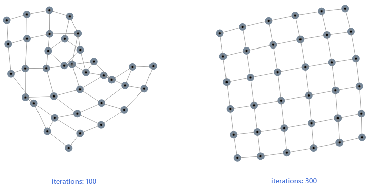

# kendo.dataviz.ui.Diagram

## Configuration

### autoBind `Boolean` *(default: true)*

If set to `false` the widget will not bind to the data source during initialization. In this case data binding will occur when the [change](/api/javascript/data/datasource/events/change) event of the
data source is fired. By default the widget will bind to the data source specified in the configuration.

> Setting `autoBind` to `false` is useful when multiple widgets are bound to the same data source. Disabling automatic binding ensures that the shared data source doesn't make more than one request to the remote service.

#### Example - disabling automatic binding

    <button id="btn">Bind Diagram</button>
    

    

### connectionDefaults `Object`

Defines the defaults of the connections. Whenever a connection is created, the specified connectionDefaults will be used and merged with the (optional) configuration passed through the connection creation method.

#### Example - typical connectionDefaults

    

    

### connectionDefaults.content `Object`

Defines the label displayed on the connection path.

#### Example - customizing connection content

    

    

### connectionDefaults.content.color `String`

The color of the connection content text.

### connectionDefaults.content.fontFamily `String`

The font family of the connection content text.

### connectionDefaults.content.fontSize `Number`

The font size of the connection content text.

### connectionDefaults.content.fontStyle `String`

The font style of the connection content text.

### connectionDefaults.content.fontWeight `String`

The font weight of the connection content text.

### connectionDefaults.content.template `String|Function`

The [template](/api/javascript/kendo/methods/template) which renders the labels.

The fields which can be used in the template are:

* dataItem - the data item, in case a field has been specified

#### Example - showing values from the connectionDataSource in the connection labels

    

    

### connectionDefaults.content.text `String`

The static text displayed on the connection.

### connectionDefaults.content.visual `Function`

A function returning a visual element to render for the content of a connection.

#### Example - using a content visual for connections

    

    

### connectionDefaults.editable `Boolean|Object` *(default: true)*

Defines the editing behavior of the connections.

#### Example - disabling interaction with the Diagram connections

    

    

### connectionDefaults.editable.drag `Boolean` *(default: true)*

Specifies if the connections can be dragged.

### connectionDefaults.editable.remove `Boolean` *(default: true)*

Specifies if the connections can be removed.

### connectionDefaults.editable.tools `Array`|`Boolean`

Specifies the toolbar tools. Supports all options supported for the [toolbar.items](/api/javascript/ui/toolbar/configuration/items). If set to `false`, no edit tools will be displayed.

Predefined tools are:

* "edit" - The selected item can be edited
* "delete" - The selected items can be deleted

#### Example - using predefined tools

    

    

#### Example - using custom tools

    

    

### connectionDefaults.editable.tools.name `String`

The name of the tool. The built-in tools are "edit" and "delete".

### connectionDefaults.endCap `String|Object`

The connections end cap configuration. Can be set to a configuration object or a string that represents the [endCap.type](/api/javascript/dataviz/ui/diagram/configuration/connectiondefaults.endcap#connectionDefaults.endCap.type) value.

#### Example - configuring the connection end cap

    

    

### connectionDefaults.endCap.fill `String|Object`

The connections end cap fill options or color.

### connectionDefaults.endCap.fill.color `String` *(default: "black")*

The connections end cap fill color.

### connectionDefaults.endCap.fill.opacity

The connections end cap fill opacity.

### connectionDefaults.endCap.stroke `String|Object`

The connections end cap stroke options or color.

### connectionDefaults.endCap.stroke.color `String`

The connections end cap stroke color.

### connectionDefaults.endCap.stroke.dashType `String`

The connections end cap stroke dash type.

The following dash types are supported:

* "dash" - A line that consists of dashes
* "dashDot" - A line that consists of a repeating pattern of dash-dot
* "dot" - A line that consists of dots
* "longDash" - A line that consists of a repeating pattern of long-dash
* "longDashDot" - A line that consists of a repeating pattern of long-dash-dot
* "longDashDotDot" - A line that consists of a repeating pattern of long-dash-dot-dot
* "solid" - A solid line

### connectionDefaults.endCap.stroke.width `Number`

The connections end cap stroke width.

### connectionDefaults.endCap.type `String` *(default: "none")*

The end cap type used in connections.

The supported values are:

* "none": no cap
* "ArrowEnd": a filled arrow
* "FilledCircle": a filled circle

### connectionDefaults.fromConnector `String` *(default: "Auto")*

Specifies the name of the source shape connector that should be used by default. Valid values are `"top"`, `"right"`, `"bottom"`, `"left"` and `"auto"`.

#### Example - making all connections originate from the bottom shape connector

    

    

### connectionDefaults.hover `Object`

Defines the default styling that is applied when the user hovers over a connection.

#### Example - turning the connection red on hover

    

    

### connectionDefaults.hover.stroke `Object`

Defines the default hover configuration of the connection lines.

### connectionDefaults.hover.stroke.color `String` *(default: "#70CAFF")*

Defines the highlight color when the mouse pointer hovers over connections.

### connectionDefaults.selectable `Boolean` *(default: true)*

Specifies if connections can be selected.

### connectionDefaults.selection `Object`

Defines the connections selection configuration.

##### Example - styling the connections selection

    

    

### connectionDefaults.selection.handles `Object`

Defines default handles configuration for selected connections.

### connectionDefaults.selection.handles.fill `String|Object`

Defines the handles fill options when connections are selected.

### connectionDefaults.selection.handles.fill.color `String`

Defines the handles fill color when connections are selected.

### connectionDefaults.selection.handles.stroke `Object`

Defines the handles stroke options when connections are selected.

### connectionDefaults.selection.handles.stroke.color `String`

Defines the handles stroke color when connections are selected.

### connectionDefaults.selection.handles.width `Number`

The width of the handle elements when connections are selected.

### connectionDefaults.selection.handles.height `Number`

The height of the handle elements when connections are selected.

### connectionDefaults.startCap `String|Object`

The connection start cap configuration or type name.

#### Example - configuring the connection start cap

    

    

### connectionDefaults.startCap.fill `String|Object`

The connection start cap fill options or color.

### connectionDefaults.startCap.fill.color `String` *(default: "black")*

The connection start cap fill color.

### connectionDefaults.startCap.fill.opacity

The connection start cap fill opacity.

### connectionDefaults.startCap.stroke `String|Object`

The connection start cap stroke options or color.

### connectionDefaults.startCap.stroke.color `String`

The connection start cap stroke color.

### connectionDefaults.startCap.stroke.dashType `String`

The connection start cap stroke dash type.

The following dash types are supported:

* "dash" - A line that consists of dashes
* "dashDot" - A line that consists of a repeating pattern of dash-dot
* "dot" - A line that consists of dots
* "longDash" - A line that consists of a repeating pattern of long-dash
* "longDashDot" - A line that consists of a repeating pattern of long-dash-dot
* "longDashDotDot" - A line that consists of a repeating pattern of long-dash-dot-dot
* "solid" - A solid line

### connectionDefaults.startCap.stroke.width `Number`

The connection start cap stroke width.

### connectionDefaults.startCap.type `String` *(default: "none")*

The connection start cap type.

The supported values are:

* "none": no cap
* "ArrowStart": a filled arrow
* "FilledCircle": a filled circle

### connectionDefaults.stroke `Object`

Defines the connection line configuration.

#### Example - customizing the connections stroke (line)

    

    

### connectionDefaults.stroke.color `String`

Defines the stroke or line color of the connection.

### connectionDefaults.stroke.width `Number`

Defines the stroke width of the connection.

### connectionDefaults.toConnector `String` *(default: "Auto")*

Specifies the name of the target shape connector that should be used by default. Valid values are `"top"`, `"right"`, `"bottom"`, `"left"` and `"auto"`.

#### Example - making all connections end in the bottom shape connector

    

    

### connectionDefaults.type `String` *(default: "cascading")*

Specifies the connections type. The supported values are:

* "Polyline" - connects the defined intermediate points.
* "Cascading" - discards given points and defines a cascading path between the endpoints.

#### Example - using polyline connections with intermediate points

    

    

### connections `Array`

Defines the connections configuration.

#### Example - configuring the Diagram connections

    

    

### connections.content `Object`

Defines the connection content settings.

#### Example - configuring the connections content (text)

    

    

### connections.content.color `String`

The color of the connection content text.

### connections.content.fontFamily `String`

The font family of the connection content text.

### connections.content.fontSize `Number`

The font size of the connection content text.

### connections.content.fontStyle `String`

The font style of the connection content text.

### connections.content.fontWeight `String`

The font weight of the connection content text.

### connections.content.template `String|Function`

The [template](/api/javascript/kendo/methods/template) which renders the labels.

#### Example - using a template for the connection label

    

    

### connections.content.text `String`

The text displayed for the connection.

### connections.content.visual `Function`

A function returning a visual element to render for the content of the connection.

#### Example - using a custom visual to render additional content in the connection label

    

    

### connections.editable `Boolean|Object` *(default: true)*

Defines the shape editable options.

#### Example - enabling only deletion for a connection

    

    

### connections.editable.tools `Array`

Specifies the the toolbar tools. Supports all options supported for the [toolbar.items](/api/javascript/ui/toolbar/configuration/items). Predefined tools are:

* "edit" - The selected item can be edited
* "delete" - The selected items can be deleted

#### Example - showing custom tool for connection

    

    

### connections.editable.tools.name `String`

The name of the tool. The built-in tools are "edit" and "delete".

### connections.endCap `String|Object`

The connection end cap configuration or type name.

#### Example - configuring the connection end cap

    

    

### connections.endCap.fill `String|Object`

The connection end cap fill options or color.

### connections.endCap.fill.color `String` *(default: "black")*

The connection end cap fill color.

### connections.endCap.fill.opacity

The connection end cap fill opacity.

### connections.endCap.stroke `String|Object`

The connection end cap stroke options or color.

### connections.endCap.stroke.color `String`

The connection end cap stroke color.

### connections.endCap.stroke.dashType `String`

The connection end cap stroke dash type.

The following dash types are supported:

* "dash" - A line that consists of dashes
* "dashDot" - A line that consists of a repeating pattern of dash-dot
* "dot" - A line that consists of dots
* "longDash" - A line that consists of a repeating pattern of long-dash
* "longDashDot" - A line that consists of a repeating pattern of long-dash-dot
* "longDashDotDot" - A line that consists of a repeating pattern of long-dash-dot-dot
* "solid" - A solid line

### connections.endCap.stroke.width `Number`

The connection end cap stroke width.

### connections.endCap.type `String` *(default: "none")*

The connection end cap type.

The supported values are:

* "none": no cap
* "ArrowEnd": a filled arrow
* "FilledCircle": a filled circle

You can also use "ArrowStart" for the endCap but its direction will be inversed.

### connections.from `Object|String|Number`

Defines the source of the connection. You can set this property to a value matching a shape id or to an object with XY-coordinates.

#### Example - configuring connection "from" and "to" settings

    

    

### connections.from.x `Number`

Defines the x-coordinate of the connection source.

### connections.from.y `Number`

Defines the y-coordinate of the connection source.

### connections.fromConnector `String` *(default: "Auto")*

Specifies the name of the source shape connector that should be used by the connection.

#### Example - originating the connection from the shape "bottom" connector

    

    

### connections.hover `Object`

Defines the hover configuration.

#### Example - configuring the connection hovered look

    

    

### connections.hover.stroke `Object`

Defines the hover stroke configuration.

### connections.hover.stroke.color `String` *(default: "#70CAFF")*

Defines the highlight color when the pointer is hovering over the connection.

### connections.points `Array`

Sets the intermediate points (in global coordinates) of the connection. These points cannot be manipulated by user action.

#### Example - setting intermediate connection points

    

    

### connections.points.x `Number`

Sets the X coordinate of the intermediate point.

### connections.points.y `Number`

Sets the Y coordinate of the intermediate point.

### connections.selection `Object`

Defines the connection selection configuration.

#### Example - customizing the connection selection handles

    

    

### connections.selection.handles `Object`

Defines the connection selection handles configuration.

### connections.selection.handles.fill `String|Object`

Defines the handles fill options.

### connections.selection.handles.fill.color `String`

Defines the handles fill color.

### connections.selection.handles.stroke `Object`

Defines the handles stroke options.

### connections.selection.handles.stroke.color `String`

Defines the handles stroke color.

### connections.selection.handles.width `Number`

The width of the handle elements.

### connections.selection.handles.height `Number`

The height of the handle elements.

### connections.startCap `String|Object`

The connection start cap configuration or type name.

#### Example - configuring the connection start cap

    

    

### connections.startCap.fill `String|Object`

The connection start cap fill options or color.

### connections.startCap.fill.color `String` *(default: "black")*

The connection start cap fill color.

### connections.startCap.fill.opacity

The connection start cap fill opacity.

### connections.startCap.stroke `String|Object`

The connection start cap stroke options or color.

### connections.startCap.stroke.color `String`

The connection start cap stroke color.

### connections.startCap.stroke.dashType `String`

The connection start cap stroke dash type.

The following dash types are supported:

* "dash" - A line that consists of dashes
* "dashDot" - A line that consists of a repeating pattern of dash-dot
* "dot" - A line that consists of dots
* "longDash" - A line that consists of a repeating pattern of long-dash
* "longDashDot" - A line that consists of a repeating pattern of long-dash-dot
* "longDashDotDot" - A line that consists of a repeating pattern of long-dash-dot-dot
* "solid" - A solid line

### connections.startCap.stroke.width `Number`

The connection start cap stroke width.

### connections.startCap.type `String` *(default: "none")*

The connection start cap type.

The supported values are:

* "none": no cap
* "ArrowStart": a filled arrow
* "FilledCircle": a filled circle

### connections.stroke `Object`

Defines the stroke configuration.

#### Example - configuring the connection stroke

    

    

### connections.stroke.color `String`

Defines the stroke or line color of the connection.

### connections.stroke.width `Number`

Defines the stroke width of the connection.

### connections.to `Object|String|Number`

Defines the target of the connection. You can set this property to a value matching a shape id or to an object with XY-coordinates.

#### Example - configuring connection "from" and "to" settings

    

    

### connections.to.x `Number`

Defines the point x value.

### connections.to.y `Number`

Defines the point y value.

### connections.toConnector `String` *(default: "Auto")*

Specifies the name of the target shape connector that should be used by the connection.

#### Example - ending the connection in the shape "bottom" connector

    

    

### connections.type `String` *(default: "cascading")*

Speifies the connection type, which defines the way it routes.

The routing of a connection is the way intermediate points of a connection define a route. A route is usually defined on the basis of constraints or behaviors. Currently there are two routing mechanisms for Diagram connections:

* polyline route - connects the defined intermediate points, see [connections.points](/api/javascript/dataviz/ui/diagram/configuration/connections.points).
* cascading route - a simple rectangular route that creates a cascading path between the two ends of a connection, ignoring given connection points. The cascading type is useful when using tree layout and hierarchies. The routed connection will in this case enhance the representation of the hierarchy, reproducing a classic organization diagram.

The available values for the `type` property are:

* "polyline" - connects the defined intermediate points. See [connections.points](/api/javascript/dataviz/ui/diagram/configuration/connections.points).
* "cascading" - discards given points and defines a cascading path between the endpoints.

#### Example - using a polyline connection with intermediate points

    

    

### connectionsDataSource `Object|Array|kendo.data.DataSource`

Defines the data source of the connections.

#### Example - setting the connectionsDataSource and dynamic labelling

Note that the 'from' and 'to' fields in the connectionsDataSource refer to the 'id' of the dataSource. The label on the connection is set via the [connectionsDefaults.content.template](/api/javascript/dataviz/ui/diagram#configuration-connectionDefaults.content.template).

    

    

### dataSource `Object|Array|kendo.data.DataSource`

Defines the data source of the diagram.

#### Example - defining a tree-diagram via the dataSource

Note that the HierarchicalDataSource needs to be used to define a hierarchy.
See also the connectionsDataSource example for other ways to define a diagram through a data source.

    

    

### editable `Boolean|Object` *(default: true)*

A set of settings to configure the Diagram behavior when the user attempts to:

* edit, delete or create shapes and connections.
* drag shapes.
* resize shapes.
* rotate shapes.

### editable.connectionTemplate `String|Function`

Specifies the connection editor template which shows up when editing the connection. A template can be used to change the default editors for the connection fields or to prevent some fields from being edited by not rendering an editor input for them.

#### Example - setting the connectionTemplate

    

    

    

### editable.drag `Boolean|Object` *(default: true)*

Specifies if the shapes and connections can be dragged.

#### Example - disabling dragging of shapes and connections

    

    

### editable.drag.snap `Boolean|Object` *(default: true)*

Specifies the shapes drag snap options. By default, during dragging, the shapes move by a given number of pixels at once. You can disable this behavior to make shapes movement smooth or you can specify a different number for the drag snap size to simulate a snap-to-grid functionality.

#### Example - disabling drag snap behavior in Diagram

    

    

### editable.drag.snap.size `Number` *(default: 10)*

Specifies the shapes drag snap size.

#### Example - increasing the Diagram drag snap size

    

    

### editable.remove `Boolean` *(default: true)*

Specifies if the shapes and connections can be removed.

#### Example - preventing shapes and connections deletion

    

    

### editable.resize `Boolean|Object` *(default: true)*

Defines the look-and-feel of the shape resizing handles.

#### Example - styling the resizing handles

    

    

### editable.resize.handles `Object`

Specifies the settings of the resizing handles. See the [editable.resize](/api/javascript/dataviz/ui/diagram#configuration-editable.resize) configuration for an example.

### editable.resize.handles.fill `String|Object`

Specifies the fill settings of the resizing handles. See the [editable.resize](/api/javascript/dataviz/ui/diagram#configuration-editable.resize) configuration for an example.

### editable.resize.handles.fill.color `String`

Specifies the fill color of the resizing handles. See the [editable.resize](/api/javascript/dataviz/ui/diagram#configuration-editable.resize) configuration for an example.

### editable.resize.handles.fill.opacity `Number` *(default: 1)*

Specifies the fill opacity of the resizing handles. See the [editable.resize](/api/javascript/dataviz/ui/diagram#configuration-editable.resize) configuration for an example.

### editable.resize.handles.height `Number`

Specifies the height of the resizing handles. See the [editable.resize](/api/javascript/dataviz/ui/diagram#configuration-editable.resize) configuration for an example.

### editable.resize.handles.hover `Object`

Specifies the settings of the resizing handles on hovering over them. See the [editable.resize](/api/javascript/dataviz/ui/diagram#configuration-editable.resize) configuration for an example.

### editable.resize.handles.hover.fill `String|Object`

Specifies the fill settings on hovering over the resizing handles. See the [editable.resize](/api/javascript/dataviz/ui/diagram#configuration-editable.resize) configuration for an example.

### editable.resize.handles.hover.fill.color `String`

Specifies the fill color on hovering over the resizing handles. See the [editable.resize](/api/javascript/dataviz/ui/diagram#configuration-editable.resize) configuration for an example.

### editable.resize.handles.hover.fill.opacity `Number` *(default: 1)*

Specifies the fill opacity on hovering over the resizing handles. See the [editable.resize](/api/javascript/dataviz/ui/diagram#configuration-editable.resize) configuration for an example.

### editable.resize.handles.hover.stroke `Object`

Specifies the stroke on hovering over the resizing handles. See the [editable.resize](/api/javascript/dataviz/ui/diagram#configuration-editable.resize) configuration for an example.

### editable.resize.handles.hover.stroke.color `String`

Specifies the stroke color on hovering over the resizing handles. See the [editable.resize](/api/javascript/dataviz/ui/diagram#configuration-editable.resize) configuration for an example.

### editable.resize.handles.hover.stroke.dashType `String`

Specifies the stroke dash type on hovering over the resizing handles. See the [editable.resize](/api/javascript/dataviz/ui/diagram#configuration-editable.resize) configuration for an example.

The following dash types are supported:

* "dash" - A line that consists of dashes
* "dashDot" - A line that consists of a repeating pattern of dash-dot
* "dot" - A line that consists of dots
* "longDash" - A line that consists of a repeating pattern of long-dash
* "longDashDot" - A line that consists of a repeating pattern of long-dash-dot
* "longDashDotDot" - A line that consists of a repeating pattern of long-dash-dot-dot
* "solid" - A solid line

### editable.resize.handles.hover.stroke.width `Number`

Specifies the stroke color on hovering over the resizing handles. See the [editable.resize](/api/javascript/dataviz/ui/diagram#configuration-editable.resize) configuration for an example.

### editable.resize.handles.stroke `Object`

Specifies the stroke of the resizing handles. See the [editable.resize](/api/javascript/dataviz/ui/diagram#configuration-editable.resize) configuration for an example.

### editable.resize.handles.stroke.color `String`

Specifies the stroke color of the resizing handles. See the [editable.resize](/api/javascript/dataviz/ui/diagram#configuration-editable.resize) configuration for an example.

### editable.resize.handles.stroke.dashType `String`

Specifies the stroke dash type of the resizing handles. See the [editable.resize](/api/javascript/dataviz/ui/diagram#configuration-editable.resize) configuration for an example.

The following dash types are supported:

* "dash" - A line that consists of dashes
* "dashDot" - A line that consists of a repeating pattern of dash-dot
* "dot" - A line that consists of dots
* "longDash" - A line that consists of a repeating pattern of long-dash
* "longDashDot" - A line that consists of a repeating pattern of long-dash-dot
* "longDashDotDot" - A line that consists of a repeating pattern of long-dash-dot-dot
* "solid" - A solid line

### editable.resize.handles.stroke.width `Number`

Specifies the stroke thickness of the resizing handles. See the [editable.resize](/api/javascript/dataviz/ui/diagram#configuration-editable.resize) configuration for an example.

### editable.resize.handles.width `Number`

Specifies the width of the resizing handles. See the [editable.resize](/api/javascript/dataviz/ui/diagram#configuration-editable.resize) configuration for an example.

### editable.rotate `Boolean|Object` *(default: true)*

Specifies whether the shapes can be rotated. Note that changing this setting after creating the diagram will have no effect.

### editable.rotate.fill `Object`

Specifies the fill settings of the rotation thumb.

### editable.rotate.fill.color `String`

Specifies the fill color of the rotation thumb.

### editable.rotate.fill.opacity `Number` *(default: 1)*

Specifies the fill opacity of the rotation thumb.

### editable.rotate.stroke `Object`

Specifies the stroke settings of the rotation thumb.

### editable.rotate.stroke.color `String`

Specifies the stroke color of the rotation thumb.

### editable.rotate.stroke.width `Number` *(default: 1)*

Specifies the stroke thickness of the rotation thumb.

### editable.shapeTemplate `String|Function`

Specifies the shape editor template. You can use it to customize the editing UI of the shape or to display editor controls only for certain fields of the shape data item.

#### Example - customizing the shape editing UI

    

    
    

### editable.tools `Array`

Specifies the the toolbar tools. Supports all options supported by the [toolbar.items](/api/javascript/ui/toolbar/configuration/items) property. Predefined tools are:

* "edit" - The selected item can be edited.
* "createShape" - Adds an empty shape data item and a popup window is displayed.
* "createConnection" - Adds an empty connection data item and a popup window is displayed.
* "undo" - Undoes the previous action.
* "redo" - Executes again the previously undone action.
* "rotateClockwise" - The selected items can be rotated clockwise. The default rotation value is 90 degree.
* "rotateAnticlockwise" - The selected items can be rotated anticlockwise. The default rotation value is 90 degree.

> If the toolbar or toolbar items are not visible, verify that the Kendo UI stylesheets are included in the header.

#### Example - using predefined tools

    

    

#### Example - using custom tools

    

    

### editable.tools.name `String`

The name of the tool. The built-in tools are "edit", "createShape", "createConnection", "undo", "redo", "rotateClockwise" and "rotateAnticlockwise".

### editable.tools.step `Number` *(default: 90)*

The step of the rotateClockwise and rotateAnticlockwise tools.

### layout `Object`

The layout of a diagram consists in arranging the shapes (sometimes also the connections) in some fashion in order to achieve an aesthetically pleasing experience to the user. It aims at giving a more direct insight in the information contained within the diagram and its relational structure.

On a technical level, layout consists of a multitude of algorithms and optimizations:

* analysis of the relational structure (loops, multi-edge occurrence...)
* connectedness of the diagram and the splitting into disconnected components
* crossings of connections
* bends and length of links

and various ad-hoc calculations which depend on the type of layout. The criteria on which an algorithm is based vary but the common denominator is:

* a clean separation of connected components (subgraphs)
* an orderly organization of the shapes in such a way that siblings are close to another, i.e. a tight packing of shapes which belong together (parent of child relationship)
* a minimum of connection crossings

Kendo diagram includes three of the most used layout algorithms which should cover most of your layout needs - **tree layout**, **force-directed layout** and **layered layout**. Please, check the type property for more details regarding each type.

The generic way to apply a layout is by calling the **layout()** method on the diagram. The method has a single parameter **options**. It is an object, which can contain parameters which are specific to the layout as well as parameters customizing the global grid layout. Parameters which apply to other layout algorithms can be included but are overlooked if not applicable to the chose layout type. This means that you can define a set of parameters which cover all possible layout types and simply pass it in the method whatever the layout define in the first parameter.

### layout.endRadialAngle `Number` *(default: 360)*

Defines where the circle/arc ends. The positive direction is **clockwise** and the angle is in **degrees**. *This setting is specific to the radial tree layout.*

### layout.grid `Object`

Each layout algorithm has a different set of parameters customizing the layout but they also all have a common collection of parameters which relate to the way 'pieces' of a diagram are organized.

A diagram can have in general disconnected pieces, known as components, which can be organized in a way independent of the way a component on its own is arranged. In the picture above, this is one diagram consisting of four components.

When you apply a certain layout an analysis will first split the diagram in components, arrange each component individually and thereafter organize the components in a grid. The common parameters referred above deal with this grid layout, they define the width, margin and padding of the (invisible) grid used to organize the components.

### layout.grid.componentSpacingX `Number` *(default: 50)*

Defines the horizontal spacing between each component. The default is 50.

### layout.grid.componentSpacingY `Number` *(default: 50)*

Defines the vertical spacing between each component. The default is 50.

### layout.grid.offsetX `Number` *(default: 50)*

Defines the left offset of the grid layout. The default is 50.

### layout.grid.offsetY `Number` *(default: 50)*

Defines the top offset of the grid layout. The default is 50.

### layout.grid.width `Number` *(default: 1500)*

Defines the width of the grid. The bigger this parameter the more components will be organized in an horizontal row. How many components really depends on your diagram and they type of layout applied to each component. The default is set to 800.

### layout.horizontalSeparation `Number` *(default: 90)*

Either the distance between the siblings if the tree is up/down or between levels if the tree is left/right. In *tipOver tree layout* this setting is used only for the direct children of the root

### layout.iterations `Number` *(default: 300)*

The number of times that all the forces in the diagram are being calculated and balanced. The default is set at 300, which should be enough for diagrams up to a hundred nodes. By increasing this parameter you increase the correctness of the simulation but it does not always lead to a more stable topology. In some situations a diagram simply does not have a stable minimum energy state and oscillates (globally or locally) between the minima. In such a situation increasing the iterations will not result in a better topology.

In situations where there is enough symmetry in the diagram the increased number of iterations does lead to a better layout. In the example below the 100 iterations was not enough to bring the grid to a stable state while 300 iterations did bring all the nodes in such a position that the (virtual) energy of the diagram is a minimum.

*This setting is specific to the force-directed layout*

### layout.layerSeparation `Number` *(default: 50)*

The height (in a vertical layout) or width (in a horizontal layout) between the layers.

### layout.nodeDistance `Number` *(default: 50)*

In the **force-directed layout** this setting defines the optimal length between 2 nodes, which directly correlates to the state of the link between them. If a link is longer than there will be a force pulling the nodes together, if the link is shorter the force will push the nodes apart. The optimal length is more and indication in the algorithm than a guarantee that all nodes will be at this distance. The result of the layout is really a combination of the incidence structure of the diagram, the initial topology (positions of the nodes) and the number of iterations.

In the **layered layout** it defines the minimum distance between nodes on the same level. Due to the nature of the algorithm this distance will only be respected if the the whole crossing of links and optimization does not induce a shift of the siblings.

*This setting is specific to the force-directed layout and layered layout*

### layout.radialFirstLevelSeparation `Number` *(default: 200)*

Controls the distance between the root and the immediate children of the root. *This setting is specific to the radial tree layout.*

### layout.radialSeparation `Number` *(default: 150)*

Defines the radial separation between the levels (except the first one which is defined by the aforementioned radialFirstLevelSeparation). *This setting is specific to the radial tree layout.*

### layout.startRadialAngle `Number` *(default: 0)*

Defines where the circle/arc starts. The positive direction is **clockwise** and the angle is in **degrees**. *This setting is specific to the radial tree layout.*

### layout.subtype `String` *(default: "down")*

The subtype further defines the layout type by specifying in greater detail the behaviour expected by the layout algorithm. Possible predefined values are:

* "down" - *tree layout* and *layered layout* specific subtype. In the tree layout the root is arranged at the top and its children downwards. For the layered layout the links are directed downwards. This is the default subtype.

* "up" - *tree layout* and *layered layout* specific subtype. In the tree layout the root is arranged at the bottom and its children upwards. For the layered layout the links are directed upwards.
* "left" - *tree layout* *layered layout* specific subtype. In the tree layout the root is arranged at the left and its children sideways to the right. For the layered layout the links are directed to the left.
* "right" - *tree layout* *layered layout* specific subtype. In the tree layout the root is arranged at the right and its children sideways to the left. For the layered layout the links are directed downwards.

* "mindmapHorizontal" - *tree layout* specific subtype. The root sits at the center and its children are spread equally to the left and right.
* "mindmapVertical" - *tree layout* specific subtype. The root sits at the center and its children are spread equally above and below.

* "radial" - *tree layout* specific subtype. The root sits at the center and its children are spread radially around.

* "tipOver" - *tree layout* specific subtype. A special version of the tree-down layout where the grand-children (and iteratively) are arranged vertically while the direct children are arranged horizontally. This arrangement has the advantage that it doesn't spread as much as the classic tree-down layout. See below for a concrete example.

* "horizontal" - *layered layout* specific subtype. The preferred direction of the links is horizontal.
* "vertical" - *layered layout* specific subtype. The preferred direction of the links is vertical.

### layout.tipOverTreeStartLevel `Number` *(default: 0)*

Specifies the start level when the [subtype](/api/javascript/dataviz/ui/diagram#configuration-layout.subtype) is `tipOver`.

#### Example - set the tipOver layout start level

    

    

### layout.type `String` *(default: "tree")*

The type of the layout algorithm to use. Predefined values are:

* "tree" - Organizes a diagram in a hierarchical way and is typically used in organizational representations. This type includes the radial tree layout, mindmapping and the classic tree diagrams.
* "force" - Force-directed layout algorithm (also known as the spring-embedder algorithm) is based on a physical simulation of forces acting on the nodes whereby the links define whether two nodes act upon each other. Each link effectively is like a spring embedded in the diagram. The simulation attempts to find a minimum energy state in such a way that the springs are in their base-state and thus do not pull or push any (linked) node. This force-directed layout is **non-deterministic**; each layout pass will result in an unpredictable (and hence not reproducible) layout. The optimal length is more and indication in the algorithm than a guarantee that all nodes will be at this distance. The result of the layout is really a combination of the incidence structure of the diagram, the initial topology (positions of the nodes) and the number of iterations.

* "layered" - Organizes the diagram with an emphasis on *flow* and minimizing the crossing between layers of shapes. This layout works well when few components are present and some sort of top-down flow is present. The concept of *flow* in this context being a more or less clear direction of the connections with a minimum of cycles (connections flowing back upstream). Layered graph layout is a type of graph layout in which the nodes of a (directed) graph are drawn in horizontal or vertical layers with the links directed in the complementary direction. It is also known as Sugiyama or hierarchical graph layout. When the graph is a tree the layout reduces to a standard tree layout and thus can be considered as an extension to the classic tree layout.

There are several criteria on which this algorithm is based and which are respected in as far as the incidence structure allows it:
* links have a preferred direction (the complementary direction of the subtype) and attempt to flow as much as possible in this way
* linked nodes try to stay closed to one another (clustering of nodes)
* links crossings should be minimized
* links should be as short as possible (cross a few layers as possible)

The construction of a layered graph drawing proceeds in a series of steps (assuming an horizontal layer from here on):
 + If the input graph is not already a directed acyclic graph, a set of edges is identified the reversal of which will make it acyclic.
 + The nodes of the directed acyclic graph resulting from the first step are assigned to layers, such that each link goes from a higher layer to a lower layer.
 + Edges that span multiple layers are replaced by paths of dummy vertices so that, after this step, each edge in the expanded graph connects two vertices on adjacent layers of the drawing.
 + The nodes within each layer are permuted in an attempt to reduce the number of crossings among the edges connecting it to the previous layer.
 + Each node is assigned a coordinate within its layer, consistent with the permutation calculated in the previous step.
 + The edges reversed in the first step of the algorithm are returned to their original orientations, the dummy vertices are removed from the graph and the vertices and edges are drawn.

### layout.underneathHorizontalOffset `Number` *(default: 15)*

Defines the horizontal offset from a child with respect to its parent. *This setting is specific to the tipOver tree layout.*

### layout.underneathVerticalSeparation `Number` *(default: 15)*

Defines the vertical separation between siblings and sub-branches. *This setting is specific to the tipOver tree layout.*

### layout.underneathVerticalTopOffset `Number` *(default: 15)*

Defines the vertical separation between a parent and its first child. This offsets the whole set of children with respect to its parent. *This setting is specific to the tipOver tree layout.*

### layout.verticalSeparation `Number` *(default: 50)*

Either the distance between levels if the tree is up/down or between siblings if the tree is left/right. This property is **not used** in *tipOver tree layout* but rather replaced with three additional ones - **underneathVerticalTopOffset**, **underneathVerticalSeparation** and **underneathHorizontalOffset**

### pannable `Boolean|Object` *(default: true)*

Defines the pannable options. Use this setting to disable Diagram pan or change the key that activates the pan behavior.

#### Example - disabling Diagram panning

    

    

### pannable.key `String` *(default: "ctrl")*

Defines the meta key that will be used while panning the Diagram. To avoid clashes, verify that the `pannable.key` and [`selectable.key`](/api/javascript/dataviz/ui/diagram#configuration-selectable.key) options are different. The available values are:

* "none" - No activation key
* "ctrl" - The activation key will be `Ctrl`
* "shift" - The activation key will be `Shift`
* "alt" - The activation key will be `Alt`

> This option is not applicable for mobile devices.

#### Example - enabling panning using the Shift key

    

    

### pdf `Object`

Configures the export settings for the [`saveAsPDF`](/api/javascript/dataviz/ui/diagram/methods/saveaspdf) method.

### pdf.author `String` *(default: null)*

The author of the PDF document that will be visible in the PDF file metadata.

#### Example - setting the PDF document author
    

    

### pdf.creator `String` *(default: "Kendo UI PDF Generator")*

The creator of the PDF document.

#### Example - setting the PDF document creator

    

    

### pdf.date `Date`

The date when the PDF document is created. Defaults to `new Date()`.

#### Example - setting the PDF document create date

    

    

### pdf.fileName `String` *(default: "Export.pdf")*

Specifies the file name of the exported PDF file.

#### Example - setting the default PDF file name
    

    

### pdf.forceProxy `Boolean` *(default: false)*

If set to `true`, the exported content is forwarded to the endpoint specified using the [`proxyURL`](/api/javascript/dataviz/ui/diagram#configuration-pdf.proxyURL) setting, even if the browser supports saving of files in the user's local file system.

### pdf.keywords `String` *(default: null)*

Specifies the keywords that will appear in the metadata of the exported PDF file.

#### Example - setting the PDF document keywords
    

    

### pdf.landscape `Boolean` *(default: false)*

If set to `true`, changes the document orientation to landscape. This property takes effect when [pdf.paperSize](/api/javascript/dataviz/ui/diagram/configuration/pdf.papersize) is set.

#### Example - enabling landscape mode
    

    

### pdf.margin `Object`

Sets the paper margins. The value has to be an object containing `top`, `left`, `right`, and `bottom` numbers which specify the paper margins. If numbers are passed, they are assumed to be in points (pt). By using strings, you can specify the units. The supported units are `mm`, `cm`, `in`, and `pt` (default).

#### Example - setting the PDF document margins
    

    

### pdf.margin.bottom `Number|String` *(default: 0)*

The bottom margin. Numbers are assumed to be in `pt` units.

### pdf.margin.left `Number|String` *(default: 0)*

The left margin. Numbers are assumed to be in `pt` units.

### pdf.margin.right `Number|String` *(default: 0)*

The right margin. Numbers are assumed to be in `pt` units.

### pdf.margin.top `Number|String` *(default: 0)*

The top margin. Numbers are assumed to be in `pt` units.

### pdf.paperSize `String|Array` *(default: "auto")*

Specifies the paper size of the PDF document. The default setting is `auto` and determines the paper size by content.

> The size of the content in pixels matches the size of the output in points (1 pixel = 1/72 inch).

The supported values are:

* A predefined size:  `A0`-`A10`, `B0`-`B10`, `C0`-`C10`, `Executive`, `Folio`, `Legal`, `Letter`, `Tabloid`.
* An array of two numbers specifying the width and height in points (1pt = 1/72in)
* An array of two strings specifying the width and height in units.
  The supported units are `mm`, `cm`, `in`, and `pt`.

#### Example - setting custom paper size
    

    

### pdf.proxyURL `String` *(default: null)*

The URL of the server side proxy which will stream the file to the end user.

When the browser is not capable of saving files locally, a proxy will be used. Such browsers are Internet Explorer version 9 (and older) and Safari. You are responsible for implementing the server-side proxy. The proxy receives a `POST` request with the following parameters in the request body:

* `contentType` - The MIME type of the file
* `base64` - The base-64 encoded file content
* `fileName` - The file name, as requested by the caller.

The proxy is expected to return the decoded file with a set `Content-Disposition` header.

You can see sample server proxy implementations here: [Server Proxy Implementations](/framework/save-files/introduction#server-proxy-implementations).

#### Example - setting the server proxy URL
    

    

### pdf.proxyTarget `String` *(default: "_self")*

A name or keyword indicating where to display the document returned from the proxy.

If you want to display the document in a new window or an iframe, the proxy method has to set the `Content-Disposition` header of the response to `inline; filename="<fileName.pdf>"`.

#### Example - opening the generated document in a new window
    

    

### pdf.subject `String` *(default: null)*

Sets the subject of document, which will be shown in the PDF file metadata.

#### Example - setting the PDF document subject
    

    

### pdf.title `String` *(default: null)*

Sets the title of the document, which will be shown in the PDF file metadata.

#### Example - setting the PDF document title
    

    

### selectable `Boolean|Object` *(default: true)*

Defines the Diagram selection options.

By default, you can select shapes in the Diagram in one of two ways:

* Clicking a single shape to select it and deselect any previously selected shapes.
* Holding the `Ctrl` key while clicking multiple shapes to select them and any other shapes between them.

Using the `selectable` configuration, you can enable single selection only, enable selection by drawing a rectangular area with the mouse around shapes in the canvas, or disable selection altogether.

### selectable.key `String` *(default: "none")*

Defines the meta key when doing a visual selection through drawing a rectangular area around shapes in the canvas. This option does not change the way a single shape is selected when using click or tap. To avoid clashes, verify that the `selectable.key` and [`pannable.key`](/api/javascript/dataviz/ui/diagram#configuration-pannable.key) are different. The available values are:

* "none" - No activation key, visual selection is disabled.
* "ctrl" - The activation key will be `Ctrl`.
* "shift" - The activation key will be `Shift`.
* "alt" - The activation key will be `Alt`.

> This option is not applicable for mobile devices.

#### Example - enabling selection through holding the Shift key and drawing a rectangle around shapes

    

    

### selectable.multiple `Boolean` *(default: true)*

Specifies if the multiple selection should be enabled.

#### Example - disabling multiple selection

    

    

### selectable.stroke `Object`

Defines the selection line configuration.

#### Example - customizing the selection stroke

    

    

### selectable.stroke.color `String`

Defines the selection stroke color. Accepts valid CSS colors.

### selectable.stroke.dashType `String`

Defines the selection dash type. The following dash types are supported:

* "dash" - a line consisting of dashes
* "dashDot" - a line consisting of a repeating pattern of dash-dot
* "dot" - a line consisting of dots
* "longDash" - a line consisting of long dashes
* "longDashDot" - a line consisting of a repeating pattern of long dash-dot
* "longDashDotDot" - a line consisting of a repeating pattern of long dash-dot-dot
* "solid" - a solid line

### selectable.stroke.width `Number`

Defines the selection stroke width.

### shapeDefaults `Object`

Defines the default options that will be applied to all shapes in the Diagram.

### shapeDefaults.connectors `Array`

Defines the connectors the shape owns. A connector is the point in the shape where a connection between this shape and another one can originate from or end.

* "top" - top connector.
* "right" - right connector.
* "bottom" - bottom connector.
* "bottomRight" - bottom right connector.
* "left" - left connector.
* "auto" - auto connector.

You can define your own custom connectors or use the predefined types.

#### Example - including only some connectors and customize their look

    

    

The following example demonstrates how to define a custom shape with connectors adapted to the outline of the shape. You can see how the shape bounds are accessed and used to determine the position of the connectors.

#### Example - creating a custom shape with custom connectors

    

    

### shapeDefaults.connectors.name `String`

The connector name. The name is referenced when specifying explicit `fromConnector` and `toConnector` values in a connection.

### shapeDefaults.connectors.position `Function`

The function that positions the connector. The function is passed a shape and should return `kendo.dataviz.diagram`. As a result, a point that holds the connector position appears.

### shapeDefaults.connectors.width `Number` *(default: 8)*

Defines the width of the shape connectors.

### shapeDefaults.connectors.height `Number` *(default: 8)*

Defines the height of the shape connectors.

### shapeDefaults.connectors.hover `Object`

Defines the hover configuration of the shape connectors.

### shapeDefaults.connectors.hover.fill `String|Object`

Defines the hover fill options of the shape connectors.

### shapeDefaults.connectors.hover.fill.color `String`

Defines the hover fill color of the shape connectors.

### shapeDefaults.connectors.hover.fill.opacity `Number` *(default: 1)*

Defines the hover fill opacity of the shape connectors.

### shapeDefaults.connectors.hover.stroke `String|Object`

Defines the hover stroke options of the shape connectors.

### shapeDefaults.connectors.hover.stroke.color `String` *(default: "Black")*

Defines the hover stroke color.

### shapeDefaults.connectors.hover.stroke.dashType `String`

The hover stroke dash type.

The following dash types are supported:

* "dash" - A line that consists of dashes
* "dashDot" - A line that consists of a repeating pattern of dash-dot
* "dot" - A line that consists of dots
* "longDash" - A line that consists of a repeating pattern of long-dash
* "longDashDot" - A line that consists of a repeating pattern of long-dash-dot
* "longDashDotDot" - A line that consists of a repeating pattern of long-dash-dot-dot
* "solid" - A solid line

### shapeDefaults.connectors.hover.stroke.width `Number` *(default: 1)*

Defines the thickness or width of the shape connectors stroke on hover.

### shapeDefaults.connectors.fill `String|Object`

Defines the fill options of the shape connectors.

### shapeDefaults.connectors.fill.color `String`

Defines the fill color of the shape connectors.

### shapeDefaults.connectors.fill.opacity `Number` *(default: 1)*

Defines the fill opacity of the shape connectors.

### shapeDefaults.connectors.stroke `String|Object`

Defines the stroke options of the shape connectors.

### shapeDefaults.connectors.stroke.color `String` *(default: "Black")*

Defines the stroke color.

### shapeDefaults.connectors.stroke.dashType `String`

Defines the stroke dash type. The following dash types are supported:

* "dash" - a line consisting of dashes
* "dashDot" - a line consisting of a repeating pattern of dash-dot
* "dot" - a line consisting of dots
* "longDash" - a line consisting of long dashes
* "longDashDot" - a line consisting of a repeating pattern of long dash-dot
* "longDashDotDot" - a line consisting of a repeating pattern of long dash-dot-dot
* "solid" - a solid line

### shapeDefaults.connectors.stroke.width `Number` *(default: 1)*

Defines the thickness or width of the shape connectors stroke.

### shapeDefaults.connectorDefaults `Object`

Defines the default options for the shape connectors.

#### Example - customizing the Diagram shape connectors

    

    

### shapeDefaults.connectorDefaults.width `Number` *(default: 8)*

Defines the width of the shape connectors.

### shapeDefaults.connectorDefaults.height `Number` *(default: 8)*

Defines the height of the shape connectors.

### shapeDefaults.connectorDefaults.hover `Object`

Defines the hover configuration of the shape connectors.

### shapeDefaults.connectorDefaults.hover.fill `String|Object`

Defines the hover fill options of the shape connectors.

### shapeDefaults.connectorDefaults.hover.fill.color `String`

Defines the hover fill color of the shape connectors.

### shapeDefaults.connectorDefaults.hover.fill.opacity `Number` *(default: 1)*

Defines the hover fill opacity of the shape connectors.

### shapeDefaults.connectorDefaults.hover.stroke `String|Object`

Defines the hover stroke options of the shape connectors.

### shapeDefaults.connectorDefaults.hover.stroke.color `String` *(default: "Black")*

Defines the hover stroke color.

### shapeDefaults.connectorDefaults.hover.stroke.dashType `String`

The dash type of the hover stroke.

The following dash types are supported:

* "dash" - A line that consists of dashes
* "dashDot" - A line that consists of a repeating pattern of dash-dot
* "dot" - A line that consists of dots
* "longDash" - A line that consists of a repeating pattern of long-dash
* "longDashDot" - A line that consists of a repeating pattern of long-dash-dot
* "longDashDotDot" - A line that consists of a repeating pattern of long-dash-dot-dot
* "solid" - A solid line

### shapeDefaults.connectorDefaults.hover.stroke.width `Number` *(default: 1)*

Defines the thickness or width of the shape connectors stroke on hover.

### shapeDefaults.connectorDefaults.fill `String|Object`

Defines the fill options of the shape connectors.

### shapeDefaults.connectorDefaults.fill.color `String`

Defines the fill color of the shape connectors.

### shapeDefaults.connectorDefaults.fill.opacity `Number` *(default: 1)*

Defines the fill opacity of the shape connectors.

### shapeDefaults.connectorDefaults.stroke `String|Object`

Defines the stroke options of the shape connectors.

### shapeDefaults.connectorDefaults.stroke.color `String` *(default: "Black")*

Defines the stroke color.

### shapeDefaults.connectorDefaults.stroke.dashType `String`

Defines the stroke dash type. The following dash types are supported:

* "dash" - a line consisting of dashes
* "dashDot" - a line consisting of a repeating pattern of dash-dot
* "dot" - a line consisting of dots
* "longDash" - a line consisting of long dashes
* "longDashDot" - a line consisting of a repeating pattern of long dash-dot
* "longDashDotDot" - a line consisting of a repeating pattern of long dash-dot-dot
* "solid" - a solid line

### shapeDefaults.connectorDefaults.stroke.width `Number` *(default: 1)*

Defines the thickness or width of the shape connectors stroke.

### shapeDefaults.content `Object`

Defines the default shapes content settings.

#### Example - customizing the shapes content appearance

    

    

### shapeDefaults.content.align `String`

The alignment of the text inside the shape. You can do combinations between "top", "middle" and "bottom" for vertical align and "right", "center" and "left" for horizontal align. For example, "top right", "middle left", "bottom center", and so on.

### shapeDefaults.content.color `String`

The color of the shape content text.

### shapeDefaults.content.fontFamily `String`

The font family of the shape content text.

### shapeDefaults.content.fontSize `Number`

The font size of the shape content text.

### shapeDefaults.content.fontStyle `String`

The font style of the shape content text.

### shapeDefaults.content.fontWeight `String`

The font weight of the shape content text.

### shapeDefaults.content.template `String|Function`

The [`template`](/api/javascript/kendo/methods/template) which renders the labels.

The fields which can be used in the template are:

* dataItem - The data item if a field has been specified

#### Example - using a template for the shapes content

    

    

### shapeDefaults.content.text `String`

The text that is displayed in the shape.

### shapeDefaults.editable `Boolean|Object` *(default: true)*

Defines the shape editable options.

### shapeDefaults.editable.connect `Boolean` *(default: true)*

Specifies if new connections can be added using the shapes connectors.

#### Example - preventing the user from adding new connections to shapes

    

    

### shapeDefaults.editable.drag `Boolean` *(default: true)*

Specifies if the shapes can be dragged.

#### Example - disabling shapes dragging

    

    

### shapeDefaults.editable.remove `Boolean` *(default: true)*

Specifies if the shapes can be removed.

#### Example - preventing the user from deleting shapes

    

    

### shapeDefaults.editable.tools `Array`|`Boolean`

Specifies the toolbar tools. Provides all options that are supported for [`toolbar.items`](/api/javascript/ui/toolbar/configuration/items). If set to `false`, no edit tools will be displayed.

The predefined tools are:

* "edit" - The selected item can be edited.
* "delete" - The selected items can be deleted.
* "rotateClockwise" - The selected items can be rotated clockwise. The default rotation value is 90 degrees.
* "rotateAnticlockwise" - The selected items can be rotated anticlockwise. The default rotation value is 90 degrees.

#### Example - using predefined tools

    

    

#### Example - using custom tools

    

    

### shapeDefaults.editable.tools.name `String`

The name of the tool. The built-in tools are `edit`, `delete`, `rotateClockwise`, and `rotateAnticlockwise`.

### shapeDefaults.editable.tools.step `Number` *(default: 90)*

The step of the `rotateClockwise` and  `rotateAnticlockwise` tools. It determines the angle at which a selected shape will be rotated when one of the tools is clicked.

#### Example - changing the shapes rotation step

    

    

### shapeDefaults.fill `String|Object`

Defines the fill options of the shape. Use these settings to apply a single-color or a gradient background to all shapes in the Diagram.

#### Example - applying a custom color to all Diagram shapes

    

    

### shapeDefaults.fill.color `String`

Defines the fill color of the shape.

### shapeDefaults.fill.opacity `Number` *(default: 1)*

Defines the fill opacity of the shape.

### shapeDefaults.fill.gradient `Object`

Defines the gradient fill of the shape.

#### Example - providing a custom gradient background to Diagram shapes

    

    

### shapeDefaults.fill.gradient.type `String` *(default: "linear")*
The type of the gradient. The supported values are:

* linear
* radial

### shapeDefaults.fill.gradient.center `Array`
The center of the radial gradient.

The coordinates are relative to the shape-bounding box.
For example, `[0, 0]` is top left and `[1, 1]` is bottom right.

### shapeDefaults.fill.gradient.radius `Number` *(default: 1)*
The radius of the radial gradient relative to the shape bounding box.

### shapeDefaults.fill.gradient.start `Array`
The start point of the linear gradient.

Coordinates are relative to the shape bounding box.
For example, `[0, 0]` is top left and `[1, 1]` is bottom right.

### shapeDefaults.fill.gradient.end `Array`
The end point of the linear gradient.

Coordinates are relative to the shape bounding box.
For example, `[0, 0]` is top left and `[1, 1]` is bottom right.

### shapeDefaults.fill.gradient.stops `Array`
The array of gradient color stops.

### shapeDefaults.fill.gradient.stops.offset `Number`
The stop offset from the start of the element.
Ranges from `0` (start of gradient) to `1` (end of gradient).

### shapeDefaults.fill.gradient.stops.color `String`
The color in any of the following formats:

| Format         | Description
| ---            | --- | ---
| red            | [Basic](http://www.w3.org/TR/css3-color/#html4) or [Extended](http://www.w3.org/TR/css3-color/#svg-color) CSS Color name
| #ff0000        | Hex RGB value
| rgb(255, 0, 0) | RGB value

Specifying `'none'`, `'transparent'`, or `''` (empty string) clears the fill.

### shapeDefaults.fill.gradient.stops.opacity `Number`
The fill opacity.
Ranges from `0` (completely transparent) to `1` (opaque).

### shapeDefaults.height `Number` *(default: 100)*

Defines the default height of shapes in the Diagram.

#### Example - changing the default height of Diagram shapes

    

    

### shapeDefaults.hover `Object`

Defines the `hover` configuration.

#### Example - changing the shapes default color on hover

    

    

### shapeDefaults.hover.fill `String|Object`

Defines the `hover` fill options.

### shapeDefaults.hover.fill.color `String`

Defines the `hover` fill color.

### shapeDefaults.hover.fill.opacity `Number` *(default: 1)*

Defines the `hover` fill opacity.

### shapeDefaults.minHeight `Number` *(default: 20)*

Defines the minimum height the shape can have. Use this setting to apply a lower limit to the height of shapes when users resize them.

#### Example - applying a minimum height to which shapes can be resized

    

    

### shapeDefaults.minWidth `Number` *(default: 20)*

Defines the minimum width the shape can have. Use this setting to apply a lower limit to the width of shapes when users resize them.

#### Example - applying a minimum width to which shapes can be resized

    

    

### shapeDefaults.path `String`

The path option of a Shape is a description of a custom geometry. The format follows the standard SVG format (http://www.w3.org/TR/SVG/paths.html#PathData "SVG Path data.").

#### Example - making all shapes octagons by default

    

    

### shapeDefaults.rotation `Object` *(default: null)*

Defines the rotation of the shape.

#### Example - applying a default rotation to Diagram shapes

    

    

### shapeDefaults.rotation.angle `Number` *(default: 0)*

Sets the rotational angle of the shape.

### shapeDefaults.selectable `Boolean` *(default: true)*

Specifies if Diagram shapes can be selected.

#### Example - disabling selection for Diagram shapes

    

    

### shapeDefaults.source `String`

The path/URL to the shape image. Applicable when the type is set to `"image"`.

#### Example - applying a default image for all shapes

    

    

### shapeDefaults.stroke `Object`

Defines the configuration of the border around Diagram shapes.

#### Example - applying a custom border around shapes

    

    

### shapeDefaults.stroke.color `String` *(default: "Black")*

Defines the color of the shape stroke.

### shapeDefaults.stroke.dashType `String`

The dash type of the shape.

The following dash types are supported:

* "dash" - A line that consists of dashes
* "dashDot" - A line that consists of a repeating pattern of dash-dot
* "dot" - A line that consists of dots
* "longDash" - A line that consists of a repeating pattern of long-dash
* "longDashDot" - A line that consists of a repeating pattern of long-dash-dot
* "longDashDotDot" - A line that consists of a repeating pattern of long-dash-dot-dot
* "solid" - A solid line

### shapeDefaults.stroke.width `Number` *(default: 1)*

Defines the thickness or width of the shape stroke.

### shapeDefaults.type `String` *(default: "rectangle")*

Specifies the type of the Shape using any of the built-in shape type.

* "rectangle": this is the default option
* "circle": a circle/ellipse
* "image": an image
* "text": some text

#### Example - making all Diagram shapes circles by default

    

    

### shapeDefaults.visual `Function`

A function that returns a visual element to render for a given shape. The following primitives can be used to construct a composite visual:

* [Circle](/api/javascript/dataviz/diagram/circle)
* [Rectangle](/api/javascript/dataviz/diagram/rectangle)
* [Path](/api/javascript/dataviz/diagram/path)
* [Line](/api/javascript/dataviz/diagram/line)
* [Polyline](/api/javascript/dataviz/diagram/polyline)
* [TextBlock](/api/javascript/dataviz/diagram/text_block)
* [Image](/api/javascript/dataviz/diagram/image)
* [Layout](/api/javascript/dataviz/diagram/layout)

> The origin of the visual bounding box has to be `(0, 0)`. If you have a complex path which coordinates cannot be easily adjusted, then position the element as demonstrated in [this](/controls/diagrams-and-maps/diagram/how-to/adjust-path-origin) example.

#### Example - declaring a custom visual for Diagram shapes
    

    

### shapeDefaults.width `Number` *(default: 100)*

Defines the default width of shapes in the Diagram.

#### Example - changing the default width of shapes

    

    

### shapeDefaults.x `Number` *(default: 0)*

Defines the x-coordinate of shapes added to the Diagram.

### shapeDefaults.y `Number` *(default: 0)*

Defines the y-coordinate of shapes added to the Diagram.

### shapes `Array`

Defines the shape options.

### shapes.connectors `Array`

Defines the connectors available in the shape. A connector is the point in the shape where a connection between this shape and another one can originate from or end.

#### Example - limiting the available connectors in a shape
    

    

### shapes.connectors.description `String`

The connector description.

### shapes.connectors.name `String`

The connector name. The predefined names are:

* "top" - top connector
* "right" - right connector
* "bottom" - bottom connector
* "bottomRight" - bottom right connector
* "left" - left connector
* "auto" - auto connector

### shapes.connectors.position `Function`

The function that positions the connector. The function is passed a shape as parameter and should return a `kendo.dataviz.diagram.Point` indicating where the connector should be placed.

#### Example - placing connectors at a custom position

    

    

### shapes.connectors.width `Number` *(default: 8)*

Defines the width of the shape connectors.  See [shapes.connectors](/api/javascript/dataviz/ui/diagram/configuration/shapes.connectors) for an example.

### shapes.connectors.height `Number` *(default: 8)*

Defines the height of the shape connectors. See [shapes.connectors](/api/javascript/dataviz/ui/diagram/configuration/shapes.connectors) for an example.

### shapes.connectors.hover `Object`

Defines the hover configuration of the shape connectors.

#### Example - applying custom styling to a hovered connector

    

    

### shapes.connectors.hover.fill `String|Object`

Defines the hover fill options of the shape connectors.

### shapes.connectors.hover.fill.color `String`

Defines the hover fill color of the shape connectors.

### shapes.connectors.hover.fill.opacity `Number` *(default: 1)*

Defines the hover fill opacity of the shape connectors.

### shapes.connectors.hover.stroke `String|Object`

Defines the hover stroke options of the shape connectors.

### shapes.connectors.hover.stroke.color `String` *(default: "Black")*

Defines the hover stroke color.

### shapes.connectors.hover.stroke.dashType `String`

The dash type of the hover stroke.

The following dash types are supported:

* "dash" - A line that consists of dashes
* "dashDot" - A line that consists of a repeating pattern of dash-dot
* "dot" - A line that consists of dots
* "longDash" - A line that consists of a repeating pattern of long-dash
* "longDashDot" - A line that consists of a repeating pattern of long-dash-dot
* "longDashDotDot" - A line that consists of a repeating pattern of long-dash-dot-dot
* "solid" - A solid line

### shapes.connectors.hover.stroke.width `Number` *(default: 1)*

Defines the thickness or width of the shape connectors stroke on hover.

### shapes.connectors.fill `String|Object`

Defines the fill options of the shape connectors.

#### Example - applying a custom fill color to a shape connector

    

    

### shapes.connectors.fill.color `String`

Defines the fill color of the shape connectors.

### shapes.connectors.fill.opacity `Number` *(default: 1)*

Defines the fill opacity of the shape connectors.

### shapes.connectors.stroke `String|Object`

Defines the stroke options of the shape connectors.

#### Example - customizing the connectors stroke style

    

    

### shapes.connectors.stroke.color `String` *(default: "Black")*

Defines the stroke color.

### shapes.connectors.stroke.dashType `String`

The connector stroke dash type.

The following dash types are supported:

* "dash" - A line that consists of dashes
* "dashDot" - A line that consists of a repeating pattern of dash-dot
* "dot" - A line that consists of dots
* "longDash" - A line that consists of a repeating pattern of long-dash
* "longDashDot" - A line that consists of a repeating pattern of long-dash-dot
* "longDashDotDot" - A line that consists of a repeating pattern of long-dash-dot-dot
* "solid" - A solid line

### shapes.connectors.stroke.width `Number` *(default: 1)*

Defines the thickness or width of the shape connectors stroke.

### shapes.connectorDefaults `Object`

Defines default options for all connectors belonging to a given shape.

#### Example - customizing the connectors of a Diagram shape

    

    

### shapes.connectorDefaults.width `Number` *(default: 8)*

Defines the width of the shape connectors.

### shapes.connectorDefaults.height `Number` *(default: 8)*

Defines the height of the shape connectors.

### shapes.connectorDefaults.hover `Object`

Defines the hover configuration of the shape connectors.

### shapes.connectorDefaults.hover.fill `String|Object`

Defines the hover fill options of the shape connectors.

### shapes.connectorDefaults.hover.fill.color `String`

Defines the hover fill color of the shape connectors.

### shapes.connectorDefaults.hover.fill.opacity `Number` *(default: 1)*

Defines the hover fill opacity of the shape connectors.

### shapes.connectorDefaults.hover.stroke `String|Object`

Defines the hover stroke options of the shape connectors.

### shapes.connectorDefaults.hover.stroke.color `String` *(default: "Black")*

Defines the hover stroke color.

### shapes.connectorDefaults.hover.stroke.dashType `String`

The dash type of the hover stroke.

The following dash types are supported:

* "dash" - A line that consists of dashes
* "dashDot" - A line that consists of a repeating pattern of dash-dot
* "dot" - A line that consists of dots
* "longDash" - A line that consists of a repeating pattern of long-dash
* "longDashDot" - A line that consists of a repeating pattern of long-dash-dot
* "longDashDotDot" - A line that consists of a repeating pattern of long-dash-dot-dot
* "solid" - A solid line

### shapes.connectorDefaults.hover.stroke.width `Number` *(default: 1)*

Defines the thickness or width of the shape connectors stroke on hover.

### shapes.connectorDefaults.fill `String|Object`

Defines the fill options of the shape connectors.

### shapes.connectorDefaults.fill.color `String`

Defines the fill color of the shape connectors.

### shapes.connectorDefaults.fill.opacity `Number` *(default: 1)*

Defines the fill opacity of the shape connectors.

### shapes.connectorDefaults.stroke `String|Object`

Defines the stroke options of the shape connectors.

### shapes.connectorDefaults.stroke.color `String` *(default: "Black")*

Defines the stroke color.

### shapes.connectorDefaults.stroke.dashType `String`

The dash type of the stroke.

The following dash types are supported:

* "dash" - A line that consists of dashes
* "dashDot" - A line that consists of a repeating pattern of dash-dot
* "dot" - A line that consists of dots
* "longDash" - A line that consists of a repeating pattern of long-dash
* "longDashDot" - A line that consists of a repeating pattern of long-dash-dot
* "longDashDotDot" - A line that consists of a repeating pattern of long-dash-dot-dot
* "solid" - A solid line

### shapes.connectorDefaults.stroke.width `Number` *(default: 1)*

Defines the thickness or width of the shape connectors stroke.

### shapes.content `Object`

Defines the shapes content settings.

#### Example - customizing the shape content

    

    

### shapes.content.align `String`

The alignment of the text inside the shape. You can do combinations between "top", "middle" and "bottom" for vertical align and "right", "center" and "left" for horizontal align. For example, "top right", "middle left", "bottom center", and so on.

### shapes.content.color `String`

The color of the shape content text.

### shapes.content.fontFamily `String`

The font family of the shape content text.

### shapes.content.fontSize `Number`

The font size of the shape content text.

### shapes.content.fontStyle `String`

The font style of the shape content text.

### shapes.content.fontWeight `String`

The font weight of the shape content text.

### shapes.content.template `String|Function`

The template which renders the labels.

#### Example - using a template for shape content

    

    

### shapes.content.text `String`

The text displayed in the shape.

#### Example - setting shapes text

    

    

### shapes.editable `Boolean|Object` *(default: true)*

Defines the shape editable options.

### shapes.editable.connect `Boolean` *(default: true)*

Specifies whether the connectors should appear on hover. If set to false, the user will not be able to create new connections from this shape to other shapes. Also, it will not be possible to change the connector of an existing connection between this and another shape.

#### Example - disabling connectors for a shape in the Diagram

    

    

### shapes.editable.tools `Array`

Specifies the toolbar tools. Provides all options supported for [`toolbar.items`](/api/javascript/ui/toolbar/configuration/items). The predefined tools are:

* "edit" - The selected item can be edited.
* "delete" - The selected items can be deleted.
* "rotateClockwise" - The selected items can be rotated clockwise. The default rotation value is 90 degree.
* "rotateAnticlockwise" - The selected items can be rotated anticlockwise. The default rotation value is 90 degree.

#### Example - customizing the list of tools per shape

    

    

#### Example - showing a custom tool for a shape

    

    

### shapes.editable.tools.name `String`

The name of the tool. The built-in tools are `edit`, `delete`, `rotateClockwise`, and `rotateAnticlockwise`.

### shapes.editable.tools.step `Number` *(default: 90)*

The step of the `rotateClockwise` and `rotateAnticlockwise` tools.

### shapes.fill `String|Object`

Defines the background fill options of the shape.

#### Example - customizing shapes background

    

    

### shapes.fill.color `String`

Defines the fill color of the shape.

### shapes.fill.opacity `Number` *(default: 1)*

Defines the fill opacity of the shape.

### shapes.fill.gradient `Object`

Defines the gradient fill of the shape.

#### Example - applying a gradient background to a shape

    

    

### shapes.fill.gradient.type `String` *(default: "linear")*
The type of the gradient. The supported values are:

* linear
* radial

### shapes.fill.gradient.center `Array`
The center of the radial gradient.

Coordinates are relative to the shape bounding box.
For example, `[0, 0]` is top left and `[1, 1]` is bottom right.

### shapes.fill.gradient.radius `Number` *(default: 1)*
The radius of the radial gradient relative to the shape bounding box.

### shapes.fill.gradient.start `Array`
The start point of the linear gradient.

Coordinates are relative to the shape bounding box.
For example, `[0, 0]` is top left and `[1, 1]` is bottom right.

### shapes.fill.gradient.end `Array`
The end point of the linear gradient.

Coordinates are relative to the shape bounding box.
For example, `[0, 0]` is top left and `[1, 1]` is bottom right.

### shapes.fill.gradient.stops `Array`
The array of gradient color stops.

### shapes.fill.gradient.stops.offset `Number`
The stop offset from the start of the element.
Ranges from `0` (start of gradient) to `1` (end of gradient).

### shapes.fill.gradient.stops.color `String`
The color in any of the following formats:

| Format         | Description
| ---            | --- | ---
| red            | [Basic](http://www.w3.org/TR/css3-color/#html4) or [Extended](http://www.w3.org/TR/css3-color/#svg-color) CSS Color name
| #ff0000        | Hex RGB value
| rgb(255, 0, 0) | RGB value

Specifying 'none', 'transparent' or '' (empty string) will clear the fill.

### shapes.fill.gradient.stops.opacity `Number`
The fill opacity.
Ranges from `0` (completely transparent) to `1` (completely opaque).

### shapes.height `Number` *(default: 100)*

Defines the height of the shape when added to the Diagram.

#### Example - setting explicit shape height

    

    

### shapes.hover `Object`

Defines the `hover` configuration.

#### Example - applying a custom shape color on hover

    

    

### shapes.hover.fill `String|Object`

Defines the `hover` fill options.

### shapes.hover.fill.color `String`

Defines the `hover` fill color.

### shapes.hover.fill.opacity `Number` *(default: 1)*

Defines the `hover` fill opacity.

### shapes.id `String`

The unique identifier for a Shape. The `id` value is used to identify shapes in connection configurations. The connection [`to`](/api/javascript/dataviz/ui/diagram/configuration/connections.to) and [`from`](/api/javascript/dataviz/ui/diagram/configuration/connections.from#connections.from) properties usually point to shape id values.

### shapes.minHeight `Number` *(default: 20)*

Defines the minimum height the shape should have, that is, it cannot be resized to a value smaller than the given one.

#### Example - applying shape minimum and maximum height

    

    

### shapes.minWidth `Number` *(default: 20)*

Defines the minimum width the shape should have, that is, it cannot be resized to a value smaller than the given one. See example at [shapes.minHeight](/api/javascript/dataviz/ui/diagram/configuration/shapes.minheight).

### shapes.path `String`

The path option of a Shape is a description of a custom geometry. The format follows the standard SVG format (http://www.w3.org/TR/SVG/paths.html#PathData "SVG Path data.").

#### Example - drawing an octagonal shape

    

    

### shapes.rotation `Object`

Specifies a rotation angle for the shape.

#### Example - rotating a Diagram shape at 45 degrees

    

    

### shapes.rotation.angle `Number` *(default: 0)*

The rotation angle.

### shapes.source `String`

The source of the shape image. Applicable when the type is set to `"image"`.

#### Example - creating an image shape

    

    

### shapes.stroke `Object`

Defines the shape border stroke configuration.

#### Example - customizing the shape border

    

    

### shapes.stroke.color `String`

Defines the color of the shape stroke.

### shapes.stroke.dashType `String`

The dash type of the shape.

The following dash types are supported:

* "dash" - A line that consists of dashes
* "dashDot" - A line that consists of a repeating pattern of dash-dot
* "dot" - A line that consists of dots
* "longDash" - A line that consists of a repeating pattern of long-dash
* "longDashDot" - A line that consists of a repeating pattern of long-dash-dot
* "longDashDotDot" - A line that consists of a repeating pattern of long-dash-dot-dot
* "solid" - A solid line

### shapes.stroke.width `Number` *(default: 1)*

Defines the thickness or width of the shape stroke.

### shapes.type `String` *(default: "rectangle")*

Specifies the type of the Shape using any of the built-in shape type.

* "rectangle" - The default option
* "circle" - A circle/ellipse
* "image" - An image

#### Example - customizing shape types

    

    

### shapes.visual `Function`

A function returning a visual element to render for this shape. For more information, refer to [`visual`](/api/javascript/dataviz/ui/diagram#configuration-shapeDefaults.visual).

#### Example - applying a custom visual to a single shape

    

    

### shapes.width `Number` *(default: 100)*

Defines the width of the shape when added to the Diagram.

#### Example - setting explicit shape width

    

    

### shapes.x `Number` *(default: 0)*

Defines the x-coordinate of the shape when added to the Diagram. Does not take effect if the Diagram is using a pre-defined layout.

#### Example - declaring shapes with custom positions

    

    

### shapes.y `Number` *(default: 0)*

Defines the y-coordinate of the shape when added to the Diagram. Does not take effect if the Diagram is using a pre-defined layout. You can see an example at [shapes.x](/api/javascript/dataviz/ui/diagram/configuration/shapes.x)

### template `String|Function` *(default: "")*

The [`template`](/api/javascript/kendo/methods/template) which renders the content of the shape when bound to a dataSource. The names you can use in the template correspond to the properties used in the dataSource. For an example, refer to the dataSource topic below.

### theme `String`

The diagram theme. This can be either a built-in theme or `"sass"`. When set to "sass" the diagram will read the variables from a [Sass-based theme]().

The supported values are:
* "sass" - works only when a custom Sass theme is loaded in the page
* "black"
* "blueopal"
* "bootstrap"
* "bootstrap-v4" - works only with the Bootstrap-v4 Sass theme loaded in the page
* "default"
* "default-v2" - works only with the Default-v2 Sass theme loaded in the page
* "fiori"
* "flat"
* "highcontrast"
* "material"
* "materialBlack"
* "metro"
* "metroblack"
* "moonlight"
* "nova"
* "office365"
* "silver"
* "uniform"

### zoom `Number` *(default: 1)*

The default zoom level of the Diagram in percentages.

#### Example - showing the Diagram zoomed in by default

    

    

### zoomMax `Number` *(default: 2)*

The maximum zoom level in percentages. The user will not be allowed to zoom in past this level.

#### Example - applying a Diagram zoom level range

    

    

### zoomMin `Number` *(default: 0.1)*

The minimum zoom level in percentages. The user will not be allowed to zoom out past this level. You can see an example in [zoomMax](/api/javascript/dataviz/ui/diagram/configuration/zoommin).

### zoomRate `Number` *(default: 0.1)*

The zoom step when using the mouse-wheel to zoom in or out.

#### Example - increasing the Diagram zoom step

    

    

## Fields

### connections `Array`

An array holding the Diagram connections.

#### Example - using connections field to access a connection by index

    <button id="selectButton">Select Second Connection</button>
    

    

### connectionsDataSource `kendo.data.DataSource`

Returns the connections DataSource if such is assigned to the Diagram.

#### Example - updating a value of an item in the connections DataSource

    <button id="updateBtn">Update connection</button>
    

    

### dataSource `kendo.data.DataSource`

Returns the shapes DataSource if such is assigned to the Diagram.

#### Example - updating a value of an item in the shapes DataSource

    <button id="updateBtn">Update shape</button>
    

    

### shapes `Array`

An array holding the Diagram shapes.

#### Example - using shapes field to access a shape by index

    <button id="selectButton">Select Second Shape</button>
    

    

## Methods

### addConnection

Adds the given Connection to the diagram.

#### Parameters

##### connection `Object`

The Connection instance to be added to the diagram.

##### undoable `Boolean` *(default:true)*

Whether the addition should be recorded in the undo-redo stack.

#### Example - adding a Connection to the diagram

    

    

### addShape

Adds a new shape to the diagram.

#### Parameters

##### obj `Object`

A Shape instance or a Point where the default shape type will be added.

##### undoable `Boolean` *(default:true)*

Whether the addition should be recorded in the undo-redo stack.

#### Example - adding a shape to the diagram

    

    

#### Returns
`kendo.dataviz.diagram.Shape` The newly created diagram shape.

### alignShapes

Aligns the edges (as defined by the bounding box) of the selected shapes.

#### Parameters

##### direction `String`

This can be one of the four supported directions:

* "left"
* "right"
* "top"
* "bottom"

#### Example - selecting and aligning Diagram shapes to the right

    <button id="alignButton">Align 2nd and 3rd shape</button>
    

    

### boundingBox

#### Returns

`kendo.dataviz.diagram.Rect` The bounding rectangle of the specified items. If nothing is specified the bounding box of the all diagram will be returned.

#### Parameters

##### items `Array`

The items (shapes and connections) to include in the bounding box.
Defaults to all items if not specified.

#### Example - getting the bounding box of given shapes

    <button id="btn">Get bounding box of 1st and 2nd shape</button>
    

    

### bringIntoView

Brings one or more items into the view in function of various criteria.

#### Parameters

##### obj `Array|Object`

* a diagram item
* an array of items
* a rectangle: this defines a window which the view should contain

##### options `Object`

* animate
* align

#### Example - bring a portion of the diagram into view

This will offset/pan the diagram to bring the rectangle at position (500,500) into view.

    

    

#### Example - bring an item into view

The second shape has a vertical position of 1000 and is off the screen at launch. Upon clicking the diagram this item will be in the view.

    

    

### cancelEdit

Cancels edit and close the popup form.

#### Example - cancel edit conditionally

    <button id="cancelBtn">Cancel Edit</button>
    

    

### clear

Clears the content of the diagram.

#### Example - clear Diagram content

    <button id="clearBtn">Clear Diagram</button>
    

    

### connect

Creates a connection which can be either attached on both ends to a shape, half attached or floating (not attached to any shape). When a connection is (half) attached to a shape it happens through the intermediate Connector object. Connectors are part of a Shape's definition and you can specify the binding of a connection to a shape directly via the shape or via one of its connectors. If you specify a Shape as a connection's endpoint the Auto-connector will be used. This means that the endpoint of the connection will switch to the most convenient (in the sense of shortest path) connector automatically. If you specify a shape's connector as an endpoint for a connection the endpoint will remain attached to that given Connector instance.
Finally, if you wish to have a (half) floating connection endpoint you should specify a Point as parameter for the floating end.

#### Parameters

##### source `Object`

The source definition of the connection. This can be a Shape, a Connector or a Point.

##### target `Object`

The target definition of the connection. This can be a Shape, a Connector or a Point.

##### options `Object`

The options of the new connection. See [connections](/api/javascript/dataviz/ui/diagram#configuration-connections) options.

#### Example - connecting two shapes using the Auto-connector

    

    

#### Example - connecting two shapes using the specific connectors

    

    

#### Example - creating a half-floating connection

    

    

Note that the Shape holds an indexed connectors collection. Instead of accessing a default or custom connector by means of the **getConnector("name-of-connector")** method you could use **connectors[index]** instead.

### connected

Returns whether the two given shapes are connected through a connection.

#### Parameters

##### source `Object`

A Shape in the diagram.

##### target `Object`

A Shape in the diagram.

#### Example - check if two shapes are connected

    <button id="checkConnBtn">Check connection between shapes 2 and 3</button>
    

    

### copy

Puts a copy of the currently selected diagram to an internal clipboard.

#### Example - copy and paste Diagram elements

    <button id="copyBtn">Copy Selected Elements</button>
    <button id="pasteBtn">Paste</button>
    

    

### createConnection

Adds an empty connection data item and a popup window will be displayed.

#### Example - create a connection

    <button id="createBtn">Create Connection</button>
    

    

### createShape

Adds an empty shape data item and a popup window will be displayed.

#### Example - create a new shape
    <button id="createBtn">Create Connection</button>
    

    

### cut

Cuts the currently selected diagram items to an internal clipboard.

#### Example - cut and paste Diagram elements

    <button id="cutBtn">Cut Selected Elements</button>
    <button id="pasteBtn">Paste</button>
    

    

### destroy

Prepares the widget for safe removal from the DOM. Detaches all event handlers and removes jQuery.data attributes to avoid memory leaks. Calls destroy method of any child Kendo widgets.

> This method does not remove the widget element from the DOM.

#### Example

    

    

### documentToModel

Transforms a point from Page document coordinates to Model coordinates. Shortcut for `viewToModel(documentToView(point))`. This method is useful when you want to transform coordinates of a drag operation on top of the Diagram.

#### Parameters

##### point `Object`

The point in Page document coordinates.

#### Returns

`Object` the transformed point

#### Example - get Model coordinates of dragged HTML element

    
    

      

        

          Drag square to Diagram:
          

            
          

        

      

      

        

          

        

      

    

    

### documentToView

Transforms a point from Page document coordinates to View coordinates. View coordinates are relative to the currently visible portion of the Diagram.

#### Parameters

##### point `Object`

The point in Page document coordinates.

#### Returns

`Object` the transformed point

#### Example - get point position in the visible portion of the Diagram

    
    

      

        

          Drag square to Diagram:
          

            
          

        

      

      

        

          

        

      

    

    

### edit

Edit diagram connection/shape.

#### Parameters

##### item `Object`

A diagram item to edit.

#### Example - edit the first Diagram shape

    <button id="createBtn">Edit first shape</button>
    

    

### exportImage

Exports the diagram content as an image.
The result can be saved using [kendo.saveAs](/api/javascript/kendo/methods/saveas).

The full content of the diagram will be exported in 1:1 scale.
If exporting the current view is desired then the [kendo.drawing.drawDOM](/api/javascript/drawing/methods/drawdom)
method should be called on a container element.

The export operation is asynchronous and returns a [promise](http://api.jquery.com/Types/#Promise).
The promise will be resolved with a PNG image encoded as a [Data URI](https://developer.mozilla.org/en-US/docs/data_URIs).

#### Parameters

##### options `Object` *(optional)*
Parameters for the exported image.

##### options.width `String`
The width of the exported image. Defaults to the diagram content width.

##### options.height `String`
The height of the exported image. Defaults to the diagram content height.

##### options.cors `String` *(default: "anonymous")*
Specifies how [cross-origin images](https://developer.mozilla.org/en-US/docs/Web/HTML/CORS_enabled_image)
should be requested.

Requesting images without CORS will "taint" the canvas. It will still be visible on the page, but all
script access to it is disabled to prevent information disclosure.

By default they're requested anonymously. Available options are:
* "anonymous" - do not send user credentials as part of the request
* "use-credentials" - send credentials as part of the request
* false - fetch images without CORS, possibly tainting the canvas

See [crossorigin attribute](https://developer.mozilla.org/en-US/docs/Web/HTML/Element/img#attr-crossorigin)
for more details.

#### Returns

`Promise` A promise that will be resolved with a PNG image encoded as a Data URI.

#### Example - Exporting a diagram to an image

    <button id="exportBtn">Export</button>
    

    

### exportPDF

Exports the diagram content as a PDF file.
The result can be saved using [kendo.saveAs](/api/javascript/kendo/methods/saveas).

The export operation is asynchronous and returns a [promise](http://api.jquery.com/Types/#Promise).
The promise will be resolved with a PDF file encoded as a [Data URI](https://developer.mozilla.org/en-US/docs/data_URIs).

#### Parameters

##### options `kendo.drawing.PDFOptions` *(optional)*
Parameters for the exported PDF file.

#### Returns

`Promise` A promise that will be resolved with a PDF file encoded as a Data URI.

#### Example - Exporting a diagram to a PDF file

    <button id="exportBtn">Export</button>
    

    

### exportSVG

Exports the diagram content as an SVG document.
The result can be saved using [kendo.saveAs](/api/javascript/kendo/methods/saveas).

The full content of the diagram will be exported in 1:1 scale.
If exporting the current view is desired then the [kendo.drawing.drawDOM](/api/javascript/drawing/methods/drawdom)
method should be called on a container element.

The export operation is asynchronous and returns a [promise](http://api.jquery.com/Types/#Promise).
The promise will be resolved with a SVG document encoded as a [Data URI](https://developer.mozilla.org/en-US/docs/data_URIs).

#### Parameters

##### options `Object` *(optional)*
Export options.

##### options.raw `Boolean` *(default: false)*
Resolves the promise with the raw SVG document without the Data URI prefix.

#### Returns
`Promise` A promise that will be resolved with a SVG document encoded as a Data URI.

#### Example - Exporting a diagram to an SVG document

    <button id="exportBtn">Export</button>
    

    

### focus

Sets the focus on the diagram.

#### Example - focus the Diagram

    <button id="focusBtn">Focus</button>
    

    

### getConnectionByModelId

Returns the connection corresponding to the model with the specified id value.

#### Parameters

##### id `String|Number`

The model id value.

#### Returns

`kendo.dataviz.diagram.Connection` the connection corresponding to the model.

#### Exampmle - get connection information by id

    <button id="getConnBtn">Get connection with id = 1</button>
    

    

### getConnectionByModelUid

Returns the connection corresponding to the model with the specified uid value.

#### Parameters

##### uid `String`

The model uid value.

#### Returns

`kendo.dataviz.diagram.Connection` the connection corresponding to the model.

#### Example - get connection by data item uid

    <button id="getConnBtn">Select third connection</button>
    

    

### getShapeById

Returns the shape or connection with the specified identifier.

#### Parameters

##### id `String`

The unique identifier of the Shape or Connection

#### Returns

`Object` the item that has the provided ID.

#### Example - get shape by id

    <button id="getConnBtn">Select From shape of the first connection</button>
    

    

### getShapeByModelId

Returns the shape corresponding to the model with the specified id value.

#### Parameters

##### id `String|Number`

The model id value.

#### Returns

`kendo.dataviz.diagram.Shape` the shape corresponding to the model.

#### Example - get shape by model id

    <button id="getShapeBtn">Select shape with id = 3</button>
    

    

### getShapeByModelUid

Returns the shape corresponding to the model with the specified uid value.

#### Parameters

##### uid `String`

The model uid value.

#### Returns

`kendo.dataviz.diagram.Shape` the shape corresponding to the model.

#### Example - get shape by model uid

    <button id="getShapeBtn">Select third shape</button>
    

    

### layerToModel

Transforms a point from Layer coordinates to Model coordinates. Layer coordinates are relative to the drawable surface.

#### Parameters

##### point `Object`

The point in layer coordinates.

#### Returns

`Object` the transformed point

#### Example - convert a point from Layer to Model coordinates

    <button id="convertBtn">Convert point coordinates</button>
    

    

### layout

Applies a layout algorithm on the current diagram.

A more detailed overview of layout and graph analysis can be found below.

#### Parameters

##### options `Object`

The layout options. See [options.layout](/api/javascript/dataviz/ui/diagram#configuration-layout) for a full reference.

#### Example - apply a layout dynamically

    <button id="layoutBtn">Apply layout</button>
    

    

### load

Loads a saved diagram.

#### Parameters

##### json `Object`

The serialized Diagram options to load.

#### Example - save and load Diagram content

    <button id="saveBtn">Save Diagram</button>
    <button id="loadBtn">Load Diagram</button>
    

    

### modelToDocument

Transforms a point from Model coordinates to Page document coordinates. Shortcut for `viewToDocument(modelToView(point))`.

#### Parameters

##### point `Object`

The point in Model coordinates.

#### Returns

`Object` the transformed point

#### Example - convert shape position to Page document coordinates

    <button id="convertBtn">Convert first shape coordinates</button>
    

    

### modelToLayer

Transforms a point from Model coordinates to Layer coordinates. Layer coordinates are relative to the drawing surface.

#### Parameters

##### point `Object`

The point in Model coordinates.

#### Returns

`Object` the transformed point

#### Example - convert Model to Layer coordinates

    <button id="convertBtn">Convert first shape coordinates</button>
    

    

### modelToView

Transforms a point from Model coordinates to View coordinates. Model coordinates are independent coordinates to define Shape bounds. View coordinates are relative to the currently visible part of the drawing surface.

#### Parameters

##### point `Object`

The point in Model coordinates.

#### Returns

`Object` the transformed point

#### Example - convert Model to View coordinates

    <button id="convertBtn">Convert first shape coordinates</button>
    

    

### pan

Pans the diagram with a specified delta (represented as a Point).

#### Parameters

##### pan `Object|kendo.dataviz.diagram.Point`

The translation delta to apply to the diagram or the Point to pan to.

#### Example - pan to a predefined point in the Diagram

    <button id="panBtn">Pan Diagram</button>
    

    

### paste

Pastes the content of the internal diagram clipboard.

#### Example - copy and paste Diagram elements

    <button id="copyBtn">Copy Selected Elements</button>
    <button id="pasteBtn">Paste</button>
    

    

### redo

Executes again the previously undone action.

#### Example - redo Diagram changes

    <button id="undoBtn">Undo</button>
    <button id="redoBtn">Redo</button>
    

    

### remove

Removes one or more items from the diagram

#### Parameters

##### items `Object|Array`

A diagram item or an array of diagram items to remove.

##### undoable `Boolean` *(default:true)*

Whether the removal should be recorded in the undo-redo stack.

#### Example - removing items

    <button id="removeBtn">Remove</button>
    

    

### resize

Adjusts the diagram size to match the size of the container.

#### Example - resize Diagram on window resize

    
    

      

    

    

### save

Returns the complete Diagram configuration in JSON format.

#### Returns

`Object` An options object containing the complete Diagram configuration.

#### Example - save and load Diagram content

    <button id="saveBtn">Save Diagram</button>
    <button id="loadBtn">Load Diagram</button>
    

    

### saveAsPDF

Saves the diagram content as PDF document.

#### Returns

`Promise` A promise that will be resolved when the export completes.

#### Example - Exporting a diagram to a PDF document

    <button id="exportBtn">Save as PDF</button>
    

    

### saveEdit

Saves any changes made by the user.

#### Example - save modified value on DataSource change

    

    

### select

Gets or sets the selected elements.

#### Example - select a shape

    <button id="selectBtn">Select 3rd Shape</button> - adds the shape to the existing selection
    

    

#### Parameters

##### elements `kendo.dataviz.diagram.Connection|kendo.dataviz.diagram.Shape|Array`

The diagram element(s) that should be selected.

##### options `Object`

##### options.addToSelection `Boolean`

If set to true the newly selected items will be added to the existing selection. Otherwise a new selection set is created. The default is false.

#### Returns

`Array` The selected diagram elements.

#### Example - select a shape

    

    

### selectAll

Selects all shapes and the connections between them (without the point-to-point connections).

#### Example - select all shapes

    <button id="selectBtn">Select all shapes</button>
    

    

### selectArea

Selects all diagram elements within the given rectangle.

#### Parameters

##### rect `kendo.dataviz.diagram.Rect`

The rectangle that determines which elements should be selected.

#### Example - select items within a rectangle

    <button id="selectBtn">Select items</button> - at coordinates {x: 150, y: 80, width: 80, height: 80}
    

    

### setConnectionsDataSource

Sets the connections data source of the diagram.

#### Parameters

##### dataSource `kendo.data.DataSource`

The data source to which the widget should be bound.

#### Example - set Diagram DataSources dynamically

    <button id="dsBtn">Set dataSource</button>
    <button id="connDsBtn">Set connectionDataSource</button>
    

    

### setDataSource

Sets the data source of the diagram.

#### Parameters

##### dataSource `kendo.data.DataSource`

The data source to which the widget should be bound.

#### Example - set Diagram DataSources dynamically

    <button id="dsBtn">Set dataSource</button>
    <button id="connDsBtn">Set connectionDataSource</button>
    

    

### toBack

Sends the specified items to the back, i.e. it's reordering items to ensure they are underneath the complementary items.

#### Parameters

##### items `Array`

An array of diagram items.

##### undoable `Boolean`

Whether the change should be recorded in the undo-redo stack.

#### Example - send 2nd and 3rd shape to back

    <button id="hideBtn">Shape 2 and 3 to back</button>
    

    

### toFront

Brings the specified items in front, i.e. it's reordering items to ensure they are on top of the complementary items.

#### Parameters

##### items `Array`

An array of diagram items.

##### undoable `Boolean`

Whether the change should be recorded in the undo-redo stack.

#### Example - bring shape 1 on top of other shapes

    <button id="showBtn">Shape 1 to front</button>
    

    

### undo

Undoes the previous action.

#### Example - undo Diagram changes

    <button id="undoBtn">Undo</button>
    <button id="redoBtn">Redo</button>
    

    

### viewToDocument

Transforms a point from View coordinates to Page document coordinates. View origin is the diagram container.

#### Parameters

##### point `kendo.dataviz.diagram.Point`

The point in Page document coordinates.

#### Returns

`kendo.dataviz.diagram.Point` the transformed point

#### Example - convert a Point from View to Document coordinates

    <button id="convertBtn">Convert point coordinates</button>
    

    

### viewToModel

Transforms a point from View coordinates to Model coordinates. Model coordinates are independent coordinates to define Shape bounds.

#### Parameters

##### point `kendo.dataviz.diagram.Point`

The point in View coordinates.

#### Returns

`kendo.dataviz.diagram.Point` the transformed point

#### Example - convert Point from View to Model coordinates

    <button id="convertBtn">Convert point coordinates</button>
    

    

### viewport

The bounds of the diagramming canvas.

#### Returns

`kendo.dataviz.diagram.Rect` as viewport bounds

#### Example - get viewport bounds

    <button id="viewportBtn">Get viewport bounds</button>
    

    

### zoom

Gets or sets the current zoom level of the diagram.

#### Parameters

##### zoom `Number`

The zoom factor.

##### point `kendo.dataviz.diagram.Point`

The point to zoom into or out of.

#### Returns
`Number` The current zoom level

#### Example - zoom Diagram dynamically

    <button id="zoomBtn">Zoom Diagram</button>
    

    

## Events

### add

Fired when the user adds new shape or connection.

The event handler function context (available via the `this` keyword) will be set to the widget instance.

#### Event Data

##### e.connection `kendo.dataviz.diagram.Connection`

The connection that will be added.

##### e.shape `kendo.dataviz.diagram.Shape`

The shape that will be added.

##### e.preventDefault `Function`

Prevents the add action. If called, the element will not be added to the diagram.

##### e.sender `kendo.dataviz.ui.Diagram`

The widget instance which fired the event.

#### Example - handling the add event

      

      

### cancel

Fired when the user clicks the "cancel" button in the popup window in case the item was added via a toolbar.

#### Event Data

##### e.container `jQuery`

The jQuery object representing the container element. That element contains the editing UI.

##### e.connection `kendo.data.Model`

The dataItem to which connection is bound.

##### e.shape `kendo.data.Model`

The dataItem to which shape is bound.

##### e.sender `kendo.dataviz.ui.Diagram`

The widget instance which fired the event.

#### Example - handling the cancel event

      

      

### change

Fired when an item is added or removed to/from the diagram.

#### Event Data

##### e.added `Array`

The added items (shapes or connections).

##### e.removed `Array`

The removed items (shapes or connections).

##### e.sender `kendo.dataviz.ui.Diagram`

The widget instance which fired the event.

#### Example - get added and removed items

    

    

### click

Fired when the user clicks on a shape or a connection.

#### Event Data

##### e.item `kendo.dataviz.diagram.Shape` | `kendo.dataviz.diagram.Connection`

The clicked shape or connection.

##### meta `Object`

An object with fields indicating which keys(altKey, ctrlKey, shiftKey, metaKey) were pressed.

##### e.point `kendo.dataviz.diagram.Point`

The clicked location.

##### e.sender `kendo.dataviz.ui.Diagram`

The widget instance which fired the event.

#### Example - handling the click event

    

    

### dataBound

Fired when the widget is bound to data from dataDource and connectionsDataSource.

The event handler function context (available via the `this` keyword) will be set to the widget instance.

#### Event Data

##### e.sender `kendo.dataviz.ui.Diagram`

#### Example - handling the dataBound event

    

    

### drag

Fired when dragging shapes or connection.

#### Event Data

##### e.connectionHandle `String`

A value indicating which handle of the connection is being dragged. The value will be `"source"` for the source handle, `"target"` for the target handle and `undefined` if the entire connection is being dragged.

##### e.connections `Array`

An array with the dragged connection.

##### e.shapes `Array`

An array with the dragged shapes.

##### e.sender `kendo.dataviz.ui.Diagram`

The widget instance which fired the event.

#### Example - handling the drag event

    

    

### dragEnd

Fired after finishing dragging shapes or connection.

#### Event Data

##### e.connectionHandle `String`

A value indicating which handle of the connection was dragged. The value will be `"source"` for the source handle, `"target"` for the target handle and `undefined` if the entire connection was dragged.

##### e.connections `Array`

An array with the dragged connection.

##### e.shapes `Array`

An array with the dragged shapes.

##### e.sender `kendo.dataviz.ui.Diagram`

The widget instance which fired the event.

##### e.preventDefault `Function`

A function that can be used prevent the default action. If invoked, the dragged elements will be returned to their original state.

#### Example - handling the dragEnd event

    

    

### dragStart

Fired before starting dragging shapes or connection.

#### Event Data

##### e.connectionHandle `String`

A value indicating which handle of the connection will be dragged. The value will be `"source` for the source handle, `"target"` for the target handle and `undefined` if the entire connection will be dragged.

##### e.connections `Array`

An array with the dragged connection.

##### e.shapes `Array`

An array with the dragged shapes.

##### e.sender `kendo.dataviz.ui.Diagram`

The widget instance which fired the event.

##### e.preventDefault `Function`

A function that can be used prevent the default action. If invoked, the element(s) will not be dragged.

#### Example - handling the dragStart event

    

    

### edit

Fired when the user edits a shape or connection.

#### Event Data

##### e.container `jQuery`

The jQuery object representing the container element. That element contains the editing UI.

##### e.connection `kendo.data.Model`

The dataItem to which connection is bound.

##### e.shape `kendo.data.Model`

The dataItem to which shape is bound.

##### e.sender `kendo.dataviz.ui.Diagram`

The widget instance which fired the event.

#### Example - handling the edit event

    

    

### itemBoundsChange

Fired when the location or size of a shape are changed.

#### Event Data

##### e.bounds `kendo.dataviz.diagram.Rect`

The new item bounds.

##### e.item `kendo.dataviz.diagram.Shape`

The affected shape.

##### e.sender `kendo.dataviz.ui.Diagram`

The widget instance which fired the event.

#### Example - handling itemBoundsChange event

    

    

### itemRotate

Fired when a shape is rotated.

#### Event Data

##### e.item `kendo.dataviz.diagram.Shape`

The rotated shape.

##### e.sender `kendo.dataviz.ui.Diagram`

The widget instance which fired the event.

#### Example - handling the itemRotate event

    

    

### mouseEnter

Fired when the mouse enters a shape or a connection.

Will not fire for disabled items.

> Available in version 2014.3.1307 and later

#### Event Data

##### e.item `kendo.dataviz.diagram.Shape` | `kendo.dataviz.diagram.Connection`

The target shape or connection.

##### e.sender `kendo.dataviz.ui.Diagram`

The diagram instance which fired the event.

#### Example - handling the mouseEnter event

    

    

### mouseLeave

Fired when the mouse leaves a shape or a connection.

Will not fire for disabled items.

> Available in version 2014.3.1307 and later

#### Event Data

##### e.item `kendo.dataviz.diagram.Shape` | `kendo.dataviz.diagram.Connection`

The target shape or connection.

##### e.sender `kendo.dataviz.ui.Diagram`

The diagram instance which fired the event.

#### Example - handling the mouseLeave event

    

    

### pan

Fired when the user pans the diagram.

#### Event Data

##### pan `kendo.dataviz.diagram.Point`

A point representing the pan distance.

##### e.sender `kendo.dataviz.ui.Diagram`

The widget instance which fired the event.

#### Example - handling the pan event

    

    

### remove

Fired when the user removes a shape or connection.

#### Event Data

##### e.connection `kendo.dataviz.diagram.Connection`

The connection that will be removed.

##### e.shape `kendo.dataviz.diagram.Shape`

The shape that will be removed.

##### e.preventDefault `Function`

Prevents the remove action. If called, the element will not be removed to the diagram.

##### e.sender `kendo.dataviz.ui.Diagram`

The widget instance which fired the event.

#### Example - handling the remove event

    

    

### save

Fired when the user saves a shape or a connection.

#### Event Data

##### e.container `jQuery`

The jQuery object representing the container element. That element contains the editing UI.

##### e.connection `kendo.data.Model`

The dataItem to which connection is bound.

##### e.shape `kendo.data.Model`

The dataItem to which shape is bound.

##### e.sender `kendo.dataviz.ui.Diagram`

The widget instance which fired the event.

#### Example - handling the save event

    

    

### select

Fired when the user selects one or more items.

#### Event Data

##### e.selected `Array`

The selected items (shapes and connections).

##### e.deselected `Array`

The rest of the items (shapes and connections).

##### e.sender `kendo.dataviz.ui.Diagram`

The widget instance which fired the event.

#### Example - get shape info from selection

    

    

### toolBarClick

Fired when the user clicks an item in the toolbar.

#### Event Data

##### e.action `String`

The name of the clicked tool.

##### e.shapes `Array`

The selected shapes.

##### e.connections `Array`

The selected connections.

##### e.target `jQuery`

The jQuery object that represents the clicked toolbar element.

##### e.sender `kendo.dataviz.ui.Diagram`

The widget instance which fired the event.

#### Example - handling the toolBarClick event

    

    

### zoomEnd

Fired when the user changes the diagram zoom level.

#### Event Data

##### e.point `kendo.dataviz.diagram.Point`

The zoom center.

##### e.sender `kendo.dataviz.ui.Diagram`

The widget instance which fired the event.

##### e.zoom `Number`

The current zoom level.

#### Example - handling the zoomEnd event

    

    

### zoomStart

Fired when the user starts changing the diagram zoom level.

#### Event Data

##### e.point `kendo.dataviz.diagram.Point`

The zoom center.

##### e.sender `kendo.dataviz.ui.Diagram`

The widget instance which fired the event.

##### e.zoom `Number`

The current zoom level.

#### Example - handling the zoomStart event

    

    