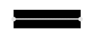
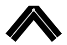
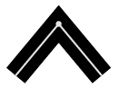
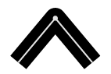

# kendo.drawing.StrokeOptions
Shape stroke configuration options.

## Fields

### color `String`
The stroke color in any of the following formats.

| Value          | Description
| ---            | --- | ---
| red            | [Basic](http://www.w3.org/TR/css3-color/#html4) or [Extended](http://www.w3.org/TR/css3-color/#svg-color) CSS Color name
| #ff0000        | Hex RGB value
| rgb(255, 0, 0) | RGB value

Specifying 'none', 'transparent' or '' (empty string) will clear the stroke.

### dashType `String` *(default: "solid")*
The stroke dash type.

| Value            |                                              | Description
| ---              | :---:                                        | ---
| `dash`           |               | a line consisting of dashes
| `dashDot`        |           | a line consisting of a repeating pattern of dash-dot
| `dot`            |                | a line consisting of dots
| `longDash`       |          | a line consisting of a repeating pattern of long-dash
| `longDashDot`    |      | a line consisting of a repeating pattern of long-dash dot
| `longDashDotDot` |  | a line consisting of a repeating pattern of long-dash dot-dot
| `solid`          |              | a solid line

### lineCap `String` *(default: "butt")*
The stroke line cap style.

| Value    |                                     | Description
| ---      | :---:                               | ---
| `butt`   |    | a flat edge with no cap
| `round`  |   | a rounded cap
| `square` |  | a square cap

### lineJoin `String` *(default: "miter")*
The stroke line join style.

| Value   |                                     | Description
| ---     | :---:                               | ---
| `bevel` |  | a beveled join
| `miter` |  | a square join
| `round` |  | a rounded join

### opacity `Number`
The stroke opacity. Ranges from 0 (completely transparent) to 1 (completely opaque).

### width `Number`
The stroke width in pixels.
