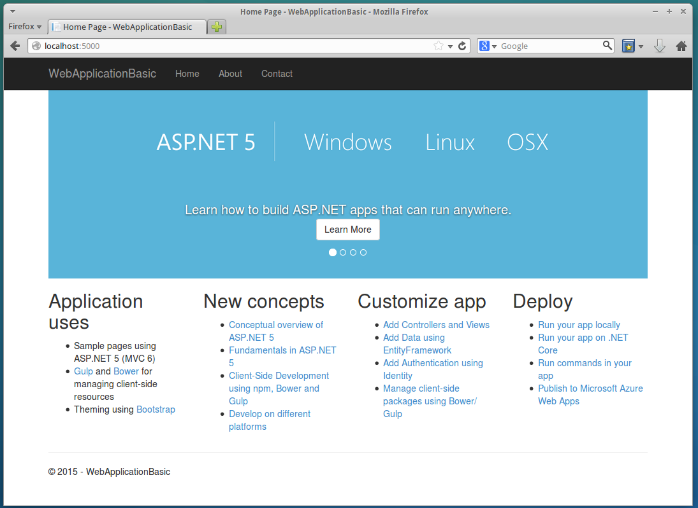
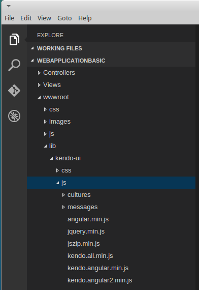

# Get Started on Linux

This article demonstrates how to configure an ASP.NET Core MVC project that enables you to use Telerik UI for ASP.NET MVC on Linux.

> **Important**  
>
> The following steps are tested on Ubuntu 14.04.

## Prerequisites

Make sure you install the [Microsoft ASP.NET (RC1)](http://docs.asp.net/en/latest/getting-started/installing-on-linux.html).

## Configuration

To configure an ASP.NET Core MVC project that enables you to use Telerik UI for ASP.NET MVC on Linux, do the following:

1. Create an ASP.NET MVC web site.
2. Add the Kendo UI NuGet package.

### Create ASP.NET Core MVC Web Sites

Below are listed the steps for you to follow when creating an ASP.NET Core MVC web site. The examples use [Yeoman](http://yeoman.io/) to scaffold an empty ASP.NET application.

> **Important**
>
> Skip this step if you are configuring an existing project.

**Step 1.** Install [Node.js](https://github.com/nodesource/distributions) v.4.x.

###### Example

        curl -sL https://deb.nodesource.com/setup_4.x | sudo -E bash -
        sudo apt-get install -y nodejs

**Step 2.** Check if the Node.js version is the desired one.

###### Example

        kendo@kendo-docker:~$ nodejs -v
        v4.2.2

**Step 3.** Install Yeoman and an [aspnet](https://github.com/omnisharp/generator-aspnet#readme) generator.

###### Example

        sudo npm install -g yo generator-aspnet

**Step 4.** Navigate to the folder where you want to create the project folder using Terminal.

###### Example

        kendo@kendo-docker:~$ mkdir Projects$
        kendo@kendo-docker:~$ cd Projects/
        kendo@kendo-docker:~/Projects$

**Step 5.** Type the command from the example below.

###### Example

        yo aspnet

As a result, the response demonstrated in the example below is shown.

###### Example

        kendo@kendo-docker:~/Projects$ yo aspnet

             _-----_
            |       |    .--------------------------.
            |--(o)--|    |      Welcome to the      |
           `---------´   |   marvellous ASP.NET 5   |
            ( _´U`_ )    |        generator!        |
            /___A___\    '--------------------------'
             |  ~  |     
           __'.___.'__   
         ´   `  |° ´ Y `

        ? What type of application do you want to create?
          Empty Application
          Console Application
          Web Application
        ❯ Web Application Basic [without Membership and Authorization]
          Web API Application
          Nancy ASP.NET Application
          Class Library
          Unit test project

**Step 6.** Select the **Web Application Basic** option by using the keyboard arrow keys and press `Enter`. Create the name of the new application. Note that you can skip this step and use the default name by pressing `Enter`. After setting the name, the generator creates the desired folder and the selected application.

As a result, the response demonstrated in the example below is shown.

###### Example

        Your project is now created, you can use the following commands to get going
            cd "WebApplicationBasic"
            dnu restore
            dnu build (optional, build will also happen when it's run)
            dnx web

**Step 7.** Navigate to the created folder and execute the command from the example below.

###### Example

        dnu restore

As a result, the packages are downloaded from NuGet. The end of the response looks similar to the one demonstrated in the example below.

###### Example

        Restore complete, 10070ms elapsed

        Feeds used:
            https://api.nuget.org/v3-flatcontainer/
        kendo@kendo-docker:~/Projects/WebApplicationBasic$

**Step 8.** Start the application by using the command from the example below.

###### Example

        dnx web

As a result, the response demonstrated in the example below is delivered.

###### Example

        Hosting environment: Production
        Now listening on: http://localhost:5000
        Application started. Press Ctrl+C to shut down.

**Step 9.** Use your favorite browser to navigate to the above location and make sure the application is working in the way shown below. After checking the application in the browser, stop the server.

**Figure 1. The web application in the browser**

### Add NuGet Packages

**Step 1.** Open the `project.json` file, using a text editor, and add the `Kendo.Mvc` dependency.

###### Example

        "dependencies": {
            ...
            "Kendo.Mvc": "2015.3.1120"
        }

**Step 2.** Navigate to the project folder and restore the packages again.

###### Example

        dnu restore

**Step 3.** Open `Startup.cs`, using a text editor (IDE), and locate the `ConfigureServices` method. Add the snippet demonstrated in the example below.

###### Example

        // Register UI for ASP.NET MVC helpers
        services.AddKendo();

**Step 4.** Import the `Kendo.Mvc.UI` namespace in `~/Views/_ViewImports.cshtml`.

###### Example

        @using Kendo.Mvc.UI

**Step 5.** Copy the Kendo UI client-side resources.

* **Manual installation**

Copy the `js` and `styles` folders from the `telerik.ui.for.aspnetmvc` archive to `wwwroot\lib\kendo-ui`.

**Figure 2. Kendo UI resources**

* **[Kendo UI Professional Bower package installation]()**

**Step 6.** Register Kendo UI styles and scripts in `~/Views/Shared/Layout.cshtml`.

###### Example

        <head>
        ...

        <link rel="stylesheet" href="~/lib/kendo-ui/styles/kendo.common-bootstrap.min.css" />
        <link rel="stylesheet" href="~/lib/kendo-ui/styles/kendo.bootstrap.min.css" />
        <link rel="stylesheet" href="~/lib/kendo-ui/styles/kendo.dataviz.bootstrap.min.css" />
        </head>
        <body>
        ...

        
        

        @RenderSection("scripts", required: false)
        </body>

**Step 7.** Use a Kendo UI widget by adding the snippet demonstrated in the example below to `~/Views/Home/Index.cshtml`.

###### Example

        <h2>Kendo UI DatePicker</h2>

        @(Html.Kendo().DatePicker()
                .Name("datepicker")
                .Deferred()
        )

        @section scripts {
            @Html.Kendo().DeferredScripts()
        }

**Step 8.** Navigate to the project folder by using the Terminal and run it using the command shown in the example below.

###### Example

        dnx web

Now that all is done, you can see the sample page.

**Figure 3. The end result&mdash;a sample page**

## See Also

Other articles on Telerik UI for ASP.NET MVC in ASP.NET Core MVC applications:

* [Overview of Telerik UI for ASP.NET Core MVC - RC1]()
* [Get Started with Telerik UI for ASP.NET MVC in ASP.NET Core MVC Projects]()
* [Known Issues with Telerik UI for ASP.NET Core MVC]()
* [Tag Helpers for ASP.NET Core MVC]()
