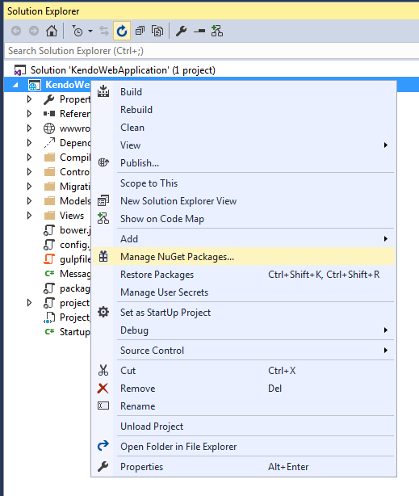
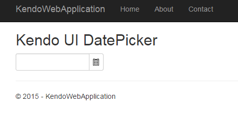

# Get Started

This article demonstrates how to configure an ASP.NET Core MVC project to use Telerik UI for ASP.NET MVC.

## Prerequisites

1. Download [Visual Studio 2015](https://www.visualstudio.com/en-us/downloads/download-visual-studio-vs.aspx).
2. Download [Microsoft ASP.NET and Web Tools 2015 (RC1)](https://www.microsoft.com/en-us/download/details.aspx?id=49959).

## Configuration

To configure an ASP.NET Core MVC project to use Telerik UI for ASP.NET MVC, do the following:

1. Create an ASP.NET MVC web site.
2. Add the Kendo UI NuGet package.

### Create ASP.NET Core MVC Web Sites

Below are listed the steps for you to follow when creating an ASP.NET Core MVC web site.

> **Important**
>
> Skip this step if you are configuring an existing project.

**Step 1** Select **File** > **New Project**.

**Step 2** Choose **Templates** > **Visual C#** > **Web** > **ASP.NET Web Application**.

**Step 3** Set a name and location for the project.

**Step 4** Select **ASP.NET 5 Preview Templates** > **Web Site** from the project templates.

**Step 5** Click **OK** to create the project.

### Add NuGet Packages

Set up the [Telerik NuGet Private Feed](#set-up-nuget-package-source) before continuing.

**Step 1** Open the NuGet Package Manager.

**Figure 1. The NuGet package manager**

**Step 2** Choose the [Telerik package source](#set-up-nuget-package-source) and search for `Kendo.Mvc`. Preview releases are also available on `api.nuget.org`.

**Step 3** Install the `Kendo.Mvc` package version 2015.2.909 or later. This should add a line to you `project.json` similar to the one shown below.

###### Example

        "dependencies": {
            ...
            "Kendo.Mvc": "2016.1.301"
        }

**Step 4** Open `Startup.cs` and locate the `ConfigureServices` method. Add the snippet from the example below.

###### Example

        // Register UI for ASP.NET MVC helpers
        services.AddKendo();

**Step 5** Import the `Kendo.Mvc.UI` namespace in `~/Views/_ViewImports.cshtml`.

###### Example

        @using Kendo.Mvc.UI

**Step 6** Copy the Kendo UI client-side resources.

* **Manual installation**

Copy the `js` and `styles` folders from the `telerik.ui.for.aspnetmvc` archive to `wwwroot\lib\kendo-ui`.

**Figure 2. Kendo UI resources**

* **[Kendo UI Professional Bower package installation]()**

**Step 7** Register the Kendo UI styles and scripts in `~/Views/Shared/Layout.cshtml`.

###### Example

        <head>
        ...

        <environment names="Development">
            ...

            <link rel="stylesheet" href="~/lib/kendo-ui/styles/kendo.common-nova.min.css" />
            <link rel="stylesheet" href="~/lib/kendo-ui/styles/kendo.nova.min.css" />
        </environment>
        <environment names="Staging,Production">
            ...

            <link rel="stylesheet"
                  href="https://kendo.cdn.telerik.com/{{ site.cdnVersion }}/styles/kendo.common-nova.min.css"
                  asp-fallback-href="~/lib/kendo-ui/styles/kendo.common-nova.min.css"
                  asp-fallback-test-class="k-common-test-class"
                  asp-fallback-test-property="opacity" asp-fallback-test-value="0" />

            <link rel="stylesheet"
                   href="https://kendo.cdn.telerik.com/{{ site.cdnVersion }}/styles/kendo.nova.min.css"
                  asp-fallback-href="~/lib/kendo-ui/styles/kendo.nova.min.css"
                  asp-fallback-test-class="k-theme-test-class"
                  asp-fallback-test-property="opacity" asp-fallback-test-value="0" />
        </environment>
        </head>
        <body>

        ...

        <environment names="Development">
            ...

            @* Place Kendo UI scripts after jQuery *@
            
            
        </environment>
        <environment names="Staging,Production">
            ...

            @*  Place Kendo UI scripts after jQuery *@
            
            
        </environment>

        @RenderSection("scripts", required: false)
        </body>

<!--*-->
**Step 8** Use a Kendo UI widget.

The example below demonstrates how to use HTML helpers. Add the snippet to `~/Views/Home/Index.cshtml`.

###### Example

            <h2>Kendo UI DatePicker</h2>

            @(Html.Kendo().DatePicker()
                    .Name("datepicker")
                    .Deferred()
            )

            @* All initialization scripts are rendered to the bottom of the page, see Layout.cshtml *@
            @section scripts {
                @Html.Kendo().DeferredScripts()
            }

<!--*-->
Now that all is done, you can see the sample page.

**Figure 3. The end result&mdash;a sample page**

## See Also

Other articles on Telerik UI for ASP.NET MVC in ASP.NET Core MVC applications:

* [Overview of Telerik UI for ASP.NET Core MVC - RC1]()
* [Get Started with Telerik UI for ASP.NET MVC in ASP.NET Core MVC Projects on Linux]()
* [Known Issues with Telerik UI for ASP.NET Core MVC]()
* [Tag Helpers for ASP.NET Core MVC]()
