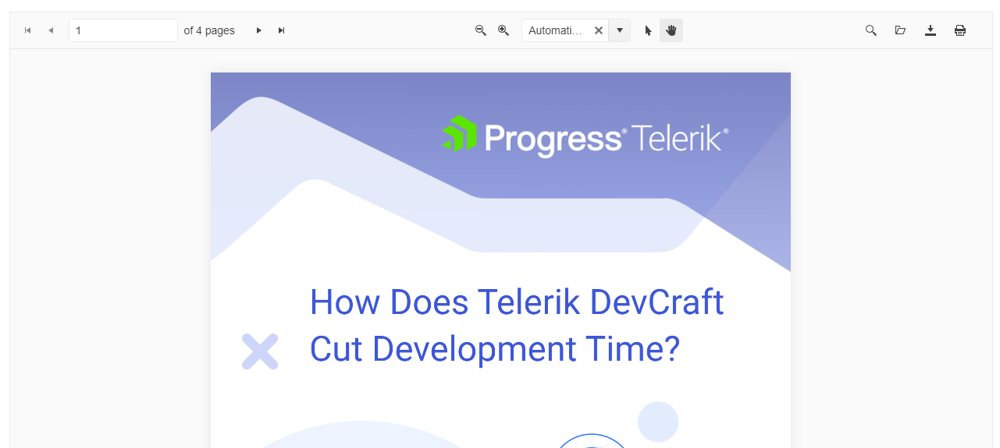

# {{ site.product }} PDFViewer Overview

The PDFViewer displays PDF files in the browser and consists of a toolbar and a scrollable container that wraps the page elements.

The default tools collection includes the `pager`, `open`, and `download` tools. For processing files, it supports the PDF.JS Processing and Telerik DPL Processing libraries. Among the key features the PDFViewer provides are the selection of a PDF processing library, a built-in paging mechanism, virtualization capabilities, a built-in default toolbar collection, and responsive capabilities and page scaling.

## Functionality and Features

* [PDFjs Processing]()&mdash;The PDFViewer uses the PDF.js library to process files.
* [DPL Processing]()&mdash;You can configure the PDFViewer to use the Telerik Document Processing Library.
* [Toolbar and Tools]()&mdash;You can configure which tools will be displayed in the PDFViewer.
* [Annotations]()&mdash;You can highlight important text areas with different colors or add free text notes in the document.
* [Form Filling]()&mdash;You can import files containing PDF forms, and fill in the input elements.

## Next Steps

* [Getting Started with the Kendo UI PDFViewer for jQuery]()
* [Overview of the PDFViewer (Demo)](https://demos.telerik.com/kendo-ui/pdfviewer/index)
* [Using the API of the PDFViewer (Demo)](https://demos.telerik.com/kendo-ui/pdfviewer/api)

## See Also

* [Basic Usage of the PDFViewer (Demo)](https://demos.telerik.com/kendo-ui/pdfviewer/index)
* [Using the API of the PDFViewer (Demo)](https://demos.telerik.com/kendo-ui/pdfviewer/api)
* [JavaScript API Reference of the PDFViewer](/api/javascript/ui/pdfviewer)
