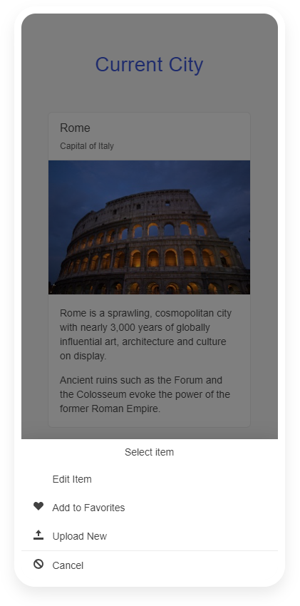

# {{ site.product }} ActionSheet Overview

The Kendo UI ActionSheet is a dialog that displays a set of options for the user to choose from. It appears on top of the app's content, and the user must manually dismiss it before resuming the interaction with the app.

## Functionality and Features

* [Items]()&mdash;The items configuration allows you to set various attributes like icons and text.
* [Events]()&mdash;The events exposed by the component allow you to implement custom functionality.
* [Accessibility]()&mdash;The ActionSheet is accessible for screen readers, supports WAI-ARIA attributes, and delivers keyboard shortcuts for faster navigation.

## Next Steps 

* [Getting Started with the Kendo UI ActionSheet for jQuery]()
* [Demo Page for the ActionSheet](https://demos.telerik.com/kendo-ui/actionsheet/index)
* [JavaScript API Reference of the ActionSheet](/api/javascript/ui/actionsheet)

## See Also

* [Overview of the ActionSheet (Demo)](https://demos.telerik.com/kendo-ui/actionsheet/index)
* [JavaScript API Reference of the ActionSheet](/api/javascript/ui/actionsheet)
