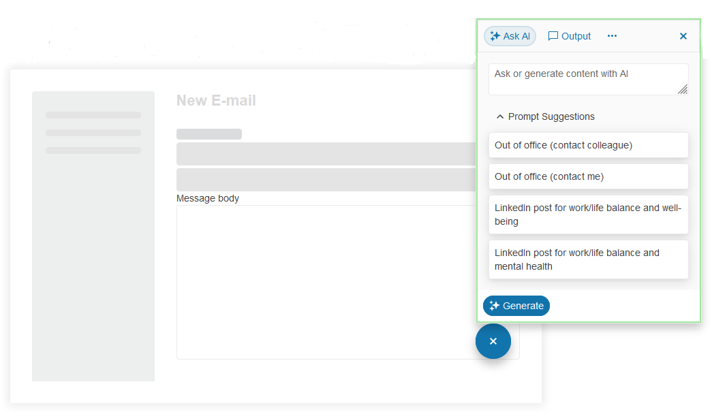

# {{ site.product }} AIPrompt Overview

The Kendo UI for jQuery AIPrompt provides users with a modern interface to interact with AI services, while enhancing usability for developers by offering smooth customization. The component brings a range of functionalities, from generating responses to writing prompts and interacting with AI outputs, to executing a set of predefined commands. 

## Functionality and Features

* [Views]()&mdash;You can configure the available views in the component. You can also implement a custom view.
* [Templates]()&mdash;The AIPrompt allows you to customize the prompt suggestions' appearance and define a custom view by using templates.
* [Accessibility]()&mdash;The AIPrompt is accessible for screen readers, supports WAI-ARIA attributes, and delivers keyboard shortcuts for faster navigation.
* [Output Actions]()&mdash;The AIPrompt autput actions are interactive controls shown on every generated output card in the `Output` view of the AIPrompt.

## Next Steps 

* [Getting Started with the Kendo UI AIPrompt for jQuery]()
* [Demo Page for the AIPrompt](https://demos.telerik.com/kendo-ui/aiprompt/index)
* [JavaScript API Reference of the AIPrompt](/api/javascript/ui/aiprompt)

## See Also

* [Overview of the AIPrompt (Demo)](https://demos.telerik.com/kendo-ui/aiprompt/index)
* [JavaScript API Reference of the AIPrompt](/api/javascript/ui/aiprompt)
