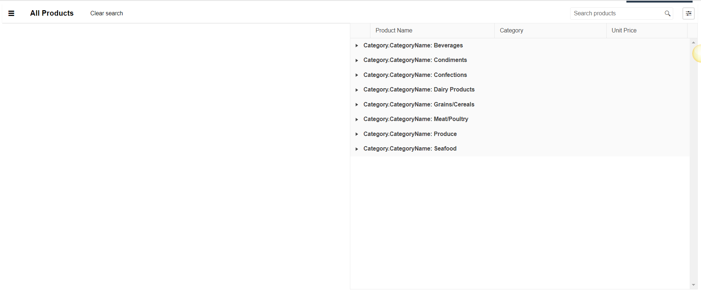

# {{ site.product }} AppBar Overview

The AppBar component is used mainly for navigation. At the same time, it is template-driven, which makes it very flexible—it can render whatever you throw at it. To take full advantage of its functionality, you can include various [Content Items]() in the AppBar component.

## Functionality and Features

* [Items]()—The AppBar exposes various options for its items.
* [Position]()—The AppBar provides different positioning options.

## Next Steps 

* [Getting Started with the Kendo UI AppBar for jQuery]()
* [Basic Usage of the AppBar (Demo)](https://demos.telerik.com/kendo-ui/appbar/index)
* [JavaScript API Reference of the AppBar](/api/javascript/ui/appbar)

## See Also

* [Overview of the AppBar (Demo)](https://demos.telerik.com/kendo-ui/appbar/index)
* [JavaScript API Reference of the AppBar](/api/javascript/ui/appbar)
