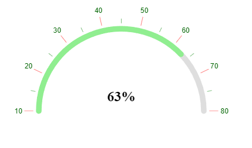

# {{ site.product }} ArcGauge Overview

The ArcGauge represents a value on a circular arc.

All graphics render on the client by using the [Scalable Vector Graphics (SVG)](https://en.wikipedia.org/wiki/Scalable_Vector_Graphics) format.

## Functionality and Features

* [Color ranges]()—The component allows you to set different colors for each range.
* [Scale options]()—The ArcGauge provides an option to customize the scale appearance by setting labels, ticks, background color, and so on.
* [Templates]()—You can use templates to customize the ArcGauge center.

## Next Steps

* [Getting Started with the Kendo UI ArcGauge for jQuery]()
* [Basic Usage of the ArcGauge (Demo)](https://demos.telerik.com/kendo-ui/arc-gauge/index)
* [JavaScript API Reference of the ArcGauge](/api/javascript/dataviz/ui/arcgauge)

## See Also

* [Overview of the ArcGauge (Demo)](https://demos.telerik.com/kendo-ui/arc-gauge/index)
* [JavaScript API Reference of the ArcGauge](/api/javascript/dataviz/ui/arcgauge)
