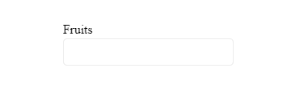

# {{ site.product }} AutoComplete Overview

The AutoComplete provides suggestions depending on the typed text and allows multiple value entries.

## Functionality and Features

* [Data binding]()&mdash;The AutoComplete enables you to bind it to local data arrays and to remote data services.
* [Grouping]()&mdash;You can use the provided options for displaying data items categorized by a specific model field of the AutoComplete.
* [Server filtering]()&mdash;The AutoComplete also allows you to perform grouping of its data server-side.
* [Templates]()&mdash;You can also control the way an AutoComplete item or the AutoComplete popup header and footer are rendered by using the Kendo UI templates.
* [Virtualization]()&mdash;The AutoComplete enables you to display large datasets by using a fixed amount of list items in its popup list.
* [Appearance]()&mdash;You can use the available styling options for configuring the size, border radius, and fill mode of the AutoComplete.
* [Prefix and suffix]()&mdash;The AutoComplete component lets you add custom content as prefix and suffix adornments.

## See Also

* [Basic Usage of the Kendo UI for jQuery AutoComplete (Demo)](https://demos.telerik.com/kendo-ui/autocomplete/index)
* [Using the API of the jQuery AutoComplete (Demo)](https://demos.telerik.com/kendo-ui/autocomplete/api)
* [JavaScript API Reference of the AutoComplete](/api/javascript/ui/autocomplete)
