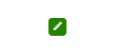

# {{ site.product }} Badge Overview

The Badge is an absolutely positioned element that is used to decorate avatars, navigation menus, or other components in the application when the visual notification is needed.

It also provides customizing its content through templates, setting different shapes and layouts.

## Functionality and Features

* [Appearance]()&mdash;Add different styles to the component based on its content.

## Next Steps

* [Getting Started with the Kendo UI Badge for jQuery]()
* [Basic Usage of the Badge (Demo)](https://demos.telerik.com/kendo-ui/badge/index)
* [Basic Templates in the Badge (Demo)](https://demos.telerik.com/kendo-ui/badge/templates)

## See Also

* [Use Badge as a label (Demo)](https://demos.telerik.com/kendo-ui/badge/labels)
* [Applying the Badge API (Demo)](https://demos.telerik.com/kendo-ui/badge/api)
* [JavaScript API Reference of the Badge](/api/javascript/ui/badge)
