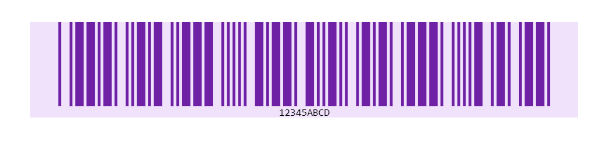

# {{ site.product }} Barcode Overview

The Barcode represents data in a machine-readable format.

All graphics are rendered on the client by using [Scalable Vector Graphics (SVG)](https://www.w3.org/Graphics/SVG/).

## Functionality and Features  

* [Encoding]()&mdash;The Barcode supports a set of encoding(symbology) types.

## Next Steps

* [Getting Started with the Kendo UI Barcode for jQuery]()
* [Encoding in the Barcode]()

## See Also

* [Basic Usage of the Barcode (Demo)](https://demos.telerik.com/kendo-ui/barcode/index)
* [Using the API of the Barcode (Demo)](https://demos.telerik.com/kendo-ui/barcode/api)
* [JavaScript API Reference of the Barcode](/api/javascript/dataviz/ui/barcode)
