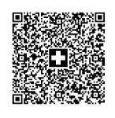

Kendo UI QRCode supports different types of overlay.

# Swiss QR Type

The QRCode component supports the [Swiss QR Code format](https://blog.xsuite.com/en/swiss-qr-code). Enabling the `swiss` type of the overlay will add a swiss cross in the QRCode.

The following implementation demonstrates the code needed for the Swiss Type:

```
<div id="example" class="demo-section k-content center">
    <div class="qr-wrapper">
            <h3>Swiss</h3>
            <div id="qrSwiss"></div>
    </div>
    <script type="text/javascript">
        $(document).ready(function () {

            $("#qrSwiss").kendoQRCode({
                value: "SPC  0200  1  CH4431999123000889012  S  Robert Schneider AG  Rue du Lac  1268  2501  Biel  CH  1949.75  CHF  S  Pia-Maria Rutschmann-Schnyder  Grosse Marktgasse  28  9400  Rorschach  CH  QRR  210000000003139471430009017 Order of 15 June 2020  EPD  //S1/10/10201409/11/200701/20/140.000-53/30/102673831/31/200615/32/7.7/33/7.7:139.40/40/0:30  Name AV1: UV;UltraPay005;12345  Name AV2: XY;XYService;54321",
                size: 173,
                overlay: {
                    type: "swiss",
                    height: 26,
                    width: 26
                }
            });
        });

    </script>

    <style>
        .k-qrcode {
            display: inline-block;
            margin: 10px 0 0;
            border: none;
        }
    </style>
</div>

```
Overview of the Swiss Type:



* [Demo showing Swiss QRCode format](https://demos.telerik.com/kendo-ui/qrcode/swiss)

# QRCode Image Type

The image type of the overlay is adding an image in the QRCode.

The following implementation demonstrates the code needed for the Image Type:

```
<div id="example" class="demo-section k-content center">
    <div class="qr-wrapper">
        <h3>Image</h3>
        <div id="qrImage"></div>
    </div>
    <script type="text/javascript">
        $(document).ready(function () {

            $("#qrImage").kendoQRCode({
                value: "https://docs.telerik.com/kendo-ui/controls/barcodes/qrcode/types",
                size: 173,
                overlay: {
                    imageUrl: "https://demos.telerik.com/kendo-ui/content/shared/images/site/kendoka-cta.svg",
                    width: 40,
                    height: 40
                }
            });
        });

    </script>

    <style>
        .k-qrcode {
            display: inline-block;
            margin: 10px 0 0;
            border: none;
        }
    </style>
</div>

```
Overview of the Image Type:


* [Demo of QRCode with image](https://demos.telerik.com/kendo-ui/qrcode/image)

## See Also

* [Basic Usage of the QRCode (Demo)](https://demos.telerik.com/kendo-ui/qrcode/index)
* [Using the API of the QRCode (Demo)](https://demos.telerik.com/kendo-ui/qrcode/api)
* [Knowledge Base Section](/knowledge-base)
* [JavaScript API Reference of the QRCode](/api/javascript/dataviz/ui/qrcode)
