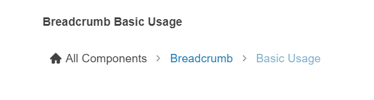

# {{ site.product }} Breadcrumb Overview

The Breadcrumb is an intuitive UI component that allows navigation within a folder structure or web page. It provides an easy way to navigate backwards by one or multiple steps.

## Functionality and Features

* [Icons]()&mdash;The Breadcrumb allows you to configure the icons of the items and the delimiters.
* [Items]()&mdash;You can set specific attributes to the Breadcrumb items.
* [Editing]()&mdash;You can edit the path set through the Breadcrumb component.
* [Navigation]()&mdash;The Breadcrumb allows automatic navigation to its items.
* [Overflowing]()&mdash;When the width of the Breadcrumb is insufficient to display the entire path, the component will show only the items that fit the available space.
* [Accessibility]()&mdash;The Breadcrumb is accessible by screen readers and provides WAI-ARIA, Section 508, WCAG 2.2, and keyboard support.

## Next Steps 

* [Getting Started with the Kendo UI Breadcrumb for jQuery]()
* [Overview of the Breadcrumb (Demo)](https://demos.telerik.com/kendo-ui/breadcrumb/index)
* [JavaScript API Reference of the Breadcrumb](/api/javascript/ui/breadcrumb)

## See Also

* [Product Page of the Kendo UI for jQuery DateInput](https://www.telerik.com/kendo-jquery-ui/breadcrumb)
* [Demo Pages for the jQuery Breadcrumb](https://demos.telerik.com/kendo-ui/breadcrumb/index)
* [Knowledge Base Section](/knowledge-base)
