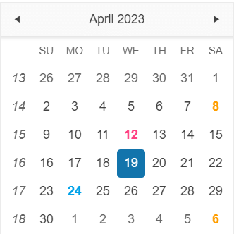

# {{ site.product }} Calendar Overview

The Kendo UI for jQuery Calendar renders a graphical calendar that provides navigation and selection functionalities.

The component also supports custom templates for its Month view and configuration options for minimum and maximum dates, a start view, and the depth of the navigation. The first day of the week depends on the applied [culture]().

## Functionality and Features

* [Selected dates]()&#8211;You can render dates as initially selected before the Calendar is initialized.
* [Disabled dates]()&#8211;The Calendar allows you to disable dates so that they cannot be selected by the user.
* [Start date and navigation depth]()&#8211;The Calendar enables you to set its starting view.
* [Day template]()&#8211;You can modify the appearance of one or more Calendar days.
* [Week numbers]()&#8211;The Calendar also enables you to showcase the week number.
* [Selection]()&#8211;You can also enable the user to select one or more Calendar dates.
* [Accessibility]()&#8211;The Calendar is accessible for screen readers, supports WAI-ARIA attributes, and delivers keyboard shortcuts for faster navigation.

## Next Steps

* [Getting Started with the Kendo UI Calendar for jQuery]()
* [Basic Usage of the jQuery Calendar (Demo)](https://demos.telerik.com/kendo-ui/calendar/index)
* [JavaScript API Reference of the Calendar](/api/javascript/ui/calendar)

## See Also

* [Product Page of the Kendo UI for jQuery Calendar](https://www.telerik.com/kendo-jquery-ui/calendar)
* [Demo Pages for the jQuery Calendar](https://demos.telerik.com/kendo-ui/calendar/index)
* [Knowledge Base Section](/knowledge-base)
