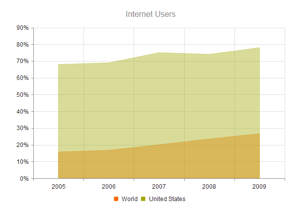
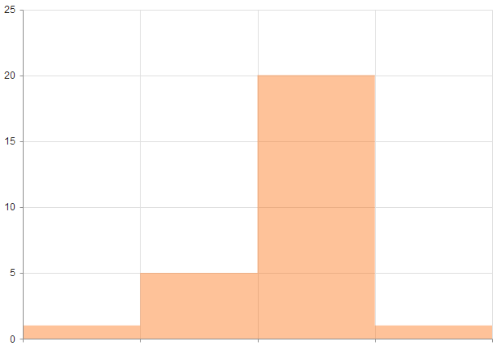
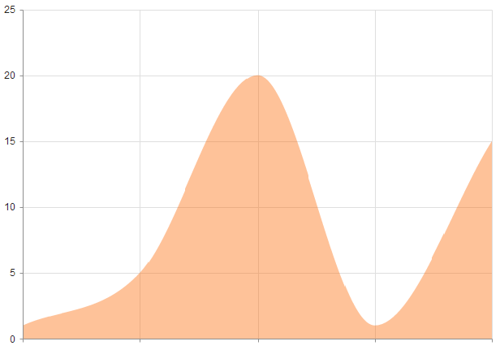

# Area Charts

Area Charts are suitable for displaying quantitative data by using continuous lines passing through points defined by the values of their items.

* [Demo page for the Area Chart](https://demos.telerik.com/kendo-ui/area-charts/index)

## Getting Started

The portion of the graph beneath the lines is filled with a particular color for each series. The different colors in an Area Chart are useful for emphasizing changes in the values which come from several sets of similar data.

To create an Area Charts series, use `area` and `verticalArea` in the `series` configuration.

* [Configuring the axes](#configuring-the-axes)
* [Configuring the line styles](#configuring-the-line-styles)

## Configuring the Axes

To configure the axes, use the `categoryAxis` and `valueAxis`. Multiple value axes are also supported.

    $("#chart").kendoChart({
        title: {
            text: "Internet Users"
        },
        legend: {
            position: "bottom"
        },
        seriesDefaults: {
            type: "area"
        },
        series: [{
            name: "World",
            data: [15.7, 16.7, 20, 23.5, 26.6]
        }, {
            name: "United States",
            data: [67.96, 68.93, 75, 74, 78]
        }],
        valueAxis: {
            labels: {
                format: "{0}%"
            }
        },
        categoryAxis: {
            categories: [2005, 2006, 2007, 2008, 2009]
        }
    });

The configuration from the previous example results in the following Area Chart.

## Configuring the Line Styles

The Area Charts support the rendering of lines between points by using different styles. You can set the supported styles through the [`line.style`](/api/javascript/dataviz/ui/chart/configuration/series.line#series.line.style) option.

The Area Chart supports the following styles:

* Normal&mdash;The default style. It produces a straight line between data points.
* Step&mdash;The style renders the connection between data points through vertical and horizontal lines. It is suitable for indicating that the value is constant between the changes.
* Smooth&mdash;This style causes the Area Chart to display a fitted curve through data points. It is suitable when the data requires to be displayed with a curve, or when you wish to connect the points with smooth instead of straight lines.

The following image displays a smooth-line Area Chart.

## See Also

* [Basic Usage of the Area Chart (Demo)](https://demos.telerik.com/kendo-ui/area-charts/index)
* [JavaScript API Reference of the Chart](/api/javascript/dataviz/ui/chart)
