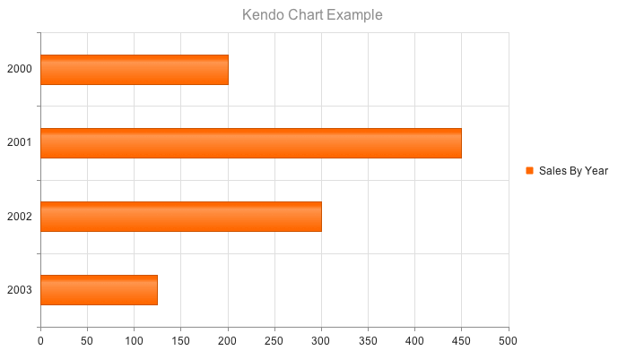

# Bar Charts

Bar Charts display data through horizontal or vertical bars whose lengths vary according to their value.

* [Demo page for the Bar Chart](https://demos.telerik.com/kendo-ui/bar-charts/index)

## Getting Started

Bar Charts are suitable for displaying a comparison between sets of data&mdash;for example, a summary of unique and total site visitors over a certain period of time.

The [Kendo UI Bullet Chart](https://demos.telerik.com/kendo-ui/bullet-charts/index) is a variation of a Kendo UI Bar Chart. You can use it as a replacement for dashboard gauges and meters. The bullet graph compares a given quantitative measure, such as temperature, against qualitative ranges, such as warm, hot, mild, cool, chilly, cold, and so on, and a symbol marker that encodes the comparative measure, such as the max temperature a year ago.

The [Kendo UI Range Bar Chart](https://demos.telerik.com/kendo-ui/range-bar-charts/index) is yet another variation of the Kendo UI Bar Chart. It displays data as bars where each bar represents a value range that spans between its minimum and maximum levels. A Range Bar type has floating bars unlike the standard Kendo UI Bar Chart that has bars that are anchored to its `x`-axis.

* [Defining a Column Chart](#defining-the-column-chart)
* [Defining a Bar Chart](#defining-the-bar-chart)

## Defining the Column Chart

The [Kendo UI Column Chart](https://demos.telerik.com/kendo-ui/bar-charts/column) is the default chart rendered if a `_type_` is not specified.

    $("#chart").kendoChart({
        title: {
            text: "Kendo Chart Example"
        },
        series: [ {
            name: "Example Series",
            data: [200, 450, 300, 125]
        } ],
        categoryAxis:{
            categories: [ 2000, 2001, 2002, 2003 ]
        }
    });

## Defining the Bar Chart

Setting the `type` property on the `series` object to `"bar"` renders horizontal bars.

    $("#chart").kendoChart({
        title: {
            text: "Kendo Chart Example"
        },
        series: [ {
            type: "bar",
            name: "Example Series",
            data: [200, 450, 300, 125]
        } ],
        categoryAxis:{
            categories: [ 2000, 2001, 2002, 2003 ]
        }
    });

## See Also

* [Basic Usage of the Bar Chart (Demo)](https://demos.telerik.com/kendo-ui/bar-charts/index)
* [JavaScript API Reference of the Chart](/api/javascript/dataviz/ui/chart)
