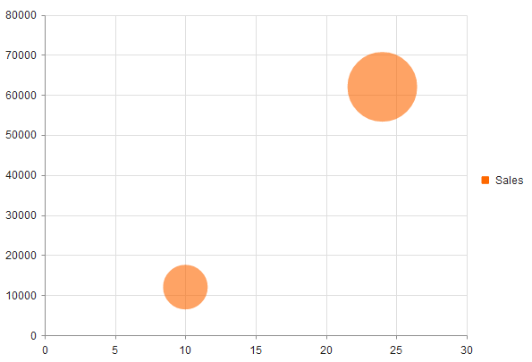

# Bubble Charts

Bubble Charts display data as points with coordinates and sizes defined by the value of their items.

* [Demo page for the Bubble Chart](https://demos.telerik.com/kendo-ui/bubble-charts/index)

## Getting Started

The Bubble Chart is similar to the [Kendo UI Scatter Charts](https://demos.telerik.com/kendo-ui/scatter-charts/index) in which the data points are replaced with bubbles. In this way a Bubble Chart displays three-dimensional data&mdash;two values for the coordinates of the items and one value for their size. A Bubble Chart is useful for visualizing different scientific relationships&mdash;for example, economic or social. The X-axis of the Bubble Charts is numerical and does not require items.

The Bubble Charts are well suited for displaying dozens to hundreds of values especially when you wish to visualize size values which differ by several orders of magnitude. As the size value is represented by a circle area, it is a best practice to plot positive values.

By default, negative values are not displayed. However, their area is going to be calculated as if their value was positive. The point label displays their actual value and they will also have a different color. To control this behavior, use the `negativeValues.visible` and `negativeValues.color` options that are applicable to each series.

To create a Bubble series in the Chart HtmlHelper, use `Bubble` in the `Series` configuration.

## Initializing the Bubble Chart

The following example demonstrates how to create a Bubble Chart and visualizes several data points.

    var salesData = [{
        numberOfSales: 10,
        volume: 12000,
        marketShare: 0.1
    }, {
        numberOfSales: 24,
        volume: 62000,
        marketShare: 0.25
    }];

    $("#chart").kendoChart({
        dataSource: {
            data: salesData
        },
        series: [{
            name: "Sales",
            type: "bubble",
            xField: "numberOfSales",
            yField: "volume",
            sizeField: "marketShare"
        }]
    });

## See Also

* [Basic Usage of the Bubble Chart (Demo)](https://demos.telerik.com/kendo-ui/bubble-charts/index)
* [JavaScript API Reference of the Chart](/api/javascript/dataviz/ui/chart)
