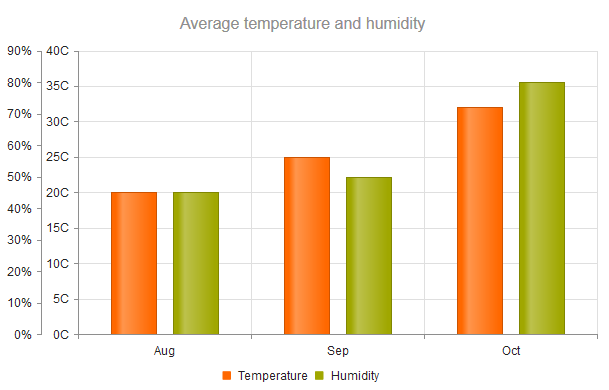
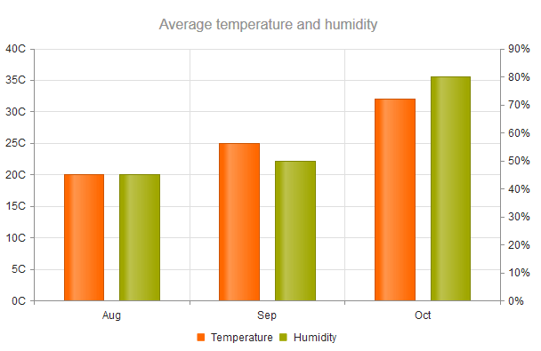

# Categorical Charts

Categorical charts use a single category axis and a single value axis.

The axis orientation (horizontal or vertical) is inferred from the series type. Categorical charts are the [Bar](https://demos.telerik.com/kendo-ui/bar-charts/index), [Column](https://demos.telerik.com/kendo-ui/bar-charts/column), and [Line Charts](https://demos.telerik.com/kendo-ui/line-charts/index).

## Setting the Category Axis

To set the category names, use the `categoryAxis` object.

    $("#chart").kendoChart({
        series: [{
            name: "World",
            data: [15.7, 16.7, 20, 23.5, 26.6]
        }],
        categoryAxis: {
            categories: [2005, 2006, 2007, 2008, 2009]
        }
    });

You can also bind the category name to a field of the data item.

    var internetUsers = [ {
        "country": "United States",
        "year": "2005",
        "value": 67.96
        }, {
        "country": "United States",
        "year": "2006",
        "value": 68.93
    }];

    $("#chart").kendoChart({
        dataSource: {
            data: internetUsers
        },
        series: [{
            field: "value",
            name: "United States"
        }],
        categoryAxis: {
            field: "year"
        }
    });

## Positioning the Label

The category and value axes provide options for displaying their labels either next to the axis or at the outer edges of the plot area. By default, the labels are positioned next to the axis.

To change the label position, set the [`position`](/api/javascript/dataviz/ui/chart#configuration-categoryAxis.labels.position) option of the axis labels which provides the following available options:

* (Default) When `position` is set to `"onAxis"` or `undefined`, the labels are positioned next to the axis.
* When `position` is set to `"end"`, the labels are placed at the end of the crossing axis. Typically, this configuration positions the labels at the top or right end of the Chart unless the crossing axis was reversed.
* When `position` is set to `"start"`, the labels are placed at the start of the crossing axis. Typically, this configuration positions the labels at the left or bottom end of the Chart unless the crossing axis was reversed.

    $("#container").kendoChart({
        title: {
            text: "Average temperature"
        },
        series: [{
            data: [2, -5, 8]
        }],
        categoryAxis: {
            categories: ["Aug", "Sep", "Oct"],
            labels: {
                position: 'start'
            }
        }
    });

## Setting the Value Axis

Currently, the Chart supports only numeric value axes. To access the configuration options, use the [`valueAxis`](/api/dataviz/chart#valueaxis-object) object.

The following example demonstrates how to configure a numeric axis with a minimum value of `0` and a maximum value of `100`.

$("#chart").kendoChart({
    series: [{
        name: "World",
        data: [15.7, 16.7, 20, 23.5, 26.6]
    }],
    valueAxis: {
        min: 0,
        max: 100
    },
    categoryAxis: {
        categories: [2005, 2006, 2007, 2008, 2009]
    }
});

## Setting Multiple Value Axes

A Kendo UI Chart can have more than one value axis. The additional axes must have unique names.

The following example demonstrates how to define the `temperature` and `humidity` axes. To associate a series to a value axis, specify its name.

    $("#container").kendoChart({
        title: {
            text: "Average temperature and humidity"
        },
        legend: {
            position: "bottom"
        },
        series: [{
                name: "Temperature",
                data: [20, 25, 32],
                axis: "temperature"
            }, {
                name: "Humidity",
                data: [45, 50, 80],
                axis: "humidity"
        }],
        categoryAxis: {
            categories: ["Aug", "Sep", "Oct"]
        },
        valueAxis: [{
            name: "temperature",
            labels: {
                format: "{0}C"
            }
        }, {
            name: "humidity",
            labels: {
                format: "{0}%"
            }
        }]
    });

The previous example results in the following output.

## Arranging the Value Axes

You can also control the arrangement of the value axes by specifying the values (category indices) at which they cross the category axis. In the following example, the first value axis crosses the category axis at the first category (leftmost). The second value axis crosses it at the last category.

    categoryAxis: {
        categories: ["Aug", "Sep", "Oct"],
        axisCrossingValue: [0, 3]
    }

The previous example results in the following output.

## See Also

* [Using the API of the Chart (Demo)](https://demos.telerik.com/kendo-ui/chart-api/index)
* [Basic Usage of the Bar Chart (Demo)](https://demos.telerik.com/kendo-ui/bar-charts/index)
* [Basic Usage of the Line Chart (Demo)](https://demos.telerik.com/kendo-ui/line-charts/index)
* [JavaScript API Reference of the Chart](/api/javascript/dataviz/ui/chart)
