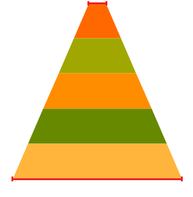
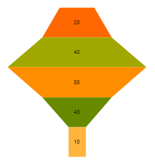

# Funnel Charts

Funnel Charts display a single series of data in progressively decreasing or increasing proportions, organized in segments, where each segment represents the value for the particular item from the series. The values of the items can also influence the height and the shape of the corresponding segments.

Funnel Charts are suitable for representing stages in a sales process and for showing the amount of the potential revenue from each stage. They are also useful when identifying potential problem areas in the sales processes of an organization. Funnel Charts are similar to the [Stacked Bar Charts](https://demos.telerik.com/aspnet-core/bar-charts/stacked-bar) and are well suited for displaying several values.

* [Demo page for the Funnel Chart](https://demos.telerik.com/kendo-ui/funnel-charts/index)

## Concepts

The basic conceptual options of a Kendo UI Funnel Chart are:

* `dynamicHeight`&mdah;It specifies whether the different elements should have equal height, when equal to `false`, or the height of each element should be based on its value.
* `dynamicSlope`&mdash;When disabled, the `neckRatio` option is taken into account. When enabled, the `neckRatio` is neglected and each segment creates its form based on the ratio between the current value and the next value.
* `neckRatio`&mdash;It specifies the ratio between the top and the bottom bases of the whole funnel series. For example, if set to `ten`, the top base will be ten times smaller than the bottom base, as demonstrated below.

## Getting Started

The following example demonstrates how to configure a basic Funnel chart.

    

    

## Dynamic Slope

The following example demonstrates how to base the widths of the bases for each segment on the "current value" to "next value" ratio using the `dynamicSlope` setting.

    

    

## Fixed Height

The following example demonstrates how to set equal height of all segments by disabling the `dynamicHeight` setting.

    

    

## See Also

* [Basic Usage of the Funnel Chart (Demo)](https://demos.telerik.com/kendo-ui/funnel-charts/index)
* [JavaScript API Reference of the Chart](/api/javascript/dataviz/ui/chart)
