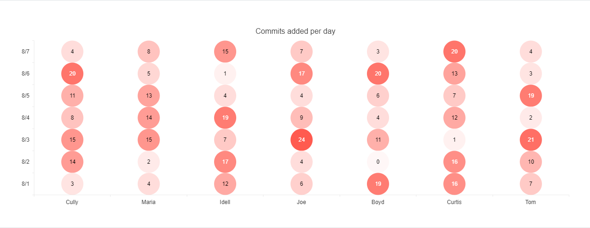

# Heatmap

Heatmaps use colors to indicate the relative value of data points in two dimensions.

Heatmap, also known as "cluster heat map", are suitable for visualizing the magnitude of a value over two dimensions. The X and Y values are discrete and can be set in any order.

* [Demo page for the Heatmap](https://demos.telerik.com/kendo-ui/heatmap/index)

## Getting Started

Each data point of a Heatmap is an array that contains `X category`, `Y category` and `value` values.

* [Creating the Heatmap](#creating-the-heatmap-chart)
* [Setting the marker type](#setting-the-marker-type)

## Creating the Heatmap

The following example demonstrates how to configure a basic Heatmap.

    $("#heatmap").kendoChart({
        series: [{
            name: "Number of commits per day",
            type: 'heatmap',
            data: [
                ['Cully', new Date(2021, 7, 7), 4],['Cully', new Date(2021, 7, 6), 20],['Cully', new Date(2021, 7, 5), 11],['Cully', new Date(2021, 7, 4), 8],['Cully', new Date(2021, 7, 3), 15],['Cully', new Date(2021, 7, 2), 14],['Cully', new Date(2021, 7, 1), 3],
                ['Maria', new Date(2021, 7, 7), 8],['Maria', new Date(2021, 7, 6), 5],['Maria', new Date(2021, 7, 5), 13],['Maria', new Date(2021, 7, 4), 14],['Maria', new Date(2021, 7, 3), 15],['Maria', new Date(2021, 7, 2), 2],['Maria', new Date(2021, 7, 1), 4],
                ['Idell', new Date(2021, 7, 7), 15],['Idell', new Date(2021, 7, 6), 1],['Idell', new Date(2021, 7, 5), 4],['Idell', new Date(2021, 7, 4), 19],['Idell', new Date(2021, 7, 3), 7],['Idell', new Date(2021, 7, 2), 17],['Idell', new Date(2021, 7, 1), 12],
                ['Joe', new Date(2021, 7, 7), 7],['Joe', new Date(2021, 7, 6), 17],['Joe', new Date(2021, 7, 5), 4],['Joe', new Date(2021, 7, 4), 9],['Joe', new Date(2021, 7, 3), 24],['Joe', new Date(2021, 7, 2), 4],['Joe', new Date(2021, 7, 1), 6],
                ['Boyd', new Date(2021, 7, 7), 3],['Boyd', new Date(2021, 7, 6), 20],['Boyd', new Date(2021, 7, 5), 6],['Boyd', new Date(2021, 7, 4), 4],['Boyd', new Date(2021, 7, 3), 11],['Boyd', new Date(2021, 7, 2), 0],['Boyd', new Date(2021, 7, 1), 19],
                ['Curtis', new Date(2021, 7, 7), 20],['Curtis', new Date(2021, 7, 6), 13],['Curtis', new Date(2021, 7, 5), 7],['Curtis', new Date(2021, 7, 4), 12],['Curtis', new Date(2021, 7, 3), 1],['Curtis', new Date(2021, 7, 2), 16],['Curtis', new Date(2021, 7, 1), 16],
                ['Tom', new Date(2021, 7, 7), 4],['Tom', new Date(2021, 7, 6), 3],['Tom', new Date(2021, 7, 5), 19],['Tom', new Date(2021, 7, 4), 2],['Tom', new Date(2021, 7, 3), 21],['Tom', new Date(2021, 7, 2), 10],['Tom', new Date(2021, 7, 1), 7]
            ]
        }],
        legend: {
            position: "bottom"
        },
        xAxis: {
            categories: ['Cully', 'Maria', 'Idell', 'Joe', 'Boyd', 'Curtis', 'Tom'],
            labels: {
                rotation: 'auto'
            },
        },
        yAxis: {
            categories: [new Date(2021, 7, 1),
                new Date(2021, 7, 2),
                new Date(2021, 7, 3),
                new Date(2021, 7, 4),
                new Date(2021, 7, 5),
                new Date(2021, 7, 6),
                new Date(2021, 7, 7)]
        }
    });

The following image shows a sample Heatmap.

## Setting the Marker Type

The default marker type of a Heatmap is `rect`. You can change this value by using the `markers` option.

    series: [{
        type: 'heatmap',
        markers: {
            type: "circle"
        }
    }]

The available built-in options are:

- `rect`—The markers appear as rectangles.
- `roundedRect`—The markers appear as rounded rectangles with a configurable [border radius](/api/javascript/dataviz/ui/chart/configuration/series.markers.borderRadius).
- `circle`—The markers appear as circles.
- `triangle`—The markers appear as triangles.

For a runnable example on the `markers` configuration, visit the [demo page for the Heatmap Markers](https://demos.telerik.com/kendo-ui/heatmap/markers).

The following image shows a sample Heatmap with circular markers.

## See Also

* [Overview of the Heatmap (Demo)](https://demos.telerik.com/kendo-ui/heatmap/index)
* [Heatmap Markers (Demo)](https://demos.telerik.com/kendo-ui/heatmap/markers)
* [JavaScript API Reference of the Chart](/api/javascript/dataviz/ui/chart)
