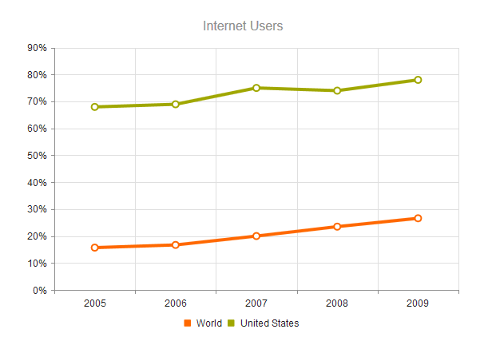
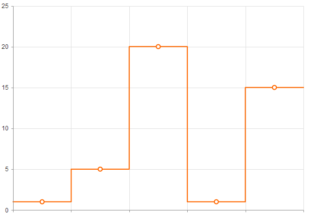
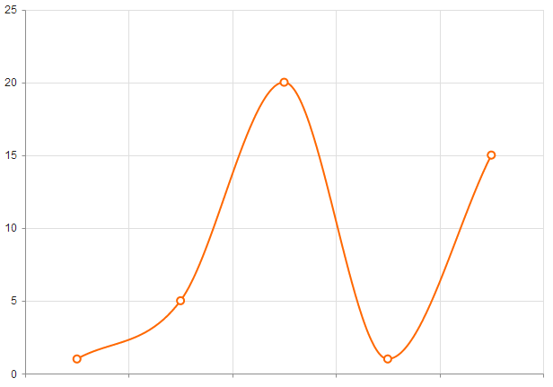

# Line Charts

Line Charts are suitable for displaying quantitative data by using continuous lines passing through points defined by the values of their items.

* [Demo page for the Line Chart](https://demos.telerik.com/kendo-ui/line-charts/index)

## Getting Started

You can use the Line Chart to render a trend over time and compare sets of similar data.

To create a Line series, use `line` in the `series` configuration.

* [Setting the orientation](#setting-the-orientation)
* [Configuring the line styles](#configuring-the-line-styles)
* [Setting the line type](#setting-the-line-type)

## Setting the Orientation

You can change the orientation of the Line Chart by setting the series type to `verticalLine`.

    $("#chart").kendoChart({
        title: {
            text: "Internet Users"
        },
        legend: {
            position: "bottom"
        },
        seriesDefaults: {
            type: "line"
        },
        series: [{
            name: "World",
            data: [15.7, 16.7, 20, 23.5, 26.6]
        }, {
            name: "United States",
            data: [67.96, 68.93, 75, 74, 78]
        }],
        valueAxis: {
            labels: {
                format: "{0}%"
            }
        },
        categoryAxis: {
            categories: [2005, 2006, 2007, 2008, 2009]
        }
    });

## Configuring the Line Styles

You can render the lines between the points by setting different styles through the [`style`](/api/dataviz/chart#configuration-series.style) option.

The supported line styles are:

* Normal&mdash;This is the default style. It produces a straight line between data points.
* Step&mdash;This style renders the connection between data points through vertical and horizontal lines. It is suitable for indicating that the value is constant between the changes.
* Smooth&mdash;This style causes the Line Chart to display a fitted curve through data points. It is suitable when the data requires to be displayed with a curve, or when you wish to connect the points with smooth instead of straight lines.

The following image displays a smooth-line Line Chart.

## Setting the Line Type

The default line type of a Line Chart is solid. You can implement the dash line styles by using the `dashType` option.

  series: [{
      name: "World",
      data: [15.7, 16.7, 20, 23.5, 26.6],
      dashType: "dot"
  }]

## See Also

* [Basic Usage of the Line Chart (Demo)](https://demos.telerik.com/kendo-ui/line-charts/index)
* [JavaScript API Reference of the Chart](/api/javascript/dataviz/ui/chart)
