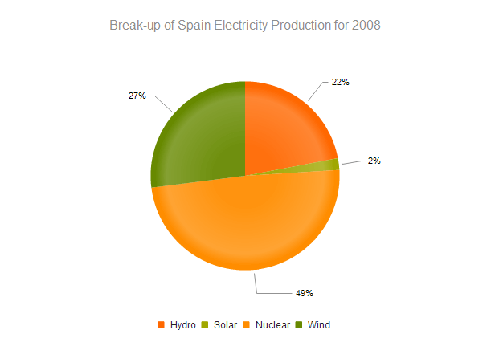
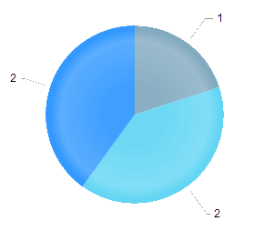
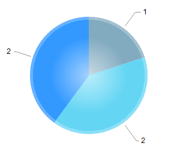

# Pie Charts

Pie Charts display data as single-series sectors from a two-dimensional circle which is useful for rendering data as a part of the whole.

* [Demo page for the Pie Chart](https://demos.telerik.com/kendo-ui/pie-charts/index)

## Getting Started

The [Kendo UI Donut Chart](https://demos.telerik.com/kendo-ui/donut-charts/index) is a Pie Chart variation with the same ability to display a single data series in a two-dimensional circle and is likewise useful for displaying data as a part of the whole.

To create a Pie series in the Chart HtmlHelper, use `Pie` in the `Series` configuration.

* [Creating the Pie Chart](#creating-the-pie-chart)
* [Configuring the effects overlay](#configuring-the-effects-overlay)

## Creating the Pie Chart

The following example demonstrates how to define a single series of type `"pie"`. Additional series are not supported and each data point is an object that specifies the point value, category label, and other properties.

    $("#chart").kendoChart({
        title: {
            text: "Break-up of Spain Electricity Production for 2008"
        },
        legend: {
            position: "bottom"
        },
        seriesDefaults: {
            labels: {
                visible: true,
                format: "{0}%"
            }
        },
        series: [{
            type: "pie",
            data: [ {
                category: "Hydro",
                value: 22
            }, {
                category: "Solar",
                value: 2
            }, {
                category: "Nuclear",
                value: 49
            }, {
                category: "Wind",
                value: 27
            } ]
        }]
    });

## Configuring the Effects Overlay

Each segment has a transparent effect overlay that adds depth to the two-dimensional shape. The overlay transparent gradient is configurable.

    $("#chart").kendoChart({
        series: [{
            type: "pie",
            overlay: {
                gradient: "none"
            }
        }]
    });

The Pie Chart supports the following gradient options:

* (Default) `roundedBevel`

        

* `sharpBevel`

        

* `none`

        

## See Also

* [Basic Usage of the Pie Chart (Demo)](https://demos.telerik.com/kendo-ui/pie-charts/index)
* [JavaScript API Reference of the Chart](/api/javascript/dataviz/ui/chart)
