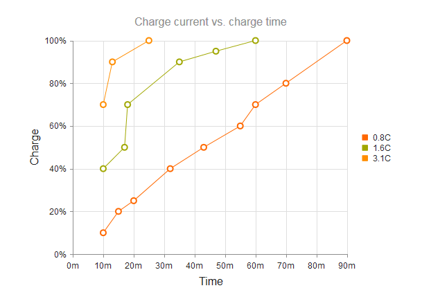
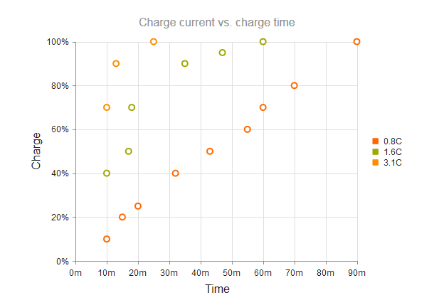

# Scatter Charts

Scatter charts display data as points that are defined by the values of their items.

Scatter Charts are useful for displaying the relation between different sets of data (for example, scientific experimental results) and plotting two-dimensional data.

* [Demo page for the Scatter Charts](https://demos.telerik.com/kendo-ui/scatter-charts/index)

## Creating the Scatter Chart

Each data point of a Scatter Chart is an array that contains the `X` and `Y` values.

    $("#chart").kendoChart({
        title: {
            text: "Charge current vs. charge time"
        },
        legend: {
            visible: true
        },
        seriesDefaults: {
            type: "scatterLine"
        },
        series: [{
            name: "0.8C",
            data: [[10, 10], [15, 20], [20, 25], [32, 40], [43, 50], [55, 60], [60, 70], [70, 80], [90, 100]]
        }, {
            name: "1.6C",
            data: [[10, 40], [17, 50], [18, 70], [35, 90], [47, 95], [60, 100]]
        }, {
            name: "3.1C",
            data: [[10, 70], [13, 90], [25, 100]]
        }],
        xAxis: {
            max: 90,
            labels: {
                format: "{0}m"
            },
            title: {
                text: "Time"
            }
        },
        yAxis: {
            max: 100,
            labels: {
                format: "{0}%"
            },
            title: {
                text: "Charge"
            }
        }
    });

## Setting the Line Type

The default line type of a Scatter Chart is solid. You can implement the dash line styles by using the `dashType` option.

  series: [{
      type: "scatterLine",
      name: "3.1C",
      data: [[10, 70], [13, 90], [25, 100]],
      dashType: "dot"
  }]

## Removing Connecting Lines

To remove the connecting lines, specify `"scatter"` instead of `"scatterLine"`.

## See Also

* [Basic Usage of the Scatter Chart (Demo)](https://demos.telerik.com/kendo-ui/scatter-charts/index)
* [JavaScript API Reference of the Chart](/api/javascript/dataviz/ui/chart)
