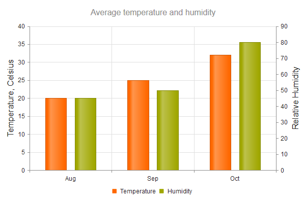
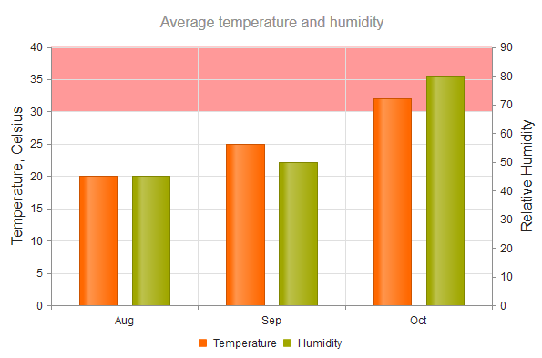

# Axes

The Chart enables you to set its [axis title](#configuring-the-title), [plot bands](#setting-the-plot-bands), and apply [global settings to all axes](#applying-global-settings).

## Configuring the Title

To clearly indicate the role of the axis, add an axis title.

    $("#container").kendoChart({
        title: {
            text: "Average temperature and humidity"
        },
        legend: {
            position: "bottom"
        },
        series: [{
                name: "Temperature",
                data: [20, 25, 32],
                axis: "temperature"
            }, {
                name: "Humidity",
                data: [45, 50, 80],
                axis: "humidity"
        }],
        categoryAxis: {
            categories: ["Aug", "Sep", "Oct"],
            axisCrossingValue: [0, 3]
        },
        valueAxis: [{
            name: "temperature",
            title: {
                text: "Temperature, Celsius"
            }
        }, {
            name: "humidity",
            title: {
                text: "Relative Humidity"
            }
        }]
    });

## Setting the Plot Bands

You can configure each axis so that it displays bands with different colors for predefined value ranges. The category index (zero based) is used as a value for the category axis.

    valueAxis: [{
        name: "temperature",
        title: {
            text: "Temperature, Celsius"
        },
        plotBands: [{
            from: 30,
            to: 40,
            color: "#f99"
        }]
        }, {
        name: "humidity",
        title: {
            text: "Relative Humidity"
        }
    }]

## Applying Global Settings

To apply settings to all axes, use the [`axisDefaults`](/api/javascript/dataviz/ui/chart#axisdefaults-object) object.

    $("#chart").kendoChart({
        series: [{
            type: "scatter",
            name: "Pentium D 915",
            data: [[120, 102]]
        }],
        axisDefaults: {
            labels: {
                font: "16px Verdana"
            }
        }
    });

## See Also

* [Using the API of the Chart (Demo)](https://demos.telerik.com/kendo-ui/chart-api/index)
* [JavaScript API Reference of the Chart](/api/javascript/dataviz/ui/chart)
