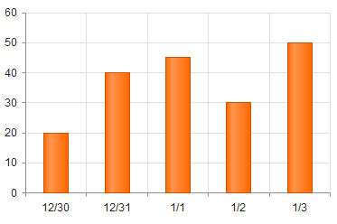
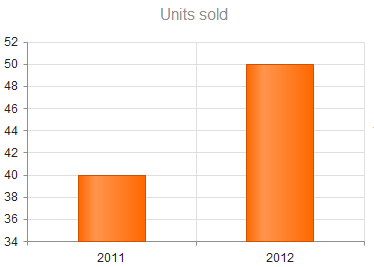

# Date Series

You can control the display of dates in the Kendo UI Chart.

## Date Series in Categorical Charts

[Categorical charts]() and other Kendo UI chart types provide built-in support for displaying dates, including the following scenarios:

* Automatic selection of granularity or base unit (minutes, hours, days, and so on).
* Label formatting that is matched to the granularity.
* Grouping of categories into base units and series aggregates.

Specifying categories of type `Date` switches the axis to a date mode. The automatic mode selection can be overridden by setting [`categoryAxis.type`](/api/dataviz/chart#configuration-categoryAxis.type) to `Date`.

### Date Binding

To bind the date series, use [`categoryField`](/api/dataviz/chart#configuration-series.categoryField). The categories (dates) for all series are sorted and merged during data binding.

### Date Grouping

If the series contain two or more values for a specific period (base unit), they are aggregated to display a single value.

> The dates have to match the source.

    

    

The following image demonstrates a chart with a set date category axis.

The following example demonstrates date series that are grouped by the year.

    

    

The following image displays a chart with a grouped date category axis. Note how the maximum value for each year is now displayed.

### Setting Aggregates

You can set an aggregate type for each series.

The following options are available:

* `min`
* (Default) `max`
* `count`
* `sum`
* `avg`
* `first`
* `function`

The following example demonstrates how to handle date grouping with the `sum` aggregate.

    

    

### Setting Base Units

To set the base units in the categorical charts, use any of the following approaches:

* [Default configuration](#default-configuration)
* [Manual configuration](#manual-configuration)
* [Automatic fitting](#automatic-fitting)
* [Labels format](#label-format)

#### Default Configuration

To determine a default base, use the smallest duration between categories.

    categoryAxis: {
        categories: [new Date(2005, 0, 1), new Date(2006, 0, 1)]
        // baseUnit is set to "years"
    }

    categoryAxis: {
        categories: [new Date(2005, 1, 1), new Date(2005, 1, 2)]
        // baseUnit is set to "days"
    }

#### Manual Configuration

You can also manually specify the [`baseUnit`](/api/dataviz/chart#configuration-categoryAxis.baseUnit). To display every nth base unit, set the [`baseUnitStep`](/api/dataviz/chart#configuration-categoryAxis.baseUnitStep) option.

The following options are valid for `baseUnit`:

* Seconds
* Minutes
* Hours
* Days
* Weeks
* Months
* Years
* [Fit](#automatic-fitting)

#### Automatic Fitting

Setting the [`baseUnit`](/api/dataviz/chart#configuration-categoryAxis.baseUnit) to `fit` constrains the total number of base units to [`maxDateGroups`](/api/dataviz/chart#configuration-categoryAxis.baseUnit). The `baseUnit` and `baseUnitStep` are selected according to the [`autoBaseUnitSteps`](/api/dataviz/chart#configuration-categoryAxis.autoBaseUnitSteps).

    

    

#### Labels Format

The date category axis provides options for specifying one format per base unit. If specified, the [`labels.format` property](/api/dataviz/chart#categoryaxis.labels.format-string) takes priority. The global `KendoUI` culture is used for formatting the dates and can be overridden by setting the `labels.culture`.

    categoryAxis: {
        labels: {
            dateFormats: {
                days: "M/d"
            }
        }
    }

## Date Series in Scatter Charts

[Scatter charts]() provide built-in support for displaying dates, including:

* Automatic selection of granularity or base unit (minutes, hours, days, and so on).
* Label formatting that is matched to the granularity.

If the series values are of type `Date`, the X and Y axes switch into date mode. To override the automatic mode selection, specify `type: "Date"`.

The following options accept dates:

* [`min`](/api/dataviz/chart#configuration-xAxis.min)
* [`max`](/api/dataviz/chart#configuration-xAxis.max)
* [`axisCrossingValue`](/api/dataviz/chart#configuration-xAxis.axisCrossingValue)

The following options are expressed in base units:

* [`minorUnit`](/api/dataviz/chart#configuration-xAxis.minorUnit)
* [`majorUnit`](/api/dataviz/chart#configuration-xAxis.majorUnit)

### Setting Base Units

To set the base units in the scatter charts, use any of the following approaches:

* [Default configuration](#default-configuration)
* [Manual configuration](#manual-configuration)
* [Labels format](#label-format)

#### Default Configuration

The default base unit is determined by the axis (or series) range.

    xAxis: {
        min: new Date(2005, 0, 1),
        max: new Date(2006, 0, 1)
        // baseUnit is set to "years"
    }

    xAxis: {
        min: new Date(2005, 1, 1),
        max: new Date(2005, 1, 2)
        // baseUnit is set to "days"
    }

#### Manual Configuration

You can also manually specify the base unit by using the following valid options:

* Seconds
* Minutes
* Hours
* Days
* Weeks
* Months
* Years

#### Labels Format

The date axis provides options for specifying one format per base unit. If specified, the [`labels.format` property](/api/dataviz/chart#xAxis.labels.format) takes priority. The global `KendoUI` culture is used for formatting the dates and can be overridden by setting the [`labels.culture`](/api/dataviz/chart#xAxis.labels.culture) property.

    xAxis: {
        labels: {
            dateFormats: {
                days: "M/d"
            }
        }
    }

## See Also

* [Using the API of the Chart (Demo)](https://demos.telerik.com/kendo-ui/chart-api/index)
* [JavaScript API Reference of the Chart](/api/javascript/dataviz/ui/chart)
