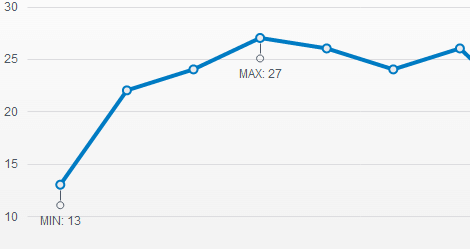

# Notes

The Kendo UI Chart enables you to display the metadata of a point or a specific part of the axis.

## Getting Started

The following example demonstrates how to add a note for each series point.

    $("#chart").kendoChart({
        dataSource: {
            data: [{
                value: 1,
                noteText: "min"
            },{
                value: 2
            },{
                value: 3,
                noteText: "max"
            }]
        },
        series: [{
            type: "line",
            field: "value",
            noteTextField: "noteText"
        }]
    });

You can also add a note to the value axis.

    $("#chart").kendoChart({
        series: [{
            data: [1, 2, 3]
        }],
        valueAxis: {
            notes: {
                data: [{
                    value: 3,
                    label: {
                        text: "max"
                    }
                }]
            }
        }
    });

## Using Templates

To provide better flexibility, define the content of the notes through a template.

The template provides access to all information that is associated with the point:

* `value`&mdash;The point value. Value dimensions are available as properties, for example, `value.x` and `value.y`.
* `category`&mdash;The category name.
* `series`&mdash;The data series.
* (When binding to a data source) `dataItem`&mdash;The original data item.

    $("#chart").kendoChart({
        dataSource: {
            data: [{
                value: 1,
                noteText: "minimum"
            },{
                value: 2
            },{
                value: 3,
                noteText: "maximum"
            }]
        },
        series: [{
            type: "line",
            field: "value",
            noteTextField: "noteText",
            notes: {
                label: {
                    position: "outside",
                    template: "#= dataItem.noteText # of the series"
                }
            }
        }]
    });

In the axis configuration, you have only `value` which represents the value of the axis.

    $("#chart").kendoChart({
        series: [{
            data: [1, 2, 3]
        }],
        valueAxis: {
            notes: {
                data: [{
                    value: 3,
                    label: {
                        position: "outside",
                        text: "max",
                        template: "#= value # series value"
                    }
                }]
            }
        }
    });

## See Also

* [Using the API of the Chart (Demo)](https://demos.telerik.com/kendo-ui/chart-api/index)
* [JavaScript API Reference of the Chart](/api/javascript/dataviz/ui/chart)
